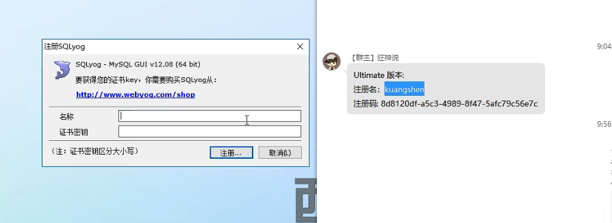

# 	初识

## 数据库的分类

#### **关系型数据库:**  （SQL）

- MySQL，Oracle，SQL Serve，SQLlite
- 通过表和表，行和列之间的关系存数据。

#### 非关系型数据库：（No SQL）

- Redis，MongoDB
- 存储对象，通过对象自身属性来决定

#### DBMS（数据库管理系统）

我们需要一个类似EXCEL的管理软件。

MySQL是一个数据库管理系统。

#### MySQL

## 安装SQLyog

SQLyog连接数据库，可以可视化操作，也可通过历史记录看SQL命令



[^DB]: Data Base

#### 关系型数据库（SQL）

- MySQL，Oracle，Sql Server，DB2，SQLlite
- 通过表与表，行与列之间的关系存数据

#### 非关系型数据库（No SQL）

- Redis，MongoDB
- 按照对象及属性存数据

#### 数据库管理系统（DBMS）

Mysql是一个使用SQL语言的数据库管理系统

## 安装

docker

```bash
docker run -itd --name mysql-test -p 3306:3306 -e MYSQL_ROOT_PASSWORD=123456 mysql

docker exec -it 74d44ff9e26e /bin/bash	#我进入了容器的bash

mysql -h localhost -u root -p 123456	#连接数据库	
```

主机

```bash
#在主机上安装MySQL出问题了，重启再安就好了，很怪 4/15 23：12
#第一次进入碰到了问题，sudo进好了
# lzq @ ubuntuqaq in ~ [23:09:29] 
$ mysql -h localhost -u root -p
Enter password: 
ERROR 1698 (28000): Access denied for user 'root'@'localhost'

# lzq @ ubuntuqaq in ~ [23:12:43] C:1
$ sudo mysql -h localhost -u root -p
Enter password: 
Welcome to the MySQL monitor.  Commands end with ; or \g.
Your MySQL connection id is 9
Server version: 8.0.28-0ubuntu0.20.04.4 (Ubuntu)

Copyright (c) 2000, 2022, Oracle and/or its affiliates.

Oracle is a registered trademark of Oracle Corporation and/or its
affiliates. Other names may be trademarks of their respective
owners.

Type 'help;' or '\h' for help. Type '\c' to clear the current input statement.

mysql> 

```

## 连接数据库

```sql
-- 单行注释
/*
多行注释
*/

-- 创建
mysql> create database test
    -> ;
Query OK, 1 row affected (0.04 sec)
-- 查看所有数据库 
mysql> show databases;
+--------------------+
| Database           |
+--------------------+
| information_schema |
| mysql              |
| performance_schema |
| sys                |
| test               |
+--------------------+
5 rows in set (0.00 sec)


```

**数据库语言**

D=database L=language

DDL——definition 		定义

DML——manipulation 	操作

DQL——query			查询

DCL——control		控制


# 操作数据库

## 创建数据库和表

```sql
mysql -h host -u user -p  

-- 创建数据库
create TestDb;
-- 指定当前工作数据库
use TestDb;

-- 创建表
-- 注意符号！`这是飘!` '这是单引号' 记得加逗号
-- 表的名字和字段尽量用``括起来 
create table if not exists `student`(
	`id` int(4) not null auto_increment comment '学号',
    `name` varchar(30) not null default '匿名' comment '姓名',
    `pwd` varchar(20) not null default '123456' comment '密码'
    `sex` varchar(2) not null default '女'	comment	'性别',
    `birthday` datetime default null comment '出生日期',
    `address` varchar(100) default null comment '家庭住址',
    `email` varchar(50) default null comment '邮箱',
 	-- 设置主键
    primary key(`id`)    
)engine=innodb default charset=utf8


-- 列出所有的表
show tables

-- 查看表的结构
desc 表名


```

[^不区分大小写]: 

```SQL 
-- 创建数据库
create database [IF NOT EXISTS] test;
-- 删除
drop database [IF EXISTS] test;
-- 使用 如果你的表名或者字段名是一个特殊字符,就要带飘(波浪键) `` --大概是转义的作用
use `test`
-- 查看
show databases --查看所有数据库
```


### 外码约束

**（参照完整性约束）**

外码可以是一列或多列，一个表可以有一个或多个外码；

一外码一定有个主码与它对应，外码列的取值要么为空，要么等于其对应的主码列的某个取值。

（总之，在下面例子中，绝对不允许出现院系表中不存在的院系）

**表1 学生表** 

| 学号      | 姓名   | 所在院系 |
| --------- | ------ | -------- |
| U20200101 | 赵永丰 | 210      |
| U20200102 | 钱守仁 | 210      |
| U20200301 | 孙有礼 | 010      |

**表2 院系表**

| 院系代码 | 名称       |
| -------- | ---------- |
| 010      | 数学系     |
| 200      | 机械学院   |
| 210      | 计算机学院 |

```sql
CREATE TABLE 院系表
(
    院系代码 char(3) PRIMARY KEY,
    名称 VARCHAR(22)
);
CREATE TABLE 学生表
(
    学号 char(9) PRIMARY KEY,
    姓名 VARCHAR(22),
    所在院系 char(3),
    CONSTRAINT FK_student_dept FOREIGN KEY(所在院系) REFERENCES 院系表(院系代码)
);

```

### CHECK约束 

关系数据库的完整性约束共有三类:

- 实体完整性约束  primary key
- 参照完整性约束  foreign key REFERENCES
- 用户定义的完整性约束  constraint check

constraint放在行内作为列约束，

如果涉及多列，放在表内作为表约束


```sql
-- drop database MyDb;
create database MyDb;
use MyDb;
create table products(
    pid char(10) PRIMARY KEY,
    name varchar(32),
    brand char(10) constraint CK_products_brand CHECK(brand in ('A','B')),
    price int  constraint CK_products_price CHECK(price>0)
)

```

### 其他约束关键字

- NOT NULL

- DEFAULT'默认值'

- UNIQUE 保证字段取值不可重复 


```SQL
create table department(
  dno char(10) primary key,
  dname varchar(32) NOT NULL UNIQUE
);
```


## 修改ALTER

指的是修改定义

- 用ADD关键词添加列和约束(主码、外码、CHECK、UNIQUE等约束)；
- 用DROP关键词删除列、约束和索引(含Unique)；
- 用MODIFY关键词修改列的定义(数据类型和约束)；
- 用RENAME关键词修改列、索引和表的名称；
- 用CHANGE关键词修改列的名称，同时还可以修改其定义(类型和约束)。

```sql
-- 更换表名
alter table your_table rename my_table

-- 删除 ALTER TABLE 表名 DROP [COLUMN] 列名  
alter table orderDetail DROP COLUMN orderDate;

-- 添加 ALTER TABLE 表名 ADD [COLUMN] 列名 数据类型 [列约束] [FIRST | AFTER 列名] 不填默认追加
alter table orderDetail ADD COLUMN unitPrice numeric(10,2);
```


```sql
-- 如果只需要修改列的名称，显然用RENAME短语最简单:
ALTER TABLE 表名 RENAME COLUMN 列名 TO 新列名

-- 如果修改列名的同时，还要修改列的类型和约束
-- (相当于删除之前的列，再插入一个全新的列，且插入的位置还可以随意指定)，则用CHANGE短语：
ALTER TABLE 表名 CHANGE [COLUMN] 列名 新列名 数据类型 [列约束] [FIRST | AFTER col_name]

-- 如果列名称不变，仅需要修改其数据类型和约束，则用MODIFY短语：
ALTER TABLE 表名 MODIFY [COLUMN] 列名 数据类型 [列约束]  [FIRST | AFTER col_name]
```


注意：在Change时，对于列内CHECK约束，MySQL只会对这个约束作语法检查，并不会去实现这个约束，如果真有这样的需求，不如先DROP之前的列，再ADD新的列，新列附带的CHECK约束是会被实现的。


## 查询Select

| c_id       | INTEGER      | PRIMARY KEY     | 客户编号     |
| ---------- | ------------ | --------------- | ------------ |
| c_name     | VARCHAR(100) | NOT NULL        | 客户名称     |
| c_mail     | CHAR(30)     | UNIQUE          | 客户邮箱     |
| c_id_card  | CHAR(20)     | UNIQUE NOT NULL | 客户身份证   |
| c_phone    | CHAR(20)     | UNIQUE NOT NULL | 客户手机号   |
| c_password | CHAR(20)     | NOT NULL        | 客户登录密码 |

查询表中的列

```sql
use test_db;
SELECT c_name, c_phone, c_mail FROM client
SELECT * FROM client;  --*表示查询所有列

SELECT * FROM client WHERE c_id=100;

-- NULL不能参与运算
SELECT c_id, c_name, c_id_card, c_phone FROM client where c_mail is null

```


**WHERE限定条件**

- select * from student where 性别 = '男' and (姓名 = '小张' or 姓名 = '小王');
- select * from score where 成绩 >= 60 and 成绩 <= 90; 或  select * from score where 成绩 between 60 and 90;
- **-- in 与not in的使用**
  - select * from student where 姓名 in ('小张','小王');
  - select * from student where 姓名 not in ('小张','小王');

**LIKE模糊查询**

- -- 查询以小开头的额学生：

  select * from student where 姓名 like "小%";

- -- 查询最后一个字是玉的学生：

  select * from student where 姓名 like "%玉";

- -- 查询姓名中带小的学生：

  select * from student where 姓名 like '%小%

- --下划线表示任意字符

  select * from student where 姓名 like '小_'

**mysql中关于null的查询**

运算（>,<等）、like、between and、in、not in对NULL值查询不起效

### 嵌套查询

```sql
-- 3) 查询既买了保险又买了基金的客户的名称、邮箱和电话。结果依c_id排序
-- 请用一条SQL语句实现该查询：
SELECT c_name, c_mail,c_phone FROM client 
where c_id in (
    SELECT pro_c_id FROM (SELECT pro_c_id FROM property WHERE pro_type='2') as C2 --C2叫做派生表 必须命名
    where pro_c_id in (
        SELECT pro_c_id FROM property WHERE pro_c_id=C2.pro_c_id  AND pro_type='3'
    ) 
)
ORDER BY c_id;

```

### 多表关联查询

内连接（笛卡尔积）
select * from student inner join class on class.id = cid;

select s.id sid,s.name sname,c.id cid,c.name cname from student s,class c where c.id = s.cid;

外连接

左连接：左表所有数据和右表满足条件的数据
select * from student left join class c on student.cid = c.id;

右连接：右表所有数据和左表满足条件的数据
select * from student right join class c on student.cid = c.id;

bank_card

```sql
select c_name,c_phone,b_number from bank_card left join client on client.c_id = b_c_id 
    where b_type = '储蓄卡'
ORDER BY c_id;
```


```sql
-- 表的连接
-- 4) 查询办理了储蓄卡的客户名称、手机号、银行卡号。 查询结果结果依客户编号排序。
--    请用一条SQL语句实现该查询：
select c_name,c_phone,b_number from bank_card left join client on client.c_id = b_c_id 
    where b_type = '储蓄卡'
ORDER BY c_id;

-- 关于ORDER BY ASC升序,DESC降序
-- 5) 查询理财产品中每份金额在30000～50000之间的理财产品的编号,每份金额，理财年限，并按照金额升序排序，金额相同的按照理财年限降序排序。
--    请用一条SQL语句实现该查询：

SELECT p_id,p_amount,p_year FROM finances_product where p_amount>=30000 AND p_amount<=50000
ORDER BY p_amount ASC,p_year DESC;
/*  end  of  your code  */

-- 查询众数,及出现次数,并作为列显示 group by
-- 6) 查询资产表中所有资产记录里商品收益的众数和它出现的次数。
--    请用一条SQL语句实现该查询：
select pro_income , count(*) as presence
    from property group by pro_income
    having count(*)  >= ALL ( select count(*) 
                            from property
                            group by pro_income )

-- NOT EXISTS 的用法 注意内嵌部分要写pro_c_id = client.c_id 将外键关联起来
-- 7) 查询身份证隶属武汉市没有买过任何理财产品的客户的名称、电话号、邮箱。
--    请用一条SQL语句实现该查询：
SELECT c_name, c_phone, c_mail FROM client 
    where c_id_card LIKE "4201%" 
    AND NOT EXISTS (
            SELECT pro_c_id FROM property where pro_c_id = client.c_id AND pro_type=1
        )
order by c_id;


```

## 一些常用函数


week( )	返回是一年的第几周

datadiff(date1,date2)	用于返回两个日期之间相差的天数

WEEKDAY()函数用于查找给定日期的工作日值。如果日期为NULL，则WEEKDAY()函数将返回NULL。否则，它将返回日期的索引，即星期一为0，星期二为1，星期日为6。

## 插入、修改、删除

### 插入

```sql

-- 插入多条完整信息
insert into client value ( 1, '林惠雯',	'960323053@qq.com',	'411014196712130323',	'15609032348',	'Mop5UPkl');

insert into client value ( 2, '吴婉瑜',	'1613230826@gmail.com',	'420152196802131323',	'17605132307',	'QUTPhxgVNlXtMxN');

insert into client value (3, '蔡贞仪',	'252323341@foxmail.com',	'160347199005222323',	'17763232321',	'Bwe3gyhEErJ7' );

```


```sql
-- 插入不完整的信息
insert into client(c_id,c_name,c_phone,c_id_card,c_password ) value (33,'蔡依婷', '18820762130', '350972199204227621', 'MKwEuc1sc6');

/* the end of your code */ 
```


```sql
 -- 插入另一个表
 use finance1;
 -- 已知表new_client保存了一批新客户信息，该表与client表结构完全相同。请用一条SQL语句将new_client表的全部客户信息插入到客户表(client):

insert into client select * from new_client;
/* the end of your code */
```

### 删除

```sql
-- 请用一条SQL语句删除client表中没有银行卡的客户信息：
delete from client where not exists (select b_c_id from bank_card where bank_card.b_c_id = client.c_id);
```

### 更新

```sql
use finance1;
-- 请用一条update语句将手机号码为“13686431238”的这位客户的投资资产(理财、保险与基金)的状态置为“冻结”。：


update property set pro_status='冻结'
    where pro_c_id = (
        select c_id from client where property.pro_c_id = client.c_id AND c_phone = '13686431238'
    );
    

use finance1;
-- 在金融应用场景数据库中，已在表property(资产表)中添加了客户身份证列，列名为pro_id_card，类型为char(18)，该列目前全部留空(null)。

-- 请用一条update语句，根据client表中提供的身份证号(c_id_card)，填写property表中对应的身份证号信息(pro_id_card)。

update property set pro_id_card=(
    select c_id_card from client where property.pro_c_id = client.c_id);


```


## 视图

虚表，是从一个或几个基本表（或视图）导出的表；

只存放视图的定义，不存放视图对应的数据；

基表中的数据发生变化，从视图中查询出的数据也随之改变；

视图一经定义就可以对其进行查询，但对视图的更新操作有
一定的限制

**视图操作**

```sql
-- 创建视图

create view  v_insurance_detail as 
    select  c_name,c_id_card,i_name,i_project, pro_status,pro_quantity, i_amount, i_year, pro_income, pro_purchase_time 
    from property,client,insurance
    where c_id = pro_c_id and pro_type =2 and pro_pif_id=i_id


```


**查询视图**

```sql
select 
    c_name,
    c_id_card, 
    sum(pro_quantity * i_amount) as insurance_total_amount,
    sum(pro_income) as insurance_total_revenue
from v_insurance_detail
group by c_id_card
order by insurance_total_amount desc
```


## 存储过程、事务

**存储过程**（`Stored Procedure`）是一种在数据库中存储复杂程序，以便外部程序调用的一种数据库对象。

存储过程是为了完成特定功能的 `SQL` 语句集，经编译创建并保存在数据库中，用户可通过指定存储过程的名字并给定参数（需要时）来调用执行。

存储过程思想上就是数据库 `SQL` 语言层面的代码**封装与重用**。

**创建存储过程**

```sql
delimiter $$
create procedure sp_fibonacci(in m int)
begin

-- 在命令行客户端中，如果有一行命令以分号结束，那么回车后，MySQL 将会执行该命令，但在创建存储过程中我们并不希望 MySQL 这么做。

-- MySQL 本身将分号识别为语句分隔符，因此必须临时重新定义分隔符以使 MySQL 将整个存储的程序定义传递给服务器。

-- 要重新定义 MySQL 分隔符，请使用 delimiter命令。使用 delimiter 首先将结束符定义为//，完成创建存储过程后，使用//表示结束，然后将分隔符重新设置为分号（;）：


end $$

delimiter ;

```

**执行存储过程**：call  存储过程名

我们如何在数据库中查询我们已经创建过的存储过程呢：

```
SHOW PROCEDURE STATUS WHERE db='数据库名';
```

查看存储过程的详细定义信息：

```
SHOW CREATE PROCEDURE 数据库.存储过程名;
```

当我们不再需要某个存储过程时，我们可以使用：

```
DROP PROCEDURE [IF EXISTS] 数据库名.存储过程名;
```

```sql
use fib;

-- 创建存储过程`sp_fibonacci(in m int)`，向表fibonacci插入斐波拉契数列的前m项，及其对应的斐波拉契数。fibonacci表初始值为一张空表。请保证你的存储过程可以多次运行而不出错。

drop procedure if exists sp_fibonacci;
delimiter $$
create procedure sp_fibonacci(in m int)
begin
######## 请补充代码完成存储过程体 ########

declare n int default 0;
declare a int default -1;
declare b decimal(21) unsigned default 1;
declare c decimal(21) unsigned default 0;
TRUNCATE TABLE fibonacci;
WHILE n<m DO
	SET c=a+b;
    SET a=b;
    SET b=c;
    INSERT into fibonacci values(n,c);
    SET n=n+1;
END WHILE;
end $$

delimiter ;
```

### 游标

SQL操作都是面向集合的，即操作的对象以及运算的结果均为集合，但有时候，我们需要一行一行地处理数据，这就需要用到游标(CURSOR)，它相当于一个存储于内存的带有指针的表，

- 不可滚动。即只能从前往后遍历游标数据(即从第1行到最后一行)，不能反向遍历，不能跳跃遍历，不能直接访问中间的某一行。
- 只读。游标里的数据只能读取，不能修改。

**OPEN语句** `OPEN cursor_name` 该语句打开之前定义的游标，并初始化指向数据行的指针(接下来的第一条FETCH语句将试图读取游标的第1行数据)。

**FETCH语句** `FETCH [[NEXT] FROM] cursor_name INTO var_name [, var_name] ...` FETCH语句读取游标的一行数据到变量列表,并推进游标的指针.关键词NEXT, FROM都可省略(或仅省略NEXT)。注意INTO后的变量列表应当与游标定义中的SELECT列表一一对应(变量个数与SELECT列表个数完全相同，数据类型完全一致，每个变量的取值按SELECT列表顺序一一对应)。

FETCH一个未打开的游标会出错。

 **CLOSE语句** `CLOSE cursor_name` Close语句关闭先前打开的游标，试图关闭一个未曾打开(OPEN)的游标会出错。


## 公共表达式CTE


## 数据库的列类型

### **数值**

- tinyint	1Byte
- smallint  2Byte
- mdiumint  3Byte
- **int   4Byte** 
- bigint   8Byte


- float  4Byte
- double 8Byte
- decimal 字符串形式的浮点数    多用于金融计算

### 字符串

- char      定长字符串      0~255
- **varchar    可变字符串      0~65535**
- tinytext    微型文本     2^8-1
- **text        文本串        2^16-1**  

### 时间、日期

- date      YYYY-MM-DD
- time      HH : mm : ss
- datatime     YYYY-MM-DD   HH : mm : ss  
- timestamp    时间戳    1970年到现在的毫秒数

### NULL

- 空值，未知。
- **不要用NULL参与运算，结果也会为NULL**

## 数据库的字段属性

- Unsigned：声明该列不能为负数
- zerofill： 不足的位数使用0来填充    int(3)    5 -> 005

[^注意]: 这里int后面的3是最大显示宽度，而不是数据长度	

- 自增: **aut_increment**
  - 自动在上一条记录的基础上+1
  - 通常用来设计唯一的主键 index，且必须是整型
  - 可以自定义设计主键的起始值和步长
- 非空：**not null**
  - Not NULL ：如果不填写值，就会报错
  - NULL：如果不填，默认为空
- 默认：**default**
  - 设置默认的值

## 实例:创建一个学生表

```sql
-- 创建一个学生表	学号，登录密码，性别，出生日期，家庭住址，email
-- 注意符号！`这是飘!` '这是单引号' 记得加逗号
-- 表的名字和字段尽量用``括起来 
create table if not exists `student`(
	`id` int(4) not null auto_increment comment '学号',
    `name` varchar(30) not null default '匿名' comment '姓名',
    `pwd` varchar(20) not null default '123456' comment '密码'
    `sex` varchar(2) not null default '女'	comment	'性别',
    `birthday` datetime default null comment '出生日期',
    `address` varchar(100) default null comment '家庭住址',
    `email` varchar(50) default null comment '邮箱',
 	-- 设置主键
    primary key(`id`)    
)engine=innodb default charset=utf8
```

 

### 检查验证的命令:

```sql
show create database school -- 查看创建数据库的语句
show create table student -- 查看建表的语句
desc student	-- 显示表的结构
```


## 数据表的类型

|            | MYISAM | INNODB          |
| ---------- | ------ | --------------- |
| 事务锁定   | 不支持 | 支持            |
| 数据行锁定 | 不支持 | 支持            |
| 外键约束   | 不支持 | 支持            |
| 全文索引   | 支持   | 不支持          |
| 占空间大小 | 较小   | 较大(2倍MYISAM) |
|            |        |                 |

[^外键约束]: 能否在数据库里关联另一张表


# 事务

[^事务]: transaction

事务是访问数据库的一个操作序列，服从ACID四原则。

1、原子性atomicity

即不可分割，事务要么全部被执行，要么全部不执行。如果事务的所有子事务全部提交成功，则所有的数据库操作被提交，数据库状态发生变化；如果有子事务失败，则其他子事务的数据库操作被回滚，即数据库回到事务执行前的状态，不会发生状态转换

2、一致性consistency

事务的执行使得数据库从一种正确状态转换成另外一种正确状态

3、隔离性isolation

在事务正确提交之前，不允许把事务对该数据的改变提供给任何其他事务。即在事务正确提交之前，它可能的结果不应该显示给其他事务

4、持久性durability

事务正确提交之后，其结果将永远保存在数据库之中，即使在事务提交之后有了其他故障，事务的处理结果也会得到保存

## 事务日志

事务要保证ACID的完整性必须依靠事务日志做跟踪，每一个操作在真正写入数据数据库之前，要经历两步：

1.先写入日志文件中（写入日志文件中的仅仅是操作过程,而不是操作数据本身,所以速度比写数据库文件速度要快很多）
2.然后再写入数据库文件中


​		事务日志可以帮助提高事务的效率,使用事务日志,存储引擎在修改表的数据的时候只需要修改其内存拷贝,再把该行为记录到持久在磁盘的事务日志中.而不用每次都将修改的数据本身持久到磁盘.事务日志采用的是追加方式,因此写日志的操作是磁盘上一小块区域的顺序IO,而不像随机IO需要磁盘在多个地方移动.所以采用事务日志的方式相对来说要快的多,事务日志持久后,内存中的修改在后台慢慢的刷回磁盘.期间如果系统发生崩溃,存储引擎在重启的时候依靠事务日志自动恢复这部分被修改数据
​																																																–整理自《高性能MySQL》


## LFS日志结构文件系统

[^LFS]: log structure File System

为了优化写速度（write speed），1992年的作者们设计了一种 log structure 的文件系统sprite LFS。

注：LFS的设计目标是加快写速度，他们并不管读速度，因为作者们的预见是，那时内存越来越便宜，越来越有可能是从cache里读的，所以读速度已经很快了，而写速度相对较慢，慢慢成为了瓶颈。

LFS 的设计是，所有的写操作都是存成一个log, 一连串的写操作就被存成一连串线性的Log, 存在一个circular buffer里（circularbuffer 比较适合缓冲数据流，当把buffer里的一个元素拿走以后，它不用把所有的元素都挪一个位置 ）


