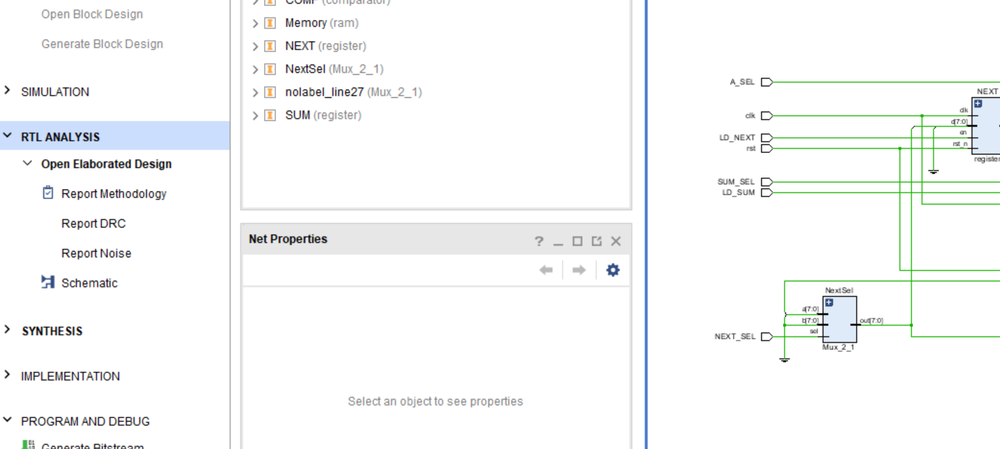
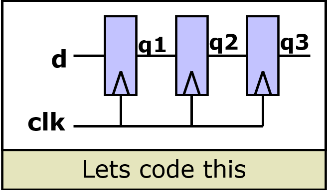
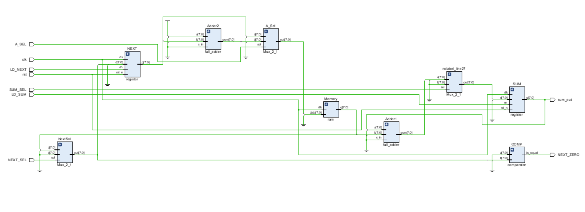
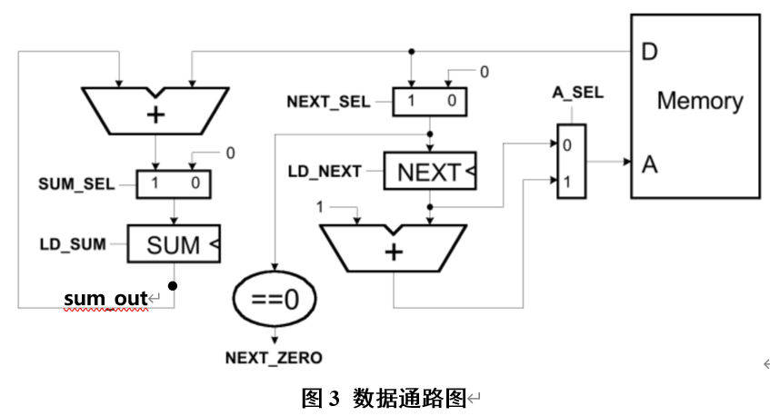
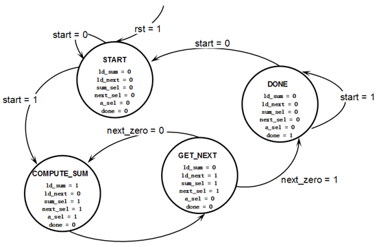
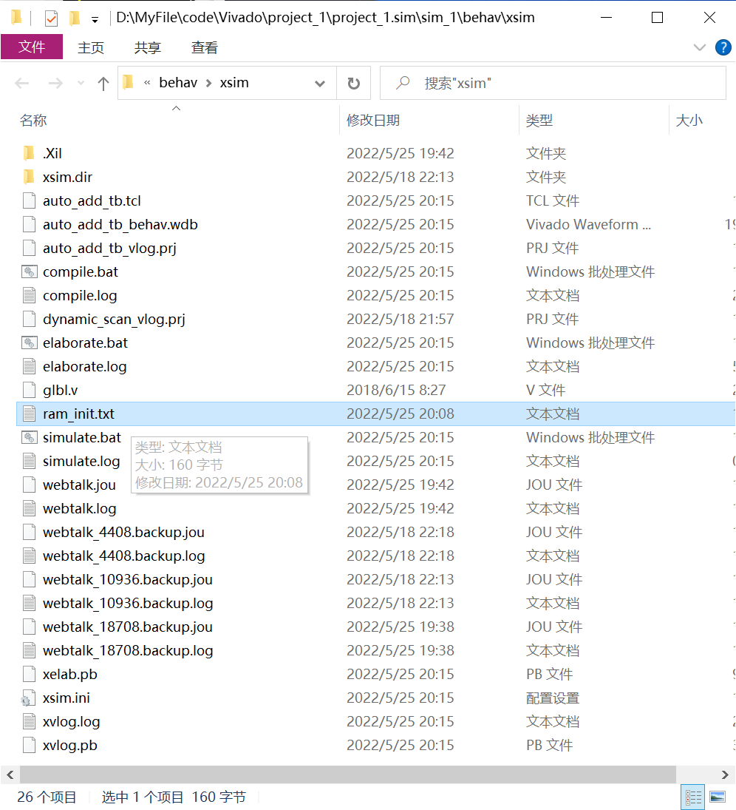
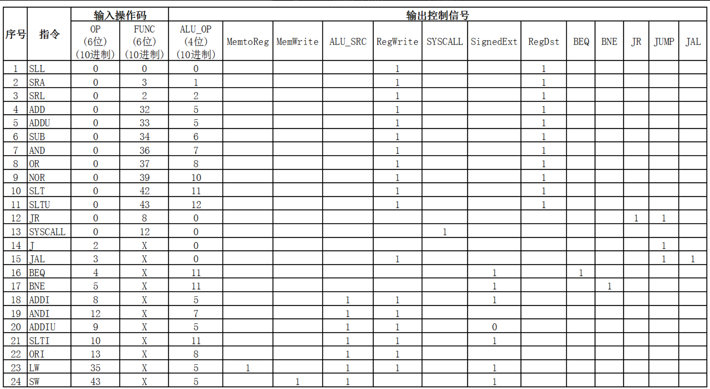
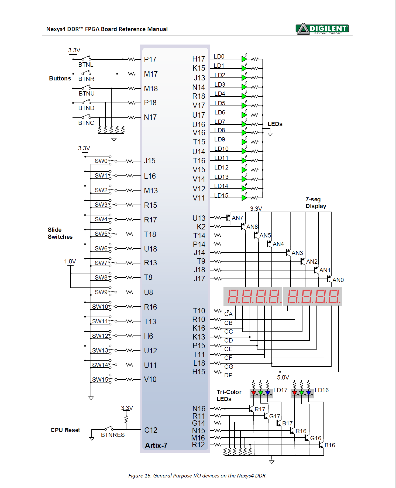

# Vivado

- RTL分析看电路图
  - schematic//示意图



- simulation		模拟、仿真：模拟测试功能是否正常
  - Simulation > Run Simulation > Run Behavioral Simulation（运行仿真>运行行为仿真）

- Synthesis		  综合


- implement		实现


生成bit流：//右键文件 set top，则生成它的比特流

# 基本语法

基本与C语言类似

```verilog
//逻辑操作符
逻辑与 &&
逻辑或 ||
逻辑非 ！

//位操作符
一元非 ~
二元与 &
二元或 |
二元异或 ^

//?归约操作符（单目运算符）
与归约 &
或归约 |
异或归约 ^
```

[verilog处理运算时的法则：](https://www.bilibili.com/read/cv10538751)

例如 c = a + b; 

其中a和b都是四位数，c是五位。在计算时，verilog会将a和b都扩展到5位，然后再做加法，而如果a和b中有无符号数，则位宽扩展就按照无符号数来，也就是高位补0。所以如果a和b中既有无符号又有有符号，结果就不正确了。
解决方法是定义时用 `signed`来修饰：c = a + $signed(b)这样在c = a + b，这个运算开始的扩位就会按照有符号数的方式进行扩位，在高位补符号位，加法得出的结果就是a、b视为有符号数的结果。

## 常量

<位宽><进制><数字>

```verilog
8'b10011000
//b = 2进制
//d = 10进制
//h = 165进制

//!注意 8表示8bit

```

## 模块Module

包含输入输出端口

```verilog
module xor_8bit(out, a, b);
     output [7:0] out;
     input [7:0] a, b;
     …
endmodule
```


## register

reg的范围必须是常量!


> 在Verilog语言中，不允许在冒号前后都出现变量。
> 比如我们有一个变量i，我们需要取出从`i*8+7`到`i*8`这8位数据，直接写`[i*8+7:i*8]`是会报错的。正确的写法是：
>
> [8*i+7 `-: `8]


# 三种描述方式

- 结构描述——描述电路图
- 数据流描述——逻辑语言
- 行为描述——类C语言

### 结构描述(电路)

```verilog
module majority (major, V1, V2, V3) ; 
//表决器，如果有两个输入是1，则输出为1；如果有两个输入是0，则输出为0。少数服从多数。

output major ;
input V1, V2, V3 ;

wire N1, N2, N3;//线网型声明

and A0 (N1, V1, V2),
       A1 (N2, V2, V3),
       A2 (N3, V3, V1);

or  Or0	(major, N1, N2, N3);    

endmodule 
```

### 数据流描述(逻辑)

`assign`

在assign语句中，左边变量的数据类型必须是wire型。(input和output如果不特别声明类型，默认是wire类型。)

```verilog
module majority (major, V1, V2, V3) ;

output major ;
input V1, V2, V3 ;

assign major = V1 & V2 
                      | V2 & V3
                      | V1 & V3;
endmodule
```

> `{}`的拼接作用
>
> `assign {c_out,sum} = src1 + src2 + c_in; // **wow!**`


### 行为级描述(C)

`initial` 

只执行一次

初始语句从时间0开始，执行一次

如果有多个初始块，它们都从时间0开始，独立执行。 它们可以独立完成。

`#`表示延时

```verilog
module stim()

reg m,a,b,x,y;

initial
  m = 1’b0;

initial begin
  #5   a = 1’b1;
  #25 b = 1’b1;//再过25个时间单位
end

initial begin
  #10 x = 1’b1;
  #25 y = 1’b1;
end

initial
  #50 $finish;

endmodule

```


`always`

`@(posedge clk)`表示上升沿时钟触发。

1、always语句有两种触发方式。第一种是电平触发，例如always @(a or b or c)，a、b、c均为变量，当其中一个发生变化时，下方的语句将被执行。

2、第二种是沿触发，例如always @(posedge clk or negedge rstn)，即当时钟处在上升沿或下降沿时，语句被执行。

3、而对于always@(*)，意思是以上两种触发方式都包含在内，任意一种发生变化都会触发该语句。

```Verilog
module majority (major, V1, V2, V3) ;

output reg major ;
input V1, V2, V3 ;

always @(V1, V2, V3) begin
	if (V1 && V2 || V2 && V3
         || V1 && V3) major = 1;
     else major = 0;
end

endmodule 

```


## 调用其他模块：

1）引用时，严格按照模块定义的端口顺序来连接，不用标明原模块定义时规定的端口名。

`Design u_1(u_1的端口1，u_1的端口2，……)；`

2）引用时用`.`符号，标明原模块定义时规定的端口名， 这样当被调用的模块管脚改变时不易出错。

```verilog

module Add_full(c_out, sum, a, b, c_in) ;
	output sum, c_out;
	input a, b, c_in;
	wire w1, w2, w3;

	Add_half AH1(.sum(w1), .c_out(w2), .a(a), .b(b));
	Add_half AH2(.sum(sum), .c_out(w3), .a(c_in), .b(w1));
	or carry_bit(c_out, w2, w3);
endmodule

//最好写成
Add_half AH1(
	.sum(w1), 
	.c_out(w2), 
	.a(a), 
	.b(b)
);
```

### parameter 参数传递

```
方法名 #(传参) 实例名 (
)
```


## 条件与循环

### if语句

```verilog
if (条件表达式)	          块语句1
else if (条件表达式2)   块语句2
……
else if (条件表达式n)   块语句n
else                                块语句n+1
```

### case语句

```Verilog
case (敏感表达式)
    值1：      块语句1
    值2：      块语句2
    ……
    值n：      块语句n
    default：块语句n+1
endcase
```

### for

```verilog
reg [15:0] rf[0:15];	// memory structure for modeling register file
reg [5:0] w_addr;   	// address to write to

for (w_addr=0; w_addr<16; w_addr=w_addr+1)
   rf[w_addr[3:0]] = 16’h0000;	// initialize register file memory
end
```

### while

```Verilog
while ((index<16) && (!found)) begin
      if (flag[index]) found = 1’b1;
      else index = index + 1;
   end
```


### repeat? 

直接加循环次数

```verilog
initial begin
   inc_DAC = 1’b1;
   repeat(4095) @(posedge clk);	// bring DAC right up to point of rollover
   inc_DAC = 1’b0;
   inc_smpl = 1’b1;
   repeat(7)@(posedge clk);	// bring sample count up to 7
   inc_smpl = 1’b0;
end	
```


### forever ?

```Verilog
initial begin
  clk = 0;
  forever #10 clk = ~ clk;//每10s时钟做一次翻转
end
```


## 两种赋值的区别！！

**阻塞型过程赋值**

`＝`：前一条语句没有完成赋值过程之前，后面的语句不可能被执行。		//组合逻辑

**非阻塞型过程赋值**

`<＝` ：一条非阻塞型赋值语句的执行，并不会影响块中其它语句的执行。//时序逻辑

eg1:



```verilog
//错误的
module pipe(clk, d, q);

input clk,d;
output q;
reg q;

always @(posedge clk) begin
  q1 = d;
  q2 = q1;
  q3 = q2;
end

endmodule

```


```verilog
//正确的
module pipe(clk, d, q);

input clk,d;
output q;
reg q;

always @(posedge clk) begin
  q1 <= d;
  q2 <= q1;
  q3 <= q2;
end
endmodule;
```


### 


# 组合设计

## 加法器

```verilog

// 1位全加器
module Add_full(c_out, sum, a, b, c_in) ;
	output sum, c_out;
	input a, b, c_in;
	wire w1, w2, w3;

	Add_half AH1(.sum(w1), .c_out(w2), .a(a), .b(b));
	Add_half AH2(.sum(sum), .c_out(w3), .a(c_in), .b(w1));
	or carry_bit(c_out, w2, w3);
endmodule

```

```verilog
// 4位全加器

module full_adder(a, b, c, s);
    input   [3:0]    a, b;
    output [3:0]    s;
    output             c;
    
    assign {c,s} = a + b;

endmodule

```

## 编码器&译码器

```verilog
module Priority_Encoder(in, y); //8-3编码器 
    input         [7:0]     in;
    output reg [2:0]     y;	//y在等号左侧必须用register型
    
    always @(in) begin		//真值表式
        if(in[0]==1'b0)		y = 3'b111;
        else if(in[1]==1'b0)	y = 3'b110;
        else if(in[2]==1'b0)	y = 3'b101;
        else if(in[3]==1'b0)	y = 3'b100;
        else if(in[4]==1'b0)	y = 3'b011;
        else if(in[5]==1'b0)	y = 3'b010;
        else if(in[6]==1'b0)	y = 3'b001;
        else			y = 3'b000;
    end
endmodule

```

```verilog
// 3-8 译码器
module decoder_38(A, Y);
  input [2:0] A;
  output reg [7:0] Y;

  always @(A)
  begin
    case(A)
      3'd0: Y = 8'b1111_1110;
      3'd1: Y = 8'b1111_1101;
      3'd2: Y = 8'b1111_1011;
      3'd3: Y = 8'b1111_0111;
      3'd4: Y = 8'b1110_1111;
      3'd5: Y = 8'b1101_1111;
      3'd6: Y = 8'b1011_1111;
      3'd7: Y = 8'b0111_1111;
    endcase
  end
endmodule

```


## 选择器


# 时序设计


```verilog
//延时
＃ <time> <statement> ；
//判断时钟上升/下降沿/某变量被赋值后,再触发
@ (<posedge>|<negedge>|<signals> ) <statement>； 
//直到表达式计算为真之前，都延时下一个语句的执行。
wait (<expression>) <statement> ；

```


```
specify
     (<expression>) = <time>
     ……
 endspecify

```

### function


### task


### 文件读写

Loading Memory Data From Files

This is very useful (memory modeling & testbenches)

```verilog
$readmemb(“<file_name>”,<memory>);

$readmemb(“<file_name>”,<memory>,<start_addr>,<finish_addr>);

$readmemh(“<file_name>”,<memory>);

$readmemh(“<file_name>”,<memory>,<start_addr>,<finish_addr>);

```

```verilog
module rom(input clk; input [7:0] addr; output [15:0] dout);

reg [15:0] mem[0:255];	// 16-bit wide 256 entry ROM
reg [15:0] dout;

initial
   $readmemh(“constants”,mem);

always @(negedge clk) begin
   ///////////////////////////////////////////////////////////
   // ROM presents data on clock low //
   /////////////////////////////////////////////////////////
   dout <= mem[addr];
end

endmodule
```


## 计数器										

## 触发器与锁存器

## 寄存器和储存器


# 实验4链表求和

## 数据通路



## FSM状态机




状态机原理图




txt和.v放在同目录下，仿真报错说找不到

把txt放到这里，找到了



# 实验5MIPS单周期CPU

### 控制器——指令译码模块



### ALU

功能对应表


### 单周期MIPS数据通路(正在做)


### FSM(未做)


### Top(未做)


# 一些特色

X=位置

Z=高阻抗

{}拼接

#延迟


有时候要想着电路图编写。


Nexys4开发板针脚图


