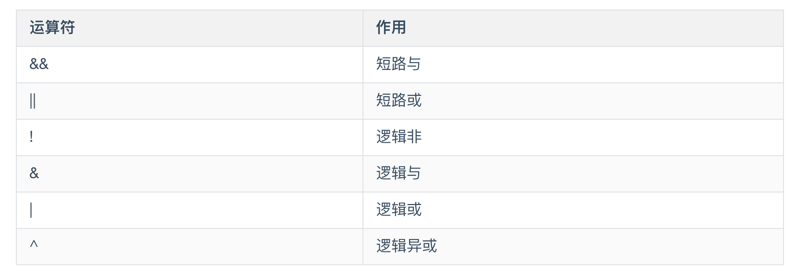
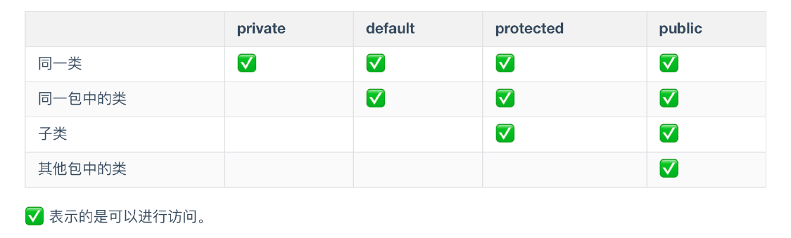
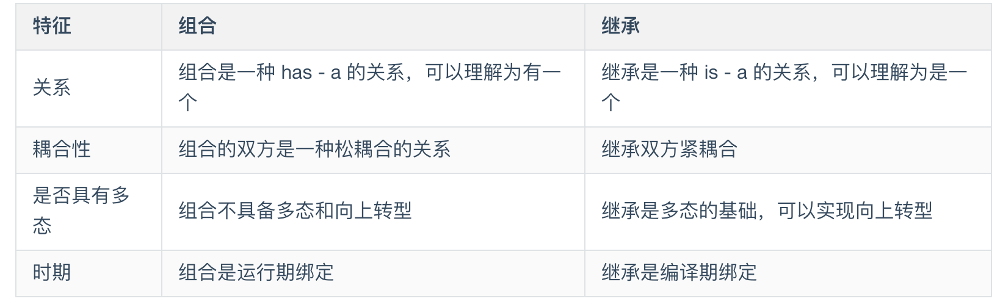
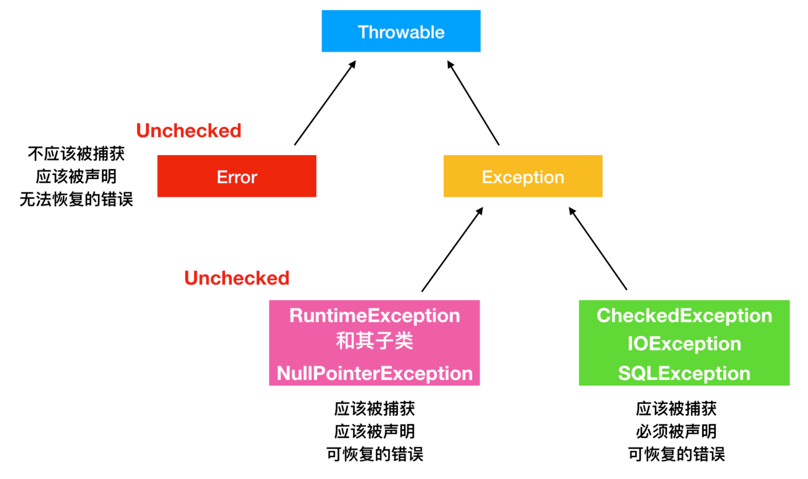
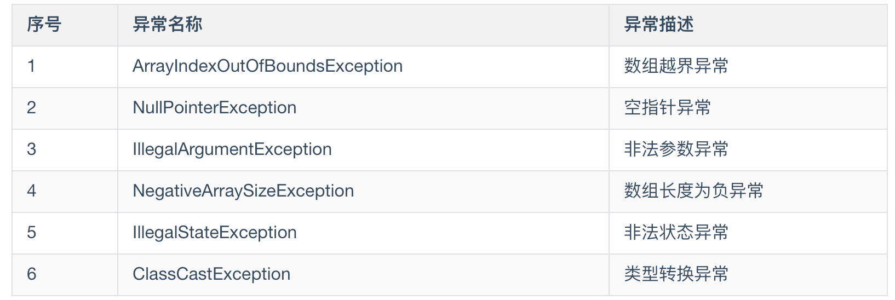
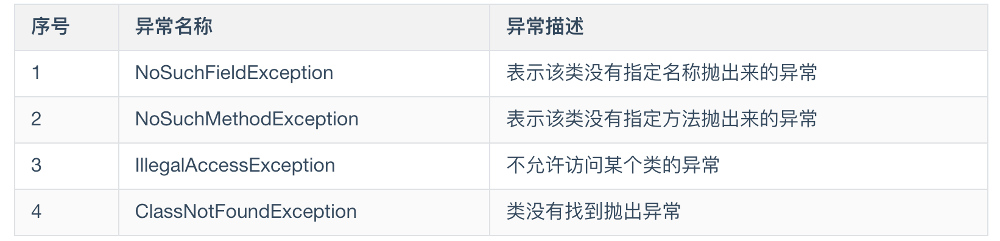

# Java大致运行机制

```java
public class Main {
    public static void main(String[] args){
        System.out.println("Hello,world!");
    }

}
```

javac( = java compiler)会把java文件编译成class文件。

`main.java` -> `main.class`

class文件送给JVM，JVM与操作系统交互。

编译型语言：代码编译成二进制文件给操作系统运行。

解释型语言：py代码给python解释器，再运行。

Java既是编译型语言，又是解释型语言。


# 基础语法

**习惯规则**

大小写敏感

|        |                                |                  |
| ------ | :----------------------------- | ---------------- |
| 类名   | 首字母大写                     | MyFirstClass     |
| 包名   | 小写                           | my.first.package |
| 方法名 | 首字母小写，后面单词首字母大写 | myFirstMethod    |

String ~

大括号后无分号



短路与 ( && ) 和 短路非 （||）:

        cmd1 && cmd2 ；如果cmd1为 flase，那么 cmd2 系统就不去检测了！因为不管 cmd2 是否为 true，结果都为 flase，节省了时间和系统资源！ 这就是短路的作用！
    
        cmd1 || cmd2 ；如果 cmd1位 true；cmd2则不去执行；反正 cmd1为flase的话，需要执行 cmd2！
------------------------------------------------
**for-each语句**

JDK1.5中引入更方便的对数组和集合进行遍历的方法:

```java
int array[] = {1,2,3};

for(int arr : array){
	System.out.printIn(arr);
}
```


# 面向对象

## 类也是一种对象

`class`是对一系列对象的抽象, 相当于"书籍的封面" 

```java
class ClassName{
	//body;
}
```

上面声明了一个类,

```JAVA
ClassName classname = new ClassName()
```

## 对象的创建

万事万物都是对象,但你操纵的是对象的`引用(reference)`

如果对象是Car,引用相当于Key.

你有一个对象引用,但不一定有一个对象与它关联.

```java
Car carKey;
```

这里创建了一个引用,而不是对象。当你使用时，会返回一个**异常**:需要一个对象与这个引用进行关联。

安全的做法是——创建对象引用的时候同时把一个对象赋给它。

```java
Car carKey = new Car();
```

## 属性和方法

类的基本要素:	**属性=字段,方法=函数**

**属性**可以是基本数据类型,也可以是任意类型的对象


**方法**的返回值必须与方法的参数类型保持一致,也可以无返回`void`

```
public int get Result
```


### 构造方法

也叫构造函数，构造器。构造方法只能在对象的创建时期调用一次，通过这个构造器确保每一个对象都被初始化。

构造方法的名称和类名保持一致，而且可以有多个。

```java
claass Apple{
	int sum;
	String color;
	
	public Apple(){}
    public Apple(int sum){}
    public Apple(String color){}
	public APPle(int su, String color){}
}
```

上面有多个以Apple命名的方法,这是一种多态的体现//????

定义完构造方法,创建Apple对象:

```java
class createApple {
    public static void main(String[] args) {
        Apple apple1 = new Apple();
    	Apple apple2 = new Apple(1);
    	Apple apple3 = new Apple ("red");
    	Apple apple4 = new Apple (2,"blue");
    }
}
```

如果不定义构造方法,JVM会自动为你生成一个构造方法,	默认,无参构造器

**注意:**如果手动定义任一构造方法,JVM不再提供默认的无参构造器.


### 方法重载

就是在同一个类里,写了两个同名函数,但是不同参

重载的方法名称相同,Java怎么知道调用哪个方法?


参数列表不同:	参数的个数,类型,排序不同

仅仅返回类型不通,不能构成重载,

重载发生在编译时,编译器会根据参数列表,选择不同的方法


### 方法重写

发生在子方法和父方法之间,同名同参的方法,但是内容不同	

`@Override`是重写的标志

```java
class Fruit {
	public void eat() {
		System.out.printl('eat fruit');
	}
}

class Apple extends Fruit{
	@Override
	public void eat() {
		System.out.printl('eat apple');
	}
}
```

在子类中重写的方法必须和父类保持一致,	其访问权限不能低于父类


### 初始化

**初始化的顺序**: 静态属性,静态方法块,	普通属性 ,普通方法块,	构造函数,方法


**数组定义**:

```java
int[] a1;
//或者
int a1[];
eg:
int array[4]{1,2,3,4};
int array[4]{1,2};
int array[]={1,2};
```


### 对象的销毁

在Java中不需要手动管理对象的销毁,这是由Java虚拟机进行管理和销毁的.

**对象的作用域**

Java中这样是不允许的:

```java
{
	int x = 11;
	{
		int x = 12;
	}
}
```

**this和super**
this表示当前的对象,this可以调用方法,调用属性,可以指向对象本身


# 访问和控制权限


[^2022年3月15日14:46:18]: 主要讨论如何在一个新类中调用其它类的方法

封装

只对需要的类可见



## 继承

如果不指定,默认隐式继承自`Object`父类,

如果指定了父类, 那么被指定的父类继承自`Object`

`extends`

```java
class Father{}
class Son extends Father{}
```


继承双方共用特征

```java
class Father{
	public void feature(){
		System.out.println("father feature");
	}
}

class Son extends Father {
}
```

如果Son中没有实现自己的方法的话,那么默认用父类的方法。

如果子类实现了自己的feature方法,那么就相当于重写了feature


## 多态

​		多态是指一个对象的相同方法在不同情形下具有不同的表现形式。多态只是一种表现形式。

实现多态：

​	1.继承

​	2.重写父类的方法

​	3.父类引用指向子类对象 


```java
public class Fruit {
	int num;
	public void eat(){
		System.out.println("eat Fruit");
	}
}
public class Apple extends Fruit{
	@Override
	public void eat() {
		super.num = 10;
		System.out.println("eat " + num + " Apple");
	}
    
public static void main(String[] args) {
	Fruit fruit = new Apple();
	fruit.eat();
	}
}
```

注意`main`中 `Fruit fruit = new Apple();`

就是多态 -> 父类的引用指向子类的对象


## 组合

组合就是将一个对象引用放在一个新类中。

> ​		如果要让类具有更多的拓展功能, 要多用组合, 少用继承.

```java
public class SoccerPlayer{
    
    private String name;
    private Soccer soccer;//
}

public class Soccer{
	
    private String soccerName;
}
```

**组合和继承的区别:**




## 代理


## static

修饰成员变量和方法

用static声明的变量也叫类变量, 类变量的生命周期和类相同,在整个程序执行期间都有效.

用static修饰的方法即静态方法, 可以直接使用`类名.方法名`进行调用。不依赖任何对象就可以直接访问。

静态代码块

```java
public class StaicBlock {
	static{
		System.out.println("I'm A static code block");
	}
}
```

静态代码块随着类的加载而执行

很多时候会将只需要进行一次 的初始化操作放在`static`代码块中执行.

## final

`final`可以修饰类, 属性, 方法.

**final修饰类时**, 表明这个类不能被继承. 

注意:final类中的所有成员方法都会被隐式地指定为final方法

**final修饰方法时**, 表明这个方法不能被任何子类重写.

所以final可以明确禁止该方法在子类中被覆盖

**final修饰变量时**,  如果是修饰基本数据类型, 表示数据类型的值不能被修改; 	如果是修饰引用类型, 表示对其初始化之后不能再指向另一个对象.

# 接口和抽象类

## 接口

`interface`定义一个接口:

```java
public interface CxueJava{
    
}
```

可以在其内部继续定义

```java
public interface CxueJava{
    void writeWell();
}
```

接口的一些特征:

- `interface`接口是一个完全抽象的类, 他不会提供任何方法的实现, 只是会进行方法的定义。
- 接口只有两种访问修饰：`public` 对整个项目可见；`default`缺省值, 它只具有包访问权限 //??
- 接口只定义, 没有实现, 但是接口可以被其他类实现。

`implements` 来实现接口, 一个接口可以有多个实现		

```java
class CxueJava implements CxueJava{
	@Override
    public void writeWell(){
        Systerm.out.println("CxueJava");
    }
}
```

注:

- 接口不能被实例化, 接口中不能有构造方法(编译会报错)
- 接口的实现 比如 实现接口的全部方法, 否则必须定义为抽象类//????


## 抽象类

`abstract`抽象类是一种抽象能力弱于接口的类

```java
public interface Dog{
    
	void FurColor();
}

abstract class WhiteDog implements Dog{
    
    public void FurColor{
        Systerm.out.pirntln("Fur is white");
    }
    
    abstract void SmallBody();
}
```

- 抽象方法一定存在于抽象类
- 抽象类中不一定只有抽象方法, 也可以有具体方法, 可以自己选择是否实现这些方法
- 抽象类约束不如接口严格, 可以在抽象类中定义构造方法, 抽象方法, 普通属性, 方法, 静态属性, 静态方法.
- 抽象类和接口不能被实例化, 只能实例化具体的类.

[^]: 好像实例化=赋值


# 异常

编译期间并不一定能找到所有的错误

有一些`NullPointerException`和`ClassNotFoundException`在编译时期是找不到的.

这些异常是`RuntimeException`

Java程序中经常会出现两种问题:一种是`java.lang.Exception`,一种是`java.lang.Error`


## Exception

`Exception`位于`java.lang`包下,它是一种顶级接口, //?

继承于`Throwable`类


## Throwable 

Throwable类时Java语言中所有错误和异常的父类,只有继承于Throwable下面的东西才能被抛出, 还有一种方式是带有Java中的@throw注解的类也可以抛出.

非受审查异常和受审查异常

除了`RuntimeException` `Error`以外, 其他的所有异常都是`checkedException`




```java
//返回抛出异常的详细信息
public string getMessage();
public string getLocalizedMessage();

//返回异常放生时的简要描述
public public String toString();

//打印异常信息到标准输出流上
public void printStackTrace();
public void printStackTrace(PrintStream s);
public void printStackTrace(PrintWriter s);
    
//记录栈帧的当前状态
public synchronized Throwable fillInStackTrace();
```

此外, 因为Throwable的父类也是`Object`,所以常用的方法还有继承其父类的`getClass()`和`getName()`方法

## 常见的Exception

Exception下有两种异常, `Runtime Exception`和`UncheckedException`, 都应该被**捕获**

Runtime Exception



Unchecked Exception




## 与Exception相关的关键字

### throws和throw

异常也是一个对象.

```java
static void cacheException() throws Exception{
    
    throw new Exception()
}
```

