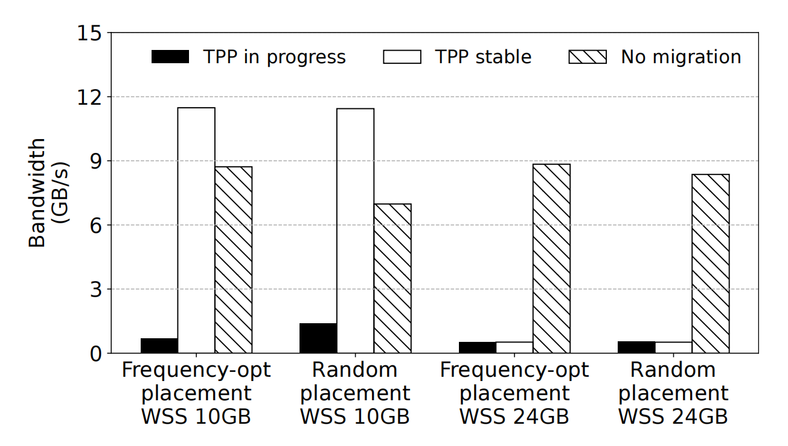
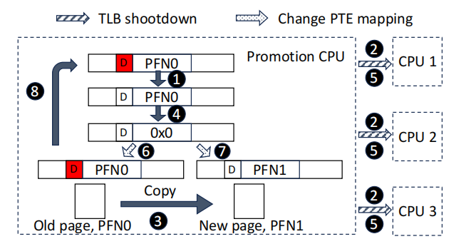
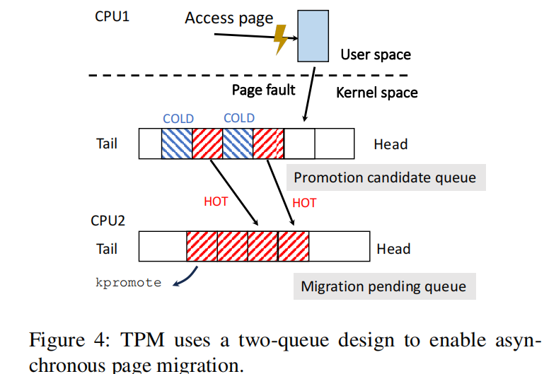
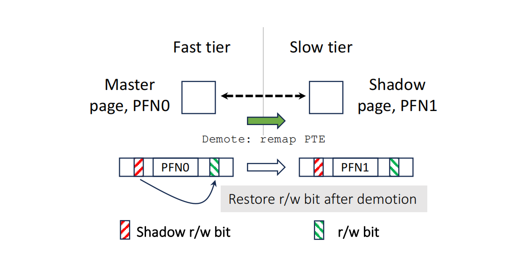
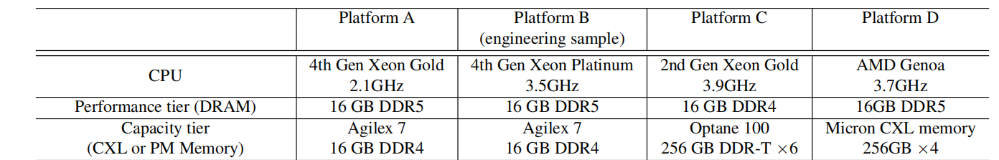
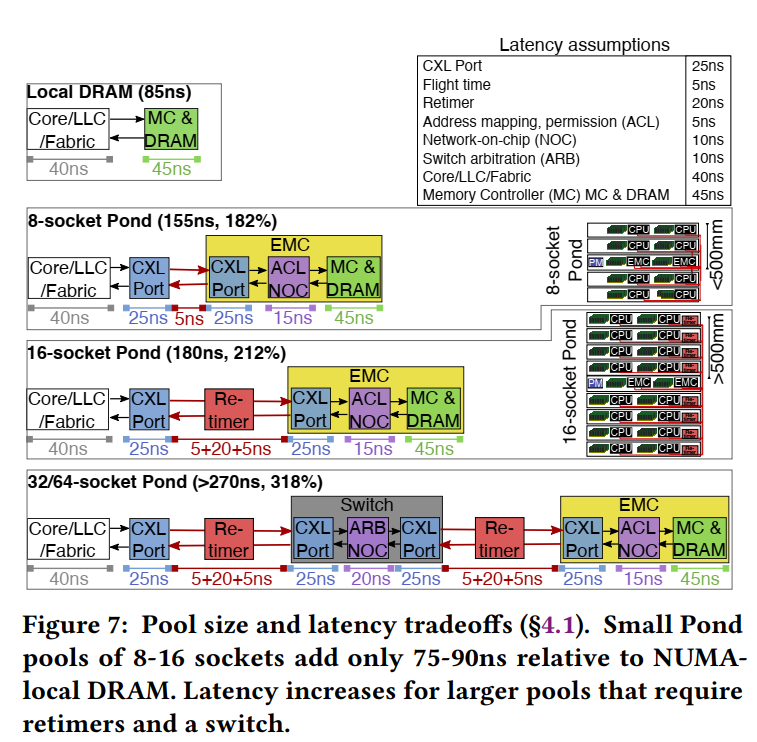
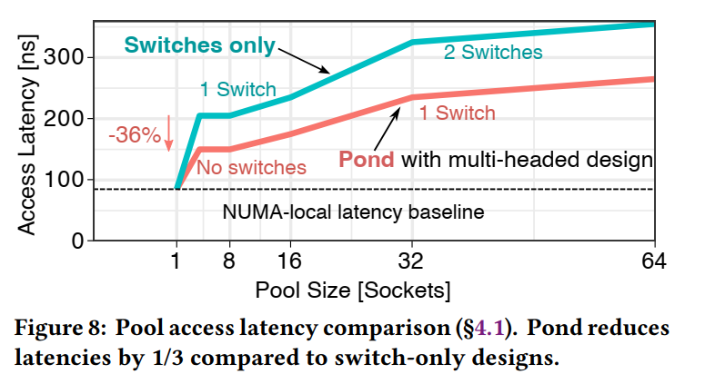
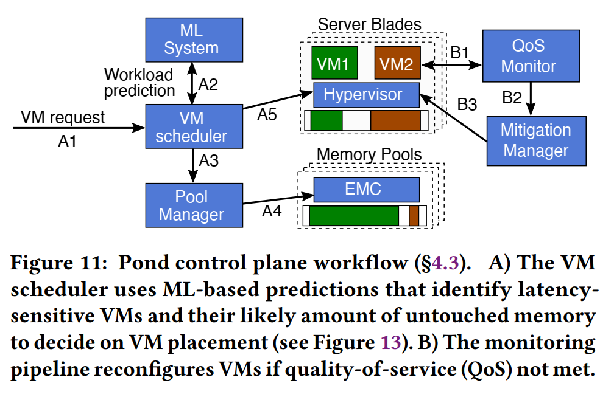

傲腾的最小单位是256B

大页内存，HugePage，通常为 2MB

Translation Lookaside Buffer (TLB)

硬件内存采用直接映射，导致有抖动现象。

通过分配时进行预测减少冲突，例如JohnyCache（）

CXL的最小管理单元是2MB？

NUMA能控制CPU对内存的访问延迟在几十个纳秒

# Nomad

内存页面迁移，独占，排它，他这个叫非独占

Nomad: Non-Exclusive Memory Tiering via Transactional Page Migration

https://github.com/lingfenghsiang/Nomad

## 0 摘要

随着字节寻址内存设备（如CXL内存、持久性内存和存储级内存）的出现，分层内存系统(tiered memory systems)成为现实。页面迁移（Page migration）是操作系统中管理分层内存的默认方法，旨在尽可能将热点数据移入快速内存，以优化数据访问性能，同时使用慢速内存来容纳从快速内存溢出的数据。

尽管现有研究已经证明了各种页面迁移优化的有效性，但它们未能解决一个根本**问题**：在分层内存管理中，独占内存分层策略(页面要么存在于快速内存，要么存在于慢速内存，而不是同时存在于两者之间的)，是否是最优策略？

> 排他性(独占性)分层内存：数据只能驻留在内存层次结构中的一个层级（例如，快速内存或慢速内存），而不是同时存在于多个层级。

我们证明，当快速内存处于压力下时，基于页面迁移的独占内存分层会导致显著的性能下降。本文提出了新的内存管理策略——非独占内存分层，可以保留从慢速内存提升到快速内存的页面副本，以减轻内存抖动。我们开发了NOMAD，具有事务性页面迁移和页面影子复制功能。NOMAD有助于将页面迁移从程序执行的关键路径中移除，并使迁移过程完全异步化。

测试显示在内存压力下，NOMAD的性能比当前Linux中的**透明页面放置（TPP）**方法提高了最多6倍。我们还将NOMAD与最近提出的基于硬件辅助的访问采样页面迁移方法进行了比较，展示了NOMAD在各种场景下的优势和潜在的弱点。

> TPP（Transparent Page Placement）是Linux中的一种内存管理技术，用于在不同内存层次之间进行数据迁移。TPP通过跟踪页面访问频率来决定哪些页面应被提升到更快的内存（如DRAM），哪些页面应降级到较慢的内存（如CXL内存）。这种技术主要依赖页表扫描和页面错误（page faults）来追踪“热”页面。当内存压力较大时，TPP会将不常访问的页面从快速内存中移出，从而在不同的内存层次之间高效管理数据。

## 1 引言

HBM，DRAM，PM，CXL-memory，未来的计算机系统预计将具有多层内存，并且这些内存在速度、容量、功耗和成本等方面具有不同的特性。分层内存管理的核心是操作系统（OS）内的页面管理、包括页面分配、放置和迁移。

传统内存层次结构通常包括在性能上至少存在一个数量级差异的存储介质。例如，DRAM和磁盘在延迟、带宽和容量上存在2-3个数量级的差异。因此，页面管理的唯一目标是将热点页面保留在“性能”层 (即DRAM)，并在需要时将冷页面迁移（驱逐）到“容量”层（即磁盘），以最大化性能层的命中率。**但是**随着新型内存设备的出现，内存层次结构中的性能差距正在缩小。例如，Intel的Optane持久性内存和CXL内存在延迟和带宽方面能够实现与DRAM相当的性能，差异仅为2-3倍。因此，长期以来指导操作系统页面管理设计的性能差距假设可能不再适用。如果迁移成本过高，将热点页面提升到性能层已经不再有利。

此外，与必须通过文件系统作为块设备访问的磁盘不同，新型内存设备是**字节可寻址**的，可以通过普通的load和store指令直接由处理器访问。因此，对于位于容量层的温热页面，直接访问页面并避免迁移到性能层可能是更好的选择。最重要的是，尽管分层内存的性能依然存在层次性，但硬件已经不再是层次化的，CXL和PM都可以被CPU视作普通的内存节点。

（相关研究，详见后文）

改进内存层级之间的页面迁移，例如: Nimble、透明页面放置(TPP)、Memtis和TMTS等技术。

> Nimble [54]:
>
> - 通过利用透明大页面(Transparent Huge Pages, THP)来改进页面迁移
> - 采用多线程方式迁移单个页面
> - 支持多个页面的并发迁移
> - 这些方法旨在加速页面迁移过程,提高整体性能
>
> 透明页面放置(Transparent Page Placement, TPP) [44]:
>
> - 扩展了Linux现有的NUMA平衡方案
> - 支持快速内存和慢速内存之间的异步页面降级(demotion)
> - 支持同步页面提升(promotion)
> - 目标是更灵活地管理不同速度内存层级之间的页面移动
>
> Memtis [37]:
>
> - 使用硬件性能计数器来减少页面访问追踪的开销
> - 采用后台线程定期异步地提升页面
> - 通过减少监控开销和利用空闲时间进行页面迁移来提高效率
>
> TMTS [24]:
>
> - 与Memtis类似,也使用硬件性能计数器
> - 同样使用后台线程进行周期性和异步的页面提升
> - 旨在降低页面访问跟踪的开销,并在不影响前台任务的情况下优化内存使用

（局限性） 

a. 独占式内存分层:

各层级是互斥的(热页面在性能层,冷页面在容量层)，当性能层容量不足时,可能导致过度的页面交换

b. 低效的页面迁移机制:

- 1)从页面表中取消映射一个页面；2)将页面内容复制到不同的层；3)重新映射页面表上的页面，指向新的内存地址。

问题：代价高昂,频繁迁移可能大幅降低用户感知的带宽；当工作集大小超过性能层容量时,现有方法难以应对

**因此，**本文提倡使用非独占性分层内存，即高速层保存副本，好处是：在内存压力下，如果页面不脏，并且其影子副本存在于容量层上，则只需重新映射页面降级。当内存需求超过性能层的容量时，这允许平滑的性能转换。

为了降低迁移和提示成本，本文提出了TPM（*transactional page migration* ）——一种在迁移期间启用页面访问的新机制。在将页面内容复制到性能层上的新页面后，TPM将检查该页面在迁移期间是否已被弄脏。如果是，则页面迁移（即事务）将无效，并丢弃复制的页面。失败的页面迁移将在稍后被重试。如果成功，则复制的新页面将映射到页面表中，而旧页面将未映射，从而成为新页面的卷影副本（shadow copy）。

**我们开发了NOMAD**，NOMAD是一个新型的分层内存页面管理框架，集成了非独占内存分层和事务性页面迁移。NOMAD通过在容量层内存紧张时优先回收影子页面，防止因影子页面导致的内存不足（OOM）错误。在Linux上实现并进行了评估，覆盖了包括FPGA-based CXL原型、持久内存系统和商用CXL系统在内的四个平台。实验结果显示，NOMAD在内存抖动情况下，相较于TPP，性能提升可达6倍，并且在工作集适合快速内存时，始终比Memtis高130%。

## 2 背景动机

我们介绍了分层内存系统中页面管理的背景，并使用TPP [44]，这是一个为支持CXL的分层内存设计的最先进的页面放置系统，作为一个激励的例子来突出当前页面管理方法的主要局限性。

### **2.1 内存分层**

缓存和分层（**Caching and tiering**）缓存以包容性页面放置模式运行，保留页面在其原始位置，仅在性能层中临时存储一个副本以便快速访问。相反，分层以排他性模式运行，积极地在各种内存/存储介质之间重新定位页面。

> 设备间的差距在缩小：如，英特尔Optane DC持久性内存（PM）提供（几乎）比DRAM高一个数量级的容量（例如8倍），并且在性能上接近DRAM的2-3倍范围内，例如写入延迟低至80纳秒，读取延迟约为170纳秒。更近期的计算表达链路（CXL）是一种基于PCI Express（PCIe）的开放标准互连技术，通过CXL.mem协议为连接各种内存设备（如DRAM、PM、GPU和smartNICs）提供内存般的字节寻址接口。实际的CXL内存提供了与普通DRAM相当的内存访问延迟（小于2倍）和吞吐量（约为50%）。

从操作系统内存管理的角度来看，CXL内存或PM看起来像是一个远程的、无CPU的内存节点，类似于多插槽非一致性内存访问（NUMA）节点。最先进的分层内存系统，如TPP、Memtis、Nimble和AutoTiering，均采用分层方式对不同内存层上的数据进行排他性管理。

我们评估了透明页面放置（TPP）作为Linux中最先进的默认分层内存管理。

> TPP in progress - TPP方法正在进行页面迁移时的性能
>
> TPP stable - TPP方法页面迁移稳定后的性能
>
> No migration - 一种禁用页面迁移的基准方法的性能
>
> 放置策略:Frequency-opt placement 按访问频率放置热页面;Random placement 随机放置
>
> 工作集大小(Working Set Size, WSS)
>
> 理解一下这图：页面迁移过程(TPP in progress)会显著降低性能,即使初始放置是最优的(Frequency-opt)。说明页面迁移的开销很大。
>
> 当工作集大小超过快层容量(如24GB)时,TPP达不到stable,会一直thrashing。而禁用迁移(No migration)反而表现更好。
>
> 佐证，传统的同步页面迁移方法开销大,且在内存压力大时会引起thrashing,严重影响性能。

### **2.2 页面管理**

本节深入探讨了Linux中的页面管理设计，并分析了页面迁移过程中产生的开销。我们的讨论重点在于：1) 如何有效跟踪内存访问并识别热点页面。2) 在内存层之间迁移页面的机制。

> 内存访问的跟踪可以通过软件（内核）和/或硬件支持来实现。具体来说，内核可以通过页面错误（page faults）或扫描页表，甚至同时使用这两种方法来跟踪页面访问。为了精确跟踪每次内存访问，捕获这些信息可能代价高昂。基于页面错误的跟踪通过提示性（轻微）页面错误来捕获选定页面（即其页表条目权限设置为无访问）的内存访问。因此，它允许内核准确地测量这些页面的最近访问情况和访问频率。然而，调用每次内存访问的页面错误会在程序执行的关键路径上带来高昂的开销。相比之下，页表扫描通过周期性检查所有页表条目（PTE）中的访问位，来确定自上次扫描以来最近访问的页面。与基于页面错误的跟踪相比，后者通过选择适当的扫描间隔，在扫描开销和跟踪准确性之间进行权衡。
>
> Linux采用了一种惰性页表扫描机制来跟踪热点页面，这为其分层内存管理奠定了基础。Linux为每个内存节点维护两个LRU列表：一个用于存储热点页面的活动列表，另一个用于存储冷页面的非活动列表。默认情况下，所有新页面都会进入非活动列表，并根据每页结构体页面中的两个标志PG_referenced和PG_active被提升到活动列表。当相应的PTE检查时访问位被设置时，PG_reference被设置，而PG_active在PG_reference连续两次被设置后才会被设置。当页面的PG_active标志被设置时，页面将被提升到活动列表中。对于文件支持的页面，其访问由操作系统通过文件系统接口处理（例如，read()和write()）。因此，每次访问时，这两个标志都会更新。对于匿名页面（例如，通过malloc分配的应用程序内存），由于页面访问是直接由MMU硬件处理的，并且绕过了操作系统内核，因此只有在内存回收期间才会更新它们的引用标志和LRU列表管理。在内存压力下，交换守护进程kswapd会扫描非活动列表及其对应的PTE，并更新非活动页面的标志，并回收/交换掉那些未设置PG_reference的页面。此外，kswapd还会将热点页面（即那些设置了PG_active的页面）提升到活动列表中。虽然这种惰性扫描机制延迟了访问跟踪，以减少跟踪开销，但也削弱了跟踪的准确性。
>
> TPP利用Linux的页表扫描来跟踪热点页面，并采用基于页面错误的跟踪来决定是否将页面从慢速内存中提升。具体而言，TPP将驻留在慢速内存中的所有页面（例如CXL内存）设置为不可访问，任何用户访问这些页面都会触发轻微的页面错误，在此过程中TPP决定是否提升发生错误的页面。如果发生错误的页面在活动列表中，它将被迁移（提升）到快速层。当快速内存处于压力下时，kswapd会将页面从非活动列表迁移到慢速内存中。
>
> 通过硬件支持可以实现精确且轻量级的内存访问跟踪，例如在硬件中增加一个PTE计数字段，记录内存访问的次数。然而，基于硬件的跟踪会增加复杂性，并且需要对主流架构（如x86）进行广泛的硬件更改。在实践中，诸如在Intel平台上的处理器事件基准采样（PEBS）等硬件辅助采样已被用来记录采样硬件事件（如LLC未命中或存储指令）的页面访问（虚拟地址）信息。然而，基于PEBS的分析方法仍然存在平衡采样频率和分析准确性的问题。我们观察到，尽管采用了优化采样率以最小化开销，基于PEBS的方法仍然是粗粒度的，无法捕获许多热点页面。此外，基于采样的方法可能无法准确衡量访问的时效性，从而限制了其做出及时迁移决策的能力。
>
> 内存层之间的页面迁移涉及一个复杂的过程：① 系统必须通过页面错误来处理迁移；② 迁移页面的PTE必须被锁定，以防止其他进程在迁移期间访问该页面，并从页表中解除映射；③ 必须向每个可能缓存了旧PTE副本的处理器发出转换旁路缓冲器（TLB）刷新（通过处理器间中断（IPI））；④ 页面内容在层之间复制；⑤ 最后，PTE必须重新映射到新位置。页面迁移可以同步或异步进行。同步迁移，例如TPP中的页面提升，是由用户访问页面触发的，并处于程序执行的关键路径上。在迁移期间，用户程序会被阻塞，直到迁移完成。异步迁移，例如TPP中的页面降级，则由内核线程（即kswapd）在满足某些条件时处理，通常不在程序的关键路径上。同步迁移不仅因为页面在迁移期间不可访问而代价高昂，还可能涉及大量的页面错误。
>
> 图2显示了在TPP积极在两层内存之间重新定位页面时的基准测试运行时间分解。由于页面提升是同步的，因此页面错误处理和页面内容复制（即提升）与应用程序线程在同一个CPU上执行。页面降级由kswapd通过不同的核心完成，如图所示，异步提升和页面错误处理在应用程序核心上带来了显著的开销。相比之下，降级核心大部分时间处于闲置状态，不会构成瓶颈。正如将在第3.1节中讨论的那样，由于要成功提升一个页面可能会引发多达15次轻微页面错误，用户空间的运行时间也可能因此被延长。这些开销分析解释了图1中观察到的TPP性能不佳的原因。

### 2.3 相关工作

> 这段相关工作部分概括了之前研究者在分层存储/内存系统方面所做的大量开创性工作。这些工作涉及各种存储/内存技术的组合,如SSD/HDD、DRAM/磁盘、HBM/DRAM、NUMA内存、持久内存/DRAM、本地/远程内存、DRAM/CXL内存等。而本文的NOMAD聚焦于由DRAM和新兴字节寻址内存设备(如CXL内存和持久内存)构成的分层内存系统,但也适用于其他类型的分层内存如HBM/DRAM和DRAM/持久内存。
>
> 在轻量级内存访问跟踪方面,之前的工作如Hotbox、Memtis、TMTS等通过各种方法在跟踪开销和精度之间取得平衡,但"常开"的性能分析组件对高压力工作负载并不实用。相比之下,thermostat和DAMON通过对较小部分页面采样或者较粗粒度的区域监控有效降低了扫描开销,但粒度变粗导致页访问模式精度下降。另一方面,为降低AutoNUMA等频繁提示缺页异常的开销,TPP仅对慢层(CXL内存)启用基于缺页的检测,并尝试通过同步迁移及时提升页面。NOMAD从这些现有的轻量级跟踪系统获得启发,通过整合更多时间局部性信息而无需额外CPU开销来对它们加以改进,且与硬件辅助方法不同,无需额外硬件支持。
>
> 在页面迁移优化方面,TPP将页面分配与回收解耦以对应用隐藏回收开销,但页面迁移仍在关键路径上导致显著性能下降。Nimble通过透明大页面迁移和并发多页面迁移等新机制来降低页面迁移开销。Memtis进一步使用内核线程在后台提升/降级页面,将页面迁移移出关键路径。TMTS利用用户/内核协作方法来控制页面迁移。相比之下,NOMAD旨在实现及时的按需页面迁移,同时将页面迁移移出关键路径,与现有页面迁移优化正交且可从中受益。最相关的工作是利用硬件支持将数据固定在缓存中,在迁移期间允许访问页面,而NOMAD同样无需额外硬件支持。

## 3 Nomad 

NOMAD是一种新的分层内存页面管理机制，主要特点是非独占内存分层和事务性页面迁移。NOMAD的设计目标是让处理器能够自由访问快速和慢速内存层中的页面，同时将页面迁移的成本移出用户数据访问的关键路径。

NOMAD不做页面迁移决策，而是依赖操作系统中的现有内存访问跟踪来确定页面温度。在初始内存分配后，NOMAD逐步将热页面迁移到快速层，将冷页面迁移到慢速层。NOMAD旨在最大限度地减少页面迁移的成本和次数。

**Overview**

现代处理器的缓存并不采用纯粹的inclusive或exclusive策略,而是允许某些缓存行在多个层次之间共享,或者避免某些缓存行的驱逐。这启发了NOMAD采用一种非独占式(non-exclusive)的内存分层策略。

> 在现代处理器的缓存管理中，**inclusive** 和 **exclusive** 策略是两种不同的缓存管理方法：
>
> 1. **Inclusive 策略**：所有上一级缓存中的数据（如 L1 缓存）都必须包含在下一级缓存（如 L2 缓存）中。这意味着如果某个数据在 L1 缓存中，那么它也一定存在于 L2 缓存中。
> 2. **Exclusive 策略**：上一级缓存中的数据不会重复存储在下一级缓存中。这样可以避免数据的重复存储，提高缓存的利用率。

与现有的要求每个页面只能存在于一层的独占式分层不同,NOMAD在将页面从慢层复制到快层的同时,会在慢层保留一个被迁移页面的影子副本。这种非独占式分层策略只为已经提升到快层的页面维护影子副本,因此并不是inclusive策略。非独占式策略的优势在于,可以通过简单地重新映射页表项(PTE)来简化干净的冷页面的降级,而无需将冷页面复制到较慢的层。

NOMAD的核心组成部分是一种新的事务性页面迁移(Transactional Page Migration, TPM)机制,用于降低页面迁移的成本。与现有的unmap-copy-remap三步页迁移不同,TPM会在不从页表中取消映射的情况下复制页面。在页面复制期间,页面不会被锁定,并且可以被用户程序访问。复制完成后,TPM会检查页面在复制过程中是否被修改。如果没有,TPM会锁定页面并在PTE中将其重新映射到更快的层。否则,迁移会被中止,并在稍后重试。TPM不仅最小化了页面不可访问的持续时间,而且使页面迁移异步化,从而将其从用户数据访问的关键路径上移除。

### 3.1 事务性页迁移(Transactional Page Migration)

现有的页迁移机制存在两个主要问题:

1. 用户程序会被阻塞,因为页面在迁移过程中是不可访问的。
2. 如果迁移失败,操作系统会重复尝试多次,每次都会触发页错误(page fault),开销很大。

> PFN = page frame number  D = dirty

> TLB shootdown是一种在多处理器系统中维护TLB一致性的机制。
>
> TLB(Translation Lookaside Buffer)是一个硬件缓存,用于存储最近使用的虚拟地址到物理地址的映射,以加速地址翻译的过程。每个CPU核心都有自己的TLB。
>
> 在现代操作系统中,多个进程可以共享同一个物理页面,并且操作系统可以随时更改虚拟地址到物理地址的映射(例如,当页面被换出到磁盘或者migrated到其他NUMA节点时)。当映射关系发生变化时,操作系统需要确保所有CPU核心的TLB中的相应条目都被更新或者失效,以避免使用过期的地址翻译。
>
> 然而,在多处理器系统中,每个CPU核心的TLB更新是独立和异步的。当一个CPU核心修改了页表项(PTE)时,其他CPU核心的TLB中可能还保留有旧的映射关系。为了解决这个问题,操作系统使用了TLB shootdown机制。
>
> 具体来说,当一个CPU核心修改PTE时,它会向所有可能cached了该PTE的CPU核心发送一个TLB shootdown的进程间中断(IPI)。收到该中断的CPU核心会查找并失效自己TLB中对应的条目。只有当所有相关的CPU核心都完成了TLB失效操作,发起TLB shootdown的CPU核心才能继续执行。这确保了在执行依赖于新的地址映射的操作之前,所有CPU核心的TLB都已经更新。
>
> 在NOMAD的事务性页迁移(TPM)机制中,TLB shootdown在两个关键步骤中使用:
>
> 1. 在清空dirty位之后,确保后续的写操作能够正确设置dirty位。
> 2. 在取消旧页面的PTE映射之后,确保后续的内存访问会触发page fault而不是使用过期的TLB条目。
>
> TLB shootdown是确保TLB一致性的重要机制,但是它也引入了性能开销,尤其是在多处理器系统中。因此,现代处理器和操作系统都在探索优化TLB shootdown的方法,例如引入TLB标记位或者使用硬件广播机制等。

如图展示了TPM的工作流程:

1. 清空旧页面PFN0的dirty位D。 (在开始迁移事务前,需要先清空dirty位,以便后续检查页面在迁移过程中是否被修改过。)
2. 对所有可能cached了此页面PTE的CPU核心执行TLB shootdown。(清空dirty位可能无法立即反映在各个CPU核心的TLB中,因此需要执行TLB shootdown以避免使用过期的地址翻译，并保证后续的写操作能够设置dirty位）
3. 复制。 将数据从慢层复制到快层。注意此时旧页面仍然是可访问的。
4. 用原子指令get_and_clear读取并清空旧页面PFN0的PTE。 （在重新映射之前,TPM需要先取消旧页面的PTE映射。通过将PTE清空(设为0)使得旧页面在接下来的一段时间内不可访问。如果此时有进程试图访问旧页面,就会触发一个page fault。同时,由于这个操作会清空PTE,使页面不可访问,因此需要尽可能原子地执行。)
5. 再次对相关CPU核心执行TLB shootdown。 (上一步清空了PTE,但是该变化可能尚未反映到各个CPU核心的TLB中。为了保证TLB一致性,需要再次执行TLB shootdown)
6. 检查步骤4读取到的PTE中dirty位D是否为1。 如果在步骤3复制页面内容的过程中,有其他进程写入了该页面,则dirty位会被设置为1。这意味着复制的新页面内容已经过期,不能用于提交迁移事务。
7. 若干净,则将新页面PFN1映射到PTE中,提交迁移事务。
8. 若脏，则中止迁移事务,恢复旧页面PFN0的PTE映射。 中止的迁移会在将来的某个时间点重新尝试。

> get_and_clear指令的原子性(步骤4):
>
> - 读取和清空PTE这两个操作需要原子地执行。这是因为在读取dirty位和清空PTE之间,可能有其他进程并发地修改PTE,导致不一致的情况出现。
> - 使用get_and_clear这样的原子指令可以保证在读取dirty位的同时,PTE被清空,不会有其他进程在这个时间窗口内修改PTE。
>
> 为什么要再次执行TLB shootdown(步骤5):
>
> - 虽然步骤4已经清空了PTE,使旧页面在接下来的一段时间内不可访问,但是这个变化可能尚未反映到各个CPU核心的TLB中。
> - 如果某个CPU核心的TLB中还缓存了旧页面的PTE,那么该CPU核心上的进程访问旧页面时就不会触发page fault,而是直接使用过期的物理地址,导致数据不一致。
> - 为了避免这种情况,TPM在清空PTE后立即执行一次TLB shootdown,确保所有CPU核心的TLB都失效了旧页面的PTE,后续的访问都会触发page fault。

（如何确定迁移谁呢？）现有的机制(如Linux中的TPP)在内存跟踪上存在一些问题:

1. 迁移时间长,影响用户程序的关键路径。
2. 与现有的基于LRU的内存跟踪机制结合时,会导致过多的页错误。

具体来说,TPP基于页面是否在active LRU列表中来做出逐页迁移决策。但是在Linux中,内存跟踪是批量(每批15个请求)更新,目的是最小化队列管理开销。由于TPP使用同步页迁移,它可能会为一个页面提交多个请求(如果请求队列为空,则最多15个)来将其提升到active LRU列表,从而启动迁移过程。在最坏的情况下,迁移一个页面可能会产生多达15次minor page fault。

> TPP是怎么工作的?
>
> TPP(Transparent Page Placement)是Linux内核中的一种机制,用于在NUMA系统中自动将页面迁移到访问它们的进程所在的节点,以提高内存访问的局部性和性能。TPP最初是为传统的NUMA系统设计的,后来被扩展用于支持新兴的非易失性内存(NVM)和CXL内存等异构内存系统。
>
> 在TPP中,页面迁移的决策是基于Linux的LRU(Least Recently Used)页面替换算法和内存跟踪机制做出的。Linux内核维护了两个LRU链表:active list和inactive list。最近访问过的页面被放在active list中,而长时间未被访问的页面则被放在inactive list中。当内存压力增大需要换出页面时,内核会优先从inactive list中选择页面。
>
> 具体来说,TPP的工作流程如下:
> 1. 当一个进程尝试访问驻留在远程内存节点(如CXL内存)上的页面时,会触发一个页错误(page fault)。
> 2. 在页错误处理程序中,TPP会检查该页面是否在active LRU list中。如果是,则表示该页面是热页面,需要迁移到本地内存节点。
> 3. TPP会通过Linux的内存规约器(memory compaction)机制在本地节点上分配一个空闲页面,然后将远程页面的内容复制到本地页面,再更新页表完成迁移。
> 4. 如果第2步中页面不在active list中,TPP会将该页面标记为"accessed",并将其添加到一个批处理队列中。
> 5. 当批处理队列中累积了足够多(如15个)的页面时,TPP会将它们一次性添加到active LRU list中,以减少队列管理开销。
> 6. 在未来的某个时间点,这些新添加到active list中的页面会被TPP再次扫描,重复步骤2-4,尝试将它们迁移到本地节点。
>
> 从上述流程可以看出,TPP采用的是一种异步批量的页面迁移策略,目的是为了平衡页迁移的时效性和开销。然而,这种策略也存在一些问题:
> 1. 对于频繁访问的热页面,TPP可能会在第一次页错误时因为该页面还不在active list中而错过迁移机会,导致该页面在未来一段时间内继续驻留在远程节点上,影响内存访问性能。
> 2. TPP将多个页面批量添加到active list和迁移的做法,可能会导致较多的无效页迁移,浪费内存带宽和CPU资源。
> 3. 由于TPP的页迁移是在页错误处理程序中同步进行的,因此会延长页错误的处理时间,影响正常进程的执行。
>
> 针对这些问题,学术界和工业界提出了一些改进方案,比如:
> 1. 使用更细粒度和及时的页迁移触发机制,如页表项的访问位、硬件性能计数器等,以更准确地识别热页面。
> 2. 引入异步页迁移机制,将页迁移操作卸载到后台线程或DMA引擎,减少页错误处理程序的开销。
> 3. 实现页迁移流量控制和节流机制,避免过度的页迁移引起系统抖动和性能下降。
>

为了最小化页迁移所需的页错误次数,TPM在与Linux内存跟踪交互时做了一些额外的工作:

1. 除了inactive和active LRU列表,TPM还维护了一个单独的promotion candidate队列(PCQ),用于存储已经尝试过迁移但尚未提升到active LRU列表的页面。
2. 每次发生minor page fault并且故障页面被添加到PCQ时,TPM会检查PCQ中是否有同时设置了active位和accessed位的热页面。
3. 这些热页面将被插入到migration pending队列中,然后由后台内核线程kpromote尝试进行异步的事务性页迁移。

值得注意的是,TPM并没有改变Linux判断页面温度的方式。例如,在Linux中,active LRU列表中的所有页面都设置了两个内存跟踪位,来确定有资格进行迁移。但是由于LRU列表管理的原因,并非所有设置了这些位的页面都在active列表中。TPM绕过了LRU列表管理,提供了一种更高效的方法来启动页面迁移。如果所有的事务性迁移都成功了,TPM可以保证在存在LRU列表管理的情况下,每次迁移只需要一次页错误。

总之,这部分内容揭示了TPM如何巧妙地与Linux现有的内存管理机制协作,以提高页迁移的效率。通过引入PCQ和绕过LRU列表管理,TPM最小化了页迁移所需的页错误次数,进一步优化了NOMAD的性能。

### 3.2 页影子(Page Shadowing)

> - 快速层：主页面（Master page, PFN0）
> - 慢速层：影子页面（Shadow page, PFN1）
> - 使用PTE重映射进行页面降级

NOMAD引入单向页面影子机制，实现非排他性内存分层。性能层（快速层）的部分页面在容量层（慢速层）保留影子副本。通过页表重映射实现高效的页面降级，减少内存压力下的页面迁移开销。

1. 影子页面索引：
   - 使用XArray（类似基数树的数据结构）索引影子页面。
   - 映射快速层页面物理地址到慢速层影子副本物理地址。
2. 影子页面管理：
   - 引入shadow r/w bit，保存原始读写权限。
   - 主页面设为只读，用于跟踪与影子页面的不一致。
   - 主页面保持清洁和一致时，通过页面重映射实现快速降级。
   - 主页面被修改时，丢弃对应的影子页面。
3. 影子页面错误处理：
   - 引入"影子页面错误"机制。
   - 写入只读主页面时触发页面错误。
   - 根据shadow r/w bit恢复读写权限，并丢弃影子页面。
4. 影子页面回收：
   - 系统内存压力大时回收影子页面。
   - 两种回收场景：定期检查和内存分配失败。
   - 使用启发式方法，目标回收请求页面数量的10倍或全部影子页面。

### 3.3 局限性

- 事务性页迁移需要两次TLB shootdown,对于多进程共享页面开销大
- 未来可通过硬件加速TLB shootdown来优化

## 4 评估

#### 评估平台

Platform A:

- CPU: 第4代 Intel Xeon Gold, 2.1GHz
- 快速内存: 16GB DDR5 DRAM
- 慢速内存: 16GB Agilex-7 FPGA-based CXL内存设备

Platform B:

- CPU: 第4代 Intel Xeon Platinum工程样片, 3.5GHz
- 快速内存: 16GB DDR5 DRAM
- 慢速内存: 同Platform A,16GB Agilex-7 FPGA-based CXL内存设备

Platform C:

- CPU: 第2代 Intel Xeon Gold, 3.9GHz
- 快速内存: 16GB DDR4 DRAM
- 慢速内存: 6个256GB Intel Optane 100系列持久内存

Platform D:

- CPU: AMD Genoa 9634, 3.7GHz
- 快速内存: 16GB DDR5 DRAM
- 慢速内存: 4个256GB Micron(预市场)CXL内存模块

### 4.1 微基准测试: 

a. 小工作集场景:

- NOMAD和Memtis在读操作上表现相似。
- 写操作中,NOMAD因可能中止的迁移和影子页面维护,性能略低于Memtis。
- NOMAD在读写操作上都持续优于TPP。
- 稳定阶段,NOMAD和TPP性能相似,而Memtis性能最差,仅达到其他方法40%的性能。

b. 中等工作集场景:

- 过渡阶段,NOMAD和TPP性能低于Memtis,因为它们进行了更多的页面迁移。
- 稳定阶段,NOMAD显著优于TPP,特别是在平台D上。
- NOMAD在读操作上优于Memtis,写操作性能相当。

c. 大工作集场景:

- NOMAD和TPP性能均低于Memtis。
- NOMAD仍然持续且显著地优于TPP。

### 4.2 真实应用测试: 

a. Redis (键值存储):

- 小RSS情况下,NOMAD性能优于TPP和Memtis。
- 大RSS情况下,NOMAD优于TPP,但不及Memtis。

b. PageRank (图计算):

- 小RSS情况下,各方法性能差异不大。
- 大RSS情况下,NOMAD性能是TPP的2倍,略优于Memtis。

c. Liblinear (机器学习):

- 小RSS情况下,NOMAD和TPP显著优于"无迁移"和Memtis。
- 大RSS情况下,NOMAD持续保持高性能,而TPP性能显著下降。

### 4.3 迁移成功率:

- Liblinear有较低的迁移成功率,但NOMAD性能出色。
- Redis有较高的迁移成功率,但NOMAD性能较差。

### 平台特性影响:

- NOMAD在配备更快、更大CXL内存的平台D上表现更好。
- 平台A和B在微基准测试中表现相似,但在实际应用中略有不同。

总结:

- 当工作集小于快速内存容量时,NOMAD通过异步、事务性页面迁移保持较高性能。
- 当工作集接近或超过快速内存容量时,NOMAD的基于页面错误的迁移可能影响性能。
- NOMAD的页面影子机制在严重内存抖动情况下仍保持读操作的高效性。
- 在所有测试场景中,NOMAD显著优于TPP。

小工作集(Small WSS):

- 工作集大小(WSS)为10GB
- 常驻集大小(RSS)为20GB
- 初始放置方式是:先用RSS的前10GB填满本地内存,再将WSS数据分别放置到本地内存(6GB)和远程内存(4GB)
- 小工作集可以完全放入到快速内存中,代表了低内存压力情况

中等工作集(Medium WSS):

- 工作集大小(WSS)为13.5GB
- 常驻集大小(RSS)为27GB
- 初始放置方式是:先用RSS的前13.5GB填满本地内存,再将剩余的WSS数据分别放置到本地内存(2.5GB)和远程内存(11GB)
- 考虑到系统预留内存,中等工作集会引起轻微的内存压力,可能偶尔出现页面换入换出

大工作集(Large WSS):

- 工作集大小(WSS)为27GB
- 常驻集大小(RSS)为27GB
- 初始放置方式是:先用WSS的前16GB填满本地内存,再将剩余WSS放入远程内存
- 大工作集远超过了快速内存容量,代表了高内存压力情况,会频繁出现页面换入换出

# Managing Memory Tiers with CXL in Virtualized Environments

这篇论文题为"Managing Memory Tiers with CXL in Virtualized Environments"，研究了在虚拟化环境中利用CXL技术管理多级内存。以下是对文章的分段解释：

## 摘要：

云服务商希望部署基于CXL的内存来扩展总内存容量、降低成本和减少碳排放。然而，CXL访问比本地DRAM有更高的延迟。现有系统使用软件在页面粒度上管理数据在内存层级间的放置。由于在虚拟化环境中开销很大，云服务商不愿意部署基于软件的分层。基于硬件的内存分层可以在cache line粒度放置数据，缓解这些缺点。但硬件对应用级性能一无所知。本文提出将硬件管理的分层与软件管理的性能隔离相结合，以克服两种方法各自的缺陷。

引言：
- 在公有云中，虚拟机内存大小不断增加，通常每个vCPU配置4-32GB [6,7,12]。但是，通过DDR通道可访问的DRAM容量跟不上可用核心的快速增长，因为扩展DDR DIMM容量存在物理限制 [73,91,92]。为此，云服务商越来越多地增加容量内存层来扩充常规的本地访问DRAM（即性能层）[61,72,78,84,99]。
- 最近的CXL标准[8,91]提供了一种新机制，通过PCIe总线访问DRAM或非易失性内存(NVM)，有可能显著扩展内存容量。此外，CXL可以通过供应退役的DRAM或NVM来降低TCO和碳排放[83,98]。这导致数十家供应商对CXL内存进行了广泛投资[9,10,15,25,27,28,37]。

云工作负载和设计目标：
- Azure和其他大型云服务商对所有工作负载进行虚拟化。VM通常很小。
- 生产集群调度程序[47,64,97]通过混合不同的工作负载来提高利用率，几乎没有（或很少）共存约束。
- 一些约束迫使类似的工作负载在许多主机和机架上运行，例如为了容错。这导致典型的主机在任何给定时间运行异构的工作负载集，代表许多不同的工作负载行为。
- 我们得出以下四个一阶设计目标：
  1. 与未修改的虚拟机兼容。不要假设客户机合作。 
  2. 低主机资源开销。云服务商寻求出售几乎所有核心[44,79]。主机通常使用大的2MB或1GB页面大小来减少开销。
  3. 与完全在本地内存上运行相比，不会引入额外的跨VM干扰源。
  4. 对所有工作负载，性能都接近本地内存。将性能下降限制在5%左右，与之前的工作类似[78]。

软件管理的分层：
软件管理的分层通常将层表示为NUMA节点[61,78,84]。软件显式地从NUMA节点分配内存并在节点之间迁移页面。Hypervisor/OS通常跟踪内存热度，以将热的容量层页面提升到性能层，将冷页面降级到容量层[61,84,89,100]。热度跟踪通常依赖于页表操作，如扫描PTE访问位[61,84,100]或临时取消映射条目以在访问时触发次要页面错误[45,70,84]。其他软件分层系统使用指令采样(例如，Intel PEBS [61,74,89]或AMD IBS [4])来采样内存请求及其关联的内存地址。

问题1：高主机CPU成本。在云环境中以细粒度跟踪热度是具有挑战性的。指令采样通常由于安全和隐私问题而不可行。因此，云平台需要依赖基于页表的方法。我们发现它们会消耗过多的主机CPU周期，这与设计目标2相悖。

问题2：粗粒度数据放置。软件分层移动整个页面，对访问局部性做了强烈的假设。许多应用程序具有空间稀疏的访问模式，因此在软件管理的分层系统上表现不佳[53,76]。通常，每个页面的cache line只有一小部分是热的；将这些页面移动到性能层将是浪费的。随着云平台使用更大的2MB和1GB页面大小来减少页表深度和TLB未命中[1,34,43,45,50]，这个问题更加严重。

硬件管理的分层：
有多种硬件内存分层的变体[68,75,85,103]。它们通常在CPU SoC上的MC中实现，行为类似于片上CPU缓存。不同的内存层对软件通常是不可见的（没有NUMA节点），细粒度的缓存操作只对MC可见。

一个著名的硬件分层实现是Intel® Optane™ NVDIMM在第2代和第3代Intel® Xeon® 可扩展处理器中的"2LM"或"内存模式"[18,65]。2LM将DRAM配置为cache line粒度的直接映射缓存。因此，它没有热度跟踪开销，并且擅长管理局部性有限的工作负载[76]，而不管页面大小如何（图2）。在CXL上下文中使用2LM的一个主要缺点是第二层包含了性能层。这是浪费的，特别是对于寻求高性能从而提供大量第一级内存的云服务商而言。

Intel® Flat Memory Mode：
Intel® Flat Memory Mode通过在MC中实现数据放置来克服软件管理内存分层的缺点。这允许它在cache line粒度管理数据放置，而不涉及主机CPU。这种设计在虚拟化环境中特别有用，因为数据放置独立于页面大小，并且几乎所有主机CPU内核都可用于运行VM。

评估了Intel® Flat Memory Mode在115个工作负载上的性能。发现：
- 使用仅硬件分层的内存时，73%的工作负载经历的性能下降不超过5%，86%的工作负载经历的性能下降不超过10%。

- 在混合模式下，经历不超过5%性能下降的工作负载百分比增加到82%，95%的工作负载经历不超过10%的性能下降。

- 尽管CXL与本地DRAM相比有显著的性能下降，但大多数应用程序在混合模式下的性能下降很小。然而，即使在混合模式下，一些应用程序仍经历高达34%的非平凡性能下降。这一观察结果引出了使用软件动态地在VM之间分配专用内存页面以始终实现最小性能下降的动机，因为硬件无法感知哪些VM遭受本地内存未命中。

  噪声邻居(Noisy Neighbors)：
  - 在Intel® Flat Memory Mode中，两条冲突的物理内存线竞争同一条本地DRAM线，只有最近访问的那条可以缓存在本地DRAM中。因此，当将冲突页面分配给不同的VM时，它们可能会争用本地内存，从而导致性能干扰。(§3.3)
  - 我们通过运行两个VM来研究由于本地DRAM冲突而导致的跨VM干扰：一个普通VM和一个噪声邻居VM。在普通VM中，我们运行我们的工作负载集中的一个，而在噪声邻居VM中，我们总是运行一个6线程的Intel® Memory Latency Checker(MLC)[19]，它在忙循环中扫描其内存。 
  - 73%的工作负载由于本地DRAM冲突而遭受10%以上的性能下降。结果表明，如果没有任何软件管理来隔离本地DRAM冲突，在同一主机上运行的VM可能会相互造成显著的性能干扰。
  - 与LLC干扰相比，本地内存干扰通常更大。此外，遭受LLC干扰的工作负载也会遭受本地内存干扰。当LLC和本地内存干扰都存在时，那些工作负载经历的性能下降高于只有一个干扰源时。

Memstrata系统:
- Memstrata将繁重的细粒度内存管理工作留给MC中的硬件管理分层层。它通过将轻量级软件堆栈与虚拟化主机集成来提供一致的性能。这实现了前两个设计目标。
- 为了提供性能隔离（设计目标3），Memstrata采用页面着色[69,105]（一种用于划分CPU缓存的经典技术）来适应CXL设置。Memstrata识别所有冲突的页面，并将冲突对分配给同一VM，确保没有VM间冲突(§4.1)。
- 为了提高异常值（outlier）的性能（设计目标4），Memstrata在VM之间动态分配专用本地内存页面，以减少异常值的本地内存未命中率。我们的关键见解是，即使没有任何专用本地内存，许多工作负载也表现出较低的性能下降。因此，如果hypervisor可以识别异常VM并将专用本地内存页面移动到它们，就可以限制它们的性能下降。
- 然而，hypervisor对VM内运行的工作负载的可见性有限，这使得识别异常值变得具有挑战性。尽管监控本地DRAM未命中率似乎很有吸引力，但我们无法直接测量每个核心或每个VM的未命中率，因为数据放置是在MC中实现的，因此硬件性能计数器只能报告系统范围的本地内存未命中率。
- 为了解决这些挑战，我们分析了在应用性能研究期间测量的大量性能事件，并提出了一个代理来估计每VM的未命中率。通过将估计的未命中率与其他性能指标相结合，我们可以使用简单的在线ML模型准确预测VM的性能下降(§4.2)。动态页面分配器使用此模型在VM之间迁移专用本地内存页面，以最小的CPU开销最小化所有工作负载的性能下降(§4.3)。
图8显示了Memstrata的概述和工作流程。

评估：
- 对于所有六个实验（图10），Memstrata能够将异常值应用程序的性能下降显著降低到接近5%或更低，而对其他对内存不敏感的应用程序的影响最小。
- 当存在四个异常值时，Memstrata无法将所有异常值的性能下降降低到5%以下。这是因为33%的专用本地DRAM（即26.4GB）不足以容纳四个异常值VM的内存需求（56GB）。通过重复使用67%专用本地DRAM的实验，我们证实了这一点。在这种配置下，Memstrata消除了所有异常值（图12c）。
- 在VM不断启动和终止的更复杂设置中，Memstrata可以在所有三种工作负载组合下显著降低离群值的性能下降（图13）。结果表明，Memstrata的在线异常检测可以实时识别异常情况，并动态迁移专用本地内存页面以降低它们的性能下降。

总之，这篇论文提出了一种新的基于CXL的硬件分层系统Intel® Flat Memory Mode，结合软件堆栈Memstrata。该组合在广泛的工作负载上提供了接近本地DRAM的性能。因此，它们能够以最小的应用程序性能影响将服务器内存容量扩展1.5倍。

> claude :
>
> 我已经仔细阅读了你提供的两篇文章。下面我将按照原文的顺序对它们进行解读,并在必要时指明原文出处。
>
> 第一篇文章题为《OmniCache: Collaborative Caching for Near-storage Accelerators》,主要内容如下:
>
> 1. Introduction (第35页): 本文提出了OmniCache,这是一种新型的缓存设计,用于加速近存储处理。它引入了几个关键技术,包括"近缓存"方法、协作缓存以及动态的卸载模型等。
>
> 2. Background and Motivation (第36-37页): 作者分析了现有的近存储设计的局限性,包括没有很好地利用设备端内存进行缓存、缺乏对并发I/O和数据处理的支持,以及缺乏动态的卸载机制等。这些问题成为了设计OmniCache的主要动机。
>
> 3. Goals and Overview (第38页): OmniCache的主要设计目标包括使用近缓存I/O原则加速I/O处理、利用协作缓存支持并发I/O、利用分布式缓存和动态卸载加速数据处理,以及探索对CXL的扩展性。
>
> 4. Design (第39-42页): 本节详细介绍了OmniCache的几个关键设计,包括可扩展的索引结构OmniIndex以支持高并发(4.2.1),近缓存I/O原则以减少数据移动(4.2.2),协作缓存以支持并发I/O(4.2.3),协作处理和动态卸载机制(4.3和4.4)等。
>
> 5. Implementation Details (第43页): 作者在英特尔傲腾持久内存平台上实现了OmniCache原型系统,并对CXL内存进行了仿真。
>
> 6. Evaluation (第43-46页): 使用微基准测试和真实应用,作者全面评估了OmniCache,结果表明其性能明显优于现有方案。例如对于I/O工作负载,OmniCache相比无缓存和仅主机端缓存的方案,性能提升了3.24倍和1.52倍(第43页)。
>
> 第二篇文章题为《l-IO: A Unified IO Stack for Computational Storage》,主要内容如下:
>
> 1. Introduction (第347页): 文章提出了l-IO,这是一个统一的I/O栈,用于管理跨主机和设备的计算存储资源。l-IO引入了一组设计来解决接口、运行时和调度等关键问题。
>
> 2. Background and Motivation (第348页): 作者分析了主机-设备协同对于计算存储的重要性,并指出eBPF虽然是构建跨平台运行时的理想选择,但其静态验证机制过于严格,不适用于计算存储场景。
>
> 3. Design (第349-352页): 本节详细介绍了l-IO的三个关键设计:统一的接口l-IO API(3.2),跨平台的l运行时(3.3)和动态请求调度机制(3.4)。其中,l运行时通过扩展eBPF到sBPF,增加了对指针访问和动态循环的支持。
>
> 4. Implementation (第353页): 作者在软硬件协同的环境中实现了l-IO,修改了Linux内核并在真实硬件平台上构建了支持l扩展的NVMe设备。 
>
> 5. Evaluation (第353-359页): 使用各种工作负载,作者全面评估了l-IO,结果表明其性能明显优于Linux I/O。例如在合成应用上,l-IO的性能提升了5.12倍(第353页)。此外,作者还将Spark SQL移植到了l-IO,取得了显著的端到端性能改进(第358页)。
>
> 6. Related Work (第359页): 作者分析了l-IO与现有工作的关系,重点讨论了它与近期引入eBPF的存储研究的区别。
>
> 总的来说,这两篇文章分别围绕近存储计算加速缓存和统一的计算存储I/O栈这两个主题,提出了创新的架构设计、实现和全面的实验评估。它们的研究思路和方法对于今后的存储系统优化具有重要的借鉴意义。

# OmniCache

// DDR CXL双介质下的缓存协作，无真实设备，使用PM+NUMA模拟CXL

OmniCache: Collaborative Caching for Near-storage Accelerators

**OmniCache**是一种新的跨层系统软件，面向近存储加速器的协作式缓存设计设计，它结合了近存储加速器、主机CPU及其内存（DRAM）的能力，以加速I/O和数据处理。它通过引入一个**“近缓存”（near-cache）**的概念，最大化数据访问的最近缓存，并在主机和设备之间采用**协作式缓存**支持并发的I/O和数据处理，从而提高整体带宽和数据访问延迟。此外，OmniCache还引入了**动态的卸载机制**，根据实时的硬件和软件指标来优化处理位置（主机或设备），并支持新兴的内存扩展技术如CXL。

## Introduction

这里作者进一步分析了OmniCache的研究背景和意义。数据量和处理性能需求的增长推动了创新的存储架构。传统的集中式处理由于频繁的数据移动,面临性能瓶颈和高成本问题。近存储架构通过将处理单元与存储接近,可以潜在地减少数据移动开销。但要真正发挥近存储的优势,需要有效管理和利用跨主机和设备的资源,这也是OmniCache的主要目标。

- **数据量的增长和高性能数据处理需求** 正在推动新的存储体系结构。传统的集中式处理和频繁的数据移动面临性能限制和高成本问题。
- **近存储计算** 概念被引入，通过在靠近存储设备的地方进行数据处理，减少数据移动和相关开销。现有的近存储设计探索了多种方法来加速 I/O 和数据处理，如将存储视为原始块设备、开发近存储键值存储和近存储文件系统。

**但是，**现有的近存储设计要么没有提供缓存支持，要么没有利用设备级内存与主机级内存协同进行缓存。现有设计使用简单的指标来决定数据处理分流（如计算能力），却没有考虑存储相关的指标（如数据分布、I/O 与处理比率、数据移动带宽和排队成本），导致性能不佳。

为了解决上述挑战，我们提出了 OmniCache，这是一种跨层次的软件系统设计，它结合了近存储加速器、主机 CPU 及其内存资源，来加速 I/O 和数据处理。OmniCache 的核心是一个新颖的“近缓存”原理，旨在最大限度地提高最接近缓存的数据访问效率，有效结合主机（例如较大的内存容量和更多的 CPU）与设备（靠近存储）各自的优势，同时缓解它们的局限性。OmniCache 采用水平并行方法，应用线程可以同时存储和访问主机与设备缓存的数据，从而提高整体带宽和减少数据访问延迟。

**近缓存 I/O**：首先，我们通过一种近缓存机制优化了 I/O 性能，为了最大化了缓存的利用率，该机制同时利用主机缓存（HostCache）和设备缓存（DevCache），针对不同的 I/O 访问模式，只传输应用线程请求的数据大小，而不是将整个块从存储传输到主机。

> 主机Cache满了，不等待，直接写入设备端Cache。在设备端增加索引OmniIndex。

**协同缓存处理并发 I/O**：与传统的分层缓存方法不同，OmniCache 的水平方法允许线程在缓存（ HostCache）满时，不必等待缓存驱逐完成，而是更新其他缓存（DevCache），从而减少应用程序的停滞。为了在这些缓存或磁盘上定位存储的数据，OmniCache 引入了一个可扩展的主机管理索引机制，称为 OmniIndex。OmniIndex 使用了一个按文件的间隔树（interval tree），并配备了细粒度的范围锁（fine-grained range lock）。这使得线程能够并发地访问主机和设备缓存中的非冲突块，提高了数据访问的效率和系统的并发处理能力 。

**协同处理与动态分流**：其次，我们开发了一种动态分流机制，使用一个分流模型协同利用 HostCache 和 DevCache 加速数据处理。该机制允许主机和设备并发处理数据，并使用缓存来缓冲中间处理状态。除了简单的数据处理（例如数据校验和压缩），我们还支持复杂的处理操作（例如 K 最近邻搜索）。

**利用 CXL.mem 的能力**：最后，为了展示 OmniCache 在传统 NVMe 近存储架构之外的适应性，我们利用字节寻址的 Compute Express Links (CXL) 技术及其内存扩展能力（CXL.mem）来协调主机和设备缓存，减少数据移动成本和排队延迟。

**端到端评估**：我们通过微基准测试和真实应用（如 LevelDB 和 K 最近邻搜索）评估了 OmniCache。OmniCache 的近缓存 I/O 原理，以及协同利用 DevCache 和 HostCache 处理并发 I/O 和动态分流处理功能，实现了显著的性能提升。

与最新的无缓存的近存文件系统以及仅支持主机缓存的系统相比，OmniCache 分别实现了 3.24 倍和 1.52 倍的性能提升。应用写停顿最多减少了 2 倍。相较于现有的 FusionFS 提供了最高 3.06 倍的性能提升。最终，LevelDB 和 KNN 显示了最高 5.15 倍的性能提升，充分展示了 OmniCache 的实际优势。

##  Background and Motivation (第1-2段):

###  背景和相关工作

近存处理相关研究：1. 新硬件 2. 软件 3. 文件系统，OS 4.  存内Cache

**硬件趋势**：尽管 SSD 和 NVM 技术有所进步，但 I/O 栈中的数据访问和数据移动开销仍然很大。硬件厂商推出了近存储处理设备（如计算存储设备，CSD）以解决这些开销。如 ARM 或 RISC-V 核心、FPGA 和大容量 DRAM，旨在减少主机与设备之间的数据移动。CXL 技术（Compute Express Link）通过支持硬件内存扩展，进一步提高了近存储处理的潜力。

**软件支持**：现有系统如 INSIDER[33]  利用基于块的接口将计算任务卸载至 FPGA 基础的 CSD。其他设计如 POLARDB[13]   和 PINK[17]   将特定的数据库计算卸载到近存储设备。此外，近存储文件系统（如 DevFS[21]   和 CrossFS[31]  ）将文件系统卸载到存储层以提高效率。

**数据处理支持**：**POLARDB**：通过将数据卸载到基于 FPGA 的键值存储设备，开发新的应用逻辑来加速应用程序的执行。**λ-IO**：利用操作系统文件系统作为统一的 I/O 栈，管理主机和设备之间的计算和存储资源。它扩展了 eBPF（可扩展的 Berkeley 数据包过滤器），以便在异构硬件上执行函数，并提供了定制计算逻辑的额外编程接口。**FusionFS**：引入了名为 **CISCOps** 的抽象概念，将 I/O 操作与数据处理操作结合，减少了与 I/O 操作相关的应用变更和开销（如系统调用、数据移动、通信等软件开销）。

**内存缓存的支持**：在存储中的 I/O 数据缓存非常关键，但传统文件系统依赖于操作系统管理的页面缓存，带来了大量的用户到内核切换开销。OmniCache 与现有设计不同，它协同管理设备和主机内存缓存，以加速 I/O 和数据处理。

**主机级缓存的缺陷**：一些设计如 λ-IO 只利用主机操作系统的缓存，未能充分利用设备缓存，且存在高系统调用开销和数据移动量大等问题。相比之下，OmniCache 直接绕过操作系统进行 I/O，减少了数据移动，并支持主机与设备的并发处理，还具备对 CXL.mem 和 CXL.io 的支持。

### 现有系统的局限

**无法充分利用近存储内存进行缓存**： 大多数现有近存储设计未能利用设备内存或主机和设备的组合能力进行缓存。例如，一些系统（如CrossFS, FusionFS和Insider）缺乏对主机或设备缓存的支持，而λ-IO系统仅通过操作系统文件系统利用主机缓存，这导致高I/O开销、数据移动频繁和频繁的内核陷阱 。

**缺乏并发I/O和数据处理支持**： 现有近存储设计大多不支持主机和设备层间的并发I/O和数据处理。这些设计中，I/O和处理操作主要是转移到设备上，使用较少且功能较弱的设备级处理器和有限的内存来执行，限制了并发处理的能力 。

**缺乏动态卸载支持**： 许多现代近存储设计缺乏动态决定在主机还是设备上处理的能力，通常仅将任务卸载至设备（仅λ-IO部分支持）。这导致了更高的数据移动、排队延迟和计算瓶颈。此外，所有现有设计均未能从整体上支持跨主机和设备层的并发数据处理 。

### 分析

**通过利用主机和设备缓存来提高I/O和数据处理性能**： 文档中通过与现有系统（如NOVA和FusionFS）的对比展示了OmniCache在随机写入和K最近邻搜索（KNN）任务中的性能优势。例如，在随机写入测试中，OmniCache通过协作主机和设备缓存显著改善了性能，特别是在数据处理密集型的KNN任务中，OmniCache通过同时利用HostCache和DevCache进行协作处理，实现了更高的性能提升 。

**对非对齐I/O请求的处理优化**： 由于非对齐I/O请求在实际应用中非常常见，OmniCache特别优化了这一点。文档指出OmniCache通过接近缓存的I/O原则，显著减少了数据移动，提高了处理非对齐请求的效率。这表明OmniCache在现实应用中可能提供更佳的性能，特别是在处理类似RocksDB这样的日志结构存储系统时 。

## Goals and Overview

### 设计目标

在实现上,OmniCache主要包含三个组件:用户态库OmniLib、用户态缓存索引结构OmniIndex,以及设备端管理器OmniDev。OmniLib支持常规的文件访问,并引入lambda扩展以支持计算卸载。OmniIndex采用区间树结构,支持对HostCache和DevCache中数据的快速定位和并发控制。OmniDev负责设备端的文件系统、数据处理和缓存管理。

4 Design (多段):

这一部分对OmniCache的几个关键设计进行了详细讨论:

4.1 Cache Architecture: 介绍了主机端和设备端缓存的组织方式及其合理性。HostCache采用用户态实现以提高性能,DevCache遵循主机端的访问控制以保证安全性。两级缓存采用互斥而非包含的方式,以提高缓存利用率。

4.2 Collaborative Caching for I/O: 详细讨论了协作式缓存对I/O的加速机制。OmniIndex作为关键数据结构,支持并发的缓存查找和更新。针对读、写、覆盖写等I/O模式给出了优化的执行流程,尽可能减少数据移动。此外还讨论了缓存一致性、容量溢出时的交替执行等问题。

4.3 & 4.4 Collaborative Processing with Distributed Caching & Resource-driven Dynamic Offloading: 这两小节讨论了OmniCache在数据处理加速上的设计。核心思想是让主机和设备协同进行任务处理。主机端管理元数据和任务调度,设备端负责实际计算。提出一个动态卸载模型,结合任务特征和系统负载等因素决策任务下发。

5 Implementation Details (第1段):

作者在真实软硬件环境上实现了OmniCache原型系统。主机端在Linux内核中实现了OmniLib和OmniIndex,并在英特尔傲腾持久内存平台上进行部署测试。针对当前缺乏可编程Near-Data Processing硬件的情况,设备端采用嵌入式系统进行了功能仿真。

6 Evaluation (多段):

这一部分通过大量实验全面评估了OmniCache,主要结论包括:

1. 对于I/O密集型的随机读写,OmniCache相比无缓存的FusionFS和仅采用主机端缓存,性能分别提升了3.24倍和1.52倍。协作式缓存对于减少写放大和加速读取至关重要。

2. 对于计算密集型的数据分析,OmniCache的动态卸载策略可以自适应地选择最优的执行位置,相比FusionFS和仅用主机执行,加速比分别达到了3.06倍和1.8倍。

3. 在并发执行混合负载时,OmniCache也表现出了良好的隔离性和加速效果。

4. 进一步的敏感性实验表明,OmniCache在不同缓存容量配比、数据局部性、卸载粒度等参数设置下,均展现了稳健的性能提升。

此外,在真实应用LevelDB和KNN上的测试也证实了OmniCache的实用性。在LevelDB上,OmniCache的加速比达到了5.15倍。

最后作者还初步探索了OmniCache对新型CXL.mem内存扩展技术的适配,进一步展望了该研究的潜在影响力。

希望以上总结能够准确、清晰地呈现OmniCache各个章节的核心内容,让您对这项工作有较为全面的了解。如有任何疑问或补充,欢迎随时告诉我。

## 总结

在OmniCache的具体设计上,作者提出了四点关键贡献:

1. 引入"近缓存I/O"机制,通过主机端缓存(HostCache)和设备端缓存(DevCache)的协同最大化缓存利用率,避免不必要的数据移动。
2. 设计协作式缓存,支持并发的I/O请求。提出可扩展的主机端索引结构OmniIndex,基于区间树实现,支持对非冲突数据块的并发访问。
3. 提出协作式数据处理方法和动态卸载模型。综合考虑硬件和软件运行状态,自适应地决定任务卸载。
4. 探索对新兴CXL.mem内存扩展技术的支持,以进一步减少数据移动开销。

# Pond:

CXL-Based Memory Pooling Systems for Cloud Platforms

https://github.com/vtess/Pond  

主要探讨了公共云服务提供商如何通过CXL内存池化技术在确保性能的同时，减少硬件成本，尤其是DRAM的成本。

服务器中的内存浪费，主要包括内存搁浅（memory stranding）和未用内存（untouched memory）两种。

- 内存搁浅：服务器的所有核心都被租用，内存仍剩余但无法利用。Azure中25% 的DRAM处于搁浅状态。
- 未用内存：用户租了内存但未实际使用。Azure中约50%的VM用不到50%内存。

## 引言

**动机**

公共云客户多使用虚拟机（VM）部署，来获得接近于专有云效果，同时无需自己管理数据中心。但这对云厂商构成了重大挑战：如何在不监视或干涉虚拟机内部运行的情况下，为这些“黑盒”虚拟机提供卓越的性能，同时还要维持低硬件成本。

内存是影响性能和成本的关键因素之一。**目前的常见做法是**预分配所有虚拟机的内存，并**将虚拟机的内存和核心都绑定在同一NUMA节点上**。通过这种方式，虚拟机可以最大限度地利用内存性能，并借助**虚拟化加速器**（例如AWS和Azure中启用的虚拟化加速器）提升I/O性能。然而，DRAM扩展性差，成本高昂，已成为硬件成本的主要部分。例如，在微软Azure中，DRAM占据了服务器成本的50%，在Meta的数据中心中，DRAM占据机架成本的40%。

对Azure的分析显示，内存“搁浅”是主要的内存浪费来源。当服务器的核心被分配完毕，但剩余的内存无法再分配时，会导致高达25%的内存被浪费。

**现有技术的局限性**

现有内存压缩技术因延迟问题（处理Page Fault会带来ms级延迟）难以应用于云平台，而内存池化虽然能缓解内存浪费，但也面临延迟和性能问题。当前技术往往会增加微秒级的延迟，并需要对虚拟机进行改动，难以满足云平台的性能需求。

**本文工作**

本文提出Pond系统，它利用CXL，通过负载/存储方式访问池化内存，同时显著降低DRAM成本。Pond依靠四个关键洞察//我归纳为两个结论：

1. **小规模**内存池（8-16个CPU插槽）能够显著提高内存利用率并保持低延迟。CXL 在 8 到 16 个插槽的池规模下增加的访问延迟为 70-90 纳秒，而在机架级的池化中延迟增加超过 180 纳秒。
2. **机器学习模型**可以预测VM所需的本地和池化内存以及延迟敏感性，从而确保性能接近NUMA节点。

我们基于 100 个生产集群的虚拟机跟踪数据模拟了池化的有效性，并且开源了 Pond 的仿真层和部分虚拟机跟踪数据，供其他人使用。https://github.com/vtess/Pond  

评估结果显示，Pond可以在性能损失1-5%的前提下减少7%的DRAM成本。

**贡献**：

- 首次公开在大规模公共云提供商中对内存“搁浅”和未使用内存的特征研究。
- 对不同 CXL 内存池规模的有效性和延迟的首次分析。
- 第一个基于 CXL 的、适合云部署的全栈内存池化系统。
- 一种准确的延迟和资源管理预测模型，能在数据中心规模实现1-5%的性能下降。
- 通过 extensive 的评估，验证了 Pond 的设计，包括 zNUMA 和预测模型的性能。分析表明，Pond 在跨越 16 个插槽的池中减少了 7% 的 DRAM 需求，节省了数亿美元的成本。

## 背景

**虚拟机内存管理**

云工作负载通常通过虚拟化技术管理，虚拟机管理程序（hypervisor）为了减少开销，依赖虚拟化加速器来提升I/O性能。这些加速器通常**要求静态预分配VM的内存空间，以确保性能**。虽然这种方法提高了性能，但也导致了内存浪费。

**内存“搁浅”现象**

当所有核心分配完毕，但仍有部分内存未被使用时，便会出现内存“搁浅”现象。通过对Azure数据的分析，发现最多25%的内存由于核心分配完毕而无法再被利用。

**减少内存“搁浅”的方法**

通过内存解耦技术，可以将部分内存转入内存池，从而被其他服务器动态使用。这样可以减少内存浪费，使服务器配置更为灵活。

**CXL协议中的内存池化**

CXL.mem协议允许直接将设备内存映射到系统地址空间，无需页面错误或DMA操作。CXL 1.1支持设备直连，CXL 2.0引入基于交换机的池化，CXL 3.0则支持无交换机的池化模式。Intel测量结果显示，CXL端口的往返延迟为25纳秒，整体延迟比NUMA本地内存访问多70纳秒，符合行业预期。CXL.mem协议的引入使内存池化技术成为可能。

## 内存“搁浅” & 工作负载对延迟的敏感性

**3.1 Azure中的内存“搁浅”现象**

分析显示，随着更多的核心被分配给虚拟机，内存的孤立现象逐渐增加。当 75% 的 CPU 核心被分配时，6% 的内存处于孤立状态，随着核心利用率增加到 85%，内存孤立比例增至 10%。在高利用率的集群中，孤立内存的情况更加严重：在 95% 分位的集群中，内存孤立率可高达 25%，甚至在个别情况下达到 30%。(Fig 2)

此外，Azure 的双插槽系统偶尔会出现跨 NUMA 节点的情况，即虚拟机的所有核心位于一个插槽，但部分内存来自另一个插槽。这种情况约占 2-3% 的虚拟机，且只有不到 1% 的内存页面涉及跨 NUMA 节点。

通过引入内存池化技术，可以显著减少这种内存浪费。模拟结果显示，跨 32 个插槽的内存池化可以减少 12% 的 DRAM 需求，跨 64 个插槽的池化可以减少 13%。进一步增加池规模并不会带来显著的额外收益。(Fig 3)

**3.2 Azure 中的虚拟机内存使用情况**

通过对 Azure 虚拟机内存使用情况的分析，发现虚拟机的内存利用率普遍较低。约有 50% 的虚拟机使用了不到其分配内存的一半。这意味着有大量未使用的内存可以通过内存池化进行再分配，而不会影响虚拟机性能。即使是在那些内存使用率最低的集群中，仍有 50% 的虚拟机有 20% 以上的内存未被触及。

这种未使用的内存理论上可以分配到池中进行共享使用，而不会对虚拟机的性能产生负面影响。

**3.3 工作负载对内存延迟的敏感性**

为了评估 **CXL** 协议下内存延迟对典型 Azure 工作负载的影响，本文对 158 个不同类型的工作负载进行了测试，模拟了与 **NUMA** 节点内存相比延迟增加 182% 和 222% 的情况。结果显示：

- 在延迟增加 182% 的情况下，26% 的工作负载性能损失低于 1%，另有 17% 的工作负载性能下降不超过 5%；
- 21% 的工作负载在延迟增加的情况下性能损失超过 25%。

不同类型工作负载对延迟的敏感性差异显著。例如，图处理类的工作负载（如 GAPBS）对延迟特别敏感，但即使是同一类工作负载，不同的数据集对延迟的反应也会有所不同。

## Pond Design

我们定义了以下设计目标：

**G1**: 性能接近于 NUMA 本地 DRAM 的水平
**G2**: 与虚拟化加速器的兼容性
**G3**: 与不可见的虚拟机（VM）和客户操作系统/应用程序的兼容性
**G4**: 低主机资源开销

为了量化 **G1**，我们定义了一个性能下降边际（**PDM**,performance degradation margin  ），即对于给定工作负载，相对于在 NUMA 本地 DRAM 上运行的情况下所允许的性能下降。Pond 旨在实现可配置的 **PDM**，例如，目标是性能下降仅为 1%，并且适用于某个可配置的虚拟机尾百分比（TP, tail-percentage）

为了实现 **G2**，Pond 在虚拟机启动时预先分配本地和池化内存。

最后，Pond 通过轻量级的硬件计数器遥测克服了虚拟机的不透明性（**G3**）和主机开销（**G4**）的问题。

### **4.1 硬件层**

Pond 池中的主机拥有各自独立的缓存一致性域，并运行各自的虚拟机管理程序（hypervisors）。Pond 采用了一种所有权模型，在这种模型中，池化内存可以在主机之间显式地移动。一个新的**外部内存控制器**（**EMC**）应用专用集成电路（**ASIC**）通过多个 **DDR5** 通道实现内存池化，并通过一组运行在 **PCIe 5** 速度下的 **CXL** 端口进行访问。

**EMC内存管理** 

**EMC** 提供多个 **CXL** 端口，并对每个主机呈现为单个逻辑内存设备。在 **CXL 3.0** 中，这种配置被标准化为多头设备（**MHD**）。EMC 通过主机管理设备内存（**HDM**）解码器在每个端口上暴露其全部容量（例如，供主机使用）。主机可以对每个 **EMC** 的地址范围进行编程，但最初会将它们视为离线状态。

Pond 以 1GB 的内存块为单位动态分配内存。每个内存块在任何给定时间只能分配给一个主机，并且主机会被显式通知内存块的变化（见第 4.2 节）。跟踪 1024 个内存块（1TB）和 64 个主机（6 位）需要 768B 的 EMC 状态。

**EMC** 通过检查每次内存访问的权限来实现动态内存块分配，即检查请求方和缓存行的所有者是否匹配。如果访问不被允许，则会导致致命的内存错误。

**EMC设计**

**EMC** 提供多个 **×8-CXL** 端口，这些端口通过片上网络（**NOC**）与 DDR5 内存控制器（MC）通信。**MC** 必须提供与服务器级内存控制器相同的可靠性、可用性和可维护性(RAS）能力，包括内存错误校正、管理和隔离。Pond 的 EMC** 设计的一个关键参数是 内存池规模，即能够使用池化内存的 CPU 插槽数量。

经过观察: 最多可以有 16 个插槽直接连接到 **EMC**芯片。32 到 64 个插槽的池化系统将结合 **CXL** 交换机和 Pond 的多头 **EMC** 设计。

**EMC延迟**

图 7 细分了不同池规模下 Pond 系统的延迟情况。

相较于依赖交换机的CXL连接。Pond 通过 选定8-16插槽的池规模将延迟减少了三分之一。NUMA连接本地 DRAM 仅增加了 70-90 纳秒。

考虑到延迟、成本开销以及较大池化系统带来的收益递减（见第 3 节），我们预计 Pond 系统主要会部署在 8/16 插槽的小型池化系统中。但是, 现代 **CPU** 也可以连接多个 **EMC**，这使得 Pond 系统可以根据不同集群的带宽和容量需求进行扩展。

### 系统软件层

**池化内存的所有权**：Pond 的系统软件管理池化内存的分配和回收（见图 9，略）。池管理包括 1）实现池级内存分配的控制路径，2）防止池化内存的碎片化。每个主机通过 **CXL** 端口发现本地和池化容量，并通过热插拔机制将池化内存动态分配给主机。在 **EMC** 失败时，只会影响使用该 **EMC** 内存的虚拟机，其他 **EMC** 上的虚拟机不会受到影响。池管理器故障会阻止池内存重新分配，但不会影响数据路径。

**向虚拟机暴露池化内存**：使用本地 **NUMA** 和池化内存的虚拟机将池化内存视为一个 **zNUMA** 节点。虚拟机管理程序通过添加不包含 **CPU** 的内存块（**node_memblk**）来创建 **zNUMA** 节点，并在 **SLIT/SRAT** 表中没有对应的 **node_cpuid** 条目。客操作系统通常优先从本地 **NUMA** 节点分配内存，只有当本地内存耗尽时，才会使用 **zNUMA**（见第 6 节）。因此，如果 **zNUMA** 的大小与未使用的内存匹配，则基本不会使用 **zNUMA**。图 10 展示了一个包含 **zNUMA** 节点的 Linux 虚拟机，正确地在 **NUMA** 距离矩阵中反映了延迟。

> 以zNUMA的形式暴露CXL内存池

**内存分配的重新配置（Reconfiguration）**：本地和池化内存的映射通常保持静态。然而，有两种情况下会发生例外：虚拟机的实时迁移或当内存页面发生内存错误时。此时，虚拟机管理程序会暂时禁用虚拟化加速，虚拟机会回退到较慢的 I/O 路径。通常这些事件仅在虚拟机生命周期内发生一次。此外，Pond 还实现了一个内存分配的优化方案，即在池化内存**分配不理想的情况下**，Pond 会暂时禁用加速器，将虚拟机的内存全部复制回本地内存，然后重新启用加速器。每 GB 池化内存的转换时间约为 50 毫秒。

**不透明虚拟机的遥测**：Pond 需要两类虚拟机的遥测数据。首先，利用核心性能测量单元（**PMU**）收集与内存性能相关的硬件计数器，使用 **TMA** 方法来分析 CPU 管道槽的使用情况，特别是“内存绑定”指标，即因内存加载和存储而导致的管道停顿。其次，Pond 使用虚拟机管理程序的遥测来追踪虚拟机未使用的内存页。通过扫描虚拟机管理程序页表中的访问位，Pond 可以识别未使用的内存，从而有效降低开销。

> **Top-Down Microarchitecture Analysis (TMA)** 是一种用于性能分析的分层方法，旨在帮助用户识别和定位 CPU 性能瓶颈，特别是与内存性能相关的瓶颈。它通过分析 CPU 管道的不同部分，基于一系列硬件计数器和性能指标来进行分类和分析。
>
> TMA 的工作方式是将 CPU 执行的每个微操作（uop）划分为四个主要类别：**Frontend Bound**、**Backend Bound**、**Bad Speculation** 和 **Retiring**。每一类都代表管道的不同部分是否是系统瓶颈。例如，Frontend Bound 表示前端（如指令获取或解码）限制了系统性能，而 Backend Bound 表示后端（如内存访问或执行单元）是瓶颈。这种分类可以帮助工程师确定系统中的瓶颈点并优化性能。
>
> 一个显著的例子是内存绑定（Memory Bound）这一指标，它衡量了 CPU 因等待内存数据而停顿的频率，特别是在现代数据密集型工作负载中，这类停顿会导致显著的 CPU 周期浪费。TMA 的层次化结构允许用户从整体到局部深入挖掘性能问题，从而为系统优化提供详细指导
>
> [Reliable Computer Systems Lab](https://rcs.uwaterloo.ca/~ali/cs854-f23/papers/topdown.pdf)
>
> Physics NTUA[ar5iv](https://ar5iv.org/html/2409.14317v1)。
>
> 
>
> 你可以在 Intel VTune Profiler 这样的工具中找到 TMA 的应用，用于详细分析 CPU 的微架构性能并寻找系统中的瓶颈点。

### **分布式控制平面**

Pond 的分布式控制平面通过预测模型来管理池化内存的分配和性能监控。控制平面包括	Predictions and VM scheduling (A).  QoS monitoring (B)  

**虚拟机调度器** 利用基于机器学习的预测模型，识别对延迟敏感的虚拟机，并根据虚拟机的工作负载特性和未使用内存量决定其内存放置。图 11 显示了 Pond 的控制平面工作流程，其中包括多个模块，如 **ML 系统**、**QoS 监控器** 和 **迁移管理器**。

Pond 的控制平面，在系统运行时检测到质量服务（**QoS**）未达标的情况时，进行实时调整。如果某个虚拟机的性能受到内存分配策略的影响，控制平面会重新分配内存，确保其性能达到预期标准。这个监控和缓解机制能够帮助系统自动调节，避免虚拟机性能下降。

(整体框架图)

### 预测模型

GPT:

------

**Predictions for VM scheduling (A)**

Pond 的虚拟机调度基于机器学习模型来预测虚拟机是否对内存延迟敏感。首先，调度器会检查是否能够将工作负载的历史数据与请求的虚拟机进行关联，例如通过客户 ID、虚拟机类型和地理位置等元数据进行匹配。这基于一个观察：来自同一客户的虚拟机通常会表现出相似的行为。如果有过去的工作负载历史记录，Pond 会预测虚拟机是否对内存延迟不敏感。如果预测为延迟不敏感，则该虚拟机会完全分配池化内存。

如果虚拟机没有历史记录或预测为对延迟敏感，Pond 会预测该虚拟机在其生命周期内的未使用内存（**UM**）。即使仅使用客户历史记录、虚拟机类型、客户操作系统和地理位置等元数据进行预测，**UM** 的预测也表现出相当高的准确性。对于预测有未使用内存的虚拟机，Pond 会将部分池化内存分配给虚拟机，并使用 **zNUMA** 节点。剩余的内存会分配到本地 **NUMA** 内存中。对于完全没有未使用内存的虚拟机，则完全分配本地 **DRAM**。

如果 **UM** 预测不足，虚拟机会优先分配本地内存，避免使用较慢的池化内存。而如果 **UM** 预测过多，Pond 会依靠 **QoS** 监控进行调整。Pond 始终将虚拟机的内存映射到虚拟机管理程序的页表中，这意味着即使预测错误，性能下降的程度也不会过于严重。

**QoS monitoring (B)**

对于使用 **zNUMA** 的虚拟机，Pond 监控其在调度时是否过多预测了未使用的内存量。对于使用池化内存的虚拟机，或者 **zNUMA** 虚拟机的未使用内存低于预测量的情况，Pond 使用延迟敏感模型来判断虚拟机的工作负载是否因内存延迟遭受了过多的性能损失。如果确实有显著的性能下降，**QoS** 监控器会启动虚拟机的实时迁移，将其重新配置到完全使用本地 **DRAM** 的设置。

**Model details**

Pond 使用的两个机器学习预测模型依赖于系统软件层提供的遥测数据。**延迟不敏感性模型** 使用监督学习，通过核心 **PMU**（性能测量单元）中的计数器数据作为特征，使用池化内存相对于本地 **NUMA** 内存的性能下降作为标签。这些模型通过每日重新训练更新，使用离线测试和 **A/B** 测试样本，确保模型预测的准确性。轻量级的 **PMU** 遥测能够持续测量虚拟机的运行时数据，快速响应性能问题，并保留虚拟机的历史数据。

Pond 的 **未使用内存模型** 也是通过监督学习训练的，使用虚拟机的元数据作为特征，并根据每个虚拟机生命周期内的最小未使用内存量作为标签。最重要的特征是客户虚拟机在过去一周内记录的未使用内存的百分位数（例如，第 80-99 百分位数）。

**Parameterization of prediction models**

Pond 的 **延迟不敏感性模型** 通过设定一个假阳性（**FP**）的目标率来进行参数化，确保模型不会错误地将对内存延迟敏感的工作负载标记为不敏感。类似地，**未使用内存模型** 通过设置超预测率（**OP**）来确保准确预测内存使用情况。Pond 通过求解一个优化问题，在给定的性能下降边际（**PDM**）和目标虚拟机百分比（**TP**）之间取得平衡，尽量将更多的内存分配给池化内存。

---

总结，其中的ML预测模块包括**VM调度**和**QoS监控**两部分。涉及到时延敏感预测和未用内存量预测两个模型。时延敏感预测模型是一个分类模型，判定VM是否是时延敏感的。未用内存量预测是一个回归模型，预测可能的未用内存量。QoS监控会对未用内存量预测是否过预测进行判断，过预测会重新判定VM的时延敏感性。

## 实现

### **5 IMPLEMENTATION**

#### **System software**

我们的 Pond 系统实现由三部分组成：

**第一**，我们在一个双插槽服务器上模拟单插槽系统中的 **CXL** 内存池。具体做法是禁用其中一个插槽的所有核心，但仍然保留其内存可以从另一个插槽访问。这种内存模拟了池化内存的行为。

**第二**，我们修改了 **Azure** 的虚拟机管理程序，使其能够创建任意的 **zNUMA** 拓扑结构。我们扩展了控制平面与主机之间的 API，允许传递所需的 **zNUMA** 拓扑给虚拟机管理程序。

**第三**，我们在 **Azure** 的虚拟机管理程序中实现了支持 Pond 模型训练所需的遥测。我们扩展了每个虚拟核心的元数据，并为每个虚拟核心保存其核心性能测量单元（**PMU**）状态。当虚拟核心在不同的物理核心上调度时，我们会转移这些状态。Pond 每秒采集一次核心 **PMU** 计数器的数据，这大约需要 1 毫秒。此外，我们还在虚拟机管理程序页表中启用了访问位扫描功能，每 30 分钟进行一次扫描和重置，整个过程大约需要 10 秒。

#### **Distributed control plane**

为了训练我们的预测模型，我们将每天的遥测数据汇总到一个中央数据库中。延迟不敏感模型使用了 **Scikit-learn** 中的随机森林（**RandomForest**）算法，判断工作负载是否超出性能下降边际（**PDM**）。该模型使用了当前 **Intel** 处理器支持的 200 个硬件计数器。

**未使用内存模型** 则使用了 **LightGBM** 的梯度提升回归模型（**GBM**），通过量化回归来进行预测，并设定一个可配置的目标百分位数。我们将这些模型导出为 **ONNX** 格式，然后通过自定义推理服务系统将预测（例如 **zNUMA** 的大小）添加到虚拟机请求路径中。**Azure** 的虚拟机调度器将 **zNUMA** 请求和池化内存视为额外的调度维度，类似的方式也可以应用到其他集群调度器中。

## 评估

**6.1 Set up**

在这一部分中，我们对 Pond 的原型进行了评估，涉及 158 种云工作负载，涵盖了从内存数据库、键值存储（如 Redis、VoltDB 和 TPC-H 上的 MySQL），到数据和图处理（如 Spark 和 GAPBS）、高性能计算（如 SPLASH2x）、以及 **CPU** 和共享内存基准测试（如 **SPEC CPU** 和 **PARSEC**）等多个领域。还包括一些 Azure 内部的专有工作负载（详见图 4）。

##### **原型实验配置**

我们在生产服务器和配置相同的实验室服务器上运行实验。生产服务器包括以下配置：

- **Intel Skylake 8157M**：双插槽，每个插槽 384GB **DDR4** 内存。测量的 NUMA 本地延迟为 78ns，带宽为 80GB/s，远程延迟为 142ns，带宽为 30GB/s（相当于 **CXL ×8** 链路的 3/4）。
- **AMD EPYC 7452**：双插槽，每个插槽 512GB **DDR4** 内存。测量的 NUMA 本地延迟为 115ns，远程延迟为 255ns。

BIOS 禁用了超线程、涡轮加速以及 **C 状态**。我们使用完全由 **NUMA** 本地 **DRAM** 支持的虚拟机性能作为基准。**zNUMA** 性能表现为相对于基准的归一化减速比（即与基准的比率），根据不同的工作负载，性能指标包括作业运行时间、吞吐量和尾延迟等。

每次实验涉及 7 种不同大小的 **zNUMA** 配置，内存大小为工作负载内存占用的不同百分比（见图 16）。我们对每个实验进行了至少三次重复，总共涉及 158 个工作负载，跨越了超过 3500 次实验和 10000 小时的机器使用时间。大多数实验是在实验室服务器上完成的，我们对异常结果使用生产服务器进行验证。

##### **模拟**

我们的模拟基于生产虚拟机请求的跟踪数据以及它们在服务器上的分配。这些跟踪数据来自全球 34 个数据中心中的 100 个随机选取的集群，持续 75 天。

模拟器实现了不同的内存分配策略，并以秒级精度跟踪每台服务器和每个内存池的内存容量。一般情况下，模拟器将虚拟机调度到跟踪数据中同样的节点上，并根据策略调整其内存分配。在极少数情况下，当服务器上没有足够的池化内存时，模拟器会将虚拟机移至另一台服务器。

##### **模型评估**

我们使用生产资源日志对 Pond 的预测模型进行评估。约 80% 的虚拟机拥有足够的历史数据以进行敏感性预测。由于我们的部署无法报告每个工作负载的实际性能（对于不透明的虚拟机），我们基于 158 个工作负载对延迟敏感性模型进行评估。

**图 15**: **zNUMA 配置效果**

这张图表显示了使用 **zNUMA** 的效果。它展示了不同类型的工作负载在使用 **zNUMA** 节点时所产生的内存访问流量。对于每种工作负载，图中展示了访问 **zNUMA** 节点的流量百分比。图表中显示的几种典型工作负载包括视频流、数据库、键值存储和分析任务。以视频流任务为例，流量百分比为 0.25%，这表明大部分内存访问依然集中在本地 **NUMA** 节点，只有少量内存请求被发送到 **zNUMA** 节点。类似地，数据库和键值存储的访问百分比也非常低，表明 Pond 的 **zNUMA** 设计有效减少了对池化内存的访问需求，确保延迟敏感的工作负载能够优先使用本地内存。

**6.2 VM Scheduling and Pool Memory Efficiency**

我们进一步评估了 Pond 系统在虚拟机调度中的内存池效率。该评估的目的是分析池化内存分配是否能够在不影响性能的前提下最大化虚拟机的内存利用率。

图中展示了不同类型虚拟机在池化内存中的分配情况。通过这些实验，我们发现 Pond 系统能够有效地减少未使用的内存，同时最大化池化内存的使用，从而节省了物理 DRAM 的需求。这些结果证明了 Pond 在不同工作负载下都能保持较好的内存节省效果，同时满足虚拟机的性能需求。

**6.3 QoS Monitoring and Memory Reallocation**

最后，我们评估了 **QoS 监控** 在内存分配调整中的表现。当虚拟机的性能受到内存延迟的影响时，Pond 的 **QoS 监控器** 会主动触发内存重新分配，确保虚拟机的性能不会显著下降。实验结果表明，**QoS 监控器** 能够及时检测到性能问题，并在 50ms 内完成内存的重新分配。这种机制能够有效地保证延迟敏感的工作负载在池化内存环境中的稳定运行。

---

这是第 **6. Evaluation** 部分的总结和对图片含义的解释。如果你需要进一步的细节或有其他问题，欢迎随时告诉我！

## 总结

总结一下，论文的贡献主要有以下几点：

- 首次描述内存搁浅和未用内存概念
- 基于CXL的small-pool 低时延内存池的软硬件解决方案
- 借助基于ML的预测模型提升性能

