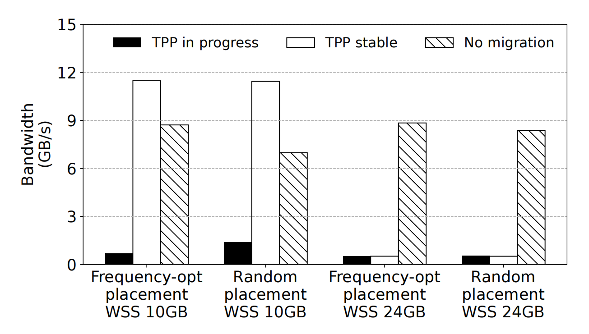
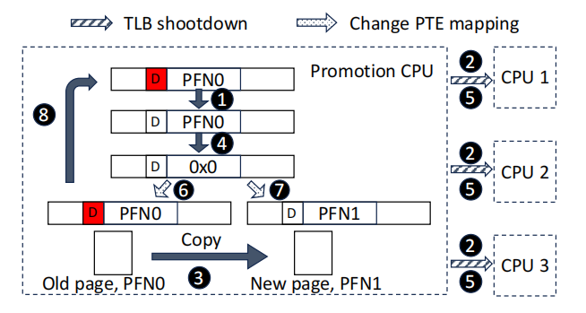
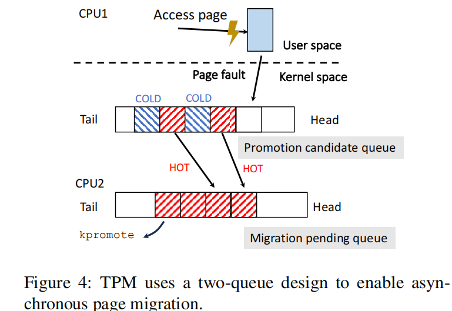
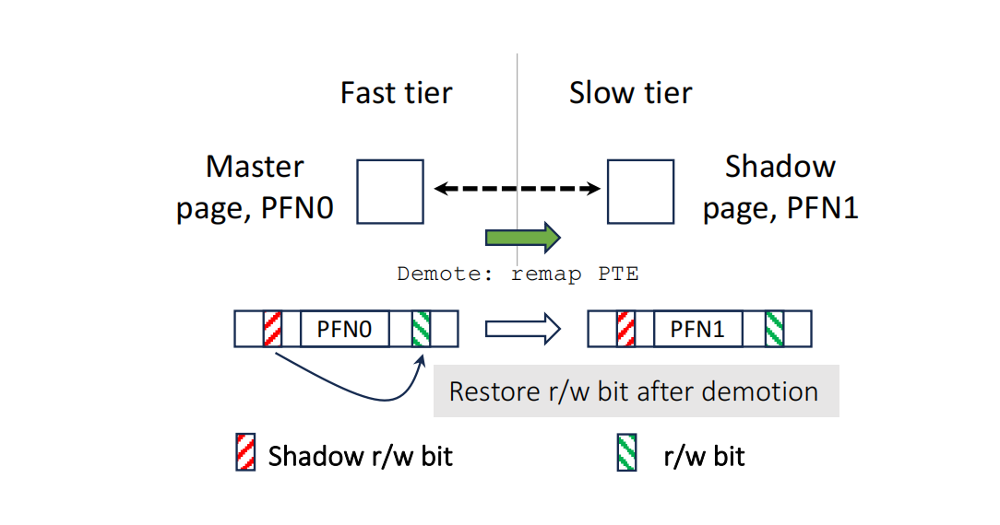
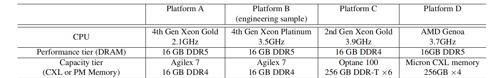

傲腾的最小单位是256B

大页内存，HugePage，通常为 2MB

Translation Lookaside Buffer (TLB)

硬件内存采用直接映射，导致有抖动现象。

通过分配时进行预测减少冲突，例如JohnyCache（）

CXL的最小管理单元是2MB？

# Nomad

Nomad: Non-Exclusive Memory Tiering via Transactional Page Migration

https://github.com/lingfenghsiang/Nomad

## 0 摘要

随着字节寻址内存设备（如CXL内存、持久性内存和存储级内存）的出现，分层内存系统(tiered memory systems)成为现实。页面迁移（Page migration）是操作系统中管理分层内存的默认方法，旨在尽可能将热点数据移入快速内存，以优化数据访问性能，同时使用慢速内存来容纳从快速内存溢出的数据。

尽管现有研究已经证明了各种页面迁移优化的有效性，但它们未能解决一个根本**问题**：在分层内存管理中，独占内存分层策略(页面要么存在于快速内存，要么存在于慢速内存，而不是同时存在于两者之间的)，是否是最优策略？

> 排他性(独占性)分层内存：数据只能驻留在内存层次结构中的一个层级（例如，快速内存或慢速内存），而不是同时存在于多个层级。

我们证明，当快速内存处于压力下时，基于页面迁移的独占内存分层会导致显著的性能下降。本文提出了新的内存管理策略——非独占内存分层，可以保留从慢速内存提升到快速内存的页面副本，以减轻内存抖动。我们开发了NOMAD，具有事务性页面迁移和页面影子复制功能。NOMAD有助于将页面迁移从程序执行的关键路径中移除，并使迁移过程完全异步化。

测试显示在内存压力下，NOMAD的性能比当前Linux中的**透明页面放置（TPP）**方法提高了最多6倍。我们还将NOMAD与最近提出的基于硬件辅助的访问采样页面迁移方法进行了比较，展示了NOMAD在各种场景下的优势和潜在的弱点。

> TPP（Transparent Page Placement）是Linux中的一种内存管理技术，用于在不同内存层次之间进行数据迁移。TPP通过跟踪页面访问频率来决定哪些页面应被提升到更快的内存（如DRAM），哪些页面应降级到较慢的内存（如CXL内存）。这种技术主要依赖页表扫描和页面错误（page faults）来追踪“热”页面。当内存压力较大时，TPP会将不常访问的页面从快速内存中移出，从而在不同的内存层次之间高效管理数据。

## 1 引言

HBM，DRAM，PM，CXL-memory，未来的计算机系统预计将具有多层内存，并且这些内存在速度、容量、功耗和成本等方面具有不同的特性。分层内存管理的核心是操作系统（OS）内的页面管理、包括页面分配、放置和迁移。

传统内存层次结构通常包括在性能上至少存在一个数量级差异的存储介质。例如，DRAM和磁盘在延迟、带宽和容量上存在2-3个数量级的差异。因此，页面管理的唯一目标是将热点页面保留在“性能”层 (即DRAM)，并在需要时将冷页面迁移（驱逐）到“容量”层（即磁盘），以最大化性能层的命中率。**但是**随着新型内存设备的出现，内存层次结构中的性能差距正在缩小。例如，Intel的Optane持久性内存和CXL内存在延迟和带宽方面能够实现与DRAM相当的性能，差异仅为2-3倍。因此，长期以来指导操作系统页面管理设计的性能差距假设可能不再适用。如果迁移成本过高，将热点页面提升到性能层已经不再有利。

此外，与必须通过文件系统作为块设备访问的磁盘不同，新型内存设备是**字节可寻址**的，可以通过普通的load和store指令直接由处理器访问。因此，对于位于容量层的温热页面，直接访问页面并避免迁移到性能层可能是更好的选择。最重要的是，尽管分层内存的性能依然存在层次性，但硬件已经不再是层次化的，CXL和PM都可以被CPU视作普通的内存节点。

（相关研究，详见后文）

改进内存层级之间的页面迁移，例如: Nimble、透明页面放置(TPP)、Memtis和TMTS等技术。

> Nimble [54]:
>
> - 通过利用透明大页面(Transparent Huge Pages, THP)来改进页面迁移
> - 采用多线程方式迁移单个页面
> - 支持多个页面的并发迁移
> - 这些方法旨在加速页面迁移过程,提高整体性能
>
> 透明页面放置(Transparent Page Placement, TPP) [44]:
>
> - 扩展了Linux现有的NUMA平衡方案
> - 支持快速内存和慢速内存之间的异步页面降级(demotion)
> - 支持同步页面提升(promotion)
> - 目标是更灵活地管理不同速度内存层级之间的页面移动
>
> Memtis [37]:
>
> - 使用硬件性能计数器来减少页面访问追踪的开销
> - 采用后台线程定期异步地提升页面
> - 通过减少监控开销和利用空闲时间进行页面迁移来提高效率
>
> TMTS [24]:
>
> - 与Memtis类似,也使用硬件性能计数器
> - 同样使用后台线程进行周期性和异步的页面提升
> - 旨在降低页面访问跟踪的开销,并在不影响前台任务的情况下优化内存使用

（局限性） 

a. 独占式内存分层:

各层级是互斥的(热页面在性能层,冷页面在容量层)，当性能层容量不足时,可能导致过度的页面交换

b. 低效的页面迁移机制:

- 1)从页面表中取消映射一个页面；2)将页面内容复制到不同的层；3)重新映射页面表上的页面，指向新的内存地址。

问题：代价高昂,频繁迁移可能大幅降低用户感知的带宽；当工作集大小超过性能层容量时,现有方法难以应对

**因此，**本文提倡使用非独占性分层内存，即高速层保存副本，好处是：在内存压力下，如果页面不脏，并且其影子副本存在于容量层上，则只需重新映射页面降级。当内存需求超过性能层的容量时，这允许平滑的性能转换。

为了降低迁移和提示成本，本文提出了TPM（*transactional page migration* ）——一种在迁移期间启用页面访问的新机制。在将页面内容复制到性能层上的新页面后，TPM将检查该页面在迁移期间是否已被弄脏。如果是，则页面迁移（即事务）将无效，并丢弃复制的页面。失败的页面迁移将在稍后被重试。如果成功，则复制的新页面将映射到页面表中，而旧页面将未映射，从而成为新页面的卷影副本（shadow copy）。

**我们开发了NOMAD**，NOMAD是一个新型的分层内存页面管理框架，集成了非独占内存分层和事务性页面迁移。NOMAD通过在容量层内存紧张时优先回收影子页面，防止因影子页面导致的内存不足（OOM）错误。在Linux上实现并进行了评估，覆盖了包括FPGA-based CXL原型、持久内存系统和商用CXL系统在内的四个平台。实验结果显示，NOMAD在内存抖动情况下，相较于TPP，性能提升可达6倍，并且在工作集适合快速内存时，始终比Memtis高130%。

## 2 背景动机

我们介绍了分层内存系统中页面管理的背景，并使用TPP [44]，这是一个为支持CXL的分层内存设计的最先进的页面放置系统，作为一个激励的例子来突出当前页面管理方法的主要局限性。

### **2.1 内存分层**

缓存和分层（**Caching and tiering**）缓存以包容性页面放置模式运行，保留页面在其原始位置，仅在性能层中临时存储一个副本以便快速访问。相反，分层以排他性模式运行，积极地在各种内存/存储介质之间重新定位页面。

> 设备间的差距在缩小：如，英特尔Optane DC持久性内存（PM）提供（几乎）比DRAM高一个数量级的容量（例如8倍），并且在性能上接近DRAM的2-3倍范围内，例如写入延迟低至80纳秒，读取延迟约为170纳秒。更近期的计算表达链路（CXL）是一种基于PCI Express（PCIe）的开放标准互连技术，通过CXL.mem协议为连接各种内存设备（如DRAM、PM、GPU和smartNICs）提供内存般的字节寻址接口。实际的CXL内存提供了与普通DRAM相当的内存访问延迟（小于2倍）和吞吐量（约为50%）。

从操作系统内存管理的角度来看，CXL内存或PM看起来像是一个远程的、无CPU的内存节点，类似于多插槽非一致性内存访问（NUMA）节点。最先进的分层内存系统，如TPP、Memtis、Nimble和AutoTiering，均采用分层方式对不同内存层上的数据进行排他性管理。

我们评估了透明页面放置（TPP）作为Linux中最先进的默认分层内存管理。

> TPP in progress - TPP方法正在进行页面迁移时的性能
>
> TPP stable - TPP方法页面迁移稳定后的性能
>
> No migration - 一种禁用页面迁移的基准方法的性能
>
> 放置策略:Frequency-opt placement 按访问频率放置热页面;Random placement 随机放置
>
> 工作集大小(Working Set Size, WSS)
>
> 理解一下这图：页面迁移过程(TPP in progress)会显著降低性能,即使初始放置是最优的(Frequency-opt)。说明页面迁移的开销很大。
>
> 当工作集大小超过快层容量(如24GB)时,TPP达不到stable,会一直thrashing。而禁用迁移(No migration)反而表现更好。
>
> 佐证，传统的同步页面迁移方法开销大,且在内存压力大时会引起thrashing,严重影响性能。

### **2.2 页面管理**

本节深入探讨了Linux中的页面管理设计，并分析了页面迁移过程中产生的开销。我们的讨论重点在于：1) 如何有效跟踪内存访问并识别热点页面。2) 在内存层之间迁移页面的机制。

> 内存访问的跟踪可以通过软件（内核）和/或硬件支持来实现。具体来说，内核可以通过页面错误（page faults）或扫描页表，甚至同时使用这两种方法来跟踪页面访问。为了精确跟踪每次内存访问，捕获这些信息可能代价高昂。基于页面错误的跟踪通过提示性（轻微）页面错误来捕获选定页面（即其页表条目权限设置为无访问）的内存访问。因此，它允许内核准确地测量这些页面的最近访问情况和访问频率。然而，调用每次内存访问的页面错误会在程序执行的关键路径上带来高昂的开销。相比之下，页表扫描通过周期性检查所有页表条目（PTE）中的访问位，来确定自上次扫描以来最近访问的页面。与基于页面错误的跟踪相比，后者通过选择适当的扫描间隔，在扫描开销和跟踪准确性之间进行权衡。
>
> Linux采用了一种惰性页表扫描机制来跟踪热点页面，这为其分层内存管理奠定了基础。Linux为每个内存节点维护两个LRU列表：一个用于存储热点页面的活动列表，另一个用于存储冷页面的非活动列表。默认情况下，所有新页面都会进入非活动列表，并根据每页结构体页面中的两个标志PG_referenced和PG_active被提升到活动列表。当相应的PTE检查时访问位被设置时，PG_reference被设置，而PG_active在PG_reference连续两次被设置后才会被设置。当页面的PG_active标志被设置时，页面将被提升到活动列表中。对于文件支持的页面，其访问由操作系统通过文件系统接口处理（例如，read()和write()）。因此，每次访问时，这两个标志都会更新。对于匿名页面（例如，通过malloc分配的应用程序内存），由于页面访问是直接由MMU硬件处理的，并且绕过了操作系统内核，因此只有在内存回收期间才会更新它们的引用标志和LRU列表管理。在内存压力下，交换守护进程kswapd会扫描非活动列表及其对应的PTE，并更新非活动页面的标志，并回收/交换掉那些未设置PG_reference的页面。此外，kswapd还会将热点页面（即那些设置了PG_active的页面）提升到活动列表中。虽然这种惰性扫描机制延迟了访问跟踪，以减少跟踪开销，但也削弱了跟踪的准确性。
>
> TPP利用Linux的页表扫描来跟踪热点页面，并采用基于页面错误的跟踪来决定是否将页面从慢速内存中提升。具体而言，TPP将驻留在慢速内存中的所有页面（例如CXL内存）设置为不可访问，任何用户访问这些页面都会触发轻微的页面错误，在此过程中TPP决定是否提升发生错误的页面。如果发生错误的页面在活动列表中，它将被迁移（提升）到快速层。当快速内存处于压力下时，kswapd会将页面从非活动列表迁移到慢速内存中。
>
> 通过硬件支持可以实现精确且轻量级的内存访问跟踪，例如在硬件中增加一个PTE计数字段，记录内存访问的次数。然而，基于硬件的跟踪会增加复杂性，并且需要对主流架构（如x86）进行广泛的硬件更改。在实践中，诸如在Intel平台上的处理器事件基准采样（PEBS）等硬件辅助采样已被用来记录采样硬件事件（如LLC未命中或存储指令）的页面访问（虚拟地址）信息。然而，基于PEBS的分析方法仍然存在平衡采样频率和分析准确性的问题。我们观察到，尽管采用了优化采样率以最小化开销，基于PEBS的方法仍然是粗粒度的，无法捕获许多热点页面。此外，基于采样的方法可能无法准确衡量访问的时效性，从而限制了其做出及时迁移决策的能力。
>
> 内存层之间的页面迁移涉及一个复杂的过程：① 系统必须通过页面错误来处理迁移；② 迁移页面的PTE必须被锁定，以防止其他进程在迁移期间访问该页面，并从页表中解除映射；③ 必须向每个可能缓存了旧PTE副本的处理器发出转换旁路缓冲器（TLB）刷新（通过处理器间中断（IPI））；④ 页面内容在层之间复制；⑤ 最后，PTE必须重新映射到新位置。页面迁移可以同步或异步进行。同步迁移，例如TPP中的页面提升，是由用户访问页面触发的，并处于程序执行的关键路径上。在迁移期间，用户程序会被阻塞，直到迁移完成。异步迁移，例如TPP中的页面降级，则由内核线程（即kswapd）在满足某些条件时处理，通常不在程序的关键路径上。同步迁移不仅因为页面在迁移期间不可访问而代价高昂，还可能涉及大量的页面错误。
>
> 图2显示了在TPP积极在两层内存之间重新定位页面时的基准测试运行时间分解。由于页面提升是同步的，因此页面错误处理和页面内容复制（即提升）与应用程序线程在同一个CPU上执行。页面降级由kswapd通过不同的核心完成，如图所示，异步提升和页面错误处理在应用程序核心上带来了显著的开销。相比之下，降级核心大部分时间处于闲置状态，不会构成瓶颈。正如将在第3.1节中讨论的那样，由于要成功提升一个页面可能会引发多达15次轻微页面错误，用户空间的运行时间也可能因此被延长。这些开销分析解释了图1中观察到的TPP性能不佳的原因。

### 2.3 相关工作

> 这段相关工作部分概括了之前研究者在分层存储/内存系统方面所做的大量开创性工作。这些工作涉及各种存储/内存技术的组合,如SSD/HDD、DRAM/磁盘、HBM/DRAM、NUMA内存、持久内存/DRAM、本地/远程内存、DRAM/CXL内存等。而本文的NOMAD聚焦于由DRAM和新兴字节寻址内存设备(如CXL内存和持久内存)构成的分层内存系统,但也适用于其他类型的分层内存如HBM/DRAM和DRAM/持久内存。
>
> 在轻量级内存访问跟踪方面,之前的工作如Hotbox、Memtis、TMTS等通过各种方法在跟踪开销和精度之间取得平衡,但"常开"的性能分析组件对高压力工作负载并不实用。相比之下,thermostat和DAMON通过对较小部分页面采样或者较粗粒度的区域监控有效降低了扫描开销,但粒度变粗导致页访问模式精度下降。另一方面,为降低AutoNUMA等频繁提示缺页异常的开销,TPP仅对慢层(CXL内存)启用基于缺页的检测,并尝试通过同步迁移及时提升页面。NOMAD从这些现有的轻量级跟踪系统获得启发,通过整合更多时间局部性信息而无需额外CPU开销来对它们加以改进,且与硬件辅助方法不同,无需额外硬件支持。
>
> 在页面迁移优化方面,TPP将页面分配与回收解耦以对应用隐藏回收开销,但页面迁移仍在关键路径上导致显著性能下降。Nimble通过透明大页面迁移和并发多页面迁移等新机制来降低页面迁移开销。Memtis进一步使用内核线程在后台提升/降级页面,将页面迁移移出关键路径。TMTS利用用户/内核协作方法来控制页面迁移。相比之下,NOMAD旨在实现及时的按需页面迁移,同时将页面迁移移出关键路径,与现有页面迁移优化正交且可从中受益。最相关的工作是利用硬件支持将数据固定在缓存中,在迁移期间允许访问页面,而NOMAD同样无需额外硬件支持。

## 3 Nomad 

NOMAD是一种新的分层内存页面管理机制，主要特点是非独占内存分层和事务性页面迁移。NOMAD的设计目标是让处理器能够自由访问快速和慢速内存层中的页面，同时将页面迁移的成本移出用户数据访问的关键路径。

NOMAD不做页面迁移决策，而是依赖操作系统中的现有内存访问跟踪来确定页面温度。在初始内存分配后，NOMAD逐步将热页面迁移到快速层，将冷页面迁移到慢速层。NOMAD旨在最大限度地减少页面迁移的成本和次数。

**Overview**

现代处理器的缓存并不采用纯粹的inclusive或exclusive策略,而是允许某些缓存行在多个层次之间共享,或者避免某些缓存行的驱逐。这启发了NOMAD采用一种非独占式(non-exclusive)的内存分层策略。

> 在现代处理器的缓存管理中，**inclusive** 和 **exclusive** 策略是两种不同的缓存管理方法：
>
> 1. **Inclusive 策略**：所有上一级缓存中的数据（如 L1 缓存）都必须包含在下一级缓存（如 L2 缓存）中。这意味着如果某个数据在 L1 缓存中，那么它也一定存在于 L2 缓存中。
> 2. **Exclusive 策略**：上一级缓存中的数据不会重复存储在下一级缓存中。这样可以避免数据的重复存储，提高缓存的利用率。

与现有的要求每个页面只能存在于一层的独占式分层不同,NOMAD在将页面从慢层复制到快层的同时,会在慢层保留一个被迁移页面的影子副本。这种非独占式分层策略只为已经提升到快层的页面维护影子副本,因此并不是inclusive策略。非独占式策略的优势在于,可以通过简单地重新映射页表项(PTE)来简化干净的冷页面的降级,而无需将冷页面复制到较慢的层。

NOMAD的核心组成部分是一种新的事务性页面迁移(Transactional Page Migration, TPM)机制,用于降低页面迁移的成本。与现有的unmap-copy-remap三步页迁移不同,TPM会在不从页表中取消映射的情况下复制页面。在页面复制期间,页面不会被锁定,并且可以被用户程序访问。复制完成后,TPM会检查页面在复制过程中是否被修改。如果没有,TPM会锁定页面并在PTE中将其重新映射到更快的层。否则,迁移会被中止,并在稍后重试。TPM不仅最小化了页面不可访问的持续时间,而且使页面迁移异步化,从而将其从用户数据访问的关键路径上移除。

### 3.1 事务性页迁移(Transactional Page Migration)

现有的页迁移机制存在两个主要问题:

1. 用户程序会被阻塞,因为页面在迁移过程中是不可访问的。
2. 如果迁移失败,操作系统会重复尝试多次,每次都会触发页错误(page fault),开销很大。

> PFN = page frame number  D = dirty

> TLB shootdown是一种在多处理器系统中维护TLB一致性的机制。
>
> TLB(Translation Lookaside Buffer)是一个硬件缓存,用于存储最近使用的虚拟地址到物理地址的映射,以加速地址翻译的过程。每个CPU核心都有自己的TLB。
>
> 在现代操作系统中,多个进程可以共享同一个物理页面,并且操作系统可以随时更改虚拟地址到物理地址的映射(例如,当页面被换出到磁盘或者migrated到其他NUMA节点时)。当映射关系发生变化时,操作系统需要确保所有CPU核心的TLB中的相应条目都被更新或者失效,以避免使用过期的地址翻译。
>
> 然而,在多处理器系统中,每个CPU核心的TLB更新是独立和异步的。当一个CPU核心修改了页表项(PTE)时,其他CPU核心的TLB中可能还保留有旧的映射关系。为了解决这个问题,操作系统使用了TLB shootdown机制。
>
> 具体来说,当一个CPU核心修改PTE时,它会向所有可能cached了该PTE的CPU核心发送一个TLB shootdown的进程间中断(IPI)。收到该中断的CPU核心会查找并失效自己TLB中对应的条目。只有当所有相关的CPU核心都完成了TLB失效操作,发起TLB shootdown的CPU核心才能继续执行。这确保了在执行依赖于新的地址映射的操作之前,所有CPU核心的TLB都已经更新。
>
> 在NOMAD的事务性页迁移(TPM)机制中,TLB shootdown在两个关键步骤中使用:
>
> 1. 在清空dirty位之后,确保后续的写操作能够正确设置dirty位。
> 2. 在取消旧页面的PTE映射之后,确保后续的内存访问会触发page fault而不是使用过期的TLB条目。
>
> TLB shootdown是确保TLB一致性的重要机制,但是它也引入了性能开销,尤其是在多处理器系统中。因此,现代处理器和操作系统都在探索优化TLB shootdown的方法,例如引入TLB标记位或者使用硬件广播机制等。

如图展示了TPM的工作流程:

1. 清空旧页面PFN0的dirty位D。 (在开始迁移事务前,需要先清空dirty位,以便后续检查页面在迁移过程中是否被修改过。)
2. 对所有可能cached了此页面PTE的CPU核心执行TLB shootdown。(清空dirty位可能无法立即反映在各个CPU核心的TLB中,因此需要执行TLB shootdown以避免使用过期的地址翻译，并保证后续的写操作能够设置dirty位）
3. 复制。 将数据从慢层复制到快层。注意此时旧页面仍然是可访问的。
4. 用原子指令get_and_clear读取并清空旧页面PFN0的PTE。 （在重新映射之前,TPM需要先取消旧页面的PTE映射。通过将PTE清空(设为0)使得旧页面在接下来的一段时间内不可访问。如果此时有进程试图访问旧页面,就会触发一个page fault。同时,由于这个操作会清空PTE,使页面不可访问,因此需要尽可能原子地执行。)
5. 再次对相关CPU核心执行TLB shootdown。 (上一步清空了PTE,但是该变化可能尚未反映到各个CPU核心的TLB中。为了保证TLB一致性,需要再次执行TLB shootdown)
6. 检查步骤4读取到的PTE中dirty位D是否为1。 如果在步骤3复制页面内容的过程中,有其他进程写入了该页面,则dirty位会被设置为1。这意味着复制的新页面内容已经过期,不能用于提交迁移事务。
7. 若干净,则将新页面PFN1映射到PTE中,提交迁移事务。
8. 若脏，则中止迁移事务,恢复旧页面PFN0的PTE映射。 中止的迁移会在将来的某个时间点重新尝试。

> get_and_clear指令的原子性(步骤4):
>
> - 读取和清空PTE这两个操作需要原子地执行。这是因为在读取dirty位和清空PTE之间,可能有其他进程并发地修改PTE,导致不一致的情况出现。
> - 使用get_and_clear这样的原子指令可以保证在读取dirty位的同时,PTE被清空,不会有其他进程在这个时间窗口内修改PTE。
>
> 为什么要再次执行TLB shootdown(步骤5):
>
> - 虽然步骤4已经清空了PTE,使旧页面在接下来的一段时间内不可访问,但是这个变化可能尚未反映到各个CPU核心的TLB中。
> - 如果某个CPU核心的TLB中还缓存了旧页面的PTE,那么该CPU核心上的进程访问旧页面时就不会触发page fault,而是直接使用过期的物理地址,导致数据不一致。
> - 为了避免这种情况,TPM在清空PTE后立即执行一次TLB shootdown,确保所有CPU核心的TLB都失效了旧页面的PTE,后续的访问都会触发page fault。

（如何确定迁移谁呢？）现有的机制(如Linux中的TPP)在内存跟踪上存在一些问题:

1. 迁移时间长,影响用户程序的关键路径。
2. 与现有的基于LRU的内存跟踪机制结合时,会导致过多的页错误。

具体来说,TPP基于页面是否在active LRU列表中来做出逐页迁移决策。但是在Linux中,内存跟踪是批量(每批15个请求)更新,目的是最小化队列管理开销。由于TPP使用同步页迁移,它可能会为一个页面提交多个请求(如果请求队列为空,则最多15个)来将其提升到active LRU列表,从而启动迁移过程。在最坏的情况下,迁移一个页面可能会产生多达15次minor page fault。

> TPP是怎么工作的?
>
> TPP(Transparent Page Placement)是Linux内核中的一种机制,用于在NUMA系统中自动将页面迁移到访问它们的进程所在的节点,以提高内存访问的局部性和性能。TPP最初是为传统的NUMA系统设计的,后来被扩展用于支持新兴的非易失性内存(NVM)和CXL内存等异构内存系统。
>
> 在TPP中,页面迁移的决策是基于Linux的LRU(Least Recently Used)页面替换算法和内存跟踪机制做出的。Linux内核维护了两个LRU链表:active list和inactive list。最近访问过的页面被放在active list中,而长时间未被访问的页面则被放在inactive list中。当内存压力增大需要换出页面时,内核会优先从inactive list中选择页面。
>
> 具体来说,TPP的工作流程如下:
> 1. 当一个进程尝试访问驻留在远程内存节点(如CXL内存)上的页面时,会触发一个页错误(page fault)。
> 2. 在页错误处理程序中,TPP会检查该页面是否在active LRU list中。如果是,则表示该页面是热页面,需要迁移到本地内存节点。
> 3. TPP会通过Linux的内存规约器(memory compaction)机制在本地节点上分配一个空闲页面,然后将远程页面的内容复制到本地页面,再更新页表完成迁移。
> 4. 如果第2步中页面不在active list中,TPP会将该页面标记为"accessed",并将其添加到一个批处理队列中。
> 5. 当批处理队列中累积了足够多(如15个)的页面时,TPP会将它们一次性添加到active LRU list中,以减少队列管理开销。
> 6. 在未来的某个时间点,这些新添加到active list中的页面会被TPP再次扫描,重复步骤2-4,尝试将它们迁移到本地节点。
>
> 从上述流程可以看出,TPP采用的是一种异步批量的页面迁移策略,目的是为了平衡页迁移的时效性和开销。然而,这种策略也存在一些问题:
> 1. 对于频繁访问的热页面,TPP可能会在第一次页错误时因为该页面还不在active list中而错过迁移机会,导致该页面在未来一段时间内继续驻留在远程节点上,影响内存访问性能。
> 2. TPP将多个页面批量添加到active list和迁移的做法,可能会导致较多的无效页迁移,浪费内存带宽和CPU资源。
> 3. 由于TPP的页迁移是在页错误处理程序中同步进行的,因此会延长页错误的处理时间,影响正常进程的执行。
>
> 针对这些问题,学术界和工业界提出了一些改进方案,比如:
> 1. 使用更细粒度和及时的页迁移触发机制,如页表项的访问位、硬件性能计数器等,以更准确地识别热页面。
> 2. 引入异步页迁移机制,将页迁移操作卸载到后台线程或DMA引擎,减少页错误处理程序的开销。
> 3. 实现页迁移流量控制和节流机制,避免过度的页迁移引起系统抖动和性能下降。
>

为了最小化页迁移所需的页错误次数,TPM在与Linux内存跟踪交互时做了一些额外的工作:

1. 除了inactive和active LRU列表,TPM还维护了一个单独的promotion candidate队列(PCQ),用于存储已经尝试过迁移但尚未提升到active LRU列表的页面。
2. 每次发生minor page fault并且故障页面被添加到PCQ时,TPM会检查PCQ中是否有同时设置了active位和accessed位的热页面。
3. 这些热页面将被插入到migration pending队列中,然后由后台内核线程kpromote尝试进行异步的事务性页迁移。

值得注意的是,TPM并没有改变Linux判断页面温度的方式。例如,在Linux中,active LRU列表中的所有页面都设置了两个内存跟踪位,来确定有资格进行迁移。但是由于LRU列表管理的原因,并非所有设置了这些位的页面都在active列表中。TPM绕过了LRU列表管理,提供了一种更高效的方法来启动页面迁移。如果所有的事务性迁移都成功了,TPM可以保证在存在LRU列表管理的情况下,每次迁移只需要一次页错误。

总之,这部分内容揭示了TPM如何巧妙地与Linux现有的内存管理机制协作,以提高页迁移的效率。通过引入PCQ和绕过LRU列表管理,TPM最小化了页迁移所需的页错误次数,进一步优化了NOMAD的性能。

### 3.2 页影子(Page Shadowing)

> - 快速层：主页面（Master page, PFN0）
> - 慢速层：影子页面（Shadow page, PFN1）
> - 使用PTE重映射进行页面降级

NOMAD引入单向页面影子机制，实现非排他性内存分层。性能层（快速层）的部分页面在容量层（慢速层）保留影子副本。通过页表重映射实现高效的页面降级，减少内存压力下的页面迁移开销。

1. 影子页面索引：
   - 使用XArray（类似基数树的数据结构）索引影子页面。
   - 映射快速层页面物理地址到慢速层影子副本物理地址。
2. 影子页面管理：
   - 引入shadow r/w bit，保存原始读写权限。
   - 主页面设为只读，用于跟踪与影子页面的不一致。
   - 主页面保持清洁和一致时，通过页面重映射实现快速降级。
   - 主页面被修改时，丢弃对应的影子页面。
3. 影子页面错误处理：
   - 引入"影子页面错误"机制。
   - 写入只读主页面时触发页面错误。
   - 根据shadow r/w bit恢复读写权限，并丢弃影子页面。
4. 影子页面回收：
   - 系统内存压力大时回收影子页面。
   - 两种回收场景：定期检查和内存分配失败。
   - 使用启发式方法，目标回收请求页面数量的10倍或全部影子页面。

### 3.3 局限性

- 事务性页迁移需要两次TLB shootdown,对于多进程共享页面开销大
- 未来可通过硬件加速TLB shootdown来优化

## 4 评估

#### 评估平台

Platform A:

- CPU: 第4代 Intel Xeon Gold, 2.1GHz
- 快速内存: 16GB DDR5 DRAM
- 慢速内存: 16GB Agilex-7 FPGA-based CXL内存设备

Platform B:

- CPU: 第4代 Intel Xeon Platinum工程样片, 3.5GHz
- 快速内存: 16GB DDR5 DRAM
- 慢速内存: 同Platform A,16GB Agilex-7 FPGA-based CXL内存设备

Platform C:

- CPU: 第2代 Intel Xeon Gold, 3.9GHz
- 快速内存: 16GB DDR4 DRAM
- 慢速内存: 6个256GB Intel Optane 100系列持久内存

Platform D:

- CPU: AMD Genoa 9634, 3.7GHz
- 快速内存: 16GB DDR5 DRAM
- 慢速内存: 4个256GB Micron(预市场)CXL内存模块

### 4.1 微基准测试: 

a. 小工作集场景:

- NOMAD和Memtis在读操作上表现相似。
- 写操作中,NOMAD因可能中止的迁移和影子页面维护,性能略低于Memtis。
- NOMAD在读写操作上都持续优于TPP。
- 稳定阶段,NOMAD和TPP性能相似,而Memtis性能最差,仅达到其他方法40%的性能。

b. 中等工作集场景:

- 过渡阶段,NOMAD和TPP性能低于Memtis,因为它们进行了更多的页面迁移。
- 稳定阶段,NOMAD显著优于TPP,特别是在平台D上。
- NOMAD在读操作上优于Memtis,写操作性能相当。

c. 大工作集场景:

- NOMAD和TPP性能均低于Memtis。
- NOMAD仍然持续且显著地优于TPP。

### 4.2 真实应用测试: 

a. Redis (键值存储):

- 小RSS情况下,NOMAD性能优于TPP和Memtis。
- 大RSS情况下,NOMAD优于TPP,但不及Memtis。

b. PageRank (图计算):

- 小RSS情况下,各方法性能差异不大。
- 大RSS情况下,NOMAD性能是TPP的2倍,略优于Memtis。

c. Liblinear (机器学习):

- 小RSS情况下,NOMAD和TPP显著优于"无迁移"和Memtis。
- 大RSS情况下,NOMAD持续保持高性能,而TPP性能显著下降。

### 4.3 迁移成功率:

- Liblinear有较低的迁移成功率,但NOMAD性能出色。
- Redis有较高的迁移成功率,但NOMAD性能较差。

### 平台特性影响:

- NOMAD在配备更快、更大CXL内存的平台D上表现更好。
- 平台A和B在微基准测试中表现相似,但在实际应用中略有不同。

总结:

- 当工作集小于快速内存容量时,NOMAD通过异步、事务性页面迁移保持较高性能。
- 当工作集接近或超过快速内存容量时,NOMAD的基于页面错误的迁移可能影响性能。
- NOMAD的页面影子机制在严重内存抖动情况下仍保持读操作的高效性。
- 在所有测试场景中,NOMAD显著优于TPP。

小工作集(Small WSS):

- 工作集大小(WSS)为10GB
- 常驻集大小(RSS)为20GB
- 初始放置方式是:先用RSS的前10GB填满本地内存,再将WSS数据分别放置到本地内存(6GB)和远程内存(4GB)
- 小工作集可以完全放入到快速内存中,代表了低内存压力情况

中等工作集(Medium WSS):

- 工作集大小(WSS)为13.5GB
- 常驻集大小(RSS)为27GB
- 初始放置方式是:先用RSS的前13.5GB填满本地内存,再将剩余的WSS数据分别放置到本地内存(2.5GB)和远程内存(11GB)
- 考虑到系统预留内存,中等工作集会引起轻微的内存压力,可能偶尔出现页面换入换出

大工作集(Large WSS):

- 工作集大小(WSS)为27GB
- 常驻集大小(RSS)为27GB
- 初始放置方式是:先用WSS的前16GB填满本地内存,再将剩余WSS放入远程内存
- 大工作集远超过了快速内存容量,代表了高内存压力情况,会频繁出现页面换入换出

# Managing Memory Tiers with CXL in Virtualized Environments

这篇论文题为"Managing Memory Tiers with CXL in Virtualized Environments"，研究了在虚拟化环境中利用CXL技术管理多级内存。以下是对文章的分段解释：

## 摘要：

云服务商希望部署基于CXL的内存来扩展总内存容量、降低成本和减少碳排放。然而，CXL访问比本地DRAM有更高的延迟。现有系统使用软件在页面粒度上管理数据在内存层级间的放置。由于在虚拟化环境中开销很大，云服务商不愿意部署基于软件的分层。基于硬件的内存分层可以在cache line粒度放置数据，缓解这些缺点。但硬件对应用级性能一无所知。本文提出将硬件管理的分层与软件管理的性能隔离相结合，以克服两种方法各自的缺陷。

引言：
- 在公有云中，虚拟机内存大小不断增加，通常每个vCPU配置4-32GB [6,7,12]。但是，通过DDR通道可访问的DRAM容量跟不上可用核心的快速增长，因为扩展DDR DIMM容量存在物理限制 [73,91,92]。为此，云服务商越来越多地增加容量内存层来扩充常规的本地访问DRAM（即性能层）[61,72,78,84,99]。
- 最近的CXL标准[8,91]提供了一种新机制，通过PCIe总线访问DRAM或非易失性内存(NVM)，有可能显著扩展内存容量。此外，CXL可以通过供应退役的DRAM或NVM来降低TCO和碳排放[83,98]。这导致数十家供应商对CXL内存进行了广泛投资[9,10,15,25,27,28,37]。

云工作负载和设计目标：
- Azure和其他大型云服务商对所有工作负载进行虚拟化。VM通常很小。
- 生产集群调度程序[47,64,97]通过混合不同的工作负载来提高利用率，几乎没有（或很少）共存约束。
- 一些约束迫使类似的工作负载在许多主机和机架上运行，例如为了容错。这导致典型的主机在任何给定时间运行异构的工作负载集，代表许多不同的工作负载行为。
- 我们得出以下四个一阶设计目标：
  1. 与未修改的虚拟机兼容。不要假设客户机合作。 
  2. 低主机资源开销。云服务商寻求出售几乎所有核心[44,79]。主机通常使用大的2MB或1GB页面大小来减少开销。
  3. 与完全在本地内存上运行相比，不会引入额外的跨VM干扰源。
  4. 对所有工作负载，性能都接近本地内存。将性能下降限制在5%左右，与之前的工作类似[78]。

软件管理的分层：
软件管理的分层通常将层表示为NUMA节点[61,78,84]。软件显式地从NUMA节点分配内存并在节点之间迁移页面。Hypervisor/OS通常跟踪内存热度，以将热的容量层页面提升到性能层，将冷页面降级到容量层[61,84,89,100]。热度跟踪通常依赖于页表操作，如扫描PTE访问位[61,84,100]或临时取消映射条目以在访问时触发次要页面错误[45,70,84]。其他软件分层系统使用指令采样(例如，Intel PEBS [61,74,89]或AMD IBS [4])来采样内存请求及其关联的内存地址。

问题1：高主机CPU成本。在云环境中以细粒度跟踪热度是具有挑战性的。指令采样通常由于安全和隐私问题而不可行。因此，云平台需要依赖基于页表的方法。我们发现它们会消耗过多的主机CPU周期，这与设计目标2相悖。

问题2：粗粒度数据放置。软件分层移动整个页面，对访问局部性做了强烈的假设。许多应用程序具有空间稀疏的访问模式，因此在软件管理的分层系统上表现不佳[53,76]。通常，每个页面的cache line只有一小部分是热的；将这些页面移动到性能层将是浪费的。随着云平台使用更大的2MB和1GB页面大小来减少页表深度和TLB未命中[1,34,43,45,50]，这个问题更加严重。

硬件管理的分层：
有多种硬件内存分层的变体[68,75,85,103]。它们通常在CPU SoC上的MC中实现，行为类似于片上CPU缓存。不同的内存层对软件通常是不可见的（没有NUMA节点），细粒度的缓存操作只对MC可见。

一个著名的硬件分层实现是Intel® Optane™ NVDIMM在第2代和第3代Intel® Xeon® 可扩展处理器中的"2LM"或"内存模式"[18,65]。2LM将DRAM配置为cache line粒度的直接映射缓存。因此，它没有热度跟踪开销，并且擅长管理局部性有限的工作负载[76]，而不管页面大小如何（图2）。在CXL上下文中使用2LM的一个主要缺点是第二层包含了性能层。这是浪费的，特别是对于寻求高性能从而提供大量第一级内存的云服务商而言。

Intel® Flat Memory Mode：
Intel® Flat Memory Mode通过在MC中实现数据放置来克服软件管理内存分层的缺点。这允许它在cache line粒度管理数据放置，而不涉及主机CPU。这种设计在虚拟化环境中特别有用，因为数据放置独立于页面大小，并且几乎所有主机CPU内核都可用于运行VM。

评估了Intel® Flat Memory Mode在115个工作负载上的性能。发现：
- 使用仅硬件分层的内存时，73%的工作负载经历的性能下降不超过5%，86%的工作负载经历的性能下降不超过10%。

- 在混合模式下，经历不超过5%性能下降的工作负载百分比增加到82%，95%的工作负载经历不超过10%的性能下降。

- 尽管CXL与本地DRAM相比有显著的性能下降，但大多数应用程序在混合模式下的性能下降很小。然而，即使在混合模式下，一些应用程序仍经历高达34%的非平凡性能下降。这一观察结果引出了使用软件动态地在VM之间分配专用内存页面以始终实现最小性能下降的动机，因为硬件无法感知哪些VM遭受本地内存未命中。

  噪声邻居(Noisy Neighbors)：
  - 在Intel® Flat Memory Mode中，两条冲突的物理内存线竞争同一条本地DRAM线，只有最近访问的那条可以缓存在本地DRAM中。因此，当将冲突页面分配给不同的VM时，它们可能会争用本地内存，从而导致性能干扰。(§3.3)
  - 我们通过运行两个VM来研究由于本地DRAM冲突而导致的跨VM干扰：一个普通VM和一个噪声邻居VM。在普通VM中，我们运行我们的工作负载集中的一个，而在噪声邻居VM中，我们总是运行一个6线程的Intel® Memory Latency Checker(MLC)[19]，它在忙循环中扫描其内存。 
  - 73%的工作负载由于本地DRAM冲突而遭受10%以上的性能下降。结果表明，如果没有任何软件管理来隔离本地DRAM冲突，在同一主机上运行的VM可能会相互造成显著的性能干扰。
  - 与LLC干扰相比，本地内存干扰通常更大。此外，遭受LLC干扰的工作负载也会遭受本地内存干扰。当LLC和本地内存干扰都存在时，那些工作负载经历的性能下降高于只有一个干扰源时。

Memstrata系统:
- Memstrata将繁重的细粒度内存管理工作留给MC中的硬件管理分层层。它通过将轻量级软件堆栈与虚拟化主机集成来提供一致的性能。这实现了前两个设计目标。
- 为了提供性能隔离（设计目标3），Memstrata采用页面着色[69,105]（一种用于划分CPU缓存的经典技术）来适应CXL设置。Memstrata识别所有冲突的页面，并将冲突对分配给同一VM，确保没有VM间冲突(§4.1)。
- 为了提高异常值（outlier）的性能（设计目标4），Memstrata在VM之间动态分配专用本地内存页面，以减少异常值的本地内存未命中率。我们的关键见解是，即使没有任何专用本地内存，许多工作负载也表现出较低的性能下降。因此，如果hypervisor可以识别异常VM并将专用本地内存页面移动到它们，就可以限制它们的性能下降。
- 然而，hypervisor对VM内运行的工作负载的可见性有限，这使得识别异常值变得具有挑战性。尽管监控本地DRAM未命中率似乎很有吸引力，但我们无法直接测量每个核心或每个VM的未命中率，因为数据放置是在MC中实现的，因此硬件性能计数器只能报告系统范围的本地内存未命中率。
- 为了解决这些挑战，我们分析了在应用性能研究期间测量的大量性能事件，并提出了一个代理来估计每VM的未命中率。通过将估计的未命中率与其他性能指标相结合，我们可以使用简单的在线ML模型准确预测VM的性能下降(§4.2)。动态页面分配器使用此模型在VM之间迁移专用本地内存页面，以最小的CPU开销最小化所有工作负载的性能下降(§4.3)。
图8显示了Memstrata的概述和工作流程。

评估：
- 对于所有六个实验（图10），Memstrata能够将异常值应用程序的性能下降显著降低到接近5%或更低，而对其他对内存不敏感的应用程序的影响最小。
- 当存在四个异常值时，Memstrata无法将所有异常值的性能下降降低到5%以下。这是因为33%的专用本地DRAM（即26.4GB）不足以容纳四个异常值VM的内存需求（56GB）。通过重复使用67%专用本地DRAM的实验，我们证实了这一点。在这种配置下，Memstrata消除了所有异常值（图12c）。
- 在VM不断启动和终止的更复杂设置中，Memstrata可以在所有三种工作负载组合下显著降低离群值的性能下降（图13）。结果表明，Memstrata的在线异常检测可以实时识别异常情况，并动态迁移专用本地内存页面以降低它们的性能下降。

总之，这篇论文提出了一种新的基于CXL的硬件分层系统Intel® Flat Memory Mode，结合软件堆栈Memstrata。该组合在广泛的工作负载上提供了接近本地DRAM的性能。因此，它们能够以最小的应用程序性能影响将服务器内存容量扩展1.5倍。

