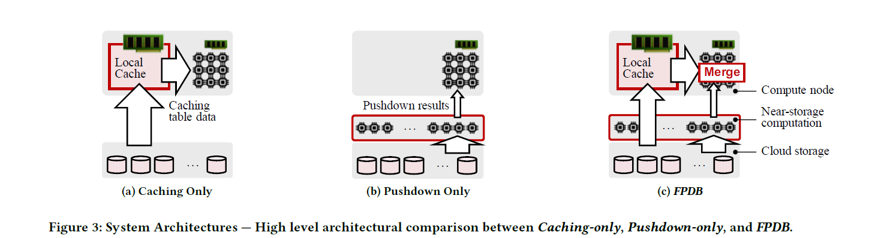
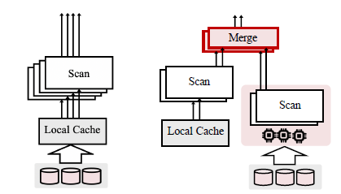
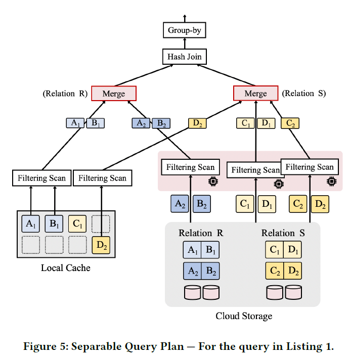
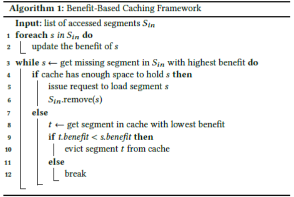
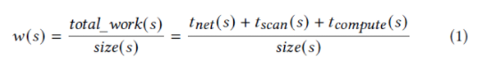
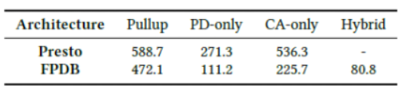
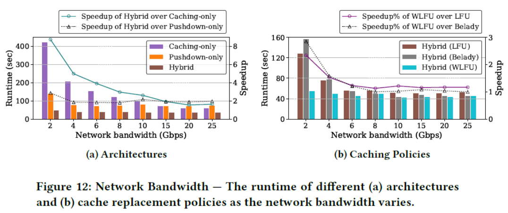
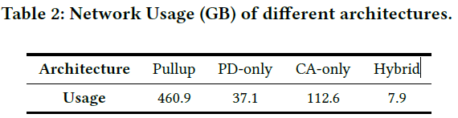
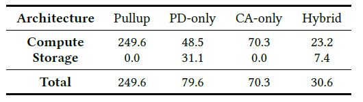

# FlexPushdownDB: 

Hybrid Pushdown and Caching in a Cloud DBMS

</br></br></br>
FlexPushdownDB (FPDB) 是一个OLAP存储管理系统原型。

一种细粒度混合查询：提出新概念——separable operators,以分解查询然后再结合cache中的数据和下推计算的结果。

一种新的缓存替换策略：Weighted-LFU，考虑下推计算的开销。
原型开源https://github.com/cloud-olap/FlexPushdownDB.git

---
## 1 INTRODUCTION

现代云数据库存算分离架构的主要瓶颈：计算层和存储层间的网络
两种主流解决方案(来减少网络传输)：

- caching
- computation pushdown

但是:
1.现有的DBMS往往只支持其中一种，存在潜在的性能优势未被充分利用。
2.传统缓存替换策略的前提：假定每次需要替换的都是相同的块。而FPDB还可以选择pushdown，所以提出**Weighted-LFU**——将cache和pushdown纳入统一的成本模型，以预测最佳成本。

---

## 2 背景&动机

#### 2.1 Storage-disaggregation Architecture

现代云数据库中的分解架构支持存储层内的有限计算。这种计算可以在存储节点上进行，也可以在靠近存储节点的另一层中进行。这允许数据库将筛选和简单的聚合操作推送到存储层，从而提高性能并降低潜在的成本

#### 2.2 Challenges in Disaggregated DBMSs

选择存算分离架构带来的新问题：

存储层与计算层之间的网络传输带宽，明显低于单机中硬盘的IO带宽，成为了新的性能瓶颈 。

进而衍生出两种解决方案，但并没有充分发挥算分离架构的性能。


---
#### 3.1 FPDB的整体结构

其中，在Cache中只存储表数据。（？不能同时存储下推计算的结果）
在远端，表根据某些属性分成不同的分区。每个分区都以文件的形式存储在云存储中，并包含相应行子集的所有列。（水平分割）

**Segment**
Cache中的基本存储单元——segment，段中存储了部分表的特定列
即，每个段有独一无二的segment key（表名，分区号，列名）
<!-- 另外，段结构的数据格式可以灵活选用，比如使用csv -->
</br>

---

## 4 HYBRID QUERY EXECUTOR

#### 4.1 Separable Operators

提出了"Separable Operators"的概念，如果一个算子，其计算可以同时利用caching data和下推计算后的结果，则认为是可分离的。

- Projection 投影显然是可分离的
- Filtering Scan 要考虑具体涉及的列
- ...



___

#### 4.2 查询计划的分离

每一个算子都可以是多线程的，每个工作现成都可以拥有多个数据段，这些段既可以是本地的，也可以是远端的。如果是二者混合的数据源，先在本地进行merge，再发送给下游

#### 4.3 举例——考虑一个简单查询
<br>

```sql
SELECT R.B, sum(S.D)
FROM R, S
WHERE R.A = S.C AND R.B > 10 AND S.D > 20
GROUP BY R.B;
```

存在R，S两表，R中有A，B两列，S中有C，D两列。每个表均分为两个partition，local cache中已有部分数据如图:

---

R表：由于A1、B1已在cache中，直接读取并完成filtering；A2，B2不在，则通过计算下推，执行filtering scan获取，并通过"merge"将两部分数据结合。
S表：虽然C1在Cache中,但由于筛选条件在D上, D1不在cache中,还是通过下推进行。
D2在cache中，从cache中直接获取。C2在远程存储，下推读取，然后merge。

---

#### 4.4 Execution Plan Selection

FPDB采用启发式的策略：

1. 如果本地有cache数据能满足要求，优先从cache读取<br>
2. 其余的尽可能做计算下推<br>
3. 如果无法下推(e.g unseparable)，则使用原始方式load数据到计算层<br>
<br>
(但这样做相当于默认了在local cache > pushdown > Load)

---

## 5 Cache Manager

### Weighted LFU

传统策略中有一个基本假设：认为CacheMiss时，把每一个block加载上来的代价是相同的。但在考虑到计算下推时，这个假设已经不再成立。某些segments可能会更受益于下推，即使cache miss了代价也不大。

因此新的cache策略考虑了pushdown所带来的影响，为每个segment设置一个对应的收益值。（segment下推计算的代价越大，缓存在cache中的收益也越高）整个cache的目标就是使全局的Σbenefit最大。

---


具体地，如果cache中有空间，则segment无条件加载上来;；否则要做eviction，选择最小benefit的segment做淘汰，直到全局benefit开始变小时，不再加载data。（Algo1）



每个段的benefit值是它的使用频率（归一化，即freq/segment.size），而权重则是表示该segment下推计算的cost，包括网络传输 + 在S3做scan + 计算谓词的代价之和。

---

### Integration with Hybrid Executor

新的Cache策略如何与之前的Hybrid Executor结合？

由executor向cache发起要访问段的请求，cache层根据请求更新相关的统计信息(e.g freq...)等，决定哪些segment应该被加载或淘汰，然后做必要的load data或者computation pushdown。

具体来说

1. 如果是cache hit，则直接基于Cache内segment做计算
2. 否则是cache miss，由cache manager决定是否要加载该数据到cache中
3. 1. 决定不加载，则执行computation pushdown；
   2. 决定加载，要么等待数据读入cache再计算，要么执行pushdown，paper选择前者

（? 与前文4.4矛盾，到底怎么实现）


---


## 总结

与Presto的对比


paper中基于Star Schema Benchmark做了一系列实验，对比了caching-only/pushdown-only的架构（左图）以及传统的LRU/LFU/Belady缓存更新策略（右图），都显示出更好的性能。




---


新架构在资源占用上的下降：






