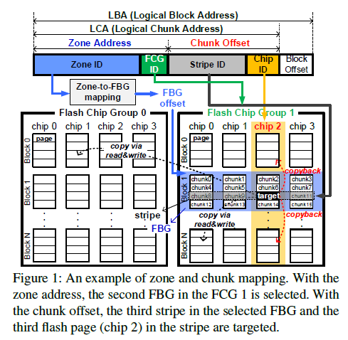
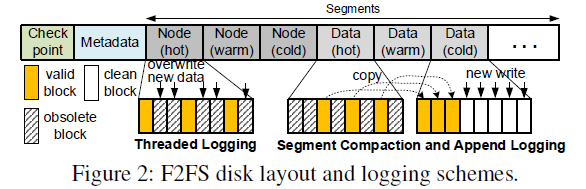
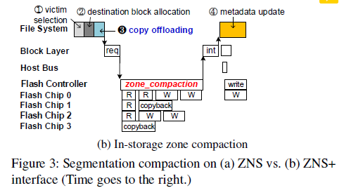
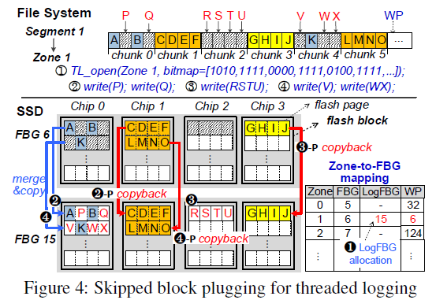
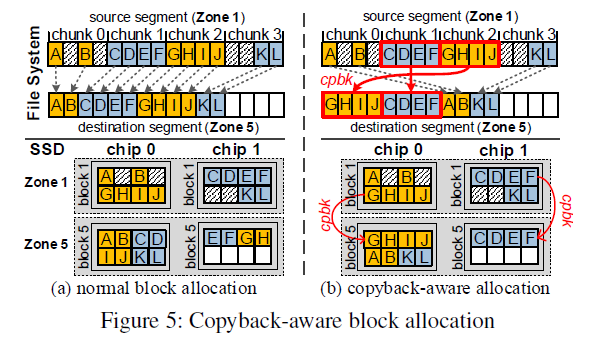
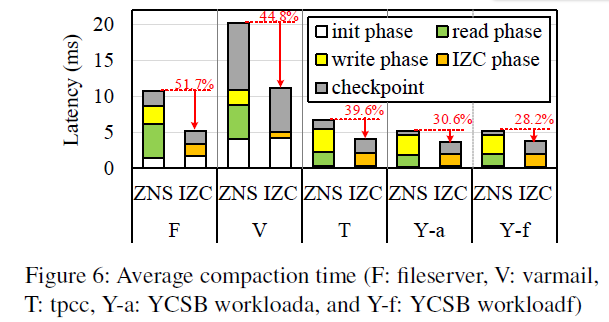
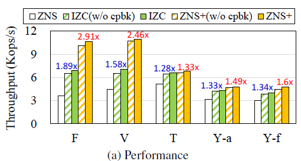
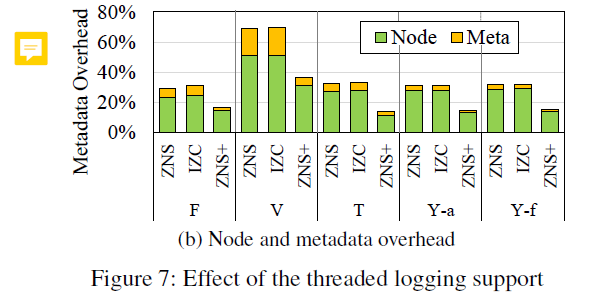
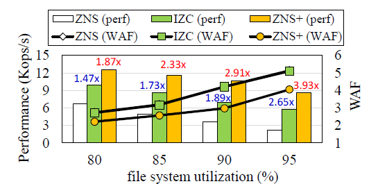
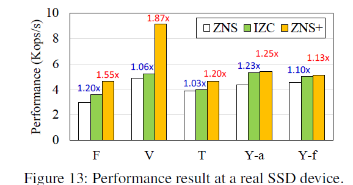

<!-- headingDivider: 3 -->
<!-- pagenumber: true -->
# ZNS+
ZNS+: Advanced Zoned Namespace Interface for Supporting InStorage Zone Compaction
   
https://www.usenix.org/system/files/osdi21-han.pdf
https://github.com/eslab-skku/ZNSplus.

## 0 Abstract
ZNS+: Advanced Zoned Namespace Interface for Supporting In-Storage Zone Compaction

本文提出了一种名为ZNS+的支持LFS的ZNS接口及其实现，该接口允许主机将数据复制操作卸载到固态硬盘，以加快段压缩。

- ZNS+允许zone的稀疏顺序写，可以使用threaded logging-based block reclamation代替段压缩。
- 引入了两种新的文件系统技术：copyback-aware块分配和混合段回收。

提出的 ZNS+ 存储系统的性能比基于 ZNS 的普通存储系统的性能好 1.33-2.91 倍。

## 1 Introduction

NVMe zoned namespace（ZNS）逻辑地址空间被划分为区域（Zone），每个区必须按顺序写入，复用之前必须被显示的重置。

优势：

- 不同 IO 流之间的**性能隔离**。可通过为每个 IO 流分配单独的区域来实现，这对多租户系统非常有用
- ZNS 固态硬盘维护逻辑地址到物理地址的**区级映射**。好处是：节省所需的DRAM，只需一个很小的内置DRAM即可。而传统固态硬盘维护细粒度的映射所需 DRAM 相当于 0.1% 的存储容量。
- 不再需要SSD内的垃圾回收。也就不需要配置额外的冗余空间，并且避免了GC带来的不可预测的延迟，几乎没有写放大。
***
**问题:**

旧的段必须进行段压缩(段清理或垃圾收集)，即将该段中的有效数据移动到其他段，以使得段干净。  //此处"段"指的是F2FS的基本管理单元

使用GC-less ZNS SSD的代价——在主机端GC，增加主机开销，而且主机到设备间的数据传输使得在主机端做GC的代价更大。
有研究表明，F2FS在文件系统利用率为90%的情况下，压缩操作造成的性能损失约为20%。

作者认为：目前的 ZNS 只关注固态硬盘方面的优势，而没有考虑到主机复杂性的增加。(当然尽管如此，主机仍能从 ZNS 中获益，包括性能隔离和可预测性）

## 2 Backgroud
#### 2.1 一些名词
parallel flash controllers (channels)
flash chips (ways)

**chunk**：由于现在的flash产品的flash页面大小通常大于逻辑块大小(4 KB)，在本文中，我们将映射到flash页面的逻辑连续块称为chunk。（chunk指的是SSD中一个单元，只是目前工艺已经大于4 KB了）

**Chip**: 一列chunk，一个chip共享一条way            (貌似这篇文章中:chip = plane) 
一个memory chip通常支持：read, program, erase, and **copyback** 命令。

**copyback**：指的是chip内的数据复制，单位是chunk。注意由于chip内的转移不能检查ECC，所以闪存控制器会在拷贝操作的同时检查错误。
***
#### 2.2 Zone Mapping

FBG(Flash Block Group)：一个zone映射到的一串物理块组。

为了提高并行性，一个zone希望放在不同的chip上。并行的chip数称为交错度（$D_{zone}$）。

跨chip的连续块称为条带（stripe），以交错度为除数分成chip组（FCG：Flash Chip Group）如图。

以上设计使得SSD只需要维护 Zone-FBG 映射。
***

#### 2.3 F2FS 

>F2FS是Flash Friendly File System的简称。该文件系统是由韩国[三星](https://www.elecfans.com/tags/三星/)[电子](https://www.hqchip.com/ask/)公司于2012年研发，只提供给运行[Linux](https://www.elecfans.com/v/tag/538/)内核的系统使用，这种文件系统对于NAND闪存类存储介质是非常友好的。并且F2FS是专门为基于 NAND 的存储设备设计的新型开源 flash 文件系统。特别针对NAND 闪存存储介质做了友好设计。F2FS 于2012年12月进入Linux 3.8 内核。目前，F2FS仅支持Linux[操作系统](https://m.elecfans.com/v/tag/527/)。

F2FS：
- 包含6种类型的数据段（2M），同类段一次只能打开一个；//将冷热数据分割成不同的数据段，压缩时冷块会被放入冷段。

- 多头日志策略；

- 同时支持append logging，threaded logging。既可以严格顺序写， 也可以写入脏块的废弃空间。
***
- **日志写入自适应**：如果空闲段足够多，优先追加写入；空闲段不足，将数据写入dirty segment的无效块上。(然而， 实际上后者在ZNS中是被禁用的，所以F2FS for ZNS会经常触发压缩。)

- 前后台压缩机制：空间不足，先前台压缩（造成少量IO延迟）；闲时后台压缩（无法及时回收，尤其是在空间占用高，突发写请求时）
(本文主要关注前台压缩的性能)

## 3 ZNS+ Interface and File System Support
### 3.1 动机
**普通的段压缩**

朴素的LFS端压缩包括四个步骤：
1. 受害者段（victim segment）选择

2. 目标块分配

3. 有效数据复制

4. 元数据更新

   

其中，SSD的空闲间隔很长（图中idle）

***

**基于IZC的段压缩方案**
IZC（Internal Zone Compaction）
 
引入了copy offloading操作：发送zone_compaction指令来传递 block copy 所需的信息。减少了段压缩的延迟

### 3.2 LFS-aware ZNS+ Interface
 

三个新命令：*zone_compaction,   TL_open,  and   identify_mapping*

 

zone_compaction 用于请求IZC操作（区内压缩）：现有的simple copy命令要求目标地址单一、连续；ZNS+下，可以指定多个目标LBAs

TL_open：打开区域，准备threaded logging。接下来这个区域可以不经reset就覆写。

identify_mapping：主机使用这个命令确定各个chunk所在的flash chip

***
##### 3.2.1 IZC(Internal Zone Compaction)
ZNS+的压缩流程：
###### （1）Cached Page Handling：
检查victim段各个可用块对应的page是否被主机DRAMcache。If Cacheed page dirty：必须被写入目的段，并排除在IZC操作外；If clean：既可以通过写请求从主机传输写入，也可以从SSD内部复制。
// 注：ZNS一般使用TLC or QLC，目前内部复制往往没有主机快。然而，最新的ZNAND有极短的读延迟，对于ZNAND SSD，in-storage copy也可能更快。

###### （2）Copy Offloading：
zone_compaction(sourceLBAs, destination LBAs)
***
###### （3）处理 IZC
ZNS+ SSD处理压缩指令时，定义了copybackable chunks（如果其中所有块都是复制来的）。其他不可回拷的正常读写。

**异步处理**

zone_compaction请求的处理是异步的，主机请求进入请求队列后不会等待命令完成。LFS有自己的checkpoint，异步不会影响文件系统一致性。

ZNS+会对后续的普通请求重新排序，避免zone compaction操作的长延迟的影响：放行与压缩地址无关的普通请求；甚至包括对正在压缩的区域的读请求，比如如果写指针已经经过了要读取的目标块地址，那么也可以放行。

***
#### 3.2.2 Sparse Sequential Overwrite 
 

**Ineternal Plugging(插入合并)**

为了支持 F2FS的threaded logging，ZNS+需要做稀疏的顺序覆写。

尽管二者有冲突，但是：threaded logging访问的脏段的块地址的闲置空间时，也是从低地址端向高地址端的，虽然不连续但是也递增。
因此说他的访问模式是 Sparse Sequential Overwrite （即WP一直右移）

如果固态硬盘固件能够读取请求之间被跳过的数据块，并将其合并到主机发送的数据块中。那就变成了密集的连续写入请求——这种操作称为internal Plugging。

***

          
上图是一个Plugging操作的例子：chunk0中的AB，是有效块（跳过块），PQ是无效块

***
**Opening Zone for Threaded Logging** 

SSD必须知道目标段的跳过块：(朴素方法)通过对比写请求的LBA和当前WP以及有效位，SSD确定哪些是跳过块。然而，这样做必须要等到写请求到达才能确定跳过块，产生了延迟。

因此，增加了TL_open这个特殊命令，TL_open(openzones, valid bitmap)。它会提前发送一个bitmap，SSD可以在thread logging的写请求到达之前确定那些块要跳过。

**LogFBG Allocation**

原有的被"TL_opened"的zone要被重写，新分配一个FBG叫LogFBG（图中， original FBG (FBG 6) and the LogFBG (FBG 15)）

这个新分配的LogFBG也是在同一个chip上的，所以可以使用copyback快速完成；TL_opened的区域最终关闭时，直至LogFBG替换了原始的FBG，原始LGB被释放以供重用。

***

**LBA-ordered plugging**
按逻辑地址有序插入，SSD可以提前通过该区块的有效位图感知到chunk1都是有效块，可以跳过处理，直接一整个chunk复制到LogFBG，移动WP，为写入chunk2做准备。即LBA-ordered的插入操作始终发生在WP处。

**PPA-ordered plugging**
physical page address (PPA)  
更进一步地，只考虑物理地址的顺序写入约束。可以检查并让后续的完整chunk提前copy。
比如说chunk3可以在chun0、chunk2中的写请求到来之前就进行复制。
但是，过多提前的plug会干扰用户IO请求，所以只有目标chip空闲时才会进行。

<!-- 
**为什么Threaded Logging能提升性能？**
二者copy的块的数量是相同的。但是，threaded logging减少了重定位时元数据的修改；
调用空闲的chip，internal plug的开销部分隐藏了。因此最小化写入请求的平均延迟 -->

### 3.3 ZNS+-aware LFS Optimization(OS级的优化)
#### 3.3.1 copyback-aware的块分配机制
 
现有LFS未充分利用copyback：

因为LFS在段合并的过程中，可能会出现跨芯片压缩的情况。如右图

<!-- **Chunk Mapping Identification**

对于identify_mapping 命令，ZNS+SSD会返回FCG ID和chip ID -->

***
**最大化利用copyback**

文件系统在目标段中保留连续的空闲块，用来复制有效块; 
分配时,为源段中每个完全有效的块分配相同芯片的目标块位置（identify_mapping 获取到的 FCGID和chipID可以提供这个信息），

在处理完完全有效的chunk后，再依次填满所有空闲空间，如图b。

***

**但是**，如果源数据段中有效的数据块没有在多个闪存芯片中均匀分布,一些数据块就无法从保留区域中找到可复制的数据块位置。而必须写到不可复制的数据块上。
一种方法是额外再分配block。
另一个方法是可以对含有部分无效内容的chunk使用copyback（如图 5 中的chunk 0 和chunk 3），这可以缩短数据段压缩时间。
（具体容忍额外分配多少空间有待研究）
**其它拓展**

多核固态硬盘：存在多个嵌入式处理器，每个处理器运行一个 FTL 实例来管理自己的分区地址空间和闪存芯片，同时利用处理器级并行性。在多核固态硬盘中，一个区域可在多个分区之间映射，分区间复制延迟将长于分区内复制延迟，因为分区间操作会产生通信开销。因此，分区感知的块分配将有利于多核ZNS+ SSD。

设备级区块分配: 与文件系统级的回传感知块分配不同，我们可以考虑设备级的方法，由固态硬盘确定逻辑块位置，这种方法可以实现回拷感知的区块分配，即使主机不知道 SSD 内部的块映射。

***
#### 3.3.2 混合式段回收

虽然threaded logging减少了回收开销，但其效率依然低于端压缩，两大原因：

**回收成本不均衡**

段压缩可以直接选取压缩成本最低的受害者段（例如，选有效数据最少的）。但threaded logging只能从同类型的脏数据段中为某写入请求选择目标数据段，以防止不同类型的数据混杂在一个数据段中。

**预失效块问题**

如果长时间使用稀疏到的线性日志写而不进行检查点处理，它的回收效率将进一步下降:
这是由于某些块虽已经失效，但仍被存储元数据引用，因此不可回收。当一个逻辑块被文件系统操作作废，但新的检查点仍未记录时，该逻辑块就会成为预作废块(预失效块)，不得覆盖，因为崩溃恢复需要恢复它。

预无效块会随着threaded logging的继续而累积，而它们可以通过段压缩来回收，因为段压缩伴随着检查点更新。

***
**定期检查点**
为了解决预无效块问题，我们使用定期检查点，每当累积的预无效块达到一定数量，触发检查点。这需要文件系统进行监测，元数据块上的写入流量就会增加，如果过于频繁地调用检查点，固态硬盘的闪存耐用性就会受到损害。因此需要一个合适的阈值——128 MB
**回收成本模型**
我们提出了混合段回收（HSR）技术，通过比较线程日志和段压缩的回收成本来选择回收策略。
Threaded Logging 的开销：
$$C_{TL} = f_{plugging}(N_{pre-inv}+N_{valid})$$

段压缩的开销：
$$C_{SC} = f_{copy}(N_{valid})+ f_{write}(N_{node}+N_{meta}) - B_{cold}$$

B_cold 表示冷数据块迁移的未来预测收益。

(感觉这部分有点随意)

## 4 实验

**一些配置信息：**
模拟器：基于FEMU 
2 GB of DRAM, 16 GB of NVMe SSD for user workloads, and a 128 GB disk for the OS image 
Host interface: PCIe Gen2 2x lanes (max B/W: 1.2 GB/s)
SSD： 默认存储介质是MLC,  The data transmission
默认的ZNS+ SSD zone size=32 MB, 包含16 flash blocks分布在16 flash chips.
（注：The copyback operation is approximately 6–10% faster than the normal copy operation）
**两种不同版本的ZNS+**
IZC：不包含threaded logging
ZNS+： 混合式

### 段压缩表现：

ZNS与IZC在不同负载下的段压缩表现（模拟器）

与 ZNS 相比，IZC 通过移除主机级复制，将区域压缩时间减少了约 28.2%- 51.7%。IZC存储内复制操作减轻了用户 IO 请求对主机资源和主机到设备 DMA 总线的干扰。但IZC技术增加了检查点延迟。

### threaded logging

in-storage zone compaction 与 threaded logging 下的效果
注： IZC(w/o cpbk) 和 ZNS+(w/o cpbk)即禁用回拷的版本

***
##### 元数据开销对比：

***
##### 性能对比、WAF
(ZNS的WAF呢？)

### 在真实SSD上的性能表现

# ssd

SLC (Single Level Cell)，单层式存储单元，在SLC中，1个cell能够存储1位数据：0或1。
MLC (Multi Level Cell)，多层式存储单元，在MLC中，1个cell能够存储2位数据：00，01，10和11。
TLC (Triple Level
Cell)，三层式存储单元，在TLC中，1个cell可以存储3位数据:000,001,010,011,100,101,110和111。
QLC(Quad Level
Cell)，四层式存储单元，在QLC中，1个cell可以存储4位数据：0000,0001,0010,0011,0100,0101,0110,0111,1000,1001,1010,1011,1100,1101,1110,1111。

https://blog.csdn.net/qq_37633855/article/details/120000982
