<!-- headingDivider: 3 -->
<!-- pagenumber: true -->

# eZNS:  An Elastic Zoned Namespace for Commodity ZNS SSDs
   

https://www.usenix.org/conference/osdi23/presentation/min

## 0 Abstract
新兴的ZNS SSD提供了粗粒度的分区抽象，有望显著提高未来存储基础设施的成本效益，并降低性能的不可预测性。

然而，现有的ZNS SSDs 采用静态分区接口：（zoned interface）
无法适应工作负载的运行时行为；无法根据底层硬件能力进行扩展；共用区域相互干扰。

eZNS——一个弹性分区命名空间接口，提供性能可预测的自适应分区，主要包含两个组件：
- zone arbiter，区域仲裁器，负责管理Zone的分配和激活资源。
- I/O scheduler，分层I/O调度器，具有读取拥塞控制和写入接纳控制。

eZNS实现了对ZNS SSD的透明使用，并弥合了应用程序要求和区域接口属性之间的差距。在 RocksDB 上进行的评估表明，eZNS 在吞吐量和尾部延迟方面分别比静态分区接口高出 17.7% 和 80.3%（at most）

## 1 intro

ZNS：通过划分为Zone ，实现“从设备端隐式垃圾收集 (GC) 迁移到主机端显式回收” ，消除了随机写，解决写放大（WAF）问题。

要在ZNS上构建高效的I/O stack，我们应该了解：
1. 底层固态盘如何暴露接口并强制实现它的限制（如何顺序写？）
2. 设备内部机制如何权衡成本与性能         （代价是什么？）

文章调研了一款ZNS产品，在zone striping, zone alloation, and zone
interference三个方面进行对比分析。旨在了解商用 ZNS 固态硬盘的特性。

提出eZNS，新的接口层，它为主机系统提供了一个与设备无关的分区命名空间。

- 减少了区域内/外的干扰（？），降低延迟
- 改善了设备带宽（通过分配激活资源，基于应用优化的负载配置）

***
###### eZNS对上层应用透明，包含两个组件：

- **区域仲裁器**

维护 “设备影子视图” （device shadow view，该视图本质上是SSD的虚拟表示，仲裁者使用它来跟踪当前正在使用哪些区域以及哪些区域可供分配。）

基于该视图来实现 “动态资源分配” 策略，这意味着它可以根据当前的工作量和其他因素调整分配给每个区域的资源量。

- **分层 I/O 调度器**

充分利用ZNS SSD没有硬件隐藏信息的特性，读取 I/O 的可预测性变得更强，可以直接利用这一特性来检查区域间的干扰。

此外，由于固态存在写入缓存，所有应用的写入操作共享一个性能域，所有zone都激活的时候会堵塞。因此对读进行本地拥塞控制，对写入采取全局准入控制。

## 2 背景&动机
#### 2.2 Zoned Namespace SSDs

namespace：类似硬盘的分区，但是被NVMe设备主控管理
zone：粗粒度，多个blcok的集合
ZNS能为主机应用提供可控的垃圾回收；消除了设备内部I/O行为（消除写放大）

**三种命令：read, sequential write, and append.**

（与上一篇文章有出入的地方）与普通写入相比，区域追加命令不会在 I/O 提交请求中指定 LBA，而固态硬盘会在处理时确定 LBA 并在响应中返回地址。

因此，用户应用程序可以同时提交多个操作，而不会违反顺序写入的限制。
***
#### 2.3 Small-zone and Large-zone ZNS SSDs
 

*physical zone*：最小的区分配单元，由同一个die上的一个或多个块组成。

*logical zone*：由多个物理区组成的条带区域

**区域划分大小的影响：**

*Small zone ZNS SSD*：提供粗粒度的大型逻辑区域，采用固定的条带化配置，跨越内部通道的多个die，不灵活，适用于zone需求少的情况。

*Large zone ZNS SSD*：每个区域都包含在单个die中，最小为一个擦除块。灵活，同时可激活的资源更多。最近有研究认为越小越好，可以减少区回收延迟造成的干扰，所以这个区域划分有待探究。
***
#### 2.4 The Problem: Lack of an Elastic Interface
 

ZNS SSDs存在的问题：在zone被分配、初始化之后，他的性能就已经固定了

1. 分区的性能只取决于分区位置的放置和stripe的配置。（但我们希望它的性能符合应用的需求）虽然，用户定义的逻辑分区已经带来了灵活性，但是应用不了解正在共享设备的其他应用的状态。导致了目前，只能实现“次优”的性能表现。

2. 现有的接口不能适应负载的变化。专门使用一个应用来捕获I/O执行时的数据是不现实的。用户使用时，不得不以最坏的情况来配置分区。（over-provision）

3. 共用一块物理位置的区域互相影响，尤其当固态硬盘被过度占用时，其性能下降严重。

## 3 ZNS SSD的性能

(用测试说明现有的ZNS太固化，不灵活)

#### **3.1 Set up**

>SPDK（Storage Performance Development Kit，Intel）

本文使用在 SPDK 框架上运行的 Fio 基准测试工具来生成合成工作负载。作者在 SPDK 中添加了一个薄层，以实现逻辑区域概念并实现不同的区域配置。

- 写入负载默认为单个逻辑区域上的顺序访问
- 读取负载默认为随即访问
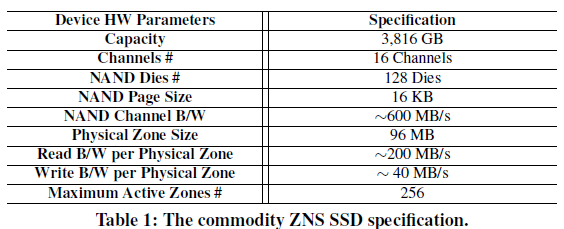

***
#### **3.2 System Model**
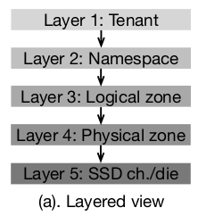

一个tenant=某个存储应用；它拥有一个或多个namespece；其中包含逻辑区域；一个逻辑区包含了多个物理区；物理区下面管理通道、die

应用与NVME驱动之间存在一个 zoned block device (ZBD) layer

1. 在命名空间/逻辑区域管理方面与应用程序互动管理；
2. 考虑到应用需求，协调逻辑区到物理区的映射
3. 安排 I/O 序列，大限度地提高设备利用率并避免行头阻塞。
***
#### **3.3 Zone Striping**
区域条带化是一种用于实现更高吞吐量的技术，尤其是大型 I/O。包含参数：
1. 条带大小：条带中最小的数据放置单位。 
2. 条带宽度：定义了同时激活的物理区域数量并控制写入带宽。

观察：当条带大小（stripe size）与 NAND 操作单元（这里是16KB）相匹配时，可以实现较好分条效率。
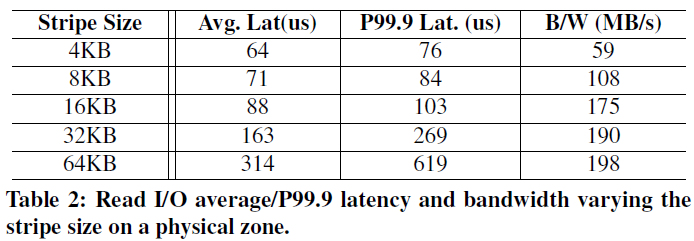

**Challenge #1: Application-agnostic   Striping**
stripe 最好与用户I/O匹配，太小了影响设备I/O效率，太大了浪费性能（单个zone性能变好了，但是可并行的zone总数低，影响其他应用）
（但是搞来搞去还是在等于pagesize时最好，动态调整的点在stripe width上）
***
#### 3.4 Zone Allocation and Placement
现有分配机制：找到下一个可用die，再这个die内根据磨损均衡等各种策略选择最好的块
图5：stripe size = 16KB，每个逻辑区包含N个物理区（横坐标）
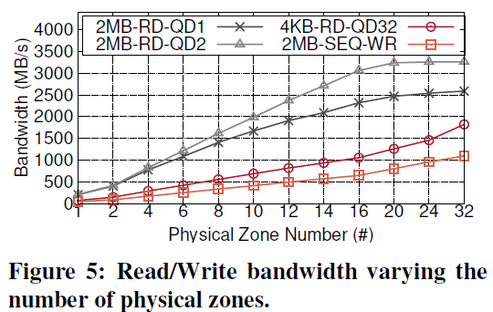(?)
1. PCIe gen3带宽跑满了
2. 应用发出的请求不足，因为请求队列深度只有1。(1,2对比可以体现出QD的差异)
3. 每个物理芯片80MB/s的读取和40MB/s的带宽？——需要更多的物理区域(大约40~80)来充分利用通道或PCIe带宽
***
**Challenge #2: Device-agnostic Placement**

理想的分配过程应该向应用充分利用ZNS SSD的所有内部I/O并行性。现有分配机制完全不考虑应用程序先前的分配历史，以及应用之间的交互关系，这会导致不平衡的区域放置，损害I/O并行性，并危及性能。

列出两种类型的低效放置方案：
- Channel-overlapped placement
- Die-overlapped placement

Observation：在不知道设备内部规格的情况下推断区域的物理位置很困难的，我们需要建立一个设备抽象层：
(1)设备相关的一般分配模型;
(2)维护底层物理设备的阴影视图;
(3)分析其在不同物理通道和模具上的放置平衡水平
***
#### 3.5 I/O Execution under ZNS SSDs

<!-- /* 当读取拥塞时，观察到die/channel争用下的延迟峰值。这是因为 ZNS SSD 没有任何物理资源分区。在namespace内或namespace之间，干扰都会比传统固态硬盘更严重。（因为跨物理块的分配很混乱？）*/ -->
          
128 Zone 16KB stripe size, 70% filled.
与物理配置的SSD作对比（可以看到传统SSD因为垃圾回收损失之大）
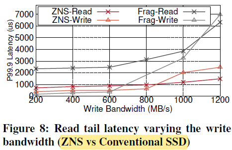
***
**Challenge #3: Tenant-agnostic Scheduling**
现有的ZNS ssd分区接口对域间情况提供的性能隔离和公平性保证很差。我们不能忽视在一个die上的读干扰，在现有ZNS的设计下:
(1)任意数量的区域可以在die上碰撞，

(2)单个die的带宽很差，因此即使在设备上非常低的负载下，干扰也有可能很严重

(3)它会导致严重的线路阻塞问题并降低逻辑区域的性能。

Observation: 
在多租户场景中使用ZNS SSD时，首先应该了解不同的命名空间和逻辑区域如何共享底层设备的通道和NAND die，将它们的关系划分为竞争和合作类型，并在区域间场景中采用拥塞避免方案以实现公平性。

***
由于设备内部几乎没有bookkeeping，因此，可以用延迟判断颗粒碰撞的拥塞情况。
而对于写拥塞需要全局解决。
>bookkeeping 指的是设备在其内部进行的记录和管理操作的过程

**三个问题：**
1. 条带化参数配置与应用无关
2. 区域放置与硬件无关
3. 调度与租户无关

**解决方案：**
(1)一个全局中心仲裁器，决定所有活动区域之间的带宽共享;

(2)基于拥塞级别编排读I/O提交的I/O调度器。

## 4  eZNS
#### 4.1 Overview

eZNS停留在NVMe驱动程序之上，并提供原始块访问。实现一个新的弹性的分区接口v-zone以解决上述问题 

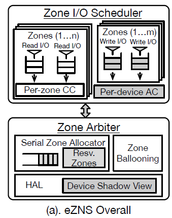

**区域仲裁器：**
(1)在硬件抽象层(HAL)中维护设备影子视图，并为区域分配和IO调度提供基础;
(2)执行序列化的区域分配，避免重叠放置; (把每个stripe unit分摊到不同的die上)
(3)通过收获机制动态缩放区域硬件资源和I/O配置。

**I/O调度器：**
一种延迟调度机制
一种基于令牌的准入机制

***
#### 4.2 HAL

约束条件：

- 物理区域由同一个die上的多个可擦除块组成
- ZNS在die上均匀地分配物理区（规定活动区数必须是die总数的倍数等）
- 分配机制遵循磨损均衡需要。连续分配区域不会在一个die上重叠，直至已经遍历所有die（最后一个contract不那么绝对）

eZNS维护一个影子设备视图（我们的机制不需要认识到SSD NAND芯片和通道的二维几何物理视图，也不需要维护精确的区域-芯片映射），暴露区域分配和I/O调度的近似数据位置。

因此, 我们的机制只依赖于来自设备规格的三个硬件参数：
**MAR** ，maximum active resources 通常与die数成正比，通过离线校准实验测试得到
**NAND page size** （ for striping ）不成文的标准，例如TLC一般用16KB。stripe size选用page size的倍数。
**physical zone size** 用以构造条带组和逻辑分区
***
#### 4.3 连续区域分配器

eZNS开发了一个简单的区域分配器，尽可能减少die冲突，具体地：

分配器把每个逻辑区请求缓存进一个队列。由于open命令完成时不能保证物理die已经分配完成，因此在区域打开期间，实现了一个保留机制：刷新一个数据块，强制将一个die绑定到该区域。这样能让写操作立即完成（即使高负载情况下，设备的写缓存也会接收一个块）。

为了加快这个过程， 主动地维护一定数量的块用作保留区。分配完成后，更新分配记录，写入元数据块。

以上的最终目的是避免打开多个逻辑区域时的交错分配，减轻重叠。
***
#### 4.4 Zone Ballooning

v-zone：一种特殊的逻辑分区，能自动扩展资源，以轻量级的方式匹配不断变化的应用程序需求。

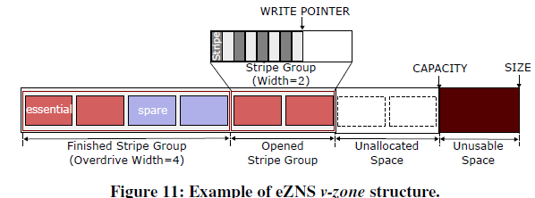

与静态逻辑zone类似，v-zone包含固定数量的物理zone。但与静态逻辑分区不同，它将物理区域划分为一个或多个条带组。当第一次打开v-zone或到达上一个条带组的终点时，它会分配一个新的条带组。当写指针到达前一个分条组的末端时，前一个分条组中的所有物理分区都必须完成。（以stripe group为管理单元）

条带组中物理分区的个数在分配时根据“local overdrive“机制确定，实现分区的灵活分条。
***
**v-zone：**
1. 在其他命名空间处于低活动资源使用状态时，通过从其他命名空间租用备用空间来扩展其条带宽度;
2. 当它完成I/O、通过写到分条组末尾或显式终止时，回收它们

**初始化：**

具体地，所有可用物理空间被划分为两类：基本分区（$N_{essential}$）、备用分区（$N_{spare}$）。基本分区包含能最大化写入带宽的激活物理分区。

均匀分配：例如，假设ZNS SSD现有$N$个namespace，那它只能独占并激活$N_{essential}/（N*MAR）$个物理区。
***
**Local Overdrive**：

eZNS 使用“Local Overdrive”操作通过从其命名空间的备用组重新分配备用磁盘空间来增强其写入 I/O 能力。 

该机制估算命名空间内的资源使用情况，检查剩余的备用磁盘，并根据写入活动和打开的 v-zone 数量调整分配给每个 v-zone 的备用磁盘数量。

**Global Overdrive**：

它是根据整个SSD的写入强度触发的。根据非活动命名空间的分配历史进行识别，让备用空间在活动命名空间之间分配。

当备用空间要被原namespace使用时，有一个回召机制。

总之, 通过仲裁器和Overdrive操作提高了驱动器的整体性能和效率。
***
#### 4.5 I/O调度

**Goal：** 旨在在 v -zone 之间提供平等的读/写带宽份额，最大限度地提高设备利用率并缓解队头阻塞。

写：采用基于延迟测量的拥塞控制机制：ezNS 中具有缓存感知能力的写入准入控制，监控写入延迟来调整拥塞窗口大小（1-4 stripe width）

读：并使用基于令牌的准入控制方案来调节写入。它定期生成令牌并允许分批写入 I/O 

-  eZNS 中的读取调度器和写入准入控制几乎不需要协调，并且使用延迟作为信号来推断带宽容量。
-  当在物理芯片上混合读写I/O时，总带宽可能会因NAND干扰而下降，但eZNS可以在没有显著读写协调的情况下就处理了这个问题。(?) 
-  用户 I/O 中同一物理区域的条带会合并并作为一个写入 I/O 批量提交，因此较小的条带大小不会降低写入带宽。

### 测试评估
**Default v-zone Configuration**
4 Namespaces (Each namespace has 64 Active zones)
Each Namespace
-Essential resources :32 (128 / 4) 
-Spare resources :32 (64 - 32)
-Maximum active v-zones :16
-Minimum stripe width : 2 with 32KB stripe size (32 / 16)
-Physical Zones in Logical Zone :16

结合之前的实际硬件参数：

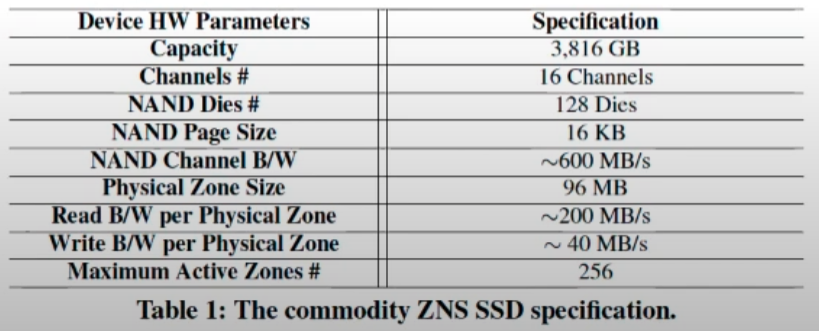

***

**证明 Local Overdrive是有效的:**

<!-- 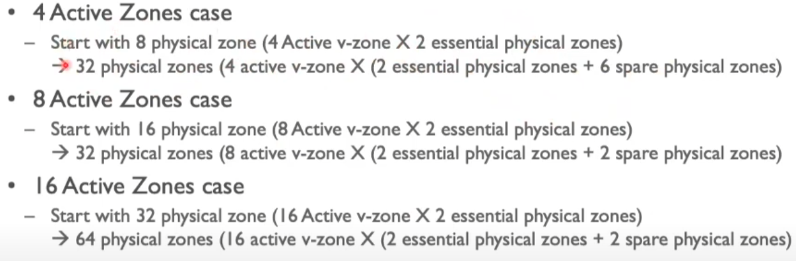 -->

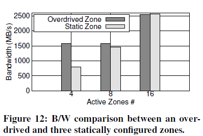
(可是到这zone=16都快没差距了?)
***

**Global Overdrive**
NS1 NS2 NS3两写入任务,NS4八写入任务。NS1、NS2 和 NS3 在 t=30 秒时停止写入，并在 t=80 秒时恢复写入活动。

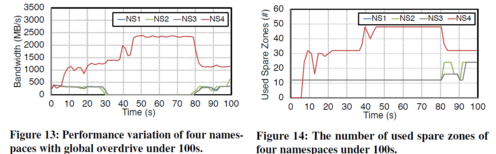

当其他三个区域闲置时，来自 NS4 的 v 区域使用全局超速原语从其他命名空间获取多达 3 倍的备用区域，并最大限度地利用其写入带宽（2.3GB/s）。然后，当其他区域再次开始发出写入指令时，它可以迅速释放区域。

***
**(真实场景)RocksDB测试:**
A B都是覆写, CD同时执行随机读。

在RocksDB上，eZNS 相较于 static zoned interface 提升了 17.7% 的吞吐量和 80.3% 的尾时延。

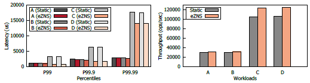

## 总结

ZNS SSD接口的**静态**和**不灵活**体现在三个方面：
**1. Zone Striping** ：不同workloads在不同的stripe size和stripe width设置下表现不同
**2. Zone Allocation** ：一个logical zone中physical zones越多，单个zone性能越好；但zone放置时的channel overlap和die overlap都会影响并行度。现有zone放置机制没有考虑这些特性。
**3. Zone Interference**：ZNS内部执行I/O请求、其他用户执行的I/O请求都会互相影响。现有机制任务间隔离性差。
两个组件：
- **Zone 仲裁者（Arbiter）**：维护 device shadow view，执行 zone 分配以避免 overlap （解决问题2），通过 zone ballooning 执行动态资源分配 （解决问题1）
- **Zone I/O调度器**：使用**局部拥塞控制机制 (congestion control)** 来调度读请求；使用**全局权限控制机制 (admission control)** 来调度写请求（解决问题3）
***
> ZenFS——RocksDB on ZNS device
>
> https://zhuanlan.zhihu.com/p/555476626

一个韩国人讲eZNS

https://www.youtube.com/watch?v=q10_ExFD8RA

