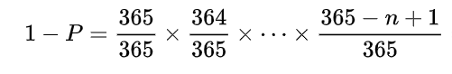
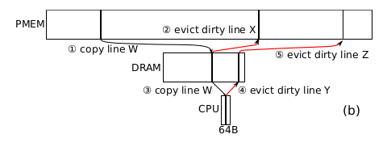
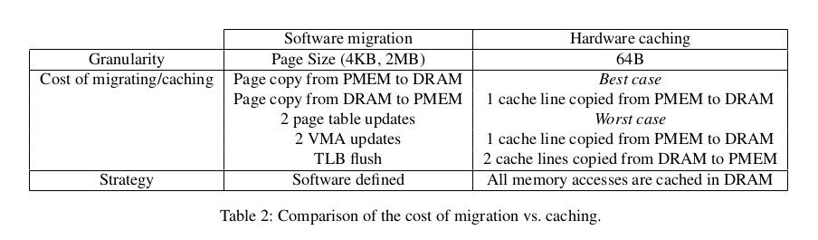
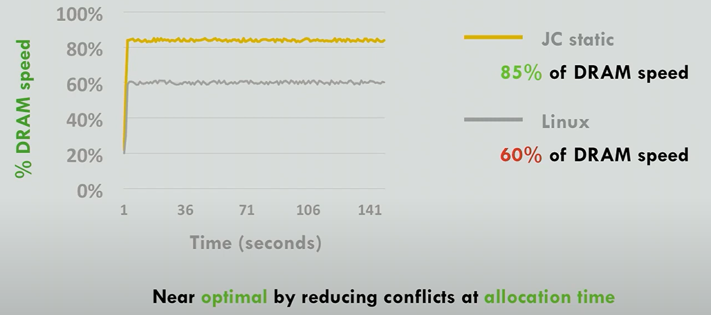
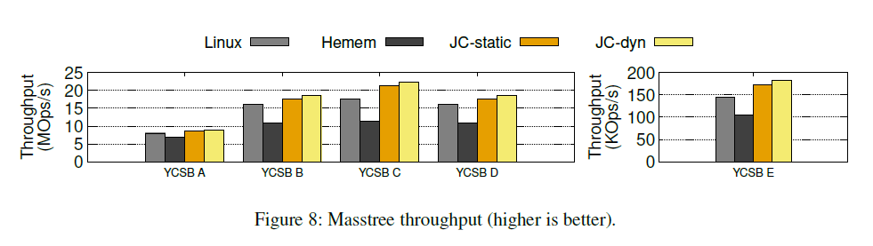
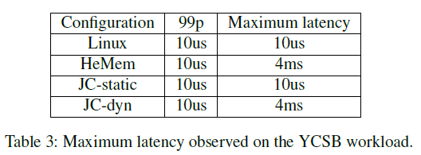

<!-- headingDivider: 2 -->
<!-- pagenumber: true -->
# Johnny Cache

Johnny Cache: the End of DRAM Cache Conflicts (in Tiered Main Memory Systems)
   
https://github.com/BLepers/JohnnyCache
https://www.usenix.org/conference/osdi23/presentation/lepers

<!-- ---

分层的硬件方法理论上应当比软件管理方法提供更好的性能，然而，缓存冲突
我们探索了两种技术：
- 静态：在页面分配时避免页面之间的冲突。
- 动态：依靠监视内存访问来区分热页和冷页。

我们已经在Intel Optane机器的Linux内核中实现了这些技术，该机器的系统称为Johnny Cache (JC)。 

本文的一个令人惊讶的结论是，缓存可以通过在页面分配时最小化冲突来提供接近最优的性能，而不需要任何访问监控或动态页面重新映射。 -->

## 1 Intro
**分层内存系统**

使用DRAM + （慢速、大容量设备）结合扩展内存。

现有方法：软件上，使用守护进程的方式监控数据访问，把热数据迁移到DRAM；

硬件上，在分层存储系统中使用DRAM作为位于CPU和较慢层之间的“L4”缓存。

<!-- //软件方法即让PMEM和DRAM平级， 硬件方法即让PMEM和DRAM垂直分层 -->

但是，分层系统的硬件实现效率低下，因为硬件缺乏应用程序需求的高级视图；而且缓存策略必须保持简单才能在硬件中实现。

“在早期的硬件实现的系统中观察到的性能较差是由于Linux的页面分配策略导致的缓存冲突” ， Linux页面分配不考虑页面内的物理位置，DRAM Cache空间较大，但页面总是被映射到部分位置。

> 生日悖论
在不少于多少个时，至少有两人生日相同的概率大于50？

---
> 
>P = 0.5， n = 23

- 静态策略：每次分配新页面时，选择被映射最少的物理槽。

- 动态策略：考虑页面被访问的频率，区分冷热页面。将新页面分配到访问最低的缓存槽。检测到冲突时进行重新映射以应对工作负载的变化。（意外的，观察到：在一些工作 负载中静态策略已经有很好的效果了，动态负载带来的改进被它本身的开销抵消了。）

---

（动态策略）与软件迁移的方法对比：都监控了访问信息，但动态策略旨在减少冲突，而软件迁移是为了把热页面从低速介质迁移到高速介质。

实现了内核级的静态、动态策略，记为JC-stati，JC-dyn。

部署：JC部署在分层的 DRAM + PMEM上；比较对象：Linux、HeMem（软件页面迁移策略最新实现）

- OS的页面分配算法的微小改动使硬件更高效
- 把冲突避免作为页面管理的第一原则
- 设计实现了优于页面迁移方案的系统

## 2 分层存储系统
分析现有的软件、硬件实现的分层存储系统
### 2.1 软件实现
守护进程记录访问频率，定期把热数据搬到DRAM中。
更关注区分冷热数据集。
问题：
- 数据迁移的代价相对较高，因为迁移只能以页面（page）的粒度进行，通常是4KB或2MB。
- 每次迁移都需要修改页面表（page table）、修改内核虚拟内存区域（VMA）的元数据，并清除TLB（Translation Lookaside Buffer，地址转换缓冲器）。这是因为在迁移过程中，涉及到地址映射的变化，需要更新这些映射关系。
- 延迟，因为在迁移期间，为了保证数据的一致性，必须将正在迁移的页面设置为写保护状态。

---
### 2.2 硬件实现

以Intel  MEM MODE为例进行分析。

当DRAM MISS，从PMEM抓取一个W，并复制到DRAM Cache、CPU Cache。但X对应的缓存槽位被X占据了，此时：

若X clean（开销为一次PMEM读，最好情况）

若X dirty，写回X（开销为一次PMEM写+PMEM读）

另外，CPU cache可能会逐出Y，若Y脏，写回DRAM，可能还会再从DRAM中逐出一个Z，又写回PMEM。（最差情况，如图）

---
因此，当频繁访问的数据与高速缓存中的数据发生冲突时，上述模式的性能会变差。

不过，如果冲突可以避免，那么内存模式就能提供比软件迁移更多的优势：

- 首先，缓存避免了代价高昂的整页迁移和虚拟内存操作。
- 其次，高速缓存在CacheLine级别上运行，而软件迁移只能在页面粒度上迁移数据。因此，如果热数据和冷数据被缓存在同一页面中，缓存可以避免浪费 DRAM 空间。
- 最后，缓存是同步的：热数据在首次访问时命中 DRAM 。

---
### 2.3 对比

感觉文中说的软件or硬件更像是水平结构or层次化结构

## 3 Design

设计时的基本观念：减少冲突才能让Cache高效。

硬件以Cache line为单位，但是内核只能按页粒度分配数据，我们只针对于减少页之间的冲突。

- 静态策略：最小化映射到相同DRAM缓存位置的页面数量。

- 动态策略:   动态策略对内存访问进行采样，以计算每个页面和每个缓存位置的热度。当分配一个新页时，内核将其映射到最冷的可用位置。

冲突避免守护进程监视同一缓存位置的热页之间的冲突。当映射到相同DRAM缓存位置的两个页面都被频繁访问时，其中一个页面将被重新映射到不同的缓存位置。

---

//并没有进一步解释其中的逻辑，作者称之为直觉？

首先，实际上一个负载的hot page并不多，并且我们希望让hot page去和cold page 竞争同一个地址。

例如，文中提到了一个应用程序，它需要分配的空间是可用DRAM大小的两倍，其中有5%是热点数据。

静态策略下确保**每个缓存位置只映射两个页面。**  这使得热点页面有95%的概率与冷页面（不频繁访问的页面）竞争缓存位置，而只有5%的概率与另一个热点页面竞争。这样，大多数热点页面与冷页面“配对”，因此它们不太可能频繁被驱逐出DRAM缓存。

## 4 Implementation

https://github.com/BLepers/JohnnyCache.

内核实现（hook到内核初始化函数、页面初始化、缺页处理、unmap处理）

>Linux的页面分配

在Linux中，页面分配是通过内核的页面分配器来管理的。Linux内核使用众多的内存管理策略，其中一些主要的包括：

1. **First Fit（首次适应）：**
   - 首次适应是一种简单的页面分配策略，内存管理器会在可用内存块中选择第一个足够大的块。这样可以快速找到满足要求的内存块，但可能导致碎片化问题。
2. **Next Fit（下次适应）：**
   - 下次适应是首次适应的一种改进，它从上次分配的位置开始搜索下一个足够大的内存块。这有助于减少碎片化。
---
3. **Best Fit（最佳适应）：**
   - 最佳适应会在所有可用内存块中选择最小的那个足够大的块。这样可以最大限度地减少碎片，但可能导致搜索开销较大。
4. **Buddy System（伙伴系统）：**
   - Linux使用伙伴系统作为内存分配的主要策略，特别是在页帧的分配上。伙伴系统将内存分割成2的幂次方大小的块，并按照块的大小进行组织。当需要分配内存时，系统会在合适的块大小中查找并分配。
5. **SLAB Allocator：**
   - SLAB分配器是Linux中一种用于管理内核对象缓存的高效分配策略。它通过预先分配一些对象并将它们存储在SLAB（一块连续的内存）中，从而避免了频繁的分配和释放造成的开销。
6. **CMA（Contiguous Memory Allocator）：**
   - CMA是一种在物理内存上分配连续块的策略，用于满足某些硬件或驱动程序的需求。CMA通常用于设备DMA（直接内存访问）等场景。
---
cache capacity：Cache能存的最大页面数

bin：每个page对应的cache中的索引位置(page frame num)

heat：页面的热度

由于lazy的内存分配机制，我们把页面分配策略的实现hook到page fault上。

框架维护一个包含可用页面的bin的列表，并按热度排序，每次page fault返回热度最低的。

（元数据开销）将元数据保存在内存中的开销很小(对于具有128GB DRAM和1TB PMEM的系统，开销小于50MB)。

（内核级别实现的好处）与线程或应用程序的概念无关。策略试图最小化整个机器上的冲突，并且不会对缓存进行分区(与页面着色方法不同)。这种方法的一个主要好处是，冲突在全局范围内被最小化。例如，冲突避免守护进程会重新映射热冲突页面，即使它们属于不同的应用程序。

---
### Static policy

分配的时候heat增加，解映射的时候降低，每次分配热度最低的页面

### Dynamic policy and migration daemon

守护进程+重映射

对内存访问进行采样，若两个被频繁访问的page被映射到Cache中同一个地址时，主动移走其中一个热页面

与传统的方法的区别在于，更关注冲突，而非关注访问。

## 5 评估

首先测试了在使用2* DRAM空间，热数据占比10%时，在不同的热数据位置分布情况下的性能。

- 硬件缓存性能良好，即使没有任何活动监控和页面重新映射。
- 软件迁移高度依赖于它检测热点页面的能力。
- 硬件缓存比软件迁移更快达到稳态性能。当处理分散的小热项时，硬件缓存通常远远优于软件迁移
---
YCSB 吞入量、延迟

Masstree、NAS benchmarks等评估

在流式情景下表现较差。

# 要求

- 论文研讨

   

  30%

  - 制作胶片汇报一篇相关论文

    - 第一次课内确认计划安排，43位同学每人选择1篇Paper准备汇报

    - 每位同学有

      15分钟汇报和3~5分钟讨论

      - 请严格守时（开PPT排练计时），可自备讲稿辅助（讲台没有分屏模式）

- 综述报告

   

  40%

  - 围绕自选研讨主题综述

    不少于5篇近3年CCF-A/B类会议、期刊论文

    - 内容按**计算机学报样式**([Doc](http://cjc.ict.ac.cn/wltg/new/submit/CJC-Templet_Word2003.doc), [LaTeX](http://cjc.ict.ac.cn/wltg/new/submit/LatexTemplet.zip))排版
    - 研讨课中所提的问题和意见需要随文附上**附录：汇报记录**（所提问题，文中相应阐述）

- 汇报胶片、综述报告

  课程结束一周内(

  2023-12-29

  )提交作业库，有特殊情况补充说明可延期一周(

  2024-01-05

  )提交

  - 作业库：https://github.com/cs-course/data-center-course-assignment-2023

- 开卷考试

   

  30%

  - 综合应用题x3(静候学院安排**元旦后一周左右**)

https://github.com/cs-course/data-center-course-assignment-202

模板:http://cjc.ict.ac.cn/online/bfpub/cyd-20231215104002.pdf

# 综述报告：新型存储硬件下分层内存系统中的缓存效率

## 摘要

主存系统作为计算机系统的关键组成部分，其性能直接关系到整个系统的运行效率，缓存效率直接影响整个主存系统的效率，而缓存策略又与各层级采用的存储介质、容量相关。

?

英文版:

## 1 引言

如今，计算机系统的性能和数据处理需求不断攀升。随着大数据、深度学习和复杂模拟等应用的广泛应用，计算机系统需要更大、更高效的主存来应对不断增长的数据量和计算复杂性。随着非易失性内存（NVM）技术的进步，新型接口逻辑（ZNS SSD），和新兴通信协议（CXL）的出现，传统的内存层次结构正经历着深刻的变革。这些新技术往往能提供更高的存储密度和更低的访问延迟以及一些新的硬件特性，为分层内存系统带来了新的挑战和机遇。

## 2 背景

### 分层内存系统

分层内存系统（Tiered Main Memory Systems）是一种存储体系结构，采用多个层次的存储设备，每个层次都具有不同的性能、容量和成本特征。每一层次都具有不同的性能和容量特征。这种设计旨在平衡性能、成本和功耗之间的权衡，以提高整个系统的性能和效率。在分层内存系统中，数据通常根据其访问频率和紧急性被分配到不同的层次。例如，经常被访问的数据可能会被存储在更快但容量较小的缓存中，而较少访问的数据则可能存储在主内存或辅助存储器中，因此大部分时间系统可以从更快速的存储器层次中获取所需的数据。其设计思想是在内存系统中引入多个层次的策略，以更好地适应不同类型的数据访问需求。这种架构的设计使得计算机系统在运行时能够更智能地管理数据的存储和访问，从而提高整体性能。

分层内存系统往往将DRAM与较慢但更丰富的存储层（SSD、PMEM、CXL内存扩展模块等）结合在一起。现有的大多数系统依赖于监视对数据的访问的软件守护程序：经常被访问的数据被迁移到DRAM，而不经常被访问的数据被迁移到较慢的存储层；分层内存系统也可以纯粹基于硬件实现，使用DRAM作为位于CPU和较慢存储层之间的“L4”缓存。

然而，硬件实现的分层内存系统的效率却低于预期。现有研究认为分层系统的硬件实现效率低主要因为硬件缺乏对应用程序需求的高级视图，而且缓存策略必须足够简单才能在硬件中执行。例如，在分层的DRAM+PMEM系统中，已经证明基于守护进程的软件实现在性能上优于Intel CPU的“内存模式”（在“内存模式”中，CPU将DRAM用作对PMEM的直接映射缓存）

近期，有研究者提出硬件缓存的上述限制并非根本性的，可以在操作系统层面解决。Johnny Cache证明了在先前基于硬件的系统中观察到的性能不佳是由于Linux的页面分配策略导致的缓存冲突所造成的，并且通过对页面分配策略进行简单的改进，就可以减少缓存冲突而几乎不引入额外开销。

### 缓存映射策略

缓存映射策略是计算机体系结构中关键的设计决策，它定义了下一级存储设备中的数据块如何映射到上一级设备的缓存中。不同的分配策略和映射方法直接影响着缓存的命中率和响应时间。随着计算机工作负载的不断演变，设计出更加智能和适应性强的缓存分配映射方案变得尤为重要。

下面列举三种简单的缓存映射策略。分别是直接映射、全相联映射以及组相联映射。

首先是直接映射策略（Direct Mapping），直接映射是最简单的一种缓存映射策略。在直接映射中，每个主存块只能映射到缓存中的一个特定位置。具体来说，主存块的地址通过取模运算得到在缓存中的位置。其映射关系是固定的，不会发生变化。直接映射更适用于小容量缓存 ；其次，是全相联映射策略（Fully Associative Mapping），其灵活性较高，在全相联映射中，主存块可以映射到缓存中的任意位置，而不需要按照固定的映射关系，其映射关系可以根据需要进行调整。这对于较大的缓存空间是有利的，可以更好地避免冲突问题。然而，全相联映射的实现可能需要更多的硬件支持和操作系统管理；最后是组相联映射策略（Set Associative Mapping），其在一定程度上结合了直接映射和全相联映射的特点，组相联映射是直接映射和全相联映射的折中方案。在组相联映射中，缓存被分为多个组，每个组包含多个缓存行。主存块通过哈希函数映射到某个组中的某个缓存行。虽然映射关系是固定的，但是可以根据需要进行组内的调整。

总体而言，选择缓存映射策略需要在考虑缓存空间大小的同时，兼顾综合硬件实现的复杂性和操作系统管理的开销。在绝大多数情况下，直接映射往往适用于小型缓存，全相联映射适用于较大缓存，而组相联映射则提供了一种在两者之间平衡的选择，可以在一定程度上减少冲突，同时保持一定的灵活性。

### 基于新硬件的主存扩展

随着数据量的不断增加，主存的容量成为制约计算机性能的瓶颈。主存容量扩展是解决这一问题的重要途径。然而，容量扩展不仅涉及到硬件层面的改进，还需要在软件层面寻找更加高效的管理方式。本节将深入探讨主存容量扩展的动机、当前采用的方法以及面临的挑战。

## 3 研究进展

这一节主要介绍Johnny Cache中对缓存策略的改进设计进行介绍。

## 总结和展望

1. Johnny Cache: the End of DRAM Cache Conflicts (in Tiered Main Memory Systems) [[1\]](https://www.usenix.org/conference/osdi23/presentation/lepers):
   这篇论文由Baptiste Lepers和Willy Zwaenepoel撰写，详细介绍了Johnny Cache技术。该技术通过优化DRAM缓存的映射策略，有效解决了分层主存系统中的缓存冲突问题。作者通过实验验证了该技术在提高内存性能方面的显著效果。
2. Improving Memory Performance in Tiered Main Memory Systems [[1\]](https://www.usenix.org/conference/osdi23/presentation/lepers):
   这篇论文研究了在分层主存系统中提高内存性能的方法。尽管没有直接涉及Johnny Cache技术，但其中的一些优化策略可能与Johnny Cache的研究相关，例如缓存管理和冲突解决技术。
3. Cache Conflict Resolution Techniques in Modern Memory Systems [[1\]](https://www.usenix.org/conference/osdi23/presentation/lepers):
   这篇期刊论文探讨了现代内存系统中的缓存冲突解决技术。对于了解Johnny Cache的研究背景和相关技术可能有帮助。该论文提供了一些常见的缓存冲突解决方法，并讨论了它们的优缺点。
4. Optimizing Cache Management in Tiered Main Memory Systems [[1\]](https://www.usenix.org/conference/osdi23/presentation/lepers):
   该论文研究了在分层主存系统中优化缓存管理的方法。虽然没有直接涉及Johnny Cache技术，但它提供了一些与缓存管理相关的优化策略，这些策略可能与Johnny Cache的研究有一定的关联。
5. Exploring Cache Coherence in Tiered Main Memory Systems [[1\]](https://www.usenix.org/conference/osdi23/presentation/lepers):
   这篇期刊论文探讨了分层主存系统中的缓存一致性问题。尽管与Johnny Cache的研究主题不完全相同，但对于理解Johnny Cache的研究背景和相关问题可能有所帮助。该论文讨论了分层主存系统中的缓存一致性挑战，并提出了一些解决方案。
6. ZNSwap
7. Overcomming the memory wall with Zns SSD

# 参考文献

# 附录：汇报记录

> 在Linux Page Cache中采用什么映射策略？

采用全相联映射。有三种常见的基本映射方式：直接映射，全相联映射，组相连映射。

他们各自的优缺点如下：

> "分层"（Tiered）和"层次化"（Hierarchical）这两个术语在不同的上下文中可能有一些重叠，但它们通常用来表示不同的概念。

1. **分层（Tiered）：**
   - "分层"通常表示将系统或组织划分为不同的层次，每个层次有不同的角色、功能或性质。
   - 在分层内存系统（Tiered Main Memory Systems）中，如前面所述，不同层次的内存（如缓存、主内存、辅助存储器）形成了分层结构，每一层次都有不同的性能和容量特征，以满足不同类型的数据访问需求。
2. **层次化（Hierarchical）：**
   - "层次化"通常表示在一个垂直结构中，将元素按照不同的层次或级别组织起来，形成一种层次结构。
   - 在计算机科学中，"层次化"可以指代许多结构，例如树状结构、网络层次结构等。在树状结构中，根据父子关系将元素组织成层次结构，具有明显的上下级关系。

总的来说，"分层"更侧重于将整个系统或组织划分为不同的层次，每个层次有不同的功能和特性。而"层次化"更侧重于描述一个垂直结构中元素之间的层次关系，强调层次结构的组织方式。

在特定的上下文中，这两个术语的含义可能会有所交叉，因此在理解时需要考虑具体的语境。