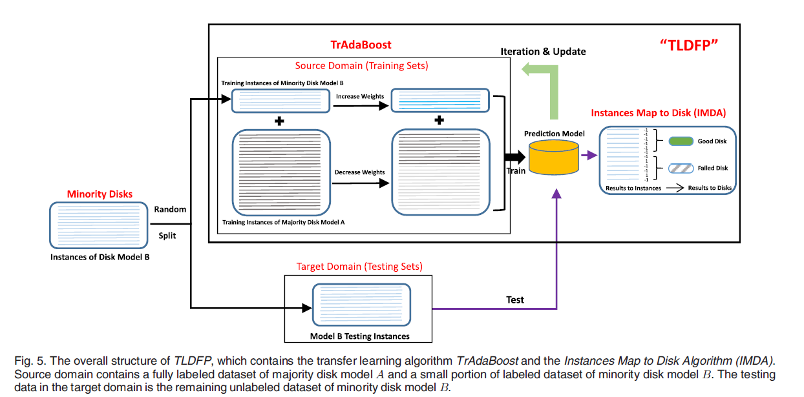
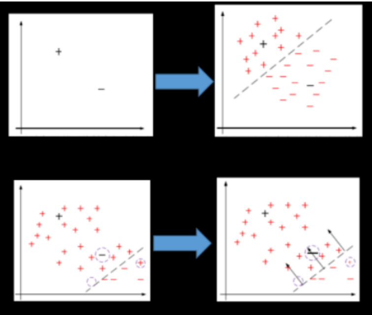

# **TLDFP**

Minority Disk Failure Prediction Based on Transfer Learning in Large Data Centers of
Heterogeneous Disk Systems

---

## 背景 

大型数据中心的存储系统通常建立在数量庞大的磁盘上，磁盘故障时有发生。磁盘故障可能导致严重的数据丢失，从而导致系统不可用甚至灾难性后果。

#### **少数磁盘**

在大规模的存储系统场景中，随着时间的推移，大量的新磁盘逐渐进入存储系统，替换出故障磁盘，导致存储系统由来自不同供应商的异构磁盘和来自同一供应商的不同型号的磁盘组成。

称这些相对较少量的磁盘为少数磁盘。

传统机器学习方法需要大量的训练数据以达到良好预测性能，不适用于含有上述异构少数磁盘的存储系统。

---

#### **效益**

相比于被动的容错机制，主动预测磁盘故障也可以保证可靠性和可用性。		

成功的预测可以降低丢失数据的风险，降低数据恢复成本。

目标：通过迁移学习，从可用的多数磁盘数据集，预测少数磁盘故障。

**文章回答四个问题：**

- 什么是少数磁盘 
- 为什么用迁移学习
- 如何预测
- 什么情况可以预测
---

## SMART 数据集的收集

#### SMART

硬盘厂商固件内的信息。

硬件自己有一个阈值检测。

failure detection rate (FDR)： 3-10% 

false alarm rate (FAR)：0.1%

500万个硬盘，以一小时为时间间隔，一天有200G，假设寿命为5年，共350T。而且每个小时都要汇集每台服务器的smart信息到一起。

实现了一个数据收集框架：

---
## 预试验

#### 3.1  Minority Disk Datasets

根据初步试验(观察损失值随磁盘数目的变化情况)，当某种型号磁盘的数量少于1500个时，传统的ML算法无法提供令人满意的性能，因此将其定义为**少数磁盘**。

按照这个定义，对数据进行分类。

##### 3.2 只用少数磁盘数据集进行训练

效果很差：因为数据集过小，过于同质化，导致过拟合，所以效果差。

---
##### 3.3 SMART数据分布

不同型号，属性值的分布不同。但是他们的分布模式具有相似性，如图	

四个厂商不同型的号硬盘某SMART属性值的分布具有相似性，称之为协变量偏移。（covariate shift）

考虑上述规律，我们可以用数量充足的某些型号硬盘数据，建立一个预测模型来预测数据不充足的其它型号的硬盘。

---
## 4 TLDFP

其中源域包含完全标记的多数盘数据集，和少部分少数盘标记数据集；目标域是少数盘剩余的未标记的数据。

---
### TrAdaBoost

AdaBoost：训练几个不同的弱分类器再合并为强分类器。每次迭代，增加源域中被误分类的情况的权重

TrAdaBoost算法的核心是源域中被错误分类的多数磁盘A将获得更小的权重，而被错误分类的少数磁盘B将获得更大的权重。

---

## 何时能使用TLDFP？

##### 基于KLD的源域选择

选择源域需要比对两个随机变量分布之间的差异。两个分布之间的差异越大。两个分布之间的知识转移就越困难。

对比了几个可选的指标，基于KLD选的源域效果最好。

---
## 实验 

来自数据中心的真实数据集。训练集中Good ： Failed = 3:1，取故障前连续 14天的采样。

与4种传统ML算法相比，使用基于TLDFP的4种模型对FDR、FAR、F-Score和AUC-ROC的结果进行了比较如下，基于TLDFP的模型效果有显著提升。

## CONCLUSION

- 提出少数盘的概念，进行定量评估
- 提出了基于KLD选择多数盘的方法
- 提出了跨盘模型的故障预测方法。在真实数据集上效果优异，平均FDR=96%，FAR=0.5%

