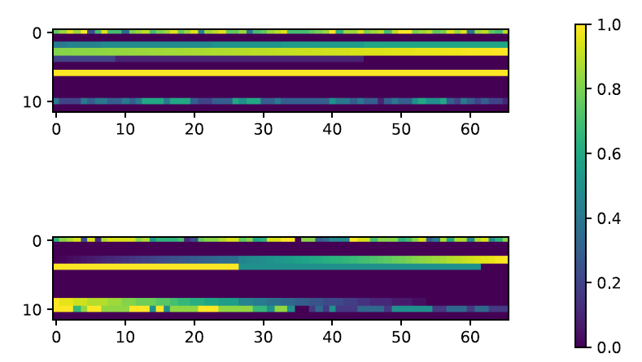
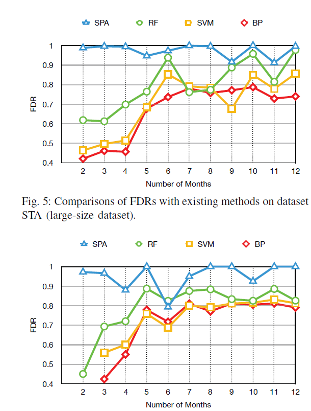
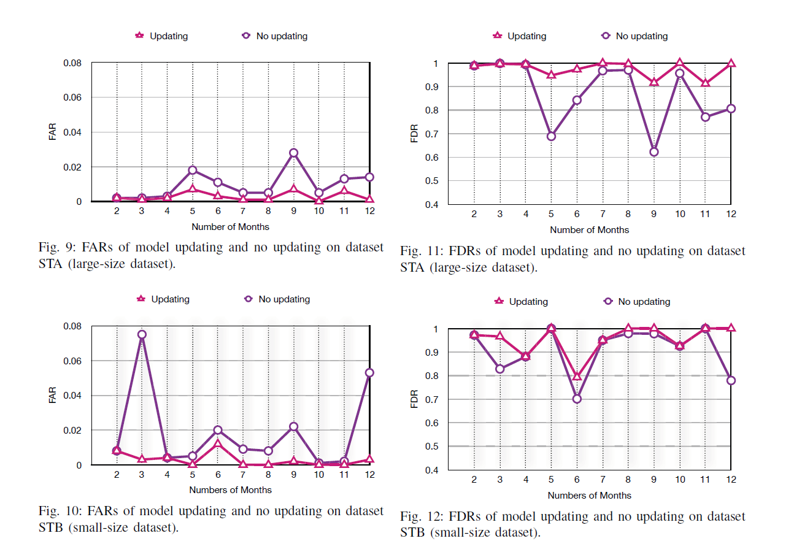

# ****

Lifelong Disk Failure Prediction via GAN-based
Anomaly Detection

---

## 背景 
数据中心硬件更换的78%是因为硬盘故障。随数据量爆炸增长，磁盘故障是一种常态。
  
相比于被动的容错机制，主动预测磁盘故障也可以保证可靠性和可用性。		

成功的预测可以降低丢失数据的风险，降低数据恢复成本。
  

---
a Semi-supervised method for lifelong
disk failure Prediction via Adversarial training, SPA

解决问题:

- gan-based的异常检测来处理数据不平衡问题，冷启动问题
- SMART -> 2D img
- 通过微调处理模型老化

---
### SMART->2D IMG
增加一个维度——时间
一个例子：上方故障盘，下方是正常盘，颜色深浅代表[0,1];
可以观察到故障盘属性值随时间的变化。但健康盘保持稳定。（部分属性？）

反应了时序特征的的重要性。

---
### 数据处理

- 选取12个SMART属性(RF)
- SMART -> 2D img
- 归一化
<!--
Diff 两时间点属性差
Sigema 时间段内的方差
Bin 时间段内的和
-->
---

### 基于gan的磁盘故障训练预测过程
**encoder-decoder-encoder**结构的G-Net

同时学习“原图->重建图”和“原图的编码->重建图的编码”两个映射关系。
用于推断的不是原图和重建图的差距，而是计算z'和z的差异。（使用编码损失进行推断：

---

### 推理阶段
 
网络收敛以后，计算所有健康样本的编码损失，取最大值作为判别阈值。推断时，给定一张图片，计算损失值，若小于这个阈值即为健康样本；反之则为异常样本。
  

这种方法使得模型对图片中的微小变化不敏感，减少了噪声的影响

---
- 模型老化问题——fine-tuning，同时利用老数据和新数据。（批样本更新）
- 样本标记：自动在线标记
---

### ALGO

- 如果磁盘异常：删除

- 否则

  - 若队列已满，将老样本出列存入集合S

  - 未满，样本依次入列

  - 当S满时，将其转化为2D图像特征S’中

    并用S‘微调旧模型，S置空

  预测时，将X输入模型得到预测结果——状态y’，若为1，触发警告

---
## 实验 
 
真实数据集，Backblaze

从中选出了两个型号(构成一多一少两个数据集分别测试)
  
指标：FDR（真阳/阳性），FAR（假阳/阴性）

---
相较于三种监督学习方法的优势：

---
验证模型更新的有效性：

