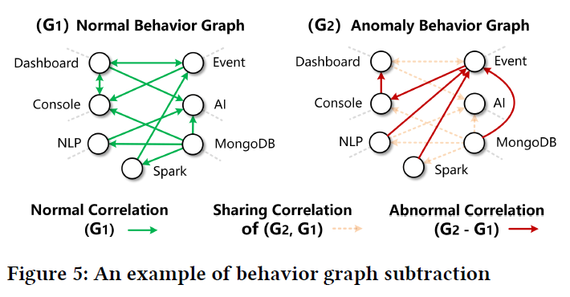

# AutoMAP

AutoMAP: Diagnose Your Microservice-based Web Applications
Automatically

WWW 2020

异常检测，在微服务系统中定位故障

## Abstract

复杂和动态的微服务结构让应用诊断极其困难。

提出异常行为图（anomaly behavior graph）的概念；定义了两个运算，一个近似函数。

设计了一个启发式调查算法，用前向，自我，后向随机游走，来确定产生错误的根服务。

效果良好。

简单部署在任意微服务架构的系统中，无需系统知识。

支持引入各种专家知识（新的参数？）来提高精度。

## Introduction

微服务架构促进了抽象和模块化，但是，随着服务及其依赖的拓展和重构，定位源异常更加困难，挑战主要来自以下三个方面：

**Dynamic application structure**

原有的静态方案排障方法，如thresholding schemes（阈值化方案）可能无法获得可靠的模型（在这种频繁变化的情况下）。所以，最近的研究大多从系统结构出发，再诊断异常。

但是，这里的结构（例如网络拓扑或服务调用依赖关系）通常要通过监视各个组件得到历史数据，再提取出结构（例如日志文件，审核事件，网络数据包）；这样做费时费力，而且对于某些老旧系统，开发一个中央组件来收集数据和生成结构，甚至是不现实的。

**Indirect anomaly propagation**间接异常传播

随着微服务架构中组件粒度变小，服务可能驻留在不同的主机或容器中。它们的调用过程可能是直接调用的同步过程，也可以是通过消息代理或发布/订阅组件的异步过程。因此异常传播不再受调用限制。

解释：图中红色是异常的源服务，它影响到了同一主机下的服务（黄色），从而影响了Web应用。但其实这个红色服务根本没被调用。

因此即使知道了服务的调用依赖也不够用，仍需要一个更加动态全面的诊断机制。

**Multiple types of metric.**

基于单一指标的算法可能不足以描述不同服务中出现的异常；异步调用过程使得单一度量不能直接反应传播依赖性；缺乏一个自动化机制根据服务的特点选择适当的度量。

 目标是：开发一个自动化诊断工具，包含以下能力：

- 自动生成异常拓扑，（不需要任何先验知识）
- 基于多种度量描述服务异常
- 选择适当的度量推断根本原因

## Problem Statement

把微服务WEB应用看作黑箱，只知道各种类型的监控指标，不清楚各服务功能和调用拓扑结构

### 3.2AutoMap

- 选择采样间隔参数在原始度量上（raw metrics）
- 构建异常行为图
- 作"+""-"运算 ，生成profile 
- 在图上执行启发式根因检测算法
- 验证结果，计算准确度
- 更新权重矩阵（metric-weight matrix），重复上述步骤

## 4 Metrics

共考虑7种指标

时间间隔的选取：（按照调用次数加权平均）

## 5 行为图

SRE（站点可靠性工程师）往往不会分析整个WEB应用的拓扑结构，首先是根据异常类型，靠经验排障。他们观察性能指标，选择最可疑的服务。工程师直觉，经验包含两方面：历史诊断经验和各个服务的特点。

#### 5.1行为图构建 

- 全连接图，边的权重全为1
- 对于每一个指标 $M_k$ ，检查两点 $(i,j)$ 间的条件独立性，若独立，$W_{i,j,k}=0$
- 检查每个边，若任意指标k的对应的W均为0，移除边
- 把无向图定向为行为图

𝑆(𝑣𝑖, 𝑣𝑗, 𝑘)表示条件集

第四步：V型结构定向 i j l

根据三个rule对应处理不同的情况，对边进行定向 。

对于每个指标分别计算，得到权重矩阵

#### 5.2加运算和服务归档

使用行为图分析服务类型：但云平台提供的服务太多，根据他们的特点分类是一个很有挑战性的工作。

一个比较直接的办法：使用历史观测数据。生成多个行为图，再合并。

对不同的行为图进行加运算（+）

**service profile的生成**

把服务分为五类：Representational,Computing, Networking, Storage, Environmental

对于每一类，有一个主要指标。比如说对于表征性的服务（界面），我们更在意它的延迟。

#### 5.3减运算和异常归档

真实情况下，只有少数的服务涉及异常传播。原始构造的行为图可能包含冗余服务，要移除这些冗余关系。使行为图更接近对于异常的描述。

**减法运算**

**anomaly profile**

## 6自动根因检测

### 6.1参数权重学习

**Service Correlation**

计算服务之间的相关性：

**Result Precision**

 给定异常行为图$G_A$

AutoMap在历史记录中搜索与$G_A$相似的top-k个候选图，对每个指标分别计算相关系数

profile similarity:

在选相似的行为图的时候，定义了一个相似函数计算分数

// 其中一步：根据其主导指标（max）进行归类（RCNSE）涉及点相似的计算。

### 6.3一个根因检测的例子 

### 6.4  随机游走根因检测算法

- **正向转移（Forward Transition）**
  一般情况，对于异常行为图的一个访问按照概率$p_{i,j}$进行。
- **自向转移（Self Transition）**
  自身转移会鼓励访问者在其当前访问的服务上停留更长的时间，以防止访问者中没有一个与邻居的相关性很高。
- **反向转移（Backward Transition）**
  另一种情况，当访问者正在访问相关分数较低的特定服务时，如果其所有邻近服务与给定异常的相关性都较低，则可能找不到任何离开的途径。因此使用反向转移跳出。

给定一个异常行为图，根因的探寻通过随机游走算法，从前端应用节点$V_{fe}$开始，计算正向,反向,自身的转移概率，并随机选择其中之一。   AutoMap记录每个服务被访问了多少次，并输出结果降序的列表，以此作为可能根因的排序。

## 7实验

模拟集：16个微服务。每轮随机选择一个服务，关闭容器或进行攻击。

真实数据集：共有1732个微服务API，20个事件，每个事件从异常发生前后各一小时中收集了大约1500万个指标。

随轮次增加准确率的变化:

## 8 CONCLUSIONS

- 精度高，大规模微服务架构快速检测
- 将整个应用视为黑箱，不需要先验知识。
- 不需要预定义拓扑结构，只需要性能指标 ，适用于老旧系统。
- 可以引入专家经验

