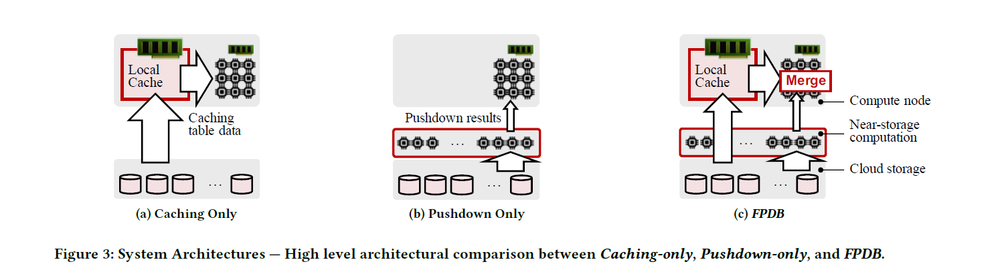
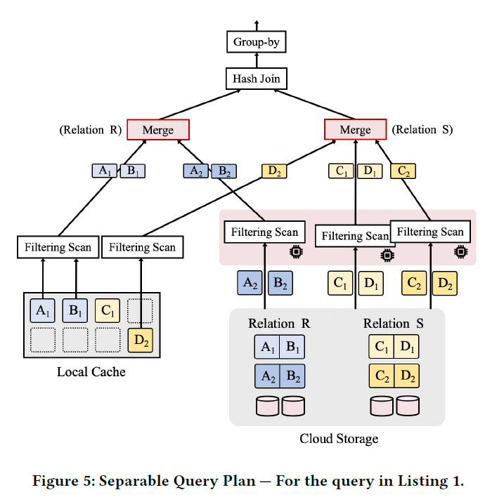
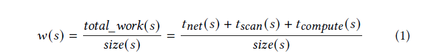
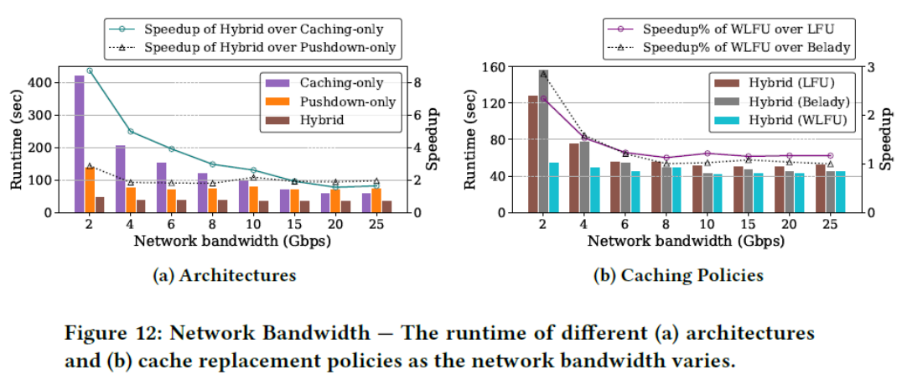
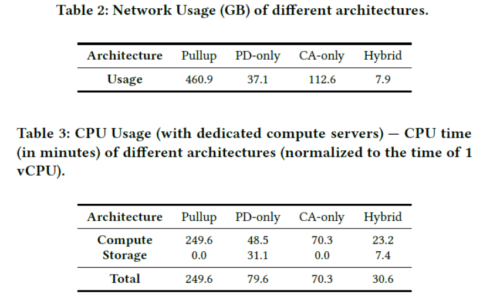
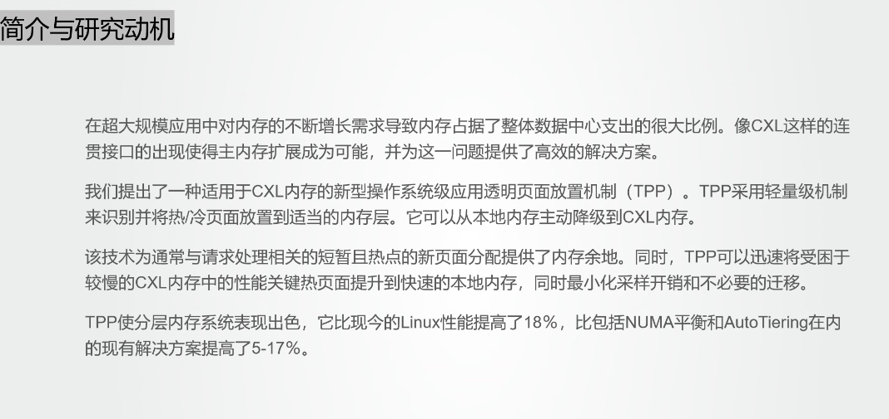
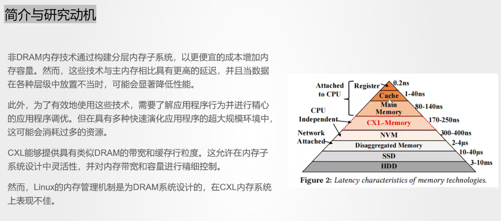
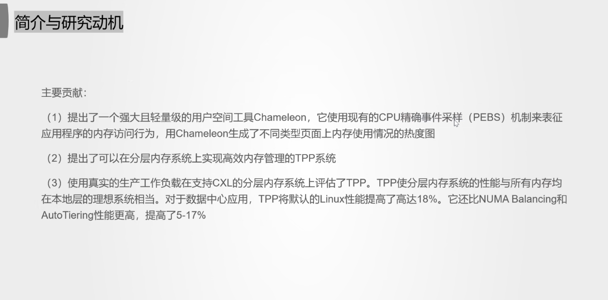
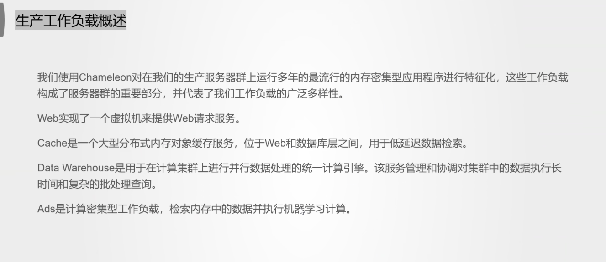
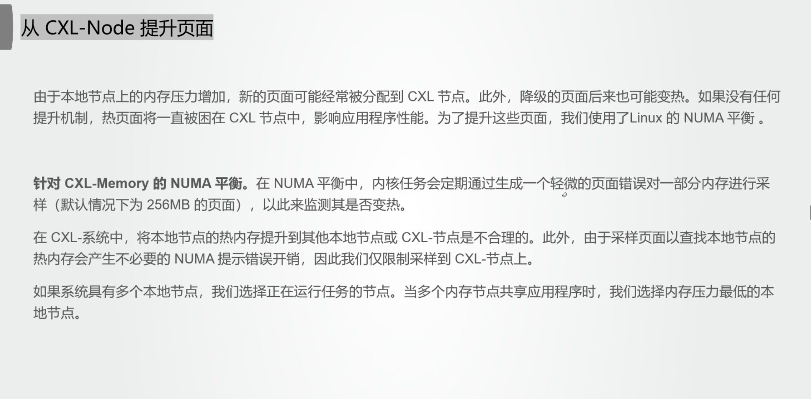

# FlexPushdownDB: 
Hybrid Pushdown and Caching in a Cloud DBMS

</br></br>
FlexPushdownDB (FPDB) 一种OLAP存储管理系统原型。

一种细粒度混合查询：基于新观念——separable operators来结合cache中的数据和下推计算的结果。

一种新的缓存替换策略：Weighted-LFU，考虑下推计算的开销。
</br>
原型开源https://github.com/cloud-olap/FlexPushdownDB.git

---
## 1 INTRODUCTION

现代云数据库存算分离架构的主要瓶颈：计算层和存储层间的网络

两种主流解决方案(减少网络传输)：

- caching
- computation pushdown

1.现有的DBMS往往只支持其中一种，存在潜在的性能优势未被充分利用。

2.传统缓存替换策略有一个前提，假定每次需要替换的都是相同大小的块,是不考虑下推计算操作的。而FPDB还可以选择pushdown，所以提出**Weighted-LFU**——将cache和pushdown纳入统一的成本模型，以预测最佳成本。

---

## 2 背景&动机

#### 2.1 Storage-disaggregation Architecture

现代云数据库中的分解架构支持存储层内的有限计算。这种计算可以在存储节点上进行，也可以在靠近存储节点的另一层中进行。这允许数据库将筛选和简单的聚合操作推送到存储层，从而提高性能并降低潜在的成本
#### 2.2 Challenges in Disaggregated DBMSs
选择存算分离架构带来的问题：

存储层与计算层之间的网络传输带宽，明显低于单机中硬盘的IO带宽，成为了新的性能瓶颈 。


---
## 3 FPDB
#### 3.1系统结构


---
其中，Cache中只存储表数据（实现简便）
表根据某属性进行划分，每一个部分作为一个文件存放

**Segment**
Cache中的基本存储单元——segment，段中存储了部分表的特定列
</br>
即，每个段有独一无二的segment key（表名，部分号，列名）
另外，段结构的数据格式可以与原表不符，比如使用csv
</br>

---
## 4 HYBRID QUERY EXECUTOR

#### Separable Operators

提出了"Separable Operators"的概念，如果一个算子，其计算可以同时利用caching data和下推计算后的结果，则认为是可分离的。

- Projection 投影显然是可分离的

- Filtering Scan 要考虑具体涉及的列

- ...

---

#### 举例——考虑一个简单查询
<br>

```sql
SELECT R.B, sum(S.D)
FROM R, S
WHERE R.A = S.C AND R.B > 10 AND S.D > 20
GROUP BY R.B;
```

---


---
假设R，S两表，R中有A，B两列，S中有C，D两列。

每个表均分为两个partition，local cache中已有部分数据，则整个plan执行如下：

R表：由于A1/B1已在cache中，直接读取并完成filtering，A2/B2不再，则通过计算下推，执行filtering scan获取，并通过"merge"算子将两部分数据结合

S表：由于D1不在cache中，通过计算下推进行filtering scan。

D2在cache中，且过滤条件就在D2上，因此这部分列从cache中直接计算获取。C2在远程存储，需要通过D2的filtering scan来读取，并通过"merge"算子做合并。

---

### Plan Selection
FPDB在具体实现中，对于plan的选择还比较原始
<br>
1. 如果本地有cache数据能满足要求，优先从cache读取<br>
2. 其余的尽可能做计算下推<br>
3. 如果无法下推(e.g unseparable)，则使用原始方式load数据到计算层<br>

---

## 5 Cache Manager

### Weighted LFU

传统策略中有一个基本前提，CacheMiss时，认为把每一个block加载上来的代价是相同的。

但在考虑到计算下推时，这个假设已经不再成立，某些segments可能会更受益于下推，因此即使cache miss了代价也不大，因此新的cache策略考虑了pushdown所带来的影响，为每个segment设置一个对应的收益值，segment下推计算的代价越大，其缓存在cache中的收益也越高，整个cache的优化目标就是使全局的**Σbenefit**最大。

---

具体地，如果cache中有空间，则segment无条件加载上来，否则要做eviction，选择最小benefit的segment做淘汰，直到全局benefit开始变小时，不再加载data。（Algo1）



每个段的benefit值是它的使用频率（归一化，即freq/segment.size），而权重则是表示该segment下推计算的cost，包括网络传输 + 在S3做scan + 计算谓词的代价之和。

---

如何与之前的Hybrid Executor结合？

由executor向cache层发起要访问的segments的请求，cache层根据请求更新相关的统计信息(e.g freq...)等，决定哪些segment应该被加载或淘汰，然后做必要的load data或者computation pushdown。

具体来说

1. 如果是cache hit，则直接基于hot segment做计算

2. 否则是cache miss，由cache policy决定是否要加载该数据到cache中

3. 1. 决定不加载，则执行computation pushdown
   2. 决定加载，要么等待数据读入cache再计算，要么执行pushdown，paper选择前者


---
## 总结

paper中基于Star Schema Benchmark做了一系列实验，对比了caching-only/pushdown-only的架构（左图）以及传统的LRU/LFU/Belady缓存更新策略（右图），都显示出更好的性能。



---
新架构在资源占用上的下降：




# TPP: 

Transparent Page Placement for CXL-Enabled Tiered-Memory











写哈希表0 读哈希表1 复制两份？





Linux内存高中低水位


NUMA平衡




TMO（透明内存卸载）https://zhuanlan.zhihu.com/p/578795964
