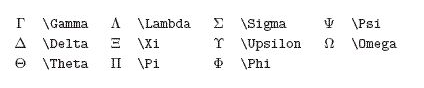

## Typora一些操作

`$$`+回车创建公式块

 ` ``` ` + 语种 + 回车 创建代码块 // Ctrl+Shift+K

## 格式控制

间隔：`\quad`	$A \quad B$


公式的**左对齐**:

&(对齐点) \\\\(换行)

```
\begin{align*}
	& \\
	& \\
\end{align*}
```


$$
\begin{align*}
  & X(0) = x(0)W_{N}^{0\cdot0} + x(1)W_{N}^{0\cdot1} + \cdots + x(N-1)W_{N}^{0\cdot(N-1)}\\
  & X(1) = x(0)W_{N}^{1\cdot0} + x(1)W_{N}^{1\cdot1} + \cdots + x(N-1)W_{N}^{1\cdot(N-1)} \\
  & \cdots \\
  & X(N-1) = x(0)W_{N}^{(N-1)\cdot0} + x(1)W_{N}^{(N-1)\cdot1} + \cdots + x(N-1)W_{N}^{(N-1)\cdot(N-1)} \\
\end{align*}
$$


## **角标**				

`_`是右下角,`^`是左上角

`\limits + _ 或 ^` 

$opt(i,l)=\bigcup\limits _{1 \leq j \leq l} \{opt(i,l-j) \times opt(l-j+i,j)\}$

## 数学符号

点乘：` \cdot`			$a \cdot b$

叉乘：`\times`		$a \times b$

除以：`\div`   	 	$a \div b$

大于等于：`\geq` 	$\geq$

小于等于：`\leq` 	$\leq$

分式:`\frac{分子}{分母}` 	$\frac{分子}{分母}$

### 逻辑符号

|                   |                |                 |
| ----------------- | -------------- | --------------- |
| $\oplus$          | 异或           | \oplus          |
| $\bar S$          | 均值(一bar~)   | \bar            |
| $\neg$            | 非             | \neg            |
| $\vee$            | 析取           | \vee            |
| $\wedge$          | 合取           | \wedge          |
| $\rightarrow$     | 若p则q(右箭头) | \rightarrow     |
| $\leftrightarrow$ | 等价(左右箭头) | \leftrightarrow |
|                   |                |                 |

<<<<<<< HEAD

=======
A \subseteq B
>>>>>>> 616674f024efe46978ba10bf7a29323b3a70e21e

## 希腊

$\Sigma$



## **花括号**											

`\usepackage{amsmath}`

```LaTeX
 opt(i,1) =\left\{
\begin{aligned}
x & = & \cos(t) \\
y & = & \sin(t) \\
z & = & \frac xy
\end{aligned}
\right.
```


$opt(i,1) =\left\{  \begin{aligned}AC \\B\end{aligned}\right.$


## **无穷符号**

`\infty`

$\infty$

<<<<<<< HEAD

=======
>>>>>>> 616674f024efe46978ba10bf7a29323b3a70e21e
