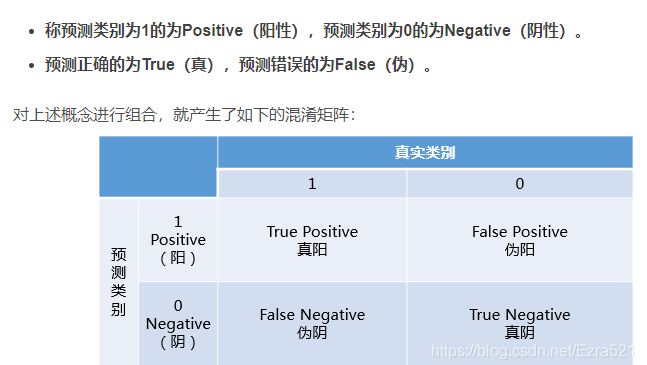
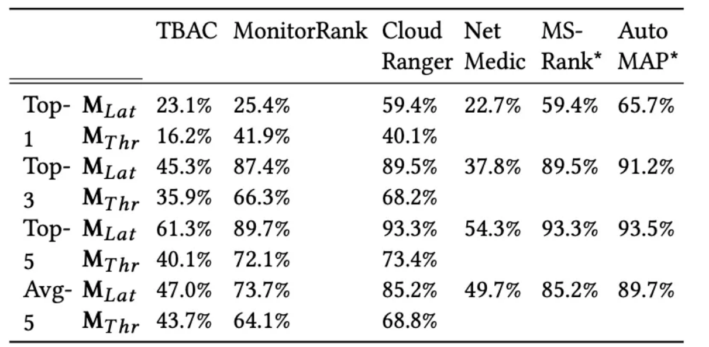
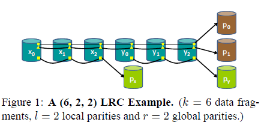
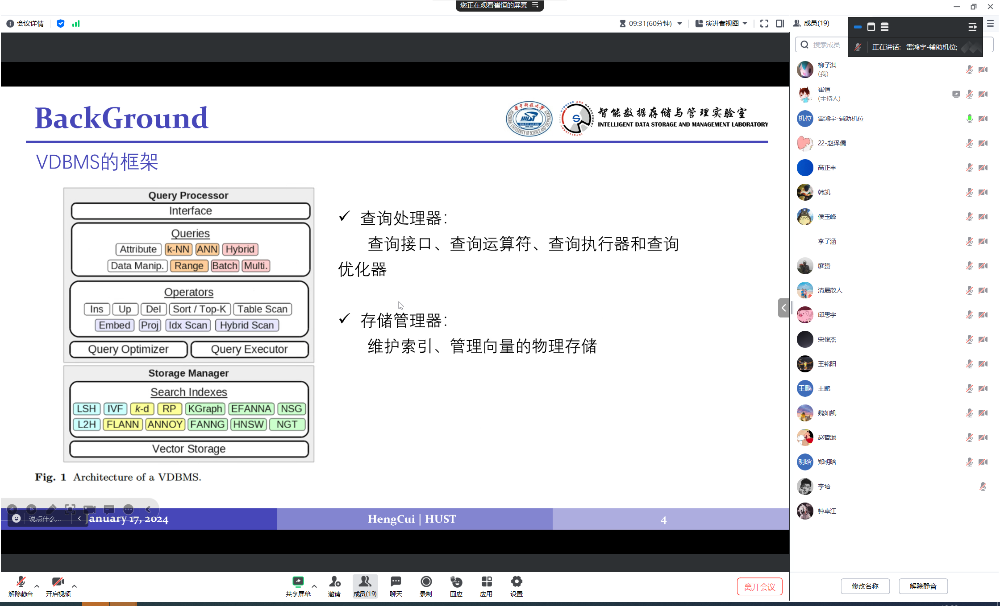

# The next 50 years

The next 50 Years in Database Indexing or: The Case for Automatically Generated Index Structures

[SIMD](https://zhuanlan.zhihu.com/p/416172020) : Single Instruction Multiple Data 同时处理一组操作数。

插值查找？ interpolation

预测查找？ prediction


## Abstract

传统索引结构的三种维度：


We propose a generic indexing framework that can mimic many existing index structures along those dimensions. 一个通用的索引框架，可以模拟上述三种维度。

搞一个a generic genetic index generation algorithm.自动组装和变异出新的索引数据结构（‘breed’ new index structure ‘species’）

## Intro

- Problem1：索引被视作统一实体

  本文认为Index分为，logical和physical两种。

- Problem2：解决类似的问题，采用了两种完全不同的方法

  指的是设计索引结构Index structure和查询计划query plan的方法。索引结构的设计太死板。为什么不能像查询一样，从逻辑和物理运算中自动组装出一个复杂的索引解决方案呢。

- 问题总结：

  1. 如何将最重要的索引结构概括成通用的概念索引框架。
  2. 如何使用1来自动生成框架。

- Contributions
  1. 一个通用索引框架，明确区分逻辑，物理索引。（受到逻辑运算、物理运算的启发）
  2. 一个通用算法，自动生成索引配置
  3. 广泛实验：

## 通用逻辑索引框架

教科书总是把物理实现，和逻辑功能同时介绍。违反了索引结构对于数据的独立性。
$$
\begin{align*}
定义1：&概型[R]:\{[A_1:D_1,...A_n:D_n]\}，[R]有属性A_i和对应的D_i（D_i是不确定的一维域）\\
&函数P:[R]\rightarrow\{true,false\}\\\\

&\sigma_p(R):在概型[R]上作p查询,得到的结果 \sigma_p(R)\subseteq R.\\\\


&\sigma_{l\leq A_i\leq h}(R): [l:h]的区间查询.\\
&if\enspace l==h,则是点查.\\

\end{align*}
$$

### 2.1逻辑节点和逻辑索引

$$
\begin{align*}
定义2.1：&逻辑节点(p,RI,DT),其中\\
&p:划分函数[R]\rightarrow D\\
&RI(routing\enspace information): 路由信息函数D\rightarrow\mathcal{P}(N)(点集N的幂集)\\
&\quad也就是说D中每一个元素都映射到N的子集;\\
&\quad也就是说函数p的outcome可以对应其他节点,记作nodes(RI)\\
&DT = data，是在关系概型[R]下的一个元组的集合 \\
&\\
\end{align*}
$$

用上述定义，实现多种结构(逻辑设计)，举例：

1. 实现一个B-tree with ISAM

   **[ISAM](https://baike.baidu.com/item/ISAM)**, Indexed Sequential Access Method	索引顺序访问

   

2. [RMI](https://zhuanlan.zhihu.com/p/415918824)：[0:12]压缩成[0:4]

   (Recursive-model-Index)递归模型索引，跟机器学习有关

   

3. Extendible hashing

   
   
   >Extendible hashing动态的哈希表
   
   不太懂。这个local depth是干嘛的?
   
4. [radix tree](https://ivanzz1001.github.io/records/post/data-structure/2018/11/18/ds-radix-tree)


**完全逻辑索引 a complete logical index**

当LN的节点中的所有路由信息都指向LN中的节点，称为完全逻辑索引。

这说明：a logical index is-a graph of logical nodes ！

**Running Example：**


示范：他提出的模型可以对传统索引结构进行任意混合（hybrid）

### 2.2逻辑查询

$$
\begin{align*}
定义2.3：RQ:
\
\end{align*}
$$

逻辑索引的正确性
$$
\begin{align*}
定义2.4：:
\end{align*}
$$
在low到high之间的任意查询，都正确，则逻辑索引正确。

注：本文所有内容都是在DAG（无环有向图）基础上讨论。


## 通用物理索引框架

对于每个逻辑节点，我们最终都要指定如何实现。

making a physical decision：

- search algo
- data layout
- 嵌套，委托这些决策。

任何一个节点，如果被有效地指定了，就叫物理节点。

### 指定搜索算法

定义了搜索算法，它是用来搜索，RI或者DT中的K-V pair的；一旦找到了符合条件的key就会立刻停止；

1. scan	对所有条目进行线性搜索。
2. binS    二分
3. intS     [插值查找](https://zhuanlan.zhihu.com/p/133535431) 
4. expS    指数查找
5. hashS  
6. linregS
7. hybridS   

> 有的不太懂

### 指定数据布局

选定数据布局,来组织RI，和DT的数据。

1. col vs row：k-v对采用行或列布局。
2. func：用函数确定RI，（DT）//这里假定DT是一个实际存在的集合，但是实际上也可能被建模成映射
3. unsorted vs sorted：可选是否按key排序
4. comp：压缩情况
5. hybridDL：也可以是混合式的data layout

###  按照嵌套的索引来指定

> ？？


## 遗传索引生成

介绍遗传算法，能够自动生成索引

最大的问题是搜索空间??

### Core Algo

```c++
//GENE遗传搜索算法

/*初始化种群；
DS=DataSet
S_init是初始化的大小 S=size
*/
InitPopulation(DS, S_init)			 
for i in s_init						 
	π=buildAndPopulateRandomIndex(DS)
	c=∏U{π}		
	//π是一个physical index,并入到population中
return ∏

//竞争选择；
TournamentSelection(∏,S_T,W)
    T = sample_subset(∏,S_T) //以S_T大小从中选取样本
    π_min = min{f(π,W)}      
//π是物理索引，W是查询的工作量，f是计算适应度，π_min是最优个体（耗时最少？）  
	~t = median_fitness(T)
    return(π_min,~t)
        
//遗传搜索(main)；
GeneticSearch(g_max,S_init,S_max,S_∏,S_T,S_ch,DS,MD,ND,W)
    ∏ = InitPopulation(S_init,DS)
    for(i=0;i<g_max;i++){                           //g_max是世代数,S_max是突变创建和评估的次数
        (π_min, ˜t ) = TournamentSelection(∏,S_T,W)//物种选择
        for(j=0;j<S_max;j++){
            m = draw_mutation(MD)    //从MD(突变的概率分布)中绘制出一个m(突变)
            n = draw_node(ND(π_min,m)//从节点分布中绘制一个用于该突变m的起始节点n
            ph = draw_phys(PD(m,n))	 //从物理分布中得到一个以n为起点的突变m的物理实现ph
            π_mut = m(π_min,n,ph)    //得到实际的突变 π_min -> π_mut
            if(f(π_mut,W)<=~t){      //如果突变体优于种群平均值 
                if(|∏|>=S_∏)
                	∏=∏\max{f(π,W)} //如果超出了最大容量,淘汰掉最差的
                ∏=∏∪{π_mut}
            }              
        }
    }
    π_min=min{f(π,)}
    return π_min
```


### 初始化种群

可以改变初始大小$S_{init}$，这基本上决定了初始索引集的多样性

要自行决定如何建立DataSet的初始物理索引，有以下选项

1. 从一个单一的不含data的物理节点开始变异。成本太高，舍弃。
2. 一个单一的包含所有data的物理节点。数据布局、搜索算法随机选定，或手工指定一个。
3. 使用自底向上的批量加载，不同的是，对于所有节点，搜索算法和数据布局都是随机选取的。（内节点排除了hash型，因为基数划分不支持），这样做生成的树在逻辑上类似于标准B树，但物理节点差别很大。
4. 给定现有的非常领先的手工索引结构

这里没有考虑这些工作为GENE带来的负载，我们使用它更像是作为一个提纯精炼器（一个细化工具）：从1~4的过程中，给定的初始条件越好，我们越希望只发生小突变。

但实际上，即使给定一个具体的物理实现，（因为有选择各个突变的自由度），仍有可能作出一些意想不到的转变。

### 突变和概率分布

介绍一组合适的突变集并示范如何在算法中应用。

**Mutation：**突变是一个函数，Index->Index，输出修正后的Index。
这个Index既可以逻辑的，也可以是物理的。受到了重写规则（rewrite rules）的启发：突变中，只保证查询结果的正确。（只考虑树结构中的突变）

**Mutation distribution：**

MD：突变的概率分布，可以为不同的突变分配不同的概率，可以指定优先某种突变

ND(π_min，m）：确定突变的节点

PD（m，N）：怎样物理实现这个节点的突变。（对于不匹配的数据布局和搜索算法，比如二分查找+unsorted data，在该分布中将概率设为0）

**一些基本的突变：**目标是通过一组最小的突变集，来创建各种各样的索引。

1. 改变Data Layout
2. 改变搜索方法
3. 水平合并同级节点
4. 将一个子节点水平拆分为k个节点
5. 垂直合并同级节点
6. 将子节点垂直拆分为k个节点

> 垂直,同级?

### 适应度函数

它是丈量优化程度的指标。

我们已经确定优化索引结构，是要在运行时，给定工作量的情况下进行优化。 （包括点，或查询范围之类）

他的实际情况取决于你的优化目标，比如查询时间，占用内存，能效。甚至可以正则化，例如对于索引的复杂度可以设置一个惩罚值...这些需求都可以建模。

## 相关工作

**手工索引**

基于B树的变种和优化，基于基数树的，基于哈希表的工作都已经做的很好了。

**学习型索引**

节点内的布局，搜索算法是固定的，目的是学习CDF（累积分布函数）//物理结构仍是手工确定的。这是在手工构建的结构中，学习权重。而本文是在优化整个索引结构。

**Periodic Tables and Data Calculator**

[25] [Design Continuums and the Path Toward Self-Designing Key-Value Stores that Know and Learn](http://cidrdb.org/cidr2019/papers/p143-idreos-cidr19.pdf)

[27] [The Periodic Table of Data Structures](http://sites.computer.org/debull/A18sept/p64.pdf)

[28] [Learning Data Structure Alchemy](http://sites.computer.org/debull/A19june/p47.pdf)

[29] [The Data Calculator : Data Structure Design and Cost Synthesis from First Principles and Learned Cost Models](https://dl.acm.org/doi/pdf/10.1145/3183713.3199671)

这些工作也实现了混合设计，但这仍是帮助工程师寻找更优索引结构的推理判断工具。我们的工作关注：

1. 全自动索引构建
2. 逻辑和物理索引组件的清晰分离
3. 在实际系统中对索引结构的全面建模开销太大，无法训练模型，只能选择遗传优化
4. 优化时间不那么关键，（与查询时创建索引实例不同），所以说应该尽量通过（fitness function）实际观察运行时的测量值，而不是成本模型的定义。

>所以说，什么时候“自动优化索引”？

**通用框架**

GIST XXL

这些框架希望把不同的索引结构归纳为一个通用的软件框架，这反过来允许架构师实现通用的索引算法，专用索引也可以更容易地调整以适应通用算法。

这些工作是面向对象层面的，而本篇的工作是概念级的论证。

通过类比分离出逻辑关系运算，不急于立即物理实现。(ONC, vectorization,SIMD, whatever)

**DQO**

最近，我们提出了[DQO](https://www.cidrdb.org/cidr2020/papers/p3-dittrich-cidr20.pdf)，把operator分解成更小的组件，以进行传统的查询优化。但那篇文章没有详细说明如何在索引环境中应用这种想法。它既没有详细说明如何分割传统运算符，也没有详细说明如何将其转化为自动创建索引的优化问题。We fill the gap

**Index Selection**

与我们的方法完全不同：目标是确定一组合适的属性集合

**Adaptive Indexing**

Index Selection是NP难的问题，不再考虑二元决策，而是让索引随时间越来越细粒化。计划在未来用我们的逻辑节点来模拟这些技术

**Genetic Algorithms**

在查询优化中很奏效，但这是首次被用于索引创建。

**Decoupling Logical and Physical Indexes**

与之前的工作不同在于：在树种进行分区

在结构索引领域，[1,9,41]引入了使用图分区在关系模式中对元组进行co-partition(or聚类)的思想。这些图分区可以辅助进行结构查询（仅使用外键索引可能很难计算）。本文关注创建单独的物理索引，图的co-partition可能是未来的一个方向。

## Section 6 实验评估

**环境：**1900X，32GB，on Linux

C++ and compiled with Clang 8.0.1, -O3.

All experiments are run single-threaded and in main-memory.

**Dataset：**data.key  64bit    data.offset  64bit


$uni_{dense}$ [0,n) (size=n)

$books$  $osm$ 代表复杂分布的真实数据

根据所需大小，均匀绘制无重复元素

**Workload：**


三类：点查，范围查询，二者混合。

所有的负载都是只读的（无insert，delete，update语句），但框架是支持插入和删除的，update不会改变索引结构，所以也易于集成进框架中。

Point (data，idx_min，idx_max）表示在子域[idx_min，idx_max）中等概率选择索引，进行点查。

Range_sel (data，idx_min，idx_max) 表示在子域[idx_min，idx_max）中等概（不越界地）选择下界，上界是根据数据集大小和sel设置的。

（如果不指定域，就默认为整个DataSet）

Mix（data，P，R）P，R分别是设置好的点查和范围查询负载。

注：Workloads可能重复。

搜索算法与数据布局：

scan, binS, intS, expS, and hashS


### Hyperparameter Tuning

使用100K的$uni_{dense}$对下面五个参数进行调整：

1. 突变代数 S_maxc {10,50}
2. 种群人口上限S_∏ $\in${50,200,1000}
3. 竞争时的采样率 S_T  $\in${10%，50%，100% of  population size}
4. 初始种群大小 $\in${10,50}
5. 人口插入标准：不取竞争期间采样的子集的中值，定义了一个百分数q$\in${0%，50%，100%}，表示“要优于种群中比例为q的个体，该突变体才能加入种群”


$S_{max} = 10, S_∏= 50, S_T= 25, S_{init} = 10 , q= 50%.$

### Rediscover

证明该遗传算法能再现教科书中各种基本索引结构的性能。

**数据集：**uni~dense~、 books of sizes 100K,1M,10M,100M

**三种工作负载：**  

	Point(uni~dense~)
	
	Range$_{0.001}$ (uni~dense~)
	
	Mix(uni~dense~, P, R)   // 80% point and 20% range queries

**Baseline：** 

- 点查：simple hash table——单点内哈希表。
- 范围查询和混合查询：B-tree-like structure——具有100个完全填充的叶节点，每个叶子包含1000个元素，并且内节点扇出为10个元素。每个节点都是数据布局都是sorted_col，搜索算法都是binS

**配置GENE：**每个节点最多包含100，000键值对或子分区。初始种群中，采用与上述相同的树结构，但数据布局和搜索算法都是随机的。每个实验执行8000世代。每当找到一个更好的结果，就用与更大的数据集（必要时增加叶结点容量），然后再用完全相同的工作量进行评估。


GENE可以迅速达到baseline，因为通过突变可以很容易在一开始时改善那些低效率的节点。达到baseline后，GENE的改善很小。GENE寻找到的索引结构往往和baseline非常相似。

**对于稠密集uni~dense~，**

GENE总是返回单节点。仅有点查时返回的是含所有条目的hash node；范围查询和混合查询，返回的都是sorted_col+intS。

**对于books，**

点查返回的树有68节点，66个叶子结点。除了一个叶结点通过树节点连接root外，其余都是直接连在root上的子节点。48个节点是hash(unordered_map)布局，其余是sorted_col布局，或树(map)布局。在non-hash 节点中，除3个使用expS指数搜索外，其余都是二分搜索；

范围查询返回44个节点的树，共三层，多数叶结点在第二层，sorted_col布局，主要搜索算法是binS，2个intS，2个expS；混合查询与范围查询类似。

GENE的执行时间很大程度上取决于DataSet和WorkLoads，最快的执行：uni~dense~ + 点查，找到最后一个改进的时间< 3min。而同一个数据集上的范围查询，需要122min

扩大数据集会进一步影响运行时，最高执行时间是books上的范围查询，30h

### 优化vs启发式索引

与三种具体类型的索引进行对比。（混合查询）


# Data Calculator

Data Calculator：Data Structure Design and Cost Synthesis from First Principles and Learned Cost Models(SIGMOD’18).

Stratos Idreos, Kostas Zoumpatianos, Brian Hentschel, Michael S. Kester, Demi Guo

## Abstract

提出一个设计引擎——Data Calculator，能进行交互式的半自动的数据结构设计。
1.原语primitives的集合：能描述结构中的数据布局、定位其他节点的方式。可以用来综合、描述各种可能的数据结构设计。
2 a learned cost models. (来自各种硬件、数据配置，数据访问原语）用来预先估算性能表现（在实际实施之前）。并且能合成全新设计，自动完成部分设计，检测出次优设计选择。

> Let us calculate. —Gottfried Leibniz

## 从手工设计到交互式设计

- 数据结构很重要

- 广阔、复杂的设计空间

- Problem：数据结构的设计是一个缓慢的进程

  数据结构的设计和实现的周期太长，这个过程中，硬件和工作负载可能又发生了变化，需要缩短实现周期。

  不能任意迭代：因为很多数据服务是7*24小时在线。我们可以通过工具预测确定最有用的更改，如今这种决策往往基于专家的建议，而这种专家供不应求。

- Vision Step 1：一个数据结构设计范式。它是几种基本元素的组合。类比于元素周期表。

  

  


> 他的动机很明确：在同样的内存开销下提升读性能，目前LSM-tree有用做文件系统的元数据存储引擎、关系型数据库存储引擎等等，所以提升读性能很重要；提升LSM-TREE读性能的论文目前还不是很多，所以我觉得有空间


# Magic mirror


# Wisckey

[Wisckey](https://www.usenix.org/system/files/conference/fast16/fast16-papers-lu.pdf)

https://zhuanlan.zhihu.com/p/389397486

# AC-Key

[AC-Key：Adaptive Caching for LSM-based Key-Value Stores](https://www.usenix.org/system/files/atc20-wu-fenggang.pdf)

# RobinHood

[RobinHood: Tail Latency Aware Caching - Dynamic Reallocation from Cache-Rich to Cache-Poor](https://www.usenix.org/system/files/osdi18-berger.pdf)

# Breaking Down MemoryWalls

[Breaking Down MemoryWalls: Adaptive Memory Management
in LSM-based Storage Systems](https://vldb.org/pvldb/vol14/p241-luo.pdf)


# Leaper

[Leaper: A Learned Prefetcher for Cache Invalidation in
LSMtree based Storage Engines](http://www.vldb.org/pvldb/vol13/p1976-yang.pdf)

## Abstract

后台进行的compaction和flush操作，导致缓存失效。

Leaper：一个插件，通过预测热数据，预取到Cache中。减少70%缓存失效，和99%峰值延迟

## 1.Introduction

各种LSM-tree把写性能做的很好。但是写入时后台的compaction和flush操作会导致Cache Miss（而且Compaction有时不止一次）。传统的基于频率的缓存策略不适用。由于缓存命中率太低，导致**延迟峰值**，称为**缓存失效**。

而且，错峰的Compaction调度并不能在高压力下维持高性能，因为累积了太多的Level要做。会导致LSM-tree性能严重下降。（比如：持续的范围删除操作会对范围查询产生致命影响）


过去的缓存失效问题：[11, 1, 37]。

通过放宽已排序的数据的布局[15]减少Compaction频率

或者维护紧实前后记录之间的映射[1, 40].

但是：这些工作代价大，而且要对原有LSM-tree实现作改变


用机器学习来识别数据访问的热范围，然后再与记录块（record block)相交来确定是否Prefetch to Cache。这个识别范围独立于背景线程，可以跨越多个Compaction和flush持续进行。天然支持点查和范围查。


为了减少线下训练和在线推理的开销，优化： 

locking mechanism

two-phase prefetcher


- 阐述缓存失效，并基于机器学习预抓取解决了这个问题
- 一个低开销的ML解决方案
- 遥遥领先~

## 2.缓存失效问题

### 2.1基于LSM-tree的存储引擎

### 2.2缓存失效问题


一些数学定义


现有工作：SM-tree[15]（Stepped-Merge）记录不完全排序以减少compaction的次数，但是显著降低读性能，范围查询和更新时

 LSbM [40]结合了SM-tree[15]和bLSM[37]。致力于在压缩时维护Cache和磁盘之间的reference。但是增加了压缩时的复负担和存储开销。

Incremental Warmup Algorithm [1]增量预热算法：它将新压缩的块移动到块缓存中（键范围与缓存中的块重叠的）。两个缺点：首先，它假定如果新压缩的块与块缓存中的任何块重叠，则它们将被频繁访问。
其次，缓存中的块可能会与多个新压缩的块重叠，因此它可能会将不经常请求的块预取到块缓存中。

## 3.设计概述

### 3.1设计原理

抽象成一个二元分类问题：给定一条记录在最近x *t分钟内被访问，预测该记录在接下来的t分钟内是否被访问，其中t、x和t表示统计时间间隔、间隔数和预测持续时间。

？

由于以下原因，这种预测方法可以解决缓存失效问题

- 首先，理论上它比LRU获得了更高的缓存命中率，因为它可以检测到更多的热记录[3]。
- 其次，预测方法跟踪的每个记录的访问频率不受紧凑的干扰，因为它独立于存储结构。
- 第三，预测对缓存中记录的访问自然是一个二进制分类问题，因为我们只需要对记录的第一次访问来消除潜在的缓存遗漏。


### 3.2系统概述

具体来说，我们在key区间水平进行预测，目标是在预测开销和准确性之间达到平衡。在预测了热范围后，我们将它们与块边界相交，以选择应该预取到缓存中的记录块。


如图示，Leaper可以以插件形式加入LSM-tree


Learner：负责在不同的时间间隔尺度进行预测

Collector：统计访问数据，生成特征化数据。	Collector是多线程的，引入lock mechanisms（锁机制）避免写冲突；引入一种采样策略减少它的开销；

Prefetcher：推理，如果与预测区间相交，则填充到缓存中。随着flush和compaction被存储引擎内部触发而伴随执行。

对于flush，预取器直接预测flush中涉及的键范围的未来访问。

对于compaction，通过两段机制来预测参与压缩的检范围的未来访问。

## 4.离线分析

### 4.1Key Range选择

减少系统开销，以确保在线组件可行。

？Key范围的好处：

- 首先，键范围有助于减少在线训练和在线推理的开销。
- 其次，键范围与底层lsm树中块的布局一致（无论该键是主键还是从键？）
- 第三，容易收集范围查询访问频率的信息

键范围越小，要收集的统计信息越多，预测可能更向精准，但线上开销会更大。

初始化一个键区间（实验中初始大小为10），对于每个键区间用0/1表示是否被访问（预测即将被访问）。N个区间，就对应一个N维向量。对于每一个时间间隔都有这样一个向量，就扩展成一个矩阵。

> 举例：a vector of 4 bits （0,1,1,1）
>
> 如果区间大小扩大一倍会变成（1，1），即相邻两个作异或

上述例子中，区间范围增大时，只要矢量(或矩阵)中零的比例减小，意味着发生信息丢失。

**Def1：L->L0的有效扩张**

$Z(L)/Z(L_0) > \alpha$ 																									其中，Z（）表示0在向量、矩阵中的比例。阿尔法是一个阈值。

​	扩张区间大小直至非有效扩张。在我们的例子中，是阈值
设置为0.6，并且nal键范围大小扩展为10,000。

通过如上算法，Leaper选择合适的Key范围将Key进行分组。

### 4.2特征

访问的Key和时间戳

**读/写到达率** 

读(或写)到达率是指连续时隙中读(或写)的数量。

读取到达率是模型捕获访问模式的最重要特性，因为它可以反映应用程序级别的用户行为。

图4(b)告诉我们，对于某些键范围，写到达率与读到达率共享类似的访问模式。（比如与在电子商务场景中，受欢迎的商品同时具有频繁的浏览和订单。）

因此，有必要将写入到达率添加到特性中。
在我们的实现中，我们使用6个时隙(在第7节中解释)来收集到达率。
因此，对于读到达率和写到达率，总共有12个特性

**预测时间戳**

观察工作负载，发现访问时间呈现周期性规律。

在实验中，使用了3个特征(即一天中的小时、分钟和秒)

**前兆到达率**  ?

两个Key有关联（a是b的前驱），b的到达率会受a影响，例如，在电子商务工作负载中，用户购买钢琴后购买钢琴架的概率增加；我们要捕捉这种跨越Key区间的关系

可以将不同时间的到达率组合成一个向量， 计算向量之间的余弦值，如果足够相似就作为前导。将与target区间最为相似的γ个区间的到达率情况加入到特征中。（实验中被设置为3）


### 4.3 Model

GDBT（Gradient Boosting Decision Tree）梯度提升决策树

弱预测模型（决策树），高效准确，可解释性

对于每个特征，GDBT需要扫描所有的数据实例以评估所有可能的分裂点的信息增益。因此GBDT的复杂度和特征、数据实例的数量成正比。

选用LightGBM，最新最牛的GDBT。

分类模型的输入是一个18维的特征向量(即6个读到达率、6个写到达率、3个时间戳特征和3个前驱到达率)。输出是一位二进制，表示下一个时段是否会被访问。

损失函数：平方损失，对数损失

> scikit-learn[30]中的GridSearchCV函数 ???

我们利用scikit-learn[30]中的GridSearchCV函数在测试集上搜索最优参数。

主要参数：num_leaves，learning_rate， bagging_fraction，feature_fraction（帮助防止过拟合）

>K-fold交叉验证

K-fold交叉验证有助于确定最优参数：

num_leaves，learning_rate， bagging_fraction，feature_fraction = （31，0.5，0.8，0.9）


## 5.在线处理

### 5.1统计信息的收集

Key ranges counter：收集器维护一个全局计数器。多线程收集，会发生写冲突，锁的两个优化策略：双重检查[36]，Lazy初始化

>Double-checked locking[36]

双重检查锁定通过在获取锁之前检查条件来减少获取锁的开销；

其次，直接使用原子操作而不是全局互斥锁。

抽样：双重检查，和延迟初始化保证了第一次访问一定被记录，后续的以概率P被记录。

预估访问次数：


其中$S_i$是收集值，

因为第一次访问必被收集，所以要“-1，+1”。

抽样过程服从二项分布，$S_i \sim B(N_i-1,~P)$  ；当N足够大，近似成正态分布，采样误差

> 正态分布抽样误差


### 5.2推理

推理过程：使用特征化数据（collector）和模型（learner）把数据分为冷热两部分。

在Leaper中，我们使用Treelite[6]作为推理实现，以进一步减少推理开销。

> Treelite啥东西？？

- 针对特定模型，特定平台的编译优化
- 使用动态链接库，无需重新编译推理代码，而是替换learner生成的动态库来更新训练过的模型
- 支持多种模型。如梯度增强树（Gradient Boosted Trees）和随机森林（Random Forests）具体实现：XGBoost, LightGBM, Scikit-Learn等。


### 5.3交集检查

我们在预测的热键范围，和目标块（flush和compaction要涉及的）之间查重：binary search 和 sort-merge 两种方法。

基于预取器在何时得到目标快的key范围进行选择：如果我们在flush或压缩结束时得到它，就会调用sort-merge；如果在执行中得到，就binary search，


没太看懂

## 6.压缩优化

### 6.1

提出多步预测和两步预取，源于两个需求：需要分两个阶段来处理移动块对应的缓存条目（压缩过程中和压缩后），以减少Cache Miss，（不能没等压缩完就从Cache中剔除了）；因为每次Compaction的时间长度不通，两步预测需要多次结合。


多步预测帮助Leaper以新粒度的方式预测未来对键范围的访问。使用两阶段预取器来区分压缩过程中的访问和压缩后的访问。

第一阶段（驱逐阶段）Leaper预测整个压缩操作过程中的访问；第二阶段（预取阶段）Leaper预测压缩过后估计时间段内的访问数量

两段预取器与LRUCache有两种合作方式：

1. Leaper只驱逐无效块（被预测为冷数据）
2. 由于预取的块的大小相对于总缓存大小来说是相对较小的(例如，在现实应用中通常是几十GB)，这些块不应该被LRU驱逐，也不应该打破LRU的安排，只要它们很快被访问。


T1是压缩持续的时间，T2是恢复时间

理论上狭缝时间t（slotted time）是二者的最大公约数与gcd，但实际上T2远小于T1，因此t近似等于T2

每个狭缝时间都对应着一个模型？？？

### 6.2


## 7.实验

### 7.1配置

至强8163*2 96线程

512G 2666 DRAM 

Leaper on X-Engine with MySQL 5.7

Baseline：Incremental Warmup，如果新压缩的块和Cache中的某块有重叠（即最近被访问过）//就是X-Engine原本的策略

负载：SysBench生成的负载+天猫,钉钉的真实负载

DataSet：前三天数据作为训练集，后一天的作为测试集

评估指标：准确率Precision	 召回率Recall 	AUC

Precision	 =    真真/ 预测为真		//预测为正确的数据中，真实值为正确的比例（预测为真时的准确度）

Recall = 真真/假假   // recall即为在所有的真实值为正确的数据中，分类器能找到多少。（正样本的召回率）

Accuracy：(TP+TN)÷(TP+NP+TN+FN)，分类器对整体的判断能力，即正确预测的比例

> ### 分类的重要评估指标——AUC
>
> https://blog.csdn.net/Ezra521/article/details/117733777
>
> AUC是roc曲线下与坐标轴围成的面积**（receiver operating characteristic curve）**接收者操作特征曲线
>
> 
>
> 
>
> 例如，$TP_{rate}$指所有真实类别为1的样本中，预测为1的比例
>
> $FP_{rate}$的意义是所有真实类别为0的样本中，预测为1的比例。
>
> ROC: TP-FP 也就是真真-假真
>
> 如果ROC为y=x，则说明无论真实值为0还是1，预测出来为0/1的概率是相等的，说明毫无区分能力。               
>
> 一个抛硬币的分类器是我们能想象的最差的情况，因此一般来说我们认为AUC的最小值为0.5（当然也存在预测相反这种极端的情况，AUC小于0.5，这种情况相当于分类器**总是**把对的说成错的，错的认为是对的，那么只要把预测类别取反，便得到了一个AUC大于0.5的分类器）
>
> 我们希望分类器达到的效果是：y	>	x
>
> 
>
> ****
>
> 


### 7.2离线评估

（对比各个方案的冷热数据分类情况）


这图的坐标从0.8起emm这是可以的么？？

观察到选定的特征不能总是区分正常输入和异常噪声。

尽管抽样率为0.01，存在采样误差，但是基本没影响。因为模型是二元分类，而且延迟初始化和双重检查锁在Collector中保证了0/1属性。影响微不足道。

### 7.3 线上性能

首先，测试合成负载下Leaper的影响， 关掉compaction

## 其他


# AutoMAP

AutoMAP: Diagnose Your Microservice-based Web Applications
Automatically

WWW 2020

异常检测，在系统中定位故障

## Abstract

复杂和动态的微服务结构让应用诊断极其困难。

提出异常行为图（anomaly behavior graph）的概念；定义了两个运算，一个近似函数。

设计了一个启发式调查算法，用前向，自我，后向自我随机游走，来确定产生错误的根服务。

效果良好。

简单部署在任意微服务架构的系统中，无需系统知识。

支持引入各种专家知识（新的参数？）来提高精度。

## 1 Introduction

微服务架构促进了抽象和模块化，但是！随着服务及其依赖的拓展和重构，定位源异常更加困难，挑战主要来自以下三个方面：

**Dynamic application structure**

原有的静态方案排障方法，如thresholding schemes（阈值化方案）可能无法获得可靠的模型（在这种频繁变化的情况下）。所以，最近的研究大多从系统结构出发，再诊断异常。

但是，这里的结构（例如网络拓扑或服务调用依赖关系）通常要通过监视各个组件得到历史数据，再提取出结构（例如日志文件，审核事件，网络数据包）；这样做费时费力，而且对于某些老旧系统，开发一个中央组件来收集数据和生成结构，甚至是不现实的。

**Indirect anomaly propagation**间接异常传播

随着微服务架构中组件粒度变小，服务可能驻留在不同的主机或容器中。它们的调用过程可能是直接调用的同步过程，也可以是通过消息代理或发布/订阅组件的异步过程。因此异常传播不再受调用限制。


解释：图中红色是异常的源服务，它影响到了同一主机下的服务（黄色），从而影响了Web应用。但其实这个红色服务根本没被调用。

因此即使知道了服务的调用依赖也不够用，仍需要一个更加动态全面的诊断机制。

**Multiple types of metric.**

基于单一指标的算法可能不足以描述不同服务中出现的异常；异步调用过程使得单一度量不能直接反应传播依赖性；缺乏一个自动化机制根据服务的特点选择适当的度量。


 目标是：开发一个自动化诊断工具，包含以下能力：

- 自动生成异常拓扑，（不需要任何先验知识）
- 基于多种度量描述服务异常
- 选择适当的度量推断根本原因


## 2 Related work

**传统的监测数值是否达到阈值进行异常检测：**

一个很老的网络异常检测

[A survey of fault localization techniques in computer networks](https://reader.elsevier.com/reader/sd/pii/S0167642304000772?token=4C88ACA8012CDEB0C61352F2288037059B0A85A92D3AD8C3E1A02E04B949DA06D7A8307B7D1134488B5F67A096892889&originRegion=eu-west-1&originCreation=20230112090356)

[Detecting Transient Bottlenecks in n-Tier Applications through Fine-Grained Analysis](https://csc.lsu.edu/~qywang/papers/ICDCS13Wang.pdf)

但是在微服务架构中，很难找到一个适用于各种异常的阈值

invariant graph：[Efficient and Scalable Algorithms for Inferring Likely Invariants in Distributed Systems](https://d1wqtxts1xzle7.cloudfront.net/90761056/jiang-tkde-07-libre.pdf?1662569129=&response-content-disposition=inline%3B+filename%3DEfficient_and_Scalable_Algorithms_for_In.pdf&Expires=1673678369&Signature=fc6RwRKOu6lqoskO7u~Lrxo4-uPgR2FcNyHjhOkVrldEtD76HLIadKxm3Ga1~NWyKGcY9e2qjaAj5WNYuwJStIPumtjZmxkDBNN6T8dmlcaaq-SaD5TzkB63FA6a--PGnuIwngJc~fWQYmYeoKicMDn9w3T8mSjIfJfiyRuZOqbHEusBrT-KouA~vN-R1v6l9mbQh6A6uRhAxXSjFyzSOszNIgQD8V8yhxr849j6Kp66IWed6caFAxovvu01ziEvJiYapXU6HjU2r-Y-3c-TQSez9fgz9eShGA2eL3-20YvgS1mb-bZNFuzx7WL0pEyEXPrIIQSvKSpYtuGG3P3cuQ__&Key-Pair-Id=APKAJLOHF5GGSLRBV4ZA)

描述异常传播拓扑。静态网络结构中的链接代表因果关系的一部分 ，但微服务架构部中的实际关系更具动态性

**新的应用机器学习的 **：

MonitorRank：[Root Cause Detection in a Service-Oriented Architecture](http://i.stanford.edu/~mykim/pub/SIGMETRICS13-Monitoring.pdf)

实现一个实时收集系统和异常检测框架，基于游走策略的无监督启发式故障诊断方法


CloudRanger：[CloudRanger: Root Cause Identification for Cloud Native Systems](https://ieeexplore.ieee.org/stamp/stamp.jsp?tp=&arnumber=8411065)

提出一种动态因果关系分析方法来构造应用程序之间的影响图，而不需要给定拓扑。
提出了一种基于二阶随机游走来识别罪魁祸首的服务

Microscope：[Microscope: Pinpoint Performance Issues with Causal Graphs in Micro-service Environments](https://link.springer.com/chapter/10.1007/978-3-030-03596-9_1)

CloudRanger，Microscope，在未预知拓扑结构的情况下进行诊断

**另一个问题，选择合适的诊断计量（metric）类型**

NetMedic（针对小型企业网络故障 ，生成传播依赖关系图 ）

MS-Rank（基于历史诊断记录，动态度量选择）

## 3 Problem Statement

### 3.1问题定义

把微服务WEB应用看作黑箱，只知道各种类型的监控指标，不清楚各服务功能和调用拓扑结构

### 3.2AutoMap

- 选择采样间隔参数在原始度量上（raw metrics）
- 构建异常行为图
- 提取配置文件（profile）通过"+""-"
- 在图上执行启发式根因检测算法
- 验证结果，计算准确度
- 更新权重矩阵（metric-weight matrix），重复上述步骤


## 4 Metrics

共考虑7种指标


时间间隔的选取：

（按照调用次数加权平均）


## 5 行为图

SRE（站点可靠性工程师）往往不会分析整个WEB应用的拓扑结构，而是根据异常类型，靠直觉、经验排障。他们观察指标，选择最可疑的服务。工程师直觉经验包含两方面：历史诊断经验和各个服务的特点。


#### 5.1行为图构建 

- 全连接图，边的权重全为1
- 对于每一个指标 $M_k$ ，检查两点 $(i,j)$ 间的条件独立性，若独立，$W_{i,j,k}=0$
- 检查每个边，若任意指标k的对应的W均为0，移除边
- 把无向图定向为行为图


𝑆(𝑣𝑖, 𝑣𝑗, 𝑘)表示条件集

细说第四步：V型结构定向 i j l

根据三个rule对应处理不同的情况，对边进行定向 。

对于每个指标分别计算，得到权重矩阵


#### 5.2加运算和服务归档

使用行为图分析服务类型：但云平台提供的服务太多，根据他们的特点分类是一个很有挑战性的工作。

一个比较直接的办法：使用历史观测数据。生成多个行为图，再合并。

对不同的行为图进行加运算（+）


**service profile的生成**

把服务分为五类：Representational,Computing, Networking, Storage, Environmental

比如说对于表征性的服务（展示界面），我们更在意它的延迟。


#### 5.3减运算和异常归档

真实情况下，只有少数的服务涉及异常传播。原始构造的行为图可能包含冗余服务，要移除这些冗余关系。使行为图更接近对于异常的描述。

**减法运算**


**anomaly profile**


## 6自动根因检测

### 6.1参数权重学习

**Service Correlation**

计算服务之间的相关性：


相关系数 = 协方差/（标准差*标准差）


**Result Precision**

 给定异常行为图G A 

AutoMap在历史记录中搜索与G A相似的top-k个候选图，对每个指标分别计算相关系数


profile similarity:

在选相似的行为图的时候，定义了一个相似函数计算分数

其中一步：根据其主导指标（max）进行归类（RCNSE）涉及点相似的计算。


### 6.3一个根因检测的例子 


### 6.4随机游走根因检测算法

- **正向转移（Forward Transition）**
  一般情况，对于异常行为图的一个访问按照概率$p_{i,j}$进行。
- **自向转移（Self Transition）**
  自身转移会鼓励访问者在其当前访问的服务上停留更长的时间，以防止访问者中没有一个与邻居的相关性很高。
- **反向转移（Backward Transition）**
  另一种情况，当访问者正在访问相关分数较低的特定服务时，如果其所有邻近服务与给定异常的相关性都较低，则可能找不到任何离开的途径。因此使用反向转移跳出。

给定一个异常行为图，根因的探寻通过随机游走算法，从前端应用节点$V_{fe}$开始，计算正向,反向,自身的转移概率，并随机选择其中之一。   AutoMap记录每个服务被访问了多少次，并输出结果降序的列表，以此作为可能根因的排序。

## 7实验

模拟集：16个微服务。每轮随机选择一个服务，关闭容器或攻击。




真实数据集：共有1732个微服务API，20个事件，每个事件从异常发生前后各一小时中收集了大约1500万个指标。

随轮次的增加，准确率变化。


# **TLDFP**

Minority Disk Failure Prediction Based on Transfer Learning in Large Data Centers of
Heterogeneous Disk Systems

**IEEE**

## 背景 

大型数据中心的存储系统通常建立在数千甚至数百万个磁盘上，磁盘故障时有发生。磁盘故障可能导致严重的数据丢失，从而导致系统不可用甚至灾难性后果。

#### **少数磁盘**

在大规模的存储系统场景中，随着时间的推移，大量的新磁盘逐渐进入存储系统，替换出故障磁盘，导致存储系统由来自不同供应商的异构磁盘和来自同一供应商的不同型号的磁盘组成。

称这些相对较少量的磁盘为少数磁盘。

传统机器学习方法需要大量的训练数据以达到良好预测性能，不适用于含有上述异构少数磁盘的存储系统。

（在后续的例子中，少数磁盘占25%，超过50种型号）

#### **效益**

相比于被动的容错机制（Erasure Code (EC)，RAID），主动预测磁盘故障也可以保证可靠性和可用性。

 因此，成功的预测可以降低丢失数据的风险，降低数据恢复成本。


目标：通过迁移学习，从可用的多数磁盘数据集，预测少数磁盘故障。

**文章回答四个问题：**

- 什么是少数磁盘 
- 为什么用迁移学习
- 如何预测
- 什么时候预测

## SMART 数据集的收集

#### SMART

硬盘厂商固件内的信息。

硬件自己有一个阈值检测。

failure detection rate (FDR)： 3-10% 

false alarm rate (FAR)：0.1%

500万个硬盘，以一小时为时间间隔，一天有200G，假设寿命为5年，共350T。而且每个小时都要汇集每台服务器的smart信息到一起。

实现了一个数据收集框架：


## 相关工作

略

## 初步试验和动机 

#### 3.1  Minority Disk Datasets

根据初步试验，当某种型号磁盘的数量少于1500个时，传统的ML算法无法提供令人满意的性能(过拟合)，因此将其定义为**少数磁盘**。按照这个定义，对数据进行分类。


在少数磁盘上(7:3)，试用几种传统方法，效果很差。


PDFs是概率密度统计量

GKDE高斯核密度估计

四个厂商不同型的号硬盘某SMART属性值的分布具有相似性，称之为协变量偏移。（covariate shift）


考虑上述规律，我们可以用数量充足的某型号硬盘数据，建立一个预测模型来预测数据不充足的其它型号的硬盘。

## TLDFP

迁移学习算法TrAdaBoost


其中源域包含完全标记的多数盘数据集，和少部分少数盘标记数据集；目标域是少数盘剩余的未标记的数据。

### TrAdaBoost

算法的核心是源域中被错误分类的多数磁盘型号A将获得更小的权重，而被错误分类的少数磁盘型号B将获得更大的权重。


## 何时能使用TLDFP？

Kullback Leibler Divergence(**KLD**)，它表示两个随机变量分布之间的差异。

KLD值越大，两个分布之间的差异越大。两个分布之间的知识转移就越困难。


得出推断：一种磁盘型号与另一种磁盘型号之间的KLD值越大，TLDFP越难传递经验。


## 实验 

数据中心的真实数据集。训练集中Good ： Failed = 3:1

因为具体目标是提前14天预测失效，取出故障前连续 14天的采样。


与4种传统ML算法相比，使用基于TLDFP的4种模型对FDR、FAR、F-Score和AUC-ROC的结果进行了比较，如下。显然基于TLDFP的模型效果有显著提升。


F-Sorce =FDR+Precision


---


# Lifelong Disk Failure Prediction via GAN-based Anomaly Detection

## 背景 

数据中心硬件更换的78%是因为硬盘故障。随数据量爆炸增长，磁盘故障是一种常态。
<br/> 
相比于被动的容错机制，主动预测磁盘故障也可以保证可靠性和可用性。		

成功的预测可以降低丢失数据的风险，降低数据恢复成本。
<br/> 

---

a Semi-supervised method for lifelong
disk failure Prediction via Adversarial training, SPA

解决问题:

- gan-based的异常检测来处理数据不平衡问题，冷启动问题
- SMART -> 2D img
- 通过微调处理模型老化


---

### SMART->2D IMG

增加一个维度——时间
一个例子：上方故障盘，下方是正常盘，颜色深浅代表[0,1];
可以观察到故障盘属性值随时间的变化。但健康盘保持稳定。（部分属性？）

反应了时序特征的的重要性。

---

### 数据处理

- 选取12个SMART属性(RF)
- SMART -> 2D img
- 归一化
  <!--
  Diff 两时间点属性差
  Sigema 时间段内的方差
  Bin 时间段内的和
  -->

---

### 基于gan的磁盘故障训练预测过程

**encoder-decoder-encoder**结构的G-Net

同时学习“原图->重建图”和“原图的编码->重建图的编码”两个映射关系。
用于推断的不是原图和重建图的差距，而是计算z'和z的差异。（使用编码损失进行推断：

---

### 推理阶段

</br>
网络收敛以后，计算所有健康样本的编码损失，取最大值作为判别阈值。推断时，给定一张图片，计算损失值，若小于这个阈值即为健康样本；反之则为异常样本。
</br></br>

这种方法使得模型对图片中的微小变化不敏感，减少了噪声的影响


---

- 模型老化问题——fine-tuning，同时利用老数据和新数据。（批样本更新）
- 样本标记：自动在线标记

---


### ALGO

- 如果磁盘异常：删除

- 否则

  - 若队列已满，将老样本出列存入集合S

  - 未满，样本依次入列

  - 当S满时，将其转化为2D图像特征S’中

    并用S‘微调旧模型，S置空

  预测时，将X输入模型得到预测结果——状态y’，若为1，触发警告

---

## 实验 

<br/>
真实数据集，Backblaze

从中选出了两个型号(构成一多一少两个数据集分别测试)
<br/> 
指标：FDR（真阳/阳性），FAR（假阳/阴性）

---

相较于三种监督学习方法的优势：


---

验证模型更新的有效性：


**齐夫定律**可以表述为：在[自然语言](http://zh.wikipedia.org/wiki/自然语言)的[语料库](http://zh.wikipedia.org/wiki/語料庫)里，一个单词出现的频率与它在频率表里的排名成[反比](http://zh.wikipedia.org/wiki/反比)。所以，频率最高的单词出现的频率大约是出现频率第二位的单词的2倍

# GL-Cache

## 1.Introduction

一些LRU变体：[41,43,69,76,85]

结合频率和最近性：[4, 15, 26, 28, 56, 92];

频率和对象大小：[17,20]

learned caches：

- object-level learning,
- learning-from-distribution
- learning-from-simple-experts

对象级学习——LRB：利用对象特征预测下次访问的时间，并以此为依据逐出。

从数据分布学习——LHD：用寿命和大小算命中密度，淘汰密度最低的。

“learningfrom-simple-experts”——LeCaR，Cacheus

组级别学习面临的问题：

1. 如何对对象分组，有效淘汰
2. 如何衡量对象组的有用性（用来作为淘汰依据）
3. 如何在线学习并预测对象组的有用性

GL-Cache：

- 使用"write time"将对象聚类成组，基于merge的淘汰来剔除最没用的组

- 引入组实用性函数来给组排序。（能达到和对象级学习近似的淘汰效率）

- 两级淘汰：先在重量级的组级别学习识别要淘汰的组；再用轻量级对象指标从要淘汰的组中保留有用的对象。

  

## 2.背景和动机

Cache: 命中率——淘汰算法；吞吐量——资源利用

传统方法:LRU LFU的变体，基于少量特征作淘汰决定。不同的工作负载下，各个特征的重要性可能不同，甚至，同工作不同大小的Cache下，特征重要性也不同。

三种学习型Cache的优缺点

...

## 3.GL-Cache

#### 3.1 

总览：


#### 3.2

相比于其他方法：

- 分组均摊了开销。

- 分组会积累更多信号？

  Cache遵循Zipf分布（类似28定律），多数对象很少被访问。
  
  以组为单位，请求更多，信息更多，易于学习和预测。

#### 3.3 对象组

对象不能随意换组。

在进入Cache时，就应该决定好分组。根据简单的静态特征：时间，id，类型，大小等。本文主要关注写时间：

按照写时间分组后，与随机分组作对比，每组内对象的重用时间间隔更相似。以及一些其他特征也有相似性。

按写时间分组后，一些组的平均重用时间明显比其他高。（10倍以上）这些组就是很好的淘汰候选项。

根据以上两条观察，按写时间分组时可行的。

（按写时间分组也更适配日志结构来实现）

#### 3.4 Utility of object groups

当对象的大小不均等时，找到最佳替换对象是NP-Hard，所以找到最佳组也是NP-Hard，以下是经验性的性质：

- 由较大的对象组成的组应该有较低的实用性
- 距离下次访问的时间间隔长的有较低的实用性
- 如果每组只有一个对象，应该退化为Belady. //?
- 在有限时间内的计算结果，应尽可能接近利用所有未来信息的计算结果（理想结果）。换句话说：遥远的将来才被请求，甚至不会被请求的对象的对象对实用性的贡献较少

实用性的定义：

T表示到下次访问的时间间隔，s表示大小。


#### 3.5 

选定了7个特征

GBM

**训练**

使得对象组的U值L2loss最小。

对Cache中的对象组采样，复制其特征到内存区域。当其中一个对象被访问时，用时间间隔（从采样到访问）计算U值加到该组的U值中，标记该对象（保证它只被计算一次)

//用这样的时间间隔计算的U比真实值大

//要是期间又被访问了，时间间隔不就变了吗??

一个样本组可能在被训练前就剔除了，GL—Cache保留“ghost entries”来弥补Utility计算中未考虑到的因素。对“ghost entry”的访问将更新U值。

每天从0开始，重新训练

**推理**

需要淘汰时，对所有的组进行预测，排序。一次排序结果用作多次淘汰，减少推理频率。

#### 3.6 对象组的逐出

选出最没用的组后，再把它与$N_{merge}-1$个与它写入时间最相近的组合并，然后再从中保留出一部分可能仍有用的对象（基于age and size），形成新的组（这也是唯一可能的换组情况），其他的对象剔除。

注：merge中的其他N-1个组都是基于写时间相近选择的，而不是U值rank，因为必须要保证新生成的组内，对象的写入时间相近。

#### 3.7 参数

组的大小$S_{group}$

合并个数$N_{merge}$

一次推理对应的逐出组数 $F_{eviction}$

## 4.Evaluation

#### Prototype system

基于Segcache

XGBoost库，参数默认。

GL-Cache：组大小1 MB，每次驱逐时合并五个组，驱逐
每组推理后的5%后重新推理。

#### Micro-implementation

基于一个Cache模拟库，做“storage-oblivious”的实现，只操作元数据。

GL-Cache-S: Sgroup = 60 objects, Nmerge = 2 groups,	Feviction = 0.02.  

GL-Cache-T: Sgroup = 200 objects, Nmerge = 5 groups,	 Feviction = 0.1

**Workloads **


**指标:**

命中率增量: $(HR_{alg}−HR_{FIFO})/HR_{FIFO}$

相对吞吐量:$R_{alg}/R_{FIFO}$


首先，对比了Oracle的对象淘汰实现和组淘汰实现（与GL-Cache类似）证明组淘汰不会成为效率瓶颈  //???


#### Cache效率

原型，CloudPhysics，命中率和吞吐量的对比


微实现，CloudPhysics and MSR，观察相对于FIFO的命中率变化


微实现，相对吞吐量的对比


（在缓存上的机器学习也会引入一些存储开销）


分析XGBootst中特征的重要性，总体看，频率和寿命权重较高


在GL-Cache中，特性的选择和使用不仅适应工作负载
也适应不同的配置，如缓存大小。

#### 4.6 Sensitivity analysis

分析三个参数对GL-Cache的影响情况。也讨论了训练频率，样本数

对比E,T两组参数的效果，说明GL-Cache鲁棒性较强。用户也可以自己微调做Trade-off。


## Conclusion

组级学习很好地适应了工作负载和Cache大小，均摊了开销。

在小开销下做出了更好的逐出决策。

与其他学习型Cache相比，在保持高命中率的同时，显著提高了吞吐量。


# λ-IO

λ-IO : A Unified IO Stack for Computational Storage ，清华大学

Abstract：一个通用的IO-Stack来管理主机、设备的存、算资源。相较于Linux-IO

## 1Introduction

数据密集型应用增加，计算型存储设备出现。将计算下放给设备，in-storage computing (ISC)

但是，无脑将计算任务推给设备并不总是最优的，由于应用的特征不同，设备和主机的负载情况也不同。如何构建一个统一IO来管理资源？有三个关键问题：

- Interface
- Runtime：传统IO只有Cache，文件系统，驱动。需要一个统一编码，一次编译就可以在其它架构执行。比如ePBF
- Scheduling

λ-IO key designs
λ-extension: 用以支持ISC。提供拓展接口，使得应用可以提交λ请求来在读写期间调用计算逻辑。

λ-Runtime:  sPBF，ePBF的拓展，支持指针访问和变长循环。静态验证->动态验证 

动态请求调度：用模型计算执行时间，分给更快的一方

## 2 背景&动机

IO stack仍具有优势：使用习惯，兼容性强；功能强，完善的文件系统，Page Cache；应用间共享，易管理。

### ePBF

起源：网络数据包的筛选，PBF程序在内核中先筛选好包，再传给用户空间来减少开销。tcpdump就是在PBF框架下实现的。

ePBF的出现能支持更多的功能、事件，多用于做追踪。

Just-In-Time(JIT) 让PBF指令直接转为机器指令执行

但是，不能访问任意地址，不允许变长循环...

 //https://www.jianshu.com/p/47475ffe8b50

## 3 Design

- λ-IO APIs, 
- λ runtime (λ-kernel runtime and λ-device runtime),
- request dispatcher

#### API

在open、close、read、write基础上，新增λload，λwrite，λread。参数λ_id表示函数编号

### 跨平台的λ Runtime

对于计算，要在不同平台存储和执行相同的λ functions

对于数据，函数执行时要访问一致的数据

#### Computation: Extending eBPF to sBPF

继承eBPF的格式，拓展了verifier and JITer

key idea：引入动态验证，检查指针访问和循环。

**对于指针访问**：sBPF动态检查使用的指针是否在[input,input+length_i) || [output,output+length_i)。（因为length_i是应用传入的，所以要调用内核安全验证。）

并未引入eBPF中的helper functions来检查指针，因为调用开销大。

（针对input，output指针，其它依然是静态检查）

**对于变长循环**：静态检查时允许变长循环。但sBPF JITer设计了一个跳回指令计数器，用阈值的方式在程序执行时限制循环时跳回的次数，保证了程序能在有界时间内完成。

这样做，拓展了eBPF的功能，但没有降低安全性。

#### Data: Consistent File Access

**λ-kernel runtime**

VFS，kernel_mmap

**λ-device runtime**

设备不知道主机端语义。主机端提取元数据并推送给设备。使用Linux已提供的FIEMAP和FIBMAP接口

一次λ读：λ-IO获取元数据，推送extent给设备，设备加载数据到自己的一个buffer，把这个buffer地址给λ function来执行。

**一致性**

λ-IO 维护主机端的数据一致性。在设备中执行请求时，文件上锁。另外，λ-IO 维护主机端的页面缓存，在向设备分配λ读请求前，λ-IO先刷新重叠范围内的脏页缓存，保证给设备看最新的版本；在向设备分配λ写请求前，使主机端的页面缓存无效。

提出λ-kernel不是为了性能更优，而是为了统一主机与设备的接口，并且λ-IO能更好地利用vanilla Linux IO stack的兼容性，功能，共享等优势。λ-IO对程序员更友好，大量的应用都遵循POSIX


### 动态调度

定义：数据大小D，计算后数据大小变为 $\alpha D$

几个带宽：存储介质和设备之间的带宽 $B_s$ 

设备和主机$B_d$ 

主机计算速度$B_h$ 

设备计算速度$\beta B_h$

可能有多个请求同时执行，每个请求对应一组参数。

一次λ读请求，在host/device的运行时间


进一步考虑主机的Cache率c


将上述表达式中的七个参数分成两组：

1，D，c

D = length_i

认为 c = n * PAGE_SIZE/ length_i

2，其他需要分析的变量

对于每个(file_path, λ_id)都有一组参数值。

周期性分析部分请求，对于每一个(file_path, l_id)， λ-IO设定一个模拟周期(例如每n个请求一个周期)。对于周期中前k个（分析周期）请求，测量取平均作为估计值。周期中后续请求按照估计时间进行调度。新的周期重新分析。


## 4实现

host：在Linux内核新增模块，创建procfs接收λ扩展调用。修改eBPF verifier和x86 JITer.

device：Daisy OpenSSD（PCIe口），OpenExpress（NVMe controller）

彻底重构了NVMe固件，修改eBPF验证器和ARM eBPF JITer 内核，并在它们之上构造λ device runtime。

## 5评估

工作负载：5个应用


// 移植开销，INSIDER? 

六种IO模式：

- B：buffer  IO，pread/pwrite （I+M）
- I：O_DIRECT，绕过了内核的页面缓存
- M：Mmap
- λ-IO kernel：全在kernel执行
- λ-IO device
- λ-IO

单一任务测试，并把执行时间分为三个部分


多任务测试，每次两个任务，5个任务两两组合，测算加速比。

分析数据集大小的影响（相对于Cache大小）

warmup带来的影响

调度分析时，用到的两个周期值的影响

Buffer大小，线程数的影响

分析sBPF相对于eBPF带来的开销

测试了一个Spark SQL实例。


# Johnny Cache OSDI‘23


Johnny Cache: the End of DRAM Cache Conflicts (in Tiered Main Memory Systems)

https://github.com/BLepers/JohnnyCache.

---

分层的硬件方法理论上应当比软件管理方法提供更好的性能，然而，缓存冲突

我们将探索两种技术。

- 静态：在页面分配时避免页面之间的冲突。
- 动态：依靠监视内存访问来区分热页和冷页。

我们已经在Intel Optane机器的Linux内核中实现了这些技术，该机器的系统称为Johnny Cache (JC)。 

本文的一个令人惊讶的结论是，缓存可以通过在页面分配时最小化冲突来提供接近最优的性能，而不需要任何访问监控或动态页面重新映射。

## 1 Intro


**分层内存系统**

使用DRAM + （慢速、大容量设备）结合扩展内存。

现有方法：软件上，使用守护进程的方式监控数据访问，把热数据迁移到DRAM；

硬件上，在分层存储系统中使用DRAM作为位于CPU和较慢层之间的“L4”缓存。

//软件方法即让PMEM和DRAM平级， 硬件方法即让PMEM和DRAM垂直分层

但是，分层系统的硬件实现效率低下，因为硬件缺乏应用程序需求的高级视图；而且缓存策略必须保持简单才能在硬件中实现。

“在早期的硬件实现的系统中观察到的性能较差是由于Linux的页面分配策略导致的缓存冲突”

Linux页面分配不考虑页面内的物理位置，DRAM Cache空间较大，但页面总是被映射到部分位置。

> 生日悖论
>
> 在不少于23 个人中至少有两人生日相同的概率大于50%
>
> 


静态策略：每次分配新页面时，选择被映射最少的物理槽。

动态策略：考虑页面被访问的频率，区分冷热页面。将新页面分配到访问最低的缓存槽。检测到冲突时进行重新映射以应对工作负载的变化。（意外的，观察到：在一些工作 负载中静态策略已经有很好的效果了，动态负载带来的改进被它本身的开销抵消了。）

---

与软件迁移的方法对比：都监控了访问信息，但动态策略旨在减少冲突，而软件迁移是为了把热页面从低速介质迁移到高速介质。

实现了内核级的静态、动态策略，记为JC-stati，JC-dyn。

部署：JC部署在分层的 DRAM + PMEM上；比较对象：Linux、HeMem（软件页面迁移策略最新实现）

- OS的页面分配算法的微小改动使硬件更高效
- 把冲突避免作为页面管理的第一原则
- 设计实现了优于页面迁移方案的系统

## 2 分层存储系统

分析现有的软件、硬件实现的分层存储系统

### 2.1 软件实现

守护进程记录访问频率，定期把热数据搬到DRAM中。

更关注区分冷热数据集。

问题：

数据迁移的代价相对较高，因为迁移只能以页面（page）的粒度进行，通常是4KB或2MB。

每次迁移都需要修改页面表（page table）、修改内核虚拟内存区域（VMA）的元数据，并清除TLB（Translation Lookaside Buffer，地址转换缓冲器）。这是因为在迁移过程中，涉及到地址映射的变化，需要更新这些映射关系。

延迟，因为在迁移期间，为了保证数据的一致性，必须将正在迁移的页面设置为写保护状态。

### 2.2 硬件实现

以Intel  MEM MODE为例进行分析。

当DRAM MISS，从PMEM抓取一个W，并复制到DRAM Cache、CPU Cache。但X对应的缓存槽位被X占据了，此时：

若X clean（开销为一次PMEM读，最好情况）

若X dirty，写回X（开销为一次PMEM写+PMEM读）

另外，CPU cache可能会逐出Y，若Y脏，写回DRAM，可能还会再从DRAM中逐出一个Z，又写回PMEM。（最差情况，如图）


因此，当频繁访问的数据与高速缓存中的数据发生冲突时，上述模式的性能会变差。

不过，如果冲突可以避免，那么内存模式就能提供比软件迁移更多的优势。

首先，缓存避免了代价高昂的整页迁移和虚拟内存操作。其次，高速缓存在CacheLine级别上运行，而软件迁移只能在页面粒度上迁移数据。因此，如果热数据和冷数据被缓存在同一页面中，缓存可以避免浪费 DRAM 空间。最后，缓存是同步的：热数据在首次访问时命中 DRAM 。

### 2.3 对比


## 3 Design

他的设计是基于这样的一个观念：只要Cache中冲突少，就是高效的。

硬件以Cache line为单位，但是内核只能按页粒度分配数据，因此我们的策略尽量减少页之间的冲突。

静态策略：最小化映射到相同DRAM缓存位置的已分配页面的数量。

动态策略:   动态策略对内存访问进行采样，以计算每个页面和每个缓存位置的热度。当分配一个新页时，内核将其映射到最冷的可用位置。

冲突避免守护进程监视同一缓存位置的热页之间的冲突。当映射到相同DRAM缓存位置的两个页面都被频繁访问时，其中一个页面将被重新映射到不同的缓存位置。

因为事实上一个负载的hot page没那么多，我们希望让新来的hot page去和cold page 竞争同一个地址。

//并没有具体解释其中的逻辑，作者说是直觉

---

例如，文本中提到了一个应用程序，它分配的数据大小是可用DRAM大小的两倍，其中有5%是热点数据。静态策略确保**每个缓存位置只映射两个页面。**这使得热点页面有95%的概率与冷页面（不频繁访问的页面）竞争缓存位置，而只有5%的概率与另一个热点页面竞争。这样，大多数热点页面与冷页面“配对”，因此它们不太可能频繁被驱逐出DRAM缓存。

## 4 Implementation

https://github.com/BLepers/JohnnyCache.

内核实现（hook到内核初始化函数、页面初始化、缺页处理、unmap处理）

>Linux的页面分配

在Linux中，页面分配是通过内核的页面分配器来管理的。Linux内核使用众多的内存管理策略，其中一些主要的包括：

1. **First Fit（首次适应）：**
   - 首次适应是一种简单的页面分配策略，内存管理器会在可用内存块中选择第一个足够大的块。这样可以快速找到满足要求的内存块，但可能导致碎片化问题。
2. **Next Fit（下次适应）：**
   - 下次适应是首次适应的一种改进，它从上次分配的位置开始搜索下一个足够大的内存块。这有助于减少碎片化。
3. **Best Fit（最佳适应）：**
   - 最佳适应会在所有可用内存块中选择最小的那个足够大的块。这样可以最大限度地减少碎片，但可能导致搜索开销较大。
4. **Buddy System（伙伴系统）：**
   - Linux使用伙伴系统作为内存分配的主要策略，特别是在页帧的分配上。伙伴系统将内存分割成2的幂次方大小的块，并按照块的大小进行组织。当需要分配内存时，系统会在合适的块大小中查找并分配。
5. **SLAB Allocator：**
   - SLAB分配器是Linux中一种用于管理内核对象缓存的高效分配策略。它通过预先分配一些对象并将它们存储在SLAB（一块连续的内存）中，从而避免了频繁的分配和释放造成的开销。
6. **CMA（Contiguous Memory Allocator）：**
   - CMA是一种在物理内存上分配连续块的策略，用于满足某些硬件或驱动程序的需求。CMA通常用于设备DMA（直接内存访问）等场景。

Linux的页面分配策略会根据具体的需求和场景进行调整和优化。这些策略的选择通常取决于内核版本、硬件架构以及系统配置。

---

cache capacity：Cache能存的最大页面数

bin：每个page对应的cache中的索引位置(page frame num)

heat：页面的热度

由于lazy的内存分配机制，我们把页面分配策略的实现hook到page fault上。

框架维护一个包含可用页面的bin的列表，并按热度排序，每次page fault返回热度最低的。

（元数据开销）将元数据保存在内存中的开销很小(对于具有128GB DRAM和1TB PMEM的系统，开销小于50MB)。

（内核级别实现的好处）与线程或应用程序的概念无关。策略试图最小化整个机器上的冲突，并且不会对缓存进行分区(与页面着色方法不同)。这种方法的一个主要好处是，冲突在全局范围内被最小化。例如，冲突避免守护进程会重新映射热冲突页面，即使它们属于不同的应用程序。

### Static policy


# Overcoming the Memory Wall with CXL-Enabled SSDs

https://www.gaitpu.com/data-center/storage/overcoming-the-memory-wall-with-cxl-enabled-ssds#google_vignette


# Erasure Coding in Windows Azure Storage

2012 ，微软研究院

https://www.cnblogs.com/D-Tec/p/3215303.html

一种新的纠删码：局部重构编码——Local Reconstruction Codes (LRC).

降低了重构时读取的片段的数量，且开销低

LRC的重要优势在于它能够降低进行修复读取所需的带宽和I/O操作，同时仍然有效地减少存储开销。这使得它成为提供低成本、高性能、可靠存储和低读取延迟的有吸引力的解决方案，特别适用于需要高度可用性和数据保护的应用环境，如WAS中所描述的情况。

## 1 Intro

**Windows Azure Storage (WAS)**

> WAS( Windows Azure Storage ) 
>
> 以Blobs（用户文件）、Tables（结构化存储）、Queues（消息传递）和Drives（网络挂载的虚拟硬盘）的形式提供云存储。这些数据抽象提供了云中运行的应用程序的整体存储和工作流程支持。
>
> WAS将所有数据存储在一个名为"stream layer"的追加式分布式文件系统中。数据被附加到活跃区段（extents）的末尾，这些区段在底层的"stream layer"中被复制三份。数据被写入三个完整副本以确保数据的持久性。一旦达到一定的大小（例如1 GB），区段将被封存（sealed）。(封存的区段无法再次修改，因此非常适合用于纠删码。)然后，WAS在后台延迟地对封存的区段进行纠删码编码，一旦区段被纠删码编码完成，原始的三个完整副本就会被删除。

纠删码能减少存储设备一半的开销，以及其他好处（数据中心占地面积，电费）

纠删码的代价是什么？——性能开销，性能影响主要出现在以下情况下：

1. 数据片段丢失或离线时
2. 热存储节点。在进行纠删码编码时，一个区段被分解为k个数据片段和一组奇偶校验片段。在WAS中，由于磁盘、节点或机架故障，数据片段可能会丢失。在此期间如果有客户读取，WAS将从足够的片段中读取数据，并动态重建所需的数据以返回给客户端。所以，重建过程需要足够快以满足SLAs（Service Level Agreements）

在使用纠删码时，客户端请求的数据片段存储在特定的存储节点上，这可能会增加存储节点变得繁忙（hot）的风险，造成延迟。一种优化：（treat）主动将存储原始数据片段的存储节点视为离线状态，这样会执行重构，重构结果和原始结果哪个返回的快客户端就得到哪个。


因此不管是哪种情况，重建的速度都很重要。问题在于，重建操作的速度只能取决于最慢的存储节点响应数据片段读取的速度。此外，我们希望使用纠删码将存储成本降低到原始数据的1.33倍。（利用Reed-Solomon码）Reed-Solomon其中我们会有(12, 4)，即12个数据片段和4个编码片段。这意味着进行重建需要从一组12个片段中读取数据。这i) 大大增加了命中繁忙(hot)存储节点的机会，ii) 增加了网络成本、I/O操作、延迟。因此，我们希望设计一种新的编码系列，用于WAS，具备以下特性：

1. 减少重建需要读取的最小片段数。我们发现，执行重建的时间通常由最慢的片段（即滞后者，the stragglers）决定。
2. 提供显著减少的存储开销，将其降低到1.33倍，同时保持比3副本更高的耐久性。

在本文中，我们介绍了局部重建码（LRC），它具备上述特性。此外，我们描述了我们的纠删码实现和重要的设计决策。

在第2节中，我们通过小范例说明了LRC及其特性，这些示例比我们在生产中使用的代码更短（因此开销更高），以简化对LRC的描述。


>Reed-Solomon编码是一种常用的纠错码，用于在数据传输或存储过程中检测和纠正错误。它可以应用于各种场景，包括二维码、RAID阵列等。
>
>https://blog.csdn.net/weixin_42388255/article/details/106520370
>
>
>
>### RS (12, 4)的实现


## 2 Local Reconstruction Codes

在这一部分，我们通过简单的示例来说明局部重建码（LRC）及其特性，这些示例比生产中使用的编码短（因此开销更高）

### 2.1 定义

一个（6, 3）的Reed-Solomon编码包含6个数据片段和3个奇偶校验片段，其中每个奇偶校验片段都是从所有6个数据片段计算得出的。当任何数据片段不可用时，无论用于重建的是哪些数据和奇偶校验片段，总是需要6个片段。重建成本记为6。

小例子——如下图，在具有6个数据片段的示例中，LRC生成了4个（而不是3个）奇偶校验片段。原有的（6，3）编码，变为了（6,2,2）编码。这样重建$x_0$时，只需要读$x_{1,2}  $和$ P_x$ 就可以了。




我们正式定义局部重建码（Local Reconstruction Codes，LRC）。一个（k, l, r）的LRC将k个数据片段分成l个组，每个组中有k/l个数据片段。它在每个组内计算一个本地奇偶校验片段。

n = k + l + r，标准化存储开销为n/k = 1 + (l + r)/k。我们示例中的LRC是一个（6, 2, 2）的LRC，存储成本为1 + 4/6 = 1.67倍，

### 2.2 容错

（机翻）

在局部重建码（LRC）的定义中，除了确定用于计算每个奇偶校验的数据片段之外，还需要确定编码方程式，即奇偶校验如何从数据片段计算出来。我们选择编码方程式以使LRC可以实现最大可恢复性（Maximally Recoverable，MR）属性[14]，这意味着它可以解码任何信息论可解码的故障模式。

首先，让我们解释最大可恢复性（Maximally Recoverable）属性。以（6, 2, 2）的LRC示例为例，它包含4个奇偶校验片段，并且可以容忍最多4个故障。然而，LRC不是最大距离可分离（Maximum Distance Separable，MDS）[12]的，因此不能容忍任意的4个故障。例如，假设4个故障分别是x1、x2、x3和px。这种故障模式是不可解码的，因为只有两个奇偶校验片段 - 全局奇偶校验片段 - 能够帮助解码3个丢失的数据片段，而另一个本地奇偶校验片段py在这个示例中无用。无论编码方程式如何，仅仅从2个奇偶校验片段中无法解码3个数据片段。这些类型的故障模式被称为信息论上不可解码。

可以重建的故障模式称为信息论可解码。例如，图2(a)中的3个故障模式和图2(b)中的4个故障模式都是信息论可解码的。对于这两种故障模式，可以构造编码方程式，使其等效于使用图2(a)中的3个线性独立方程式解决3个未知数，以及使用图2(b)中的4个线性独立方程式解决4个未知数。

理论上，构造一组可以解码特定故障模式的编码方程式并不难。然而，真正的挑战是构造一个满足最大可恢复性（MR）属性[14]的单一编码方程式集，即能够解码所有信息论上可解码的故障模式 - 这正是LRC的确切目标。

在文件的第三页，作者讨论了在局部重建码（Local Reconstruction Codes，简称LRC）中“信息理论上可解码”的故障模式。文章指出，有些故障模式是可以重建的，即“信息理论上可解码”。例如，文章中图2展示的3次故障模式和4次故障模式都是可解码的，这意味着可以构造编码方程来解决这些场景中的未知数。

挑战在于创建一套编码方程，能够解码特定的故障模式，并同时实现最大可恢复（Maximally Recoverable，MR）属性。MR属性确保所有信息理论上可解码的故障模式都能被解码。文中接着讨论了LRC的编码方程构造方法，强调为了实际实施和达成MR属性，使用非常小的有限域是关键。这种方法被视为比之前的方法（如金字塔码）的重大改进，因为在金字塔码中，随着编码长度的增加，发现编码方程系数的复杂性呈指数级增长。


(4.0)
这两段内容介绍了在局部修复编码（LRC）中实现容错能力的方法。在LRC中，数据被分成不同的片段，每个片段通过编码方程来计算校验信息，从而能在发生故障时恢复数据。

第一段指出，到目前为止，定义了哪些数据片段用于计算每个校验片段。为了完整的编码定义，还需要确定编码方程，即如何从数据片段计算出这些校验片段。选择的编码方程应该使得LRC能够达到最大可恢复（MR）属性，这意味着它可以解码任何信息理论上可解码的故障模式。最大可恢复属性被解释为在LRC中，即使有多达四个故障，也有可能恢复数据，但这取决于故障模式是否可解码。例如，如果四个故障都位于数据片段中，则无法恢复，因为只有两个校验片段，这不足以解码三个丢失的数据片段。

第二段进一步详细说明了如何构造编码方程以实现MR属性。构造编码方程的关键是保证在任意的三个故障情况下，都有足够的独立线性方程来解码丢失的数据片段。文章给出了一组特定的编码方程，其中每个校验片段是通过给定的数据片段的线性组合来计算的。通过使用有限域上的元素，并确保选择的元素遵守某些非奇异条件（即，构成的矩阵必须是可逆的），可以确保在任意三个故障的情况下都能解码数据。这种方法比之前的Pyramid码有显著改进，因为它需要更少的计算量来实现MR属性。


# ZNS，ATC’21

ZNS: Avoiding the Block Interface Tax for Flash-based SSDs

https://www.usenix.org/system/files/atc21-bjorling.pdf

目前的基于闪存的SSD仍然使用几十年前的块接口，存在问题：容量过配置、用于页映射表的DRAM空间开销、垃圾收集开销以及主机软件复杂性（为了减少垃圾回收）方面的大量开销。

通过暴露闪存擦除块边界和写入顺序规则，ZNS接口要求主机软件解决这些问题。展示了启用对ZNS SSD的支持所需的工作，并展示了修改后的f2fs和RocksDB版本如何利用ZNS SSD以实现与具有相同物理硬件的块接口SSD相比更高的吞吐量和更低的尾延迟。

## 1 Intro

最初引入块接口是为了隐藏硬盘媒体的特性并简化主机软件，块接口在多个存储设备的世代中表现良好，对于基于闪存的SSD，支持块接口的性能和运营成本正在急剧增加。

下图描述了GC给吞吐速度带来的影响，也可以看到更大的OP配置为GC带来了性能提升。但都不如ZNS。


本文描述了ZNS接口以及它是如何避免块接口带来的开销的（第2节）。我们描述了ZNS设备所放弃的责任，使它们能够减少性能不可预测性并通过减少对设备内资源的需求来显著降低成本（第3.1节）。此外，我们还描述了ZNS的一个预期后果：主机需要以擦除块的粒度来管理数据。将FTL（Flash Translation Layer）的责任转移到主机上并不如与存储软件的数据映射和放置逻辑集成来得有效，这是我们提倡的方法（第3.2节）。 

这篇论文提出了五个关键贡献：

1. 首次对生产中的ZNS SSD进行了研究论文中的评估，并直接将其与使用相同硬件平台和可选的多流支持的块接口SSD进行了比较。
2. 对新兴的ZNS标准及其与先前SSD接口的关系进行了回顾。
3. 描述了将主机软件层适应ZNS SSD的经验教训。
4. 描述了一系列跨足整个存储堆栈的变化，以实现ZNS支持，包括对Linux内核、f2fs文件系统、Linux NVMe驱动和分区块设备子系统、fio基准测试工具的更改，以及相关工具的开发。
5. 引入了ZenFS，作为RocksDB的存储后端，以展示ZNS设备的完整性能。所有代码更改都已开源并合并到了各自的官方代码库中。、

论文的第2部分讨论了"Zoned Storage Model"，描述了存储设备的发展历史以及传统的块接口模型，以及ZNS模型的背景和特性。这部分包括了以下内容：

- 描述了多年来存储设备一直以一维数组的形式暴露其主机容量，以及如何通过块接口来进行数据读取、写入或覆写。
- 讨论了块接口的设计初衷，即紧密跟踪当时最流行的设备特性，即硬盘驱动器（HDDs）。
- 介绍了随着时间的推移，块接口提供的语义成为了应用程序所依赖的默契协定。
- 引入了Zoned Storage模型的概念，最初是为了Shingled Magnetic Recording（SMR）HDDs而引入的，旨在创造与块接口兼容成本无关的存储设备。

论文进一步详细讨论了ZNS模型的基本特征以及与块接口的比较。

## 2 Zone 存储模型

### 2.1 块接口的开销

FTL异地更新带来性能不可预测性

Over-provision（最多28%）

映射表DRAM

### 2.2 现有工作

具有流支持的SSD（Stream SSDs）和开放通道SSD（Open-Channel SSDs）。

**Stream SSDs**允许主机使用流提示标记其写入命令。流提示标记由Stream SSD解释，允许它将传入的数据区分到不同的擦除块中，从而提高了整体SSD性能和媒体寿命。然而，Stream SSDs要求主机要仔细标记具有相似寿命的数据，以减少垃圾回收。如果主机将不同寿命的数据混合到同一流中，Stream SSDs的行为类似于块接口SSD。此外，Stream SSD必须携带资源来管理这种事件，因此它们无法摆脱块接口SSD的额外媒体超额配置和DRAM成本。论文中还在第5.3节中对Stream SSD和ZNS SSD的性能进行了比较。

**OC-SSD**开放通道SSD允许主机和SSD通过一组连续的LBA块来协同工作。OCSSDs可以将这些块暴露出来，以便它们与媒体的物理擦除块边界对齐。这消除了设备内垃圾回收的开销，并减少了媒体超额配置和DRAM的成本。在OCSSDs中，主机负责数据的放置，包括底层媒体可靠性管理，如均衡磨损，并根据OCSSD类型处理特定的媒体故障特性。这有潜力改善SSD性能和媒体寿命，但主机必须管理不同SSD实现之间的差异以确保耐用性，使界面难以采用，并需要持续的软件维护。

### 2.3 Zone


"zone"（分区）：每个zone表示SSD的逻辑地址空间中的一个区域，可以任意读取，但必须按顺序写入，覆写必须显式地进行重置。写入约束由每个zone的状态机和写入指针来执行。

*state：*每个区域都有一个状态，确定给定区域是否可写，具有以下状态：EMPTY、OPEN、CLOSED或FULL。区域从EMPTY状态开始，在写入时转换为OPEN状态，最终在完全写满时转换为FULL状态。设备可能会进一步限制同时处于OPEN状态的区域数量，例如，由于设备资源或媒体限制。如果达到限制并且主机尝试写入新区域，那么必须将另一个区域从OPEN状态转换为CLOSED状态，以释放设备上的资源，如写入缓冲区。CLOSED区域仍然可写，但必须在提供额外写入之前再次转换为OPEN状态。

*write pointer：*每个区域的写指针指定可写区域内的下一个可写LBA，仅在EMPTY和OPEN状态下有效，在每次写入时刷新。

## 3 Evolving towards ZNS

### 3.1 硬件

ZNS为终端用户带来了很多好处，但它在固态硬盘 FTL 的设计中引入了以下折衷方案（trade-off）

**区域大小（Zone Sizing）**

SSD的写入能力与擦除块的大小直接相关。在块接口SSD中，擦除块的大小选择使数据跨越多个闪存芯片以提高读写性能，并通过每个条带的奇偶校验来防护芯片级别及其他媒体故障。SSD通常有一个条带，包括16-128个芯片的闪存块，这相当于拥有几百兆字节到几个千兆字节写入能力的区域。大区域减少了主机数据放置的自由度，因此提倡尽可能小的区域大小，同时仍提供芯片级保护和适当的区域读写性能。

**映射表（Mapping Table）**

在块接口SSD中，使用板载的DRAM维护全关联映射表。这种精细的映射提高了垃圾收集性能。但ZNS使用更粗的粒度的映射，以可擦除块级别 or 混合方式维护映射表。

### 3.2 主机端适配

顺序写型应用是采用ZNS的首选，例如LSM-tree数据库。就地更新型应用就很难搞。下面介绍主机软件适应ZNS的三种方法。

1. **主机端闪存转换层（HFTL）**：HFTL充当ZNS SSD的写入语义与执行随机写入及就地更新的应用之间的中介。它的职责与SSD中的FTL相似，但仅限于管理转换映射和相关的垃圾回收。尽管HFTL的职责较SSD FTL小，但它必须管理其对CPU和DRAM资源的使用，因为这些资源与主机应用共享。HFTL简化了与主机端信息的整合，增强了数据放置和垃圾回收的控制，并向应用程序提供传统块接口。目前，例如dm-zoned、dm-zap、pblk和SPDK的FTL等工作显示了HFTL的可行性和应用性，但目前只有dm-zap支持ZNS SSD。
2. **文件系统**：更高级别的存储接口（例如POSIX文件系统接口）允许多个应用通过共同的文件语义访问存储。通过将区域与存储堆栈的更高层次整合，即确保主要是顺序工作负载，可以消除与HFTL和FTL数据放置及相关间接开销。这也允许使用高级存储堆栈层已知的额外数据特性来改善设备上的数据放置。但是，目前大多数文件系统主要执行就地写入，适应区域存储模型通常很困难。然而，一些文件系统（如f2fs、btrfs和zfs）表现出过度顺序的特性，可能更适合ZNS。
3. **针对顺序写入操作的应用**：对于主要进行顺序写入的应用来说，ZNS是一个很好的选择。例如，基于日志结构合并（LSM）树的数据库。这些应用因为其顺序写入的特性，与ZNS接口的设计高度兼容。反之，主要进行就地更新的应用则更难支持，除非对核心数据结构进行根本性修改。


## 4 实现

- Linux支持	Zoned Block Device (ZBD)
- f2fs
- fio测试增加了ZNS属性
- ZenFS

### 4.1 Linux支持

**Zoned Block Device（ZBD）子系统**：这是一个抽象层，为不同类型的区域存储设备提供统一的区域存储API。它既提供内核API，也提供基于ioctl的用户空间API，支持设备枚举、区域报告和区域管理（例如，区域重置）。应用程序如fio利用用户空间API发出与底层区域块设备的写特性一致的I/O请求。

**为Linux内核添加ZNS支持**：修改了NVMe设备驱动程序，以便在ZBD子系统中枚举和注册ZNS SSD。为了支持评估中的ZNS SSD，ZBD子系统API被进一步扩展，以暴露每个区域的容量属性和活动区域的限制。

**区域容量（Zone Capacity）**：内核维护着区域的内存表示（一组区域描述符数据结构），这些由主机单独管理，除非出现错误，否则应该从特定磁盘刷新区域描述符。区域描述符数据结构增加了新的区域容量属性和版本控制，允许主机应用检测这个新属性的可用性。fio和f2fs都更新了以识别新的数据结构。fio只需避免超出区域容量发出写I/O，而f2fs则需要更多的改变。

**限制活动区域（Limiting Active Zones）**：由于基于闪存的SSD的性质，同时处于打开或关闭状态的区域数量有严格的限制。在区域块设备枚举时检测到这个限制，并通过内核和用户空间API暴露。SMR HDD没有这样的限制，因此这个属性初始化为零（即无限）。f2fs将这个限制与可以同时打开的段数相关联。

**对f2fs的修改**：f2fs要求其元数据存储在传统块设备上，需要单独的设备。在修改中没有直接解决这个问题，因为评估中的ZNS SSD将其一部分容量作为传统块设备暴露。如果ZNS SSD不支持，可以添加类似于btrfs的就地写入功能，或者小的转换层可以通过传统块接口在ZNS SSD上暴露一组限制区域。

**性能考量**：所有区域存储设备都禁用了Slack Space Recycling（SSR）功能（即随机写入），这降低了整体性能。然而，由于ZNS SSD实现了更高的整体性能，即使在启用SSR的块接口SSD上，也展示了更优越的性能。

### 4.2 RocksDB Zone Support

> ZenFS

*（LSM-tree的介绍）*

LSM树的多层级结构：LSM树包含多个层级，其中第一层（L0）在内存中管理，并定期或在满时刷新到下一层。刷新之间的中间更新通过写前日志（WAL）持久化。其余层级（L1; ...; Ln）维护在磁盘上。新的或更新的键值对最初被追加到L0，在刷新时，键值对按键排序，然后以排序字符串表（SST）文件的形式写入磁盘。

层级大小和SST文件：每个层级的大小通常是上一层的倍数，每个层级包含多个SST文件，每个SST文件包含一个有序的、不重叠的键值对集合。通过显式的压缩过程，一个SST的键值对从一个层级（Li）合并到下一个层级（Li+1）。压缩过程从一个或多个SST中读取键值对，并将它们与下一层的一个或多个SST中的键值对合并。合并的结果存储在一个新的SST文件中，并替换LSM树中的合并SST文件。因此，SST文件是不可变的，顺序写入的，并作为单个单元创建/删除。

RocksDB的存储后端支持：RocksDB通过其文件系统包装器API支持不同的存储后端，这是一个统一的抽象，用于RocksDB访问其磁盘上的数据。核心API通过唯一标识符（例如，文件名）识别数据单元，如SST文件或写前日志（WAL），并映射到字节寻址的线性地址空间（例如，文件）。每个标识符支持一组操作（例如，添加、移除、当前大小、利用率），除了随机访问和顺序只读和写入字节寻址语义。这些与文件系统语义密切相关，在文件系统中，通过文件访问标识符和数据，这是RocksDB的主要存储后端。通过使用文件系统管理文件和目录，RocksDB避免了管理文件区域、缓冲和空间管理，但也失去了将数据直接放置到区域中的能力，这阻止了端到端的数据放置到区域中，从而降低了总体性能。

#### 4.2.1 ZenFS 结构

ZenFS是一个针对ZNS SSD设计的存储后端，它实现了一个最小的磁盘文件系统，与RocksDB的文件包装API进行集成。ZenFS通过小心地将数据放置到不同的区域（zones）中，同时遵守它们的访问约束，与设备端的区域元数据进行协作（例如，写指针），降低了与持久性相关的复杂性。ZenFS的主要结构包括：


**Journaling and Data:** ZenFS定义了两种类型的区域：日志（journal）区域和数据（data）区域。日志区域用于恢复文件系统的状态，维护超级块数据结构以及将WAL（Write-Ahead Logging）和数据文件映射到区域。而数据区域则存储文件内容。

**Extents:** RocksDB的数据文件被映射并写入一组extent（数据块）。一个extent是一个可变大小、块对齐的连续区域，按顺序写入到数据区域中，包含与特定标识符相关的数据。

每个Zone可以存储多个extents，但extents不会跨越Zone。分配和释放extent的事件将记录在内存数据结构中。当文件关闭或通过RocksDB的fsync调用要求将数据持久化时，写入日志。内存数据结构跟踪extents到区域的映射，一旦在区域中分配extents的所有文件都被删除，该区域就可以被重置和重用。

**Superblock：**超级块（Superblock）是初始化和从磁盘上恢复ZenFS状态的初始入口点。超级块包含当前实例的唯一标识符（UUID）、魔术值和用户选项。在超级块中的唯一标识符允许用户在系统上块设备枚举的顺序发生变化时仍然能够识别文件系统。

**Journal：**日志（Journal）的责任是维护超级块和WAL（Write-Ahead Logging）以及数据文件到区域的映射关系，这些映射关系是通过extents进行的。

日志状态存储在专用的日志区域上，并位于设备的前两个非离线区域上。在任何时刻，其中一个区域被选为活动日志区域，并将更新持久化到日志状态。一个日志区域有一个头部，存储在特定区域的开头。头部包含一个序列号（每当初始化新的日志区域时递增）、超级块数据结构以及当前日志状态的快照。在头部存储后，该区域的剩余可写容量用于记录日志的更新。

如何恢复日志状态？分三步：

1. **读取两个日志区域的第一个LBA（逻辑块地址）**：为了确定每个区域的序列号，必须读取两个日志区域的第一个LBA。其中序列号较高的日志区域被视为当前活动区域。
2. **读取活动区域的完整头部并初始化初始超级块和日志状态**：这一步涉及读取活动日志区域的完整头部信息，并据此初始化文件系统的初始超级块和日志状态。
3. **应用日志更新到头部的日志快照**：更新的数量由区域的状态和其写入指针决定。如果区域处于打开（或关闭）状态，只有直到当前写入指针值的记录被重放到日志中。而如果区域处于满状态，头部之后存储的所有记录都被重放。

如果区域已满，在恢复后，会选择并初始化一个新的活动日志区域，以便持续日志更新的持久化。初始日志状态是由类似于现有文件系统工具的外部实用程序创建并持久化的。它将初始序列号、超级块数据结构和一个空的日志快照写入第一个日志区域。当RocksDB初始化ZenFS时，将执行上述恢复过程。

此外，还提到了RocksDB在不同SST（排序字符串表）文件大小下的写放大、运行时间和尾延迟表现。这显示了不同配置对RocksDB性能的影响，特别是在没有速率限制的读写（RW）和写入速率限制为20MiB/s的读写（RWL）期间。

**数据区域中的可写容量**：理想的分配，以实现最大容量使用率，只有在文件大小是区域可写容量的倍数时才能实现，这样才能在完全填满所有可用容量的同时将文件数据完全分隔到区域中。RocksDB允许配置文件大小，但这只是一个建议，由于压缩和压缩过程的结果，大小会有所变化，因此无法保证精确大小。ZenFS通过允许用户配置数据区域完成的限制来解决这个问题，指定区域剩余容量的百分比。这使得用户可以指定文件大小建议，例如，设备区域容量的95%，通过设置完成限制为5%。这样文件大小就可以在一个限制范围内变化，仍然能够通过区域实现文件分隔。

**数据区域选择**：ZenFS采用最佳尝试算法来选择最佳区域存储RocksDB数据文件。RocksDB通过在写入文件之前为文件设置写入生命周期提示来分隔WAL和SST级别。在首次写入文件时，为存储分配一个数据区域。ZenFS首先尝试根据文件的生命周期和区域中存储数据的最大生命周期找到一个区域。如果找到多个匹配项，则使用最接近的匹配项。如果没有找到匹配项，则分配一个空区域。

**活动区域限制**：ZenFS必须遵守由分区块设备指定的活动区域限制。运行ZenFS需要至少三个活动区域，分别分配给日志、WAL和压缩过程。为了提高性能，用户可以控制并发压缩的数量。实验表明，通过限制并发压缩的数量，RocksDB可以在写性能受限的情况下使用少至6个活动区域，而超过12个活动区域并不会带来任何显著的性能优势。

**直接I/O和缓冲写入**：ZenFS利用了SST文件的写入是顺序的和不可变的这一事实，对SST文件进行直接I/O写入，绕过内核页面缓存。对于其他文件，例如WAL，ZenFS在内存中缓冲写入，并在缓冲区满、文件关闭或RocksDB请求刷新时刷新缓冲区。如果请求刷新，缓冲区将被填充到下一个块边界，并将有效字节数的范围存储在日志中。这种填充会导致一定量的写放大，但这不是ZenFS特有的，在传统文件系统中也会这样做。

## 5 评估


# OSCA，ATC‘20

ATC'20，idsm

OSCA: An Online-Model Based Cache Allocation Scheme in Cloud Block Storage Systems

https://www.usenix.org/system/files/atc20-zhang-yu.pdf

我们提出了一种基于在线模型的共享缓存服务器缓存分配方案，用于云块存储设备之间的共享缓存。OSCA能够以非常低的复杂度找到接近最优的配置方案，提高缓存服务器的整体效率。OSCA采用了三种技术：

- 部署了一种新颖的缓存模型，为云基础设施块存储系统中的每个存储节点获取一个缺失率曲线（MRC），使用一种低开销的方法，通过时间窗口内重新访问流量与总流量的比率来获取**数据重用距离**。然后，将获取的重用距离分布转化为缺失率曲线。
- 将总命中流量指标定为优化目标。
- 使用DP方法搜索次优解，并根据解决方案执行高速缓存重新分配。

实际工作负载的实验结果表明，我们的模型达到了与现有先进技术相当的平均绝对误差（MAE），但我们可以省去跟踪收集和处理的开销。由于提高了命中率，OSCA 可将后端存储服务器的 IO 流量减少 13.2%，而采用等量分配到所有实例的策略时，缓存内存的数量相同。

## 1 Intro

在云计算环境中，云租户数量的显著增加，为满足不同租户的性能和可用性要求，云块存储（Cloud Block Storage，CBS）系统已广泛部署。而这些系统通常包括多个缓存服务器，这些缓存服务器由多个缓存实例组成，它们竞争使用相同的资源池。缓存很重要。

缓存分配策略。目前使用的是EAP(even-allocation policy)，根据订事先的服务水平协议(SLO)确定每个缓存实例的缓存需求,然后预分配缓存资源。这种静态配置方法在云环境中效率不高,容易造成资源浪费。

本文提出OSCA，OSCA 的核心思想是三方面。

1. 首先，OSCA 开发了一个基于重新访问比率（re-access ratio）的在线缓存模型（第 3.2 节）来获取不同存储节点的缓存需求，且复杂度低。
2. 其次，OSCA 以总命中流量作为衡量缓存效率的指标，作为优化目标。
3. 第三，OSCA 使用动态规划方法搜索最优配置。我们的方法是对最近的在线方案 SHARDS [34] 的补充。它可以在计算复杂度和空间开销之间实现合适的权衡（第 2.3 节）。

主要贡献，提出了一种基于重新访问率的缓存模型 (RAR-CM) 来构建 MRC 并计算每个缓存实例的空间需求。RAR-CM不需要收集trace，转而跟踪数据块

## 2 背景动机

**2.1 云块存储**

（机翻启动）

为了向租户提供通用、可靠、弹性和可扩展的块级存储服务，大多数云提供商已经广泛开发和部署了云块存储 (CBS)。CBS 由客户端层、数据转发层和存储服务器层组成。

客户端层向租户展示弹性和隔离的逻辑云磁盘的视图，这些云磁盘根据租户的配置进行分配并挂载到客户端虚拟机；数据转发层从客户端到存储服务器端映射和转发 I/O 请求。存储服务器层负责提供物理数据存储空间，并且通常采用复制来确保数据可靠性和可用性。


更具体地说，CBS 包含多个组件，包括客户端、存储主机、代理和访问服务器，以及存储服务器（如上图 所示）。这些组件通过快速光纤网络进行互连。客户端提供云磁盘虚拟化功能，并向租户展示云磁盘的视图。存储主机（也称为元数据服务器）负责管理节点信息、复制信息和数据路由信息。代理服务器负责外部和内部存储协议转换。

在我们的工作中，I/O 跟踪收集任务在代理服务器上进行。访问服务器负责 I/O 路由，该路由根据从记录信息计算出的 MD5 摘要确定应用将访问分配给哪个存储节点。它使用一致性哈希将每个 MD5 摘要映射到表示存储节点的正整数。

存储服务器由多个故障域组成，以降低相关故障的可能性。但HDD性能有限，一般都做了Cache Server。如图 1 所示，缓存服务器包括缓存控制器和缓存池。为了确保可扩展性，缓存服务器上通常有多个缓存实例，每个缓存实例与一个存储节点相关联。用户感知的云磁盘是通常分布在多个物理节点磁盘上的逻辑块的集合。因此，单个物理磁盘由多个虚拟磁盘共享。因此，对物理磁盘的访问是混合模式。缓存实例用来为每个物理磁盘做缓存，我们的任务是将缓存资源分配给所有缓存实例。

**2.2 缓存分配方案**

平均分配策略 (EAP) 通常用于实际生产系统中，因为该策略简单，它为每个块存储实例分配相同数量的预定缓存。EAP 首先根据定义的服务级别目标预先分析总缓存空间需求，然后为每个缓存实例分配统一的缓存资源。从本质上讲，它是一种静态分配策略，如果过度配置则会导致缓存利用率不足，如果配置不足则会导致性能下降，尤其是在具有不可预测且不规则动态特性的高度倾斜工作负载的云环境中 [3, 16, 20]。如图 2 (a) 所示，我们随机选择了 20 个存储节点，并展示了持续 24 小时的 IO 流量。该图证实，流量在现实的 CBS 生产系统中的存储节点分布不均。从不同的角度来看，图 2 (b) 显示了这 20 个存储节点在最初 12 小时内达到 95% 命中率的缓存请求分布。同样，它显示每个存储节点在不同时间都有不同的缓存需求。


*图 (a) 显示了trace中观察到的典型 24 小时期间存储节点上的访问频率。颜色表示访问强度，以在一小时时间窗口内到达每个存储节点的每秒请求数来衡量。图中颜色越深，IO 流量越密集。图 (b) 显示了这 20 个存储节点在最初 12 小时内达到 95% 命中率的缓存需求分布。每个框中的橙色水平线表示这 20 个存储节点的平均缓存需求，而框的底部和顶部表示四分位数，从框中延伸出来的线（晶须）表示超出上下四分位数的数据。*

为了通过确保更合适的缓存分配来改进此策略，已经提出了两大类解决方案。第一类是基于直觉的策略，例如 TCM [19] 和 REF [42]，它们是基于直觉或经验的定性方法。这些策略通常以可接受的计算和空间成本为组合优化问题提供可行的解决方案。例如，根据内存访问特性，TCM 将线程分类为延迟敏感型或带宽敏感型，并在缓存分配方面相应地优先考虑延迟敏感型线程，而不是带宽敏感型线程。这种粗粒度的定性方法在很大程度上依赖于先前的可靠经验或工作负载规律性。因此，对于多样且不断变化的云工作负载，无法保证其有效性。

另一类是基于模型的策略，这是一种定量方法，由通常用缺失率曲线 (MRC) 描述的缓存模型启用，缺失率曲线将缺失次数与总引用次数之比绘制成缓存大小的函数 [14, 29, 33, 34]。与基于直觉的策略相比，基于模型的策略基于包含有关每个缓存实例动态空间需求的信息的缓存模型，因此可以产生接近最优的解决方案。定量方法面临的最大挑战是在线方式以切实可行的计算和空间复杂度构建准确的缺失率曲线。大多数缓存模型由于巨大的计算复杂度和空间开销而依赖于离线分析，从而限制了其实际适用性。许多研究工作致力于以经济高效的方式构建缺失率曲线，目标是实现现实的在线 MRC 分析 [4, 29, 31, 33, 34]。特别是，最近提出的空间哈希近似重用距离抽样 (SHARDS) [34] 是一种在线缓存模型，它采用恒定的空间开销和大幅降低的计算复杂度，但仍能生成高度准确的 MRC

**2.3 现有缓存建模方法**

构建准确的缓存模型所涉及的巨大计算复杂性和存储开销是最大障碍，这些模型用于获取每个缓存实例的空间需求。现有常用的缓存建模方法可分为两类：基于局部性量化方法和基于模拟方法的缓存建模。

**局部性量化方法**分析工作负载的局部性特征，然后将这些特征转换为缺失率曲线。缺失率曲线表示与不同缓存大小相对应的缺失率，可利用缺失率曲线定量确定不同存储节点的缓存需求。最常用的局部性特征是重用距离分布。**重用距离**是指连续两次访问同一数据块之间的数据块数量。A-B-C-D-B-D-A, A的重用距离是3 {B, C, D}

重用距离分布对缓存命中率有很大影响。更具体地说，只有当数据块的重用距离小于其驱逐距离时，数据块才会命中缓存，**驱逐距离**定义为从数据块进入缓存到从缓存中驱逐出去时访问的唯一块的数量。对于给定的块引用序列，每个块的驱逐距离取决于所采用的缓存算法。即使引用序列中的块相同，不同的缓存算法也可能导致不同的驱逐距离。

本文专注于在LRU中建模：原因有两个。首先，LRU 算法被广泛部署在许多实际的云缓存系统中 [15, 21]。其次，根据我们对现实云缓存的分析结果，当缓存大小变得大于某个大小时，高级算法将退化为 LRU。


图4展示了从CBS存储节点一天的追踪数据中，不同访问频率的数据块重用距离分布。每个箱形图的底部和顶部分别代表最小和最大的重用距离。访问频率大于2的数据块的重用距离小于0.75×10^7。因此，当缓存大小变得超过229GB（0.75×10^7个数据块，每个大小为32KB）时，访问频率大于2的数据块可以全部在LRU缓存中命中，因为它们的重用距离小于缓存大小。其他高级算法（例如2Q、ARC和LIRS），它们会导致访问频率大于2的数据块有更大的驱逐距离，可能会退化成LRU算法。因此，在我们的缓存系统中，每个存储节点的缓存大小接近于229GB（假设部署了EAP），LRU算法与其他算法之间的性能差异可以忽略不计。

现有的缓存模型方法（包括我们的）计算LRU算法的命中率是通过重用距离分布曲线（从零到缓存大小）的离散积分和来实现的（如等式1所示）。在上述等式中，\( hr(C) \) 表示缓存大小为C时的命中率，\( rdd(x) \) 表示重用距离的分布函数。然而，获取重用距离分布的复杂度是 \( O(N $\times$​ M) \)，其中N是访问序列中的总引用数，M是引用的唯一数据块数。最近的研究提出了各种方法来减少计算复杂度到 \( O(N \times \log(n)) \) ，使用了搜索树、比例树和区间树。这些方法使用平衡树结构在每次引用时获得对数级的搜索时间来计算数据块的重用距离。


**SHARDS ：**

1. 选择有代表性的跟踪子集： SHARDS 使用哈希函数从原始跟踪中选择一个有代表性的跟踪子集。哈希函数将块地址作为输入，并生成一个哈希值。然后，根据哈希值将块分配给不同的桶。每个桶都包含一组具有相似哈希值的块。
2. 将选定的跟踪输入到常规缓存模型中： SHARDS 将选定的跟踪输入到常规缓存模型中以生成 MRC。常规缓存模型可以是 LRU、LFU 或其他任何缓存替换算法。
3. 重新调整结果以获得最终的重用距离： SHARDS 需要将结果重新调整以获得原始跟踪的最终重用距离。这是因为 SHARDS 只处理了跟踪子集，因此需要将结果乘以一个因子来获得原始跟踪的最终重用距离。

总结了在四个主要方面SHARDS与RAR-CM之间的比较。M、n和R分别代表唯一数据块的总数、固定内存（SHARDS）中可以包含的记录的最大数目、以及抽样比率（SHARDS）。从表中我们可以看出，SHARDS和RAR-CM都有可能在线生成MRCs。我们可以根据具体情况选择使用它们中的任何一个。一般的指导原则是，如果我们更关心节省计算资源并且可用内存可以支持所有唯一数据块，那么RAR-CM是一个好选择。如果我们更受内存限制，并且计算资源不是问题（例如，我们有GPU可用），那么SHARDS是更好的选择。实际上，SHARDS和RAR-CM是两种相似且互补的方法，可以在计算复杂性和空间开销之间实现最优的权衡点。从表1可以看出，我们方法的一个主要缺点是它需要\( O(M) \)的空间来存储每个唯一数据块的信息。因此，在内存受限且工作集相对较大的情况下，SHARDS是更好的选择。

表1：RAR-CM与SHARDS的比较。M是访问流中唯一数据块的数量。R表示SHARDS中的抽样比率，n是固定内存中抽样的唯一数据块的数量。两种方法的重用分布生成复杂度都是\( O(1) \)。
- SHARDS：不使用完整追踪
- RAR-CM：使用完整追踪
- 空间复杂度：
  - SHARDS：\( O(M \times R) \) 固定样本
  - RAR-CM：\( O(M) \) \( O(1) \) 固定内存
- 数据块访问开销：
  - SHARDS：\( O(\log(M \times R)) \) 固定样本
  - RAR-CM：\( O(1) \)


## 3 设计实现

### **3.1 设计概述**

OSCA 执行三个步骤：在线缓存建模、优化目标定义和最优配置搜索。图 5 说明了 OSCA 的整体架构。

在收到来自客户端的读取请求时，CBS 首先对请求进行分区并将其路由到存储节点，并在相应缓存实例的索引映射中查找数据。如果在缓存服务器上的映射中找到它，数据将直接返回给客户端，并且请求无需转到存储服务器节点。否则，获取位于相应物理磁盘中的数据并返回。写请求总是首先写入缓存，然后异步刷新到后端 HDD 存储。所有 I/O 请求都由缓存控制器监控和分析，用于缓存建模。然后，缓存控制器将根据缓存模型和优化目标找到最优配置方案，最后定期重新分配每个缓存实例的缓存资源。


### 3.2 基于缓存模型的重访率

基于重访比率的缓存模型（RAR-CM）的主要目的是获取失效率曲线，描述了失效率与缓存大小之间的关系。这个结果曲线可以在实际应用中用来指导缓存配置。       

我们提出了一种新颖的在线重新访问比率缓存模型 (RAR-CM)，与现有缓存模型相比，该模型可以在不产生跟踪记录收集和处理的计算开销的情况下构建。图 6 显示了 RAR-CM 的主要组件。对于对块 B 的请求，我们首先在哈希映射中检查其历史信息并获取其最后访问时间戳 (lt) 和最后访问计数器 (lc，一个 64 位数字，表示最后访问时间戳时迄今为止已看到的请求总数，或等效地表示对块 B 的最后引用的块序列号)。然后，我们使用 lt、lc 和 RAR 曲线来计算块 B 的重用距离。然后，将结果重用距离用于计算缺失率曲线。


RAR（定义为时间 t 之后时间间隔 t 内的重新访问流量与总流量之比）表示为 RAR(t; t)。它本质上表示一个反映以下时间间隔内如何重新访问块的指标。图 7 显示了块访问序列 {A, B, C, D, B, D, E, F, B, A} 在时间间隔 t 期间的重新访问比率。重新访问的块数（包括重新访问同一块，例如 B）为 4（图 7 中标记的蓝色字母），总流量为 10。因此，我们获得 RAR(t; t) = 4 / 10 = 40%。


图 7：访问序列在时间段 [t; t +t] 内的重新访问比率的定义。

在缓存模型中使用重访比率（RAR），因为它具有一些有利的特性：
- 它可以容易地转化为局部性特征。
- 它的获取开销低，复杂度为 \( O(1) \)。
- 它的存储内存占用低。

**局部性特征。**RAR可以转换为常用的trace和重用距离特征。如前所述，重用距离是两次连续引用同一数据块之间的唯一访问数。假设块B两次连续引用之间的时间间隔为t，则块B的重用距离 \( rd(B) \) 可以用公式2表示，其中 \( RAR(t; t) \) 和 \( T(t; t) \) 分别表示两次连续引用块B之间的重访比率和总块访问数。t表示块B的最后访问时间戳。例如，要计算时间 $ t_{B2} $ 的第二个B的重用距离，我们使用 $ t_{B2}-t_{B1}$ 作为RAR函数的t值，以及3作为公式2中 \( T(t; t) \) 的值。

$ rd(B) = (1 - RAR(t; t)) \times T(t; t) $ (2)

局部性特征。重访比率（RAR）可以转换为常用的足迹和重用距离特征。如前所述，重用距离是指两次连续引用同一数据块之间的唯一访问次数。假设块B两次连续引用之间的时间间隔为t，那么块B的重用距离 \( rd(B) \) 可以用公式2表示，其中 \( RAR(t; t) \) 和 \( T(t; t) \) 分别表示两次连续引用块B之间的重访比率和总块访问次数。t表示块B的最后访问时间戳。例如，要计算时间 \( t_{B2} \) 的第二个B的重用距离，我们使用 \( t_{B2} - t_{B1} \) 作为RAR函数的t值，以及3作为公式2中 \( T(t; t) \) 的值。

复杂度为 \( O(1) \)。图8描述了获取重访比率曲线的过程。\( $RAR(t_0, t_1-t_0)$ \) 通过在 \( [t_0, t_1] \) 时间段内将重访请求计数（RC）除以总请求计数（TC）来计算。为了更新RC和TC，我们首先在哈希表中查找块请求以确定它是否是一个重访请求。如果找到了，它就是一个重访请求，那么TC和RC都应该增加1。否则，只增加TC。


**内存占用**


图9展示了在六天追踪数据结束时计算得到的RAR曲线。可以看出，这些曲线可以用对数曲线 \( $RAR(t) = a \times \log(t) + b $进行近似，其中t是时间变量。因此，我们只存储两个参数来表示曲线，这样的开销几乎可以忽略不计。需要注意的是，这里呈现的对数曲线是基于我们追踪数据获得的。当然，也有可能用其他方式紧凑地表示分布（例如，韦布尔分布）。此外，对于不同的工作负载，RAR曲线的形状可能会有所不同，相应地我们可以使用其他分布来接近它。

总的来说，我们使用哈希表来计算RAR曲线，以决定一个块引用是重访还是新访。然后基于RAR曲线，我们根据公式2得到重用距离分布。最后，利用公式1将重用距离分布转换为失效率曲线。有了失效率曲线，我们就可以进行缓存重新配置。理想情况下，我们希望在每个时间戳获得所有的RAR曲线，但这在成本上是不切实际的。幸运的是，通过分析长达一周的云块存储追踪数据（由数万个云盘请求组成的混合追踪），我们观察到RAR(t; t)相对于时间t来说是相当不敏感的。具体来说，尽管云工作负载高度动态，但我们观察到RAR曲线在几天内是稳定的，这意味着RAR曲线在日内的变化是可以忽略的。因此，在我们的实验中，我们每天只计算一次RAR曲线，以代表下一个即将到来的日子的RAR曲线。具体来说，假设下一天的起始时间为 \( t_0 \)，一个块在 \( t_1 \) 时间被访问。然后我们使用 \( t_1 - t_0 \) 作为输入到RAR曲线函数中，来使用公式2计算它的重用距离。注意，如果块是第一次被访问，那么它的重用距离设置为无限大，意味着这是一个缺失。

### 3.3 优化目标

在获取缓存模型之后，我们应该定义一个作为优化目标的缓存效率函数。以前的研究提出了许多不同的优化目标（例如RECU、REF等）。例如，RECU考虑了弹性失效率基线（EMB）和弹性空间基线（ECB），以平衡租户级别的公平性和整体性能。考虑到我们的案例是云服务器端缓存，在这项工作中我们使用等式3中的函数E作为我们的优化目标。HitRationode代表节点的命中率，Trafficnode表示对该节点的I/O流量。因此，这个表达式代表了所有节点之间的总命中流量。E的值越大，发送到后端HDD存储的流量就越少。诚然，也有可能有其他的优化目标，并且可以考虑服务级目标来确定。

基于这个目标函数，我们的目标是找到一个缓存分配方法，该方法可以导致最大的命中流量和最小的后端存储服务器流量。这个过程涉及到评估不同缓存配置下的性能，并选择那些能够提高缓存命中率和减少对后端存储需求的配置。在云服务环境中，这种优化尤其重要，因为它可以提高系统的整体效率，降低成本，并提高用户体验。


### 3.4  寻找最优配置

DP

### 3.5 实现细节

算法1展示了我们RAR-CM过程的伪代码。块历史信息的内容如图6所示。重访比率曲线和重用距离分布是数组。子程序`update_reuse_distance`（算法2）用于根据重访比率曲线RAR更新重用距离分布RD。子程序`get_miss_ratio_curve`（算法3）用于根据重用距离分布RD获得失效率曲线。具体来说，RD由一个包含1024个元素的数组组成，每个元素表示1GB宽（32768个缓存块，每块大小为32KB），表示重用距离高达1TB。`get_miss_ratio_curve`计算RD的累积分布函数。

从伪代码中，我们可以知道每个块的重用距离计算非常轻量级，只涉及几个简单的操作，并且只需要数百纳秒。这意味着RAR-CM对存储服务器的影响可以忽略不计。每个被引用块的历史信息包含两个64位数字，占用的内存空间非常小。关于CPU、内存、网络使用的更多细节可以参考4.5节。


# 向量数据库

## 截图





### 相似度分数


> K近邻图


## 简介

向量数据库是一种专门为存储和检索向量数据（如嵌入式向量）设计的数据库系统。向量数据通常是高维的，意味着它们有许多特征维度，这是传统关系数据库难以有效处理的。这类数据库在机器学习和数据科学应用中尤其有用，因为它们可以用于存储特征向量，这些特征向量是机器学习模型的输出，可以表示图像、文本或任何类型的数据的多维特征。

### 功能

向量数据库的主要功能包括：

1. **高效的相似性搜索：** 向量数据库可以快速执行最近邻（Nearest Neighbor）搜索，找到与查询向量在特征空间中最接近的向量。
2. **批量插入和查询：** 支持大规模数据的快速插入和并行查询。
3. **自动索引构建：** 通常有能力自动构建和优化用于加速搜索的索引。
4. **向量化的数据表示：** 能够存储和理解向量格式的数据，适用于机器学习模型生成的数据。
5. **可扩展性：** 设计用于水平扩展，能够处理大量数据和高并发请求。

### 优势

向量数据库的优势主要体现在：

1. **高效的数据检索：** 使用专门的索引技术（如LSH、树索引、图索引等），向量数据库可以在高维空间中快速检索数据。
2. **适用于复杂查询：** 能够处理传统关系数据库难以解决的复杂查询，尤其是涉及距离计算和相似性匹配的查询。
3. **大规模数据管理：** 优化了对大规模、高维数据集的管理，这对于现代机器学习和数据分析任务至关重要。
4. **与机器学习的集成：** 直接服务于机器学习应用，可以存储和查询模型的输出，如特征向量，从而便于集成进机器学习工作流程。
5. **减少了数据预处理的需求：** 因为可以直接处理机器学习模型的输出，减少了在存储前需要对数据进行的预处理步骤。
6. **支持动态数据更新：** 能够有效地更新数据集中的向量，而不需要完全重建索引。

向量数据库通常用于推荐系统、图像和视频检索、自然语言处理、生物信息学和其他需要高效近似最近邻搜索的领域。随着人工智能和机器学习技术的发展，对于能够处理和检索高维数据的向量数据库的需求日益增长。


# Kangaroo，SOSP'21

## 0 AB

许多社交媒体和物联网服务有巨大的工作集，由数十亿个微小（约100字节）对象组成。大型基于闪存的缓存对于以可接受的金钱成本提供这些工作集非常重要。但是，在闪存上缓存这些微小对象存在挑战，原因有二：

1. 一是固态硬盘（SSD）只能在比单个对象大得多的多KB“页”上读写数据，这增加了闪存写入次数的限制；
2. 二是如果不丧失闪存的成本优势，每个缓存对象在DRAM（动态随机存取内存）中能保持的位数非常少。//是指DRAM不足的意思吗?

不幸的是，现有的闪存缓存设计不能解决这些问题：写优化设计需要太多的DRAM，而DRAM优化设计需要太多的闪存写入。

文章提出了Kangaroo，一个新的flash-cache设计，可以优化DRAM和闪存写入表现。Kangaroo将大型组相联缓存与小型日志结构缓存结合起来。组相联缓存需要最小的DRAM，而日志结构缓存最小化Kangaroo的闪存写入。使用Facebook和Twitter的追踪数据进行的实验表明，Kangaroo在DRAM使用、闪存写入分别接近两个方向上的最优工作，且命中率均优于两者。Kangaroo的设计在允许的写入率、DRAM大小和闪存大小范围内是帕累托最优的，减少了29%的未命中率。这些结果在Facebook的生产闪存缓存中的测试部署中得到了证实。

## 1 Intro

引言部分介绍了许多网络服务需要快速、低成本地访问数十亿个微小对象，这些对象每个只有几百字节大小。举例来说，像Facebook或LinkedIn这样的社交网络，Twitter等微博服务，电子商务以及物联网中新兴的感知应用，都是这种需求的例子。由于这些应用的社会重要性，迫切需要以高性能和低成本（即资本和运营费用）缓存这些微小对象。

在现有的内存和存储技术中，闪存是最具成本效益的。DRAM和非易失性内存（NVM）虽然性能优异，但价格都比闪存高一个数量级。因此，使用大量闪存并最小化DRAM的使用是成本效率的选择。

然而，闪存的主要挑战在于其有限的写入耐久性；即闪存只能被写入有限次数。对于微小对象来说，这个问题尤其突出，因为闪存只能以多KB的粒度读写，这意味着写入一个100字节的对象可能需要写入一个4KB的闪存页，从而使写入字节数放大40倍，并迅速消耗闪存设备的耐用性。因此，成本效率也要求最小化闪存的额外写入。

**问题**

1. **日志结构化缓存的问题**:
   - 日志结构化缓存按顺序将对象写入闪存，并在DRAM中维护一个索引来跟踪对象在闪存上的位置。这种方法通过批量处理多个插入操作到每次闪存写入中，大大减少了对闪存的额外写入。
   - 然而，跟踪数十亿个小型对象需要一个庞大的索引，即使是高度优化的索引也需要大量的DRAM，这在成本和能耗方面都是不可取的。
2. **组相联缓存的问题**:
   - 组相联缓存通过哈希对象的键到不同的“集合”中操作，类似于CPU缓存。这种设计不需要DRAM索引，因为对象可能的位置由其键暗示。
   - 然而，组相联缓存对闪存的写入过多。将单个小对象加入缓存需要重写整个集合，显著增加了对闪存设备的字节写入量

**本文解决方案**

Kangaroo是一个新的闪存缓存设计，专为数十亿微小对象优化。传统的闪存缓存设计面临着DRAM使用过多或写入闪存过多的挑战。为了解决这些问题，Kangaroo采用了层次化的设计，结合了日志结构化缓存（Log-structured cache）和集合关联缓存（Set-associative cache）的优点，以实现最佳的缓存性能和成本效益。

Kangaroo采用了分层设计，结合了日志结构缓存和组关联缓存的优点。为了避免大型的DRAM索引，Kangaroo将大部分缓存容量作为组关联缓存（KSet）。为了减少闪存写入，Kangaroo在KSet前面放置了一个小型（例如，闪存的5%）的日志结构缓存（KLog）。KLog缓存了许多对象，寻找映射到KSet中同一组的对象（即哈希冲突），使得每次闪存写入KSet可以插入多个对象。文章的洞察是，即使是小型的日志也会产生许多哈希冲突，因此只需要少量额外的DRAM（用于KLog的索引），就可以显著减少闪存写入（在KSet中）。

Kangaroo在设计上引入了三种技术来提高其分层设计的效率和效果：

1. **分区索引**：Kangaroo的分区索引能够高效地找到所有映射到KSet中同一个集合的对象，同时使用最小量的DRAM。
2. **阈值接纳策略**：作为缓存而非键值存储，Kangaroo可以选择不接纳某些对象到KSet。它的阈值接纳策略利用了这一点，只在有足够的哈希冲突时（即闪存写入被充分摊销时）才从KLog接纳对象到KSet。
3. **RRIParoo驱逐策略**：Kangaroo的“RRIParoo”驱逐策略通过支持KSet中的智能驱逐来提高命中率，尽管KSet缺乏用于跟踪驱逐元数据的传统DRAM索引。

**结果总结**

文章实现了Kangaroo并通过在真实系统上重放生产追踪和模拟进行敏感性研究进行了评估。与以前的设计相比，Kangaroo优化了DRAM使用和闪存写入率的约束。例如，在典型的DRAM和闪存写入预算下，Kangaroo在Facebook的生产追踪上将丢失次数减少了29%，将丢失率从0.29降低到0.20。此外，在模拟中，Kangaroo表现出随着闪存容量的增加而良好地扩展，可以很好地适应不同的DRAM和闪存写入预算，并且能够很好地处理不同的访问模式。论文还展示了Kangaroo在Facebook的真实部署测试中所带来的好处。

**贡献(总结一下引言的内容)**

1. **问题阐述**：展示了对于微小对象而言，以往的缓存设计要么需要过多的DRAM（如日志结构缓存），要么需要过多的闪存写入（如集合关联缓存）。
2. **核心思想**：展示了如何将日志结构和集合关联设计结合起来，以低成本在闪存上缓存微小对象，并为此设计提供了理论上的论证。
3. **Kangaroo设计与实现**：Kangaroo引入了三种技术来实现和优化基本设计：分区索引、阈值接纳策略和RRIParoo驱逐策略。这些技术提高了命中率，同时保持了DRAM的使用、闪存的写入和运行时开销都很低。
4. **结果**：与之前的缓存设计相比，Kangaroo的设计可以处理不同的DRAM和闪存写入预算。因此，Kangaroo在各种约束和不同工作负载下都是帕累托最优的。换句话说，它能在满足一系列约束条件的同时，最大程度地降低错失率和成本。

## 2 Background and related work

背景和相关工作部分介绍了依赖数十亿微小对象的典型应用，解释为什么需要闪存来缓存它们，以及闪存带来的挑战和现有闪存缓存设计的不足。 

#### 2.1 微小对象的重要性和数量

- Tiny objects are prevalent in many large-scale systems,包括社交网络、微型博客、电子商务和物联网。
- 每天有数十亿个对象被记录到 Twitter，平均推文只有 33 个字符。
- 微小对象也很普遍地存在于物联网更新中，物联网更新通常只有几百个字节。

#### 2.2 Caching tiny objects in flash is hard

即使单个对象很小，应用在单个服务器上的工作集仍可累积到TB级别的数据量。

为了减少对后端数据管理系统的吞吐量需求，应用依赖于大规模、成本效率高的缓存。一个缓存服务器可以取代数十个后端服务器。

**为何不仅使用内存(DRAM)？**

- DRAM在购置和每位功耗方面都很昂贵，这使得传统的DRAM缓存难以扩展，尤其是在数据规模呈指数级增长的情况下。
- 由于操作上的考虑，数据中心运营商通常提供有限数量的服务器配置，以减少管理复杂性，在某些实际部署中不可能为缓存微调服务器配置。
- DRAM通常需求很高，因此所有应用都被鼓励尽量减少DRAM的使用。

**为何选择闪存？**

- 闪存目前提供了性能和成本之间最佳的组合，是大多数大规模缓存的首选技术。
- 闪存是持久的，比DRAM便宜、更节能，而且比机械硬盘快得多。
- 尽管基于闪存的缓存确实使用DRAM来存储元数据和“热”对象，但为了降低端到端系统成本，缓存的主要容量是闪存。

**闪存缓存的挑战**：

- 闪存的写入耐久性有限，这意味着在闪存设备磨损并需要更换之前，写入次数是有限的。
- 缓存可能会迅速磨损闪存设备，因为它们快速地接纳和驱逐对象。因此，许多现有的闪存缓存会超额提供容量，以减慢磨损。
- 新的闪存技术（如多层QLC和PLC）虽然增加了容量并降低了成本，但显著降低了写入耐久性。

**写入放大问题**：

- 写入放大现象发生在写入到底层闪存的字节数超过最初写入的数据字节数的情况。这会导致设备级和应用级的写入放大。
- 设备级写入放大（DLWA）发生在闪存转换层（FTL）写入的闪存页面数超过存储应用要求的数目。
- 应用级写入放大（ALWA）发生在存储应用重写一些自己的数据作为其存储管理的一部分。

**为何缓存微小对象困难**：

- 微小对象的大小使得在闪存上缓存它们面临挑战。跟踪数十亿微小对象可能需要巨大的元数据结构，这既需要大量的DRAM，也需要额外的闪存写入。
- 微小对象对于写入放大是一个主要挑战。由于微小对象远小于逻辑块，因此就地重写它们将涉及大量的alwa，这是dlwa的乘法效应。
- 将微小对象分组成更大的长寿命“元对象”可以分摊跟踪元数据的成本，但如果元对象中的个别对象以不同的模式被访问，这可能是低效的。


#### 2.3 当前方法和相关工作

- **键值存储**：虽然为闪存效率高的键值存储已被开发，但它们通常假设很少删除，且必须保留存储的值，这与缓存的需求相悖，缓存经常自行删除项目。
- **日志结构缓存**：许多闪存缓存采用闪存上的日志结构和DRAM中的索引来追踪对象位置。这在处理较大对象时通常效果不错，但对于微小对象，它需要大量的DRAM。
- **组关联闪存缓存**：通过限制对象可能的位置来减少定位闪存上对象的元数据。例如，Facebook的CacheLib实现了这样的设计，但这种设计也存在写放大问题，需要大量的闪存写入。

总结：之前的工作没有充分解决如何在闪存上以低成本缓存微小对象的问题。日志结构缓存需要太多的DRAM，而组关联缓存增加了太多的写放大。


## 3 Kangaroo Overview and Motivation

第3部分介绍了Kangaroo的概述和动机。Kangaroo是一个为数十亿微小对象优化的新型闪存缓存设计，旨在最大化命中率，同时最小化DRAM使用和闪存写入。Kangaroo采用分层设计，分别在内存和闪存上实现，包括一个日志结构化的闪存缓存（KLog）和一个组关联闪存缓存（KSet），以及位于Kangaroo前端的DRAM缓存。

Kangaroo操作基本流程：

1. 查找首先在非常小的DRAM缓存中进行（<1%容量）。
2. 如果请求的键在DRAM缓存中未找到，接下来检查KLog（约5%容量）。
3. 如果在KLog的索引中未找到键，请求检查KSet（约95%容量）。如果请求的键不在小的每组Bloom过滤器中，则请求为未命中。否则，对象可能在闪存上，因此请求读取给定集合的LBA并扫描请求的键。

Kangaroo的设计原理：

- 依赖其互补层（KLog和KSet）来实现效率和性能。KSet通过哈希对象的键来限制其可能的闪存位置，从而最小化DRAM使用，但单独使用KSet会造成过多的写放大。KLog作为KSet前的写效率高的缓存区，被Kangaroo用来分摊KSet的写入，显著降低Kangaroo的写放大（alwa）。

Kangaroo引入了三种技术来最小化DRAM使用，减少闪存写入，并减少缓存未命中：

1. **Kangaroo的分区索引**：有效地找到所有在KLog中映射到KSet中同一集合的对象，同时使用最少量的DRAM。
2. **Kangaroo的阈值准入策略**：仅在KLog中至少有n个对象映射到同一集合时，才允许对象从KLog被准入到KSet，从而减少alwa。
3. **Kangaroo的“RRIParoo”驱逐策略**：即使KSet缺乏传统的DRAM索引来跟踪驱逐元数据，也能通过支持智能驱逐来提高KSet的命中率。

Kangaroo还开发了一个Markov模型来严格证明Kangaroo能大幅度降低与仅集合设计相比的alwa，而不增加未命中率。重要的是，Kangaroo仅在闪存上跟踪约5%的对象，因此索引开销每个对象只有约3.2b。加上KSet的DRAM开销，每个对象的总开销为约7.0b，比现有技术改进了约4.3倍。


## 4 KLog的预闪存准入

第四部分详细介绍了Kangaroo的设计和实现，包括KLog和KSet的技术，旨在减少DRAM使用、减少闪存写入和降低未命中率。

### **4.1 KLog的预闪存准入**

Kangaroo可能不会准入所有从DRAM缓存中驱逐的对象。它具有一个预闪存准入策略，可以配置为以一定概率随机准入对象到KLog，从而成比例地减少Kangaroo的写入率，而不增加额外的DRAM开销。

### **4.2 KLog**

KLog的作用是在不需要大量DRAM的情况下最小化闪存缓存的应用级别写放大(alwa)。KLog支持三个主要操作：查找（Lookup）、插入（Insert）和枚举集合（Enumerate-Set）。Enumerate-Set操作使KLog能够找到所有映射到KSet中相同集合的对象。为了有效支持Enumerate-Set，KLog的索引作为使用分离链接的哈希表实现。

### **4.3 KLog到KSet：最小化闪存写入**

尽管KLog的写放大不是一个重要问题，但KSet的写放大可能是问题所在。Kangaroo通过使用KLog来大幅度减少KSet中的写放大，通过将KSet中的每次闪存写入分摊在多个准入的对象上。

### **4.4 KSet**

KSet的作用是最小化缓存的总DRAM开销。KSet采用了与CacheLib的小对象缓存（SOC）类似的集合关联缓存设计。它将缓存分成许多集合，每个集合包含多个对象。KSet通过对对象的键进行哈希处理来将对象映射到一个集合。KSet通过Bloom过滤器减少不必要的闪存读取，并实现了一种基于使用的驱逐策略RRIParoo，即使在没有传统DRAM索引的情况下，也能有效支持基于使用的驱逐策略。

Kangaroo通过这些技术减少了每个对象的DRAM使用量，提高了缓存效率，并且在不牺牲命中率的情况下显著减少了写放大。通过精心设计的数据结构和算法，Kangaroo实现了对闪存友好的缓存操作，最大限度地提高了性能和效率。


##  5 评估

第五部分详细介绍了Kangaroo系统的评估结果。评估表明，在现实系统约束下，Kangaroo能显著减少缓存未命中：

1. **Kangaroo的主要成果**:
   - 在现实的系统约束下，Kangaroo将缓存未命中减少了29%。
   - 改进了在不同约束条件下的帕累托最优性。
   - 在实际部署中，Kangaroo减少了18%的闪存缓存未命中，同时在相同未命中率的条件下减少了38%的写入率。
2. **实验设置**:
   - Kangaroo在C++中实现，并作为CacheLib缓存库中的一个模块。
   - 实验使用两台配备了16核Intel Xeon CPU E5-2698、64GB和128GB DRAM的服务器。
   - 使用Western Digital SN840驱动器，带宽为1.92 TB，每天可以写入设备三次，这提供了62.5 MB/s的持续写入预算。
   - Kangaroo与CacheLib的小对象缓存（SA）和一个乐观的日志结构缓存（LS）相比较。
3. **模拟**:
   - 使用追踪驱动的缓存模拟器来探索各种参数和约束。
   - 实验使用来自Facebook和Twitter的采样7天追踪数据。
4. **主要结果**:
   - Kangaroo在保持低未命中率方面表现优异，特别是在闪存设备写入速率、DRAM容量和请求吞吐量方面的约束条件下。
   - Kangaroo与SA和LS进行比较，展示了在各种约束条件下的性能。
5. **Kangaroo在不同约束条件下的表现**:
   - 讨论了设备写入预算、DRAM预算、闪存容量和平均对象大小等参数对缓存设计的影响。
6. **参数敏感性和效益归因**:
   - 分析了Kangaroo的各种技术对其性能的贡献以及如何对这些技术进行参数化。
   - 主要探讨了KLog的准入概率、KSet的驱逐策略、KLog的大小和KSet的准入阈值对缓存未命中率和应用级写入率的影响。
   - 评估结果显示，Kangaroo减少了2%的未命中率，并将应用级写入率降低了67%，与接受所有对象的基本组关联缓存相比，大部分未命中率的好处来自RRIParoo。Kangaroo还通过降低alwa，改善了在类似写入率下与SA的未命中率。

这部分的结果充分证明了Kangaroo在缓存微小对象方面的效率和有效性，特别是在处理设备写入预算、DRAM容量和不同对象大小等多种约束条件下的性能表现。

## 6 其他


# I/O Passthru

I/O Passthru: Upstreaming a flexible and efficient I/O Path in Linux

三星、Meta、已并入Linux

## GPT

I/O Passthru。随着NVMe存储接口的快速发展，将这些创新适配到操作系统的通用I/O堆栈中变得既具挑战性又耗时。Linux I/O的历史进步主要围绕块I/O路径，而新的存储接口缺乏可扩展的操作系统接口，这可能会威胁到新存储创新的采用。

我们介绍了I/O Passthru，这是一个已经进入主线Linux内核的新型I/O路径。这个新路径的关键要素是NVMe字符接口和io_uring命令。在本文中，我们分享了构建和推动I/O Passthru的经验，并报告了这如何帮助在不改变Linux内核的情况下使用新的NVMe创新。我们提供了实验结果，以（i）比较其与现有io_uring块路径的效率和（ii）通过将数据放置集成到Cachelib中来展示其灵活性。FIO峰值性能工作负载显示，IOPS比块路径高出16-40%。


# 1 Intro

（NVMe）协议无疑是推动基于NAND的存储设备和固态硬盘（SSD）广泛采用的催化剂。NVMe持续在性能和功能方面带来新的能力。低延迟、高带宽的SSD（如英特尔Optane [61]、Kioxia的FL6 [11]、三星的ZNAND [25]）选择NVMe作为首选协议。功能扩展来自于新的命令和命令集，这些命令集使NVMe适用于非传统块存储。在过去的几年中，几种非块存储接口已经变得流行，并且最近在NVMe中得到了标准化。特别是在数据放置解决方案方面，开放通道SSD [37, 44, 47] 在学术界和工业界获得了流行，并最终为NVMe中分区命名空间（ZNS）的标准化铺平了道路。至今，NVMe已经标准化了几种新的接口，包括多流（NVMe指令）[19]、键值[19]、分区命名空间[19]和灵活数据放置[17]；更多的接口，如计算存储[23]，仍在开发中。

### 关键点与贡献

- **I/O Passthru**：这一新的I/O路径已整合进主线Linux内核，利用NVMe字符接口和io_uring命令，旨在通过绕过内核更改的需求，促进新的NVMe创新的采用。
- **效率与灵活性**：与现有的io_uring块路径相比，I/O Passthru提供了更高的灵活性和效率。实验结果展示了I/O性能的显著改善，FIO峰值性能工作负载显示，与块路径相比，IOPS提高了16-40%。
- **数据放置集成**：通过其与Cachelib中的数据放置集成，进一步展示了I/O Passthru的灵活性，展示了其在优化NVMe存储利用和性能方面的潜力。
- **异步IOCTL实现**：论文详细介绍了在Linux内核中引入的io_uring命令，这是一个用于实现异步IOCTL的通用设施。这一发展标志着向更高效和可扩展的I/O操作迈出的一步。
- **社区和内核采纳**：讨论了将I/O Passthru上游到Linux内核的努力，以及其与用户空间软件如SPDK、xNVMe、liburing、fio和nvme-cli的集成。这一广泛采用强调了I/O Passthru在现代存储系统中的重要性和实用性。
- **启用NVMe接口**：展示了I/O Passthru如何启用各种NVMe接口，包括灵活的数据放置、计算存储和端到端数据保护，说明了该方法在支持高级存储技术方面的多功能性。


## 2 背景动机

- 

### 结论

I/O Passthru的开发和集成代表了对Linux生态系统中NVMe存储技术不断发展需求的战略响应。通过提供一条不需要为新的NVMe功能进行内核修改的高效、灵活和可扩展的I/O路径，I/O Passthru促进了尖端存储解决方案的快速创新和采用。这一进步不仅提高了Linux中NVMe存储的性能和效率，而且确保了操作系统保持在支持新兴存储技术的前沿。


# 


>Linux I/O 路径：
>
>


>io_uring
>
>**`io_uring`**是Linux内核中的一种现代异步I/O框架，旨在提供高效的输入/输出操作，无需过多地占用CPU资源或导致程序阻塞。它最初在5.1版本的Linux内核中引入，由Jens Axboe开发，作为现有的异步I/O（AIO）解决方案的补充和改进。**`io_uring`**的设计目标是降低异步I/O编程的复杂性，同时提供比传统方法更高的性能。
>
>### **核心特性**
>
>- **高效的异步执行**：**`io_uring`**通过最小化系统调用和减少上下文切换，提高了I/O操作的效率。这是通过使用两个环形队列（一个用于提交I/O请求，另一个用于接收完成通知）来实现的，这些队列在用户空间和内核空间之间共享，从而减少了数据复制的需要。
>- **简化的接口**：与传统的Linux AIO相比，**`io_uring`**提供了一个更简单且易于使用的API。开发者可以通过少量的系统调用管理大量的I/O操作，这使得编写高性能的异步应用程序变得更加容易。
>- **广泛的操作支持**：**`io_uring`**支持多种类型的I/O操作，包括但不限于文件读写、套接字读写、接受和发送消息等。此外，它还支持一些特殊操作，如文件同步和异步名称解析等。
>- **灵活的配置选项**：开发者可以根据需要配置**`io_uring`**的行为，例如启用或禁用多路复用（polling）模式，以及选择如何接收I/O完成通知（例如，通过中断或轮询）。
>
>### **使用场景**
>
>- **高性能网络服务器**：**`io_uring`**非常适合于需要处理大量并发网络连接的服务器应用程序，如HTTP服务器、数据库和代理服务器。
>- **文件系统和存储应用**：对于需要高速读写大量文件的应用程序，**`io_uring`**可以显著提高性能，减少延迟。
>- **任何需要异步I/O的场景**：从视频流处理到大数据分析，任何需要优化I/O性能、提高资源利用率的场景都可以从**`io_uring`**中受益。
>
>### **结论**
>
>随着数据处理需求的增加和应用程序对性能的不断追求，**`io_uring`**提供了一个高效、灵活且易于使用的解决方案，以满足现代Linux应用程序的异步I/O需求。通过其设计和特性，**`io_uring`**已经成为Linux系统中处理高性能I/O操作的首选框架。


