# LSM-Tree

[^LSM-Tree]: Log-Structured Merge-Tree

原文：[The Log-Structured Merge-Tree (LSM-Tree)](https://www.cs.umb.edu/~poneil/lsmtree.pdf)

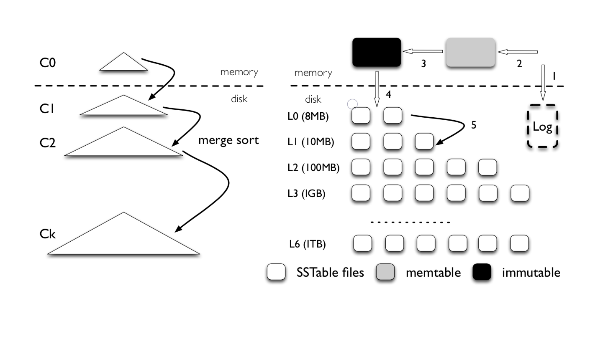


LSM Tree中的$C_0$树存放在内存中，而$C_1∼C_k $则存放在磁盘上。

对于不频繁访问的数据，不断地从$C_0$向$C_k$移动。

$C_i$有大小限制，数据溢出后，将数据归并到$C_{i+1}$中。

**Five Minute Rule**

​		Jim Gray，Gianfranco Putzolu：对于随机访问频率不少于每五分钟一次的页面应该被缓存。（五分钟只是一个意会，基于当时的内存与磁盘的成本）


### 包含两个树结构的LSM-Tree

[^]: LSM-Tree可以包含两个或者是更多的树结构（下面以两个树结构为例）

因为$C_0$树是在内存中的。不一定要使用B树结构；（平衡二叉树也是可以的）

$C_1$是放在磁盘中的，选择合适结构并优化。

$C_1$树相比于B树，对连续的I/O操作进行了优化。

在$C_1$ 树的每一层中，邻近的节点在磁盘上的位置也是相邻的。


### 滚动合并(rolling merge)

当一条日志被写入后，该条日志记录的索引项被插入到$C_0$树中，如果$C_0$树大小超过了阈值：会进行一个滚动合并(rolling merge)的过程。

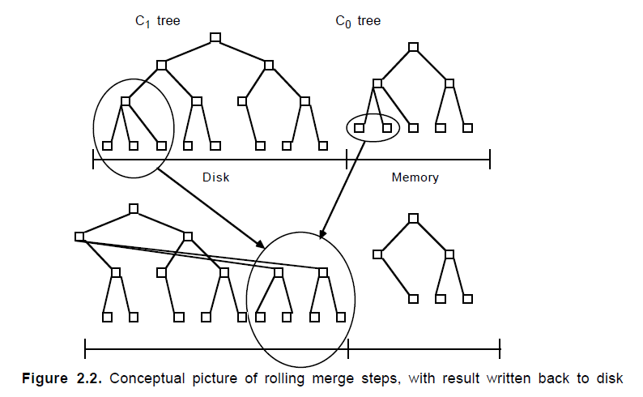

先读取C~1~树最底层的索引项，（这个缓存了多个页面索引项的合并区块称为empty block）。每次合并操作从已读取的多个索引项中取一个磁盘页面索引项，和C~0~中读取的一个最底层索引项合并；合并操作之后新生成的节点首先被写入到一个称为filling block的缓冲区。当filling block填充满了之后，所缓冲的C~1~的新的叶子节点被写入到磁盘上的空闲区域。

注：这样，合并前的block并没有被覆盖掉，可用于故障恢复；合并过程中也会保存检查点，将缓存的信息强制写入到磁盘上。

### 查

​		数据是按新旧程度存在于C~0~ ~ C~i~，查操作从C~0~开始...**（查找了多个树，相比于B-tree更耗时)**。由于C~0~在内存中，这保证了最近一段时间内插入的数据无需查找到磁盘。

### 删

​		与前面的插入操作类似，对于LSM树的删除操作也可以采用延迟与批量化的方式来进行优化。可将删除操作推迟到要merge的时候再执行。**//中途非要查询即将被删除的数据怎么办？**


​		还有两种比较高效的索引修改的方式。一种是预测删除通过简单的预测假设来进行批量化的删除操作。比如假设超过20天的索引项在merge时会被删除；另外一种是长延时查询，这种方式将查询项(find note entry)插入到C~0~树中，之后它会在C~i~ 与C~i+1~迁移的过程中做查询操作，直到当这个查询项被迁移到包含相关索引项的最大的C~i~ 时结束。**//长延时查询？**


### 包含多个树的LSM-tree

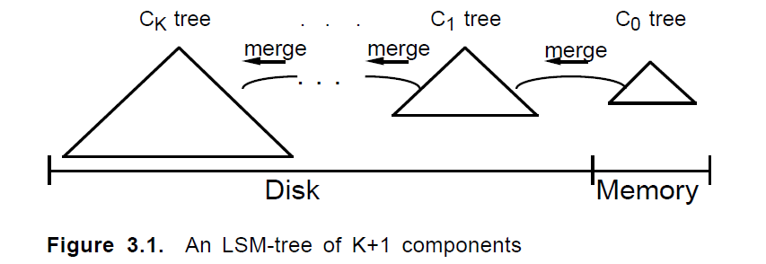

#### I/O效率

文章证明了：i个tree的LSM的I/O代价比B-tree更小。

#### 并行时可能出现的三种冲突：

- 一个实际存储在DISK中的节点的查询操作，与涉及该节点的滚动合并不能并行执行。
- 针对C~0~的查找、插入操作不能与C~0~、C~1~的合并并行执行（同上）。
- 小编号C~i~间的合并频率更高，相邻的滚动合并有数据重叠，会发生阻塞，冲突。

在LSM中，以节点作为加锁的最小单元。分别有写模式锁，读模式锁。

在滚动合并过程中，C~i~中将要插入的新节点会首先放到一个多页面块(multi-page block)缓冲区中，并且按照从左到右的顺序放置。对于C~i~中指向的节点会在内存中被分成两个多页面块缓冲区，其中"emptying block"中是合并游标尚未到达的区域，而"filling block"中是已经进行合并操作的位置。在某些情况下，可能并不想C~i-1~ 中所有的索引项全部合并到C~i~ 

对于C~i-1~，同样按照当前游标的位置，将缓冲区划分为"emptying block"——游标尚未到达的地方以及"filling block"——目前为止已经合并的地方。在滚动合并的过程中，将会对以上四个block全部加上写锁。当C~i~的"emptying block"用尽的时候释放锁。


****

[1] [Finding a needle in Haystack: Facebook’s photo storage](https://www.usenix.org/legacy/event/osdi10/tech/full_papers/Beaver.pdf)

[2] [DistCache: Provable Load Balancing for Large-Scale Storage Systems with Distributed Caching](https://www.usenix.org/conference/fast19/presentation/liu)

[3] [The Log-Structured Merge-Tree (LSM-Tree)](https://www.cs.umb.edu/~poneil/lsmtree.pdf)

[4] [The SB-tree: An index-sequential structure for high-performance sequential access](http://citeseerx.ist.psu.edu/viewdoc/download?doi=10.1.1.55.9482&rep=rep1&type=pdf)


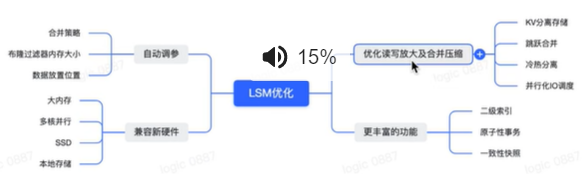


# LevelDB

2022年7月1日10:19:09

## 一个小demo

环境：wsl2

```bash
git clone --recurse-submodules https://github.com/google/leveldb.git
mkdir -p build && cd build
cmake -DCMAKE_BUILD_TYPE=Release .. && cmake --build .
```

make以后会在build目录生成一个**静态库**libleveldb.a

```bash
#将include下的leveldb目录拷贝到/usr/include/下：
cp -r include/leveldb /usr/include/
#将之前编译好的libleveldb.a
cp build/libleveldb.a /usr/include/
#然后
g++ -o leveldbtest m.cpp libleveldb.a -lpthread
```

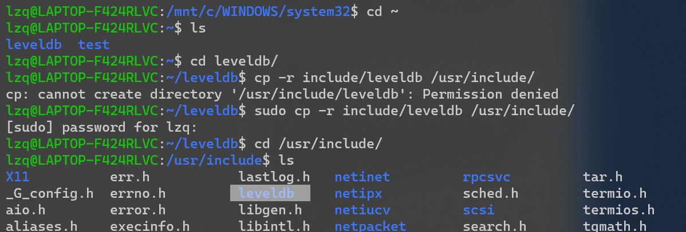

```c++
#include "leveldb/db.h"
#include <cassert>
#include <iostream>

using namespace std;
using namespace leveldb;

int main()
{
    leveldb::DB *db;
    leveldb::Options options;
    options.create_if_missing = true;
    leveldb::Status status = leveldb::DB::Open(options, "testdb", &db);
    assert(status.ok());
    status = db->Put(WriteOptions(), "lzq", "Hello LevelDB");
    assert(status.ok());
    string res;
    status = db->Get(ReadOptions(), "lzq", &res);
    assert(status.ok());
    cout << res << endl;

    delete db;
    return 0;
```

运行结果:

```shell
lzq@LAPTOP-F424RLVC:~/leveldb/benchmarks$ ./mytest
Hello LevelDB
lzq@LAPTOP-F424RLVC:~/leveldb/benchmarks$ ls
db_bench.cc      db_bench_sqlite3.cc  libleveldb.a  mytest.cpp
db_bench_log.cc  db_bench_tree_db.cc  mytest        testdb
```


### 安装Google test

```
git clone https://github.com/google/googletest.git -b release-1.12.0
cd googletest        # Main directory of the cloned repository.
mkdir build          # Create a directory to hold the build output.
cd build
cmake ..             # Generate native build scripts for GoogleTest.

make
sudo make install    # Install in /usr/local/ by default
```


```c++
#include<gtest/gtest.h>
  int add(int a,int b){
    return a+b;
  }
  TEST(testCase, test0){
    EXPECT_EQ(add(2,3),5);
  }
  int main(int argc, char **argv){
    testing::InitGoogleTest(&argc,argv);
    return RUN_ALL_TESTS();
  }
```

测试安装：

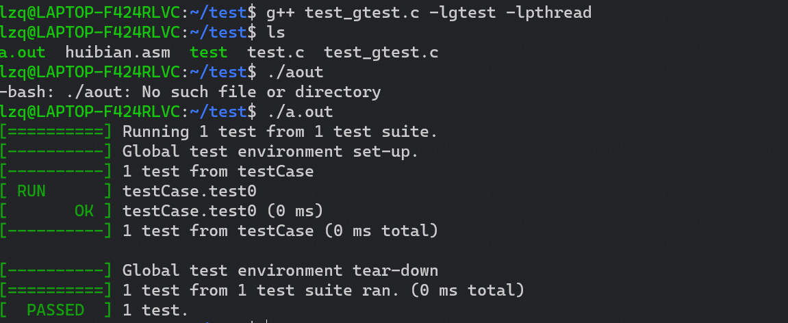


> 跳表skiplist

## 大致读写流程

### 写入流程

1. 写入位于磁盘中的WAL（Write Ahead Log）里。
2. 写入`memtable`。
3. 当大小达到一定阈值后，原有的`memtable`冻结变成`immutable`。后续的写入交接给新的`memtable`和WAL。
4. 后台开启Compaction线程，开始将`immutable`落库变成一个L0层的`SSTable`，写入成功后释放掉以前的WAL。
5. 若插入新的`SSTable`后，当前层（`Li`）的总文件大小超出了阈值，会从`Li`中挑选出一个文件，和`Li+1`层的重叠文件继续合并，直到所有层的大小都小于阈值。合并过程中，会保证`L1`以后，各`SSTable`的Key不重叠。

### 读取流程

> 注，这里每个步骤的命名后面介绍Bourbon的时候还会用到。

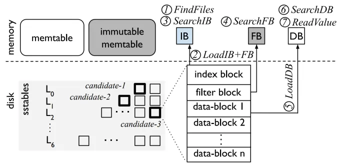

如果`Key`在`memtable`中，那么直接读取返回；否则自上而下地读取SST，其流程如下：

1. `FindFiles`。从SST文件中查找，如果在 L0，那么每个文件都得读，因为 L0 不保证Key不重叠；如果在更深的层，那么Key保证不重叠，每层只需要读一个 SST 文件即可。L1 开始，每层可以在内存中维护一个 SST的有序区间索引，在索引上二分查找即可
2. `LoadIB + FB`。IB 和 FB 分别是 `index block` 和 `filter block` 的缩写。`index block`是SST内部划分出的block的索引；`filter block` 则是一个布隆过滤器（Bloom Filter），可以快速排除 `Key` 不在的情况，因此首先加载这两个结构
3. `SearchIB`。二分查找 `index block`，找到对应的`block`
4. `SearchFB`。用布隆过滤器过滤，如果没有，则返回
5. `LoadDB`。则把这个`block`加载到内存
6. `SearchDB`。在这个`block`中继续二分查找
7. `ReadValue`。找到 `Key`后读数据，如果考虑 WiscKey KV分离的情况，还需要去 vLog 中读取

https://zhuanlan.zhihu.com/p/389397486

## 大致结构

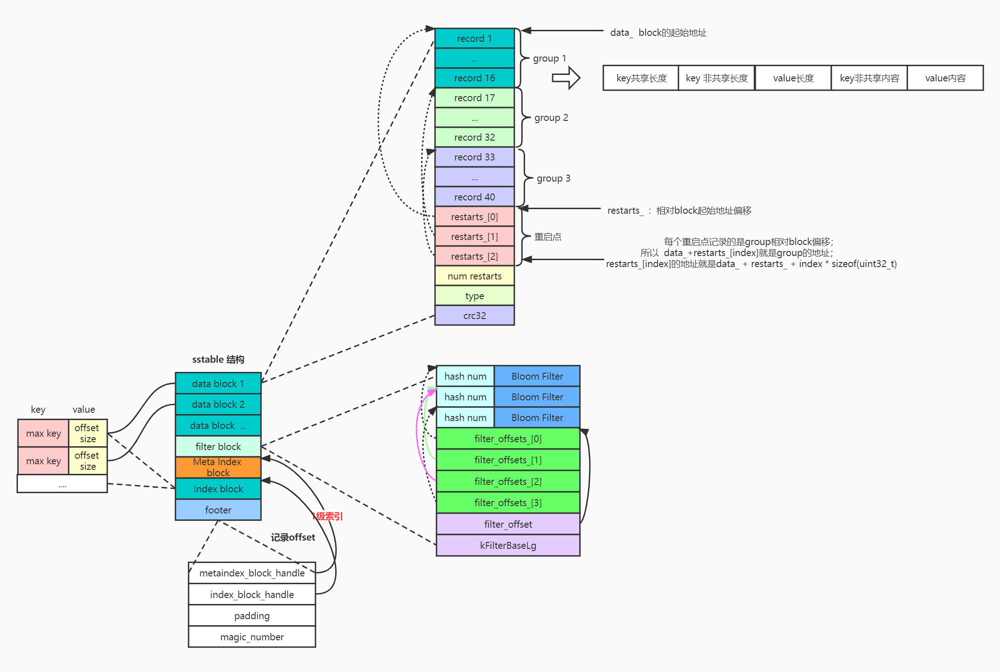

TODO:图片待完善

- MemTable：常驻内存的 C~0~树，本质是skiplist跳表。默认阈值是4MB，写满时变成只读的Immutable MEMTable。
- Immutable MemTable：只读的MemTable后台的Compaction线程会将Immutable MemTable中的内容，创建一个SSTable文件，持久化到该磁盘文件中。
- log文件


- SSTable（sorted string ）：

  - SSTable文件来保存只读的Immutable MEMTable， 它是key有序的，可以二分查找；
  - 但是，**内存中的Immutable MemTable存储的Key数据是有重复的，有重叠的//？**需要有一个额外的线程定期地来整理这些SSTable文件，使之没有重叠，并且减少文件个数目，从而减少磁盘IO的次数，这样才能用二分查找，这个额外的线程就是Compaction压缩线程；所有的SSTable文件本身是不可修改的，Compaction压缩线程会把多个SSTable文件归并后产生新的SSTable文件，并删除旧的SSTable文件。

- Manifest：LevelDB中有版本Version的概念，一个版本Version主要记录了每一层Level中所有文件的元数据Metadata，Metadata主要信息包含：文件号、文件大小、最大的Key和最小的Key等。每次压缩Compaction完成（产生新的SST），LevelDB都会创建又给新的Version，newVersion=oldVersion+VersionEdit，Manifest文件就是用来记录这些VersionEdit信息的。一个VersionEdit信息会被编码成一条Record记录，写入Manifest文件，每条记录包括：

  - 1）新增哪些SSTable文件；

  - 2）删除哪些SSTable文件；

  - 3）当前Compaction的指针下标；

  - 4）日志文件编号；

  - 5）操作SequenceNumber等信息。

  通过这些信息LevelDB在启动时便可以基于一个空的Version，不断地Apply这些记录，最终得到一个上次运行结束时的版本信息。

- Current文件：这个文件中只有一个信息，就是记录当前的Manifest文件名。

  因为每次LevelDB启动时，都会创建一个	新的Manifest文件。因此数据目录可能会存在多个Manifest文件。Current则用来指出哪个Manifest文件才是我们关心的那个Manifest文件。

- **Compaction压缩：**LSM-Tree中有两种压缩策略Size-Tiered Compaction Strategy和Leveled Compaction Strategy。LevelDB采用的是Leveled Compaction Strategy。


实际生成的数据库文件

- LogFile	.log
- TableFile   .ldb
- SSTTableFile  .sst
- ManiFest         MANIFEST-%06llu
- 运行日志    LOG


源码目录结构

- db/, 数据库逻辑
- doc/, MD文档
- helpers/, LevelDB内存版, 通过namespace覆盖
- port/, 平台相关代码
- table/, LSM有关的


memtable -> skiplist -> arena


## include

### Slice

切片是一种简单的结构，包含指向某个外部存储器的指针和大小。

```c++
// Multiple threads can invoke const methods on a Slice without
// external synchronization, but if any of the threads may call a
// non-const method, all threads accessing the same Slice must use
// external synchronization.
```

### FilterPolicy 

### Status

记录每步操作后的code和msg


## util

### Arena

`util/arena.cc`

一次性内存池，主要用于Memtable这种不断增加空间、空间满了之后一并存入SST的场景，因此它也是不支持手动调用Delete操作，由析构函数一起调用。

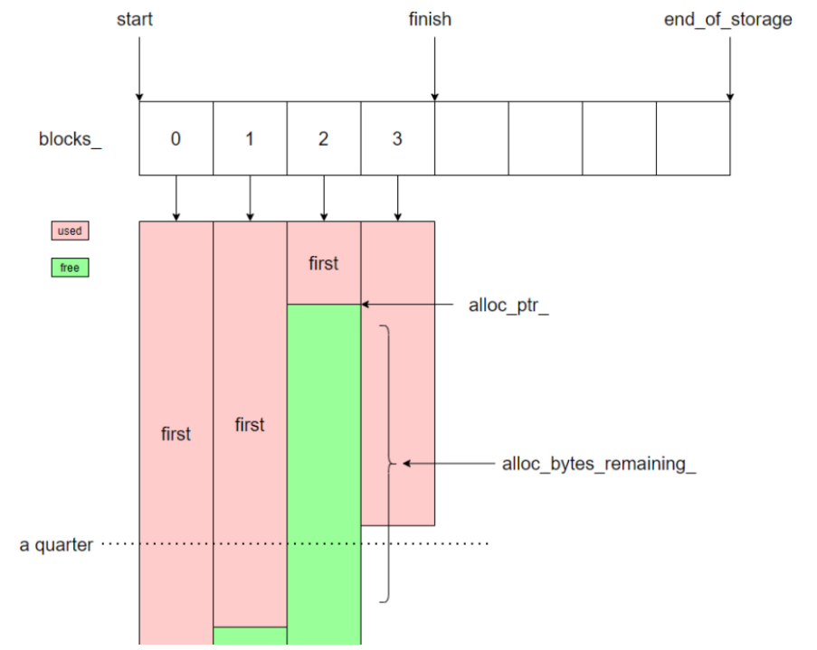

kBlockSize = 4096 //arena的基本分配单位，默认4MB，4等分。


#### MemoryUsage 

只增不减

//原子操作?

#### Allocate

```c++
inline char* Arena::Allocate(size_t bytes) {
  // The semantics of what to return are a bit messy if we allow
  // 0-byte allocations, so we disallow them here (we don't need
  // them for our internal use).
  assert(bytes > 0);
  if (bytes <= alloc_bytes_remaining_) {
    char* result = alloc_ptr_;
    alloc_ptr_ += bytes;
    alloc_bytes_remaining_ -= bytes;
    return result;
  }
  return AllocateFallback(bytes);
}
```

### AllocateFallback

如果小于1KB，就分配一块4KB大小的内存；如果大于1KB，就按bytes值分配大小；避免一次性申请大量内存造成浪费。

### Cache

`util/cache.cc`

1. Block cache：缓存解压后的 data block，可以加快热数据的查询。
2. Table cache：缓存打开的 SSTable 文件描述符和对应的 index block、meta block 等信息。

在 LevelDB 中，block cache 和 table cache 都是基于 **[ShardedLRUCache](https://link.zhihu.com/?target=https%3A//github.com/google/leveldb/blob/1.22/util/cache.cc%23L338)** 实现的。

>**ShardedLRUCache**

**[ShardedLRUCache](https://link.zhihu.com/?target=https%3A//github.com/google/leveldb/blob/1.22/util/cache.cc%23L338)** 是在 **[LRUCache](https://link.zhihu.com/?target=https%3A//github.com/google/leveldb/blob/1.22/util/cache.cc%23L150)** 上包装了一层分片——根据 key 的哈希值的前 4 位（**[kNumShardBits](https://link.zhihu.com/?target=https%3A//github.com/google/leveldb/blob/1.22/util/cache.cc%23L335)**）分 16 个（**[kNumShards](https://link.zhihu.com/?target=https%3A//github.com/google/leveldb/blob/1.22/util/cache.cc%23L336)**） LRUCache。

分片的作用是减少多线程对同一个 LRUCache 对象的争用。

1. **[链表 lru_](https://link.zhihu.com/?target=https%3A//github.com/google/leveldb/blob/1.22/util/cache.cc%23L188)**：维护 cache 中的缓存对象的使用热度。数据每次被访问的时候，都会被插入到这个链表最新的地方。 lru_->next 指向最旧的数据， lru_->prev 指向最新的数据。当 cache 占用的内存超过限制时，则从 lru_->next 开始清理数据。
2. **[链表 in_use_](https://link.zhihu.com/?target=https%3A//github.com/google/leveldb/blob/1.22/util/cache.cc%23L192)**：维护 cache 中有哪些缓存对象被返回给调用端使用。这些数据不能被淘汰。
3. **[哈希表 table_](https://link.zhihu.com/?target=https%3A//github.com/google/leveldb/blob/1.22/util/cache.cc%23L194)**：保存所有 key -> 缓存对象，用于快速查找数据。

那么，Lookup和Insert都是O（1）

HandleTable类下3个接口：

- Lookup

- Insert     

  //如果超过了list_的值，会调用Resize()，进行重新哈希（rehash）。直接扫描整个哈希表进行全量 rehash

- Remove


## db/log

### logformat

- 切割成以32KB为单位的物理Block，作为读取单位。
- 每一条记录record分为4种type

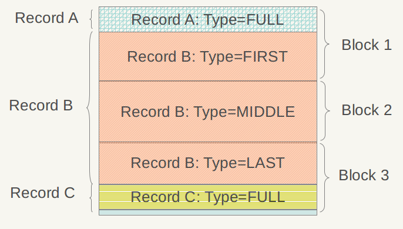
注：此key无序。

`/db/logformat.h`

```c++
namespace leveldb {
namespace log {

enum RecordType {
  // Zero is reserved for preallocated files
  kZeroType = 0,

  kFullType = 1,

  // For fragments
  kFirstType = 2,
  kMiddleType = 3,
  kLastType = 4
};
static const int kMaxRecordType = kLastType;

static const int kBlockSize = 32768;

// Header is checksum (4 bytes), length (2 bytes), type (1 byte).
static const int kHeaderSize = 4 + 2 + 1;

}  // namespace log
}  // namespace leveldb
```


## Table

- \table\block_builder：公共前缀压缩，"restart point"

- \format.h、\format.cc

  - BlockHandle：指向data/meta  block的指针，包含offset和size 

    - EncodeTo
    - DecodeFrom                                 

  - Footer：两个BlockHandle

    - metaindex_handle_ 
    - index_handle_

  - BlockContents

    ```c++
    struct BlockContents {
     Slice data;      // Actual contents of data
     bool cachable;    // True iff data can be cached
     bool heap_allocated; // True iff caller should delete[] data.data()
    };
    ```

  另外在\format.cc中实现了EncodeTo，DecodeFrom，ReadBlock

  


SST物理结构

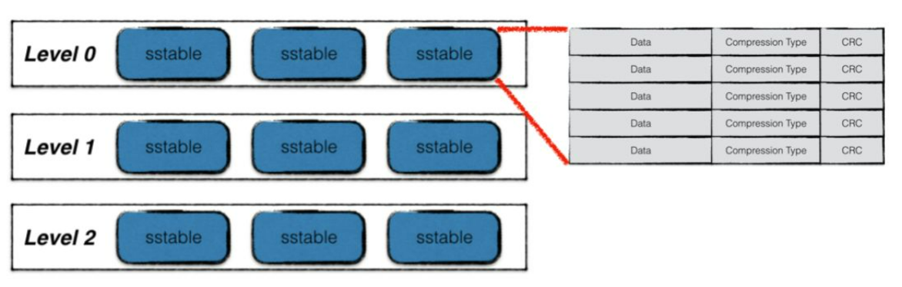

Type用于标识数据存储区是否采用了数据压缩算法（Snappy压缩或者无压缩两种）


SST的逻辑结构:

存在于上图对应的物理data区中。

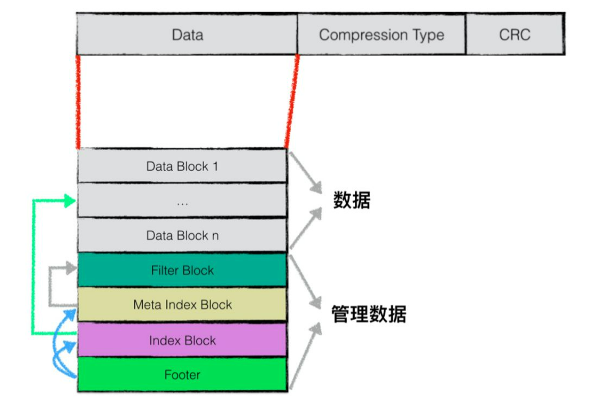

//也就是说：每个SST文件，前面的若干块存K-V数据，后面跟着Filter block，Meta block，Meta block Index，Index block,和尾部块Footer

- data block，kv 数据对
- index block，data block 索引
- filter block，布隆过滤器
- meta index blocck，filter block 索引
- footer，整个 block 的索引信息


### Data block

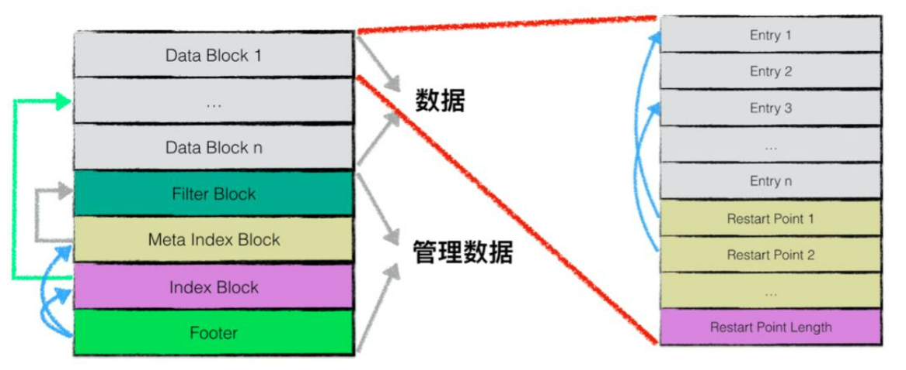

每个Data block存放若干个条目entry（一个条目=一对K-V）

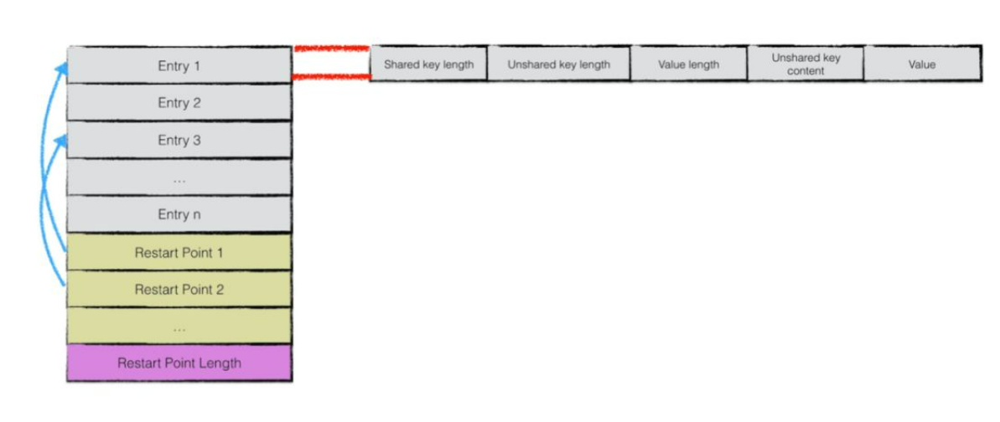

entry中key的存储采用了前缀共享进行压缩					//参见`\table\block_builder`


一个 entry 的字段：

- 和前一个 entry 共享 key 长度
- 不共享 key 长度
- value 长度
- 不共享 key 内容
- value 内容


### Index block ：

第一个字段的Key要求大于等于Data block_i中的最大Key，小于等于block_i+1中的最小Key；

第二个字段是块的首地址；第三个字段是块大小。

可以在读取SST时快速定位到Key

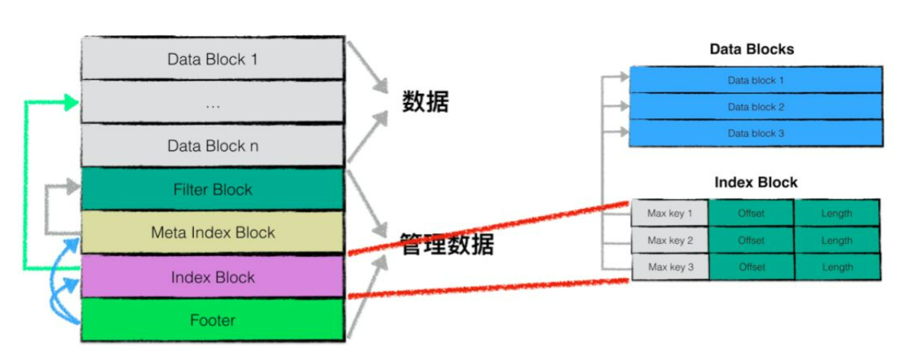


### Filter block

> 布隆过滤器：判断一定不存在或可能存在。
>
> https://zhuanlan.zhihu.com/p/348332384
>
> https://blog.csdn.net/qq_41125219/article/details/119982158

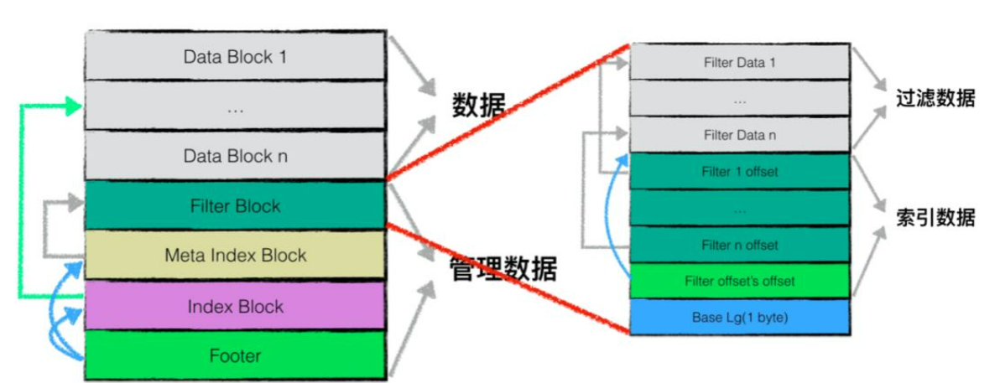

`/table/Filter.h`

- FilterBlockBuilder
- FilterBlockReader


`/db/db_impl.cc`

- env_对接操作系统的接口
- internal_comparator_, 用来比较不同key的大小
- internal_filter_policy_, 可自定义BloomFilter
- options_, 将调用者传入的options再用一个函数调整下, 可见Google程序员也不是尽善尽美的... 库的作者要帮忙去除错误参数和优化...
- db_lock_, 文件锁
- shutting_down_, 基于memory barrier的原子指针
- bg_cv_, 多线程的条件
- mem_ = memtable, imm = immemtable
- tmp_batch_, 所有Put都是以batch写入, 这里建立个临时的
- manual_compaction_, 内部开发者调用时的魔法参数, 可以不用理会//?


从open开始，看db_impl.cc


## Snapshot

snapshot是一个unsinged long long (SequenceNumber)

具体实现是在 **[leveldb::SnapshotImpl](https://github.com/google/leveldb/blob/1.22/db/snapshot.h#L17-L37)** ，只读取小于等于 sequence_number_ 的数据。

## Version

`db/version_set.h`

version包括：

  FileMetaData* seek_file;

  int seek_file_level;


### version_set

一个双向链表

```c++
  Env* const env_;
  const std::string dbname_;
  const Options* const options_;
  TableCache* const table_cache_;
  const InternalKeyComparator icmp_;
  uint64_t next_file_number_;
  uint64_t manifest_file_number_;
  uint64_t last_sequence_;
  uint64_t log_number_;
  uint64_t prev_log_number_;  // 0 or backing store for memtable being compacted


  WritableFile* descriptor_file_;//manifest文件的写描述符
  log::Writer* descriptor_log_;//manifest文件的日志包装形式
  Version dummy_versions_;  //versions双向链表head
  Version* current_;        // == dummy_versions_.prev_，当前最新的version
  //每层都有一个compact pointer用于指示下次从哪里开始compact,以用于实现循环compact
  std::string compact_pointer_[config::kNumLevels];
```

### version_set::get


## Mutex

`port/port_stdcxx.h`


## db/db_impl：

DBImpl::DBImpl(const Options& *raw_options*, const std::string& *dbname*)

- env_	include/leveldb/env.h	

  Env是leveldb imp 用来访问操作系统功能的接口，如文件系统等。 调用者可能希望在打开数据库时提供一个自定义的Env对象以获得精细的控制；例如，限制文件系统的操作。所有的Env实现对于来自多个线程的并发访问是安全的，无需任何外部同步。

- internal_comparator_		key的比较器

- internal_filter_policy_     布隆过滤器自定义过滤策略(dbformat.h中的InternalFilterPolicy类)

- options_   将调用者传入的options再用一个SanitizeOptions净化函数调整下

  - owns_info_log_
  - owns_cache_

- dbname_    *dbname*

以上内容在db建立以后都是const


- table_cache_   /db/tablecache.h : 

  返回一个指定文件号的迭代器（相应的文件长度必须正好是 "file_size" 字节）。

- db_lock_(nullptr)  

  文件锁         锁定持久的DB状态。 如果成功获得，则为非空。

- shutting_down_(false)               

  基于memory barrier的原子指针 ？？？ 

- background_work_finished_signal_    = &mutex_

- mem_:         /db/memtable.h

- imm_:          写满的memtable，GUARDED_BY(mutex_)

- has_imm_:    给背景线程判断是否有 imm (原子bool)

- logfile_：  

  /include/leveldb/env.h      

  WritableFile 一个用于顺序写入的文件的抽象。

- logfile_number_：

  uint64_t型，GUARDED_BY(mutex_）

- log_(nullptr)：

  /db/log_writer.h     Writer 

  创建一个写入器，将数据追加到 "*dest"(WritableFile)

  

- seed_(0)       用于取样？？？

- tmp_batch_   new WriteBatch

- background_compaction_scheduled_ 

  是否有  background compaction 安排,或正在运行

- versions_        new VersionSet


### Open操作

```c++
DB::~DB() = default;

Status DB::Open(const Options& options, const std::string& dbname, DB** dbptr) {
  *dbptr = nullptr;

  DBImpl* impl = new DBImpl(options, dbname);
  impl->mutex_.Lock();                            //?恢复数据,上锁,禁用可能的后台任务
  VersionEdit edit;
  // Recover handles create_if_missing, error_if_exists
  bool save_manifest = false;
  Status s = impl->Recover(&edit, &save_manifest);//?读取log恢复状态
  if (s.ok() && impl->mem_ == nullptr) {
    // Create new log and a corresponding memtable.
    uint64_t new_log_number = impl->versions_->NewFileNumber();
    WritableFile* lfile;
    s = options.env->NewWritableFile(LogFileName(dbname, new_log_number),
                                     &lfile);     //?创建新的日志文件
    if (s.ok()) {                                 //?准备新的log file和memTable
      edit.SetLogNumber(new_log_number);
      impl->logfile_ = lfile;
      impl->logfile_number_ = new_log_number;
      impl->log_ = new log::Writer(lfile);
      impl->mem_ = new MemTable(impl->internal_comparator_);
      impl->mem_->Ref();                          //?memtable的指针++
    }
  }
  if (s.ok() && save_manifest) {
    edit.SetPrevLogNumber(0);  // No older logs needed after recovery.
    edit.SetLogNumber(impl->logfile_number_);
    s = impl->versions_->LogAndApply(&edit, &impl->mutex_);
  }
  if (s.ok()) {                                   //!
    impl->RemoveObsoleteFiles();                  //?清理无用的文件夹
    impl->MaybeScheduleCompaction();              //?有写入可能会Compaction
  }
  impl->mutex_.Unlock();
  if (s.ok()) {
    assert(impl->mem_ != nullptr);
    *dbptr = impl;
  } else {
    delete impl;
  }
  return s;
}	
```


### Get操作

```c++
Status DBImpl::Get(const ReadOptions& options, const Slice& key,
                   std::string* value) {
  Status s;
  MutexLock l(&mutex_);                  
  SequenceNumber snapshot;                //? 怎么是个usigned long long 
  if (options.snapshot != nullptr) {
    snapshot =
        static_cast<const SnapshotImpl*>(options.snapshot)->sequence_number();
  } else {
    snapshot = versions_->LastSequence();
  }

  MemTable* mem = mem_;
  MemTable* imm = imm_;
  Version* current = versions_->current();
  mem->Ref();
  if (imm != nullptr) imm->Ref();
  current->Ref();

  bool have_stat_update = false;
  Version::GetStats stats;
```

以上代码在锁的保护下完成了两件事:

1. 生成一个SequenceNumber作为标记, 后续不管线程会不会被切出去, 结果都要相当于在这个时间点瞬间完成  //?
2. memtable, immemtable, Version, 由于采用了引用计数, 这里Ref()一下 //Ref(){ ref++ }

建立了快照，开始读，可以暂时把锁释放：

```c++
  {//建立了快照,开始读,把锁释放
    mutex_.Unlock();
    // First look in the memtable, then in the immutable memtable (if any).
    LookupKey lkey(key, snapshot);//!key->lkey 加工,比如计算size利于比较 
    if (mem->Get(lkey, value, &s)) {//先查memtable
      // Done
    } else if (imm != nullptr && imm->Get(lkey, value, &s)) {//再查immtable
      // Done
    } else {//mem，imm都没查到，调用Version::Get查
      s = current->Get(options, lkey, value, &stats);
      have_stat_update = true;
    }
    mutex_.Lock();
  }

  if (have_stat_update && current->UpdateStats(stats)) {
    MaybeScheduleCompaction();
  }
  mem->Unref();
  if (imm != nullptr) imm->Unref();
  current->Unref();
  return s;
}
```


#### LookupKey

`db/dbformat.h`

一个特别的技巧。对key加工

**LookupKey的格式:**

lkey = 长度(varint) + key + SequenceNumber + type 

官方注释里管 SequenceNumber + type 叫tag:

```
  // We construct a char array of the form:
  //    klength  varint32               <-- start_
  //    userkey  char[klength]          <-- kstart_
  //    tag      uint64
  //                                    <-- end_
  // The array is a suitable MemTable key.
  // The suffix starting with "userkey" can be used as an InternalKey.
```


```c++
LookupKey::LookupKey(const Slice& user_key, SequenceNumber s) {
  size_t usize = user_key.size();
  size_t needed = usize + 13;  // A conservative estimate    
  //+13: 5Byte(varint最糟糕情况要多花1Byte) + 8Byte(Tag)
  char* dst;
  //在栈上先分配一个200长度的数组, 如果运行时发现长度不够用再从堆上new一个, 可以极大避免内存分配
  if (needed <= sizeof(space_)) {
    dst = space_;
  } else {
    dst = new char[needed];
  }
  //LookupKey格式 = 长度(varint结构压缩) + key + {SequenceNumber + type}(Tag)
  dst = EncodeVarint32(dst, usize + 8);                     //+8是算上了后续Tag字段的长度
  kstart_ = dst;
  std::memcpy(dst, user_key.data(), usize);                 
  dst += usize;
  EncodeFixed64(dst, PackSequenceAndType(s, kValueTypeForSeek));
  dst += 8;
  end_ = dst;
}
```


#### 在SSTable中查K-V

详见`db/version_set.cc`

```c++
Status Version::Get(const ReadOptions& options, const LookupKey& k,
                    std::string* value, GetStats* stats) {
  stats->seek_file = nullptr;
  stats->seek_file_level = -1;//?

  struct State {
    Saver saver;
    GetStats* stats;
    const ReadOptions* options;
    Slice ikey;
    FileMetaData* last_file_read;
    int last_file_read_level;

    VersionSet* vset;
    Status s;
    bool found;
        static bool Match(void* arg, int level, FileMetaData* f) {...
    };
  //把各种参数组织成state,赋值：
  State state;
  state.found = false;
  state.stats = stats;
  state.last_file_read = nullptr;
  state.last_file_read_level = -1;

  state.options = &options;
  state.ikey = k.internal_key();
  state.vset = vset_;

  state.saver.state = kNotFound;
  state.saver.ucmp = vset_->icmp_.user_comparator();
  state.saver.user_key = k.user_key();
  state.saver.value = value;
  //把参数都组成State传给查找函数
  ForEachOverlapping(state.saver.user_key, state.ikey, &state, &State::Match);

  return state.found ? state.s : Status::NotFound(Slice());
}
```

**ForEachOverlapping**

`db/version_set.cc`

对于Level-0，遍历，找出所有可能包含lkey的SST。再循环作Match（State::Match 会调用CacheTab::GET 并把最终Value存入Saver)

对于其他Level，调用FindFile二分查找定位到SST，再Match。

> 关于bool型：如果没查到，do nothing ；这样真的安全吗？为什么不 State.found = false 一下。


```c++
void Version::ForEachOverlapping(Slice user_key, Slice internal_key, void* arg,
                                 bool (*func)(void*, int, FileMetaData*)) {
  const Comparator* ucmp = vset_->icmp_.user_comparator();
  //?把参数组织成state传给了arg，为什么还从外部的vset_获取?
  
  // Search level-0 in order from newest to oldest.
  // 查level0
  //level0中每个SST的范围可能是相交的,遍历level0所有SST,凡是smallest<user_key()<largest统统追加到vertor tmp
  std::vector<FileMetaData*> tmp;
  tmp.reserve(files_[0].size());
  for (uint32_t i = 0; i < files_[0].size(); i++) {
    FileMetaData* f = files_[0][i];
    if (ucmp->Compare(user_key, f->smallest.user_key()) >= 0 &&
        ucmp->Compare(user_key, f->largest.user_key()) <= 0) {
      tmp.push_back(f);
    }
  }
  //tmp中的SST按新旧排序 Match了就退出
  if (!tmp.empty()) {
    std::sort(tmp.begin(), tmp.end(), NewestFirst);
    for (uint32_t i = 0; i < tmp.size(); i++) {
      if (!(*func)(arg, 0, tmp[i])) {
        return;
      }
    }
  }

  // Search other levels.
  // 其他levels有序,可二分查找.
  for (int level = 1; level < config::kNumLevels; level++) {
    size_t num_files = files_[level].size();
    if (num_files == 0) continue;

    // Binary search to find earliest index whose largest key >= internal_key.
    uint32_t index = FindFile(vset_->icmp_, files_[level], internal_key);
    if (index < num_files) {
      FileMetaData* f = files_[level][index];
      if (ucmp->Compare(user_key, f->smallest.user_key()) < 0) {
        // All of "f" is past any data for user_key
      } else {
        if (!(*func)(arg, level, f)) {
          return;
        }
      }
    }
  }
}
```

所以，定位到Table（ smallest< key <largeset）以后，最终是怎么Get到具体的value的？

通过State结构内的Match，调用TableCache::Get

`db/table_cache.cc`

- TableCache :: Get //TableCache的对外接口
  - FindTable
    - 主体是\*handle = cache_->Lookup(key);          
    - 如果CacheMiss     先NewRandomAccessFile open文件，再cache_->Insert插入Cache，返回*handle
    - Lookup和Insert操作是在`/util/cache.cc`实现的。并且涉及hash函数
  - InternalGet
    - 


涉及到Cache的设计，转去看Cache


### 写入磁盘

Immutable MemTable ->sst 具体如何持久化

- 写入 Immutable MemTable 之后开启 minor compact，写入 L0 层，并开启异步删 log
- 便利 skiplist 过程中发现删除标记的 key，则直接跳过
- 如果 L0 文件超过 4 个，触发 major compact（异步）
- major compact 从当前层选出一块 sst 合并到下一层，如果下一层满了，则重复执行操作，直到写入最后一层

Log：最大 4MB (可配置), 会写入 Level 0；

Level 0：最多 4 个 SST 文件；

Level 1：总大小不超过 10MB；

Level 2：总大小不超过 100MB；

Level 3+：总大小不超过上一个 Level ×10 的大小

比如：0 ↠ 4 SST, 1 ↠ 10M, 2 ↠ 100M, 3 ↠ 1G, 4 ↠ 10G, 5 ↠ 100G, 6 ↠ 1T, 7 ↠ 10T

## 读取操作

读取操作相比写入要简单一点，过程如下

- 读 MemTable 和 Immutable MemTable，如果找到则返回

- 读 cache（如果有），找到则返回

- 读 manifest，大致找到 key 在哪一层

- 遍历每一层的 sst，读 filter block、index block，判断是否存在当前 sst 中，如果找到则返回，否则读下一层

  

### reinterpret_cast 转换

通过重新解释底层位模式在类型间转换。


# 先天缺陷

## 读写放大

**SSD中闪存特性**

GC垃圾回收// Garbage Collection

​		操作系统当删除一个数据时，不会立即删除，而是做一个删除标记。当机械硬盘要写入新数据时可以直接覆盖那些已经被标记“删”标签的数据；而固态硬盘不行，只能先擦除旧的数据才能写入新数据，而NAND闪存工作原理是以4K页（page）为一个单元写入的，但擦除只能以块block（64个page）为单位，如果一个块block上有32个page有效数据和32个被标记“删”标签的无效数据，那要在这个块block上重新写入数据，那必须要擦除整个块block，那还有一半有效数据怎么办了？那只有把那32page的有效数据就要搬到另一个有空位置的块block中，这就是GC垃圾回收技术。“搬迁”过程中，多的写入次数叫写放大。


**RAID中的Read-Modify-Write造成的写放大**

RAID中更新一个块，需要额外读原始块、校验块，额外写校验块，所以多了两个读，一个写。

根据异或特性：新校验块=新数据块 ^ 旧校验块 ^ 旧数据块。

**写放大（Write amplification）**

假设`Li`的大小是`Li-1`的10倍。当把`Li-1`中的一个文件合并到`Li`中时，最坏情况下，LevelDB 需要从`Li`中读取10个文件，归并排序后再将他们写回到`Li`中去。这个时候的写放大是10。

对于一个很大的数据集，源源不断生成的 SST 文件可能会导致 L0-L6 中相邻层之间，不断发生合并操作，这个时候的写放大就是50（`L1-L6`中每一层是10）。


**读放大（Read amplification）**

读放大主要来源于多层查找、SSTable元数据两方面。

1. **多层查找**

查找一个Key-Value时，LevelDB 可能需要在多个层中去查找。最坏情况下，LevelDB 在`L0`中需要查找8个文件，在`L1-L6` 每层中需要查找1个文件，共计14个文件。

**2. SSTable元数据**

在SSTable 文件中查找一个Key-Value时，LevelDB 需要读取该文件的多个元数据块。所以实际读取的数据量应该是：`index block + bloom-filter blocks + data block`。

例如，当查找 1KB 的Key-Value时，LevelDB 需要读取 16KB 的 index block，4KB的 bloom-filter block 和 4KB 的 data block，总共 24 KB 的数据。最差的情况下，需要读取 14 个 SSTable 文件，所以这个时候的读放大就是 `24*14=336`。更小的 Key-Value 会带来更高的读放大。


# 其他

## 多线程

见os.md


## 静态检查工具

`\port\thread_annotations.h`			来自Clang thread safety annotations

​		线程安全注解的基本思路是，通过代码注解（annotations ）告诉编译器哪些成员变量和成员函数是受哪个 mutex 保护，这样如果忘记了加锁，编译器会给警告。


[C/C++ Thread Safety Analysis](https://static.googleusercontent.com/media/research.google.com/zh-CN//pubs/archive/42958.pdf)

## [Murmur Hash](https://zh.m.wikipedia.org/zh-hans/Murmur%E5%93%88%E5%B8%8C)


LevelDB中的hash函数：

```

```


$$
\begin{align*}
	&param:  w=(uint32\_t)data; \quad h=hash(return)\\
	&\\
	&h=(h+w)\cdot m\\
	&h=h\oplus h>>16 \\
\end{align*}
$$


$$

$$


## [skiplist跳表](https://blog.csdn.net/bamboo_cqh/article/details/122686629)

查一个链表，逐个比较。时间复杂度为**O(n)**

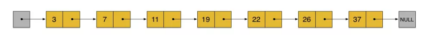

每相邻两节点间加一个指针。

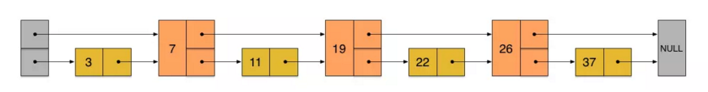

例如，要插入23。

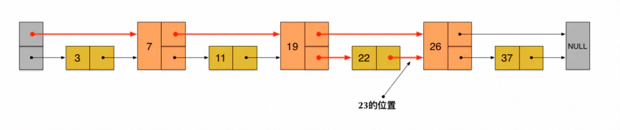

三层链表

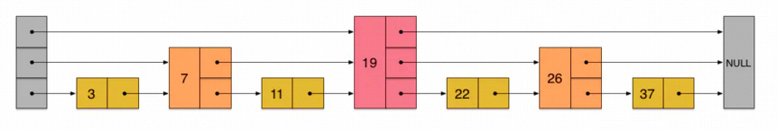

上层的个数是下层的一半，查找过程就非常类似于一个二分查找，使得查找的时间复杂度可以降低到**O(log n)**。

但是，这种方法在插入数据的时候有很大的问题。**新插入一个节点之后，就会打乱上下相邻两层链表上节点个数严格的2:1的对应关系。如果要维持这种对应关系，就必须把新插入的节点后面的所有节点（也包括新插入的节点）重新进行调整，这会让时间复杂度重新退化成O(n)**。删除数据也有同样的问题。//类似于二叉搜索树依次插入一个递增序列，就退化成了链表。例如插入23后，要重新判断他们的层级关系，才能继续保持O(log n)。

为了避免这个问题：skiplist为每个节点随机出一个level（层数）

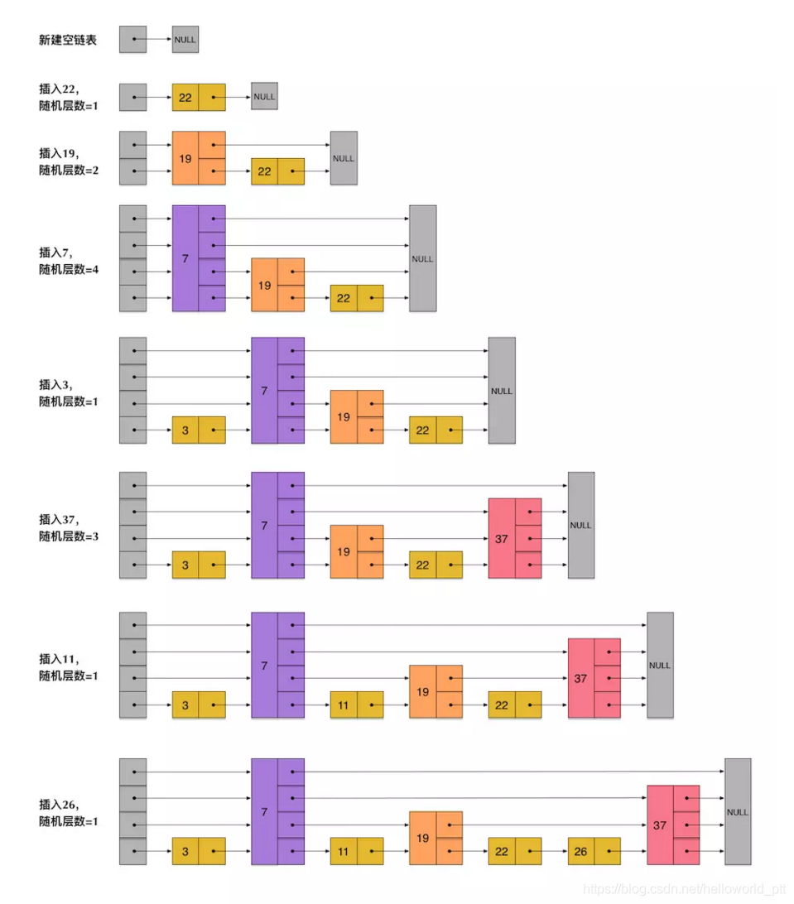

再次查找23：

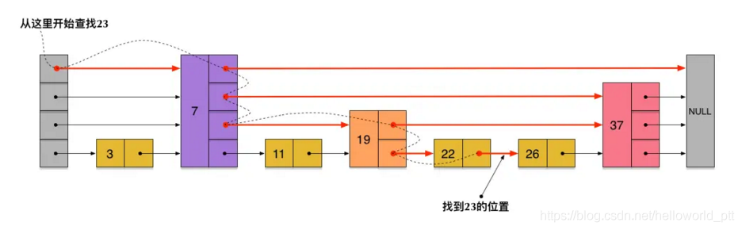

## Varint 结构

一种压缩方法

把数字放到字符数组，思想就是把小数字用尽量少的字节来表示，每个字节只使用其中的7位，最高位用来表示是否还有剩余的数字，0代表没有，1代表有。

```c++
char* EncodeVarint32(char* dst, uint32_t v) {
  // Operate on characters as unsigneds
  uint8_t* ptr = reinterpret_cast<uint8_t*>(dst);
  static const int B = 128;
  if (v < (1 << 7)) {
    *(ptr++) = v;
  } else if (v < (1 << 14)) {
    *(ptr++) = v | B;
    *(ptr++) = v >> 7;
  } else if (v < (1 << 21)) {
    *(ptr++) = v | B;
    *(ptr++) = (v >> 7) | B;
    *(ptr++) = v >> 14;
  } else if (v < (1 << 28)) {
    *(ptr++) = v | B;
    *(ptr++) = (v >> 7) | B;
    *(ptr++) = (v >> 14) | B;
    *(ptr++) = v >> 21;
  } else {
    *(ptr++) = v | B;
    *(ptr++) = (v >> 7) | B;
    *(ptr++) = (v >> 14) | B;
    *(ptr++) = (v >> 21) | B;
    *(ptr++) = v >> 28;
  }
  return reinterpret_cast<char*>(ptr);
}

```


“计算机科学中所有问题的解决方案就是一个间接层”


# Bitcask

论文原文:

https://riak.com/assets/bitcask-intro.pdf

博客

https://cloud.tencent.com/developer/article/2321151?areaId=106001

https://mp.weixin.qq.com/s/s8s6VtqwdyjthR6EtuhnUA


> 在LSM-TREE中， L2层压缩，产生的新SST 会直接放入L3吗，为什么不是就地放在L2中?

在LSM树（Log-Structured Merge-tree）中，数据通过层级结构进行组织，以提高写入效率并优化长期存储。数据首先写入内存中的结构（如MemTable），然后逐步向下层（磁盘上的SSTables）合并和压缩。各层之间的合并和压缩操作是LSM树维持高效读写性能的关键环节。

当L2层进行压缩并产生新的SST文件时，这些新文件是否会直接放入L3层，而不是保留在L2层，这取决于LSM树的实现细节和配置，尤其是与层级压缩策略相关。以下是几个为什么新的SST文件可能不直接在L2层就地放置而是放入L3层的原因：

1. **大小与空间限制：** 每一层都有大小或空间的限制，当一层的数据达到一定量时，新的或合并后的数据会被推移到下一层。如果L2层压缩后的数据大小超过了L2层的空间限制，这些数据会被推送到L3层。
2. **避免热点数据频繁合并：** 将新合并的SST文件放入更低的层可以减少对热点数据的频繁合并，因为更低层的数据更新频率较低。这有助于减少I/O操作和提高整体系统性能。
3. **层级合并策略：** LSM树实现中通常会有层级合并策略，如分层合并（Leveled Compaction）和分层合并（Tiered Compaction）。在分层合并策略中，每一层的数据大小是上一层的倍数，新生成的SST文件可能直接跳过某些层，以满足这种比例关系。
4. **写放大和读放大的权衡：** LSM树的设计需要在写放大（写入数据时需要的额外写入量）和读放大（读取单个数据需要读取的额外数据量）之间进行权衡。将新的SST文件放入更低层可能是基于这种权衡的结果，以优化读写性能。

总的来说，是否将L2层压缩后的新SST文件直接放入L3层，或者在L2层就地放置，取决于LSM树的具体实现和配置。不同的数据库系统（如RocksDB、LevelDB等）可能会采用不同的策略来优化性能和资源使用。

> 就只考虑RocksDB为例子

在RocksDB中，数据是按照LSM树的设计存储的，具有多个层级（Level 0, Level 1, Level 2, ...），每个层级都包含若干SST（Sorted String Table）文件。RocksDB采用的是分层合并（Leveled Compaction）策略，这意味着除了最上层（Level 0）之外的每一层都会保持SST文件的大小范围，以及每层的总大小限制。

### L2层压缩后的SST文件是否直接放入L3？

在RocksDB的分层合并策略中，当一个层级（例如L2）进行压缩操作时，产生的新SST文件通常会被放入下一个层级（L3）。原因包括但不限于：

1. **层级大小限制：** 每个层级（除Level 0外）都有预定义的大小限制。当L2层的数据经过压缩合并后，如果保留在L2，可能会导致这一层超出其大小限制。为了维持层级大小的平衡，新生成的SST文件会被推移到下一层级（L3）。
2. **减少写放大：** 通过将合并后的文件移到更低的层级，可以减少对这些数据的进一步合并频率，因为在更低层级的数据通常较少参与合并操作。这有助于减少写放大（Write Amplification）现象。
3. **保持有序性和避免重复合并：** 在RocksDB中，每一层的数据在键空间上是有序的，且每一层的键范围不会重叠。通过将新的SST文件推移到下一层，RocksDB确保数据在层级间移动时保持有序且不需要频繁地重复合并相同键范围的数据。
4. **优化读性能：** 分层合并策略还旨在优化读性能。通过控制每层的大小和文件数，RocksDB尝试最小化读取一个键时需要查找的SST文件数，从而降低读放大（Read Amplification）。

### 为什么不是就地放在L2？

将L2层压缩后的新SST文件就地放置在L2而不是移到L3，可能会导致L2层过快地增长，违背了RocksDB设计中层级大小平衡的原则。此外，这也可能会增加该层的合并频率，进而增加写放大和CPU使用率，对整体性能产生负面影响。

总之，RocksDB通过将L2层压缩后的新SST文件推移到L3层，实现了数据在层级间的有效管理和优化，以保持高效的读写性能和存储空间的有效利用。


> 


# Redis 1.0

https://zhuanlan.zhihu.com/p/698783137

> Redis（Remote Dictionary Server）是一个开源的[内存数据库](https://zhida.zhihu.com/search?q=内存数据库&zhida_source=entity&is_preview=1)，遵守 BSD 协议，它提供了一个高性能的键值（key-value）存储系统，常用于缓存、[消息队列](https://zhida.zhihu.com/search?q=消息队列&zhida_source=entity&is_preview=1)、会话存储等应用场景。本文主要向大家分享redis基本概念和流程，希望能和大家一起从源码角度分析一条命令执行过程，希望能帮助开发同学掌握redis的实现细节，提升编程水平、设计思想。


## 源码目录结构

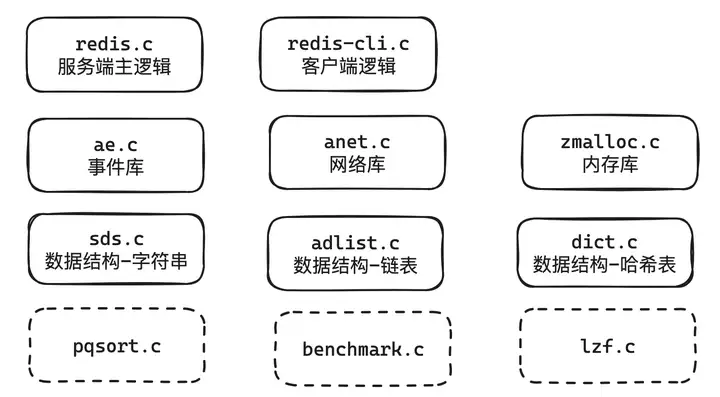


## 核心结构

### redisServer

redisServer是存储redis服务端运行的结构体，在启动的时候就会初始化完成，结构如下，它主要包含跟监听的socket有关的参数port和fd；对应存储数据的*redisDb列表；链接的客户端列表*clients；事件循环*el

```
struct redisServer {
    int port;       // 服务端监听的端口
    int fd;         // 服务端起的socket对应的文件句柄
    redisDb *db;    // redis db的列表，一般实际生产环境只用一个
//  3-lines
    list *clients;  // 服务端的列表
// 2 lines
    aeEventLoop *el; // 事件循环
//  36 lines
};
```


### redisClient

redisClient是客户端在服务端存储的状态信息，每当一个客户端与服务端链接时，都会新创建redisClient结构体到redisServer->clients列表中。

redisClient的结构，它包含命令传输所使用的querybuf，命令在经过处理后会存放到argv中；然后比较重要的是*reply表示服务端给到客户端的回复的数据，这是个列表会在客户端写就绪的时候一个一个写回客户端，sentlen则是标识了传输的长度；然后就是对应的db与socket句柄fd。


###  redisDb

redisDb是redis的键值对存储的位置，主要包含两大块，一块存储数据，另一块存储过期信信息，dict结构实际上是两个[哈希表](https://zhida.zhihu.com/search?q=哈希表&zhida_source=entity&is_preview=1)，至于为什么有两个，这里是为了做渐进式rehash使用（后面会详细介绍），rehashidx用于表示rehash进度，iterators迭代器是表示遍历集合操作个数，表里面的元素就是entry，这里面包含key和value以及指向下一个元素的指针。

```text
typedef struct redisDb {
    dict *dict;    // 字典1 存储数据
    dict *expires; // 字典2存储过期数据
    int id;        // db的id
} redisDb;

typedef struct dict {
    dictType *type; // 类型，主要定义相关的函数
    void *privdata;
    dictht ht[2];  // 两个hash table，用于做渐进式rehash使用
    int rehashidx; /* rehash进度 rehashidx == -1表示不是正在rehash*/
    int iterators; /* number of iterators currently running */
} dict;

typedef struct dictht {
    dictEntry **table;      // 存储数据的表
    unsigned long size;     // 大小
    unsigned long sizemask; // size-1，计算index的使用[1]
    unsigned long used;     // 已经使用的长度 
} dictht;

typedef struct dictEntry {
    void *key;             // 键，在redis中一般是指向一个SDS类型的数据
    union {
        void *val;         // 值，在redis中一般指向redisObject
        uint64_t u64;      // 特定情况下优化整数存储，比如过期     
        int64_t s64;       // 特定情况下优化整数存储
    } v;
    struct dictEntry *next; // 下一个entry
} dictEntry;
```


### redisObject

edisObject是redis存储对象基本的表现形式，它可以存储类似SDS list set等数据结构，并且存储了一些信息用于内存管理，比如refcount这是一个整数字段，用于存储对象的[引用计数](https://zhida.zhihu.com/search?q=引用计数&zhida_source=entity&is_preview=1)。每当有一个新的指针指向这个对象时，引用计数会增加；当指针不再指向这个对象时，引用计数会减少。当引用计数降到 0 时，表示没有任何地方再使用这个对象，对象的内存可以被回收。lru在储对象的 LRU（[最近最少使用](https://zhida.zhihu.com/search?q=最近最少使用&zhida_source=entity&is_preview=1)）时间，这个时间戳是相对于服务器的 lruclock 的，用于实现缓存淘汰策略。当 Redis 需要释放内存时，它会根据这个时间戳来判断哪些对象是最近最少被使用的，从而决定淘汰哪些对象。

```
typedef struct redisObject {
    void *ptr;              // 指向具体数据的指针
    int refcount;           // 引用计数
    unsigned type:4;        // 类型
    unsigned notused:2;     // 未使用，可能是为了扩展/占位
    unsigned encoding:4;    // 编码方式 
    unsigned lru:22;        // 最近最少使用
} robj;
```


### aeEventLoop

aeEventloop是redis事件模型基础数据，它主要包含文件事件和时间事件的两个链表。对于文件事件来说，包含文件句柄fd，事件类型mask，对应处理函数fileProc；对于时间事件来说包含id、执行时间（when_sec、when_ms）和对应执行函数timeProc 对应的源代码如下：


### 一次IO流程


# Redis操作

key是区分大小写的

默认使用字符串存储数据（包括数字），并且是二进制安全的。

> 二进制安全?
>
> C语言中表示字符串结尾的符号是'\0',如果字符串本身就具有'\0'字符，就会被截断，即非二进制安全。


**redis-cli的命令：**

SET 

GET

DEL

EXISTS


KEYS  查找，支持模式，比如 * 查找所有key

FLUSHALL 全删除


TTL （time to live）查看某个key还有多久过期，-1表示永久，-2表示已经过期

EXPIRE 设置过期时间

SETEX  k t v ， 设置一个k，过期时间为t，值为v

SETNX 如果不存在，则设置这个k的值，如果存在就不动


### List

（自动创建）

Lpush / Rpush	+	列表名	+	数据

将元素添加到list的头部or尾部。如果添加多个数据会依次push


Lpop / Rpop

从列表的头部or尾部删除元素。可以加数字表示删除几个。


Lrange	+	列表名	+	范围，（-1表示到末尾）


Llen	查看列表长度


Ltrim	+	索引a	+	索引b

只保留[a,b]，其他全删除


### Set

无重复集合。

Sadd	集合名	元素	在某集合中添加元素

Smembers	集合名	元素	 显示集合中全部元素

Sismember	集合名	元素	判断元素是否在集合中

Srem	集合名	元素	remove集合中的元素

**集合的运算**

​	


### Zset

有序集合，集合中每个元素都关联一个浮点类型的分数，并按照分数从小到大排序

命令都是Z开头的：

Zadd	集合名	元素分数	元素	元素分数	元素	元素分数	元素

Zrange	集合名	0	-1	显示所有元素

Zrange	集合名	0	-1	WITHSCORES（连带显示分数）

Zscore	集合名	元素名	查看分数

Zrank	集合名	元素名	查看排名（从小到大）

Zrevrank	集合名	元素名	查看排名（从大）

Zrem	删除

增加分数...


### Hash

字符类型的字段-值的映射表

Hset	表名	k	v

Hget	表名	k	

Hgetall		

Hdel	

Hexist

Hkeys

Hlen


### 

## 发布订阅功能

subsribe	频道名

publish	频道名称	内容

但是消息不能持久化，无法记录


## Stream

一个简易的消息队列

Xadd	消息名	*（消息ID，不填）	消息内容（list or set）

添加成功，会返回一个消息ID


XLen	消息名	

XRange	消息名	-	+	显示所有消息

XTrim	消息名	MAXLEN	0	删除所有消息


XRead	count 2（一次读取两条）	block  1000（没读到阻塞1000ms）	streams	消息名	0（表示从头开始读，$表示只读新增的)


**XGroup消费者组**

XGroup	create	消息名	组名

XInfo	GROUPS	组名	查看组的信息

XGroup	createconsumer	添加消费者


### Geospatial

存储地理位置信息的数据结构，支持各种计算操作（获取经纬度，计算两个地点间的距离 ，查找附近的人）

Geo开头


### HyperLogLog

统计去重后的元素个数，适合大规模统计非精确结果

PF开头


### Bitmap

用String类型来模拟Bit数组，数组下标即为偏移量， 值只有0，1

SetBit	位图名	偏移值	值（0/1)

GetBit	

BitCount	统计1的个数

BitBitPos	0/1	获取第一个1或0的位置

可以直接用操作string的 SET方法来操作bitmap


### Bitfield

#写

BitField	player:1	set	u8	#0	1


get	player:1	(用对string的get来看一下)

#读

BitField	player:1	get	u8	#0	


# Redis源码

## 前言

https://tech.youzan.com/redisyuan-ma-jie-xi/

> ## C语言存储字符串的问题
>
> ### 1.二进制安全
>
> C语言中表示字符串结尾的符号是'\0',如果字符串本身就具有'\0'字符，就会被截断，即非二进制安全。
>
> ### 2.计算字符串的长度性能低
>
> C语言中有一个计算字符串长度的函数strlen，但这个函数与Java的不一样，需要遍历整个字符串来计算长度，时间复杂度是O（n），如果需要在循环中计算，性能将十分低下
>
> ### 3.字符串拼接性能低
>
> 因为C语言字符串不记录长度，对于一个长度n的字符串来说，底层是n+1的字符数组
>
> ```
> char a[n+1]  
> 1
> ```
>
> 如果需要增长字符串，则需要对底层的字符数组进行重分配的操作
>
> 接下来由数据结构入手，看看redis是如何解决这几个问题的
