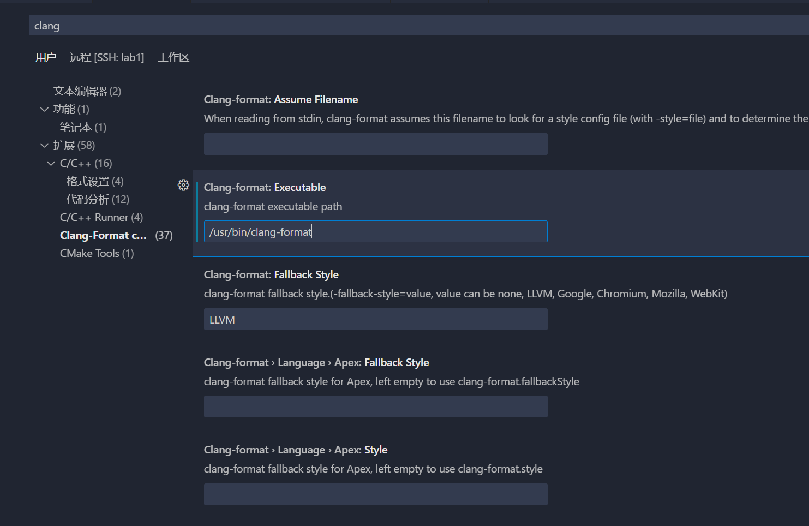

> 各种小工具
>
> 各种编辑器的插件配置。


# Vscode

## vscdoe.Clang-format

在服务器安装：

```bash
sudo apt install clang-format 
```

记得在vscode配置 format on save




.clang-format文件：

```
---
Language: Cpp
# 基础样式配置
BasedOnStyle: Google
Standard: Cpp11

# 缩进配置
IndentWidth: 4
TabWidth: 4
UseTab: Never
AccessModifierOffset: -4
IndentCaseLabels: true
NamespaceIndentation: None

# 行长度和换行配置
ColumnLimit: 120
AlignAfterOpenBracket: Align
AllowAllParametersOfDeclarationOnNextLine: true
BinPackArguments: false
BinPackParameters: false
AlwaysBreakTemplateDeclarations: Yes

# 大括号配置
BreakBeforeBraces: Custom
BraceWrapping:
  AfterClass: false
  AfterControlStatement: false
  AfterEnum: false
  AfterFunction: false
  AfterNamespace: false
  AfterStruct: false
  AfterUnion: false
  BeforeCatch: false
  BeforeElse: false
  IndentBraces: false

# 空格配置
SpaceBeforeParens: ControlStatements
SpaceInEmptyParentheses: false
SpacesInParentheses: false
SpacesInSquareBrackets: false
SpacesInAngles: false
SpaceAfterCStyleCast: false
SpaceAfterTemplateKeyword: true
SpaceBeforeAssignmentOperators: true
SpaceBeforeRangeBasedForLoopColon: true

# 对齐配置
AlignConsecutiveAssignments: true
AlignConsecutiveDeclarations: true
AlignEscapedNewlines: Left
AlignOperands: true
AlignTrailingComments: true

# 指针和引用配置
DerivePointerAlignment: false
PointerAlignment: Left

# 注释配置
CommentPragmas: '^ IWYU pragma:'
FixNamespaceComments: true
ReflowComments: true

# 函数配置
AllowShortFunctionsOnASingleLine: Empty
AlwaysBreakAfterReturnType: None
BreakConstructorInitializers: BeforeColon
ConstructorInitializerAllOnOneLineOrOnePerLine: true

# 其他配置
Cpp11BracedListStyle: true
IndentPPDirectives: None
KeepEmptyLinesAtTheStartOfBlocks: false
MaxEmptyLinesToKeep: 1
SortIncludes: true
SortUsingDeclarations: true

# 宏配置
AlignConsecutiveMacros: true

```


## Latex-workshop

配置:

```json
"latex-workshop.latex.tools": [
        {
            // 编译工具和命令
            "name": "xelatex",
            "command": "xelatex",
            "args": [
                "-synctex=1",
                "-interaction=nonstopmode",
                "-file-line-error",
                "-pdf",
                "%DOCFILE%"
            ]
        },
        {
            "name": "pdflatex",
            "command": "pdflatex",
            "args": [
                "-synctex=1",
                "-interaction=nonstopmode",
                "-file-line-error",
                "%DOCFILE%"
            ]
        },
        {
            "name": "bibtex",
            "command": "bibtex",
            "args": [
                "%DOCFILE%"
            ]
        },
        {
            "name": "biber",
            "command": "biber",
            "args": [
                "%DOCFILE%"
            ]
        }
    ],
    // 设置编译方法
    "latex-workshop.latex.recipes": [
        {
            "name": "xelatex",
            "tools": [
                "xelatex"
            ],
        },
        {
            "name": "pdflatex",
            "tools": [
                "pdflatex"
            ]
        },
        {
            "name": "xe->biber->xe->xe",
            "tools": [
                "xelatex",
                "biber",
                "xelatex",
                "xelatex"
            ]
        },
        {
            "name": "pdf->biber->pdf->pdf",
            "tools": [
                "pdflatex",
                "biber",
                "pdflatex",
                "pdflatex"
            ]
        },
        {
            "name": "xe->bib->xe->xe",
            "tools": [
                "xelatex",
                "bibtex",
                "xelatex",
                "xelatex"
            ]
        }
    ],
    "latex-workshop.view.pdf.viewer": "tab",
    "latex-workshop.view.pdf.internal.synctex.keybinding": "ctrl-click",
    "latex-workshop.view.pdf.external.viewer.command": "C:/Program Files (x86)/Adobe/Acrobat 2020/Acroba/Acroba.exe",
    "latex-workshop.view.pdf.external.viewer.args": [
        "-forward-search",
        "%TEX%",
        "%LINE%",
        "-reuse-instance",
        "-inverse-search",
        "\"D:/Microsoft VS Code/Code.exe\" \"D:/Microsoft VS Code/resources/app/out/cli.js\" -gr \"%f\":\"%l\"",
        "%PDF%"
    ],
    "latex-workshop.view.pdf.external.synctex.command": "C:/.../SumatraPDF.exe",
    "latex-workshop.view.pdf.external.synctex.args": [
        "-forward-search",
        "%TEX%",
        "%LINE%",
        "-reuse-instance",
        "-inverse-search",
        "\"D:/Microsoft VS Code/Code.exe\" \"D:/Microsoft VS Code/resources/app/out/cli.js\" -gr \"%f\":\"%l\"",
        "%PDF%",
        "resources/app/out/cli.js"
    ],
    "latex-workshop.message.error.show": false,
    "latex-workshop.message.warning.show": false,
    // "latex-workshop.latex.autoClean.run": "onBuilt",
    // "latex-workshop.latex.clean.fileTypes": [
    //     "*.bbl",
    //     "*.blg",
    //     "*.idx",
    //     "*.ind",
    //     "*.lof",
    //     "*.lot",
    //     "*.toc",
    //     "*.acn",
    //     "*.acr",
    //     "*.alg",
    //     "*.glg",
    //     "*.glo",
    //     "*.gls",
    //     "*.ist",
    //     "*.fls",
    //     "*.fdb_latexmk"
    // ],
    // --latex-workshop@lzq
```


## 其他工具

**跳转**

- IntelliCode（跳转）
- Bookmarks（在代码的某行打标签快速跳转）
- （看函数调用关系图）
- CodeLLDB（没咋用明白）

**美化**

- Bracket（彩虹括号，两个对应的括号之间有竖线）
- vscode-icon（最显眼的图标）
- Ninja（在行内显示output）

**其他工具：**

- 合集：VSC-Essentials（少）
- 合集：VSCode Essentials（多）
- Todo Tree - Gruntfuggly: TODO 软件
- 
- 


## LATEX插件

使用vscode本地编译LaTeX

windows直装:https://www.tug.org/texlive/windows.html#install

插件：LaTeX Workshop


## SHELL插件

1. shellcheck - Timon Wong: 语法检查, 以及错误提示
2. 
3. 


# Jetbrain系列


# Cursor

可以继承Vscode绝大部分插件，


# Typora

> 直接copy现有的主题文件夹就行了

显示宽度，


修改汉字、英文的字体样式，


## Typora一些操作

`$$`+回车创建公式块

 ` ``` ` + 语种 + 回车 创建代码块 // Ctrl+Shift+K


## 格式控制

间隔：`\quad`	$A \quad B$


公式的**左对齐**:

&(对齐点) \\\\(换行)

```
\begin{align*}
	& \\
	& \\
\end{align*}
```


$$
\begin{align*}
  & X(0) = x(0)W_{N}^{0\cdot0} + x(1)W_{N}^{0\cdot1} + \cdots + x(N-1)W_{N}^{0\cdot(N-1)}\\
  & X(1) = x(0)W_{N}^{1\cdot0} + x(1)W_{N}^{1\cdot1} + \cdots + x(N-1)W_{N}^{1\cdot(N-1)} \\
  & \cdots \\
  & X(N-1) = x(0)W_{N}^{(N-1)\cdot0} + x(1)W_{N}^{(N-1)\cdot1} + \cdots + x(N-1)W_{N}^{(N-1)\cdot(N-1)} \\
\end{align*}
$$


## **角标**				

`_`是右下角,`^`是左上角

`\limits + _ 或 ^` 

$opt(i,l)=\bigcup\limits _{1 \leq j \leq l} \{opt(i,l-j) \times opt(l-j+i,j)\}$

## 数学符号

点乘：` \cdot`			$a \cdot b$

叉乘：`\times`		$a \times b$

除以：`\div`   	 	$a \div b$

大于等于：`\geq` 	$\geq$

小于等于：`\leq` 	$\leq$

分式:`\frac{分子}{分母}` 	$\frac{分子}{分母}$

### 逻辑符号

|                   |                |                 |
| ----------------- | -------------- | --------------- |
| $\oplus$          | 异或           | \oplus          |
| $\bar S$          | 均值(一bar~)   | \bar            |
| $\neg$            | 非             | \neg            |
| $\vee$            | 析取           | \vee            |
| $\wedge$          | 合取           | \wedge          |
| $\rightarrow$     | 若p则q(右箭头) | \rightarrow     |
| $\leftrightarrow$ | 等价(左右箭头) | \leftrightarrow |
|                   |                |                 |


A \subseteq B

## 希腊

$\Sigma$


## **花括号**

`\usepackage{amsmath}`

```LaTeX
 opt(i,1) =\left\{
\begin{aligned}
x & = & \cos(t) \\
y & = & \sin(t) \\
z & = & \frac xy
\end{aligned}
\right.
```


$opt(i,1) =\left\{  \begin{aligned}AC \\B\end{aligned}\right.$


## **无穷符号**

`\infty`

$\infty$


# EasyN2N——虚拟局域网


windows端用EasyN2N客户端


服务器用apt-get install n2n  


```bash
vim /etc/n2n/supernode.conf # -p=7777 设置端口号

sudo systemctl start supernode

sudo systemctl enable supernode

Created symlink /etc/systemd/system/multi-user.target.wants/supernode.service → /etc/systemd/system/supernode.service.
```


# Syncthing——文件P2P同步器

Linux版:

[https://apt.syncthing.net/](https://apt.syncthing.net/)

https://www.cnblogs.com/HaiJaine/p/18339629

[CSDN配置教程](https://blog.csdn.net/weixin_42951763/article/details/140421699?spm=1001.2101.3001.6650.2&utm_medium=distribute.pc_relevant.none-task-blog-2%7Edefault%7Ebaidujs_baidulandingword%7ECtr-2-140421699-blog-139358421.235%5Ev43%5Epc_blog_bottom_relevance_base8&depth_1-utm_source=distribute.pc_relevant.none-task-blog-2%7Edefault%7Ebaidujs_baidulandingword%7ECtr-2-140421699-blog-139358421.235%5Ev43%5Epc_blog_bottom_relevance_base8&utm_relevant_index=5)


**GUI：** 

syncthing serve --gui-address=0.0.0.0:8384  

ufw allow 8384 （允许远程访问这个GUI）

**隐藏运行:** 

nohup syncthing --gui-address=0.0.0.0:8384   &> /dev/null &

**自启动：**

\#添加开机启动 systemctl enable syncthing@root.service 

#启动syncthing服务 systemctl start syncthing@root.service


# Clash-for-linux 

https://github.com/Elegycloud/clash-for-linux-backup


浏览器端口:http://<ip>:9090/ui

通过浏览器访问 `start.sh` 执行成功后输出的地址，例如：http://192.168.0.1:9090/ui

- 登录管理界面

在`API Base URL`一栏中输入：http://<ip>:9090 ，在`Secret(optional)`一栏中输入启动成功后输出的Secret。

点击Add并选择刚刚输入的管理界面地址，之后便可在浏览器上进行一些配置。

- 更多教程

此 Clash Dashboard 使用的是[yacd](https://github.com/haishanh/yacd)项目，详细使用方法请移步到yacd上查询。


默认代理端口:

```
http_proxy=http://127.0.0.1:7890
https_proxy=http://127.0.0.1:7890
```


# Marker

PDF2Markdown

利用本地显卡将PDF识别并转换成markdown格式，效果非常不错。


