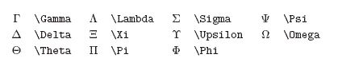

> 各种小工具
>
> 各种编辑器的插件配置。


# Vscode

## vscdoe.Clang-format

在服务器安装：

```bash
sudo apt install clang-format 
```

记得在vscode配置 format on save


# Jetbrain系列


# Cursor

可以继承Vscode绝大部分插件，


# VSCDOE + LATEX

使用vscode本地编译LaTeX

windows直装:https://www.tug.org/texlive/windows.html#install

插件：LaTeX Workshop


# Typora

> 直接copy现有的主题文件夹就行了

显示宽度，


修改汉字、英文的字体样式，


## Typora一些操作

`$$`+回车创建公式块

 ` ``` ` + 语种 + 回车 创建代码块 // Ctrl+Shift+K


## 格式控制

间隔：`\quad`	$A \quad B$


公式的**左对齐**:

&(对齐点) \\\\(换行)

```
\begin{align*}
	& \\
	& \\
\end{align*}
```


$$
\begin{align*}
  & X(0) = x(0)W_{N}^{0\cdot0} + x(1)W_{N}^{0\cdot1} + \cdots + x(N-1)W_{N}^{0\cdot(N-1)}\\
  & X(1) = x(0)W_{N}^{1\cdot0} + x(1)W_{N}^{1\cdot1} + \cdots + x(N-1)W_{N}^{1\cdot(N-1)} \\
  & \cdots \\
  & X(N-1) = x(0)W_{N}^{(N-1)\cdot0} + x(1)W_{N}^{(N-1)\cdot1} + \cdots + x(N-1)W_{N}^{(N-1)\cdot(N-1)} \\
\end{align*}
$$


## **角标**				

`_`是右下角,`^`是左上角

`\limits + _ 或 ^` 

$opt(i,l)=\bigcup\limits _{1 \leq j \leq l} \{opt(i,l-j) \times opt(l-j+i,j)\}$

## 数学符号

点乘：` \cdot`			$a \cdot b$

叉乘：`\times`		$a \times b$

除以：`\div`   	 	$a \div b$

大于等于：`\geq` 	$\geq$

小于等于：`\leq` 	$\leq$

分式:`\frac{分子}{分母}` 	$\frac{分子}{分母}$

### 逻辑符号

|                   |                |                 |
| ----------------- | -------------- | --------------- |
| $\oplus$          | 异或           | \oplus          |
| $\bar S$          | 均值(一bar~)   | \bar            |
| $\neg$            | 非             | \neg            |
| $\vee$            | 析取           | \vee            |
| $\wedge$          | 合取           | \wedge          |
| $\rightarrow$     | 若p则q(右箭头) | \rightarrow     |
| $\leftrightarrow$ | 等价(左右箭头) | \leftrightarrow |
|                   |                |                 |


A \subseteq B

## 希腊

$\Sigma$



## **花括号**

`\usepackage{amsmath}`

```LaTeX
 opt(i,1) =\left\{
\begin{aligned}
x & = & \cos(t) \\
y & = & \sin(t) \\
z & = & \frac xy
\end{aligned}
\right.
```


$opt(i,1) =\left\{  \begin{aligned}AC \\B\end{aligned}\right.$


## **无穷符号**

`\infty`

$\infty$


# EasyN2N——虚拟局域网


windows端用EasyN2N客户端


服务器用apt-get install n2n  


# Syncthing——文件P2P同步器

Linux版:

[https://apt.syncthing.net/](https://apt.syncthing.net/)

https://www.cnblogs.com/HaiJaine/p/18339629

[CSDN配置教程](https://blog.csdn.net/weixin_42951763/article/details/140421699?spm=1001.2101.3001.6650.2&utm_medium=distribute.pc_relevant.none-task-blog-2%7Edefault%7Ebaidujs_baidulandingword%7ECtr-2-140421699-blog-139358421.235%5Ev43%5Epc_blog_bottom_relevance_base8&depth_1-utm_source=distribute.pc_relevant.none-task-blog-2%7Edefault%7Ebaidujs_baidulandingword%7ECtr-2-140421699-blog-139358421.235%5Ev43%5Epc_blog_bottom_relevance_base8&utm_relevant_index=5)


**GUI：** 

syncthing serve --gui-address=0.0.0.0:8384  

ufw allow 8384 （允许远程访问这个GUI）

**隐藏运行:** 

nohup syncthing --gui-address=0.0.0.0:8384   &> /dev/null &

**自启动：**

\#添加开机启动 systemctl enable syncthing@root.service 

#启动syncthing服务 systemctl start syncthing@root.service


# 
