多线程与多进程等。

# 编译、调试、性能分析工具：

学习使用coredump

文件调试

学习使用vtune等性能测试工具进行性能测试

### perf

objdump -d [?] >  [?] #看反汇编

```
perf record  ./lower_bound

perf report 

perf record -e cache-misses  
```


## Coredump

​		程序由于各种异常或者bug导致在运行过程中异常退出或者中止（并且在满足一定条件下）会产生一个叫做core的文件。

​		通常情况下，core文件会包含了程序运行时的内存，寄存器状态，堆栈指针，内存管理信息还有各种函数调用堆栈信息等

默认的存储位置：

```shell
 cat  /proc/sys/kernel/core_pattern
```


## Cache Lab

Understanding Cache Memories，

包括：

完成cache模拟器的编写；

写cache友好的代码（详细内容见文档cachelab.pdf）


## GDB

### 一些命令

[^]: https://blog.csdn.net/zdy0_2004/article/details/80102076

```bash
gcc -g test.c -o test.exe	#-g=编译调试版 -o=输出
gdb	test.exe				#或者进(gdb)再file test.exe
```

### 查看代码

```bash
list n #显示以第n行 
list main #查看某函数
set listsize 20 #修改默认显示行数
list <first> , <last>#显示first到last行

```

### 断点

```bash
#设置断点 break + 行号
break 
#清除断点 delete [breakpoints] [rang...] 
#breakpoints为断点号 range表示断点号的范围 不指定断点号则表明删除所有的断点

info break #查看断点信息(看断点号)

delete 1   #删除1号断点
```


| 命令     | 命令缩写 | 命令说明                                                     |
| -------- | -------- | ------------------------------------------------------------ |
| file     | f        | 装入要调试的文件路径                                         |
|          |          |                                                              |
|          |          |                                                              |
| start    | st       | 开始执行程序,在main函数的第一条语句前面停下来                |
| run      | r        | 开始运行程序                                                 |
| step     | s        | 执行下一条语句,如果该语句为函数调用,则进入函数执行其中的第一条语句 |
| next     | n        | 执行下一条语句,如果该语句为函数调用,不会进入函数内部执行(即不会一步步地调试函数内部语句) |
| continue | c        | 继续程序的运行,直到遇到下一个断点                            |

### **观察变量**

```bash
 watch                 监视变量值的变化                       
 display         disp  跟踪查看某个变量,每次停下来都显示它的值 
 print           p     打印内部变量值                          
 set var name=v        设置变量的值    
```

### **观察内存**

```bash
#x/fmt addres
x/16x &x	#查看x地址往后的内存
```

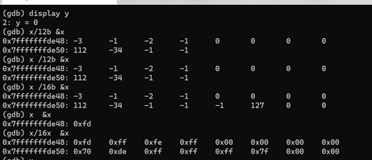

### 观察寄存器及info

| info register | i reg     | 寄存器           |
| ------------- | --------- | ---------------- |
|               | i b       | 查看断点信息     |
|               | i display | 跟踪查看哪些变量 |
|               | i source  | 程序信息         |

### 反汇编

```bash
disassemble	#要先设置断点,run起来
			/s	#带源程序
			/r	#带机器码
			main #特定函数的反汇编
#设置反汇编格式: AT&T \ Intel
 set disassembly-flavor intel
 set disassembly-flavor att
```


### 设置窗口——layout

```bash
#退出方法为Ctrl+X+A
layout src 	#只显示源代码
layout asm 	#只显示汇编代码
layout regs #增加寄存器内容显示
```


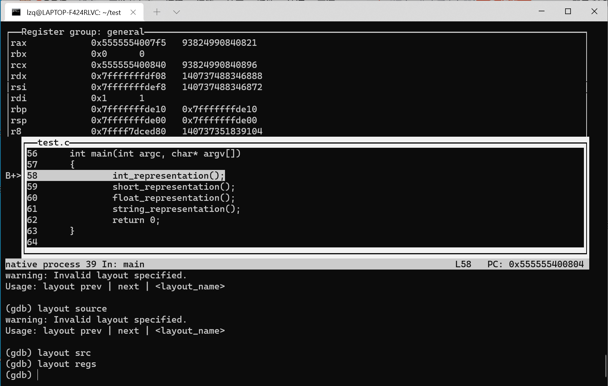


## Cmake、make

[make makefile cmake 都是什么，有什么区别？](https://www.zhihu.com/question/27455963)

`gcc`只能编译单文件，当你的程序包含很多个源文件时，用gcc命令逐个去编译时，你就很容易混乱而且工作量大。

`make`工具可以看成是一个智能的批处理工具，它本身并没有编译和链接的功能，而是用类似于批处理的方式—通过调用makefile文件中用户指定的命令来进行编译和链接的。

make工具依靠`Makefile`中的命令进行编译和链接。

`Cmake`根据`CMakeLists.txt`去生成Makefile

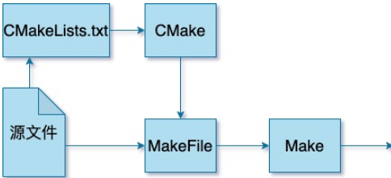

```shell
#三板斧
cd build
cmake ..
make
./可执行文件名
```

用cmake编译C++工程时，如果改变了工程文件的位置，那么在build文件中运行cmake … 时有可能会报错，我们删除build文件夹（cmake没有clear功能）

```shell
#1.退出build目录：
cd ..
#2.删除build目录（要确保build中只存放了编译生成的中间文件）
rm -rf build
#3.新建build目录
mkdir build
#4.进入build
cd build
#5.重新cmake …
cmake ..
```


## autoconf

仓库代码不包含Makefile和configure文件，需要通过autoreconf来生成，需要先安装libtool、automake、autoconf等工具

```shell
sudo apt-get install libtool automake autoconf

libtoolize
aclocal
autoheader
automake --add-missing
autoconf

# 自动生成了configure文件
./configure
make
sudo make install

```


`autoconf`是一个强大的工具，它可以让软件更容易在不同的系统环境中编译和安装。如果你需要对软件包进行微调或检查特定的系统特性，`configure.ac`文件提供了一个灵活的方式来指定这些配置检查。


# Vim

[^区分大小写]: 即G = shift + g

#### `normal` 命令模式:

- 基本移动: `hjkl` （左， 下， 上， 右）
- 词： `w` （下一个词）， `b` （词初）， `e` （词尾）
- 行： `0` （行初）， `^` （第一个非空格字符）， `$` （行尾）
- 屏幕： `H` （屏幕首行）， `M` （屏幕中间）， `L` （屏幕底部）
- 翻页： `Ctrl-u` （上翻）， `Ctrl-d` （下翻）
- 文件： `gg` （文件头）， `G` （文件尾）
- 行数： `:{行数}<CR>` 或者 `{行数}G` ({行数}为行数)
- 杂项： `%` （找到配对，比如括号或者 /* */ 之类的注释对）
- 查找：`f{字符}`，`t{字符}`，`F{字符}`，`T{字符}`
  - 查找/到 向前/向后 在本行的{字符}
  - `,` / `;` 用于导航匹配
- 搜索: `/{正则表达式}`, `n` / `N` 用于导航匹配


#### `visual`：可视化模式:

- 可视化：`v`
- 可视化行： `V`
- 可视化块：`Ctrl+v`

可以用移动命令来选中。


|          |                                                              |
| :------- | ------------------------------------------------------------ |
| dd       | 删除行                                                       |
| yy       | 复制行                                                       |
| u        | 复原前一个动作。                                             |
| [Ctrl]+r | 重做上一个动作。                                             |
| .        | 不要怀疑！这就是小数点！意思是重复前一个动作的意思。 如果你想要重复删除、重复贴上等等动作，按下小数点『.』就好了！ |


#### 一些常用的动作

1. 全选：gg + v + G

​	回到开头，进入visual模式，到达结尾。

2. 

# Tmux

命令行多开，在服务器纯命令行环境比较有用

```
# 新建一个窗口叫myscan
tmux new -s myscan
# 运行程序,ctrl+B , d ,  退出

# 回到myscan窗口
tmux attach -t  myscan
```


# **Git**

## 配置

回到Windows安装Git到D盘的environment中

### ssh

本地生成密钥

`ssh-keygen -t rsa -C "1021578619@qq.com"`

-C：C是comment的缩写，“你的邮箱地址“（因为邮箱地址具有唯一性所以一般用这个），这是用于识别这个密钥的注释

一路回车,密钥保存到`用户/2657/.ssh/id_rsa.pub`

复制粘贴到GitHub-Setting-SSH and GPG keys,命名test1

`ssh -T git@github.com`

第一次连接需要确认yes

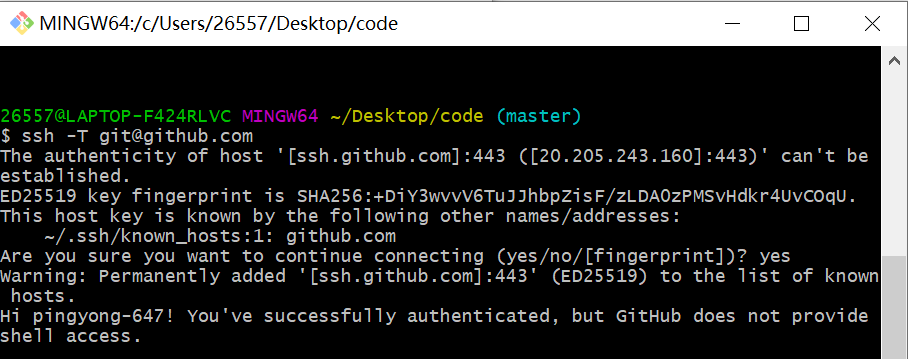


## 结构


**工作区：**就是你在电脑里能看到的目录。

**暂存区：**英文叫 stage 或 index。一般存放在 **.git** 目录下的 index 文件（.git/index）中，所以我们把暂存区有时也叫作索引（index）。

**版本库：**工作区有一个隐藏目录 **.git**，这个不算工作区，而是 Git 的版本库。


> 一次上传

```bash
#第一次
#配置用户
git config user.name lzq
git config user.email 1021578619@qq.com
#远程仓库以前已经认证过了
git remote add https://github.com/pingyong-647/code

#添加到暂存区
git add .
#commit到本地库
git commit -m "注释"
#push到远程仓库
git push -u origin master (master:master,同名省略)
```

[^2021年12月22日10:34:30]: 所以说加不加-u有什么区别?>

2024年3月7日16:48:45: 

### token

github强制使用token了

```bash
git remote set-url origin https://token@github.com/username/project.git

```


#### push操作经常超时


```bash
git config --global http.proxy http://127.0.0.1:1080  

git config --global https.proxy http://127.0.0.1:1080
```

```bash
#取消全局代理 //不是很懂
git config --global --unset http.proxy  

git config --global --unset http.proxy 
```

[^2021年12月27日16:41:26]: 不知道有没有用, 后来又设置了ssh,并且在GitHub保存了密钥, 刚才直接上传成功了。


> 上传超过100MB的大文件

下载安装git lfs https://git-lfs.com/

https://blog.csdn.net/wzk4869/article/details/131661472

```bash
git lfs install 
#追踪大文件
git lfs track "*.pptx"
#重新add commit 
```


> 如何只下载某个仓库的一部分文件

工具：http://tool.mkblog.cn/downgit/#/home

## 一些命令

```bash
#上传三连
#添加到暂存区
git add .
#commit到本地库
git commit -m "注释"
#push到远程仓库
git push -u origin master (master:master,同名省略)
 
#相当于两步
#将远程仓库origin的master分支与本地仓库master分支关联
git branch --set-upstream-to=origin/master master
git push origin master
git push origin +master#好像是强制上传
#查看remote仓库
git remote -v
#添加一个远程仓库 by ssh
git remote add origin git@github.com:LiuziqiOvO/md.git
```


# Docker

## 简介

Docker 是一种用于开发、交付和运行应用程序的开源平台，它通过容器化技术实现了应用程序的轻量级打包、部署和管理。Docker 可以帮助开发人员和运维人员更轻松地构建、测试、发布和运行应用程序，提高了应用程序的可移植性、可扩展性和安全性。

Docker是一个Client-Server结构，Docker的守护进程运行在主机，通过Socket从客户端访问。

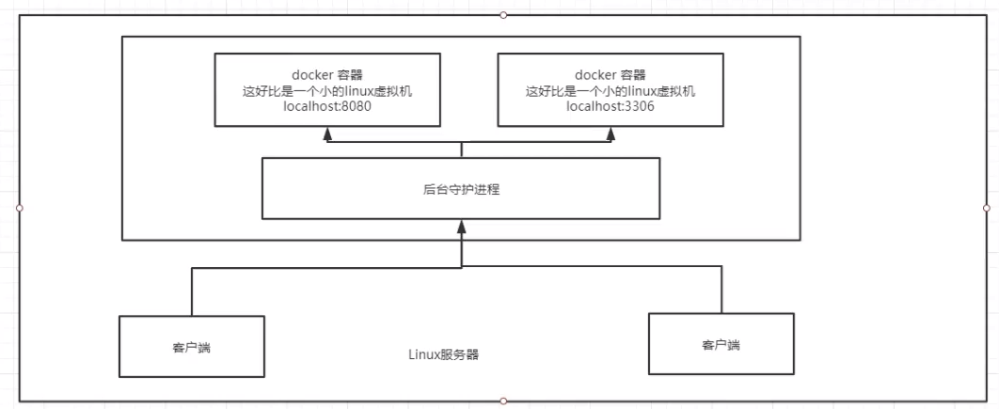

**为什么Docker比虚拟机快？**

1. Docker抽象层更少。 而虚拟机还需要去虚拟硬件。
2. Docker直接利用主机操作系统和内核。而虚拟机需要重新加载出一个OS kernel

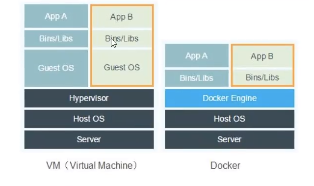

**Docker 是怎么做到隔离的？**

Docker 制造隔离环境的主要方法是通过 Linux 内核提供的命名空间（Namespace）和控制组（cgroup）技术。通过命名空间，Docker 实现了一种隔离的环境，使得容器可以拥有自己独立的进程空间、网络空间、文件系统空间等。而控制组技术则可以对容器的资源使用进行限制和管理，如 CPU、内存、磁盘和网络等资源。

镜像是由多个文件系统（layers）构成的，每个文件系统都包含了容器运行所需的文件和配置信息。Docker 使用联合文件系统（UnionFS）的技术将这些文件系统层叠在一起，形成一个完整的镜像。这种分层存储的设计使得镜像可以有效地共享和重用，同时也使得镜像的构建、传输和存储更加高效。

##  命令

`docker images` 可以检查本地所被 tag 的镜像。

​	加上 `-a` 选项显示所有没有 tag 的镜像（有时候似乎也被成为layer）。这些没名字的镜像可能是用 	Dockerfile 生成镜像时的中间步骤。

```bash
docker version
docker info 	#显示docker系统信息（详细）
```

docker的镜像ID是根据内容生成的，根据同样的配置创建出来的镜像，即使名字不一样，也会是同一个ID。

镜像 ID 是自动的，而标签（如 latest）是仓库级别的（用户给的名字）

在 Docker 中，"Untagged" 表示一个镜像失去了它的标签（tag）。Docker 镜像总是通过 <repository>:<tag> 的形式来标识，其中 <repository> 是镜像的仓库名，<tag> 是镜像的标签。标签用于区分同一个仓库中不同版本的镜像。


### 镜像

```bash
docker images 	#显示本地主机镜像 -a全部 -q只显示ID
docker search 	#搜索镜像 会列出搜索doc结果，和区个docker hub网页端搜索是一样的。
docker pull 	#下载
```

```bash
docker rmi -f	#remove image + ID/名称
docker rmi -f 镜像ID 镜像ID
docker rmi -f $(docker images -aq) # 把所有容器的ID都传入,删掉
```


### 容器


```bash
docker run	
	#参数
	--name="123"
	-d 				后台方式运行
	-it				使用交互方式运行 
	-p				指定容器端口 
	-p 主机端口：容器端口（常用）
	-p 容器端口
	-P				随即制定端口

docker run -it 	centos /bin/bash	#进入centos容器

docker run -it --net=host --privileged ditto_image
```

exit		   #退回主机，容器停止

ctrl + p + q   #退出，容器不停止(容器的关闭需要时间，要等一会)


**返回容器	attach**

前提是该容器正在运行

```
sudo docker attach lzq_ditto
```


**后台运行	-d**

```bash
docker run -d centos	#后台启动
#但是! docker ps 可以看到centos停止了！！！
```
> 想要docker容器后台运行，必须有一个前台进程，（而bash是会自动退出？）docker发现没有应用，就会自动停止。 


### 其他

> 删除所有不运行的容器 镜像

删除所有不运行的容器你可以使用以下 Docker 命令：

```bash
docker container prune
```

要删除所有不使用的镜像，你可以使用以下命令：

```bash
docker image prune -a 
```


```
docker ps	#列出正在运行的容器
	-a		#看曾经运行过的容器
	
docker rm   #删除容器，+名字（tag），会释放tag
docker rm -f $(docker ps -aq)#删除所有
docker ps -a -q |xargs docker rm #用管道符,同理

docker start  
docker restart
docker stop
docker kill
```


**日志**

```
docker logs -tf 	#f=format 加时间戳
	--tail number	#行数
```

**TOP**

```bash
docker top 			#查看容器内部的进程
$ docker top 7e6624c41892
```

**查看容器信息**

```bash
docker inspect 		#+id 可以看到容器的细节信息(查看容器元数据)	
```

**进入容器的方法**

```bash
docker execu		#+ID，进入容器（开一个新终端）
```

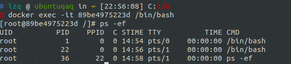

```bash
docker attach 		#+ID，进入容器（打开正在执行的终端）
```

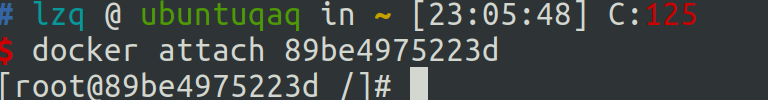

**从容器内拷贝文件到主机上**

```bash
docker cp ID: /home/test.java /home		#拷贝 ID 冒号 原文件 目标目录
#未来可以使用 -v 卷的技术打通。
```


### 在容器内重启守护进程

```
service ssh restart
```


## 编写DockerFile

```bash
docker build . -t oscomp-test
```


`ENTRYPOINT` 指令用于设置容器启动时执行的默认命令或应用程序。当你运行容器时，指定的命令会作为容器的主进程运行。这与 `CMD` 指令的作用类似，但 `ENTRYPOINT` 指令的参数不会被 Dockerfile 中的 `CMD` 指令覆盖，而是被添加在其后作为参数传递给 `ENTRYPOINT` 指定的命令。

在这个 Dockerfile 中，`ENTRYPOINT` 指定了 `/bin/bash` 命令，它会在容器启动时执行。而 `/root/ditto_test/script.sh` 则作为 `ENTRYPOINT` 的参数传递给 `/bin/bash` 命令，这意味着在容器启动时会执行 `/root/ditto_test/script.sh` 脚本。

通过设置 `ENTRYPOINT`，你可以确保每次运行容器时都会执行特定的命令或脚本，而不必在 `docker run` 命令中手动指定。


要创建一个 Dockerfile 来完成你提到的步骤，包括修改 SSH 配置、生成 SSH 密钥并分发到多个远程主机，你可以按照以下示例进行操作。

### Dockerfile 示例

```Dockerfile
# 使用官方的 Ubuntu 基础镜像
FROM ubuntu:latest

# 更新包列表并安装必要的软件包
RUN apt-get update && apt-get install -y \
    openssh-server \
    vim \
    sshpass \
    && rm -rf /var/lib/apt/lists/*

# 配置 SSH 服务
RUN mkdir /var/run/sshd
RUN echo 'root:1209' | chpasswd
RUN sed -i 's/#PermitRootLogin prohibit-password/PermitRootLogin yes/' /etc/ssh/sshd_config
RUN sed -i 's/#PasswordAuthentication yes/PasswordAuthentication yes/' /etc/ssh/sshd_config

# 启动 SSH 服务
RUN service ssh restart

# 生成 SSH 密钥
RUN ssh-keygen -t rsa -f /root/.ssh/id_rsa -q -N "" -C "fp_node1"

# 将公钥分发到指定的远程主机
RUN sshpass -p '1209' ssh-copy-id -o StrictHostKeyChecking=no root@10.10.10.1
RUN sshpass -p '1209' ssh-copy-id -o StrictHostKeyChecking=no root@10.10.10.2
RUN sshpass -p '1209' ssh-copy-id -o StrictHostKeyChecking=no root@10.10.10.3
RUN sshpass -p '1209' ssh-copy-id -o StrictHostKeyChecking=no root@10.10.10.4
RUN sshpass -p '1209' ssh-copy-id -o StrictHostKeyChecking=no root@10.10.10.5
RUN sshpass -p '1209' ssh-copy-id -o StrictHostKeyChecking=no root@10.10.10.6

# 暴露 SSH 端口
EXPOSE 22

# 启动 SSH 服务并保持容器运行
CMD ["/usr/sbin/sshd", "-D"]
```

### 说明

1. **基础镜像**：使用最新的 Ubuntu 官方镜像作为基础镜像。
2. **安装软件包**：更新包列表并安装必要的软件包，包括 `openssh-server`、`vim` 和 `sshpass`。
3. **配置 SSH**：修改 SSH 配置文件 `/etc/ssh/sshd_config` 以允许 root 登录，并启用密码认证。
4. **设置 root 密码**：将 root 用户密码设置为 `1209`。
5. **重启 SSH 服务**：确保 SSH 服务已启动并应用配置更改。
6. **生成 SSH 密钥**：在 root 用户的主目录中生成一个新的 SSH 密钥对。
7. **分发公钥**：使用 `sshpass` 工具将公钥分发到指定的远程主机，避免手动输入密码。
8. **暴露端口**：暴露容器内的 SSH 端口（22）。
9. **保持容器运行**：使用 `sshd -D` 命令启动 SSH 服务并保持容器在前台运行。

### 构建和运行 Docker 容器

1. **构建 Docker 镜像**：
   ```bash
   docker build -t my_ssh_container .
   ```

2. **运行 Docker 容器**：
   ```bash
   docker run -d -p 2222:22 --name ssh_container my_ssh_container
   ```

这将启动一个新的 Docker 容器，运行 SSH 服务并完成所有配置。你可以通过 SSH 连接到这个容器，并且该容器会自动将你的公钥分发到指定的远程主机。


## 将当前的容器存为镜像？

如果你想在容器的当前状态基础上创建一个新的镜像，可以通过以下步骤实现：

1. **在容器中进行更改：**首先，你需要进入正在运行的容器，并对其进行修改。你可以使用 `docker exec` 命令来进入容器，然后在容器内执行你想要的操作。

2. **将容器转换为镜像：**一旦你对容器进行了所需的修改，你可以使用 `docker commit` 命令将容器的当前状态保存为一个新的镜像。命令的基本格式是：

   ```bash
   docker commit [OPTIONS] CONTAINER [REPOSITORY[:TAG]]
   ```

   - `CONTAINER` 是你想要保存为镜像的容器的 ID 或名称。
   - `REPOSITORY[:TAG]` 是你为新镜像指定的名称和标签。

   例如：

   ```bash
   docker commit my_container my_image:latest
   ```

   这将会把名为 `my_container` 的容器当前状态保存为一个名为 `my_image` 的镜像，标签为 `latest`。

3. **验证新镜像：**最后，你可以使用 `docker images` 命令来验证新创建的镜像是否存在。如果一切顺利，你应该能够在列表中看到你刚刚创建的镜像。

请注意，通过此方法创建的镜像将会包含容器的当前状态，但不会包含容器的历史记录。因此，建议仅在开发和测试阶段使用此方法。在生产环境中，最好使用 Dockerfile 来定义镜像的构建过程，以确保镜像的可重复性和可管理性。


## 网络

### 代理

#### 阿里云镜像加速

[^阿里云]: https://cr.console.aliyun.com/cn-hangzhou/instances/mirrors

```bash
#配置镜像加速器
sudo mkdir -p /etc/docker

sudo tee /etc/docker/daemon.json <<-'EOF'

{
  "registry-mirrors": ["https://i9v411zn.mirror.aliyuncs.com"]
}

sudo systemctl restart docker
```

#### 如何优雅地配置Docker 代理

此处的代理指的是，使用docker客户端进行`docker pull` 之类命令时的网络代理。并不是容器内的网络。

而docker是守护进程

https://zhuanlan.zhihu.com/p/678307663

https://blog.csdn.net/xiaoyaozizai1/article/details/130949261


有两个相关的配置文件:

```bash
vim /etc/docker/daemon.json

vim /etc/systemd/system/docker.service.d/http-proxy.conf

vim /etc/systemd/system/multi-user.target.wants/docker.service
```

查看daemon的代理配置

systemctl show --property=Environment docker

### 端口映射: 如何直接访问服务器内的某个容器

大致原理：https://blog.csdn.net/qq_43488795/article/details/126658342

```
docker run -p（加端口映射）  50003（主机端口）:22（容器端口）
```

进入容器，这是容器的Ipconfig（没用到，只是看一下)

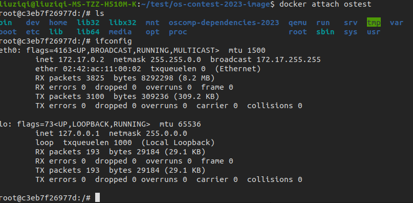

改容器的ssh配置（默认情况下是不允许root登陆的，比较坑的是它让你感觉像是密码输错了一样，反复试）https://www.codenong.com/cs107028736/

```bash
vim /etc/ssh/sshd_config
将#PermitRootLogin without-password改为PermitRootLogin yes，注意去掉#号
/etc/init.d/ssh restart
```


发现没有sshd_config就装一下  （ssh d里的d=daemon):

```bash
apt-get update
apt-get install openssh-server

```


```bash
apt install net-tools #安装网络服务
ifconfig 
# 172.17.0.2
ps -e | grep ssh #查看ssh服务是否启动
service ssh start # 启动ssh服务
```

可以在容器内用上图的IP试一下（ssh登陆一下自己）

在主机（远程服务器）：ssh 自己的 50003端口（已经映射到容器内的22号端口）

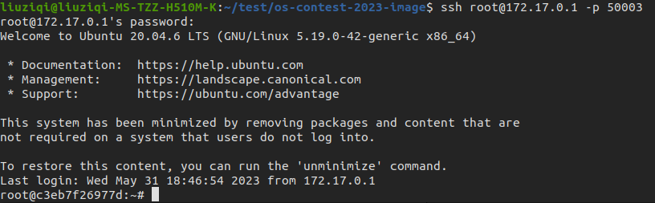

回到笔记本：

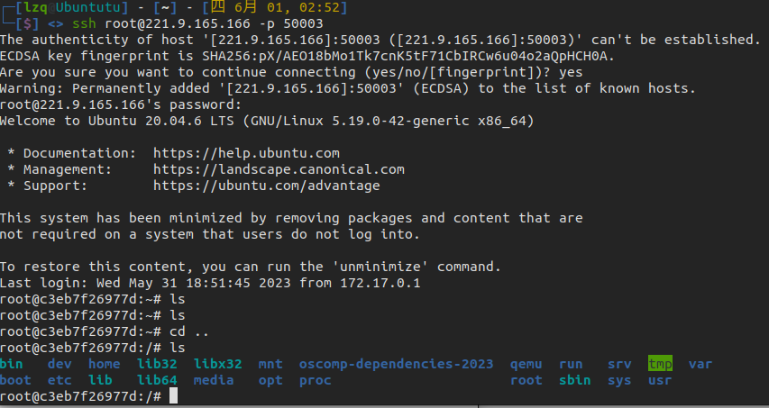


阶段1的评测环境镜像

docker run -it  --privileged --entrypoint bash alphamj/os-contest:v7.6 

-p  50003 : 22

### 多容器组网

Docker 容器的联网方式主要有以下几种：

1. **桥接网络（Bridge Network）**：
   - 默认的联网方式。
   - 每个 Docker 容器都会被分配一个私有的 IP 地址。
   - 容器在同一宿主机上可以通过这些 IP 地址相互访问。
2. **宿主机网络（Host Network）**：
   - 容器共享宿主机的网络。
   - 容器内的进程可以像在宿主机上一样进行网络通信。
3. **覆盖网络（Overlay Network）**：
   - 用于在多个 Docker 守护进程之间创建一个网络。
   - 容器可以分布在不同的宿主机上，但可以像在同一个网络中一样相互访问。
4. **Macvlan 网络**：
   - 允许容器拥有独立的 MAC 地址。
   - 容器看起来像宿主机网络上的物理设备。
5. **第三方网络插件**：
   - 如 Weave, Calico, Flannel 等，提供额外的网络功能和特性。

对于您的需求，即两台服务器上运行多组 Docker 容器，并且需要服务 Docker 与客户 Docker 之间通信，建议使用覆盖网络（Overlay Network）。以下是实现步骤：

1. **创建覆盖网络**：

   ```
   docker network create --driver overlay my_overlay
   ```

2. 在两台服务器上启动 Docker 容器时，指定创建的覆盖网络：

   ```
   docker run --network my_overlay ...
   ```

3. **连接到覆盖网络**：

   - 所有连接到 `my_overlay` 网络的容器将能够互相 ping 通和通信。

4. **配置服务发现**：

   - 根据需要配置服务发现机制，以便客户端能够找到服务端。

5. **安全设置**：

   - 根据需要配置网络的安全设置，比如加密通信等。

6. **端口映射**（如果需要从外部访问服务）：

   - 在运行容器时使用 `-p` 参数映射端口。

通过这种方式，您可以实现跨服务器的 Docker 容器之间的网络通信，并且能够灵活地扩展您的服务和客户端容器。

## SR-IOV

SR-IOV（Single Root I/O Virtualization，单根I/O虚拟化）

SR-IOV（Single Root I/O Virtualization，单根I/O虚拟化）是一种硬件虚拟化技术，让docker共享同一个硬件(例如网卡)

https://www.notion.so/ziqi-rocks-on-zns/Docker-RDMA-SR-IOV-2104cf47884c4062a51107c8e74d42f9


# Hexo

使用 Hexo搭建博客,  next主题： https://theme-next.js.org/docs/getting-started/

## Node.js

https://nodejs.org/zh-cn/download/prebuilt-binaries

```bash
tar -xvf node-v20.17.0-linux-x64.tar.xz
```

将 Node.js 安装到 `/usr/local` 目录下，因为它是一个标准的系统级软件安装位置。你可以使用 `mv` 命令来移动解压后的文件夹：

```bash
sudo mv node-v20.17.0-linux-x64 /usr/local
```

(注意版本号)

```bash
export PATH=/usr/local/node-v20.17.0-linux-x64/bin:$PATH
source ~/.zshrc  # 如果你使用的是 zsh
```


Node.js 是一种基于 JavaScript 的运行时环境，广泛应用于后端开发中。2024 年，Node.js 在以下几个方面表现突出：

1. **事件驱动架构**：Node.js 的事件驱动和非阻塞 I/O 模型，使其非常适合处理实时应用程序，如聊天平台、在线游戏、实时数据分析等。
2. **微服务和无服务器架构**：Node.js 非常适合微服务架构，能够将大型应用程序拆分为更小的、独立的服务，方便维护和扩展。同时，Node.js 在无服务器计算（如 AWS Lambda 和 Google Cloud Functions）中也表现优异，能够快速执行任务且无需管理服务器。
3. **TypeScript 的广泛应用**：TypeScript 通过为 JavaScript 增加静态类型检查，提升了代码的质量和可维护性。在大型 Node.js 项目中，TypeScript 的使用日益增多，成为开发人员的首选。
4. **GraphQL 的集成**：Node.js 与 GraphQL 的兼容性越来越强，GraphQL 提供了比传统 REST API 更高效的数据查询方式，能够根据需要获取精确数据，减少冗余。
5. **边缘计算**：Node.js 在边缘计算领域逐渐受到关注，通过将计算任务靠近数据源，降低延迟并优化带宽使用，特别适用于物联网（IoT）和内容分发网络（CDN）。
6. **安全性增强**：随着网络安全威胁的增加，Node.js 的安全性也不断提高。开发者被鼓励遵循最佳安全实践，如定期更新、漏洞扫描等，以构建更为安全的应用。

# SSH隧道

> 如何连接到校园网内的服务器（实验室的机器）
>
> 一台公网固定IP地址的外网服务器
>
> 能用ToDesk控制实验室的服务器
>
> 如何设置？
>
> 

要通过具有公网固定IP地址的外网服务器（liuziqi@221.9.165.166）跳转到位于校园网内部的内网服务器，可以设置一个反向SSH隧道。以下是详细步骤：

1. **在内网服务器上建立反向SSH隧道**

首先，确保您能够从内网服务器（校园网内的服务器）SSH连接到外网服务器。假设内网服务器的用户名是`user`，SSH服务在默认的22端口上运行。

在内网服务器上运行以下命令：
```bash
ssh -fN -R 2222:localhost:22 liuziqi@221.9.165.166
```
解释：
- `-f`：使SSH在后台运行。
- `-N`：不执行远程命令，仅转发端口。
- `-R 2222:localhost:22`：将外网服务器的2222端口转发到内网服务器的22端口（SSH端口）
- `liuziqi@221.9.165.166`：外网服务器的用户名和IP地址。

2. **确保外网服务器允许端口转发**

在外网服务器（221.9.165.166）上，确保SSH配置允许反向隧道。编辑`/etc/ssh/sshd_config`文件，确保以下选项未被注释且设置为`yes`：	
```bash
AllowTcpForwarding yes
GatewayPorts yes
```
修改后，重启SSH服务：
```bash
sudo systemctl restart sshd
```

### 3. 从外网服务器连接到内网服务器

一旦隧道建立，您可以从任何地方通过连接外网服务器的2222端口来访问内网服务器。在外网服务器或其他机器上运行以下命令：
```bash
ssh -p 2222 user@localhost
```
解释：
- `-p 2222`：连接到外网服务器的2222端口。
- `user@localhost`：通过隧道连接到内网服务器的用户名和本地地址。

### 示例场景

1. **在内网服务器上建立隧道**：
   ```bash
   ssh -fN -R 2222:localhost:22 liuziqi@221.9.165.166
   ```

2. **在外网服务器上确保允许端口转发**：
   编辑`/etc/ssh/sshd_config`文件，确认以下内容：
   ```bash
   AllowTcpForwarding yes
   GatewayPorts yes
   ```
   然后重启SSH服务：
   ```bash
   sudo systemctl restart sshd
   ```

3. **从外网服务器或其他机器连接到内网服务器**：
   ```bash
   ssh -p 2222 user@localhost
   ```

通过这些步骤，您可以通过具有公网IP的外网服务器（221.9.165.166）安全地访问位于校园网内部的内网服务器。


# 装机配置

## win+U双系统安装

用`rufus-3.17.exe`和`Ubuntu20.04`镜像制作系统盘BIOS F12

联想小新pro14开机F12设USB启动为最高优先级,选磁盘分区,安装

lzq 		1209

root	   1209

### 时间不同步？

[^csdn]:  https://blog.csdn.net/yuan_chen_/article/details/104454820?spm=1001.2101.3001.6661.1&utm_medium=distribute.pc_relevant_t0.none-task-blog-2%7Edefault%7ECTRLIST%7ERate-1.pc_relevant_paycolumn_v3&depth_1-utm_source=distribute.pc_relevant_t0.none-task-blog-2%7Edefault%7ECTRLIST%7ERate-1.pc_relevant_paycolumn_v3&utm_relevant_index=1

​		计算机上安装Ubuntu 和Win10双系统后，会出现时间不同步现象，原因是Ununtu会认为Bios硬件时间是UTC时间（Universal Time Coordinated，北京时间比UTC时间早八个小时）进而修改Bios时间，Win10认为Bios硬件时间是本地时间（北京时间），从而双系统切换后时间不同步。

​		简单的解决方案是，修改Win10对BIos硬件时间的对待方式，让Win10把硬件时间当做UTC，方案如下：以管理员权限开启CMD（命令提示符），然后输入：

```cmd
Reg add HKLM\SYSTEM\CurrentControlSet\Control\TimeZoneInformation /v RealTimeIsUniversal /t REG_DWORD /d 1
```

接下来重启计算机即可。

### 连接不上dl.google.com

测速网站，找个好IP

https://tool.chinaz.com/speedtest/dl.google.com

修改/etc/hosts，例如

```
220.181.174.97 dl.google.com
```


```
20.205.243.166 github.com
```


### 美化桌面

https://zhuanlan.zhihu.com/p/176977192?ivk_sa=1024320u

```bash
sudo apt install gnome-tweaks chrome-gnome-shell
```

gnome 插件[extensions.gnome.org](https://link.zhihu.com/?target=https%3A//extensions.gnome.org)

搜索并下载

- user themes
- dash to dock

dash to dock 卸载设置完就卸载掉

如果出现两个dock的bug就卸载系统dock

```
sudo apt-get remove gnome-shell-extension-ubuntu-dock
```

### 

- 主题包：WhiteSur Gtk Theme

- - [https://www.gnome-look.org/p/1403328/](https://link.zhihu.com/?target=https%3A//www.gnome-look.org/p/1403328/)

- Icons 图标：WhiteSur icon theme

- - [https://www.pling.com/p/1405756/](https://link.zhihu.com/?target=https%3A//www.pling.com/p/1405756/)

```
sudo apt install plank
```

### 美化引导界面——grub

https://www.gnome-look.org/browse/cat/109/order/latest/

找个主题，直接在Download里解压了。./install.sh直接安装好了

https://blog.csdn.net/u011054333/article/details/53314504/

## 双系统设备问题

### 滚轮速度

1.安装：

```
sudo apt-get install imwheel
```

2.设置滚动速度：sudo vim ~/.imwheelrc, 然后添加配置内容：

```bash
".*"
None,      Up,   Button4, 3
None,      Down, Button5, 3
Control_L, Up,   Control_L|Button4
Control_L, Down, Control_L|Button5
Shift_L,   Up,   Shift_L|Button4
Shift_L,   Down, Shift_L|Button5
```

前两行就分别对应上滚和下滚的速度（行数），把数值5设置为合适的值。

3.启动imwheel

        直接在终端输入命令imwheel即可，如果本来已经运行，修改数值后可以先执行killall imwheel，然后就可以立即生效。

发现鼠标侧键实效了，不用了。

​                

### 开机键盘失灵

https://blog.csdn.net/qq_40716069/article/details/128046176

vim /etc/default/grub

```
GRUB_CMDLINE_LINUX_DEFAULT="quiet splash i8042.dumbkbd"
```

sudo update-grub

### 开机自动挂载Windows磁盘

查看所有磁盘

```
df -h
```

查看磁盘ID

```console
sudo blkid
```

UUID=EA4AB9BE4AB98839C

UUID=68C62C1DC62BE9D0

vim /etc/fstab

```
# my Windows-C
UUID=EA4AB9BE4AB98839   /media/lzq/Windows-SSD  ntfs    defaults        0       2
# my Windows-D
UUID=68C62C1DC62BE9D0  /media/lzq/Data  ntfs    defaults        0       2
```

#### 自动挂载设备为只读模式(Read-Only)的解决方案

ntfsfix /dev/nvme0n1p3

然后再重新挂载一下就好了


## **科学上网**


#### Q2ray：

https://www.hm1006.cn/archives/qv2ray

下载内核：  v2ray-linux-64.zip https://github.com/v2fly/v2ray-core/releases/tag/v4.31.0
下载qv2ray 内核文件夹改名成core /home/lzq/.config/qv2ray/vcore/v2ray

#### clash

```bash
# 创建文件夹
cd && mkdir clash
cd clash

# 下载 Clash 文件
wget https://github.com/Dreamacro/clash/releases/download/v1.14.0/clash-linux-amd64-v1.14.0.gz

# 解压文件
gzip -d clash-linux-amd64-v1.14.0.gz

# 给予权限
chmod +x clash-linux-amd64-v1.14.0
```

导入订阅：

```bash
wget -O config.yaml 订阅地址
```

配置手动代理


访问：

**http://clash.razord.top/**


新的clash for linux 

https://github.com/Elegycloud/clash-for-linux-backup

下载项目

```
$ git clone https://github.com/wanhebin/clash-for-linux.git
```

进入到项目目录，编辑`.env`文件，修改变量`CLASH_URL`的值。

```
$ cd clash-for-linux
$ vim .env
```

> **注意：** `.env` 文件中的变量 `CLASH_SECRET` 为自定义 Clash Secret，值为空时，脚本将自动生成随机字符串。


直接运行脚本文件`start.sh`

```
$ cd clash-for-linux
```

运行启动脚本

```
$ sudo bash start.sh

正在检测订阅地址...
Clash订阅地址可访问！                                      [  OK  ]

正在下载Clash配置文件...
配置文件config.yaml下载成功！                              [  OK  ]

正在启动Clash服务...
服务启动成功！                                             [  OK  ]

Clash Dashboard 访问地址：http://<ip>:9090/ui
Secret：xxxxxxxxxxxxx

请执行以下命令加载环境变量: source /etc/profile.d/clash.sh

请执行以下命令开启系统代理: proxy_on

若要临时关闭系统代理，请执行: proxy_off
```


```
$ source /etc/profile.d/clash.sh
$ proxy_on
```


- 检查服务端口

```
$ netstat -tln | grep -E '9090|789.'
tcp        0      0 127.0.0.1:9090          0.0.0.0:*               LISTEN     
tcp6       0      0 :::7890                 :::*                    LISTEN     
tcp6       0      0 :::7891                 :::*                    LISTEN     
tcp6       0      0 :::7892                 :::*                    LISTEN
```


- 检查环境变量

```
$ env | grep -E 'http_proxy|https_proxy'
http_proxy=http://127.0.0.1:7890
https_proxy=http://127.0.0.1:7890
```


## 重启程序


如果需要对Clash配置进行修改，请修改 `conf/config.yaml` 文件。然后运行 `restart.sh` 脚本进行重启。

> **注意：** 重启脚本 `restart.sh` 不会更新订阅信息。


## 停止程序


- 进入项目目录

```
$ cd clash-for-linux
```


- 关闭服务

```
$ sudo bash shutdown.sh

服务关闭成功，请执行以下命令关闭系统代理：proxy_off
```


```
$ proxy_off
```


然后检查程序端口、进程以及环境变量`http_proxy|https_proxy`，若都没则说明服务正常关闭。


## Clash Dashboard


- 访问 Clash Dashboard

通过浏览器访问 `start.sh` 执行成功后输出的地址，例如：http://192.168.0.1:9090/ui

- 登录管理界面

在`API Base URL`一栏中输入：http://<ip>:9090 ，在`Secret(optional)`一栏中输入启动成功后输出的Secret。

点击Add并选择刚刚输入的管理界面地址，之后便可在浏览器上进行一些配置。

- 更多教程

此 Clash Dashboard 使用的是[yacd](https://github.com/haishanh/yacd)项目，详细使用方法请移步到yacd上查询。

## 更新软件源

1.备份原来的源，将以前的源备份一下，以防以后可以用的。

sudo cp /etc/apt/sources.list /etc/apt/sources.list.bak

2.sudo vim /etc/apt/sources.list

```bash
#添加阿里源
deb http://mirrors.aliyun.com/ubuntu/ focal main restricted universe multiverse
deb-src http://mirrors.aliyun.com/ubuntu/ focal main restricted universe multiverse
deb http://mirrors.aliyun.com/ubuntu/ focal-security main restricted universe multiverse
deb-src http://mirrors.aliyun.com/ubuntu/ focal-security main restricted universe multiverse
deb http://mirrors.aliyun.com/ubuntu/ focal-updates main restricted universe multiverse
deb-src http://mirrors.aliyun.com/ubuntu/ focal-updates main restricted universe multiverse
deb http://mirrors.aliyun.com/ubuntu/ focal-proposed main restricted universe multiverse
deb-src http://mirrors.aliyun.com/ubuntu/ focal-proposed main restricted universe multiverse
deb http://mirrors.aliyun.com/ubuntu/ focal-backports main restricted universe multiverse
deb-src http://mirrors.aliyun.com/ubuntu/ focal-backports main restricted universe multiverse
#添加清华源
deb https://mirrors.tuna.tsinghua.edu.cn/ubuntu/ focal main restricted universe multiverse
# deb-src https://mirrors.tuna.tsinghua.edu.cn/ubuntu/ focal main restricted universe multiverse
deb https://mirrors.tuna.tsinghua.edu.cn/ubuntu/ focal-updates main restricted universe multiverse
# deb-src https://mirrors.tuna.tsinghua.edu.cn/ubuntu/ focal-updates main restricted universe multiverse
deb https://mirrors.tuna.tsinghua.edu.cn/ubuntu/ focal-backports main restricted universe multiverse
# deb-src https://mirrors.tuna.tsinghua.edu.cn/ubuntu/ focal-backports main restricted universe multiverse
deb https://mirrors.tuna.tsinghua.edu.cn/ubuntu/ focal-security main restricted universe multiverse
# deb-src https://mirrors.tuna.tsinghua.edu.cn/ubuntu/ focal-security main restricted universe multiverse multiverse
```

3.更新

```bash
sudo apt-get update
```


## oh-my-zsh

apt-get安装：
curl
zsh
git
vim

```
sudo apt-get install vim git curl zsh 
```

安装oh-my-zsh

```text
sh -c "$(curl -fsSL https://raw.github.com/robbyrussell/oh-my-zsh/master/tools/install.sh)"
```

（卸载时，还有uninstall.sh可以用）


> 解决：raw.githubusercontent.com连不上，修改/etc/hosts文件

[raw.githubusercontent.com](https://link.zhihu.com/?target=http%3A//raw.githubusercontent.com/)解析的IP地址为151.101.76.133

修改hosts文件

```text
vim /etc/hosts

# 在最后一行添加
151.101.76.133 raw.githubusercontent.com
```


配置：

```
vim ~/.zshrc
```

有一些插件需要下载：

```bash
#高亮
git clone https://github.com/zsh-users/zsh-syntax-highlighting.git ${ZSH_CUSTOM:-~/.oh-my-zsh/custom}/plugins/zsh-syntax-highlighting
#历史记录
git clone https://github.com/zsh-users/zsh-autosuggestions $ZSH_CUSTOM/plugins/zsh-autosuggestions
```

​	

.zshrc:

```
# my path config
export GOROOT=$HOME/sdk/go1.20.4
export PATH=$PATH:$GOROOT/bin
export GOPATH=$HOME/Go


# If you come from bash you might have to change your $PATH.
# export PATH=$HOME/bin:/usr/local/bin:$PATH

# Path to your oh-my-zsh installation.
export ZSH="$HOME/.oh-my-zsh"

# Set name of the theme to load --- if set to "random", it will
# load a random theme each time oh-my-zsh is loaded, in which case,
# to know which specific one was loaded, run: echo $RANDOM_THEME
# See https://github.com/ohmyzsh/ohmyzsh/wiki/Themes
ZSH_THEME="random"

# Set list of themes to pick from when loading at random
# Setting this variable when ZSH_THEME=random will cause zsh to load
# a theme from this variable instead of looking in $ZSH/themes/
# If set to an empty array, this variable will have no effect.
# ZSH_THEME_RANDOM_CANDIDATES=( "robbyrussell" "agnoster" )

# Uncomment the following line to use case-sensitive completion.
# CASE_SENSITIVE="true"

# Uncomment the following line to use hyphen-insensitive completion.
# Case-sensitive completion must be off. _ and - will be interchangeable.
# HYPHEN_INSENSITIVE="true"

# Uncomment one of the following lines to change the auto-update behavior
# zstyle ':omz:update' mode disabled  # disable automatic updates
# zstyle ':omz:update' mode auto      # update automatically without asking
# zstyle ':omz:update' mode reminder  # just remind me to update when it's time

# Uncomment the following line to change how often to auto-update (in days).
# zstyle ':omz:update' frequency 13

# Uncomment the following line if pasting URLs and other text is messed up.
# DISABLE_MAGIC_FUNCTIONS="true"

# Uncomment the following line to disable colors in ls.
# DISABLE_LS_COLORS="true"

# Uncomment the following line to disable auto-setting terminal title.
# DISABLE_AUTO_TITLE="true"

# Uncomment the following line to enable command auto-correction.
# ENABLE_CORRECTION="true"

# Uncomment the following line to display red dots whilst waiting for completion.
# You can also set it to another string to have that shown instead of the default red dots.
# e.g. COMPLETION_WAITING_DOTS="%F{yellow}waiting...%f"
# Caution: this setting can cause issues with multiline prompts in zsh < 5.7.1 (see #5765)
# COMPLETION_WAITING_DOTS="true"

# Uncomment the following line if you want to disable marking untracked files
# under VCS as dirty. This makes repository status check for large repositories
# much, much faster.
# DISABLE_UNTRACKED_FILES_DIRTY="true"

# Uncomment the following line if you want to change the command execution time
# stamp shown in the history command output.
# You can set one of the optional three formats:
# "mm/dd/yyyy"|"dd.mm.yyyy"|"yyyy-mm-dd"
# or set a custom format using the strftime function format specifications,
# see 'man strftime' for details.
# HIST_STAMPS="mm/dd/yyyy"

# Would you like to use another custom folder than $ZSH/custom?
# ZSH_CUSTOM=/path/to/new-custom-folder

# Which plugins would you like to load?
# Standard plugins can be found in $ZSH/plugins/
# Custom plugins may be added to $ZSH_CUSTOM/plugins/
# Example format: plugins=(rails git textmate ruby lighthouse)
# Add wisely, as too many plugins slow down shell startup.
plugins=(git
	 pip
 	 sudo
	 zsh-syntax-highlighting
 	 last-working-dir
	 zsh-autosuggestions
 	)

source $ZSH/oh-my-zsh.sh

# User configuration

# export MANPATH="/usr/local/man:$MANPATH"

# You may need to manually set your language environment
# export LANG=en_US.UTF-8

# Preferred editor for local and remote sessions
# if [[ -n $SSH_CONNECTION ]]; then
#   export EDITOR='vim'
# else
#   export EDITOR='mvim'
# fi

# Compilation flags
# export ARCHFLAGS="-arch x86_64"

# Set personal aliases, overriding those provided by oh-my-zsh libs,
# plugins, and themes. Aliases can be placed here, though oh-my-zsh
# users are encouraged to define aliases within the ZSH_CUSTOM folder.
# For a full list of active aliases, run `alias`.
#
# Example aliases
# alias zshconfig="mate ~/.zshrc"
# alias ohmyzsh="mate ~/.oh-my-zsh"
```


主题设成"ys"
加自动补齐插件


安装vtune //和chrome都在/opt中


`https://blog.csdn.net/qq_44926567/article/details/113034100`

但是我启用的是1.0.0版本,启用完了powershell字体都变了…

我发现文档里多了powershell/moudle/PSReadline 1.2.0的安装包, 按照这个路径重新操作了一遍

## SSH

SCP拒绝

>scp Permission denied, please try again.

解决办法，修改/etc/[ssh](https://so.csdn.net/so/search?q=ssh&spm=1001.2101.3001.7020)/sshd_config

```
# Authentication:

LoginGraceTime 120
PermitRootLogin yes  #修改这一行为yes
StrictModes yes
```

重启: systemctl restart ssh.service

42

```
ssh-keygen -t rsa -C "lzq1"
ssh-copy-id root@10.10.10.5
```


## 关于安装包管理

qemu-misc

gcc-linux-riscv-

llvm

clang


https://blog.csdn.net/u014259503/article/details/82593373
Linux的

RPM包

    就相当于windows的镜像文件，改配置的文件大部分都配置好了，所以安装相对简单

RPM包安装去向（例:包名=>redis）

    rpm -ql 包名： 查看redis都安装到什么地方，会列出所有文件的路径。 
    rpm -qa | grep 包名： 看看*redis*有没有安装 ，‘rpm -qa redis’看看redis有没有安装，会有名称打印出来：redis-3.2.3-1.el7.x86_64

DEB包 （例:包名=>redis）

    dpkg -L 包名：查看redis。 
    dpkg -l | grep 包名： 看看*redis*有没有安装， dpkg -l redis 看看redis有没有安装 
    whereis redis：查看redis的安装目录
    which redis：查看redis文件夹的地址

### tar命令：


#### Ubuntu中无法打开Appimage文件？

:属性-权限-允许执行文件

# 用户管理

创建用户

新建用户

```bash
sudo adduser lzq
```

设置sudo密码

```bash
sudo passwd 	 
```

用户执行不了sudo

>lzq is not in the sudoers file.  This incident will be reported.

```
sudo usermod -aG sudo lzq
```

其他:

`users`

`who `

`ps -a` 

### auditd监控用户的修改

安装`auditd`（审计守护进程）

```
# 监控 /etc 目录下的文件，记录写操作 (w) 和属性修改 (a) 操作
sudo auditctl -w /etc/ -p wa -k system_config_change
```

为了确保系统重启后规则依然生效，你需要将这些规则添加到 `/etc/audit/rules.d/audit.rules` 文件中。打开文件并添加以下内容：

```bash
-w /etc/ -p wa -k system_config_change
```


**解释**：

- `-w /etc/`：监控 `/etc/` 目录下的所有文件。
- `-p wa`：监控写操作 (`w`) 和属性更改 (`a`) 操作。你还可以添加 `r` 来监控读取操作，或 `x` 监控执行操作。
- `-k system_config_change`：为这条规则指定一个关键字 `system_config_change`，方便后续查询。


**查看修改日志**：

当某人修改了这些配置文件后，你可以使用以下命令来查询日志，查看谁修改了配置文件：

```
sudo ausearch -k system_config_change
```

这条命令会列出所有触发了 `system_config_change` 关键字的审计事件，显示哪些用户进行了修改操作。


# 常用命令(已经没有意义了)

```bash
cd -	#回到刚才的目录 cd = change	directory
~ 		#等价于\home\liuziqi
```

```bash
ls -lah 
	#-l: list
	#-a: all	显示所有东西(包括隐藏文件)
	#-h: 		高可读性
```

```bash
pwd 
#打印当前路径
```

```bash
mkdir myfolder
#在当前路径创建目录myfolder
mkdir -p a/b/c
#创建多层目录
```

```bash
touch
#将某文件的修改时间改为当前时间,假装"碰"了一下
#当这个文件不存在的时候就会自动创建一个了
```

```bash
rm -f #f=force
rm -rf #删文件夹跑路
```

查询

```bash
find
grep
#
-i：忽略大小写
-n：输出关键字行号
-v：取反，不输出包含关键字内容
-r：递归查找，用于查找多个文件是否包含某个关键字
-E：使用正则表达式
 
-A{num}：额外输出关键字下面 num 行
-B{num}：额外输出关键字上面 num 行
-C{num}：额外输出关键字上/下各 num 行，也可以直接使用 -{num}
 
-c：计算关键字行数
-h：不显示文件名
-l：仅输出符合关键字文件名
-L：输出不符合关键字文件名

```

查看内核版本

```bash
uname -a		
```

检查内存保留区是否设置成功

```bash
sudo cat /proc/iomem
```


## I/O观察

实时观察：htop


### iostat_观察io开销

https://zhuanlan.zhihu.com/p/649946956

```bash
iostat -d -k 1 10         #查看TPS和吞吐量信息(磁盘读写速度单位为KB)，每1s收集1次数据，共收集10次
iostat -d -m 2            #查看TPS和吞吐量信息(磁盘读写速度单位为MB)，每2s收集1次数据
iostat -d -x -k 1 10      #查看设备使用率（%util）、响应时间（await）等详细数据， 每1s收集1次数据，总共收集10次 
iostat -c 1 10            #查看cpu状态，每1s收集1次数据，总共收集10次
```

iostat输出内容分析

在linux命令行中输入iostat，通常将会出现下面的输出：

```text
[root@localhost ~]# iostat
Linux 5.14.0-284.11.1.el9_2.x86_64 (localhost.localdomain)      08/07/2023      _x86_64_        (4 CPU)

avg-cpu:  %user   %nice %system %iowait  %steal   %idle
           0.31    0.01    0.44    0.02    0.00   99.22

Device             tps    kB_read/s    kB_wrtn/s    kB_dscd/s    kB_read    kB_wrtn    kB_dscd
dm-0              3.19        72.63        35.90         0.00     202007      99835          0
dm-1              0.04         0.84         0.00         0.00       2348          0          0
nvme0n1           3.36        93.22        36.64         0.00     259264     101903          0
sr0               0.02         0.75         0.00         0.00       2096          0          0
```

首先第一行：

```text
Linux 5.14.0-284.11.1.el9_2.x86_64 (localhost.localdomain)      08/07/2023      _x86_64_        (4 CPU)
```

Linux 5.14.0-284.11.1.el9_2.x86_64是内核的版本号，localhost.localdomain则是主机的名字， `08/07/2023`当前的日期， _x86_64_是CPU的架构， (4 CPU)显示了当前系统的CPU的数量。

接着看第二部分，这部分是CPU的相关信息，其实和**top命令**的输出是类似的。

```text
avg-cpu:  %user   %nice %system %iowait  %steal   %idle
           0.31    0.01    0.44    0.02    0.00   99.22
```

cpu属性值说明：

- %user：CPU处在用户模式下的时间百分比。
- %nice：CPU处在带NICE值的用户模式下的时间百分比。
- %system：CPU处在系统模式下的时间百分比。
- %iowait：CPU等待输入输出完成时间的百分比。
- %steal：管理程序维护另一个虚拟处理器时，虚拟CPU的无意识等待时间百分比。
- %idle：CPU空闲时间百分比。

iowait这个指标有点说法。


### head

> linux输出结果太多了，怎么控制只显示输出结果的前10行?

在 Linux 终端中，你可以使用管道（pipe）和命令行工具来控制输出结果的显示数量。以下是几种常用的方法：

1. 使用 `head` 命令：`head` 命令用于显示文件或标准输入的开头部分，默认情况下显示前10行。你可以将输出结果通过管道传递给 `head` 命令来限制显示的行数。例如：

复制

```
你的命令 | head
```

将 "你的命令" 替换为你要执行的实际命令。

1. 使用带参数的 `head` 命令：如果你想要显示除前10行之外的更少行数，可以使用 `n` 参数指定行数。例如，要显示前5行：

复制

```
你的命令 | head -n 5
```

1. 使用 `grep` 命令：如果你只想显示输出结果中包含特定内容的前10行，可以结合使用 `grep` 和 `head` 命令。例如，要显示包含关键词 "keyword" 的前10行：

复制

```
你的命令 | grep "keyword" | head
```

这些方法可以帮助你在 Linux 终端中控制输出结果的显示数量，并根据需要进行调整。请根据你的具体需求选择适合的方法。


### 查看当前进程打开的文件

```
lsof -p [Process_ID]
```


```
strace -f -e trace=file -p [Process_ID]
```


### 查看目录创建时间

```bash
 #检查文件夹创建时间,发现waltz的头文件includ的确实是以前跑ROCKSDB的时候生成的
 stat -c '%w' /usr/local/include/rocksdb 
```


### 代码审查

查看代码有效行数：=loccount


##  用户管理

创建用户

```bash
sudo adduser lzq
```


设置sudo密码

```bash
sudo passwd 	
```

用户执行不了sudo

>lzq is not in the sudoers file.  This incident will be reported.

```
sudo usermod -aG sudo lzq
```

其他相关:

`users`

`who `

`ps -a` 


> 在 Ubuntu 系统中，你可以使用多个命令来查看最近登录的用户。以下是一些常用方法：

使用 `last` 命令

`last` 命令会显示最近登录的用户信息。它从 `/var/log/wtmp` 文件中读取数据。

```bash
last
```

输出示例：

```
user1    pts/0        192.168.1.100    Tue May 25 10:24   still logged in
user2    pts/1        192.168.1.101    Tue May 25 09:12 - 09:30  (00:18)
user1    pts/2        192.168.1.102    Tue May 25 08:30 - 09:10  (00:40)
```

- **user1** 和 **user2** 是用户名。
- **pts/0** 等是登录终端。
- **192.168.1.100** 等是用户登录时使用的 IP 地址。
- **时间信息** 显示了用户的登录时间和时长。

使用 `who` 命令

`who` 命令显示当前登录的用户信息。

```bash
who
```

输出示例：

```
user1    pts/0        2024-05-31 10:24 (192.168.1.100)
user2    pts/1        2024-05-31 09:12 (192.168.1.101)
```

- **user1** 和 **user2** 是当前登录的用户。
- **pts/0** 等是登录终端。
- **2024-05-31 10:24** 是用户的登录时间。
- **192.168.1.100** 是用户登录时使用的 IP 地址。

使用 `lastlog` 命令

`lastlog` 命令显示所有用户上次登录的信息。它从 `/var/log/lastlog` 文件中读取数据。

```bash
lastlog
```

输出示例：

```
Username         Port     From             Latest
root             tty1                      Sun May 30 11:54:42 +0000 2024
user1            pts/0    192.168.1.100    Tue May 25 10:24:00 +0000 2024
user2            pts/1    192.168.1.101    Tue May 25 09:12:00 +0000 2024
```

- **Username** 是用户名。
- **Port** 是登录终端。
- **From** 是登录时的 IP 地址。
- **Latest** 是上次登录时间。

 使用 `journalctl` 命令查看日志

`journalctl` 命令可以查看系统日志，包括 SSH 登录记录。

```bash
journalctl -u ssh
```

或查看最近的日志条目：

```bash
journalctl -u ssh -n 50
```

- **-u ssh** 过滤与 SSH 服务相关的日志。
- **-n 50** 显示最近的 50 条日志。


hostnamectl	这个命令不仅会显示系统的主机名，还会显示操作系统的相关信息。

# 环境变量、自启动脚本

## 环境

#### Go

Goenv： home/lzq/sdk/go

GoPATH ： home/lzq/Go

Go的下载目录放在HOME下了

#### conda

home/miniconda3

https://blog.csdn.net/weixin_44119391/article/details/128577681

下载地址：https://repo.anaconda.com/archive/

conda也在home下，直接运行sh

#### 配置pytorch

#### 连接不上dl.google.com

测速网站，找个好IP

https://tool.chinaz.com/speedtest/dl.google.com

修改/etc/hosts，例如

```
220.181.174.97 dl.google.com
```


```
20.205.243.166 github.com
```


## 环境变量

（推荐） 修改用户主目录下的.bashrc文件 （用了zsh就改.zshrc)

/etc/profile : 在登录时,操作系统定制用户环境时使用的第一个文件 ,此文件为系统的每个用户设置环境信息,当用户第一次登录时,该文件被执行。 

/etc /environment : 在登录时操作系统使用的第二个文件, 系统在读取你自己的profile前,设置环境文件的环境变量。 

~/.profile : 在登录时用到的第三个文件 是.profile文件,每个用户都可使用该文件输入专用于自己使用的shell信息,当用户登录时,该文件仅仅执行一次!默认情况下,他设置一些环境变量,执行用户的.bashrc文件。 

/etc/bashrc : 为每一个运行bash shell的用户执行此文件.当bash shell被打开时,该文件被读取. 

~/.bashrc : 该文件包含专用于你的bash shell的bash信息,当登录时以及每次打开新的shell时,该该文件被读取。 


> 切换sudo以后，环境变量会变，解决：

这是因为在 `sudo` 的默认配置中，`secure_path` 设置会覆盖你的 `PATH` 环境变量。通过以下步骤禁用 `secure_path`，或将需要的环境变量路径添加到 `secure_path` 中。

修改 `sudoers` 文件：

```
sudo visudo
```

在文件中找到类似如下的行，注释掉

```
Defaults secure_path="/usr/local/sbin:/usr/local/bin:/usr/sbin:/usr/bin:/sbin:/bin"
```

### 3. 解决方案：

## 开机自启脚本&service

开机自动挂载：`/etc/fstab`


开机启动脚本：`/etc/rc.local`


创建一个新的 systemd 服务文件, 例如 `/etc/systemd/system/***.service`。

1. 在该文件中添加以下内容：

```
iniCopy code[Unit]
Description=Configure Hugepages

[Service]
Type=oneshot
ExecStart=/bin/bash -c "echo 5 > /sys/kernel/mm/hugepages/hugepages-1048576kB/nr_hugepages"

[Install]
WantedBy=multi-user.target
```

1. 重新加载 systemd 配置并启用服务：

```
bashCopy codesudo systemctl daemon-reload
sudo systemctl enable hugepages.service
sudo systemctl start hugepages.service
```

这样，在每次系统启动时，都会自动应用您的大页内存设置。

## 配置HugePage

```bash
# 需要1G大小的 Huge Page 先来5个
su root 
echo 5 > /sys/kernel/mm/hugepages/hugepages-1048576kB/nr_hugepages

```

这个错误表明虽然您已经预留了大页内存，但系统中没有为这些大页大小挂载的 `hugetlbfs` 文件系统。`hugetlbfs` 是 Linux 下用于管理大页内存的一种特殊文件系统，能够提供对大页的直接访问。解决这个问题需要您手动挂载 `hugetlbfs`，以便系统和应用能够使用预留的大页。

#### 1. 创建挂载点

首先，您需要为每种大页大小创建一个挂载点。通常，这些挂载点位于 `/dev/hugepages` 或 `/mnt/huge`，但您可以根据需要选择不同的位置。例如，对于 2MB 和 1GB 大页：

```bash
sudo mkdir -p /dev/hugepages-2MB
sudo mkdir -p /dev/hugepages-1GB
```

#### 2. 挂载 `hugetlbfs`

然后，使用 `mount` 命令将 `hugetlbfs` 文件系统挂载到这些挂载点。为每种大页大小指定正确的 `pagesize`：

```bash
sudo mount -t hugetlbfs -o pagesize=2M hugetlbfs /dev/hugepages-2MB
sudo mount -t hugetlbfs -o pagesize=1G hugetlbfs /dev/hugepages-1GB
```

#### 3. 验证挂载

使用 `mount` 或 `df -h` 命令来确认 `hugetlbfs` 已经正确挂载：

```bash
mount | grep hugetlbfs
```

或者：

```bash
df -h | grep hugetlbfs
```

您应该能看到您的 `hugetlbfs` 挂载。

#### 4. 持久化挂载配置(暂不)

为了确保在系统重启后 `hugetlbfs` 挂载依然有效，您需要将挂载信息添加到 `/etc/fstab` 文件中。打开 `/etc/fstab` 文件并添加以下行：

```fstab
hugetlbfs /dev/hugepages-2MB hugetlbfs pagesize=2M 0 0
hugetlbfs /dev/hugepages-1GB hugetlbfs pagesize=1G 0 0
```

保存文件并关闭编辑器。这将确保在每次系统启动时自动挂载 `hugetlbfs`。

#### 注意

确保您的系统和应用配置正确，并且它们能够访问和	使用新挂载的大页内存。如果您的应用特定地需要使用某种大小的大页，还需要检查应用的配置，确保它指向正确的大页内存和 `hugetlbfs` 挂载点。


## 编写Shell

在 Bash 脚本中，`>` 和 `2>` 是重定向操作符，而 `/dev/null` 是一个特殊的文件，表示空设备。这些组件一起使用，可以控制脚本命令的输出。具体来说：

- **管道符 (`|`)**：用于将一个命令的输出作为另一个命令的输入。在您提供的脚本片段中没有直接使用管道符，但在 Bash 脚本中它是常见的数据流控制符。
- **`>`**：用于将标准输出（stdout）重定向到一个文件或设备。在脚本中，如果一个命令后跟 `> /dev/null`，表示将该命令的输出重定向到 `/dev/null`，即忽略输出。
- **`2>`**：用于将标准错误（stderr）重定向到一个文件或设备。与 `>` 类似，如果使用 `2> /dev/null`，表示将错误信息重定向到 `/dev/null`，即忽略错误信息。
- **`/dev/null`**：是一个特殊的设备文件，通常被称为“空设备”。写入到 `/dev/null` 的任何内容都会被丢弃，读取 `/dev/null` 时会立即返回文件结束（EOF）。它通常用于丢弃不需要的输出。

因此，当您看到 `> /dev/null 2> /dev/null` 这样的组合时，它的意思是：

- `> /dev/null`：将命令的标准输出重定向到 `/dev/null`，即不显示命令的正常输出。
- `2> /dev/null`：将命令的错误输出也重定向到 `/dev/null`，即不显示命令的错误信息。

这种做法常用于那些您不关心其输出或错误信息的命令，或者当您想让脚本运行得更“安静”时。在您的脚本例子中，`$SPDK_DIR/setup.sh reset > /dev/null 2> /dev/null` 表示执行 SPDK 的 `setup.sh` 脚本的 `reset` 操作，但是忽略所有正常和错误的输出信息。


### 保存上一条命令的输出

1. **使用`!!`和重定向**:
   如果你刚刚运行了一个命令，想要快速地将其输出重定向到文件，你可以使用`!!`来代表上一个命令，然后将输出重定向到文件中。例如：
   ```bash
   !! > output.txt
   ```
   这将执行你上一个运行的命令，并将输出保存到`output.txt`。

2. **命令行历史和手动重定向**:
   如果你已知道你想保存的命令是什么，你可以简单地重新运行该命令并添加重定向。例如，如果你知道你最后运行的命令是`ls -l`，你可以重新输入：
   ```bash
   ls -l > output.txt
   ```

### 使用终端仿真器的功能

1. **手动复制和粘贴**:
   大多数现代终端都支持通过鼠标选择文本，然后你可以手动复制这些文本到剪贴板，接着粘贴到一个文本编辑器中并保存。这虽然是手动操作，但对于捕获少量数据非常有效。

2. **使用终端日志功能**:
   某些终端仿真器（如PuTTY、iTerm2等）允许你保存会话日志。如果你启用了这个功能，你的会话输出将被自动保存到文件中。对于以后的分析，这个方法特别有用，尤其是当你在事后才想到需要保存输出的时候。

### 使用屏幕捕获工具

1. **Tmux或Screen**:
   如果你使用`tmux`或`GNU Screen`等终端复用器，你可以利用这些工具的滚动缓冲区和复制模式来选择和保存历史输出。例如，在`tmux`中，你可以按`[`,然后使用方向键上翻历史，按`空格`开始选择，`Enter`结束选择并复制到`tmux`的缓冲区，然后可以粘贴到一个文件中。

这些方法可以帮助你捕获和保存上一个命令的输出，即使在命令执行后才想到要这么做。选择哪种方法取决于你的具体需求、可用的工具以及你对这些工具的熟悉程度。


#  磁盘、分区、文件系统

**dd_模拟磁盘读写**

使用`fdisk -l`命令来查看新磁盘是否被系统识别[[1\]](https://blog.csdn.net/ybdesire/article/details/79145180)。该命令会列出所有被系统识别的磁盘和分区信息。

使用`lsblk`命令来查看磁盘和分区的树形结构[[2\]](https://blog.csdn.net/qq_35462323/article/details/104039679)。该命令会显示磁盘的名称、大小、类型以及挂载点等信息。

使用`df -h`命令来查看磁盘占用情况[[1\]](https://blog.csdn.net/ybdesire/article/details/79145180)。该命令会显示已挂载的磁盘和分区的使用情况。

如果你想查看磁盘的文件系统类型，可以使用`df -T`命令[[1\]](https://blog.csdn.net/ybdesire/article/details/79145180)。该命令会显示所有磁盘和分区的文件系统类型。

**掉盘，echo 1重新识别**

```bash
# waltz时使用SPDK导致的掉盘(从内核解绑) 
echo 1 >/sys/bus/pci/devices/0000:65:00.0/remove
echo 1 >/sys/bus/pci/devices/0000:66:00.0/remove
echo 1 >/sys/bus/pci/devices/0000:67:00.0/remove
echo 1 >/sys/bus/pci/devices/0000:68:00.0/remove
echo 1 >/sys/bus/pci/rescan
```

## /etc/fstab

**设置挂载选项**： 在 `/etc/fstab` 中配置挂载点时，使用 `nofail` 选项。这样即使硬盘掉盘，系统也不会因为挂载失败而停止启动或影响其他文件系统的挂载。

例如，在 `/etc/fstab` 中添加以下内容时，确保包含 `nofail`：

```bash
/dev/sdXn /home ext4 defaults,nofail 0 2
```


## lvm分区扩容

根据你的输出信息，根目录 (`/`) 已经满了，而且它是通过逻辑卷管理 (LVM) 进行管理的。为了扩容根目录，我们需要进行以下步骤：

- 查看可用空间并确定扩容方案。
- 执行适当的 LVM 命令来扩展逻辑卷。
- 使用 `resize2fs` 命令来调整文件系统大小以适应新的逻辑卷大小。

**1: 查看可用空间**

从 `lsblk` 命令的输出中可以看出，逻辑卷 `/dev/mapper/ubuntu--vg-ubuntu--lv` 的大小为 444G，已经使用了 100% 的空间。我们需要查看可用的物理卷和逻辑卷来确定扩容的可能性。

**2: 执行 LVM 命令扩展逻辑卷**

如果有足够的空闲物理卷可供使用，我们可以执行以下命令来扩展逻辑卷：

```bash
sudo lvextend -l +100%FREE /dev/mapper/ubuntu--vg-ubuntu--lv
```

这个命令会将逻辑卷扩展到所有可用空闲空间。确保物理卷上有足够的空间可供使用。


如果当前卷`ubuntu--vg`没空间了，先把其他磁盘添加到卷组 `ubuntu--vg` 中

```bash
sudo vgextend ubuntu-vg /dev/sdb #或者某个分区

sudo lvextend -l +100%FREE /dev/mapper/ubuntu--vg-ubuntu--lv
```


**3: 调整文件系统大小**

一旦逻辑卷扩展完成，我们需要使用 `resize2fs` 命令来调整文件系统大小以适应新的逻辑卷大小：

```bash
sudo resize2fs /dev/mapper/ubuntu--vg-ubuntu--lv
```

这将会自动调整文件系统大小以适应新的逻辑卷大小。


```bash
sudo lvextend -l +100%FREE /dev/mapper/ubuntu--vg-ubuntu--lv
# 上述命令将会从 /dev/sdc2 物理卷中获取可用空间来扩展 /dev/mapper/ubuntu--vg-ubuntu--lv 逻辑卷。
```


# 守护进程daemon

当谈到守护进程（daemon）时，我们通常是指在后台运行的长期运行的系统服务或进程。它们通常不会与用户直接交互，而是在系统启动时启动，并持续运行以提供特定的功能或服务。下面是关于守护进程和普通进程的一些区别以及它们的作用：


# OS基本知识

## Linux系统目录结构

[^菜鸟教程]: https://www.runoob.com/linux/linux-system-contents.html

**指令集合：**

- **/bin(= 二进制)：**  存放着最常用的程序和指令

- **/sbin(s=surper)：**只有系统管理员能使用的程序和指令。

**外部文件管理：**

- **/etc：Etcetera(等等)** 

  系统管理所需要的配置文件和子目录。

- **/dev (Device)：**Device(设备)的缩写, 存放的是Linux的外部设备。**注意：**在Linux中访问设备和访问文件的方式是相同的。

- **/media**：类windows的**其他设备，**例如U盘、光驱等等，识别后linux会把设备放到这个目录下。

- **/mnt**：临时挂载别的文件系统的，我们可以将光驱挂载在/mnt/上，然后进入该目录就可以查看光驱里的内容了。

**账户：**

- **/root**：系统管理员的用户主目录。

- **/home**：用户的主目录，以用户的账号命名的。

- **/usr**：用户的很多应用程序和文件都放在这个目录下，类似于windows下的program files目录。

- **/usr/bin：**系统用户使用的应用程序与指令。

- **/usr/sbin：**超级用户使用的比较高级的管理程序和系统守护程序。

- **/usr/src(source (源代码))：**内核源代码默认的放置目录。

**运行过程中要用：**

- **/var**：存放经常修改的数据，比如程序运行的日志文件（/var/log 目录下）。

- **/proc**：管理**内存空间！**虚拟的目录，是系统内存的映射，我们可以直接访问这个目录来，获取系统信息。这个目录的内容不在硬盘上而是在内存里，我们也可以直接修改里面的某些文件来做修改。

**扩展用的：**

- **/opt**：默认是空的，我们安装额外软件可以放在这个里面。存放自己的完整的软件包。（这是有点丑陋的方式？）

- **/srv**：存放服务启动后需要提取的数据**（不用服务器就是空）**


## 扇区

扇区是硬盘驱动器（HDD）或固态驱动器（SSD）上用于存储数据的基本单位。一个扇区通常存储一定量的数据，这个量是由硬盘的设计和格式化过程决定的。在早期的硬盘中，标准的扇区大小是512字节，但随着时间的发展和技术的进步，更大的扇区大小，如4096字节（通常被称为4K扇区），变得越来越普遍。这种更大扇区大小的标准称为“高级格式”（Advanced Format）。

### 扇区大小的决定因素

1. **技术标准和硬盘设计：** 最初，512字节成为扇区标准大小是基于技术限制和效率的平衡。随着技术发展，为了提高存储密度和磁盘效率，硬盘制造商转向使用更大的扇区大小。

2. **兼容性考虑：** 尽管更大的扇区可以提高性能和存储效率，但这也需要操作系统、驱动器固件和其他存储协议支持这种新的扇区大小。因此，扇区大小的选择也需要考虑兼容性。

3. **存储效率：** 使用更大的扇区大小可以减少用于存储元数据和错误校验码（ECC）的空间比例，从而提高磁盘的实际可用存储空间。

4. **错误更正能力：** 更大的扇区允许使用更强大的错误更正算法，从而提高数据的可靠性。

### 扇区大小的影响

1. **兼容性：** 操作系统和某些应用程序需要更新以支持高级格式扇区。

2. **性能：** 更大的扇区大小可以提高硬盘的读写效率，尤其是在处理大文件时。但是，在某些情况下，如果文件大小不是扇区大小的整数倍，可能会导致所谓的“写入放大”问题，影响性能。

3. **格式化和分区对齐：** 为了最大化使用高级格式硬盘的性能，分区需要正确对齐，否则可能会影响读写效率。

总之，扇区及其大小是硬盘设计的核心组成部分，直接影响硬盘的性能、容量和数据的可靠性。硬盘的扇区大小是由硬盘制造商根据技术进步、存储效率和市场需求确定的，随着存储技术的发展，这些标准可能会继续演化。


查看扇区大小: `sudo fdisk -l`


## 内存

> CPU缺页中断一般会消耗多少时间?

Linux Specialist

CPU缺页中断（page fault）的处理时间可以非常不同，取决于多种因素。缺页中断是操作系统内存管理的一部分，当进程访问的数据不在物理内存中时发生。操作系统必须从磁盘（通常是交换空间或文件系统）中加载缺失的数据到物理内存，然后恢复进程的执行。这个过程涉及多个步骤，包括确定缺页的位置、寻找空闲的物理内存页、从磁盘读取数据到物理内存，以及更新页表。

### 影响缺页中断处理时间的因素包括：

1. **存储介质的速度**：从SSD读取数据比从传统的HDD快得多。因此，使用SSD的系统在处理缺页中断时会更快。
2. **内存和缓存状态**：如果所需的数据已经在缓存中（例如，文件系统缓存），那么处理缺页中断所需的时间会减少。
3. **系统负载**：系统上运行的其他进程和它们的内存需求也会影响处理缺页中断的时间。高系统负载可能会导致更多的缺页中断，增加了内存压力和磁盘I/O，从而增加处理时间。
4. **交换空间的使用情况**：如果系统频繁使用交换空间，这可能表明物理内存不足，从而导致缺页中断处理时间增加。

### 大致的时间范围：

- 从 **SSD** 读取可能在几十微秒到几毫秒之间。
- 从 **HDD** 读取可能需要几毫秒到十几毫秒。
- 如果数据已经在**文件系统的缓存**中，处理时间可以小于一毫秒。

### 注意事项：

- **缺页中断处理时间是可变的**，并且在实际情况中难以给出一个确切的数字，因为它受到多种因素的影响。
- 在性能敏感的应用中，减少缺页中断的频率是优化性能的一个重要方面。这可以通过增加物理内存、使用更快的存储介质、优化应用程序的内存使用模式等方式实现。
- **实时监控工具**，如 Linux 下的 `vmstat` 和 `sar`，可以帮助识别和分析系统的缺页中断情况，进而采取适当的优化措施。


## Bounce Buffer

>什么是Bounce Buffer

"Bounce buffer" 是操作系统内核中处理数据传输的一个概念，特别是在涉及直接内存访问（DMA）操作时。它主要出现在旧式硬件或特定架构下的数据传输过程中，用于解决物理内存地址和硬件设备DMA能力之间的不匹配问题。

### 背景和问题

在计算机系统中，DMA允许硬件设备（如网络卡、硬盘控制器）直接向主内存读写数据，而不需要CPU的介入。这样可以大大提高数据传输的效率。然而，一些硬件设备的DMA操作可能仅限于访问32位的物理地址空间，这意味着它们只能直接访问前4GB的物理内存。如果系统拥有更多的内存，并且操作系统分配给这些设备的缓冲区位于4GB界限之外的物理地址空间，那么设备将无法直接访问这些内存区域。

### Bounce Buffer的作用

为了解决这个问题，操作系统会使用一种称为"bounce buffer"的技术。操作系统会在物理地址空间的可直接访问区域（通常是前4GB）中分配一个临时缓冲区（即"bounce buffer"）。当需要DMA传输但数据位于高物理地址时，数据会先被复制到这个临时缓冲区中，DMA操作会在这个临时缓冲区和设备之间进行。传输完成后，如果是读操作，数据会从临时缓冲区复制回原始位置。

### Bounce Buffer的影响

使用bounce buffer可以使不支持高物理地址DMA的设备正常工作，但这种方法会降低数据传输效率，因为它引入了额外的数据复制步骤。随着技术的进步，许多现代硬件支持64位地址的DMA操作，这减少了bounce buffer使用的需求。

在现代Linux内核中，对于支持IOMMU（输入输出内存管理单元）的系统，可以通过IOMMU来映射设备DMA传输到物理内存的任何位置，从而避免使用bounce buffer。IOMMU的引入提高了数据传输的效率和系统的整体性能。


> 什么是高物理地址？

- **传统 DMA（32位）**：只能访问最多 4GB 的物理地址空间。在这种情况下，任何高于 4GB 的内存都不能被直接访问，需要使用特殊机制（如 bounce buffer）来间接访问。
- **高物理地址 DMA**：扩展了 DMA 的能力，允许硬件设备直接访问超过 4GB 地址空间的物理内存。这是通过使用更宽的地址总线和/或特殊的硬件支持（如 IOMMU）来实现的。


> IOMMU

### IOMMU 的作用

IOMMU（输入输出内存管理单元）在这里发挥了关键作用。它是一个硬件技术，允许对 DMA 访问的内存地址进行映射和保护。通过使用 IOMMU，系统可以动态地将设备的 DMA 请求映射到物理内存的任何位置，包括高于 4GB 的地址空间，从而实现高物理地址 DMA 的支持。

### 优势

支持高物理地址的 DMA 允许系统更有效率地使用其全部物理内存，特别是在进行大量数据传输的操作（如网络通信、磁盘 I/O）时。它还消除了对 bounce buffer 的需要，提高了性能并减少了延迟。

### 现代硬件的支持

大多数现代硬件平台和操作系统都支持高物理地址 DMA，使得这项技术对于大内存系统的性能至关重要。这包括最新的网络和存储控制器，以及支持64位处理器的现代服务器和工作站。


## pread() pwrite()

>pread pwrite 访问的是page cache吗?

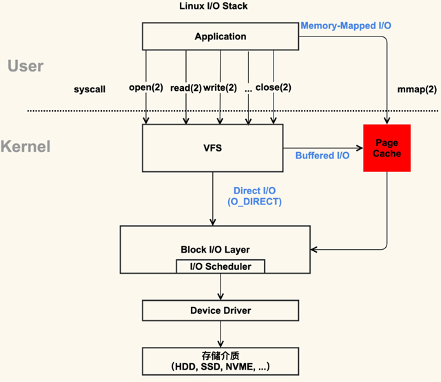

`pread()` 和 `pwrite()` 函数在操作文件时通常会访问 page cache（页缓存），这是操作系统用于缓存文件系统数据的内存区域。页缓存是操作系统内存管理的一个重要部分，它允许系统缓存从磁盘读取的数据或即将写入磁盘的数据，从而提高读写操作的效率。

### `pread()` 和 `pwrite()` 函数

- `pread()` 函数用于从文件中读取数据，它与 `read()` 函数相似，但它允许你指定从文件的哪个位置开始读取，而不改变文件的当前偏移量。
- `pwrite()` 函数用于向文件写入数据，它与 `write()` 函数相似，但它允许你指定写入数据到文件的哪个位置，而不改变文件的当前偏移量。

### 与 Page Cache 的关系

当你使用 `pread()` 或 `pwrite()` 对文件进行读写操作时，操作系统会首先查看所需数据是否已经存在于页缓存中（对于读操作）或将数据写入页缓存（对于写操作），然后根据需要将页缓存中的数据同步到磁盘。

- **读取操作**（`pread()`）：如果请求的数据已经在页缓存中，系统就可以直接从缓存中读取数据，而不需要访问磁盘，这大大提高了读取操作的速度。如果数据不在页缓存中，操作系统会从磁盘读取数据，并可能将其添加到页缓存中以备后用。
- **写入操作**（`pwrite()`）：写入的数据通常首先被放入页缓存。根据系统的缓存策略，这些数据可能会立即写入磁盘，也可能会延迟一段时间（这称为延迟写入）。这样做可以聚合多个写操作，减少对磁盘的实际写入次数，提高系统的总体性能。

### 性能和一致性

页缓存机制在提高文件读写性能的同时，也引入了数据一致性和同步的问题。为了确保数据的一致性，可能需要使用如 `fsync()`、`fdatasync()` 或 `sync()` 等函数显式地将缓存中的数据同步到磁盘。

总的来说，`pread()` 和 `pwrite()` 在操作文件时与页缓存紧密相关，通过使用页缓存，它们能提供更高效的文件读写性能。


## PCIeBDF地址

PCIe BDF地址是一种用于在PCI Express (PCIe) 系统中唯一标识设备的方法。BDF代表Bus, Device, and Function，这三个元素共同构成了一个设备的唯一标识符。下面是关于BDF地址的详细解释：

### 1. Bus（总线）号

- 总线号是一个8位的数字，用于标识PCIe设备所在的总线。
- 在PCIe体系中，总线可以是物理的或者虚拟的，它们通过根复用器（Root Complex）或者PCIe到PCIe桥接器（P2P Bridge）进行连接。
- 总线号的范围从0到255，其中0通常保留给虚拟的PCI总线，也就是根复用器直接管理的总线。

### 2. Device（设备）号

- 设备号是一个5位的数字，用于标识连接到特定总线上的设备。
- 每个总线上可以连接多达32个设备，设备号从0开始编号。
- 设备号的分配通常是由系统固件或者操作系统在系统启动时进行，以确保每个设备都有一个唯一的标识。

### 3. Function（功能）号

- 功能号是一个3位的数字，用于标识一个设备中的特定功能。
- 一个PCIe设备可以有多达8个功能，每个功能都有自己的配置空间和独立的功能集。
- 功能号从0开始，其中0通常代表主功能，其他的则代表设备的其他功能。

### BDF地址的组合

- 将这三个元素组合起来，就形成了一个完整的BDF地址，例如：`Bus 01:Dev 02:Function 0`。
- 这个地址可以用来在PCIe系统中精确地定位到一个特定的设备功能。

### 为什么使用BDF地址

- BDF地址的使用使得在复杂的PCIe系统中管理和寻址设备变得更加简单和直接。
- 它允许操作系统和其他软件组件快速地找到和配置设备，无需关心设备的物理位置或者它们是如何连接到系统中的。

### BDF地址的应用

- 在进行系统诊断、配置和优化时，BDF地址是一个重要的参考。
- 例如，当需要更新设备的固件或者驱动程序时，可以通过BDF地址来确定目标设备。
- 同样，在进行性能分析或者故障排查时，BDF地址可以帮助快速定位问题所在。

通过以上解释，我们可以看到PCIe BDF地址在PCIe系统管理和配置中扮演着至关重要的角色。它为设备提供了一个清晰、唯一的标识，使得系统能够高效地进行资源分配和通信。


在Ubuntu 22.04系统中，查看设备的BDF地址可以通过使用`lspci`命令来实现。`lspci`是Linux系统中用于列出所有PCI设备信息的工具，它能够显示每个设备的BDF地址以及其他相关信息。

### 查看BDF地址的命令

打开终端，输入以下命令：

```bash
lspci -nn
```

这个命令会列出所有PCI设备的详细信息，包括BDF地址。`-n`选项告诉`lspci`不要解析ID到设备名称，而`-nn`则同时不解析厂商ID和设备ID，这样可以得到完整的BDF信息。

### BDF地址的唯一性

BDF地址是每个设备在PCI总线上的唯一标识符，由以下三部分组成：

- **Bus（总线）号**：表示设备所在的PCI总线编号。
- **Device（设备）号**：表示设备在总线上的位置。
- **Function（功能）号**：表示设备的功能编号，一个设备可以有多个功能。

在一个给定的系统中，每个PCI设备都有一个唯一的BDF地址。这是因为每个设备在系统中的位置（总线和插槽）是固定的，而且每个设备的功能编号也是预先定义的。

### BDF地址是否会变化

BDF地址在系统关机重启后通常不会变化。这是因为BDF地址反映了设备的物理位置和功能，而这些在物理层面上是不会改变的。然而，在某些特殊情况下，例如更换硬件或者使用虚拟化技术时，BDF地址可能会发生变化。但在大多数情况下，BDF地址是稳定的。

### 总结

在Ubuntu 22.04系统中，可以通过`lspci -nn`命令查看设备的BDF地址。BDF地址是设备的唯一标识符，通常在系统重启后不会变化，除非有硬件更换或者特殊的配置更改。使用`lspci`命令可以帮助用户了解系统中各个PCI设备的详细信息，包括它们的BDF地址。 


# 网络

> 想知道哪些端口暴露给了外网

在本地机器上使用 `netstat` 或 `ss` 命令来查看哪些端口正在监听，以及它们绑定的 IP 地址。

```
sudo netstat -tuln
```

或者

**使用 `nmap` 进行网络扫描**

sudo apt-get install nmap


**检查防火墙配置**

查看防火墙规则，看看哪些端口被允许通过防火墙。在 Linux 上可以使用 `iptables` 或 `ufw`


```
sudo ufw allow 4000                                            
规则已添加                                                                      
规则已添加 (v6)
 
sudo ufw status
```


# 其他

> 缺少OpenSSL 

apt install libssl-dev

如果安装成功，应该能够在 “`/usr/include/openssl`” 目录下找到 “`opensslconf.h`” 文件。


> pkg-config

`pkg-config` 是一个帮助管理库路径的工具，通常在编译过程中用来检查所需的库是否存在。你可以通过以下命令安装它：

