多线程与多进程等。

## 调试及性能分析工具：

学习使用coredump

文件调试

学习使用vtune等性能测试工具进行性能测试

### perf

objdump -d [?] >  [?] #看反汇编

```
perf record  ./lower_bound

perf report 

perf record -e cache-misses  

```


## Coredump

​		程序由于各种异常或者bug导致在运行过程中异常退出或者中止（并且在满足一定条件下）会产生一个叫做core的文件。

​		通常情况下，core文件会包含了程序运行时的内存，寄存器状态，堆栈指针，内存管理信息还有各种函数调用堆栈信息等

默认的存储位置：

```shell
 cat  /proc/sys/kernel/core_pattern
```


## Cache Lab

Understanding Cache Memories，

包括：

完成cache模拟器的编写；

写cache友好的代码（详细内容见文档cachelab.pdf）


# GDB

## 一些命令

[^]: https://blog.csdn.net/zdy0_2004/article/details/80102076

```bash
gcc -g test.c -o test.exe	#-g=编译调试版 -o=输出
gdb	test.exe				#或者进(gdb)再file test.exe
```

### 查看代码

```bash
list n #显示以第n行 
list main #查看某函数
set listsize 20 #修改默认显示行数
list <first> , <last>#显示first到last行

```

### 断点

```bash
#设置断点 break + 行号
break 
#清除断点 delete [breakpoints] [rang...] 
#breakpoints为断点号 range表示断点号的范围 不指定断点号则表明删除所有的断点

info break #查看断点信息(看断点号)

delete 1   #删除1号断点
```


| 命令     | 命令缩写 | 命令说明                                                     |
| -------- | -------- | ------------------------------------------------------------ |
| file     | f        | 装入要调试的文件路径                                         |
|          |          |                                                              |
|          |          |                                                              |
| start    | st       | 开始执行程序,在main函数的第一条语句前面停下来                |
| run      | r        | 开始运行程序                                                 |
| step     | s        | 执行下一条语句,如果该语句为函数调用,则进入函数执行其中的第一条语句 |
| next     | n        | 执行下一条语句,如果该语句为函数调用,不会进入函数内部执行(即不会一步步地调试函数内部语句) |
| continue | c        | 继续程序的运行,直到遇到下一个断点                            |

### **观察变量**

```bash
 watch                 监视变量值的变化                       
 display         disp  跟踪查看某个变量,每次停下来都显示它的值 
 print           p     打印内部变量值                          
 set var name=v        设置变量的值    
```

### **观察内存**

```bash
#x/fmt addres
x/16x &x	#查看x地址往后的内存
```

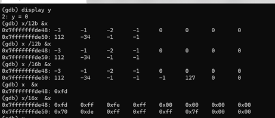

### 观察寄存器及info

| info register | i reg     | 寄存器           |
| ------------- | --------- | ---------------- |
|               | i b       | 查看断点信息     |
|               | i display | 跟踪查看哪些变量 |
|               | i source  | 程序信息         |

### 反汇编

```bash
disassemble	#要先设置断点,run起来
			/s	#带源程序
			/r	#带机器码
			main #特定函数的反汇编
#设置反汇编格式: AT&T \ Intel
 set disassembly-flavor intel
 set disassembly-flavor att
```


### 设置窗口——layout

```bash
#退出方法为Ctrl+X+A
layout src 	#只显示源代码
layout asm 	#只显示汇编代码
layout regs #增加寄存器内容显示
```


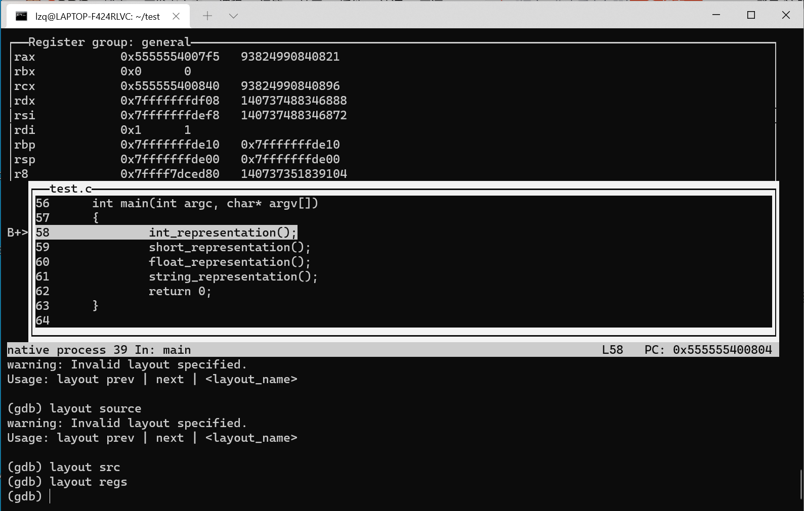


# Cmake、make

[make makefile cmake 都是什么，有什么区别？](https://www.zhihu.com/question/27455963)

`gcc`只能编译单文件，当你的程序包含很多个源文件时，用gcc命令逐个去编译时，你就很容易混乱而且工作量大。

`make`工具可以看成是一个智能的批处理工具，它本身并没有编译和链接的功能，而是用类似于批处理的方式—通过调用makefile文件中用户指定的命令来进行编译和链接的。

make工具依靠`Makefile`中的命令进行编译和链接。

`Cmake`根据`CMakeLists.txt`去生成Makefile

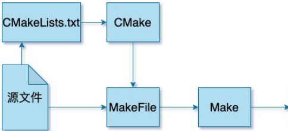

```shell
#三板斧
cd build
cmake ..
make
./可执行文件名
```

用cmake编译C++工程时，如果改变了工程文件的位置，那么在build文件中运行cmake … 时有可能会报错，我们删除build文件夹（cmake没有clear功能）

```shell
#1.退出build目录：
cd ..
#2.删除build目录（要确保build中只存放了编译生成的中间文件）
rm -rf build
#3.新建build目录
mkdir build
#4.进入build
cd build
#5.重新cmake …
cmake ..
```


### make 的基本语法


# Vim

[^区分大小写]: 即G = shift + g

全选:ggvG 

**gg：**是让光标移到首行，在**vim**才有效，vi中无效 

**v ：** 是进入Visual(可视）模式 

**G ：**光标移到最后一行 

再dd就全删除了


`默认`命令模式:

- 基本移动: `hjkl` （左， 下， 上， 右）
- 词： `w` （下一个词）， `b` （词初）， `e` （词尾）
- 行： `0` （行初）， `^` （第一个非空格字符）， `$` （行尾）
- 屏幕： `H` （屏幕首行）， `M` （屏幕中间）， `L` （屏幕底部）
- 翻页： `Ctrl-u` （上翻）， `Ctrl-d` （下翻）
- 文件： `gg` （文件头）， `G` （文件尾）
- 行数： `:{行数}<CR>` 或者 `{行数}G` ({行数}为行数)
- 杂项： `%` （找到配对，比如括号或者 /* */ 之类的注释对）
- 查找：`f{字符}`，`t{字符}`，`F{字符}`，`T{字符}`
  - 查找/到 向前/向后 在本行的{字符}
  - `,` / `;` 用于导航匹配
- 搜索: `/{正则表达式}`, `n` / `N` 用于导航匹配


可视化模式:

- 可视化：`v`
- 可视化行： `V`
- 可视化块：`Ctrl+v`

可以用移动命令来选中。


`i`进入编辑模式:

|          |                                                              |
| :------- | ------------------------------------------------------------ |
| dd       | 删除行                                                       |
| yy       | 复制行                                                       |
| u        | 复原前一个动作。                                             |
| [Ctrl]+r | 重做上一个动作。                                             |
| .        | 不要怀疑！这就是小数点！意思是重复前一个动作的意思。 如果你想要重复删除、重复贴上等等动作，按下小数点『.』就好了！ |

输入模式 `i` 和底线命令模式 

- `:q` 退出（关闭窗口）

- `:w` 保存（写）

- `:wq` 保存然后退出

- `:e {文件名}` 打开要编辑的文件

- `:ls` 显示打开的缓存

- `:help` {标题}

  打开帮助文档

  - `:help :w` 打开 `:w` 命令的帮助文档
  - `:help w` 打开 `w` 移动的帮助文档


**全选（高亮显示**）：按esc后，然后ggvG

**全部复制：**按esc后，然后ggyG

**全部删除：**按esc后，然后dG

**gg：**是让光标移到首行，在**vim**才有效，vi中无效 

**v ：** 是进入Visual(可视）模式 

**G ：**光标移到最后一行 

**选**中内容以后就可以其他的操作了，比如： 
**d** 删除**选**中内容 
**y** 复制**选**中内容到0号寄存器 
**"+y** 复制**选**中内容到＋寄存器，也就是系统的剪贴板，供其他程序用 


# Linux系统目录结构

[^菜鸟教程]: https://www.runoob.com/linux/linux-system-contents.html

**指令集合：**

- **/bin(= 二进制)：**  存放着最常用的程序和指令

- **/sbin(s=surper)：**只有系统管理员能使用的程序和指令。

**外部文件管理：**

- **/etc：Etcetera(等等)** 

  系统管理所需要的配置文件和子目录。

- **/dev (Device)：**Device(设备)的缩写, 存放的是Linux的外部设备。**注意：**在Linux中访问设备和访问文件的方式是相同的。

- **/media**：类windows的**其他设备，**例如U盘、光驱等等，识别后linux会把设备放到这个目录下。

- **/mnt**：临时挂载别的文件系统的，我们可以将光驱挂载在/mnt/上，然后进入该目录就可以查看光驱里的内容了。

**账户：**

- **/root**：系统管理员的用户主目录。

- **/home**：用户的主目录，以用户的账号命名的。

- **/usr**：用户的很多应用程序和文件都放在这个目录下，类似于windows下的program files目录。

- **/usr/bin：**系统用户使用的应用程序与指令。

- **/usr/sbin：**超级用户使用的比较高级的管理程序和系统守护程序。

- **/usr/src(source (源代码))：**内核源代码默认的放置目录。

**运行过程中要用：**

- **/var**：存放经常修改的数据，比如程序运行的日志文件（/var/log 目录下）。

- **/proc**：管理**内存空间！**虚拟的目录，是系统内存的映射，我们可以直接访问这个目录来，获取系统信息。这个目录的内容不在硬盘上而是在内存里，我们也可以直接修改里面的某些文件来做修改。

**扩展用的：**

- **/opt**：默认是空的，我们安装额外软件可以放在这个里面。存放自己的完整的软件包。（这是有点丑陋的方式？）

- **/srv**：存放服务启动后需要提取的数据**（不用服务器就是空）**

## 环境变量

（推荐） 修改用户主目录下的.bashrc文件

/etc/profile : 在登录时,操作系统定制用户环境时使用的第一个文件 ,此文件为系统的每个用户设置环境信息,当用户第一次登录时,该文件被执行。 

/etc /environment : 在登录时操作系统使用的第二个文件, 系统在读取你自己的profile前,设置环境文件的环境变量。 

~/.profile : 在登录时用到的第三个文件 是.profile文件,每个用户都可使用该文件输入专用于自己使用的shell信息,当用户登录时,该文件仅仅执行一次!默认情况下,他设置一些环境变量,执行用户的.bashrc文件。 

/etc/bashrc : 为每一个运行bash shell的用户执行此文件.当bash shell被打开时,该文件被读取. 

~/.bashrc : 该文件包含专用于你的bash shell的bash信息,当登录时以及每次打开新的shell时,该该文件被读取。 


# **Git**

## 配置

回到Windows安装Git到D盘的environment中

### ssh

本地生成密钥

`ssh-keygen -t rsa -C "1021578619@qq.com"`

-C：C是comment的缩写，“你的邮箱地址“（因为邮箱地址具有唯一性所以一般用这个），这是用于识别这个密钥的注释

一路回车,密钥保存到`用户/2657/.ssh/id_rsa.pub`

复制粘贴到GitHub-Setting-SSH and GPG keys,命名test1

`ssh -T git@github.com`

第一次连接需要确认yes

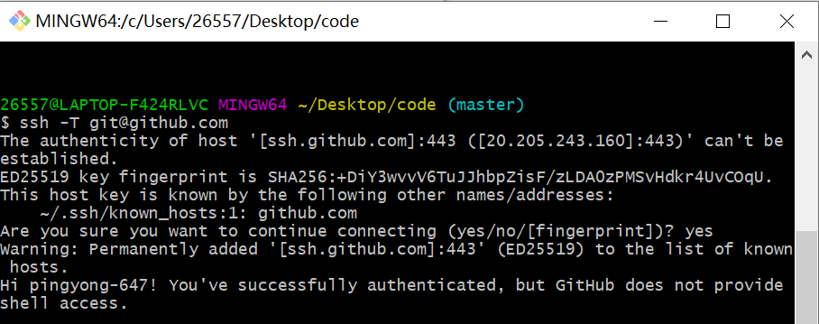


## 结构


**工作区：**就是你在电脑里能看到的目录。

**暂存区：**英文叫 stage 或 index。一般存放在 **.git** 目录下的 index 文件（.git/index）中，所以我们把暂存区有时也叫作索引（index）。

**版本库：**工作区有一个隐藏目录 **.git**，这个不算工作区，而是 Git 的版本库。

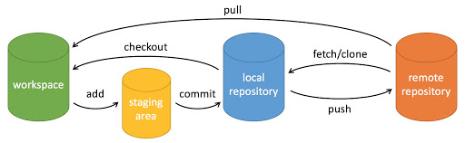

> 一次上传

```bash
#第一次
#配置用户
git config user.name pingyong-647.c
git config user.email 1021578619@qq.com
#远程仓库以前已经认证过了
git remote add https://github.com/pingyong-647/code

#添加到暂存区
git add .
#commit到本地库
git commit -m "注释"
#push到远程仓库
git push -u origin master (master:master,同名省略)
```

[^2021年12月22日10:34:30]: 所以说加不加-u有什么区别?>


> push操作经常超时

```bash
git config --global http.proxy http://127.0.0.1:1080  

git config --global https.proxy http://127.0.0.1:1080
```

```bash
#取消全局代理 //不是很懂
git config --global --unset http.proxy  

git config --global --unset http.proxy 
```

[^2021年12月27日16:41:26]: 不知道有没有用, 后来又设置了ssh,并且在GitHub保存了密钥, 刚才直接上传成功了。


> 上传超过100MB的大文件

下载安装git lfs https://git-lfs.com/

https://blog.csdn.net/wzk4869/article/details/131661472

```bash
git lfs install 
#追踪大文件
git lfs track "*.pptx"
#重新add commit 
```


> 如何只下载某个仓库的一部分文件

工具：http://tool.mkblog.cn/downgit/#/home

## 一些命令

```bash
#上传三连
#添加到暂存区
git add .
#commit到本地库
git commit -m "注释"
#push到远程仓库
git push -u origin master (master:master,同名省略)
 
#相当于两步
#将远程仓库origin的master分支与本地仓库master分支关联
git branch --set-upstream-to=origin/master master
git push origin master
git push origin +master#好像是强制上传
#查看remote仓库
git remote -v
#添加一个远程仓库 by ssh
git remote add origin git@github.com:LiuziqiOvO/md.git
```


# Docker

[配置]: https://blog.csdn.net/yb546822612/article/details/105225484

[^官方文档]: https://docs.docker.com/

```bash
sudo groupadd docker          #添加docker用户组
sudo gpasswd -a lzq docker  #将当前用户添加至docker用户组
newgrp docker                 #更新docker用户组
```

#### 有时候打开报错给权限就好了：

```bash
newgrp  docker # 刷新docker成员
```

### 四、阿里云镜像加速

[^阿里云]: https://cr.console.aliyun.com/cn-hangzhou/instances/mirrors

```bash
#配置镜像加速器
sudo mkdir -p /etc/docker
sudo tee /etc/docker/daemon.json <<-'EOF'
{
  "registry-mirrors": ["https://i9v411zn.mirror.aliyuncs.com"]
}
EOF
sudo systemctl daemon-reload
sudo systemctl restart docker
```


## 原理概述

Docker是一个Client-Server结构，Docker的守护进程运行在主机，通过Socket从客户端访问。

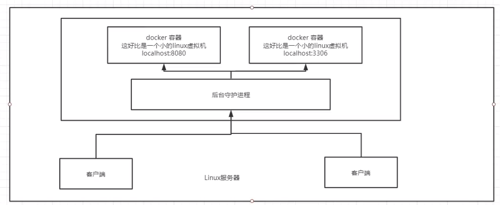

**为什么Docker比虚拟机快？**

1. Docker抽象层更少。 而虚拟机还需要去虚拟硬件。
2. Docker直接利用主机操作系统和内核。vm需要重新加载出一个OS kernel

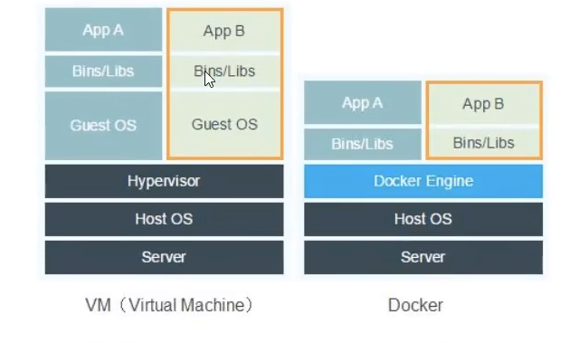

## Docker命令

```bash
docker version
docker info 	#显示docker系统信息（详细）
```

### 镜像命令

```bash
docker images 	#显示本地主机镜像 -a全部 -q只显示ID
docker search 	#搜索镜像 会列出搜索doc结果，和区个docker hub网页端搜索是一样的。
docker pull 	#下载
```

 

```bash
docker rmi -f	#remove image + ID/名称
docker rmi -f 镜像ID 镜像ID
docker rmi -f $(docker images -aq) # 把所有容器的ID都传入,删掉
```

### 容器命令

```bash
docker run	
#参数
--name="123"
-d 				后台方式运行
-it				使用交互方式运行
-p				指定容器端口 
	-p 主机端口：容器端口（常用）
	-p 容器端口
-P				随即制定端口

docker run -it 	centos /bin/bash	#进入centos容器

exit		#退回主机（容器停止）
Ctrl+P+Q 	#退出，容器不停止

docker attatch + id 重新进入容器
```


```bash
docker ps	#列出正在运行的容器
	-a		#看曾经运行过的容器
```


```bash
docker rm 	#删除容器  （rmi删除镜像）
docker rm -f $(docker ps -aq)#删除所有
docker ps -a -q |xargs docker rm #用管道符,同理
```


```bash
docker start  
docker restart
docker stop
docker kill
```

//old

**后台**

```bash
docker run -d centos	#后台启动
#但是! docker ps 发现centos停止了！！！
```

> 坑：docker容器后台运行，必须有一个前台进程，docker发现没有应用，就会自动停止。 

**日志**

```
docker logs -tf 	#f=format 加时间戳
	--tail number	#行数
```

**TOP**

```bash
docker top 			#查看容器内部的进程
$ docker top 7e6624c41892
UID                 PID                 PPID                C                   STIME               TTY                 TIME                CMD
root                46858               46836               0                   23:43               pts/0               00:00:00            /bin/bash

```

**查看容器信息**

```bash
docker inspect 		#+id 可以看到容器的细节信息(查看容器元数据)	
```

**进入容器的方法**

```bash
docker execu		#+ID，进入容器（开一个新终端）
```

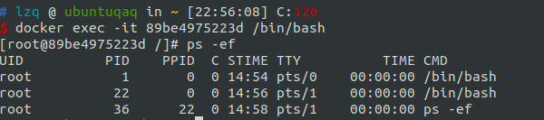

```bash
docker attach 		#+ID，进入容器（打开正在执行的终端）
```

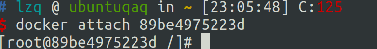

**从容器内拷贝文件到主机上**

```bash
docker cp ID: /home/test.java /home		#拷贝 ID 冒号 原文件 目标目录
#未来可以使用 -v 卷的技术打通。
```


### DockerFile

```bash
docker build . -t oscomp-test
```

```bash
docker run -it --rm oscomp-test /bin/bash
```

-d 后台运行

--rm 退出后删除容器

--it 

在服务器配置了clash 

```yaml
clash
"HTTP_PROXY=http://127.0.0.1:7890"
"HTTP_PROXY=http://127.0.0.1:7890"
```

wget google.com 可以正常获取，应该是挂上梯子了。

docker 内的代理没整明白，手动运行cargo build，然后把DockerFile里的那句注释掉


## 如何直接访问服务器内的容器

大致原理：https://blog.csdn.net/qq_43488795/article/details/126658342

```
docker run -p（加端口映射）  50003（主机端口）:22（容器端口）
```

进入容器，这是容器的Ipconfig（没用到，只是看一下)

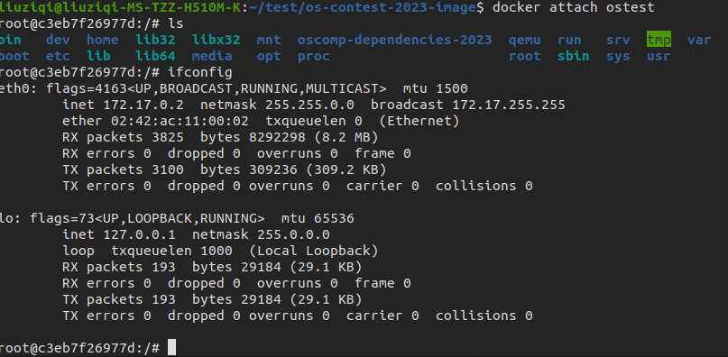

改容器的ssh配置（默认情况下是不允许root登陆的，比较坑的是它让你感觉像是密码输错了一样，反复试）https://www.codenong.com/cs107028736/

```bash
vim /etc/ssh/sshd_config
将#PermitRootLogin without-password改为PermitRootLogin yes，注意去掉#号
/etc/init.d/ssh restart
```


发现没有sshd_config就装一下  （ssh d里的d=daemon):

```bash
apt-get update
apt-get install openssh-server

```


```bash
apt install net-tools #安装网络服务
ifconfig 
# 172.17.0.2
ps -e | grep ssh #查看ssh服务是否启动
service ssh start # 启动ssh服务
```

可以在容器内用上图的IP试一下（ssh登陆一下自己）

在主机（远程服务器）：ssh 自己的 50003端口（已经映射到容器内的22号端口）

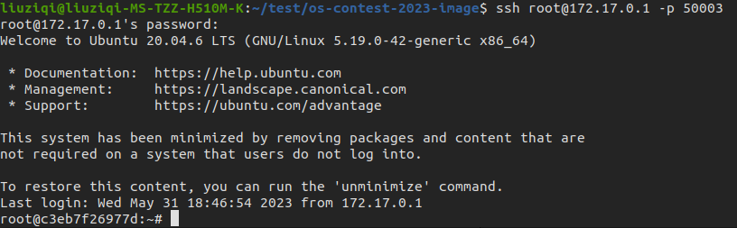

回到笔记本：

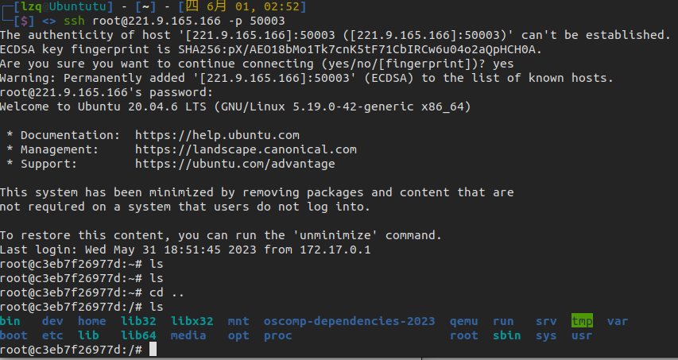


阶段1的评测环境镜像

docker run -it  --privileged --entrypoint bash alphamj/os-contest:v7.6 

-p  50003 : 22


# 服务器部署

#### Nginx 

 成本低廉内存消耗少配置文件非常简单

#### 正向代理&反向代理


# 重新装机

用`rufus-3.17.exe`和`Ubuntu20.04`镜像制作系统盘BIOS F12

联想小新pro14开机F12设USB启动为最高优先级,选磁盘分区,安装

lzq 		1209

root	   1209

## **科学上网**

#### Q2ray：

https://www.hm1006.cn/archives/qv2ray

下载内核：  v2ray-linux-64.zip https://github.com/v2fly/v2ray-core/releases/tag/v4.31.0
下载qv2ray 内核文件夹改名成core /home/lzq/.config/qv2ray/vcore/v2ray

#### clash

```bash
# 创建文件夹
cd && mkdir clash
cd clash

# 下载 Clash 文件
wget https://github.com/Dreamacro/clash/releases/download/v1.14.0/clash-linux-amd64-v1.14.0.gz

# 解压文件
gzip -d clash-linux-amd64-v1.14.0.gz

# 给予权限
chmod +x clash-linux-amd64-v1.14.0
```

导入订阅：

```bash
wget -O config.yaml 订阅地址
```

配置手动代理

127.0.0.1

访问：

**http://clash.razord.top/**


## 时间不同步？

[^csdn]:  https://blog.csdn.net/yuan_chen_/article/details/104454820?spm=1001.2101.3001.6661.1&utm_medium=distribute.pc_relevant_t0.none-task-blog-2%7Edefault%7ECTRLIST%7ERate-1.pc_relevant_paycolumn_v3&depth_1-utm_source=distribute.pc_relevant_t0.none-task-blog-2%7Edefault%7ECTRLIST%7ERate-1.pc_relevant_paycolumn_v3&utm_relevant_index=1

​		计算机上安装Ubuntu 和Win10双系统后，会出现时间不同步现象，原因是Ununtu会认为Bios硬件时间是UTC时间（Universal Time Coordinated，北京时间比UTC时间早八个小时）进而修改Bios时间，Win10认为Bios硬件时间是本地时间（北京时间），从而双系统切换后时间不同步。

​		简单的解决方案是，修改Win10对BIos硬件时间的对待方式，让Win10把硬件时间当做UTC，方案如下：以管理员权限开启CMD（命令提示符），然后输入：

```cmd
Reg add HKLM\SYSTEM\CurrentControlSet\Control\TimeZoneInformation /v RealTimeIsUniversal /t REG_DWORD /d 1
```

接下来重启计算机即可。

## 更新软件源

1.备份原来的源，将以前的源备份一下，以防以后可以用的。

sudo cp /etc/apt/sources.list /etc/apt/sources.list.bak

2.sudo vim /etc/apt/sources.list

```bash
#添加阿里源
deb http://mirrors.aliyun.com/ubuntu/ focal main restricted universe multiverse
deb-src http://mirrors.aliyun.com/ubuntu/ focal main restricted universe multiverse
deb http://mirrors.aliyun.com/ubuntu/ focal-security main restricted universe multiverse
deb-src http://mirrors.aliyun.com/ubuntu/ focal-security main restricted universe multiverse
deb http://mirrors.aliyun.com/ubuntu/ focal-updates main restricted universe multiverse
deb-src http://mirrors.aliyun.com/ubuntu/ focal-updates main restricted universe multiverse
deb http://mirrors.aliyun.com/ubuntu/ focal-proposed main restricted universe multiverse
deb-src http://mirrors.aliyun.com/ubuntu/ focal-proposed main restricted universe multiverse
deb http://mirrors.aliyun.com/ubuntu/ focal-backports main restricted universe multiverse
deb-src http://mirrors.aliyun.com/ubuntu/ focal-backports main restricted universe multiverse
#添加清华源
deb https://mirrors.tuna.tsinghua.edu.cn/ubuntu/ focal main restricted universe multiverse
# deb-src https://mirrors.tuna.tsinghua.edu.cn/ubuntu/ focal main restricted universe multiverse
deb https://mirrors.tuna.tsinghua.edu.cn/ubuntu/ focal-updates main restricted universe multiverse
# deb-src https://mirrors.tuna.tsinghua.edu.cn/ubuntu/ focal-updates main restricted universe multiverse
deb https://mirrors.tuna.tsinghua.edu.cn/ubuntu/ focal-backports main restricted universe multiverse
# deb-src https://mirrors.tuna.tsinghua.edu.cn/ubuntu/ focal-backports main restricted universe multiverse
deb https://mirrors.tuna.tsinghua.edu.cn/ubuntu/ focal-security main restricted universe multiverse
# deb-src https://mirrors.tuna.tsinghua.edu.cn/ubuntu/ focal-security main restricted universe multiverse multiverse
```

3.更新

```bash
sudo apt-get update
```

## 设置sudo密码

```bash
sudo passwd 	
```


## 其他一些折腾

### 美化桌面

https://zhuanlan.zhihu.com/p/176977192?ivk_sa=1024320u


```bash
sudo apt install gnome-tweaks chrome-gnome-shell
```

gnome 插件[extensions.gnome.org](https://link.zhihu.com/?target=https%3A//extensions.gnome.org)

搜索并下载

- user themes
- dash to dock

dash to dock 卸载设置完就卸载掉

如果出现两个dock的bug就卸载系统dock

```
sudo apt-get remove gnome-shell-extension-ubuntu-dock
```

### 

- 主题包：WhiteSur Gtk Theme

- - [https://www.gnome-look.org/p/1403328/](https://link.zhihu.com/?target=https%3A//www.gnome-look.org/p/1403328/)

- Icons 图标：WhiteSur icon theme

- - [https://www.pling.com/p/1405756/](https://link.zhihu.com/?target=https%3A//www.pling.com/p/1405756/)

```
sudo apt install plank
```

### 美化引导界面——grub

https://www.gnome-look.org/browse/cat/109/order/latest/

找个主题，直接在Download里解压了。./install.sh直接安装好了


https://blog.csdn.net/u011054333/article/details/53314504/


## oh-my-zsh

apt-get安装：
curl
zsh
git
vim

```
sudo apt-get install vim git curl zsh 
```

安装oh-my-zsh

```text
sh -c "$(curl -fsSL https://raw.github.com/robbyrussell/oh-my-zsh/master/tools/install.sh)"
```

（卸载时，还有uninstall.sh可以用）

配置：

```
vim ~/.zshrc
```

有一些插件需要下载：

```bash
#高亮
git clone https://github.com/zsh-users/zsh-syntax-highlighting.git ${ZSH_CUSTOM:-~/.oh-my-zsh/custom}/plugins/zsh-syntax-highlighting
#历史记录
git clone https://github.com/zsh-users/zsh-autosuggestions $ZSH_CUSTOM/plugins/zsh-autosuggestions
```


.zshrc:

```
# my path config
export GOROOT=$HOME/sdk/go1.20.4
export PATH=$PATH:$GOROOT/bin
export GOPATH=$HOME/Go


# If you come from bash you might have to change your $PATH.
# export PATH=$HOME/bin:/usr/local/bin:$PATH

# Path to your oh-my-zsh installation.
export ZSH="$HOME/.oh-my-zsh"

# Set name of the theme to load --- if set to "random", it will
# load a random theme each time oh-my-zsh is loaded, in which case,
# to know which specific one was loaded, run: echo $RANDOM_THEME
# See https://github.com/ohmyzsh/ohmyzsh/wiki/Themes
ZSH_THEME="random"

# Set list of themes to pick from when loading at random
# Setting this variable when ZSH_THEME=random will cause zsh to load
# a theme from this variable instead of looking in $ZSH/themes/
# If set to an empty array, this variable will have no effect.
# ZSH_THEME_RANDOM_CANDIDATES=( "robbyrussell" "agnoster" )

# Uncomment the following line to use case-sensitive completion.
# CASE_SENSITIVE="true"

# Uncomment the following line to use hyphen-insensitive completion.
# Case-sensitive completion must be off. _ and - will be interchangeable.
# HYPHEN_INSENSITIVE="true"

# Uncomment one of the following lines to change the auto-update behavior
# zstyle ':omz:update' mode disabled  # disable automatic updates
# zstyle ':omz:update' mode auto      # update automatically without asking
# zstyle ':omz:update' mode reminder  # just remind me to update when it's time

# Uncomment the following line to change how often to auto-update (in days).
# zstyle ':omz:update' frequency 13

# Uncomment the following line if pasting URLs and other text is messed up.
# DISABLE_MAGIC_FUNCTIONS="true"

# Uncomment the following line to disable colors in ls.
# DISABLE_LS_COLORS="true"

# Uncomment the following line to disable auto-setting terminal title.
# DISABLE_AUTO_TITLE="true"

# Uncomment the following line to enable command auto-correction.
# ENABLE_CORRECTION="true"

# Uncomment the following line to display red dots whilst waiting for completion.
# You can also set it to another string to have that shown instead of the default red dots.
# e.g. COMPLETION_WAITING_DOTS="%F{yellow}waiting...%f"
# Caution: this setting can cause issues with multiline prompts in zsh < 5.7.1 (see #5765)
# COMPLETION_WAITING_DOTS="true"

# Uncomment the following line if you want to disable marking untracked files
# under VCS as dirty. This makes repository status check for large repositories
# much, much faster.
# DISABLE_UNTRACKED_FILES_DIRTY="true"

# Uncomment the following line if you want to change the command execution time
# stamp shown in the history command output.
# You can set one of the optional three formats:
# "mm/dd/yyyy"|"dd.mm.yyyy"|"yyyy-mm-dd"
# or set a custom format using the strftime function format specifications,
# see 'man strftime' for details.
# HIST_STAMPS="mm/dd/yyyy"

# Would you like to use another custom folder than $ZSH/custom?
# ZSH_CUSTOM=/path/to/new-custom-folder

# Which plugins would you like to load?
# Standard plugins can be found in $ZSH/plugins/
# Custom plugins may be added to $ZSH_CUSTOM/plugins/
# Example format: plugins=(rails git textmate ruby lighthouse)
# Add wisely, as too many plugins slow down shell startup.
plugins=(git
	 pip
 	 sudo
	 zsh-syntax-highlighting
 	 last-working-dir
	 zsh-autosuggestions
 	)

source $ZSH/oh-my-zsh.sh

# User configuration

# export MANPATH="/usr/local/man:$MANPATH"

# You may need to manually set your language environment
# export LANG=en_US.UTF-8

# Preferred editor for local and remote sessions
# if [[ -n $SSH_CONNECTION ]]; then
#   export EDITOR='vim'
# else
#   export EDITOR='mvim'
# fi

# Compilation flags
# export ARCHFLAGS="-arch x86_64"

# Set personal aliases, overriding those provided by oh-my-zsh libs,
# plugins, and themes. Aliases can be placed here, though oh-my-zsh
# users are encouraged to define aliases within the ZSH_CUSTOM folder.
# For a full list of active aliases, run `alias`.
#
# Example aliases
# alias zshconfig="mate ~/.zshrc"
# alias ohmyzsh="mate ~/.oh-my-zsh"
```


主题设成"ys"
加自动补齐插件


安装vtune //和chrome都在/opt中


`https://blog.csdn.net/qq_44926567/article/details/113034100`

但是我启用的是1.0.0版本,启用完了powershell字体都变了…

我发现文档里多了powershell/moudle/PSReadline 1.2.0的安装包, 按照这个路径重新操作了一遍

## 滚轮速度

1.安装：

```
sudo apt-get install imwheel
```

2.设置滚动速度：sudo vim ~/.imwheelrc, 然后添加配置内容：

```bash
".*"
None,      Up,   Button4, 3
None,      Down, Button5, 3
Control_L, Up,   Control_L|Button4
Control_L, Down, Control_L|Button5
Shift_L,   Up,   Shift_L|Button4
Shift_L,   Down, Shift_L|Button5
```

前两行就分别对应上滚和下滚的速度（行数），把数值5设置为合适的值。

3.启动imwheel

        直接在终端输入命令imwheel即可，如果本来已经运行，修改数值后可以先执行killall imwheel，然后就可以立即生效。

发现鼠标侧键实效了，不用了。

​                

## 开机键盘失灵

https://blog.csdn.net/qq_40716069/article/details/128046176

vim /etc/default/grub

```
GRUB_CMDLINE_LINUX_DEFAULT="quiet splash i8042.dumbkbd"
```

sudo update-grub

## 开机自动挂载Windows磁盘

https://zhuanlan.zhihu.com/p/523426604

查看所有磁盘

```
df -h
```

查看磁盘ID

```console
sudo blkid
```

UUID=EA4AB9BE4AB98839C

UUID=68C62C1DC62BE9D0

vim /etc/fstab

```
# my Windows-C
UUID=EA4AB9BE4AB98839   /media/lzq/Windows-SSD  ntfs    defaults        0       2
# my Windows-D
UUID=68C62C1DC62BE9D0  /media/lzq/Data  ntfs    defaults        0       2
```

#### 自动挂载设备为只读模式(Read-Only)的解决方案

ntfsfix /dev/nvme0n1p3

然后再重新挂载一下就好了

## ENV

### Go

Goenv： home/lzq/sdk/go

GoPATH ： home/lzq/Go

Go的下载目录放在HOME下了

### conda

home/miniconda3

https://blog.csdn.net/weixin_44119391/article/details/128577681


下载地址：https://repo.anaconda.com/archive/


conda也在home下，直接运行sh


### pytorch


# 连接不上dl.google.com


测速网站，找个好IP

https://tool.chinaz.com/speedtest/dl.google.com

修改/etc/hosts：

```
220.181.174.97 dl.google.com
```


```
20.205.243.166 github.com
```


# 关于安装包：

qemu-misc

gcc-linux-riscv-

llvm

clang


https://blog.csdn.net/u014259503/article/details/82593373
Linux的

RPM包

    就相当于windows的镜像文件，改配置的文件大部分都配置好了，所以安装相对简单

RPM包安装去向（例:包名=>redis）

    rpm -ql 包名： 查看redis都安装到什么地方，会列出所有文件的路径。 
    rpm -qa | grep 包名： 看看*redis*有没有安装 ，‘rpm -qa redis’看看redis有没有安装，会有名称打印出来：redis-3.2.3-1.el7.x86_64

DEB包 （例:包名=>redis）

    dpkg -L 包名：查看redis。 
    dpkg -l | grep 包名： 看看*redis*有没有安装， dpkg -l redis 看看redis有没有安装 
    whereis redis：查看redis的安装目录
    which redis：查看redis文件夹的地址

### tar命令：


#### Ubuntu中无法打开Appimage文件？

:属性-权限-允许执行文件


# 一些命令


```bash
cd -	#回到刚才的目录 cd = change	directory
~ 		#等价于\home\liuziqi
```

```bash
ls -lah 
	#-l: list
	#-a: all	显示所有东西(包括隐藏文件)
	#-h: 		高可读性
```

```bash
pwd 
#打印当前路径
```

```bash
mkdir myfolder
#在当前路径创建目录myfolder
mkdir -p a/b/c
#创建多层目录
```

```bash
touch
#将某文件的修改时间改为当前时间,假装"碰"了一下
#当这个文件不存在的时候就会自动创建一个了
```

```bash
rm -f #f=force
rm -rf #删文件夹跑路
```

查询

```bash
find
grep
#
-i：忽略大小写
-n：输出关键字行号
-v：取反，不输出包含关键字内容
-r：递归查找，用于查找多个文件是否包含某个关键字
-E：使用正则表达式
 
-A{num}：额外输出关键字下面 num 行
-B{num}：额外输出关键字上面 num 行
-C{num}：额外输出关键字上/下各 num 行，也可以直接使用 -{num}
 
-c：计算关键字行数
-h：不显示文件名
-l：仅输出符合关键字文件名
-L：输出不符合关键字文件名

```

查看内核版本

```bash
uname -a		
```

检查内存保留区是否设置成功

```bash
sudo cat /proc/iomem
```


### 

#### iostat_观察io开销

https://zhuanlan.zhihu.com/p/649946956

```bash
iostat -d -k 1 10         #查看TPS和吞吐量信息(磁盘读写速度单位为KB)，每1s收集1次数据，共收集10次
iostat -d -m 2            #查看TPS和吞吐量信息(磁盘读写速度单位为MB)，每2s收集1次数据
iostat -d -x -k 1 10      #查看设备使用率（%util）、响应时间（await）等详细数据， 每1s收集1次数据，总共收集10次 
iostat -c 1 10            #查看cpu状态，每1s收集1次数据，总共收集10次
```

iostat输出内容分析

在linux命令行中输入iostat，通常将会出现下面的输出：

```text
[root@localhost ~]# iostat
Linux 5.14.0-284.11.1.el9_2.x86_64 (localhost.localdomain)      08/07/2023      _x86_64_        (4 CPU)

avg-cpu:  %user   %nice %system %iowait  %steal   %idle
           0.31    0.01    0.44    0.02    0.00   99.22

Device             tps    kB_read/s    kB_wrtn/s    kB_dscd/s    kB_read    kB_wrtn    kB_dscd
dm-0              3.19        72.63        35.90         0.00     202007      99835          0
dm-1              0.04         0.84         0.00         0.00       2348          0          0
nvme0n1           3.36        93.22        36.64         0.00     259264     101903          0
sr0               0.02         0.75         0.00         0.00       2096          0          0
```

首先第一行：

```text
Linux 5.14.0-284.11.1.el9_2.x86_64 (localhost.localdomain)      08/07/2023      _x86_64_        (4 CPU)
```

Linux 5.14.0-284.11.1.el9_2.x86_64是内核的版本号，localhost.localdomain则是主机的名字， `08/07/2023`当前的日期， _x86_64_是CPU的架构， (4 CPU)显示了当前系统的CPU的数量。

接着看第二部分，这部分是CPU的相关信息，其实和**top命令**的输出是类似的。

```text
avg-cpu:  %user   %nice %system %iowait  %steal   %idle
           0.31    0.01    0.44    0.02    0.00   99.22
```

cpu属性值说明：

- %user：CPU处在用户模式下的时间百分比。
- %nice：CPU处在带NICE值的用户模式下的时间百分比。
- %system：CPU处在系统模式下的时间百分比。
- %iowait：CPU等待输入输出完成时间的百分比。
- %steal：管理程序维护另一个虚拟处理器时，虚拟CPU的无意识等待时间百分比。
- %idle：CPU空闲时间百分比。

iowait这个指标有点说法。

#### dd_模拟磁盘读写


使用`fdisk -l`命令来查看新磁盘是否被系统识别[[1\]](https://blog.csdn.net/ybdesire/article/details/79145180)。该命令会列出所有被系统识别的磁盘和分区信息。

使用`lsblk`命令来查看磁盘和分区的树形结构[[2\]](https://blog.csdn.net/qq_35462323/article/details/104039679)。该命令会显示磁盘的名称、大小、类型以及挂载点等信息。

使用`df -h`命令来查看磁盘占用情况[[1\]](https://blog.csdn.net/ybdesire/article/details/79145180)。该命令会显示已挂载的磁盘和分区的使用情况。

如果你想查看磁盘的文件系统类型，可以使用`df -T`命令[[1\]](https://blog.csdn.net/ybdesire/article/details/79145180)。该命令会显示所有磁盘和分区的文件系统类型。
