# ZNS+

ZNS+: Advanced Zoned Namespace Interface for Supporting InStorage Zone Compaction(https://www.usenix.org/system/files/osdi21-han.pdf)

https://blog.csdn.net/marlos/article/details/130234764

## Abstract

ZNS+: Advanced Zoned Namespace Interface for Supporting In-Storage Zone Compaction

-本文提出了一种名为ZNS+的新型支持LFS的ZNS接口及其实现，该接口允许主机将数据复制操作卸载到固态硬盘，以加快分段压缩。为此提出了两种文件系统技术：copyback感知块分配和混合分段回收。

-经实验，提出的 ZNS+ 存储系统的性能比基于 ZNS 的普通存储系统的性能好 1.33-2.91 倍。

## 1 Intro

段压缩：(也称为段清理或垃圾收集)

略

## 2 Backgroud

#### 2.1 SSD一些名词

parallel flash controllers (channels)

flash chips (ways)

chunk：由于现在的flash产品的flash页面大小通常大于逻辑块大小(例4 KB)，在本文中，我们将映射到flash页面的逻辑连续块称为chunk。（chunk指的是SSD中真实的一个page单元，但目前工艺已经大于4 KB了）

貌似这篇文章:chip = plane

一个memory chip通常支持：read, program, erase, and copyback 命令。

copyback指的是chip内的数据复制，单位是chunk。由于chip内的转移不能检查ECC，所以闪存控制器会在拷贝操作的同时检查错误。

#### 2.2 Zone Mapping

FBG(Flash Block Group)：一个zone映射到的一串物理块组。为了提高并行性，要放在不同的chip上，并行的chip数称为交错度（$D_{zone}$）。跨chip的连续块称为条带（stripe），以交错度为除数分成chip组（FCG），如下图：

Flash Chip Group,FCG

Flash Block Group,FBG

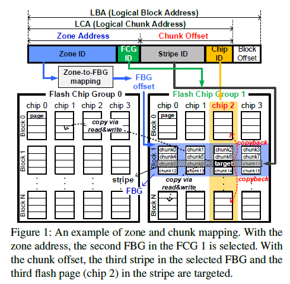

以上设计使得SSD只需要维护 Zone-FBG 映射。

一个zone的reset命令：分配新的FBG（更改对应的映射），写指针（WP）指向新的位置。等旧FBG擦除完可以给其他zone重新使用。

#### 2.3 F2FS 

>F2FS是Flash Friendly File System的简称。该文件系统是由韩国[三星](https://www.elecfans.com/tags/三星/)[电子](https://www.hqchip.com/ask/)公司于2012年研发，只提供给运行[Linux](https://www.elecfans.com/v/tag/538/)内核的系统使用，这种文件系统对于NAND闪存类存储介质是非常友好的。并且F2FS是专门为基于 NAND 的存储设备设计的新型开源 flash 文件系统。特别针对NAND 闪存存储介质做了友好设计。F2FS 于2012年12月进入Linux 3.8 内核。目前，F2FS仅支持Linux[操作系统](https://m.elecfans.com/v/tag/527/)。

F2FS：

- 包含6种类型的数据段（2M），同类段一次只能打开一个；//将冷热数据分割成不同的数据段，压缩时冷块会被放入冷段。

- 多头日志策略；//?

- 同时支持append logging，threaded logging。既可以严格顺序写， 也可以写入脏块的废弃空间。

- **日志写入自适应**：如果空闲段足够多，优先追加写入；空闲段不足，将数据写入dirty segment的无效块上。然而， 实际上后者在ZNS中是被禁用的，所以F2FS for ZNS会经常触发压缩。

- 前后台压缩机制：空间不足，先前台压缩（造成少量IO延迟）；闲时后台压缩（无法及时回收，尤其是在空间占用高，突发写请求时）

  本文主要关注前台压缩的性能

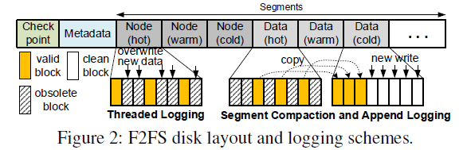

## 3 ZNS+ Interface and File System Support

### 3.1 动机

**普通的端压缩**

朴素的LFS端压缩包括四个步骤：

1. 受害者段（victim segment）选择
2. 目标块分配
3. 有效数据复制
4. 元数据更新

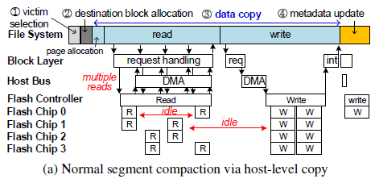

其中，SSD的空闲间隔很长（idle）

read phase、write phase、metadata update ~？？

**基于IZC的段压缩方案**

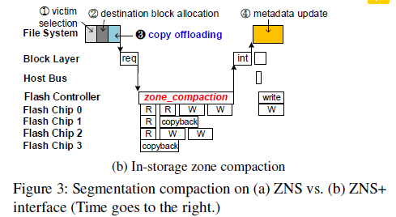

引入了copy offloading操作，sends zone_compaction commands to transfer the block copy information 

### 3.2 LFS-aware ZNS+ Interface

三个新命令：zone_compaction, TL_open, and identify_mapping.

zone_compaction用于请求IZC操作（区内压缩）：现有的simple copy命令要求目标地址单一、连续；ZNS+下，可以指定多个目标LBAs

TL_open：打开区域，准备threaded logging。接下来这个区域可以不经reset就覆写。

identify_mapping：主机使用这个命令确定各个chunk所在的flash chip

##### 3.2.1 IZC(Internal Zone Compaction)

ZNS+的压缩流程：

###### （1）Cached Page Handling：

检查victim段各个可用块对应的page是否被主机DRAMcache。If Cacheed page dirty：必须被写入目的段，并排除在IZC操作外；If clean：既可以通过写请求从主机传输写入，也可以从SSD内部复制。

//ZNS一般使用TLCorQLC，内部复制没有主机来得快。然而，最新的ZNAND有极短的读延迟，对于ZNAND SSD，in-storage copy也可能更快。

###### （2）Copy Offloading：

zone_compaction(sourceLBAs, destination LBAs)

###### （3）处理 IZC

ZNS+ SSD处理压缩指令，其中定义了copybackable chunks（如果其中所有块都是复制来的）。其他不可回拷的正常读写。

**异步**

zone_compaction请求的处理是异步的，主机请求进入请求队列后不会等待命令完成。LFS有自己的checkpoint，异步不会影响文件系统一致性。

ZNS+对后续的普通请求重新排序，避免zone compaction操作的长延迟的影响：放行与压缩地址无关的普通请求；甚至包括对正在压缩的区域的读请求，如果写指针WP已经经过了要读取的目标块地址，那么也可以放行。

##### 3.2.2 Sparse Sequential Overwrite 

**Ineternal Plugging**

为了支持 F2FS的threaded logging，ZNS+需要做少量顺序覆写。

尽管二者有冲突，但是：threaded logging访问的脏段的块地址的闲置空间时，也是从低地址端向高地址端的，虽然不连续但是也递增。因此说他的访问模式是 Sparse Sequential Overwrite （即——WP不减小）

如果固态硬盘固件读取请求之间跳过的数据块，并将其合并到主机发送的数据块中。那就变成了密集的连续写入请求——这种技术被称为internal Plugging。

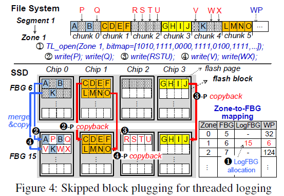

上图是一个Plugging操作的例子：chunk0中的AB，是有效块（跳过块），PQ是无效块，需要回收。

**Opening Zone for Threaded Logging** 

SSD必须知道目标段的跳过块：通过对比写请求首个LBA和当前WP（维护的是上次写的位置？），SSD确定哪些是跳过块。然而，必须要等到写请求到达才能确定跳过块，产生了延迟。

因此，增加了TL_open这个特殊命令，TL_open(openzones, valid bitmap)。它会提前发送一个bitmap，SSD可以在thread logging的写请求到达之前确定那些块要跳过。

**LogFBG Allocation**

原有的被"TL_opened"的zone要被重写，新分配一个FBG叫LogFBG（图中， original FBG (FBG 6) and the LogFBG (FBG 15)）

由于静态映射机制，这个新分配的LogFBG也是在同一个chip上的，所以可以使用copyback快速完成；TL_opened的区域最终关闭时，LogFBG替换了原始的FBG，原始LGB被释放以供重用。

//以上内容应该对应图中的chip0的情况。

**LBA-ordered plugging**

按地址有序插入，如图中2-p、3-p、4-p的情况。

**PPA-ordered plugging**

比如说chunk3可以在chun0、chunk2中的写请求到来之前就进行复制。

physical page address (PPA)   即只考虑物理地址的顺序写入约束。可以检查并让后续的完整chunk提前copy。

但是，过多提前的plug会干扰用户IO请求，所以只有目标chip空闲时才会进行。

**为什么Threaded Logging能提升性能**

二者copy的块的数量是相同的。但是，threaded logging减少了重定位时元数据的修改（?）；调用空闲的chip，internal plug的开销部分隐藏了；最小化写入请求的平均延迟

### 3.3 ZNS+-aware LFS Optimization

#### 3.3.1 copyback-aware的块分配机制

**现有LFS未充分利用copyback：**

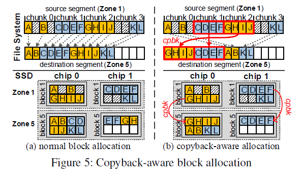

对于identify_mapping 命令，ZNS+SSD会返回FCG ID和chip ID

#### 3.3.2 混合式段回收

虽然threaded logging减少了回收开销，但其效率依然低于端压缩，两大原因：

**回收成本不均衡**

段压缩可以直接选取压缩成本最低的受害者段（例如，选有效数据最少的）。但threaded logging只能从同类型的脏数据段中为某写入请求选择目标数据段，以防止不同类型的数据混杂在一个数据段中。

**预失效块问题**

如果长时间使用稀疏到的线性日志写而不进行检查点处理，它的回收效率将进一步下降:
这是由于某些块虽已经失效，但仍被存储元数据引用，因此不可回收。当一个逻辑块被文件系统操作作废，但新的检查点仍未记录时，该逻辑块就会成为预作废块(预失效块)，不得覆盖，因为崩溃恢复需要恢复它。

预无效块会随着threaded logging的继续而累积，而它们可以通过段压缩来回收，因为段压缩伴随着检查点更新。

***

**定期检查点**
为了解决预无效块问题，我们使用定期检查点，每当累积的预无效块达到一定数量，触发检查点。这需要文件系统进行监测，元数据块上的写入流量就会增加，如果过于频繁地调用检查点，固态硬盘的闪存耐用性就会受到损害。因此需要一个合适的阈值——128 MB
**回收成本模型**
我们提出了混合段回收（HSR）技术，通过比较线程日志和段压缩的回收成本来选择回收策略。
Threaded Logging 的开销：
$$C_{TL} = f_{plugging}(N_{pre-inv}+N_{valid})$$

段压缩的开销：
$$C_{SC} = f_{copy}(N_{valid})+ f_{write}(N_{node}+N_{meta}) - B_{cold}$$

B_cold 表示冷数据块迁移的未来预测收益。

(感觉这部分有点随意)

## 4 实验

**一些配置信息：**
模拟器：基于FEMU 
2 GB of DRAM, 16 GB of NVMe SSD for user workloads, and a 128 GB disk for the OS image 
Host interface: PCIe Gen2 2x lanes (max B/W: 1.2 GB/s)
SSD： 默认存储介质是MLC,  The data transmission
默认的ZNS+ SSD zone size=32 MB, 包含16 flash blocks分布在16 flash chips.
（注：The copyback operation is approximately 6–10% faster than the normal copy operation）
**两种不同版本的ZNS+**
IZC：不包含threaded logging
ZNS+： 混合式

### 段压缩表现：

ZNS与IZC在不同负载下的段压缩表现（模拟器）

与 ZNS 相比，IZC 通过移除主机级复制，将区域压缩时间减少了约 28.2%- 51.7%。IZC存储内复制操作减轻了用户 IO 请求对主机资源和主机到设备 DMA 总线的干扰。但IZC技术增加了检查点延迟。

### threaded logging

in-storage zone compaction 与 threaded logging 下的效果
注： IZC(w/o cpbk) 和 ZNS+(w/o cpbk)即禁用回拷的版本

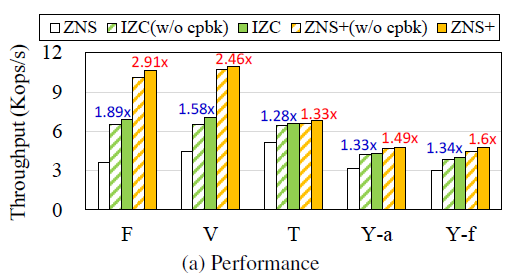

***

##### 元数据开销对比：

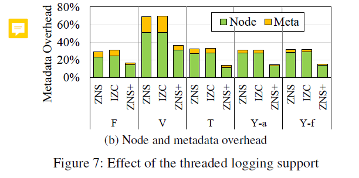

***

##### 性能对比、WAF

(ZNS的WAF呢？)
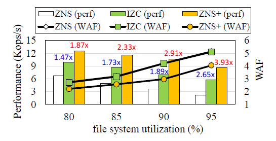

### 在真实SSD上的性能表现

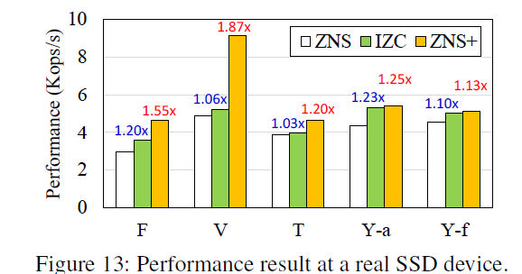

## ZNS SSD的结构

> Zoned Namespace (ZNS) SSD 
>
> https://blog.csdn.net/Z_Stand/article/details/120933188

粗粒度单位——zone，每个zone管理一段LBA（Logic block adr），只允许顺序写，可以随即读；如果想覆盖写，就要reset整段LBA

End-To-End？绕过I/O stack（内核文件系统，驱动等等），通过Zenfs直接与ZNS-SSD交互

> ZNS+: Advanced Zoned Namespace Interface for Supporting InStorage Zone Compaction(https://www.usenix.org/system/files/osdi21-han.pdf)
>
> https://blog.csdn.net/marlos/article/details/130234764

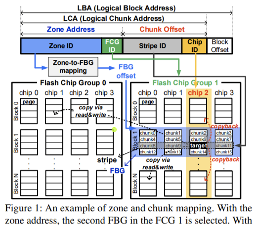

Flash Chip Group,FCG

Flash Block Group,FBG

## SSD 各层级

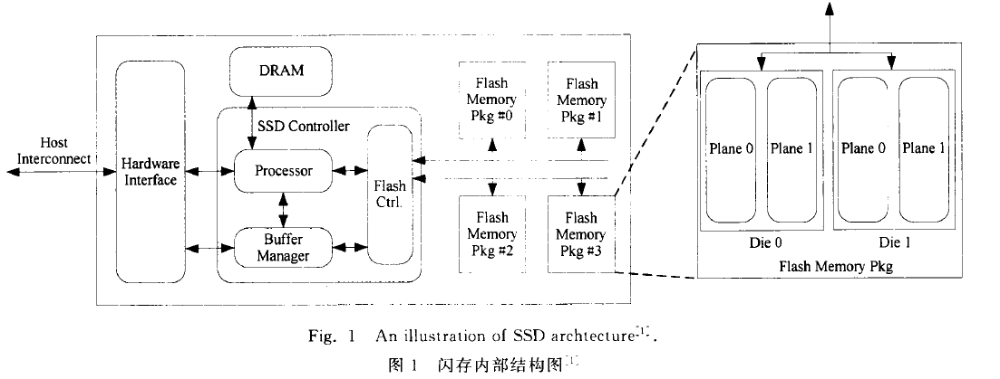

https://zhuanlan.zhihu.com/p/26944064

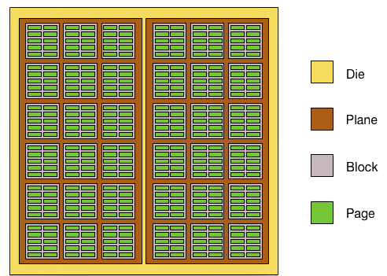

1. DIE/LUN是接收和执行闪存命令的基本单元
   但在一个LUN当中，一次只能独立执行一个命令，你不能对其中某个Page写的同时，又对其他Page进行读访问。

2. 每个Plane都有自己独立的Cache Register和Page Register，其大小等于一个Page的大小。

3. Multi-Plane（或者Dual-Plane），主控先把数据写入第一个Plane的Cache Register当中，数据保持在那里，并不立即写入闪存介质，等主控把同一个LUN上的另外一个或者几个Plane上的数据传输到相应的Cache Register当中，再统一写入闪存介质。

4. 闪存的擦除是以Block为单位的
   那是因为在组织结构上，一个Block当中的所有存储单元是共用一个衬底的（Substrate）

**Read Disturb 读干扰**
读干扰影响的是同一个block中的其他page，而非读取的闪存页本身。
当你读取一个闪存页（Page）的时候，闪存块当中未被选取的闪存页的控制极都会加一个正电压，以保证未被选中的MOS管是导通的。这样问题就来了，频繁地在一个MOS管控制极加正电压，就可能导致电子被吸进浮栅极，形成轻微写，从而最终导致比特翻转
**Program Disturb 写干扰**
轻微写导致的，既影响当前的page也影响同一个block的其他page。
**存储单元之间的耦合**
导体之间的耦合电容

一个存储单元存储1bit数据的闪存，我们叫它为SLC（Single Level Cell），存储2bit数据的闪存为MLC（Multiple Level Cell），存储3bit数据的闪存为TLC（Triple Level Cell），如表3-1所示。

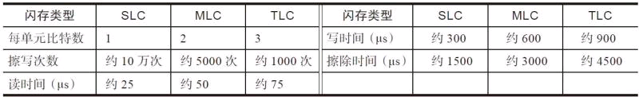

>F2FS文件系统

三星开源，但是没有什么应用

https://blog.csdn.net/weixin_39886929/article/details/111679671

https://blog.csdn.net/weixin_44465434/article/details/113374562

EROFS

# eZNS: 

### An Elastic Zoned Namespace for Commodity ZNS **SSDs**

https://www.usenix.org/system/files/osdi23-min.pdf

## 0 Abstract

新兴的分区命名空间（ZNS）固态硬盘提供了粗粒度的分区抽象，有望显著提高未来存储基础设施的成本效益，并降低性能的不可预测性。（作者对ZNS的总结评价）

现有的ZNS SSDs 采用静态分区接口（zoned interface），它们无法适应工作负载的运行时行为；无法根据底层硬件能力进行扩展；共用区域相互干扰。

eZNS——这是一个弹性分区命名空间接口，可提供性能可预测的自适应分区，主要包含两个组件：

- zone arbiter，区域仲裁器，负责管理Zone的分配和激活plane里的资源。

- I/O scheduler，分层I/O调度器，具有读取拥塞控制和写入接纳控制。

eZNS实现了对ZNS SSD的透明使用，并弥合了应用程序要求和区域接口属性之间的差距。在 RocksDB 上进行的评估表明，eZNS 在吞吐量和尾部延迟方面分别比静态分区接口高出 17.7% 和 80.3%（at most）

## 1 intro

通过划分为Zone ，实现“从设备端隐式垃圾收集 (GC) 迁移到主机端显式回收” ，消除了随机写，解决写放大（WAF）问题。

要在ZNS上构建高效的I/O stack，我们应该了解：

1. 底层固态盘如何暴露接口并强制实现它的限制（怎么顺序写？）
2. 设备内部机制如何权衡成本与性能。（代价是什么？）

文章详细调研了一款ZNS产品，在zone striping, zone alloation, and zone
interference三个方面进行对比分析。旨在了解商用 ZNS 固态硬盘的特性。

提出eZNS，新的接口层，它为主机系统提供了一个与设备无关的分区命名空间。

- 减少了区域内/外的干扰（？）
- 改善了设备带宽（通过分配激活资源，基于应用优化的负载配置）

***

eZNS对上层应用和存储栈透明，包含两个组件：

- **区域仲裁器**

维护 “设备影子视图” （device shadow view，该视图本质上是SSD的虚拟表示，仲裁者使用它来跟踪当前正在使用哪些区域以及哪些区域可供分配。）

基于该视图来实现 “动态资源分配” 策略，这意味着它可以根据当前的工作量和其他因素调整分配给每个区域的资源量。

- **分层 I/O 调度器**

充分利用ZNS SSD没有硬件隐藏信息的特性，读取 I/O 的可预测性变得更强，可以直接利用这一特性来检查区域间的干扰。

此外，由于固态存在写入缓存，所有应用的写入操作共享一个性能域，所有zone都激活的时候会堵塞。因此对读进行本地拥塞控制，对写入全局准入控制。

## 2 背景&动机

#### 2.2 Zoned Namespace SSDs

namespace：类似硬盘的分区，但是被NVMe设备主控管理（而不是OS）

zone：多个blcok的集合

ZNS能为主机应用提供可控的垃圾回收；消除了设备内部I/O行为（主要指消除写放大）

三种命令：read, sequential write, and append.

**与上一篇文章有出入的地方：**与普通写入相比，区域追加命令不会在 I/O 提交请求中指定 LBA，而固态硬盘会在处理时确定 LBA 并在响应中返回地址。

因此，用户应用程序可以同时提交多个未完成操作，而不会违反顺序写入的限制。

#### 2.3 Small-zone and Large-zone ZNS SSDs

*physical zone*：最小的区分配单元，由同一个die上的一个或多个块组成。

*logical zone*：由多个物理区组成的条带区域

**区域划分大小的影响：**

*Small zone ZNS SSD*：提供粗粒度的大型逻辑区域，采用固定的条带化配置，跨越所有内部通道的多个die，不灵活，适用于zone需求少的情况。

*Large zone ZNS SSD*：每个区域都包含在单个die中，最小为一个擦除块。灵活，同时可激活的资源更多。最近有研究认为越小越好，可以减少区回收延迟造成的干扰，所以这个区域划分有待探究。

#### 2.4 The Problem: Lack of an Elastic Interface

ZNS SSDs带来的问题：在zone被分配、初始化之后，他的性能就已经固定了

1. 分区的性能只取决于分区位置的放置和stripe的配置。（但我们希望它的性能符合应用的需求）虽然，用户定义的逻辑分区已经带来了灵活性，但是应用不了解正在共享设备的其他应用的状态。目前，只能实现“次优”的性能表现。
2. 现有的接口不能适应负载的变化。专门开发一个应用来捕获I/O执行时的数据是不现实的。用户使用时，不得不以最坏的情况来配置分区。（over-provision）
3. 共用一块位置的区域互相影响，尤其当固态硬盘被过度占用时，其性能会按比例下降。

## 3 ZNS SSD的性能

(用测试说明现有的ZNS太固化，不灵活)

#### **3.1 Set up**

>SPDK

本文使用在 SPDK 框架上运行的 Fio 基准测试工具来生成合成工作负载。作者在 SPDK 中添加了一个薄层，以实现逻辑区域概念并实现不同的区域配置。

- 写入负载默认为单个逻辑区域上的顺序访问
- 读取负载默认为随即访问

#### **3.2 System Model**

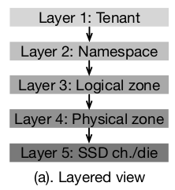

一个tenant=某个存储应用；它拥有一个或多个namespece；其中包含逻辑区域；一个逻辑区包含了多个物理区；物理区下面管理通道、die

/* 应用与NVME驱动之间存在一个 zoned block device (ZBD) layer

1. 在命名空间/逻辑区域管理方面与应用程序互动管理；
2. 考虑到应用需求，协调逻辑区到物理区的映射
3. 安排 I/O 序列，大限度地提高设备利用率并避免行头阻塞。*/

#### 3.3 Zone Striping

区域条带化是一种用于实现更高吞吐量的技术，尤其是大型 I/O。包含参数：

1. 条带大小：条带中最小的数据放置单位。 
2. 条带宽度：定义了同时激活的物理区域数量并控制写入带宽。

观察：当条带大小（stripe size）与 NAND 操作单元（这里是16KB）相匹配时，可以实现较好分条效率。

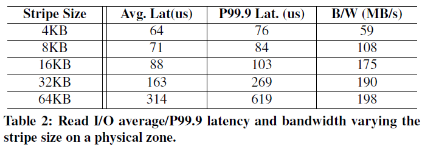

**Challenge #1: Application-agnostic   Striping**

stripe 最好与用户I/O匹配，太小了影响设备I/O效率，太大了浪费性能（单个zone性能变好了，但是可并行的zone总数低，影响其他应用）

（但是搞来搞去还是在等于pagesize时最好，动态调整的点在stripe width上）

#### 3.4 Zone Allocation and Placement

现有分配机制：找到下一个可用die，在这个die内根据磨损均衡等各种策略选择最好的块

图5：stripe size = 16KB，每个逻辑区包含N个物理区（横坐标）

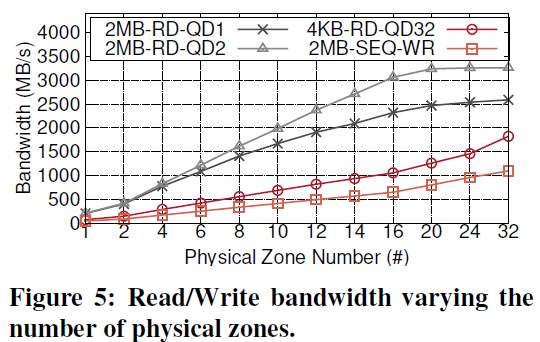

图5中 由上至下分析

1. PCIe gen3带宽跑满了
2. 应用发出的请求不足，因为请求队列深度只有1。(1,2对比可以体现出QD的差异)
3. 每个物理芯片80MB/s的读取和40MB/s的带宽，需要更多的物理区域(大约40~80)来充分利用通道或PCIe带宽（这部分做的很迷惑？）

**Challenge #2: Device-agnostic Placement**

理想的分配过程应该向应用充分利用ZNS SSD的所有内部I/O并行性。现有分配机制完全不考虑应用程序先前的分配历史，以及应用之间的交互关系，这会导致不平衡的区域放置，损害I/O并行性，并危及性能。

两种类型的低效放置：

- Channel-overlapped placement
- Die-overlapped placement

Observation：

在不知道设备内部规格的情况下推断区域的物理位置很困难的，我们需要建立一个设备抽象层

(1)依赖于设备的一般分配模型;
(2)维护底层物理设备的阴影视图;
(3)分析其在不同物理通道和模具上的放置平衡水平

#### 3.5 I/O Execution under ZNS SSDs

/* 当读取拥塞时，观察到die/channel争用下的延迟峰值。这是因为 ZNS SSD 没有任何物理资源分区。在namespace内或namespace之间，干扰都会比传统固态硬盘更严重。（感觉ZNS分配更混乱？因为跨物理区的分配？）*/

与物理配置的SSD作对比，128 Zone 16KB stripe size, 70% filled：（可以看到传统SSD因为垃圾回收损失之大）

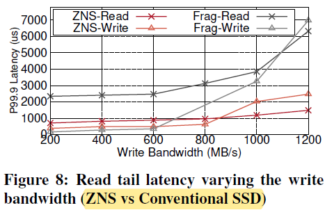

**Challenge #3: Tenant-agnostic Scheduling**

无论部署的工作负载如何，现有的ZNS ssd分区接口对域间情况提供的性能隔离和公平性保证很少。
人们不能忽视在一个die上的读干扰，因为

(1)任意数量的区域可以在die上碰撞，

(2)单个die的带宽很差，因此即使在设备上非常低的负载下，干扰也会变得严重，

(3)它会导致严重的线路阻塞问题并降低逻辑区域的性能。

Observation:

在多租户场景中使用ZNS ssd时，首先应该了解不同的命名空间和逻辑区域如何共享底层设备的通道和NAND die，将它们的关系划分为竞争和合作类型，并在区域间场景中采用拥塞避免方案以实现公平性。
由于没有设备簿记操作，因此I/O延迟表示碰撞死亡上的拥塞级别。
此外，写缓存拥塞需要全局解决。因此，一个可能的解决方案：

(1)一个全局中心仲裁器，决定所有活动区域之间的带宽共享;
(2)基于拥塞级别编排读I/O提交的perzone I/O调度器。

总结一下，三个挑战：

1. 条带化参数配置与应用无关
2. 区域放置与硬件无关
3. 调度与租户无关

## 4  eZNS

#### 4.1 Overview

eZNS停留在NVMe驱动程序之上，并提供原始块访问。

实现一个新的弹性的分区接口v-zone以解决上述问题 

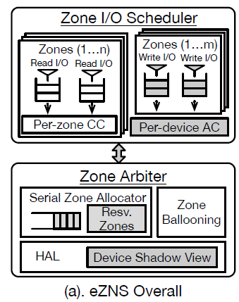

**区域仲裁器：**

(1)在硬件抽象层(HAL)中维护设备影子视图，并为区域分配和IO调度提供基础;

(2)执行序列化的区域分配，避免重叠放置; (就是把每个stripe unit分摊到不同的die上)

(3)通过收获机制动态缩放区域硬件资源和I/O配置。

**I/O调度器：**

一种延迟调度机制

一种基于令牌的准入机制

#### 4.2 HAL

约束条件：

- 物理区域由同一个die上的多个可擦除块组成
- ZNS在die上均匀地分配物理区（规定活动区数必须是die总数的倍数等）
- 分配机制遵循磨损均衡需要。连续分配区域不会在一个die上重叠，直至已经遍历所有die（最后一个contract不那么绝对）

eZNS维护一个影子设备视图（我们的机制不需要认识到SSD NAND芯片和通道的二维几何物理视图，也不需要维护精确的区域-芯片映射），暴露区域分配和I/O调度的近似数据位置。
我们的机制只依赖于来自设备规格的三个硬件参数：

**MAR** ，maximum active resources 通常与die数成正比，通过离线校准实验测试得到

**NAND page size** （ for striping ）不成文的标准，例如TLC一般用16KB。stripe size选用page size的倍数。

**physical zone size** 用以构造条带组和逻辑分区

#### 4.3 连续区域分配器

eZNS开发了一个简单的区域分配器，尽可能减少die冲突，具体地：

分配器把每个逻辑区请求缓存进一个队列。由于open命令完成时不能保证物理die已经分配完成，因此在区域打开期间，实现了一个保留机制：刷新一个数据块，强制将一个die绑定到该区域。这样能让写操作立即完成（即使高负载情况下，设备的写缓存也会接收一个块）。

为了加快这个过程， 主动地维护一定数量的块用作保留区。分配完成后，更新分配记录，写入元数据块。

以上的最终目的是避免打开多个逻辑区域时的交错分配，减轻重叠。

#### 4.4 Zone Ballooning

v-zone：一种特殊的逻辑分区，能自动扩展资源，以轻量级的方式匹配不断变化的应用程序需求。

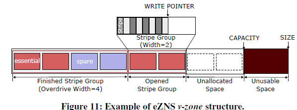

与静态逻辑zone类似，v-zone包含固定数量的物理zone。但与静态逻辑分区不同，它将物理区域划分为一个或多个条带组。当第一次打开v-zone或到达上一个条带组的终点时，它会分配一个新的条带组。当写指针到达前一个分条组的末端时，前一个分条组中的所有物理分区都必须完成。（以stripe group为管理单元）

分条组中物理分区的个数在分配时根据“local overdrive“机制确定，实现分区的灵活分条。

v-zone可以：

1. 在其他命名空间处于低活动资源使用状态时，通过从其他命名空间租用备用空间来扩展其条带宽度;
2. 当它完成I/O、通过写到分条组末尾或显式终止时，返回它们

**初始化：**

具体地，所有可用物理空间被划分为两类：基本分区（$N_{essential}$）、备用分区（$N_{spare}$）。基本分区包含能最大化写入带宽的激活物理分区。

均匀分配：例如，假设ZNS SSD现有$N$个namespace，那它只能独占并激活$N_{essential}/（N*MAR）$个物理区。

**Local Overdrive**：

eZNS 使用“Local Overdrive”操作通过从其命名空间的备用组重新分配备用磁盘空间来增强其写入 I/O 能力。 

该机制估算命名空间内的资源使用情况，检查剩余的备用磁盘，并根据写入活动和打开的 v-zone 数量调整分配给每个 v-zone 的备用磁盘数量。

**Global Overdrive**：

它是根据整个SSD的写入强度触发的。根据非活动命名空间的分配历史进行识别，让备用空间在活动命名空间之间分配。

当备用空间要被原namespace使用时，有一个回召机制。

总结，通过仲裁器和Overdrive操作提高了驱动器的整体性能和效率。

#### 4.5 I/O调度

**Goal：**

旨在在 v -zone 之间提供平等的读/写带宽份额，最大限度地提高设备利用率并缓解队头阻塞。

写：采用基于延迟测量的拥塞控制机制：ezNS 中具有缓存感知能力的写入准入控制，监控写入延迟来调整拥塞窗口大小（1-4 stripe width）

读：并使用基于令牌的准入控制方案来调节写入。它定期生成令牌并允许分批写入 I/O 。

-  eZNS 中的读取调度器和写入准入控制几乎不需要协调，并且使用延迟作为信号来推断带宽容量。
- 当在物理芯片上混合读写I/O时，总聚带宽可能会因NAND干扰而下降，但eZNS可以在没有显著协调的情况下处理这个问题。(?) 
- 用户 I/O 中同一物理区域的条带会合并并作为一个写入 I/O 批量提交，因此较小的条带大小不会降低写入带宽。

### 测试

**Default v-zone Configuration**

4 Namespaces (Each namespace has 64 Active zones)

Each Namespace

- Essential resources :32 (128 / 4) 
- Spare resources :32 (64 - 32)
- Maximum active v-zones :16
- Minimum stripe width : 2 with 32KB stripe size (32 / 16)
- Physical Zones in Logical Zone :16

结合之前的实际硬件参数：

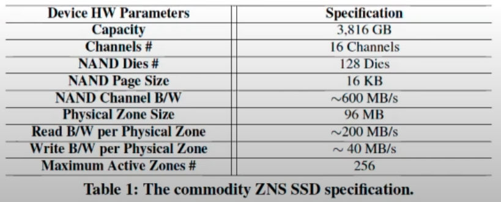

证明 Local Overdrive是有效的

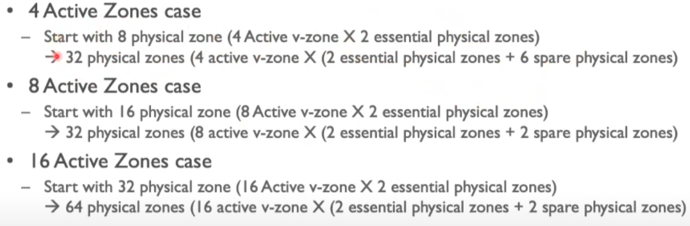

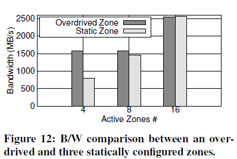

Global Overdrive

NS1 NS2 NS3 两写入， NS4 八写入任务。NS1、NS2 和 NS3 在 t=30 秒时停止写入，并在 t=80 秒时恢复写入活动。当其他三个区域闲置时，来自 NS4 的 v 区域使用全局超速原语从其他命名空间获取多达 3 倍的备用区域，并最大限度地利用其写入带宽（2.3GB/s）。然后，当其他区域再次开始发出写入指令时，它可以迅速释放收获的区域。

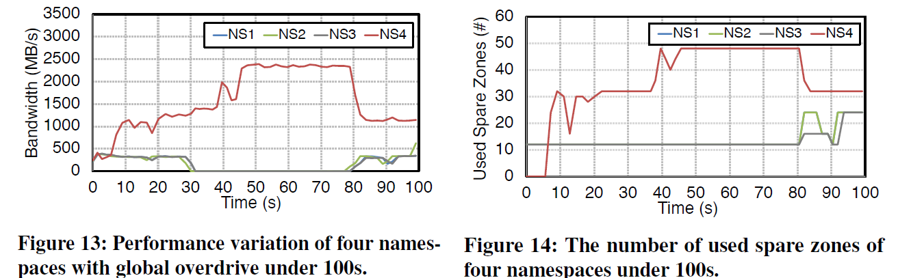

A B都是覆写, CD同时执行随机读。

在RocksDB上，eZNS 相较于 static zoned interface 提升了 17.7% 的吞吐量和 80.3% 的尾时延。

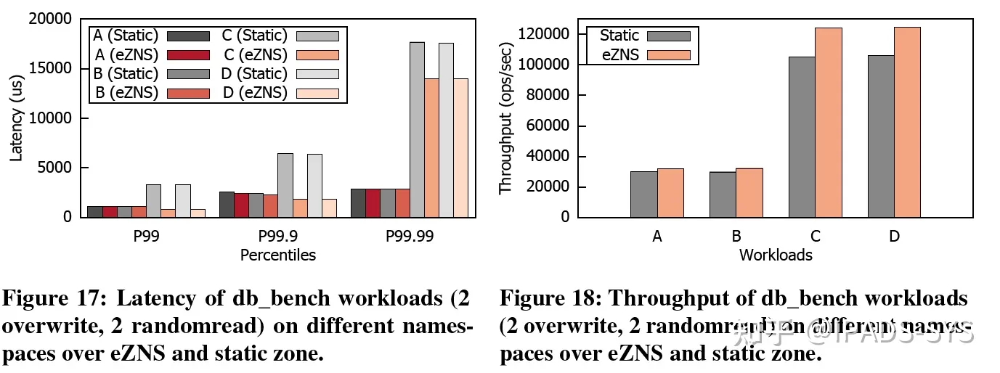

## 总结

具体而言，ZNS SSD接口的**静态**和**不灵活**体现在三个方面：

**1. Zone Striping：**不同workloads在不同的stripe size和stripe width设置下表现不同

**2. Zone Allocation：**一个logical zone中physical zones越多，性能越好；zone放置时的channel overlap和die overlap都会影响并行度。现有zone放置机制没有考虑这些特性。

**3. Zone Interference：**ZNS内部执行I/O请求、其他用户执行的I/O请求都会互相影响。现有机制任务间隔离性差。

它有两个组件：

- **Zone 仲裁者（Arbiter）**：维护 device shadow view，执行 zone 分配以避免 overlap （解决问题2），通过 zone ballooning 执行动态资源分配 （解决问题1）
- **Zone I/O调度器**：使用**局部拥塞控制机制 (congestion control)** 来调度读请求；使用**全局权限控制机制 (admission control)** 来调度写请求（解决问题3）

> ZenFS——RocksDB on ZNS device
>
> https://zhuanlan.zhihu.com/p/555476626

一个韩国人讲eZNS

https://www.youtube.com/watch?v=q10_ExFD8RA

# ZNSwap

ZNSwap: un-Block your Swap

https://www.usenix.org/system/files/atc22-bergman.pdf

主机端OS内实现垃圾回收机制

## 1 Intro

固态硬盘上的交换不再被视为最后的内存溢出机制，而是有效回收内存和提高系统效率的关键系统组件。但固态硬盘未被作为交换设备广泛应用，其中一个关键限制是：

随着固态硬盘使用率的增加，系统性能会下降，如图。

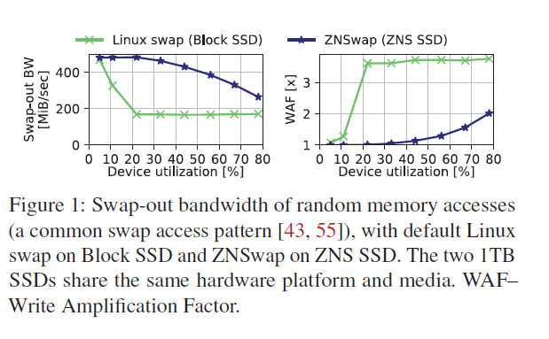

这些性能异常现象没有简单的解决方案——它们源于块接口抽象与闪存介质的内在不匹配。

---

ZNSwap为SSD空间回收提供了一种新颖的、空间高效的主机端机制，我们称之为ZNS Garbage Collector(ZNGC)

与传统固态硬盘的设备侧 GC 不同，ZNGC 与操作系统紧密集成，可直接访问操作系统的数据结构，并利用这些数据结构优化其运行。

然而，问题：空间回收过程自然涉及到设备上逻辑块的迁移，而未与拥有数据的应用程序协调块位置的变化。

这在 SSD 端做 GC 时不是问题，因为用户可见的LBA（逻辑块地址）保持不变。但把设备侧的方案应用于主机侧 ZNGC 会带来不可接受的空间开销，因为在 TB 级设备中，每个 4KiB 块都需要维护反向映射...

>关于上述这个问题：映射表不可以放到主存中吗？ 1TB 级SSD设备也不会把整张页表都存储在DRAM中，因为根本没有这么大的板载DRAM（1 TB Flash needs 1GB DRAM）并且使用很大的DRAM空间是要考虑断电时的落盘速度的 ；（存疑）SSD应该是只加载一小部分映射表到DRAM，其余存在Flash中，类似CPU-主存中的TLB。

ZNSwap 通过将反向映射信息存储到逻辑块元数据中，与被交换的页面内容一起写入，从而避免了主机的这些开销。确保映射在页面生命周期内正确无误。

---

具体地，带来了如下好处：

- 细粒度的空间管理：ZNSwap 可省去 TRIM 命令，实现更高的性能和更好的空间利用率。
- 动态的ZNGC优化：ZNSwap 可动态调整同时存储在交换设备中的交换入页的数量，从而提高多读和读写混合工作负载的性能。操作系统会在交换设备中保存一份未修改的已交换内存页副本以避免这些页面的交换惩罚。此类页面可能占用的磁盘空间由操作系统设置静态上限（Linux 为 50%，不可配置）。然而，这一静态阈值并不适合所有工作负载：较低的阈值会降低以读取为主的工作负载的性能，而较高的阈值则会影响读写混合型工作负载（第 3.1.2 节）。ZNSwap 可监控 WAF，并在必要时通过回收交换页面的 SSD 空间来降低存储占用率。
- 灵活的数据放置和空间回收策略：ZNSwap 允许轻松定制磁盘空间管理策略，使 GC 逻辑符合特定系统的交换要求。例如，策略可以强制将生命周期相近的数据集中到同一区域，这在以前的文献[28, 34, 44, 56]中被证明是有用的；也可以通过专用于处理来自特定租户的交换的单独区域来实现更好的性能隔离。
- 准确的多租户计费：当ZNGC在主机上运行时，zswswap与cgroup计费机制集成，显式地将GC开销归因于不同的租户，从而提高了它们之间的性能隔离。

>TRIM：粗糙地理解一下TRIM指令，操作系统使用TRIMs提示块SSD来释放特定的LBAs，从而减少SSD端GC的负载。在OS执行Swap时，大多禁止使用TRIM，开销比较大

综上所述，主要贡献如下:

- 深入分析传统块ssd用作交换设备时的缺点。
- 一种新机制，通过利用逻辑块元数据进行有效的反向映射，使ZNS ssd能够用于交换，而无需在主机中使用资源昂贵的重定向机制。
- 自定义交换感知SSD存储管理策略，减少WA，提高性能，并在多租户环境中实现更好的隔离。
- 在标准基准测试和实际应用中进行了广泛的评估，证明了zsswap的性能提升，例如，与传统的块SSD交换相比，znswap的99百分位延迟降低了10倍，memcached的吞吐量提高了5倍，WAF降低了2.5倍。

## 2 背景 & 3 动机

**OS swap**

OS swap的初衷——当系统遇到内存压力时，它选择内存页，将其驱逐到交换设备(操作系统从页表中解映射选择要驱逐的页，并交换出该页，将其写入交换设备。)

swap-slots：Linux将交换设备上的空间划分为内存大小的块，称为交换槽。操作系统为每个被换出的页面分配一个新的插槽。

**Block SSD空间管理**

（FTL）维护的是LBA到物理地址的映射。例子：想要更新一个块，找一个新块直接写；改映射表；将原位置上的旧数据标为失效。这样的失效块需要垃圾回收，一方面需要空间上over-provisioning (OP)，另一方面设备端进行的GC会与用户I/O竞争带宽。

> WAF：外部的要写入的数据/ 在CG下的实际写入。OP越小，WAF越高。

**Zoned Namespace SSD(ZNS)**

新兴的“存储接口”，逻辑上的组织方式（每个区域大小在物理上与SSD的擦除块大小对齐），在一个Zone内必须顺序写（write、append，对于append，SSD在完成后才会返回具体写入的位置，这允许对一个Zone同时进行多个写请求）。Zone状态：Empty，Open，Full。要重写Zone，需要显示的清除，转换为Empty状态。

### 3 动机

"Flash的激增《复活》了swap的使用"

Swap不再仅仅是应对内存压力的手段，Swap在适度负载时可以充当内存扩展。（例如，优化文件支持和匿名内存页面之间的内存平衡。）但现有的工作更关注OS内的逻辑，本文将结合交换逻辑与SSD的行为对Linux Swap的性能进行深入分析。

#### 3.1  SSD Swap中的异常

- GC不能感知已释放的交换槽
- 交换缓存不能感知GC
- GC不了解页面访问模式
- GC不了解OS的性能隔离

再次观察图1，这种下降是意料之中的，因为GC开销与主动更新的数据量成比例增长。
然而，当设备几乎为空（仅占其容量的10%）时，不应出现下降。

根本原因是设备侧GC没有意识到操作系统丢弃了一些交换出的页面，并没有使其对应的交换插槽无效，操作系统默认情况下不会通知SSD。因此，交换设备的实际占用率远高于操作系统可见的占用率，从而导致更高的GC开销。

为了解决上述问题，大多数SSD都支持了**TRIM**命令。

然而在实践中，流行的Linux发行版（例如Debian、Ubuntu）禁止使用TRIM命令进行交换。原因包括TRIM调度开销、TRIM命令的长延迟以及支持异步TRIM的复杂性。作者简单测试了当显式启用交换的TRIM时的情况（略），Linux优化后的TRIM命令与不启用TRIM效果一致

总之：TRIM开了不如不开。（swapon手册中也是这样注释的）

>在Linux系统中，交换槽（swap slot）是指用于存储交换空间（swap space）中的数据的固定大小的块。

#### 3.2 在ZNS上做Swap的可能

ZNS ssd提供了对物理数据放置的更好控制，从而支持应用程序逻辑和设备管理之间更紧密的耦合，并且已经被证明可以为生产Key-Value-Stores提供新的优化机会。这些结果激发了一种新的GC-swap子系统协同设计，它可以利用这种耦合来缓解上述传统ssd的性能问题。

。。。

## 4 Design

ZNS解决了3个关键的设计目标

**主机端垃圾回收**

在ZNS中回收空间需要一个主机端进程：把碎片化的有效内容合并成一个新区，擦除被释放的旧区域。

主要挑战是最小化开销，因为与设备端GC不同，主机端GC直接与常规应用程序争用主机资源。

从本质上讲，我们需要以最小的成本将GC从设备上加载到CPU上，从而使其与Swap的集成更加紧密。

因为有上述限制，直接移植已有的GC实现不可行，（例如FTL中GC的实现需要维护千分之一大小的映射表）

但是ZNGC不需要维护额外的间接层：

znGC通过将内核的反向映射元数据与交换出的页面一起存储在SSD中，避免了额外的间接层。这意味着在进行垃圾回收时，不需要查找额外的数据结构或表来获取页面的映射信息。相反，这些映射信息直接附加在交换出的页面本身上。

**ZNGC-OS集成**

相对于设备端垃圾回收，集成后通过OS暴露的信息可以优化Swap的性能

例如：ZNGC可以识别操作系统无效的交换槽（swap slot），并避免不必要的复制，而无需使用其他方式。

**数据放置策略**

策略取决于执行环境，提供了几种策略

### 4.1 总览

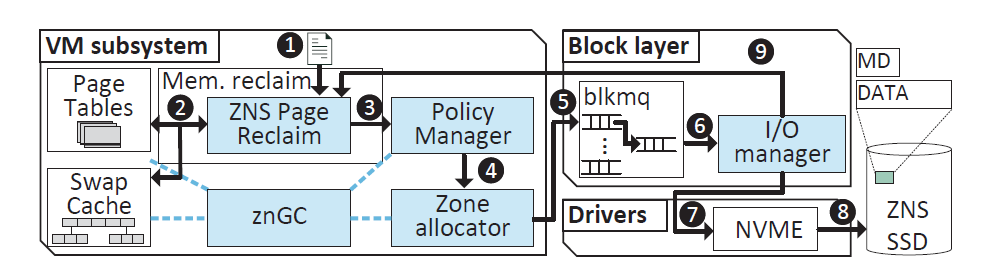

### 4.2 znGC

znGC集成在kernel virtual memory (VM)中。作为守护进程，当空zone数较低时触发。（或通过zswap策略的明确请求）

相对于块ssd，被ZNGC移动的页面讲被分配一个新的主机可见地址。如果没有额外的转换层，ZNGC必须更新保存原始页面交换槽的页表，以反映新的位置。

为此，ZNGC将相关的反向映射元数据与数据一起存储在ZNS SSD的per-LBA中，以帮助以后更新页表。

哪些信息需要存储在页面元数据中以保证反向映射在其生命周期内保持正确?

——Linux中已实现的反向映射方案

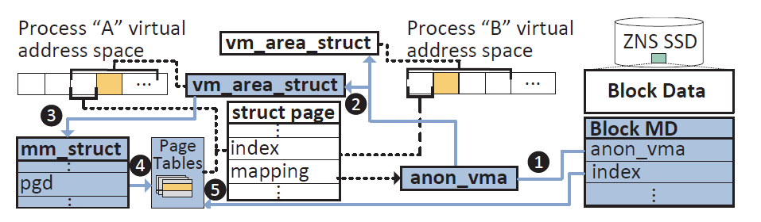

### 4.3 ZNGC-swap一体化

a）物理zone（空间）信息：每个空间与swap-slots的映射相关联，映射存储了每个swap-slot的状态。这样ZNGC和OS就可以立马知道swap-slot的状态转变，不需要TRIM和截断阈值来管理交换缓存。

b）交换空间抽象：可以被用来swap-slot分配的活跃空间通过交换空间抽象进行暴露，从而避免管理物理空间的复杂性。

c）ZNSwap策略：提供一系列接口使得可以定制化空间分配策略和回收策略。

d）接口：本文定义了三个标准api，单核策略、冷热策略和进程策略，分别是对每个核的数据、冷热数据和进程数据进行性能隔离。

## 评估

Ubuntu 20.04  Linux Kernel 5.12 

512G DDR4 

1T 西数ZN540 + 1T SSD

交换空间大小 = 系统内存大小 ，其他剩余的空间填充数据。

**Facebook memcached-ETC**
其中 90% 的请求在 10% 的key上。

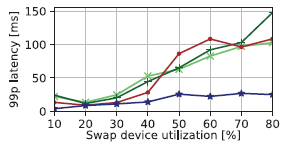

## 评估

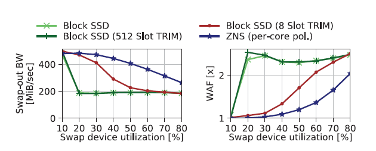

### 反向映射

匿名页反向映射是Linux内核中的一种机制，用于解除物理页与进程虚拟地址空间之间的映射关系。这个机制主要分为匿名页映射和文件页映射两种类型。下面将详细介绍匿名页反向映射的过程和anon_vma结构的作用。

1. 匿名页反向映射过程：
   - 当内核需要回收一个物理页时，需要先解除该物理页与进程虚拟地址空间的映射关系。
   - 反向映射机制通过查找物理页的映射关系，找到所有映射到该物理页的进程虚拟地址空间。
   - 反向映射过程主要涉及三个关键的数据结构：struct vm_area_struct (VMA)、struct anon_vma (AV)和struct anon_vma_chain (AVC)。
   - VMA用于描述进程的虚拟地址空间，其中的anon_vma_chain成员用于链接VMA和AV。
   - AV用于管理匿名页面映射的所有VMA，物理页的struct page中的mapping成员指向该结构体。
   - AVC是一个链接VMA和AV的桥梁，每个AVC都有一组对应的VMA和AV。AV会将与其关联的所有AVC存储在一个红黑树中。
2. anon_vma结构的作用：
   - anon_vma结构用于管理匿名页面对应的所有VMA。
   - 它可以通过物理页的mapping成员找到与之关联的AV。
   - AV中的rb_root红黑树存储了与该AV关联的所有AVC，通过遍历红黑树可以找到所有映射到该物理页的VMA。

通过匿名页反向映射机制，内核可以有效地解除物理页与进程虚拟地址空间之间的映射关系，并且可以快速找到所有映射到该物理页的VMA。这对于内核的内存管理非常重要。

>### Linux Swap
>
>1. 交换页面：当需要将数据页写入Swap空间时，Linux会将这些页面标记为“交换出”。数据页的内容将被写入Swap分区或Swap文件中，以释放内存供其他进程使用。
>2. 程序恢复：如果系统需要访问已经被交换出的页面，Linux会将这些页面重新读取到内存中。这将导致其他数据页被交换出，以便为需要的页面腾出空间。
>3. Swap空间的管理：Linux会定期检查Swap空间的使用情况，并根据需要进行Swap页面的调度和重新分配。这包括根据页面的活跃性和访问模式来决定哪些页面应该被换入或换出。
>
>### Swap Cache
>
>- Swap Cache是指交换分区中的缓存区域，类似于文件系统中的page cache。
>- Swap Cache用于存储匿名页（即没有文件背景的页面）的内容，这些页面在即将被swap-out时会被放进swap cache，但通常只存在很短暂的时间，因为swap-out的目的是为了腾出空闲内存。
>- 曾经被swap-out现在又被swap-in的匿名页也会存在于swap cache中，直到页面中的内容发生变化或者原来使用过的交换区空间被回收。
>
>Swap Cache（交换缓存）是Linux操作系统中的一种缓存机制，用于提高对Swap分区的读取性能。它是在内核中实现的一种缓存层，用于存储最近从Swap分区中读取的数据页，以便在需要时可以更快地访问这些页面。
>
>当Linux系统需要将数据页从Swap分区中读取回内存时，数据页会首先被放置到Swap Cache中。这样，如果后续的访问请求需要读取相同的数据页，内核可以直接从Swap Cache中获取数据，而无需再次访问慢速的Swap分区。

# ZNS

ZNS: Avoiding the Block Interface Tax for Flash-based SSDs

https://www.usenix.org/system/files/atc21-bjorling.pdf

目前的基于闪存的SSD仍然使用几十年前的块接口，存在问题：容量过配置、用于页映射表的DRAM空间开销、垃圾收集开销以及主机软件复杂性（为了减少垃圾回收）方面的大量开销。

通过暴露闪存擦除块边界和写入顺序规则，ZNS接口要求主机软件解决这些问题。展示了启用对ZNS SSD的支持所需的工作，并展示了修改后的f2fs和RocksDB版本如何利用ZNS SSD以实现与具有相同物理硬件的块接口SSD相比更高的吞吐量和更低的尾延迟。

## 1 Intro

最初引入块接口是为了隐藏硬盘媒体的特性并简化主机软件，块接口在多个存储设备的世代中表现良好，对于基于闪存的SSD，支持块接口的性能和运营成本正在急剧增加。

下图描述了GC给吞吐速度带来的影响，也可以看到更大的OP配置为GC带来了性能提升。但都不如ZNS。

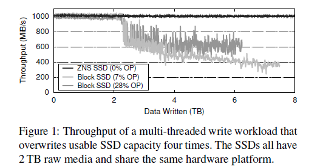

本文描述了ZNS接口以及它是如何避免块接口带来的开销的（第2节）。我们描述了ZNS设备所放弃的责任，使它们能够减少性能不可预测性并通过减少对设备内资源的需求来显著降低成本（第3.1节）。此外，我们还描述了ZNS的一个预期后果：主机需要以擦除块的粒度来管理数据。将FTL（Flash Translation Layer）的责任转移到主机上并不如与存储软件的数据映射和放置逻辑集成来得有效，这是我们提倡的方法（第3.2节）。 

这篇论文提出了五个关键贡献：

1. 首次对生产中的ZNS SSD进行了研究论文中的评估，并直接将其与使用相同硬件平台和可选的多流支持的块接口SSD进行了比较。
2. 对新兴的ZNS标准及其与先前SSD接口的关系进行了回顾。
3. 描述了将主机软件层适应ZNS SSD的经验教训。
4. 描述了一系列跨足整个存储堆栈的变化，以实现ZNS支持，包括对Linux内核、f2fs文件系统、Linux NVMe驱动和分区块设备子系统、fio基准测试工具的更改，以及相关工具的开发。
5. 引入了ZenFS，作为RocksDB的存储后端，以展示ZNS设备的完整性能。所有代码更改都已开源并合并到了各自的官方代码库中。、

论文的第2部分讨论了"Zoned Storage Model"，描述了存储设备的发展历史以及传统的块接口模型，以及ZNS模型的背景和特性。这部分包括了以下内容：

- 描述了多年来存储设备一直以一维数组的形式暴露其主机容量，以及如何通过块接口来进行数据读取、写入或覆写。
- 讨论了块接口的设计初衷，即紧密跟踪当时最流行的设备特性，即硬盘驱动器（HDDs）。
- 介绍了随着时间的推移，块接口提供的语义成为了应用程序所依赖的默契协定。
- 引入了Zoned Storage模型的概念，最初是为了Shingled Magnetic Recording（SMR）HDDs而引入的，旨在创造与块接口兼容成本无关的存储设备。

论文进一步详细讨论了ZNS模型的基本特征以及与块接口的比较。

## 2 Zone 存储模型

### 2.1 块接口的开销

FTL异地更新带来性能不可预测性

Over-provision（最多28%）

映射表DRAM

### 2.2 现有工作

具有流支持的SSD（Stream SSDs）和开放通道SSD（Open-Channel SSDs）。

Stream SSDs允许主机使用流提示标记其写入命令。流提示标记由Stream SSD解释，允许它将传入的数据区分到不同的擦除块中，从而提高了整体SSD性能和媒体寿命。然而，Stream SSDs要求主机要仔细标记具有相似寿命的数据，以减少垃圾回收。如果主机将不同寿命的数据混合到同一流中，Stream SSDs的行为类似于块接口SSD。此外，Stream SSD必须携带资源来管理这种事件，因此它们无法摆脱块接口SSD的额外媒体超额配置和DRAM成本。论文中还在第5.3节中对Stream SSD和ZNS SSD的性能进行了比较。

开放通道SSD允许主机和SSD通过一组连续的LBA块来协同工作。OCSSDs可以将这些块暴露出来，以便它们与媒体的物理擦除块边界对齐。这消除了设备内垃圾回收的开销，并减少了媒体超额配置和DRAM的成本。在OCSSDs中，主机负责数据的放置，包括底层媒体可靠性管理，如均衡磨损，并根据OCSSD类型处理特定的媒体故障特性。这有潜力改善SSD性能和媒体寿命，但主机必须管理不同SSD实现之间的差异以确保耐用性，使界面难以采用，并需要持续的软件维护。

### 2.3 Zone

"zone"（分区）：每个zone表示SSD的逻辑地址空间中的一个区域，可以任意读取，但必须按顺序写入，覆写必须显式地进行重置。写入约束由每个zone的状态机和写入指针来执行。

*state：*每个区域都有一个状态，确定给定区域是否可写，具有以下状态：EMPTY、OPEN、CLOSED或FULL。区域从EMPTY状态开始，在写入时转换为OPEN状态，最终在完全写满时转换为FULL状态。设备可能会进一步限制同时处于OPEN状态的区域数量，例如，由于设备资源或媒体限制。如果达到限制并且主机尝试写入新区域，那么必须将另一个区域从OPEN状态转换为CLOSED状态，以释放设备上的资源，如写入缓冲区。CLOSED区域仍然可写，但必须在提供额外写入之前再次转换为OPEN状态。

*write pointer：*每个区域的写指针指定可写区域内的下一个可写LBA，仅在EMPTY和OPEN状态下有效，在每次写入时刷新。

## 3 Evolving towards ZNS

### 3.1 硬件

ZNS为终端用户带来了很多好处，但它在固态硬盘 FTL 的设计中引入了以下折衷方案（trade-off）

**区域大小（Zone Sizing）**

SSD的写入能力与擦除块的大小直接相关。在块接口SSD中，擦除块的大小选择使数据跨越多个闪存芯片以提高读写性能，并通过每个条带的奇偶校验来防护芯片级别及其他媒体故障。SSD通常有一个条带，包括16-128个芯片的闪存块，这相当于拥有几百兆字节到几个千兆字节写入能力的区域。大区域减少了主机数据放置的自由度，因此提倡尽可能小的区域大小，同时仍提供芯片级保护和适当的区域读写性能。

**映射表（Mapping Table）**

在块接口SSD中，使用板载的DRAM维护全关联映射表。这种精细的映射提高了垃圾收集性能。但ZNS使用更粗的粒度的映射，以可擦除块级别 or 混合方式维护映射表。

### 3.2 主机端适配

顺序写型应用是采用ZNS的首选，例如LSM-tree数据库。就地更新型应用就很难搞。下面介绍主机软件适应ZNS的三种方法。

1. **主机端闪存转换层（HFTL）**：HFTL充当ZNS SSD的写入语义与执行随机写入及就地更新的应用之间的中介。它的职责与SSD中的FTL相似，但仅限于管理转换映射和相关的垃圾回收。尽管HFTL的职责较SSD FTL小，但它必须管理其对CPU和DRAM资源的使用，因为这些资源与主机应用共享。HFTL简化了与主机端信息的整合，增强了数据放置和垃圾回收的控制，并向应用程序提供传统块接口。目前，例如dm-zoned、dm-zap、pblk和SPDK的FTL等工作显示了HFTL的可行性和应用性，但目前只有dm-zap支持ZNS SSD。
2. **文件系统**：更高级别的存储接口（例如POSIX文件系统接口）允许多个应用通过共同的文件语义访问存储。通过将区域与存储堆栈的更高层次整合，即确保主要是顺序工作负载，可以消除与HFTL和FTL数据放置及相关间接开销。这也允许使用高级存储堆栈层已知的额外数据特性来改善设备上的数据放置。但是，目前大多数文件系统主要执行就地写入，适应区域存储模型通常很困难。然而，一些文件系统（如f2fs、btrfs和zfs）表现出过度顺序的特性，可能更适合ZNS。
3. **针对顺序写入操作的应用**：对于主要进行顺序写入的应用来说，ZNS是一个很好的选择。例如，基于日志结构合并（LSM）树的数据库。这些应用因为其顺序写入的特性，与ZNS接口的设计高度兼容。反之，就地更新为主的应用则更难支持，除非对核心数据结构进行根本性修改。

## 4 实现

- Linux支持	Zoned Block Device (ZBD)
- f2fs
- fio测试增加了ZNS属性
- ZenFS

- Linux支持  (对内核对用户的接口，如util-linux等)	
- 修改f2fs以支持ZNS
- fio测试增加了ZNS
- 开发了ZenFS作为RocksDB的后端

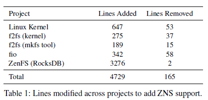

### 4.1 Linux支持

**Zoned Block Device（ZBD）子系统**：这是一个抽象层，为不同类型的区域存储设备提供统一的区域存储API。它既提供内核API，也提供基于ioctl的用户空间API，支持设备枚举、区域报告和区域管理（例如，区域重置）。应用程序如fio利用用户空间API发出与底层区域块设备的写特性一致的I/O请求。

**为Linux内核添加ZNS支持**：修改了NVMe设备驱动程序，以便在ZBD子系统中枚举和注册ZNS SSD。为了支持评估中的ZNS SSD，ZBD子系统API被进一步扩展，以暴露每个区域的容量属性和活动区域的限制。

**区域容量（Zone Capacity）**：内核维护着区域的内存表示（一组区域描述符数据结构），这些由主机单独管理，除非出现错误，否则应该从特定磁盘刷新区域描述符。区域描述符数据结构增加了新的区域容量属性和版本控制，允许主机应用检测这个新属性的可用性。fio和f2fs都更新了以识别新的数据结构。fio只需避免超出区域容量发出写I/O，而f2fs则需要更多的改变。

f2fs以段为单位管理容量，通常是2MiB的块。对于分区块设备，f2fs将多个段管理为一个部分，其大小与分区大小对齐。f2fs按照部分段的段按顺序写入，不支持部分可写区域。为了在f2fs中添加对分区容量属性的支持，内核实现和相关的f2fs工具增加了两种额外的段类型，除了三种传统的段类型（即自由、打开和满）之外：一个无法使用的段类型，用于映射分区中不可写入的部分，以及一个部分段类型，用于处理段的LBA跨越分区的可写和不可写的LBA的情况。部分段类型明确允许在段块大小和特定分区的分区容量不对齐的情况下进行优化，利用分区的所有可写容量。

**限制活动区域（Limiting Active Zones）**：由于基于闪存的SSD的性质，同时处于打开或关闭状态的区域数量有严格的限制。在区域块设备枚举时检测到这个限制，并通过内核和用户空间API暴露。SMR HDD没有这样的限制，因此这个属性初始化为零（即无限）。f2fs将这个限制与可以同时打开的段数相关联。

**对f2fs的修改**：f2fs要求其元数据存储在传统块设备上，需要单独的设备。在修改中没有直接解决这个问题，因为评估中的ZNS SSD将其一部分容量作为传统块设备暴露。如果ZNS SSD不支持，可以添加类似于btrfs的就地写入功能，或者小的转换层可以通过传统块接口在ZNS SSD上暴露一组限制区域。

**性能考量**：所有区域存储设备都禁用了Slack Space Recycling（SSR）功能（即随机写入），这降低了整体性能。然而，由于ZNS SSD实现了更高的整体性能，即使在启用SSR的块接口SSD上，也展示了更优越的性能。

### 4.2 RocksDB Zone Support

> ZenFS

*（LSM-tree的介绍）*

LSM树的多层级结构：LSM树包含多个层级，其中第一层（L0）在内存中管理，并定期或在满时刷新到下一层。刷新之间的中间更新通过写前日志（WAL）持久化。其余层级（L1; ...; Ln）维护在磁盘上。新的或更新的键值对最初被追加到L0，在刷新时，键值对按键排序，然后以排序字符串表（SST）文件的形式写入磁盘。

层级大小和SST文件：每个层级的大小通常是上一层的倍数，每个层级包含多个SST文件，每个SST文件包含一个有序的、不重叠的键值对集合。通过显式的压缩过程，一个SST的键值对从一个层级（Li）合并到下一个层级（Li+1）。压缩过程从一个或多个SST中读取键值对，并将它们与下一层的一个或多个SST中的键值对合并。合并的结果存储在一个新的SST文件中，并替换LSM树中的合并SST文件。因此，SST文件是不可变的，顺序写入的，并作为单个单元创建/删除。

RocksDB的存储后端支持：RocksDB通过其文件系统包装器API支持不同的存储后端，这是一个统一的抽象，用于RocksDB访问其磁盘上的数据。核心API通过唯一标识符（例如，文件名）识别数据单元，如SST文件或写前日志（WAL），并映射到字节寻址的线性地址空间（例如，文件）。每个标识符支持一组操作（例如，添加、移除、当前大小、利用率），除了随机访问和顺序只读和写入字节寻址语义。这些与文件系统语义密切相关，在文件系统中，通过文件访问标识符和数据，这是RocksDB的主要存储后端。通过使用文件系统管理文件和目录，RocksDB避免了管理文件区域、缓冲和空间管理，但也失去了将数据直接放置到区域中的能力，这阻止了端到端的数据放置到区域中，从而降低了总体性能。

#### 4.2.1 ZenFS 结构

ZenFS是一个针对ZNS SSD设计的存储后端，它实现了一个最小的磁盘文件系统，与RocksDB的文件包装API进行集成。ZenFS通过小心地将数据放置到不同的区域（zones）中，同时遵守它们的访问约束，与设备端的区域元数据进行协作（例如，写指针），降低了与持久性相关的复杂性。ZenFS的主要结构包括：

*（LSM-tree的介绍，略）*

### ZenFS存储后端

ZenFS是为RocksDB设计的，专门用于在分区存储设备（例如ZNS SSD）上高效存储数据的文件系统。它充分利用了RocksDB的LSM树结构及其不可变的、仅顺序压实过程，为分区存储设备提供了一种优化的数据管理方法

RocksDB 通过其文件系统包装器 API 提供对独立存储后端的支持，该 API 是 RocksDB 访问其磁盘数据的统一抽象。从本质上讲，包装器 API 通过唯一标识符（例如文件名）识别数据单元，例如 SST 文件或预写日志 (WAL)，该标识符映射到一个可按字节寻址的线性地址空间（例如文件）。每个标识符除了随机访问和仅顺序的可按字节寻址的读写语义之外，还支持一组操作（例如，添加、删除、当前大小、利用率）。这些操作与文件系统语义密切相关，其中标识符和数据可通过文件访问，这是 RocksDB 的主要存储后端。通过使用管理文件和目录的文件系统，RocksDB 避免了管理文件范围、缓冲和空闲空间管理，但也失去了将数据直接放置到区域中的能力，这阻止了端到端数据放置到区域中，因此降低了整体性能。

>RocksDB 本身有一个文件系统包装器，称为 `Env`。`Env` 是一个抽象接口，为 RocksDB 提供了对底层文件系统的访问。默认 `Env` 实现是 `PosixEnv`，也有WindowsEnv,MemoryEnv,S3Env
>
>通过使用 `Env` 接口，RocksDB 可以与不同的文件系统交互，而无需修改其核心代码。因此，**RocksDB 的底层通常是普通的文件系统**，例如 ext4、NTFS 或 XFS。但是，通过使用 `Env` 接口，RocksDB 也可以与其他类型的存储系统交互，例如云存储或分布式文件系统。

#### 4.2.1 ZenFS 结构

ZenFS 存储后端实现了一个最小的磁盘文件系统，并使用 RocksDB 的文件包装器 API 将其集成。它在满足访问限制的同时小心地将数据放置到区域中，并在写入时与设备端的区域元数据（例如，写入指针）协作，从而降低了与持久性相关的复杂性。ZenFS 的主要组件如图 4 所示，并如下所述。

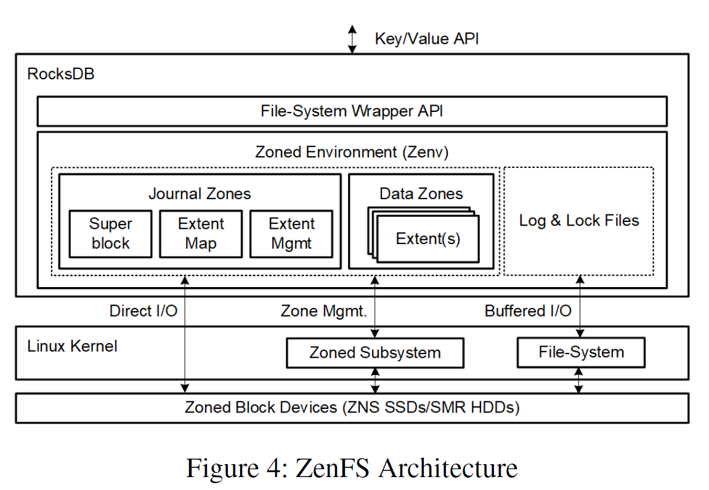

**Journaling and Data:** ZenFS定义了两种类型的区域：日志（journal）区域和数据（data）区域。日志区域用于恢复文件系统的状态，维护超级块数据结构以及将WAL（Write-Ahead Logging）和数据文件映射到区域。而数据区域则存储文件内容。

**Extents:** RocksDB的数据文件被映射并写入一组extent（数据块）。一个extent是一个可变大小、块对齐的连续区域，按顺序写入到数据区域中，包含与特定标识符相关的数据。

每个Zone可以存储多个extents，但extents不会跨越Zone。分配和释放extent的事件将记录在内存数据结构中。当文件关闭或通过RocksDB的fsync调用要求将数据持久化时，写入日志。内存数据结构跟踪extents到区域的映射，一旦在区域中分配extents的所有文件都被删除，该区域就可以被重置和重用。

每个Zone可以存储多个extents，但extents不会跨越Zone。分配和释放extent的事件将记录在内存数据结构中。当文件关闭或通过RocksDB的fsync调用要求将数据持久化时，写入日志。内存数据结构跟踪extent到zone的映射，一旦分配了extent的所有文件在区域中被删除，该区域就可以被重置并重新使用。

**Superblock：**超级块（Superblock）是初始化和从磁盘上恢复ZenFS状态的初始入口点。超级块包含当前实例的唯一标识符（UUID）、魔术值和用户选项。在超级块中的唯一标识符允许用户在系统上块设备枚举的顺序发生变化时仍然能够识别文件系统。

**Journal：**日志（Journal）的责任是维护超级块和WAL（Write-Ahead Logging）以及数据文件到区域的映射关系，这些映射关系是通过extents进行的。

日志状态存储在专用的日志区域上，并位于设备的前两个非离线区域上。在任何时刻，其中一个区域被选为活动日志区域，并将更新持久化到日志状态。一个日志区域有一个头部，存储在特定区域的开头。头部包含一个序列号（每当初始化新的日志区域时递增）、超级块数据结构以及当前日志状态的快照。在头部存储后，该区域的剩余可写容量用于记录日志的更新。

日志状态存储在专用的日志区域上，并位于设备的前两个非离线区域上。在任何时刻，其中一个区域被选为活动日志区域(另一个是它的备份)，并将更新持久化到日志状态。一个日志区域有一个头部，存储在特定区域的开头。头部包含一个序列号（每当初始化新的日志区域时递增）、超级块数据结构以及当前日志状态的快照。在头部存储后，该区域的剩余可写容量用于记录日志的更新。

如何恢复日志状态？分三步：

1. **读取两个日志区域的第一个LBA（逻辑块地址）**：为了确定每个区域的序列号，必须读取两个日志区域的第一个LBA。其中序列号较高的日志区域被视为当前活动区域。
2. **读取活动区域的完整头部并初始化初始超级块和日志状态**：这一步涉及读取活动日志区域的完整头部信息，并据此初始化文件系统的初始超级块和日志状态。
3. **应用日志更新到头部的日志快照**：更新的数量由区域的状态和其写入指针决定。如果区域处于打开（或关闭）状态，只有直到当前写入指针值的记录被重放到日志中。而如果区域处于满状态，头部之后存储的所有记录都被重放。

如果区域已满，在恢复后，会选择并初始化一个新的活动日志区域，以便持续日志更新的持久化。初始日志状态是由类似于现有文件系统工具的外部实用程序创建并持久化的。它将初始序列号、超级块数据结构和一个空的日志快照写入第一个日志区域。当RocksDB初始化ZenFS时，将执行上述恢复过程。

此外，还提到了RocksDB在不同SST（排序字符串表）文件大小下的写放大、运行时间和尾延迟表现。这显示了不同配置对RocksDB性能的影响，特别是在没有速率限制的读写（RW）和写入速率限制为20MiB/s的读写（RWL）期间。

**数据区域中的可写容量**：理想的分配，以实现最大容量使用率，只有在文件大小是区域可写容量的倍数时才能实现，这样才能在完全填满所有可用容量的同时将文件数据完全分隔到区域中。RocksDB允许配置文件大小，但这只是一个建议，由于压缩和压缩过程的结果，大小会有所变化，因此无法保证精确大小。ZenFS通过允许用户配置数据区域完成的限制来解决这个问题，指定区域剩余容量的百分比。这使得用户可以指定文件大小建议，例如，设备区域容量的95%，通过设置完成限制为5%。这样文件大小就可以在一个限制范围内变化，仍然能够通过区域实现文件分隔。

**数据区域选择**：ZenFS采用最佳尝试算法来选择最佳区域存储RocksDB数据文件。RocksDB通过在写入文件之前为文件设置写入生命周期提示来分隔WAL和SST级别。在首次写入文件时，为存储分配一个数据区域。ZenFS首先尝试根据文件的生命周期和区域中存储数据的最大生命周期找到一个区域。如果找到多个匹配项，则使用最接近的匹配项。如果没有找到匹配项，则分配一个空区域。

**活动区域限制**：ZenFS必须遵守由分区块设备指定的活动区域限制。运行ZenFS需要至少三个活动区域，分别分配给日志、WAL和压缩过程。为了提高性能，用户可以控制并发压缩的数量。实验表明，通过限制并发压缩的数量，RocksDB可以在写性能受限的情况下使用少至6个活动区域，而超过12个活动区域并不会带来任何显著的性能优势。

**直接I/O和缓冲写入**：ZenFS利用了SST文件的写入是顺序的和不可变的这一事实，对SST文件进行直接I/O写入，绕过内核页面缓存。对于其他文件，例如WAL，ZenFS在内存中缓冲写入，并在缓冲区满、文件关闭或RocksDB请求刷新时刷新缓冲区。如果请求刷新，缓冲区将被填充到下一个块边界，并将有效字节数的范围存储在日志中。这种填充会导致一定量的写放大，但这不是ZenFS特有的，在传统文件系统中也会这样做。

## 5 评估

**数据区域中的可写容量**

理想的分配（随着时间的推移实现最大容量使用率）只能在文件大小是区域可写容量的倍数的情况下实现，允许文件数据在区域中完全分离，同时填满所有可用容量。文件大小可以在 RocksDB 中配置，但该选项只是一个建议，并且大小会根据压缩和整理过程的结果而有所不同，因此无法实现确切的大小。

ZenFS 通过允许用户配置数据区域完成的限制来解决这个问题，指定剩余区域容量的百分比。这允许用户通过将完成限制设置为 5% 来指定文件大小建议，例如设备区域容量的 95%。这允许文件大小在限制范围内变化，并且仍然按区域实现文件分离。如果文件大小变化超出指定限制，ZenFS 将通过使用其区域分配算法（如下所述）确保利用所有可用容量。区域容量通常大于 RocksDB 推荐的文件大小 128 MiB，为了确保增加文件大小不会增加 RocksDB 写放大和读取尾部延迟，我们测量了对不同文件大小的影响。表 2 表明增加 SST 文件大小不会显着降低性能。

**数据区域选择**

ZenFS 采用尽力而为的算法来选择存储 RocksDB 数据文件的最佳区域。RocksDB 通过在写入文件之前为文件设置写生命周期提示来分隔 WAL 和 SST 级别。在第一次写入文件时，将分配一个数据区域进行存储。ZenFS 首先尝试根据文件的生命周期和存储在该区域中的数据的最大生命周期来查找区域。只有当文件生命周期小于存储在该区域中的最旧数据时，匹配才有效，以避免延长该区域中数据的生命周期。如果找到多个匹配项，则使用最接近的匹配项。如果没有找到匹配项，则分配一个空区域。如果文件填满了已分配区域的剩余容量，则使用相同的算法分配另一个区域。请注意，写生命周期提示提供给任何 RocksDB 存储后端，因此也传递给其他兼容文件系统，并且可以与支持流的 SSD 一起使用。我们在 §5.3 中比较了传递提示的这两种方法。通过使用 ZenFS 区域选择算法和用户定义的可写容量限制，未使用的区域空间或空间放大保持在 10% 左右。

**活动区域限制**

ZenFS 必须遵守分区块设备指定的活动区域限制。要运行 ZenFS，需要至少三个活动区域，这些区域分别分配给日志、WAL 和整理进程。为了提高性能，用户可以控制并发整理的数量。我们的实验表明，通过限制并发整理的数量，RocksDB 可以在仅有 6 个活动区域的情况下工作，同时限制写性能，而超过 12 个活动区域不会增加任何显着的性能优势。

**直接 I/O 和缓冲写入**

ZenFS 利用了对 SST 文件的写入是顺序且不可变的事实，并对 SST 文件执行直接 I/O 写入，绕过内核页面缓存。对于其他文件，例如 WAL，ZenFS 会将写入缓冲到内存中，并在缓冲区已满、文件已关闭或 RocksDB 请求刷新时刷新缓冲区。如果请求刷新，则将缓冲区填充到下一个块边界，并将包含有效字节数的范围存储在日志中。填充会导致少量的写放大，但这并不是 ZenFS 独有的，并且在传统文件系统中也会以类似的方式完成。

## 5 实验评估

- Dell R7515 系统
- 16 核 AMD Epyc 7302P CPU
- 128GB DRAM (8 x 16GB DDR4-3200Mhz)
- Ubuntu 20.04 （更新到 5.9 Linux 内核）
- 在 RocksDB 6.12 上进行，其中 ZenFS 包含为后端存储插件。
- 有一块**“生产 SSD 硬件平台“**，可以暴露为块接口 SSD 或 ZNS SSD：

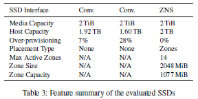

>他有一块平台，可以切换 块接口 or Zone接口。“apples-to-apples comparison”是一个英语短语，意为在相同的基础上进行比较，以确保比较的公平性和准确性。

**5.1 原生设备 I/O 性能**

我们将块接口 SSD 地址空间划分为 LBA 范围，这些范围具有与 ZNS SSD 暴露的区域容量相同数量的 LBA。这些区域或 LBA 范围遵循与 ZNS 相同的顺序写入约束，但是通过在写入之前修剪 LBA 范围来模拟区域重置。我们在 SSD 使用给定工作负载达到稳态后测量性能。

持续写入吞吐量：我们评估 SSD 吞吐量以显示内部 SSD 垃圾回收对吞吐量的影响及其消耗主机写入的能力。
**5.2 端到端应用程序性能**

- RocksDB 在 ZNS SSD 上运行时，读写吞吐量提高了 2 倍，随机读尾部延迟降低了一个数量级。

**5.3 与 SSD 流的端到端性能比较**

- 与支持流的块接口 SSD 相比，ZNS SSD 的吞吐量提高了 44%，尾部延迟降低了一半

# 模拟器

### QEMU 

西交实验：https://github.com/MiracleHYH/CS_Exp_ZNS

https://miracle24.site/other/cs-exp-zns-1/

### FEMU(tong)

 https://www.usenix.org/system/files/conference/fast18/fast18-li.pdf

FEMU配置与源码浅析https://blog.xiocs.com/archives/46/

与原生的 Qemu-nvme 相比，Femu 的扩展主要集中在延迟仿真上。

### ConfZNS

https://github.com/DKU-StarLab/ConfZNS ，CCF C

### NVMeVirt

NVMeVirt: A Versatile Software-defined Virtual NVMe Device，FAST 23

ZenFS + RocksDB + nvmevirt 配置ZNS模拟环境:

https://www.notion.so/znsssd/NVMEvirt-NVMEvirt-RockDB-Zenfs-7292a6396ed84fc29010a8d0ed768d9b?pvs=25

上交毕设：实现*ZNS* *SSD*模拟器，然后基于模拟器设计适配的LSM Tree https://github.com/adiamoe/LSM-based-on-ZNS-SSD

# 其他相关项目

### [Dantali0n/OpenCSD](https://github.com/Dantali0n/OpenCSD)

OpenCSD: eBPF Computational Storage Device (CSD) for Zoned Namespace (*ZNS*) *SSDs* in QEMU

### SZD

[SimpleZNSDevice](https://github.com/Krien/SimpleZNSDevice)

基于SPDK做的的ZNS的封装，可以让用户不费吹灰之力就能开发 ZNS 设备。

### **[bpf-f2fs-zonetrace](https://github.com/pingxiang-chen/bpf-f2fs-zonetrace)**

基于eBPF的Zone可视化工具

ZoneTrace是一个基于eBPF的程序，可以在ZNS SSD上的F2FS上实时可视化每个区域的空间管理，而无需任何内核修改。我们相信ZoneTrace可以帮助用户轻松分析F2FS，并开辟几个关于ZNS SSD的有趣研究课题。

### F2FS

(Flash-Friendly File System，三星)

原文，https://www.usenix.org/system/files/conference/fast15/fast15-paper-lee.pdf

非官方仓库，https://github.com/unleashed/f2fs-backports

### ZenFS

ZNS文件系统，for RocksDB，西数。 https://github.com/westerndigitalcorporation/zenfs

### zonefs-tools

一个极简的ZNS文件系统，西数。https://github.com/westerndigitalcorporation/zonefs-tools

### OS接口文档

https://zonedstorage.io/docs/introduction

# 设备

znskv中使用的盘

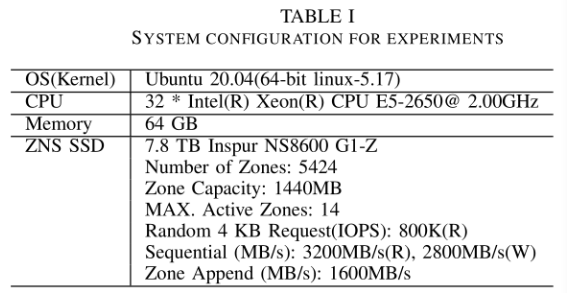

### 硬件接口

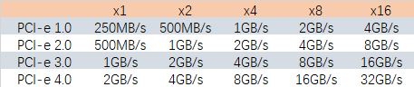

U.2 (SFF-8639)https://zhuanlan.zhihu.com/p/568688937?utm_id=0

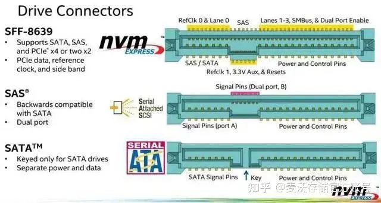

### 设备安装记录

https://www.notion.so/znsssd/Disk-2b750be455a2459bb346556567b2553a

# 

# 其他问题

>现在没有了逻辑块地址-虚拟块地址的转换，数据在盘中的真实地址暴露给应用，是否可以（更好地利用空间局部性）使得prefetch的效果更好？

常见的磁盘预取器和开源存储引擎中使用的磁盘预取算法

磁盘预取是一种优化技术，通过提前将数据从磁盘读取到内存中，以减少磁盘I/O操作的等待时间。常见的磁盘预取器和开源存储引擎中使用的磁盘预取算法如下：

1. Linux Page Cache预读：Linux操作系统中的Page Cache是一种内存缓存机制，它可以将磁盘上的数据预先加载到内存中，以提高读取性能。Linux Page Cache预读算法会根据文件的访问模式和访问模式的历史记录来预测下一次可能访问的数据，并提前将这些数据加载到内存中[[2\]](https://xiazemin.github.io/linux/2020/04/01/pagecache.html)。
2. MySQL InnoDB存储引擎的磁盘预取算法：MySQL InnoDB存储引擎使用了一种称为"DoubleWrite Buffer"的技术来提高磁盘写入性能。在写入数据到磁盘之前，InnoDB会将数据先写入到一个内存缓冲区中，然后再将数据从缓冲区写入到磁盘。这种方式可以减少磁盘的随机写入操作，提高写入性能[[2\]](https://xiazemin.github.io/linux/2020/04/01/pagecache.html)。
3. RocksDB存储引擎的磁盘预取算法：RocksDB是一个开源的键值存储引擎，它使用了一种称为"Block-based Table"的存储结构。在读取数据时，RocksDB会根据数据的访问模式和历史记录来预测下一次可能访问的数据块，并提前将这些数据块加载到内存中。这种方式可以减少磁盘的随机读取操作，提高读取性能[[2\]](https://xiazemin.github.io/linux/2020/04/01/pagecache.html)。

>两步编程（Two-step programming）是一种在NAND闪存芯片中使用的编程方法。

这种方法特别设计用于提高数据的写入准确性和闪存芯片的寿命。在传统的闪存编程中，数据以一次性方式写入存储单元，但在两步编程中，这个过程被分成两个阶段：

1. **第一步**：在第一步中，数据被部分地写入存储单元。这通常包括将存储单元设置到一个中间的阈值电平。
2. **第二步**：在第二步中，数据被进一步细化或“调整”到其最终值。这个过程涉及更精细地控制电荷的注入，以确保数据被准确地写入。

两步编程的好处包括：

- **提高精度**：通过这种分阶段方法，可以更精确地控制电荷的流动，减少写入错误。
- **延长寿命**：减少了对闪存单元的应力，从而延长了其使用寿命。

这种技术在多层单元（MLC）和三层单元（TLC）NAND闪存中尤其重要，因为这些类型的闪存在存储多比特信息时需要更高的精确度。不过，两步编程也可能导致写入过程比一步编程更慢，因为需要额外的时间来细化数据的存储。

# kangaroo：SSD as cache

## 0 Ab

合并日志结构化缓存和组相联缓存来克服这些限制，旨在降低DRAM和闪存写入的开销。
    - 系统由两个主要部分组成：**KLog**（一个小型的日志结构化闪存缓存）和**KSet**（一个大型的组相联闪存缓存）。
    - **KLog**作为一个暂存区，使得对象写入到**KSet**更加高效。它只使用少量的闪存（约5%）并且只需要最小的DRAM来索引其全部容量。
    - **KSet**在闪存页面中存储对象，并使用布隆过滤器（Bloom filter）有效地跟踪集合成员身份。
    - Kangaroo引入了**门槛准入策略**，允许它在减少写入的同时逐出对象。它确保将对象移动到KSet的写放大明显低于组相联缓存。

3. **操作流程**:
   - **查找操作**：Kangaroo通过首先检查DRAM缓存，然后检查KLog的索引，最后检查KSet的布隆过滤器来执行查找。
   - **插入操作**：对象首先被插入到DRAM缓存。从DRAM缓存逐出的对象要么被丢弃，要么被添加到KLog的索引和闪存日志中。从KLog逐出的对象要么被丢弃，要么被插入到KSet中。

4. **创新和优化**:
   - Kangaroo引入了创新技术来最小化写放大，通过同时将多个对象从KLog移动到KSet。
   - 系统设计在允许的写速率、DRAM大小和闪存大小的范围内是帕累托最优的，表现出比以前的设计更好的性能和更低的成本。
   - 它还提供了进一步的优化，以减少DRAM开销和缺失率，提高了缓存过程的整体效率。

总而言之，Kangaroo有效地解决了在闪存上有效缓存数十亿个小型对象的关键问题，提出了一个强大的解决方案，最小化了DRAM和闪存写入的开销。这一创新对于大规模系统（如社交媒体和物联网服务）特别有益，其中高效的缓存对于性能和成本效益至关重要【https://www.cs.cmu.edu/~csd-phd-blog/2022/kangaroo/】【7†source】【8†source】【9†source】。

## 0 Ab

合并日志结构化缓存和组相联缓存来克服这些限制，旨在降低DRAM和闪存写入的开销。
    - 系统由两个主要部分组成：**KLog**（一个小型的日志结构化闪存缓存）和**KSet**（一个大型的组相联闪存缓存）。
    - **KLog**作为一个暂存区，使得对象写入到**KSet**更加高效。它只使用少量的闪存（约5%）并且只需要最小的DRAM来索引其全部容量。
    - **KSet**在闪存页面中存储对象，并使用布隆过滤器（Bloom filter）有效地跟踪集合成员身份。
    - Kangaroo引入了**门槛准入策略**，允许它在减少写入的同时逐出对象。它确保将对象移动到KSet的写放大明显低于组相联缓存。

3. **操作流程**:
   - **查找操作**：Kangaroo通过首先检查DRAM缓存，然后检查KLog的索引，最后检查KSet的布隆过滤器来执行查找。
   - **插入操作**：对象首先被插入到DRAM缓存。从DRAM缓存逐出的对象要么被丢弃，要么被添加到KLog的索引和闪存日志中。从KLog逐出的对象要么被丢弃，要么被插入到KSet中。

4. **创新和优化**:
   - Kangaroo引入了创新技术来最小化写放大，通过同时将多个对象从KLog移动到KSet。
   - 系统设计在允许的写速率、DRAM大小和闪存大小的范围内是帕累托最优的，表现出比以前的设计更好的性能和更低的成本。
   - 它还提供了进一步的优化，以减少DRAM开销和缺失率，提高了缓存过程的整体效率。

总而言之，Kangaroo有效地解决了在闪存上有效缓存数十亿个小型对象的关键问题，提出了一个强大的解决方案，最小化了DRAM和闪存写入的开销。这一创新对于大规模系统（如社交媒体和物联网服务）特别有益，其中高效的缓存对于性能和成本效益至关重要【https://www.cs.cmu.edu/~csd-phd-blog/2022/kangaroo/】【7†source】【8†source】【9†source】。

# ZoneKV

ZoneKV: A Space-Efficient Key-Value Store for ZNS SSDs，DAC23

来自中国科学技术大学和字节跳动公司。

按照LSM-Tree中每层的等级作为生命周期，调整区域放置。

https://ieeexplore.ieee.org/stamp/stamp.jsp?tp=&arnumber=10247926

## 0 摘要

- 提出了ZoneKV，一种针对ZNS SSDs的空间高效键值存储系统。
- 观察到现有的RocksDB适配到ZNS SSDs会导致区域碎片化和空间放大问题。
- 因此，我们提出了一个基于生命周期的区域存储模型和特定级别的区域分配算法，将生命周期相似的SSTables存储在同一区域。
- 在真实的ZNS SSD上评估了ZoneKV，结果显示ZoneKV能够减少高达60%的空间放大，并保持比RocksDB with ZenFS更高的吞吐量。

## 1 引言

- ZNS SSDs：是一种新型SSD，采用新的NVMe存储接口。它们将逻辑块地址（LBA）划分为多个相同大小的区域，每个区域只能顺序写入并在重置后再次使用。这种强制性的顺序写入允许ZNS SSDs进行更粗粒度的地址转换。此外ZNS SSDs将垃圾回收和数据放置的功能留给主机侧，这使得用户可以设计出有效技术来利用ZNS SSDs的优势，例如新的索引和缓冲区管理器。

- ZNS SSDs与LSM-tree（Log-Structured Merge-tree）的契合性： LSM-tree将随机写入转换为顺序写入，大大提高了写入性能。它已被用于许多键值存储中，例如 BigTable、LevelDB 和 RocksDB。

  基于LSM树的键值存储的内存组件，由MemTable和Immutable MemTable组成。 MemTable以仅追加模式存储最新的键值。当达到存储阈值时，Memtable 将转换为只读的 Immutable MemTable。基于LSM树的键值存储的磁盘或SSD部分由多个级别组成，每个级别由多个排序字符串表（SSTables）组成。每个级别都有大小限制，并且大小限制呈指数增长。当级别超过其大小限制时，将触发压缩操作，通过将 L i 中的 SSTable 合并到 Li +1 来将数据下推。

- ZenFS如何使RocksDB适应ZNS SSDs： ZenFS是西部数据公司开发的存储后端模块。它可以为新生成的 SSTable 分配区域，并从包含无效数据的区域回收可用空间。 ZenFS 采用经验方法（？）将 SSTable 放入区域中，由于区域中的 SSTable 可能具有不同的生命周期，因此区域内会产生许多无效数据。

  例如，当选择$L_2$中的SSTable来执行压缩，并且$L_3$ 中的所有SSTable都应该存储在$Zone_1$ 中，压缩后新生成的SSTable可以被写入到不同的Zone，例如$Zone_2$ 。因此，ZenFS 将生成包含具有不同生命周期的 SSTable的区域。这样一来，zone中的无效数据就不会被及时回收，增加了LSM-tree的空间放大。

  （图片来自ZenFS的Readme）

  

  

为了解决上述问题，在本文中，我们提出了一种用于 ZNS SSD 的新的节省空间的键值存储，称为 ZoneKV。 ZoneKV采用基于生命周期的区域存储模型和特定级别的区域分配算法，使每个区域中的SSTable具有相似的生命周期，从而比ZenFS具有更低的空间放大、更好的空间效率和更高的时间性能。简而言之，我们在本文中做出了以下贡献。

1. 为了解决ZNS SSD上LSM-tree的空间放大问题，ZoneKV提出了一种基于生命周期的区域存储模型，在一个区域中维护具有相似生命周期的SSTable，以减少空间放大并提高空间效率。
2. ZoneKV提出了一种特定于级别的区域分配算法来组织ZNS SSD中LSM树的级别。特别是，ZoneKV 将 L 0 和 L 1 放在一个区域中，因为这两个级别中的 SSTable 具有相似的生命周期。另外，ZoneKV将L i ( i ≥ 2)中的所有SSTable水平划分为切片，不同的切片存储在不同的zone中，使得每个zone的SSTable具有相同的生命周期。
3. 我们将 ZoneKV 与 RocksDB [12] 以及真实 ZNS SSD 上最先进的系统 ZenFS [1] 进行比较。与RocksDB相比，ZoneKV可以减轻约50%-60%的空间放大，与ZenFS相比，这一改进约为40%-50%。此外，ZoneKV 实现了最高的吞吐量。

## 2 相关工作

讨论了传统SSDs的局限性，ZNS SSDs可以作为一种改进的开放通道SSDs。

ZNS SSDs支持完整的存储堆栈，包括底层的块驱动程序到上层的文件系统。ZNS SSDs不执行设备侧的垃圾回收，意味着主机必须执行主机级别的垃圾回收。

为了尽量减少主机级的GC开销，最近的研究提出了一种新的ZNS接口ZNS+，以支持存储内部的区域压缩。专注于ZNS SSD上压缩的其他方法包括CAZA[16]和LL-压缩[17]。然而，这两种方法都会使得压缩后的SSTables散布在不同的区域中，从概念上讲，由同一压缩操作产生的SSTables应该具有相同的生命周期[5]。将它们放置在不同的区域中，对空间效率不友好。

到目前为止，据我们所知，ZenFS 是唯一将 RocksDB 适配到 ZNS SSD 的键值存储。但ZenFS并没有充分考虑SSTables的生命周期，也没有完整的GC逻辑。因此，具有不同生命周期的SSTables可能会存储在同一区域中，导致严重的空间放大。在本文中，我们主要关注改进ZenFS，并将ZenFS视为主要竞争对手。与 ZenFS 不同，我们建议将具有相似生命周期的 SSTable 存储在同一区域内，以减少 LSM 树的空间放大。

## 3 ZoneKV的设计

- 分析了现有方法的局限性，提出了ZoneKV的主要思想。
- 描述了ZoneKV的架构和关键技术，包括基于生命周期的区域存储和特定级别的区域分配。

### 3.1 现有方法的局限性

将RocksDB移植到ZNS SSD的基本方法是让RocksDB将SSTable存储到特定的区域，这是通过文件操作接口来实现的。虽然这种简单的实现可以支持 ZNS SSD 上的读/写操作，但它的空间利用率不高。这是因为 SSTable 随机分散在区域之间。由于每个zone中的SSTable可能有不同的生命周期，例如，一些SSTable经常更新，而另一些则从不更新，(?)

> 我们可以推断每个zone中会有很多无效数据，因为那些声明周期短的数据早就失效了，但ZNS SSD必须重置才能释放这些空间。

因此，如果所有SSTables都是随机存储在区域中的，那么每个区域中将会产生越来越多的无效数据，这会导致空间放大率高和空间浪费。

ZenFS  提出了一种改进的方法来在区域中存储SSTables。它为每个活跃区域维护最长的生命周期；如果新生成的SSTable的生命周期比活跃区域中的最长生命周期短，那么SSTable将被放入该区域中。与原始的RocksDB相比，ZenFS可以减少空间放大，但具有不同生命周期的SSTables可能仍然分布在同一个区域中。请注意，具有不同生命周期的SSTables具有不同的更新频率。因此，一个区域内的某些SSTables可能已经被更新，而其他SSTables则没有，这浪费了区域容量，且空间效率不高。

> ??说的好像SST会被就地更新一样,这个"更新指的是啥"

### 3.2  ZoneKV 的思想

在本文中，我们将 SSTable 的生命周期定义为它的创建时间和失效时间之间的间隔。假设 SSTable 在 t 1 创建，并在 t 2 压缩或更新；其生命周期定义为 | t 2 − t 1 | 。目标：将所有具有相似生命周期的 SSTable 存储到同一区域中。

获取 SSTable 的准确生命周期并不是一件容易的事。例如，当我们需要将 SSTable 写入 LSM 树中的某个级别时，我们只知道 SSTable 的创建时间。在 SSTable 被更新或压缩之前，我们不会知道它的失效时间。

我们不会显式维护每个 SSTable 的生命周期信息。相反，我们使用级别编号作为生命周期的指标。

**L0、L1：**RocksDB对L0**采用分层**（tiering compaction）压缩，这将使L0 中的所有SSTable失效，并将它们与L 1 中的SSTable合并，并产生新的SSTable，最终写入L 1 。因此，我们可以推断 L 0 中的所有 SSTable 具有相同的生命周期。另一方面，由于 L0 中 SSTable 的键范围重叠，因此在对 L0 进行分层压缩时，更有可能读取 L 1 中的所有 SSTable 并与 L 0 合并。因此，L1 中的几乎所有 SSTable 都会因 L 0 中触发的分层压缩而失效，这意味着 L 1 中的所有 SSTable 与 L 0 中的 SSTable 具有相似的生命周期。

**L>=2：**

此外，对于 L 2 和 L 3 等较低级别，RocksDB 使用 Leveling Compaction [12]，以循环方式选择 L i ( i ≥ 2) 中的一个 SSTable，并将该 SSTable 与 L_i +1中所有重叠的 SSTable 合并 。为此，我们可以看到具有小键的 SSTable 将首先被选择作为受害者进行压缩，这意味着它们具有相似的生命周期。因此，我们对 L i ( i ≥ 2) 中的 SSTables 进行水平分区，并将每个分区放在不同的区域中。

>RocksDB中tiering compaction 和  Leveling Compaction 压缩的区别：
>
>RocksDB是一种使用LSM树（Log-Structured Merge-tree）的键值存储，它通过将数据写入不同层级的结构来优化读写性能。在RocksDB中，数据首先写入内存中的MemTable，当MemTable满时，它会被转换成SSTable并写入磁盘的第0层（L0）。随后，这些SSTable会通过压缩（compaction）操作逐渐合并到更高层级。RocksDB提供了两种主要的压缩策略：Tiering Compaction和Leveling Compaction。这两种策略在处理SSTable合并和数据迁移方面有着根本的不同。
>
>### Tiering Compaction（分层压缩）
>
>- **特点**：在Tiering Compaction模式下，当一个层级（Level）的大小超过预定阈值时，新的SSTable会被合并到下一层级，但是不会与下一层级的SSTable立即合并。这意味着，每个层级可以包含多个SSTable文件，随着层级的增加，存储的SSTable也相应增加。
>- **优势**：减少了写放大（Write Amplification），因为它在合并时只是简单地将多个SSTable文件移动到下一个层级，而不是合并它们。这使得Tiering Compaction在写密集型应用中表现较好。
>- **劣势**：由于每个层级可能包含多个SSTable文件，这可能导致读放大（Read Amplification）增加，因为在查找数据时可能需要检查同一层级的多个SSTable。
>
>### Leveling Compaction（平层压缩）
>
>- **特点**：在Leveling Compaction模式下，当一个层级的数据量达到阈值时，该层级的所有SSTable会与下一层级的SSTable合并，并形成新的SSTable放入下一层级。这种策略确保了除了最顶层以外的每个层级最多只有一个SSTable文件。
>- **优势**：显著减少了读放大，因为在大多数情况下，每个层级只有一个SSTable文件，查找数据时不需要在多个文件间跳转。这使得Leveling Compaction在读密集型应用中表现更好。
>- **劣势**：由于需要合并整个层级的SSTable，这会导致更高的写放大，因为每次压缩都涉及到大量数据的复制和重写。
>
>### 选择
>
>选择哪种压缩策略取决于应用的具体需求：
>
>- 如果应用主要是写密集型的，并且可以容忍稍高的读延迟，那么Tiering Compaction可能是更好的选择。
>- 如果应用主要是读密集型的，并且需要优化读性能，那么Leveling Compaction会是更优的方案。
>
>RocksDB允许开发者根据具体的应用场景选择最适合的压缩策略，以达到最佳的存储效率和性能平衡。

小结:

**（1）基于生命周期的Zone Storage**。 ZoneKV建议在一个区域中维护具有相似寿命的SSTable，以减少空间放大并提高空间效率。 ZoneKV 不会显式维护每个 SSTable 的生命周期信息，而是使用每个 SSTable 的级别编号来隐式推断生命周期。这样的设计可以避免内存使用并维护生命周期信息的成本。

​    **(2)** **特定级别的区域分配。**首先，ZoneKV 建议将 L 0 和 L 1 放在一个区域中，因为这两个级别中的 SSTable 具有相似的生命周期。其次，ZoneKV将L i ( i ≥ 2)中的所有SSTable水平划分为切片，每个切片存储在一个zone中。

### 3.3 ZoneKV的架构

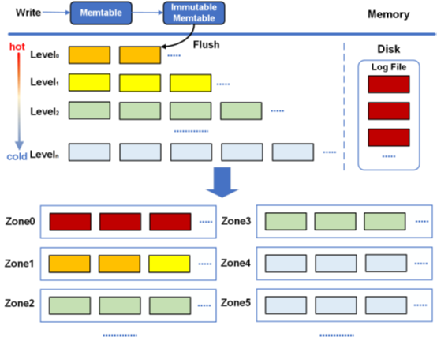

与 RocksDB 一样，ZoneKV 也包含内存组件和持久组件（即 ZNS SSD）。内存组件的作用与RocksDB相同，ZoneKV的独特设计侧重于持久化组件，它由两个方面组成。

- 首先，当SSTables写入特定级别时(无论是刷新操作或压缩操作，ZoneKV根据生命周期信息将SSTables写入特定区域（选择合适区域的算法将在第III-E节中讨论）
- 其次，LSM树中的每个级别都存储在不同的区域中，以使每个区域包含具有相似生命周期的SSTable。

如图1所示，ZoneKV将日志文件放在单独的区域中，因为日志以仅追加的方式写入并且从不更新；因此它们的寿命可以被认为是无限的。 

ZoneKV的实现是基于RocksDB的。与ZenFS[1]一样，ZoneKV修改了RocksDB中FileSystemWrapper类的接口，并通过libzbd[1]直接与区域交互。传统的磁盘I/O堆栈需要内核文件系统、块层、I/O调度层、块设备驱动层等一系列I/O子系统才能到达磁盘。这些长链总是会降低数据存储效率，间接降低磁盘吞吐量并增加请求延迟。 ZoneKV 针对 ZNS 进行了优化通过直接在 ZNS SSD 上执行端到端数据放置并绕过巨大的 I/O 堆栈。

### 3.4 基于时间的分区存储

ZoneKV提出了一种基于生命周期的区域存储模型，旨在减少空间放大并提高空间效率。在这个模型中，ZoneKV将具有相似生命周期的SSTables存储在同一区域（zone）中。这样做的目的是为了减少不同生命周期的SSTables分散在不同区域中，从而减少无效数据的产生和空间放大。

为了实现这一点，**ZoneKV并没有显式地维护每个SSTable的生命周期信息，而是使用SSTable的级别作为生命周期的隐式指示。**例如，L0和L1级别的SSTables被认为具有相似的生命周期，因此它们被存储在同一个区域中。对于L2和更高级别的SSTables，ZoneKV通过水平分区将它们分成多个片段，并将每个片段存储在不同的区域中，以确保每个区域中的SSTables具有相同的生命周期。

### 3.5 Level-Specific Zone Allocation（特定级别的区域分配）

ZoneKV并没有显式地维护每个SSTable的生命周期信息，而是使用SSTable的级别作为生命周期的隐式指示

具体来说，ZoneKV将日志文件的生命周期标记为-1，意味日志文件具有无限的生命周期；接下来，它将L0和L1级别的SSTables的生命周期设置为1；此外，对于Li（i ≥ 2）级别的SSTables，它们的生命周期被设置为i。

## 4 性能评估

- 描述了实验设置、写入性能、更新性能、读取性能、混合读写性能和多线程性能的测试。
- 展示了ZoneKV在各种工作负载和设置下的性能，特别是在减少空间放大和保持高吞吐量方面优于RocksDB和ZenFS。

## 5 总结

- 主要贡献，包括基于生命周期的区域存储和特定级别的区域分配，这些设计可以降低使用区域的数量并减少LSM-tree在ZNS SSDs上的空间放大。
- 强调了ZoneKV在多线程环境中的稳定和高性能。

# WALTZ (开源)

https://github.com/SNU-ARC/WALTZ

# FAST'24 - ZNS：

1. I/O Passthru: Upstreaming a flexible and efficient I/O Path in Linux
2. RFUSE: Modernizing Userspace Filesystem Framework through Scalable Kernel-Userspace Communication
3. MIDAS: Minimizing Write Amplification in Log-Structured Systems through Adaptive Group Number and Size Configuration 
4. The Design and Implementation of a Capacity-Variant Storage System

# CVSS

The Design and Implementation of a Capacity-Variant Storage System

https://www.usenix.org/conference/fast24/presentation/jiao

我们介绍了一种针对基于闪存的固态硬盘（SSD）的容量可变存储系统（CVSS）的设计与实现。CVSS旨在通过允许存储容量随时间优雅减少，从而在整个SSD的生命周期内维持高性能，防止出现性能逐渐下降的症状。CVSS包含三个关键组件：

- CV-SSD，一种最小化写入放大并随年龄增长优雅减少其导出容量的SSD；
- CV-FS，一种用于弹性逻辑分区的日志结构文件系统
- CV-manager，一种基于存储系统状态协调系统组件的用户级程序。

我们通过合成和真实工作负载证明了CVSS的有效性，并展示了与固定容量存储系统相比，在延迟、吞吐量和寿命方面的显著改进。具体来说，在真实工作负载下，CVSS将延迟降低，吞吐量提高，并分别延长寿命8-53%，49-316%和268-327%。

### 1. 引言

> Fail-slow 问题

近期，针对基于SSD的性能逐渐下降症状（fail-slow）获得了显著关注。在SSD中，这种退化通常是由于SSD内部逻辑尝试纠正错误所引起的。最近的研究表明，性能逐渐下降的驱动器可能会导致高达3.65倍的延迟峰值，并且由于闪存的可靠性随时间持续恶化，我们预计性能逐渐下降症状对整体系统性能的影响将会增加。

### 2. 背景与动机

详细介绍了CVSS的动机，解释了SSD中闪存错误和磨损趋势的增加。批判了当前固定容量存储系统模型加剧了与可靠性相关的性能下降问题，并回顾了以往尝试解决这些问题的努力。

### 3. 容量变化的设计

设计部分概述了一项高级原则，即放宽存储设备的固定容量抽象，允许在容量、性能和可靠性之间进行权衡。介绍了CVSS的三个关键组件：CV-FS支持弹性逻辑分区，CV-SSD通过映射出错误倾向的块来维护设备性能，CV-manager协调容量变化系统。

### 4. 实现

提供了实现CVSS的细节，包括对Linux内核的修改以支持容量变化，对F2FS的更改以解决容量变化触发的重映射问题，以及对FEMU（一个闪存模拟器）的增强以模拟CV-SSD的行为。这些修改旨在支持一个能够根据磨损和错误动态调整其存储容量的系统。

**3 容量可变设计** 容量可变系统背后的高级设计原则在图3中有所说明。该系统放宽了存储设备的固定容量抽象，并使得在容量、性能和可靠性之间实现更好的权衡成为可能。传统的固定容量接口，其设计初衷是用于硬盘驱动器（HDD），假定所有存储组件要么同时工作要么同时失败。然而，这一假设对于SSD并不准确，因为闪存块是故障的基本单位，映射出失败、不良和老化块是FTL的责任。

### 5. 容量变化的评估

评估部分讨论了测试CVSS在各种工作负载下的实验设置、方法和结果。它证明了CVSS在降低延迟、提高吞吐量和延长SSD寿命方面的有效性，与传统的固定容量存储系统相比。

### 6. 讨论与未来工作

讨论部分涉及容量变化的不同用例，包括其在ZNS（区域命名空间）SSD和RAID系统中的应用。概述了CVSS在简化SSD设计、改善数据中心存储管理和延长桌面SSD使用寿命方面的潜在好处。

### 7. 总结

结论再次确认采用容量变化方法的优势，强调其在减轻固定容量SSD固有限制方面的作用，尤其是关于耐用性和随时间性能。容量变化系统被定位为固定容量SSD限制的一个实用解决方案，承诺将进行持续的优化和特性开发。

4. 

