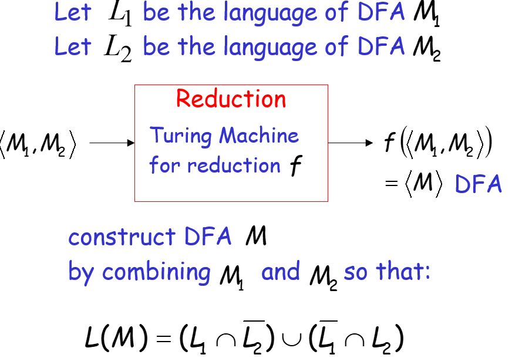

重新整理：

# 动态规划

https://huxulm.github.io/lc-rating/list/dynamic_programming#7c7c1f2efad055701647c7012b9ce425

## 入门DP


## 网格图DP


# 分治

## 快速幂

## 二分查找

最需要注意的是临界条件，所以在定义的时候就要逻辑严密。

### 第一种写法**[left, right]闭区间**

- while (left <= right)
- l = mid + 1
- r = mid - 1

```cpp
// 版本一
class Solution {
public:
    int search(vector<int>& nums, int target) {
        int left = 0;
        int right = nums.size() - 1; // 定义target在左闭右闭的区间里，[left, right]
        while (left <= right) { // 当left==right，区间[left, right]依然有效，所以用 <=
            int middle = left + ((right - left) / 2);// 防止溢出 等同于(left + right)/2
            if (nums[middle] > target) {
                right = middle - 1; // target 在左区间，所以[left, middle - 1]
            } else if (nums[middle] < target) {
                left = middle + 1; // target 在右区间，所以[middle + 1, right]
            } else { // nums[middle] == target
                return middle; // 数组中找到目标值，直接返回下标
            }
        }
        // 未找到目标值
        return -1;
        //return r+1
    }
};
```

### 第二种写法[left, right)

有如下两点：

- while (left < right)，这里使用 < ,因为left == right在区间[left, right)是没有意义的
- if (nums[middle] > target) right 更新为 middle

```cpp
// 版本二
class Solution {
public:
    int search(vector<int>& nums, int target) {
        int left = 0;
        int right = nums.size(); // 定义target在左闭右开的区间里，即：[left, right)
        while (left < right) { // 因为left == right的时候，在[left, right)是无效的空间，所以使用 <
            int middle = left + ((right - left) >> 1);
            if (nums[middle] > target) {
                right = middle; // target 在左区间，在[left, middle)中
            } else if (nums[middle] < target) {
                left = middle + 1; // target 在右区间，在[middle + 1, right)中
            } else { // nums[middle] == target
                return middle; // 数组中找到目标值，直接返回下标
            }
        }
        // 未找到目标值
        return -1;
    }
};
```


## strassen矩阵乘法


1. 将矩阵 ![[公式]](https://www.zhihu.com/equation?tex=A%2CB%2CC) 分解（花费时间 ![[公式]](https://www.zhihu.com/equation?tex=%5CTheta%281%29) )。

2. 如下创建10个 ![[公式]](https://www.zhihu.com/equation?tex=%5Cfrac%7Bn%7D%7B2%7D+%C3%97+%5Cfrac%7Bn%7D%7B2%7D+) 的矩阵 ![[公式]](https://www.zhihu.com/equation?tex=S_1%2C+S_2%2C+...%2C+S_%7B10%7D) (花费时间 ![[公式]](https://www.zhihu.com/equation?tex=%5CTheta%28n%5E2%29) )。

![[公式]](https://www.zhihu.com/equation?tex=+S_1+%3D+B_%7B12%7D+-+B_%7B22%7D%5C%5C+S_2+%3D+A_%7B11%7D+%2B+A_%7B12%7D%5C%5CS_3+%3D+A_%7B21%7D+%2B+A_%7B22%7D%5C%5CS_4+%3D+B_%7B21%7D+-+B_%7B11%7D%5C%5CS_5+%3D+A_%7B11%7D+%2B+A_%7B22%7D%5C%5CS_6+%3D+B_%7B11%7D+%2B+B_%7B22%7D%5C%5CS_7+%3D+A_%7B12%7D+-+A_%7B22%7D%5C%5CS_8+%3D+B_%7B21%7D+%2B+B_%7B22%7D%5C%5CS_9+%3D+A_%7B11%7D+-+A_%7B21%7D%5C%5CS_%7B10%7D+%3D+B_%7B11%7D+%2B+B_%7B12%7D)

\3. 递归地计算7个矩阵积 ![[公式]](https://www.zhihu.com/equation?tex=P_1%2C+P_2%2C+...%2C+P_7) ，每个矩阵 ![[公式]](https://www.zhihu.com/equation?tex=P_i) 都是 ![[公式]](https://www.zhihu.com/equation?tex=+%5Cfrac%7Bn%7D%7B2%7D+%C3%97+%5Cfrac%7Bn%7D%7B2%7D+) 的。

![[公式]](https://www.zhihu.com/equation?tex=+P_1+%3D+A_%7B11%7D+%5Ccdot+S_1+%3D+A_%7B11%7D+%5Ccdot+B_%7B12%7D+-+A_%7B11%7D+%5Ccdot+B_%7B22%7D%5C%5CP_2+%3D+S_2+%5Ccdot+B_%7B22%7D+%3D+A_%7B11%7D+%5Ccdot+B_%7B22%7D+%2B+A_%7B12%7D+%5Ccdot+B_%7B22%7D%5C%5CP_3+%3D+S_3+%5Ccdot+B_%7B11%7D+%3D+A_%7B21%7D+%5Ccdot+B_%7B11%7D+%2B+A_%7B22%7D+%5Ccdot+B_%7B11%7D%5C%5CP_4+%3D+A_%7B22%7D+%5Ccdot+S_4+%3D+A_%7B22%7D%5Ccdot+B_%7B21%7D+-+A_%7B22%7D+%5Ccdot+B_%7B11%7D%5C%5CP_5+%3D+S_5+%5Ccdot+S_6+%3D+A_%7B11%7D+%5Ccdot+B_%7B11%7D+%2B+A_%7B11%7D+%5Ccdot+B_%7B22%7D+%2B+A_%7B22%7D+%5Ccdot+B_%7B11%7D+%2B+A_%7B22%7D+%5Ccdot+B_%7B22%7D%5C%5CP_6+%3D+S_7+%5Ccdot+S_8+%3D+A_%7B12%7D+%5Ccdot+B_%7B21%7D+%2B+A%7B12%7D+%5Ccdot+B_%7B22%7D+-+A_%7B22%7D+%5Ccdot+B_%7B21%7D+-+A_%7B22%7D+%5Ccdot+B_%7B22%7D%5C%5CP_7+%3D+S_9+%5Ccdot+S_%7B10%7D%3D+A_%7B11%7D+%5Ccdot+B_%7B11%7D+%2B+A_%7B11%7D+%5Ccdot+B_%7B12%7D+-+A_%7B21%7D+%5Ccdot+B_%7B11%7D+-+A_%7B21%7D+%5Ccdot+B_%7B12%7D)

注意，上述公式中只有中间一列需要计算。

\4. 通过 ![[公式]](https://www.zhihu.com/equation?tex=P_i) 计算 ![[公式]](https://www.zhihu.com/equation?tex=C_%7B11%7D%2C+C_%7B12%7D%2C+C_%7B21%7D%2C+C_%7B22%7D) ，花费时间 ![[公式]](https://www.zhihu.com/equation?tex=%5CTheta%28n%5E2%29) 。

![[公式]](https://www.zhihu.com/equation?tex=C_%7B11%7D+%3D+P_5+%2B+P_4+-+P_2+%2B+P_6%5C%5CC_%7B12%7D+%3D+P_1+%2B+P_2%5C%5CC_%7B21%7D+%3D+P_3+%2B+P_4%5C%5CC_%7B22%7D+%3D+P_5+%2B+P_1+-+P_3+-+P_7)

这样，八次的乘法就变成了7次乘法和一次加减法，最终达到降低复杂度为O( n^lg7 ) ~= O( n^2.81 );


## 二次取中

BFPRT算法,二次取中,(中位数的中位数,二维取中的感觉..)，由5位大牛（Blum 、 Floyd 、 Pratt 、 Rivest 、 Tarjan）提出，并以他们的名字命名。

算法的思想是修改快速选择算法的主元选取方法，提高算法在最坏情况下的时间复杂度。其主要步骤为：

1. 首先把数组按5个数为一组进行分组，最后不足5个的忽略。对每组数进行排序（如插入排序）求取其中位数。
2. 把上一步的所有中位数移到数组的前面，对这些中位数递归调用BFPRT算法求得他们的中位数。
3. 将上一步得到的中位数作为划分的主元进行整个数组的划分。
4. 判断第k个数在划分结果的左边、右边还是恰好是划分结果本身，前两者递归处理，后者直接返回答案。

```c
#include<stdio.h>
#define div 5
int arr[10005];
int mark[30000];
int num,k;

int insert_sort(int array[], int left, int len)   //arr中,left开始插入排序,返回中位数的下标
{
    for (int j = left; j < left+len; j++)
	{
		int temp = array[j];
		int i = j-1;
		while ( i>=left && array[i]>temp)
		{
			array[i+1] = array[i];
			i--;
		}
		array[i+1] = temp;
	}
    int mid = (left + left+len-1)/2;
    return mid;
}       

int BFPRT(int array[], int a, int b, int k)
{
    
    if(k<=0 || k>b-a+1)
        return -1;
    
    int mid[2001];    //存中位数
    if(b-a<=div)
    {
        insert_sort(array,a,b-a+1);
        return array[a+k-1];
    }
    else
    {
        int num_group = (b-a+1) / div;
        for(int i=0;i<num_group;i++)
        {
            mid[i]=array[insert_sort(array, a + 5*i, 5) ];
        }
        int pivot =a-1 + insert_sort(mid, 0, num_group) * 5 + 3; 
        int mid_mid = array[pivot];
        int i=a,j=b;
        while(i!=j)
        {
            
            while(i<j && array[j]>=mid_mid) j--;//一定小于pivot
            while(i<j && array[i]<=mid_mid) i++;//大于等于pivot
            if(i<j)
            {
                int temp = array[i];
                array[i] = array[j];
                array[j] = temp;
            }
        }
        if(i > pivot)
        {
            array[pivot] = array[i];
            array[i] = mid_mid;
            //printf("mid_mid=%d\n",mid_mid);//
            pivot = j;
        }
        else
        {
            array[pivot] = array[i+1];
            array[i+1] = mid_mid;
            //printf("mid_mid=%d\n",mid_mid);//
            pivot = j+1;
        }
    
        if(k == pivot-a+1) //比较的是当前子序列,pivot是对于整个序列的角标
            return array[pivot];
        else if(k> pivot-a+1)
            BFPRT(array,pivot+1,b,k-(pivot-a+1));
        else
            BFPRT(array,a,pivot-1,k);
    }   

}

int main()
{

    scanf("%d %d",&num,&k);
    int count = 1;
    for(int i=1; i<=num; i++)
    {
        scanf("%d",&arr[i]);
    }
    int ans = BFPRT(arr, 1, num, k);
    if(ans == -1 || ans == 0)
        printf("NO!");
    else
        printf("%d",ans);
    
}
```


# DP

## 定义背包、循环方式

可以选择一维或二维背包,一维还要考虑"循环时从小到大还是从大到小的问题",不如直接二维.

需要压缩空间时，用一维。


要考虑内外层循环的条件，顺序。

可以模拟循环一下试试。

[^P1060 [NOIP2006 普及组\] 开心的金明]: 讨论第j个物品能否买起,若能买起,是否要拿

```c
for(int i=1; i<=m; i++) {
        for(int j=1; j<=n; j++) {
            if(j>=item[i].val)
                dp[i][j] = max(dp[i-1][j], dp[i-1][j-item[i].val] + item[i].val * item[i].p);
            else 
                dp[i][j] = dp[i-1][j];
        }
    }
```

[^P1048 [NOIP2005 普及组\] 采药 // 每种药只能采一次]: 注意循环条件

```c
for(int j=1;j<=m;j++){
        for(int i=t;i>=0;i--){
            if(i>=medi[j].time)
                dp[i] = max(dp[i],dp[i-medi[j].time]+medi[j].value);
        }
    }
```

[^P1616 疯狂的采药 //每种药无限采]: 

```c
for(int i=1;i<=m;i++){
        for(int j=medi[i].t;j<=t;j++) {
            dp[j] = max(dp[j], dp[j-medi[i].t]+medi[i].val);
        }
    }
```

eg：

我们先来假设一下输入数据是这样的：

```
4 4//总时间4,种类数4
1 2
2 4
3 4
4 5
```

不难看出输出应该是 1010

**但是究竟是怎样得出这个结果的呢?**

下面展示一下原理：（ v_i*v**i* 为体积，w_i*w**i* 为价值）

```
首先dp数组初始化全为0：给定物品种类有4种，包最大体积为5，数据来源于题目的输入
v[1] = 1, w[1] = 2
v[2] = 2, w[2] = 4
v[3] = 3, w[3] = 4
v[4] = 4, w[4] = 5

i = 1 时： j从v[1]到5
dp[1] = max(dp[1],dp[0]+w[1]) = w[1] = 2 (用了一件物品1）
dp[2] = max(dp[2],dp[1]+w[1]) = w[1] + w[1] = 4（用了两件物品1）
dp[3] = max(dp[3],dp[2]+w[1]) = w[1] + w[1] + w[1] = 6（用了三件物品1）
dp[4] = max(dp[4],dp[3]+w[1]) = w[1] + w[1] + w[1] + w[1] = 8（用了四件物品1）
dp[5] = max(dp[3],dp[2]+w[1]) = w[1] + w[1] + w[1] + w[1] + w[1] = 10（用了五件物品）

i = 2 时：j从v[2]到5
dp[2] = max(dp[2],dp[0]+w[2]) = w[1] + w[1] = w[2] =  4（用了两件物品1或者一件物品2）
dp[3] = max(dp[3],dp[1]+w[2]) = 3 * w[1] = w[1] + w[2] =  6（用了三件物品1，或者一件物品1和一件物品2）
dp[4] = max(dp[4],dp[2]+w[2]) = 4 * w[1] = dp[2] + w[2] =  8（用了四件物品1或者，两件物品1和一件物品2或两件物品2）
dp[5] = max(dp[5],dp[3]+w[2]) = 5 * w[1] = dp[3] + w[2] =  10（用了五件物品1或者，三件物品1和一件物品2或一件物品1和两件物品2）

i = 3时：j从v[3]到5
dp[3] = max(dp[3],dp[0]+w[3]) = dp[3] = 6 # 保持第二轮的状态 
dp[4] = max(dp[4],dp[1]+w[3]) = dp[4] = 8 # 保持第二轮的状态 
dp[5] = max(dp[5],dp[2]+w[3]) = dp[4] = 10 # 保持第二轮的状态

i = 4时：j从v[4]到5
dp[4] = max(dp[4],dp[0]+w[4]) = dp[4] = 10 # 保持第三轮的状态
dp[5] = max(dp[5],dp[1]+w[4]) = dp[5] = 10 # 保持第三轮的状态

上面模拟了完全背包的全部过程，也可以看出，最后一轮的dp[m]即为最终的返回结果。
```

### 

> 1.外层循环往往是遍历元素,内层是时间(背包容量)
>
> 2.如果二维压缩成一维,变量应该是时间


## 线性DP——LIS

### 最长上升子序列

[^LIS]: longest increase subsequence

*例：由6个数，分别是： 1 7 6 2 3 4，求最长上升子序列。*

*1、最长上升子序列的元素不一定相邻*

 *2、最长上升子序列一定是原序列的子集。所以这个例子中的LIS*

*LIS就是：1 2 3 4，共4个*

#### $n^2$方法

> **dp[i]表示以第i元素为结尾的最长上升子序列长度**

dp初始值为1，对于每个元素，遍历它之前的元素看能否构成上升子列。（比它小）

```c
for(int i=1;i<=n;i++)
	{
		dp[i]=1;//初始化 
		for(int j=1;j<i;j++)//枚举i之前的每一个j 
		if(data[j]<data[i] && dp[i]<dp[j]+1)
		//用if判断是否可以拼凑成上升子序列，
		//并且判断当前状态是否优于之前枚举
		//过的所有状态,如果是，则↓ 
		dp[i]=dp[j]+1;//更新最优状态 
	}
	ans = dp[n];
```


### 最长公共子列

[^LCS]:longest common subsequence


P1439

```c
/*
 * @Description: P1439 【模板】最长公共子序列 不允许n^2朴素dp 学的题解1:利用了全排列的性质
 * @Author: lzq
 * @Date: 2022-03-31 16:08:59
 */
#include <iostream>
#include <cstdio>
#define MAX 100005
#define INF 0x7fffffff
using namespace std;
int p1[MAX];//p1,p2都是n的一个全排列
int p2[MAX];
int map[MAX];//某元素在p1中的位置
int f[MAX];//长度为len的公共子串的末位位置(越靠前越好) 这样定义就可以二分了
int main(){
    int n;
    scanf("%d",&n);
    for(int i=1;i<=n;i++){
        scanf("%d",&p1[i]);
        map[p1[i]] = i;
    }
    for(int i=1;i<=n;i++){
        scanf("%d",&p2[i]);
        f[i] = INF;
    }
    int len=0;
    f[0] = 0;
    for(int i=1;i<=n;i++){
        int l=0,r=len,mid;
        if(map[p2[i]] > f[len])//!
        {
            f[++len]=map[p2[i]];
        }
        else{
            while (l<r)
            {
                mid = (l+r)/2;
                if(f[mid]>map[p2[i]])  
                    r=mid;  
                else 
                    l=mid+1;
            }   
            f[l]=min(map[p2[i]],f[l]);//?
        }
    }
    printf("%d",len);
}
```


## 区间DP


### P1220 关路灯


那么我们把 f\[i][j] : 当从 i 到 j 的灯都熄灭后,(闭区间)  已经消耗的总功耗。0=现在站在i点(即刚灭了i)  1=站在j点

sum是功率前缀和

a是position


$$
\begin{align*}\label{2}
f[i][j][0] =min(&f[i+1][j][0] + ( a[i+1] - a[i] ) * ( sum[i] + sum[n] - sum[j] ) ,\\
				&f[i+1][j][1] + ( a[j]-a[i] ) * ( sum[i]+sum[n]-sum[j]) );\\

f[i][j][1] = min (& f[i][j-1][0] + ( a[j] - a[i] ) * ( sum[i-1] + sum[n] - sum[j-1] ) ,\\ 					&f[i][j-1][1] + ( a[j]-a[j-1] ) * ( sum[i-1] + sum[n] - sum[j-1] ) );\\
\end{align*}
$$
循环:

i不动,遍历右边的所有 j

```c
for(int k=2; k<=n; k++){
        for(int i = 1; i+k-1 <= n; i++){
            int j = i+k-1;
            f[i][j][0]=min(f[i+1][j][0] + (pos[i+1]-pos[i])*(sum[i] + sum[n]-sum[j]),
                    f[i+1][j][1] + (pos[j]-pos[i])*(sum[i] + sum[n]-sum[j]) );

            f[i][j][1]=min(f[i][j-1][0] + (pos[j]-pos[i])*(sum[i-1] + sum[n]-sum[j-1]),
                    f[i][j-1][1] + (pos[j]-pos[j-1])*(sum[i-1] + sum[n]-sum[j-1]) );
            //printf("%d %d\n",f[i][j][0],f[i][j][1]);//test?
        }
    }
```


## 例题：

### DP编辑距离

word1, word2

通过 `插入,删除,替换把word1变成word2` 的最小操作数叫编辑距离


(1).修改A串的第i个字符成B串的第j个字符，之后仅需要计算A[i+1...lenA]和B[j+1...lenB]的距离即可；

(2).删除A串的第i个字符，之后仅需要计算A[i+1...lenA]和B[j...lenB]的距离即可；

(3)把B串的第j个字符插入到A串的第i个字符之前，之后仅需要计算A[i...lenA]和B[j+1...lenB]的距离即可。

```c
#include<stdio.h>
#define MAX 888
int edit[MAX+1][MAX+1]; //表示word1前i个 与 word2前j个 的编辑距离
char word1[MAX+1];
char word2[MAX+1];

int min(int a, int b, int c)
{
    if (a < b)
        b = a;
    if (b < c)
        return b;
    else return c;
}

int main()
{
    int len_1=1;
    int len_2=1;
    scanf("%s",word1);
    scanf("%s",word2);
    while(word1[len_1++]!=0);
    len_1--;
    while(word2[len_2++]!=0);
    len_2--;

    //init
    for (int i=0; i<=len_1; i++)
        edit[i][0] = i;
    for (int j=0; j<=len_2; j++)
        edit[0][j] = j;
    
    for (int i = 1; i <= len_1; i++)
        for (int j = 1; j <= len_2; j++)
        {
            int flag = 1;
            if(word1[i-1] == word2[j-1]) flag = 0;
            edit[i][j] = min(edit[i][j-1]+1, edit[i-1][j]+1, edit[i-1][j-1]+flag); //增加, 删除, 替换
        }
    int ans = edit[len_1][len_2]; 
    printf("%d",ans);
}
```


### DP石子合并问题

题目:

*在一个圆形操场的四周摆放`N`堆石子,现要将石子有次序地合并成一堆。规定每次只能选相邻的2堆合并成新的一堆，并将新的一堆的石子数，记为该次合并的得分。 试设计出一个算法,计算出将`N`堆石子合并成1堆的最小得分和最大得分。*


环转化成二倍链状

DP\[i][j]表示从i到j合并的得分数

数组完成后

从1~n, 2~n+1... n~2n-1中找max/min

```c
#include<stdio.h>
#define N 200//N堆石子
#define MAX 50//每堆最多MAX个

int n;
int a[2*N+1];
int score_max[2*N+1][2*N+1]; //从第i堆合并到第j堆石子 的得分 
int score_min[2*N+1][2*N+1];
int w[2*N+1][2*N+1];

int min(int a, int b)
{
    if (a < b)
        return a;
    else return b;
}


int max(int a, int b)
{
    if (a < b)
        return b;
    else return a;
}   

int main()
{
    scanf("%d",&n);
    for (int i=1; i<=n; i++)
    {
        scanf("%d",&a[i]);
        a[i+n] = a[i];//环形合并转换为两个链状合并
    }
    //init
    for (int i=1; i<=2*n; i++)
        for (int j=1; j<=2*n; j++)
        {    
            if(i==j)
                w[i][j] = a[i];
            //else
                //score[i][j] = 999999;
        }

    //DP求一下[i]到[j]的总重量
    for(int k=1; k<=2*n-1; k++)//第k轮,每轮从左下扫到右上
        for (int i=1; i<=2*n-k; i++)
        {
            int j = i+k;
                w[i][j] = w[i][j-1]+ a[j];
            //printf("w[%d][%d]=%d\n",i,j,w[i][j]);//!
        }
    
    
    for(int len=1; len<n; len++)
        for (int i=1; i<=2*n - len; i++)
        {
            int j = i+len;
            score_min[i][j] = 999999;
            for (int k=i; k<=j-1; k++)
            {
                score_min[i][j] = min(score_min[i][j], score_min[i][k] + score_min[k+1][j] + w[i][j]);
                score_max[i][j] = max(score_max[i][j], score_max[i][k] + score_max[k+1][j] + w[i][j]);
            }
            //printf("[%d][%d] = %d\t%d \n",i,j,score_min[i][j],score_max[i][j]);
        }
    int ans_max =0;
    int ans_min =99999;
    for(int i=1; i<=n; i++)
    {
        ans_min = min(ans_min,score_min[i][n+i-1]);
        ans_max = max(ans_max,score_max[i][n+i-1]);
    }
    printf("%d\n%d",ans_min,ans_max);
}


```


# 网络流

https://blog.csdn.net/rain722/article/details/59516413

**题目:**

工厂现有`M`台机器来处理`N`个任务

每行为3个整数, 需要天数$P_i$, 开始时间$Start_i$, 截止时间$End_i$

每个任务可以分段进行

**建模:**

​	原点到每个任务有p个流

​	每个任务与第$Start$天到第$End$天到有容量为1的边

​	每天到汇点有容量为`m`的边.

```c
#include <stdio.h>
#define MAX_Nodes 780
#define INF 0x3f3f3f3f

int m;//机器
int n;//任务
int t;//汇点

int cap[MAX_Nodes][MAX_Nodes];      //capacity  i到j的容量
int flow[MAX_Nodes][MAX_Nodes];     
int mark[MAX_Nodes];
int pre[MAX_Nodes];//父节点
int queue[MAX_Nodes+2];//维护一个从head到tail的队列
int head,tail;
int max_node;

int min(int x, int y) {
    return x < y ? x : y;
}

void in(int x){//入列标记1
    queue[tail++] = x;
    mark[x] = 1;
}

int out(){//出列标记2
    int x = queue[head++];
    mark[x] = 2;
    return x;
}

int bfs(int start, int target){//搜索target是否可达
    int u, v;
    //init 
    for(int i = 0; i< max_node; i++){
        //queue[i] = 0;
        mark[i] = 0;
        //pre[i] = 0;
    }
    head = tail = 0;
    in(start);
    //mark[start] = -1; //别走起点自己
    pre[0] = -1; //!
    while(head != tail) {
        u = out();
        for(v = 0; v < max_node; v++)
        {
            if(mark[v] == 0 && cap[u][v] > flow[u][v]) {
                in(v);
                pre[v] = u;
            }
        }
    }
    //printf("BFS:%d\n",mark[target]==2);//
    return mark[target]==2;
}

int ff(int s, int t){
    int max_flow=0;
    //init
    for(int i = 0; i<max_node; i++)
        for(int j = 0; j <max_node; j++)
            flow[i][j] = 0;
    
    while (bfs(s, t)){
        int f=INF; 
        int u;
        pre[0] = -1;//!
        for (u = t; pre[u] >= 0; u = pre[u])
        {
            f = min(f, cap[pre[u]][u] - flow[pre[u]][u]);
        }
        for (u = t; pre[u] >= 0; u = pre[u])
        {
            flow[pre[u]][u] += f;//已占有流量
            flow[u][pre[u]] -= f;//允许回流: cap要和flow作差 相当于反向的容量加上了f
        }
        max_flow += f;
    }
    return max_flow;
}


int main()
{
    //init
    for (int i = 0; i < MAX_Nodes; i++) {
        for (int j = 0; j < MAX_Nodes; j++) {
            cap[i][j] = 0;
        }
    }
    scanf("%d%d",&n,&m);
    int sum=0;
    int max_day=0;
    for(int i=1; i<=n; i++){
        int p,s,e;
        scanf("%d%d%d",&p,&s,&e);
        sum+=p;
        if(e>max_day) max_day=e;
        cap[0][i] = p;      //原点到每个任务有p个流
        for(int j=s; j<=e; j++)
            cap[i][n+j] = 1; //每个任务 到s~e天 有容量为1的边
    }
    max_node = max_day + n + 2;
    t = max_node-1;
    for(int i=n+1; i<=n+max_day; i++)
        cap[i][t] = m;       //每天到汇点 有m个流
    int ans = ff(0,t);
    if(ans == sum)
        printf("Yes");
    else
        printf("No");
}
```


# 并查集

并查集能维护元素之间的连通性与传递性。

两元素间存在关系，则并入一个集合；

往往需要传递关系`a-b,b-c -> a-c`

这样会得到几个集合(Forest)

1.`find` ,`merge` 

2.关系传递,转换。（借助真值表）

## POJ1182:食物链

**题目:**

A吃B， B吃C，C吃A。

有n种生物,k句话

输入d x y

若D=1，则表示X和Y是同类。
若D=2，则表示X吃Y。

1） 当前的话与前面的某些真的话冲突，就是假话
2） 当前的话中X或Y比N大，就是假话
3） 当前的话表示X吃X，就是假话。

统计假话总数

只要有关系就放入一个集合,关系有两种 1-同类 2-x吃y

```c
//
#include<stdio.h>
#define N 100//50000
#define K 100//100000
int n, k;//n个生物,k句话
int ans=0;//假话总数
int val[N+10];//属于A-0 B-1 C-2哪种
int pre[N+10];//root节点,初始化指向自己

//int Find(int x) { return x == pre[x] ? x : Find(pre[x]); }

int Find(int x){//返回父节点
    printf("x = %d\n",x);//
    if(pre[x]==x) return x;
    int t=Find(pre[x]);
    printf("t = %d\n",t);//
    val[x]=(val[pre[x]]+val[x])%3;//!按照关系,路径压缩
    printf("return = %d",pre[x]=t);//
    return pre[x]=t;
}

void Union(int d, int x, int y){//x,y存在关系d,并入同一集合
    int t = Find(y);
    val[t] = (val[x]-val[y]+d+2)%3 ;
    pre[t] = Find(x);
}

int main ()
{
    //init
    scanf("%d %d",&n,&k);
    for(int i=0; i <= n; i++)
        pre[i] = i;

    for(int i=1; i <= k; i++){
        int d,x,y;
        scanf("%d %d %d",&d,&x,&y);
        if(x>n || y>n) 
        {   
            ans++;
            continue;
        }
        if(Find(x) != Find(y))//不在同一集合,无关系,先并入 
                Union(d,x,y);
        else if(val[y] != (val[x]+d-1)%3 )
                ans++;
    }

    printf("%d",ans);
}

```


## POJ1417:True liars

[^参考]:https://blog.csdn.net/weixin_43808717/article/details/105904683

**题目:**
有n行输入形如x, y, str，str为yes表示x说y是天使，str为no表示x说y不是天使(x, y为天使，恶魔的编号，1<=x,y<=p+q)；天使只说真话，恶魔只说假话；如果不能确定所有天使的编号，输出no，若能确定，输出所有天使的编号，并且以end结尾；注意：可能会有连续两行一样的输入；

**思路:**

x说y是天使,说明x,y是同类.

x说y是恶魔,说明x,y是异类.

x可能说自己是天使.

先生成并查集,统计每个集合中,与root相同/相异的元素个数.

DP\[i][j]:前i个集合中,有j个好人的方案数.
DP过程:

```c
for(int i=1; i<=tot; i++)
        {
            for(int j=p1; j>=set[i].w0; j--)
                dp[i][j] += dp[i-1][j-set[i].w0];
            for(int j=p1; j>=set[i].w1; j--)
                dp[i][j] += dp[i-1][j-set[i].w1];
        }
```


```c
#include <cstdio>
#include <cstring>
#include <algorithm>
#define N 1005
using namespace std;

struct Set {
    int root;
    int w0;//与root同类数
    int w1;//与root异类数
}set[N];
int pre[N];
int rel[N];//与父节点同类=0 异类=1
int dp[N][N];//前i个集合有j个好人的方案数
int n,p1,p2;//n=语句数 p1=天使数 p2=魔鬼数

int find(int x)
{
    if(pre[x] == x) return x;
    int fx = find(pre[x]);
    rel[x] = rel[x]^rel[pre[x]];//rel[x] = (rel[x]+rel[pre[x])])%2;
    pre[x] = fx;
    return fx;
}

void merge(int x, int y, int d)//把x并入y
{
    int fx = find(x);
    int fy = find(y);
    if(fx != fy)
    {
        pre[fx] = fy;
        rel[fx] = rel[x]^rel[y]^d;//rel[fx] = (rel[fx]-rel[fy]+d+2)%2; 
    }
}

int main() {
    while( scanf("%d%d%d",&n,&p1,&p2) && n+p1+p2)
    {   //init
        for(int i=1; i<=p1+p2;i++)
        {
            pre[i] = i;
            rel[i] = 0;
            set[i].w0 = 0;
            set[i].w1 = 0;
            //ans[i] = 0;
        }
        memset(dp, 0, sizeof(dp));
        
        for(int i=0; i<n; i++)
        {
            int a,b;
            char str[5];
            scanf("%d%d%s",&a,&b,str);
            if(str[0]=='y') 
                merge(a,b,0);
            else  
                merge(a,b,1);
        }
        //这时还没有完全合并,要完全合并还应该再跑一遍find
        //同时统计,录入set
        int tot = 0;
        for(int i=1; i<=p1+p2; i++)
        {
            if(find(i) == i)
            {
                set[++tot].root = i;
                for(int j=1; j<=p1+p2; j++)
                {
                    if(find(j) == i)
                    {
                        if(rel[j]==0) set[tot].w0++;
                        else set[tot].w1++;
                    }
                }
            }
        }

        dp[0][0] = 1;
        //!这个DP顺序没太想清楚
        for(int i=1; i<=tot; i++)
        {
            for(int j=p1; j>=set[i].w0; j--)
                dp[i][j] += dp[i-1][j-set[i].w0];
            for(int j=p1; j>=set[i].w1; j--)
                dp[i][j] += dp[i-1][j-set[i].w1];
        }
        if(dp[tot][p1]!=1)
        {
            printf("no\n");
            continue;
        }

        int ans[N];
        int num=0;  
        int t = p1;//好人总数
        for(int i=tot; i>=1; i--)
        {
            if(dp[i-1][t-set[i].w0] == 1)//即root节点为真.
            {
                for(int j=1; j<=p1+p2; j++)
                {    
                    if(find(j) == set[i].root && rel[j]==0)//与root同阵营的入ans 
                        ans[num++] = j;
                }
                t -= set[i].w0;
            }
            else
            {
                for(int j= 1; j <= p1+p2; j++)
                {
                    if(find(j) == set[i].root && rel[j]==1)
                    ans[num++] = j;
                }
                t-=set[i].w1;
            }
        }

        sort(ans,ans+num);
        for(int i=0; i<num; i++)
            printf("%d\n",ans[i]);
        printf("end\n");

    }   
    return 0;
}
```


# 树状数组

树状数组是一个查询和修改复杂度都为log(n)的数据结构。

在树状数组中，每个$C_i$维护的是区间和

如$8=(1000)_2，则lowbit(8)= (1000)_2=8, C_8 $维护的区间即为[A_1,A_8]

$6=(110)_2，则lowbit(6)= (10)_2=2, C_6$ 维护的区间即为[A_5,A_6]


奇数在第一层, 2的倍数就在第二层, 4的倍数就在第三层...

换成2进制来看


每个C维护的是,(包括自己)往前的$2^ {层数-1} $个数的区间和

## lowbit(x)

[^lowbit(x)]:最后一个1对应的数值, 即是$2^ {层数-1}$的值

lowbit(x) = x & (-x)

对于一个数的负数就等于对这个数取反+1

以二进制数11010为例:11010的补码为00101,加1后为00110,两者相与便是最低位的1

其实很好理解,补码和原码必然相反,所以原码有0的部位补码全是1,补码再+1之后由于进位那么最末尾的1和原码

最右边的1一定是同一个位置(当遇到第一个1的时候补码此位为0,由于前面会进一位,所以此位会变为1)
所以我们只需要进行a&(-a)就可以取出最低位的1了

## sum前缀和

```c
long long sum(long long i, long long op)//求i的前缀和 op=选择第几个后缀数组
{
    long long ans;
    ans = 0;
    while(i>0)
    {
        ans+=bit[op][i];
        i -= i&-i; 
    }
    return ans;
}
```

## update更改值

```c
void add(long long i, long long p, long long op)//在第i个位置+p 后面比i层数高的位置都要+p
{
    while(i<=20000)
    {
        bit[op][i] +=p;
        i += i&-i;
    }
}
```


## POJ3321:Apple tree

[^解析]:https://www.shangmayuan.com/a/f92353a7bd7f479ab0154d4f.html
[^code]:https://blog.csdn.net/qq_40924940/article/details/87484139

题目:

一个树有N个节点，标为1~N，初始树的每个节点有一个苹果。树的根节点为1，每个节点至多有一个苹果。
 输入N，表示有N个节点，之后输入N-1行u、v，表示u、v两点相连

之后输入一系列操作，操作含义为：

C x：将节点x的权值改变，即如果有一个苹果则删掉，否则增加一个苹果
Q x：询问以节点x为根的子树中有多少个苹果

思路:

按dfs序的start值重新编号

用树状数组的方法求前缀和,start 与 end的前缀和之差即要求的子树和.

```c
/*
链式前向星存apple tree
按dfs序的start值重新编号
用树状数组的方法求前缀和,start 与 end的前缀和之差即为要求的子树和.
*/

#include <cstdio>
#include <cstring>
using namespace std;

#define MAX 105
int bit[MAX];//树状数组
int a[MAX];//a=apple 节点苹果数 0 / 1
int lowbit(int x) { return x&-x; }

int getsum(int i)//i的前缀和
{
    int ans;
    ans = 0;
    while(i>0)
    {
        ans+=bit[i];
        i -= lowbit(i); 
    }
    return ans;
}

void add(int i, int p)//在第i个位置+p
{
    while(i<MAX)
    {
        bit[i] += p;
        i += lowbit(i);
    }
}

int start[MAX];//起点
int end[MAX];//终点
int time;

struct edge
{
    int to;//edge[i].to = 第i条边的终点,
    int next;//edge[i].next = 同起点的 下一条边的存储位置
}edge[MAX];
int head[MAX];//第i个点的首条边在edge[]中的位置
int tot;

void addedge(int a, int b)
{
    edge[++tot].to = b;
    edge[tot].next = head[a];
    head[a] = tot;
}

void dfs(int s , int p)//DFS并重新编号
{
    start[s] = time++;
    for(int i=head[s]; i>0; i=edge[i].next)
    {
        int t = edge[i].to;
        if(t==p) continue;
        dfs(t,s);
    }
    end[s] = time-1;
}

int main()
{
    int n;
    scanf("%d",&n);
    //init
    memset(bit, 0, sizeof(bit));
    memset(start, 0, sizeof(start));
    memset(end, 0, sizeof(end));
    memset(head, 0, sizeof(head));
    time = 1, tot = 0;
    for(int i=1; i<=n;i++)
    {//初始树的每个节点有一个苹果
        a[i] = 1;
        add(i, 1);
    }
    for(int i=1; i<n; i++)
    {
        int u,v;
        scanf("%d%d",&u,&v);
        addedge(u,v);
    }
    
    dfs(1,1);
    int q;//询问次数
    int v;//询问节点
    char op;
    scanf("%d",&q);

    while(q--)
    {
        scanf("\n%c",&op);
        //printf("op = %c\n",op);
        scanf("%d",&v);
        //printf("%d",v);
        if(op == 'C')
        {
            if(a[start[v]] == 1)//已有苹果-1
            {
                a[start[v]] = 0;
                add(start[v],-1);
            }
            else//无苹果+1
            {
                a[start[v]] = 1;
                add(start[v],1);
            }
        }
        else
        {
            int ans = getsum( end[v] ) - getsum( start[v]-1 );//l的子树的和 = 前缀和作差
            printf("%d\n",ans);
        }
    }
    return 0;
}

```


## DFS序

[^树 DFS序 详解[完全版\]]: https://blog.csdn.net/qq_39670434/article/details/78425125

所谓dfs序就是一棵树上每一个节点在dfs先序遍历中的进出栈的时间序列。以下面这棵树：


## 链式前向星

[^深度理解链式前向星]:https://blog.csdn.net/ACdreamers/article/details/16902023


## POJ1990:MooFest

[^%I64d改成%lld]:https://blog.csdn.net/stay_accept/article/details/50571309

**题意：**

给出n头牛的叫声v和坐标x，两头牛如果能够交流则会花费max(v[i],v[j])*abs(x[i]-x[j])，问要所有能发生的交流需要消耗的总体力

**思路:**

消耗体力和 = $\Sigma$ {每头牛与所有v小于它的牛消耗的体力和}

需要两个树状数组,一个存v小于它的个数`(存1)`,一个存v小于它的牛坐标`(存s[i].x)` 

对于每头牛,计算个数前缀和, 坐标前缀和…然后公式计算...

**解释计算公式:**

从坐标轴看 , $x_0$左侧坐标差$(x_1-x_0) + (x_2-x_0) + (x_3-x_0)... = \Sigma x_i -n \times x0$

右侧:当前是v第i小的牛,数组中还有i-1头牛(是按照v从小到大的顺序填入树状数组)

有`num`头在$x_0$左侧,那右侧就是`(i-1-num)`头。

```c
ans+=( (s[i].x*num - temp) + (sum(20000,1)-temp - (i-1-num)*s[i].x) ) * s[i].v;
//   [    左侧总坐标差       +   (总坐标和  - 左侧坐标和）  -  右侧个数 * x_i   ) ]*v_i
```

```c
#include<cstdio>
#include<cstring>
#include<algorithm>
#define N 20005
using namespace std;

struct node {
    long long v;//叫声
    long long x;//坐标
}s[N];

long long n;
long long bit[5][N];
//建立两个树状数组维护坐
//op=0小于当前v的牛有几条
//op=1小于等于v的牛的坐标和

bool cmp(node a, node b) {
    return a.v < b.v;
}

//lowbit(i) = i&-i; = 从本身往前查起, 维护lowbit(i)个数的和.

long long sum(long long i, long long op)//i的前缀和
{
    long long ans;
    ans = 0;
    while(i>0)
    {
        ans+=bit[op][i];
        i -= i&-i; 
    }
    return ans;
}

void add(long long i, long long p, long long op)//在第i个位置+p
{
    while(i<=20000)
    {
        bit[op][i] +=p;
        i += i&-i;
    }
}

int main()
{
    long long i,num,temp,ans;
    while(scanf("%I64d",&n)!=EOF)
    {
        ans=0;
        memset(bit,0,sizeof(bit));
        for(i=1;i<=n;i++)
            scanf("%I64d%I64d",&s[i].v,&s[i].x);
        sort(s+1,s+n+1,cmp);    //按声音v从小到大排序 //!写成了sort(s+1,s+n,cmp);  导致一直没过

        for(int i=1; i<=n; i++)//按v从小到大填入树状数组,所以每次树状数组里只有比当前v更小的牛
        {
            num = sum(s[i].x,0);//比这头牛x小的个数和
            temp = sum(s[i].x,1);//比这有牛x小的坐标和
            ans+=( (s[i].x*num - temp) + (sum(20000,1)-temp-(i-1-num)*s[i].x) ) * s[i].v;
         //  [    左侧总坐标差       +   (总坐标和  - 左侧坐标和）- 右侧个数 * x_i   ) ]*v_i
            add(s[i].x,1,0);
            add(s[i].x,s[i].x,1);
        }
        printf("%lld\n",ans);
    }
    return 0;
}
```


# 后缀数组

[^后缀数组 详细讲解]:https://www.cnblogs.com/victorique/p/8480093.html

后缀就是从字符串`string`的某个位置到字符串末尾的子串.

把`s`的每个后缀按照字典序排序.

后缀数组`sa[i]`就表示**排名为i**的后缀的**起始位置的下标(关键字)**

而它的映射数组`rank[i]`就表示**起始位置的下标为i的后缀**的排名

定义`LCP(i,j)`为suff(sa[i])与suff(sa[j])的**两个后缀的最长公共前缀**


计算后缀数组`sa[]`的两种算法:

## 倍增数组

[^国家集训队2009论文集后缀数组罗穗骞倍增数组论文原文]:http://www.doc88.com/p-9853697470329.html
[^后缀数组——罗穗骞倍增算法详细注释]:https://blog.csdn.net/wxfwxf328/article/details/7599929

先通俗地概述一下倍增的流程：

先对每单个字符i进行排序；

再对每个字符的下一位排序；

（这里有一个优化：其实，字符的顺序已经排好，我们可以利用上一次的顺序“串位”，转换出下一个字符的名次。）

合并,得到每两个两个的排序,

“串位”得到每下两个的排序（参考“优化”）,合并成每四个四个为一个单元的排序...以此类推。

直至排序无并列存在或者到达最大长度

注：“合并”其实就是在按每个单元的关键字排好后,再对每下一个单元的关键字排序，然后得到合并后的排序，这两组子串也就合并成了新的单元。规模“倍增”。(可以类比基数排序时，先按数字的个位排序，再按十位排序,只不过这里是按字典排序排字符)

```c
void get_sa(int * s, int n, int m)//s=source n=字母总数 m=max
{
    int i,j;
    for(int i=0; i<N; i++)
    {
        rank[i] = 0;
    }
    int p, *x = wa, *y = wb, *t;
    for(i=0; i<m; i++) wd[i] = 0;
    //先对每个后缀的第一个字母(关键字)桶排序
    for(i=0; i<n; i++) wd[ x[i]=s[i] ]++;  //wd[1] = a出现的次数... eg: aabbaba a=4 b=3
    for(i=1;i<m; i++) wd[i] += wd[i-1];    //作前缀和:a=4 b=7
    for(i=n-1; i>=0; i--)  sa[ --wd[x[i]] ] = i;              //从后往前看, a是第四名 sa[4] = 6  (ID) 
    
    for(j=1, p=1; p<n; j*=2,m=p)           //j是两个关键字之间的间隔
    {
        for (p=0, i=n-j; i<n; i++)  y[p++] = i;
        for (i=0; i<n; i++)
            if(sa[i] >= j)
                y[p++] = sa[i]-j;          //ID - j 是上一个关键字的位置
    //y[i]表示第二关键字排名为i的数，第一关键字的位置
    //把ID = n-j ~ j 排在前(后j名第二关键字为空), 其余的按照上次排名依次排列
        for(i=0; i<n; i++) 
        {
            wv[i] = x[y[i]];
            //printf("x[%d]=%c\n", y[i], wv[i]+'a'-1);
        }

        //按照wv中(第二关键字的排序)重构桶
        for (i = 0; i < m; ++i) wd[i] = 0;
		for (i = 0; i < n; ++i) wd[wv[i]]++;
		for (i = 1; i < m; ++i) wd[i] += wd[i-1];
        for (i = n-1; i >= 0; i--)  
            sa[ --wd[wv[i]] ] = y[i];

        for (int i = 0; i <p; i++)
             printf("%d ", sa[i]);

        t = x, x = y, y = t;              //y放入x,下次排ID接着放入y
        p = 1, x[sa[0]] = 0;
        for (i = 1; i < n; i++)
		{
			x[sa[i]] = cmp(y , sa[i - 1], sa[i], j) ? p-1 : p++;//通过sa计算rank
            //printf("x[%d] = %d\n",sa[i],x[sa[i]]);
		}
    };
    printf("\n");
    for(i=0; i<n; i++)
        printf("%d ",sa[i]);
}
```

### 桶排序

记录每个元素出现的次数;

作前缀和;

从后往前,边填入边--

```c
for(i=0; i<n; i++) wd[ x[i]=s[i] ]++;  //wd[1] = a出现的次数... eg: aabbaba a=4 b=3
    for(i=1;i<m; i++) wd[i] += wd[i-1];//作前缀和:a=4 b=7
    for(i=n-1; i>=0; i--)  sa[ --wd[x[i]] ] = i;    
```

### 倍增:一个有亿点复杂的循环

```c
for(j=1, p=1; p<n; j*=2,m=p)           //j是两个关键字之间的间隔
    {
        for (p=0, i=n-j; i<n; i++)  y[p++] = i;
        for (i=0; i<n; i++)  if(sa[i] >= j)  y[p++] = sa[i]-j;          
        for(i=0; i<n; i++) 	 wv[i] = x[y[i]];
        //按照wv重构桶
        for (i = 0; i < m; ++i) wd[i] = 0;
		for (i = 0; i < n; ++i) wd[wv[i]]++;
		for (i = 1; i < m; ++i) wd[i] += wd[i-1];
        for (i = n-1; i >= 0; i--)  sa[ --wd[wv[i]] ] = y[i];

        t = x, x = y, y = t;         //x,y互换
        p = 1, x[sa[0]] = 0;
        for (i = 1; i < n; i++)
		{
			x[sa[i]] = cmp(y , sa[i - 1], sa[i], j) ? p-1 : p++;//通过sa计算rank(同时去重)
		}
    };
```

`sa[]`是对后缀的字典排序,排序是由首字母下标(关键字)表示的,即`sa[名次] = 角标`

**对第二关键字的排序,无需重复计算,而是从上一次的排名转换(窜位)得出:**

```c
for (p=0, i=n-j; i<n; i++)  y[p++] = i;
        for (i=0; i<n; i++)  if(sa[i] >= j)  y[p++] = sa[i]-j;          
        for(i=0; i<n; i++) 	 wv[i] = x[y[i]];
```

------

eg:cba

a是第一关键字的第一名

ba的第二关键字是第一名

cba的第三关键字是第一名

------

在第j轮里:

​		后j个字符的第二关键字为空,肯定排在前面

`sa[i]-j`就是第二关键字对应的第一关键字的角标

`y[]`是按照第二关键字排名的结果,(但这个结果是由第一关键字的角标表示的)

`x[]`是上一轮循环得到的排名 `x[角标] = 排名` (包含并列情况,不同角标,字母相同,排名也相同,这个x是由最后的cmp -for做成的) 

`wv[i] = x[y[i]]`按照第二关键字的排序,把第一关键字的rank填入wv

eg: wv = {1, 3, 1, 2, 3}

1, 1, 2, 3, 3

**对rank桶排序**之后,会得到 1 , 2 , 3 , 4, 5*（ 这个排序是正确的比如：1,1都是并列第一名, 但是前者的第二关键字小于后者，参考基数排序）*

再用cmp检验中间是否有并列的。

## LCP最长公共前缀

## 后缀数组的辅助工具

`height[i]`为`LCP(i,i-1)`即它和它前一名的最长公共前缀

```c
void cal_height(int *s, int * sa, int n)
{
    int i,j,k=0;
    for(i=0; i<n; i++)  rank[sa[i]] = i;

    for(i=0; i<n; i++)
    {
        j = sa[rank[i] - 1];//j是上一名的角标
        k ? k-- : 0; //计算最长前缀时:长度至少是上次的k-1,所以从k-1查起(证明) //如果是0不动
        while(s[i + k] == s[j + k]) k++;
        height[rank[i]] = k;
    }
}
```

线性计算height的基础:

证明h[i]>=h[i-1]-1？？？？

```
首先我们不妨设第i-1个字符串（这里以及后面指的“第?个字符串”不是按字典序排名来的，是按照首字符在字符串中的位置来的）按字典序排名来的前面的那个字符串是第k个字符串，注意k不一定是i-2，因为第k个字符串是按字典序排名来的i-1前面那个，并不是指在原字符串中位置在i-1前面的那个第i-2个字符串。

这时，依据height[]的定义，第k个字符串和第i-1个字符串的公共前缀自然是height[rank[i-1]]，现在先讨论一下第k+1个字符串和第i个字符串的关系。

第一种情况，第k个字符串和第i-1个字符串的首字符不同，那么第k+1个字符串的排名既可能在i的前面，也可能在i的后面，但没有关系，因为height[rank[i-1]]就是0了呀，那么无论height[rank[i]]是多少都会有height[rank[i]]>=height[rank[i-1]]-1，也就是h[i]>=h[i-1]-1。

第二种情况，第k个字符串和第i-1个字符串的首字符相同，那么由于第k+1个字符串就是第k个字符串去掉首字符得到的，第i个字符串也是第i-1个字符串去掉首字符得到的，那么显然第k+1个字符串要排在第i个字符串前面，要么就产生矛盾了。同时，第k个字符串和第i-1个字符串的最长公共前缀是height[rank[i-1]]，那么自然第k+1个字符串和第i个字符串的最长公共前缀就是height[rank[i-1]]-1。

到此为止，第二种情况的证明还没有完，我们可以试想一下，对于比第i个字符串的字典序排名更靠前的那些字符串，谁和第i个字符串的相似度最高（这里说的相似度是指最长公共前缀的长度）？显然是排名紧邻第i个字符串的那个字符串了呀，即sa[rank[i]-1]。也就是说sa[rank[i]]和sa[rank[i]-1]的最长公共前缀至少是height[rank[i-1]]-1，那么就有height[rank[i]]>=height[rank[i-1]]-1，也即h[i]>=h[i-1]-1。
```


## DC3算法

待补充

## 题

### POJ3294

**题目**:给定n个字符串，求出现在多于n/2个字符串中的最大长度的子串。

[UVA 11017](https://vjudge.net/problem/UVA-11107)

https://blog.csdn.net/say_c_box/article/details/77689051?spm=1001.2101.3001.6650.7&utm_medium=distribute.pc_relevant.none-task-blog-2~default~OPENSEARCH~default-7.no_search_link&depth_1-utm_source=distribute.pc_relevant.none-task-blog-2~default~OPENSEARCH~default-7.no_search_link

把n个字符串用某个字符连接起来。计算出sa数组和height数组。对于每个需要判定的长度，对height数组进行分组，对每个分组分别进行统计，如果该分组中包含了多于n/2个原串，则满足条件。

二分答案，检查是否有该长度的串在超过一半的串中连续出现。方法是分段，每次发现height[i]<ans就划为一个新段，每段前ans个字符全部相同。开一个数组来标记包含了哪些串。


#### 二分求解

```c
while (low <= high)
		{
			mid = (low + high) / 2;
			if (group(mid, k-1)) 
			{
				anslen = mid;
				low = mid + 1;
			}
			else high = mid - 1;
		}
```

#### group函数    

每次遇到`height[i] < len` 就划分成一个新组

然后验证是否涉及到了`strnum/2`个单词

```c
int group(int len, int n)
{
	int res = 0;
	int beg, end;
	beg = end = 0;
	for (int i = 1; i < n; i++)
	{
		if (height[i] >= len) ++end;
		else
		{
			if (solve(beg, end)) 
			{
				if (!res) ansnum = 0;
				res = 1;
				anspos[ansnum++] = sa[beg];
			}
			beg = end = i;
		}
	}
	if (beg < end)
	{
		if (solve(beg, end)) 
		{
			if (!res) ansnum = 0;
			res = 1;
			anspos[ansnum++] = sa[beg];
		}
	}
	return res;
}
```


### POJ3415

题目：求出长度不小于**k**的公共子串个数

思路：SA+单调栈

《后缀数组——罗穗骞》


```c
#include<stdio.h>
#include<stdlib.h>
#include<string.h>

#define N 100500
#define NMAX 105
#define MMAX 1005
//后缀的首字母的角标叫做关键字,暂且叫ID
int r[N];

int sa[N];//按id排序:sa[排名]=id//!从0起
int rank[N];//rank[角标] = 排名 
int id[N];//记录i属于哪行的单词

int height[N];//公共前缀//height数组相当与保存了两个相邻叶子公共祖先的数量。

int wa[N],wb[N];//排序中间量,存排过序的关键字
int wd[N];//桶
int wv[N];

int mark[NMAX];//
int anslen;
int anspos[MMAX];
int ansnum;

int cmp(int* r, int a, int b, int l)
{
    return r[a] == r[b] && r[a+l] == r[b+l];
}

void get_sa(int * s, int n, int m)//s=source n=字母总数 m=max
{
    int i,j;
    for(int i=0; i<n; i++)  rank[i] = 0;
    
    int p, *x = wa, *y = wb, *t;
    for(i=0; i<m; i++) wd[i] = 0;
    //先对每个后缀的第一个字母(关键字)桶排序
    for(i=0; i<n; i++) wd[ x[i]=s[i] ]++;  //wd[1] = a出现的次数... eg: aabbaba a=4 b=3
    for(i=1;i<m; i++) wd[i] += wd[i-1];    //作前缀和:a=4 b=7
    for(i=n-1; i>=0; i--)  sa[ --wd[x[i]] ] = i;              //从后往前看, a是第四名 sa[4] = 6  (ID) 
    
    for(j=1, p=1; p<n; j*=2,m=p)           //j是两个关键字之间的间隔
    {
        for (p=0, i=n-j; i<n; i++)  y[p++] = i;
        for (i=0; i<n; i++)
            if(sa[i] >= j)
                y[p++] = sa[i]-j;          //ID - j 是上一个关键字的位置//单词是不变的,无需重新排名,借用第一关键字的排名得到第二关键字的排名
    //y[i]表示第二关键字排名为i的数，第一关键字的位置//相当于按照第二关键字排名,(但是排名结果是用第一关键字表示的)
    //把ID = n-j ~ j 排在前(后j名第二关键字为空), 其余的按照上次排名依次排列
        for(i=0; i<n; i++) wv[i] = x[y[i]];
        

        //按照wv中(第二关键字的排序)重构桶
        for (i = 0; i < m; ++i) wd[i] = 0;
		for (i = 0; i < n; ++i) wd[wv[i]]++;
		for (i = 1; i < m; ++i) wd[i] += wd[i-1];
        for (i = n-1; i >= 0; i--)  
            sa[ --wd[wv[i]] ] = y[i];

        t = x, x = y, y = t;              //x,y互换,y存字母,x存ID排名
        p = 1, x[sa[0]] = 0;
        for (i = 1; i < n; i++)
		{
			x[sa[i]] = cmp(y , sa[i - 1], sa[i], j) ? p-1 : p++;//通过sa计算rank
            //p代表 在看j个字母的情况下, 已经rank好的个数, 如果都rank好了,无需看后面的位,结束循环 
            //printf("x[%d] = %d\n",sa[i],x[sa[i]]);
		}
    };
    // printf("\n");
    // for(i=0; i<n; i++)
    //     printf("%d ",sa[i]);
}

void cal_height(int *s, int n)
{
    int i,j,k=0;
    for(i=0; i<=n; i++)  rank[sa[i]] = i;

    for(i=0; i<n; i++)
    {
        j = sa[rank[i] - 1];//j是上一名的角标
        k ? k-- : 0; //计算最长前缀时:长度至少是上次的k-1,所以从k-1查起(可证明height关于stringID是递增的) //如果是0不动
        while(s[i + k] == s[j + k]) k++;
        height[rank[i]] = k;
    }
}
//height[]里是它和它前一名的最长公共前缀

char s[N];
int sta[N][2];//0=height,1=weight

int main()
{
    int k;
    while(scanf("%d", &k))
    {
        scanf("%s", s);
        int n1=strlen(s);
        int l=0;
        for(int i=0; i<n1; i++)
            r[l++]=s[i];//直接存ascll
        r[l++]=129;

        scanf("%s",s);
        int n2=strlen(s);
        for(int i=0; i<n2; i++)
            r[l++]=s[i];//直接存ascll
        r[l]=0;

        get_sa(r,l+1,130);
        cal_height(r,l);

        int bot=0,top=0;
        long long ans=0, t=0;//个数
        for(int i=1; i<=l; i++)
        {
            if(height[i]<k)
            {
                bot=0,top=0,t=0;
            }
            else 
            {
                int weight=0;
                if(sa[i-1]<n1)//无贡献
                {
                    weight++;
                    t+=height[i]-k+1;
                }
                while(top>bot && height[i]<=sta[top-1][0])//只要height比栈顶大
                {
                    t-=(sta[top-1][0]-height[i]) * sta[top-1][1];
                    weight+=sta[top-1][1];
                    top--;
                }
                sta[top][0] = height[i];
                sta[top++][1] = weight;
                if(sa[i]>n1)
                    ans+=t;
            }
        }
        //也可以防止l=0直接不走循环.
        t=0,bot=0,top=0;
        for(int i=1;i<=l;i++)
        {
            if(height[i]<k)
            {
                bot=0,top=0,t=0;
            }
            else 
            {
                int weight=0;
                if(sa[i-1]>n1) weight++,t+=height[i]-k+1;
                while(top>bot && height[i]<=sta[top-1][0])//只要height比栈顶大
                {
                    t-=(sta[top-1][0]-height[i]) * sta[top-1][1];
                    weight+=sta[top-1][1];
                    top--;
                }
                sta[top][0] = height[i];
                sta[top++][1] = weight;
                if(sa[i]<n1)
                    ans+=t;
            }
        }
        printf("%lld\n",ans);
    }
}
```


# 线段树

## POJ2777:Count Color(无评测)

## POJ3277:City Horizon(小难)

[^洛谷]:https://www.luogu.com.cn/problem/P2061

https://blog.csdn.net/A_Comme_Amour/article/details/79671067

# LCA/RMQ问题

LCA最近公共祖先

RMQ区间最大值

求解RMQ

可重复贡献问题

​	eg:max(x,x) = x	add(x+x)$\neq$x

ST表

## POJ1470:Closest Common Ancestors(百练)


## POJ1986:Distance Queries(百练)


# 最短路径差分约束系统

差分约束系统就是一些不等式的组,而我们的目标是通过给定的约束不等式组求出最大值或者最小值或者差分约束系统是否有解。

## 用不等式建图求解：

差分约束系统可以转化为图论来解决

之所以差分约束系统可以通过图论的最短路来解，是因为`xj-xi<=bk`，会发现它类似最短路中的三角不等式`d[v] <=d[u]+w[u,v]`，即`d[v]-d[u]<=w[u,v]`。


可以用多个复杂的不等式构造出相应的图。转换成求图的最大/最小路径。

## SPFA最短路快速算法

spfa算法是最短路的万能算法（边权为负）

在一个栈内:(栈中存放待优化的节点)

​	用"三角形两边之和大于第三边"不断优化路径。

[^]: https://blog.csdn.net/qq_37763204/article/details/79530559?spm=1001.2101.3001.6650.2&utm_medium=distribute.pc_relevant.none-task-blog-2%7Edefault%7EBlogCommendFromBaidu%7Edefault-2.no_search_link&depth_1-utm_source=distribute.pc_relevant.none-task-blog-2%7Edefault%7EBlogCommendFromBaidu%7Edefault-2.no_search_link&utm_relevant_index=2

```c
void spfa(int s)//求单源点s到其它各顶点的最短距离
{
    for(int i=1; i<=num; i++)//初始化
        d[i]=INF;		//各个点到源点s的最短距离
    int q[MAX];
    int top = 0;

    q[++top] = s;//原点入队
    d[1] = 0;

    while(top)//队列不为空
    {
        int v = q[top--];//队首结点v
        vis[v] = 0;//释放对v的标记，可以重新入队
        for(int i=head[v]; i!=0; i= edge[i].next)//对于与队首v相连的每一条边
        {
            if( d[v] + edge[i].w < d[edge[i].v]) //如果不满足三角形性质
            {
                d[edge[i].v] = d[v] + edge[i].w; //松弛dis[i]
                if(vis[edge[i].v]  == 0) //不在队列，则加入队
                {
                    vis[edge[i].v] = 1;
                    q[++top] = edge[i].v;
                }
            } 
        }
    }
}
```

## 题

### POJ3159:Candies

[code^]: https://blog.csdn.net/hahaAll/article/details/50768569?spm=1001.2101.3001.6661.1&utm_medium=distribute.pc_relevant_t0.none-task-blog-2%7Edefault%7EOPENSEARCH%7Edefault-1.no_search_link&depth_1-utm_source=distribute.pc_relevant_t0.none-task-blog-2%7Edefault%7EOPENSEARCH%7Edefault-1.no_search_link&utm_relevant_index=1

**题意：**

题意：班里共有n个人，现在要分糖吃，需要满足这样的条件：B同学得到糖的数量不能比A同学多K个。求flymouse（第n个）最多比snoopy（第1个）多几个糖。

**思路:**

B-A<=K，建立A到B的边，权值为K，求出最短路即可。

```c
#include<cstdio>
#include<cstring>
using namespace std;

#define INF 0x3f3f3f3f
#define MAX 50005

int num;

struct edge
{
    int v;
    int w;
    int next;
}edge[MAX*3];
int head[MAX];
int cnt;

void add(int u, int v, int w)
{
    edge[++cnt].v = v;
    edge[cnt].w = w;
    edge[cnt].next = head[u];
    head[u] = cnt;
}
//void Dijkstra(int s)
int d[MAX];//最短路径
int vis[MAX];//是否访问过

void spfa(int s)
{
    for(int i=1; i<=num; i++)
        d[i]=INF;
    int q[MAX];
    int top = 0;

    q[++top] = s;
    d[1] = 0;

    while(top)
    {
        int v = q[top--];
        vis[v] = 0;
        for(int i=head[v]; i!=0; i= edge[i].next)
        {
            if(d[edge[i].v] > d[v] + edge[i].w)
            {
                d[edge[i].v] = d[v] + edge[i].w;
                if(vis[edge[i].v]  == 0)
                {
                    vis[edge[i].v] = 1;
                    q[++top] = edge[i].v;
                }
            } 
        }
    }
}
int main()
{
    //init
    int m,u,v,w;
    memset(head, -1, sizeof(head));
    memset(vis,0,sizeof(vis));
    scanf("%d%d",&num,&m);
    while(m--)
    {
        scanf("%d%d%d",&u,&v,&w);
        add(u,v,w);
    }
    spfa(1);
    printf("%d\n",d[num]);
    return 0;
}

```


### POJ1275:Casher Employment

[^code]:https://blog.csdn.net/zhengnanlee/article/details/19966345
[^另一种解析+二分找答案]:https://www.cnblogs.com/gaojunonly1/p/11194136.html

**题意：**

在一家超市里，每个时刻都需要有营业员看管，R(i) (0 <= i < 24)表示从i时刻开始到i+1时刻结束需要的营业员的数目，现在有N(N <= 1000)个申请人申请这项工作，并且每个申请者都有一个起始工作时间 ti，如果第i个申请者被录用，那么他会从ti时刻开始连续工作8小时。现在要求选择一些申请者进行录用，使得任何一个时刻i，营业员数目都能大于等于R(i)。求出至少需要录用多少营业员。

//转换不太好理解

 **思路:**

注:原题的0\~23小时改成用1\~24表示,图还用链式前向星（从0起的）。

`r[i]`表示需要人数

用`S[i]`表示一天内前`i`个小时录用的人员，

用`t[i]`表示某时刻的可用员工数.

$0<=s[i]−s[i−1]<=t[i]$

$s[i-1]−s[i]\geq-t[i]$

$s[24]-s[1]\geq sum$

$i = (j+8)mod24$

$s[i]-s[j]\geq r[i] (i>j)$

$s[i]-s[j]\geq r[i] - sum(i<j)$

**不等式转换成边**

**eg:**

​	s[i-1]-s[i]>=-t[i]  `==>`  s[i]-s[i-1]<=t[i]` ==>` add_edge(i,i-1,t[i])

找最小值,所以把之前的SPFA改成最长路。超过24则无解。

```c
#include<cstdio>
#include<cstring>
using namespace std;

#define MAX 25
#define INF 0x3f3f3f3f

struct node 
{
    int to;
    int w;
    int next;
}edge[MAX*30];
int head[MAX];
int cnt;

int d[MAX];//distance(hour)
int vis[MAX];
int c[MAX];//vis次数

int r[MAX];//每个小时需要的收银员人数
int t[MAX];//每个小时可用人数

void add(int u, int v, int w)
{
    edge[++cnt].to = v;
    edge[cnt].w = w;
    edge[cnt].next = head[u];
    head[u] = cnt;
}

void build(int ans)
{
    //init 
    cnt = 0;
    for(int i=0; i<MAX; i++)
    {
        head[i]=-1;
        d[i]=INF;
        vis[i] = 0;
        c[i] = 0;
    }
    d[0] = 0;

    //!构造图
    add(0,24,-ans);
    for(int i=1; i<MAX; i++)
    {
        add(i-1, i, 0);
        add(i, i-1, t[i]);
    }
    for(int j=1; j<MAX; j++)
    {
        int i= (j+8) % 24;
        if(i>j)
            add(j, i, -r[i]);
        else if(i<j)
            add(j, i, -r[i]+ans);
    }
}

int spfa(int ans)//最大距离,验证ans个人是否可以满足
{
    int q[MAX];
    int top = 0;

    q[++top] = 0;
    vis[0] = 1;
    //在三角形中不断优化路径
    while(top)
    {
        int v = q[top--];
        vis[v] = 0;
        for(int i=head[v]; i>0; i= edge[i].next)
        {
            if(d[edge[i].to] > d[v] + edge[i].w)
            {
                d[edge[i].to] = d[v] + edge[i].w;
                if(vis[edge[i].to]  == 0)
                {
                    vis[edge[i].to] = 1;
                    q[++top] = edge[i].to;
                    c[edge[i].to]++;
                    if( c[edge[i].to] > 24)
                        return 0;
                }
            } 
        }
    }
    if(d[24] == -ans) return 1;
    else return 0;
}

int main()
{
    int T;//测试样例数
    scanf("%d",&T);
    while(T--)
    {
        for(int i=1; i<=24; i++)
        {
            scanf("%d",&r[i]);
            t[i] = 0;
        }
        int n;//申请人数
        scanf("%d",&n);
        for(int i=0; i<n; i++)
        {
            int temp;
            scanf("%d",&temp);
            t[temp+1]++;//!小时表示改成1~24了 1 = 0~1时
        }

        int flag = 0;
        for(int i=0; i<=n; i++)
        {
            build(i);
            if(spfa(i))
            {
                printf("%d\n",i);
                flag = 1;
                break;
            }
        }

        if(flag==0)
            printf("No Solution\n");
    }
}
```


### P2419 [USACO08JAN]Cow Contest S

在赛场上，奶牛们按1..N依次编号。奶牛能力有明确排序。


# 概率与期望

### P4550

[^难]: 用状态转移推导概率

def :
有N种邮票

f[i]:	如果已经有`i种` , 继续取到全部n种还需要 f[i]次(期望)

g[i]:	已经有`i种`，继续取到全部n种还需要g[i]元

先取一次，如果是新的，还需要取f[i+1]次 如果是已有的，还需要f[i]次
$$
f[i]= 1	+	\frac{n-i}{n} \times f[i+1] + \frac{1}{n} *f[i]\\
f[N]=0
$$

第k次取需要k元–>比上一次贵1元。

g[i]推导：

​	设想当前状态“已知”集齐需要g[i]，如果抽一次，会导致每次费用要多花1块钱，还要抽f[i]次，就多花了f[i]+1。

如果抽到重复的，那就还要 g[i]+f[i] +1 

`+1`：为什么“本次”只要1块钱？

我们在状态中，默认已经有了i张（从天上掉下来的，不花钱）

而且，对于g[0]，第一次买花费1肯定是成立的。

而且，想象实际运算，每次是g[i]是在g[i+1]的基础上算过来的。
$$
g[N]=0\\
g[i]= \frac{i}{n} \times (g[i]+f[i]+1) + \frac{n-i}{n} \times (g[i+1]+f[i+1]+1)
$$


# 插值查找

**插值查找**（**interpolation search**）实际上是二分查找的改良版。假设有这样一个数组 ![[公式]](algo.assets/equation.svg+xml) ，我们可以发现，每个相邻元素的差均为 ![[公式]](algo.assets/equation-165865226814125.svg+xml) ，满足**均匀分布**。如果要查找元素 ![[公式]](algo.assets/equation-165865226814126.svg+xml) ，我们首先可以计算数组中小于等于 70 的元素占所有元素的比例的期望值 ![[公式]](algo.assets/frac%7B7%7D%7B9%7D.svg+xml) ，而数组的长度 ![[公式]](algo.assets/equation-165865226814127.svg+xml) 我们知道等于 ![[公式]](https://www.zhihu.com/equation?tex=10) ，所以我们期望查找的索引值就为 ![[公式]](algo.assets/equation-165865226814128.svg+xml) ，对应的元素为 ![[公式]](https://www.zhihu.com/equation?tex=70) ，恰好就是我们要找的元素。这样，原本用二分法需要查找 3 次的用插值查找只用查找 1 次，大大提高了查找的效率。

这里，我们用一个公式来表示每次查找的期望索引值：

![[公式]](algo.assets/frac%7B(key-A%5Bl%5D)(r-l)%7D%7BA%5Br%5D-A%5Bl%5D%7D%E2%8C%8B.svg+xml)


其中，`l` 和 `r` 分别代表数组的第一个和最后一个索引，`key`代表待查找的元素。

跟二分查找一样，**如果一次查找失败，数组的长度就相应地减小，再代入上面的公式继续查找，直到查找成功或失败。**
$$

$$


# 生日问题(hash函数碰撞率)

[Hash函数碰撞概率公式及其推导](https://blog.csdn.net/No_Game_No_Life_/article/details/102831174)

>LevelDB的哈希函数

```cpp
#include<cstdio>
#include<cstring>
using namespace std;

typedef int  uint32_t;
typedef char uint8_t;

uint32_t DecodeFixed32(const char* ptr) {
  const uint8_t* const buffer = reinterpret_cast<const uint8_t*>(ptr);

  // Recent clang and gcc optimize this to a single mov / ldr instruction.
  return (static_cast<uint32_t>(buffer[0])) |
         (static_cast<uint32_t>(buffer[1]) << 8) |
         (static_cast<uint32_t>(buffer[2]) << 16) |
         (static_cast<uint32_t>(buffer[3]) << 24);
}

uint32_t Hash(const char* data, size_t n, uint32_t seed) {
  // Similar to murmur hash
  const uint32_t m = 0xc6a4a793;
  const uint32_t r = 24;
  const char* limit = data + n;//?limit指向了char*数组的最后一个位置的下一个位置
  uint32_t h = seed ^ (n * m);

  // Pick up four bytes at a time
  while (data + 4 <= limit) {
    uint32_t w = DecodeFixed32(data);
    data += 4;
    h += w;
    h *= m;
    printf("%d\n",h);//!
    printf("%x\n",h);//!
    h ^= (h >> 16);
    printf("%x\n",h);//!
  }
  //?
  // Pick up remaining bytes
  switch (limit - data) {
    case 3:
      h += static_cast<uint8_t>(data[2]) << 16;
    case 2:
      h += static_cast<uint8_t>(data[1]) << 8;
    case 1:
      h += static_cast<uint8_t>(data[0]);
      printf("%x\n",h);//!
      h *= m;
      h ^= (h >> r);
      break;
  }
  return h;
}
int main() {
    char data[5];
    data[4] = 1;
    data[3] = 1;
    data[2] = 2;
    data[1] = 3;
    data[0] = 4;
    uint32_t h = Hash(data,strlen(data),0);
    printf("%x\n",h);
}
```


# 计算理论(状态机)

## DFA

Deterministic Finite Automata 确定性有限状态自动机

输入：Sting

输出：“Accept” or “Reject”


## NFA

确定性有穷状态自动机Non-Deterministic Finite Automata


reverse是闭合的：状态转换函数调个，起始终止对调（所有方向箭头换向）

求补运算是闭合的：是否接受状态对调


## 正则表达式

### 文法Grammar

```
S->aSb
```

一系列变量，可以放入字符串进行替换。变量里可以包含其他变量

**线性文法**

变量表达式里最多只有一个变量

左线性文法：这个变量在表达式最左侧

左线性文法+右线性文法=正则文法 


**正则文法<->正则语言**


**正则语言的泵引理**

利用鸽笼原理:如果是正则语言，若字符串xyz<p属于该正则语言，则xy^2z>p也属于该正则语言

泵引理可以证明某个语言不是正则语言。


### 上下文无关语言

parse tree 语法分析树

衍生树（派生树）

二异性：一个文法派生出两个不同的派生树


**乔姆斯基范式**


## 上下文无关语言


交、补运算不是闭合的

**上下文无关的意思是只要文法的定义里有某个产生式，不管一个非终结符前后文是什么，就可以应用相应的产生式进行推导。**

$L_1L_2$属于上下文无关文法，A交B不属于上下文无关文法


非确定性下坠自动机FPDA

上下文无关文法到FPDA的转换

箭头的含义：IF($\epsilon$) popS pushaSTb


上下文无关文法


确定性下坠自动机 DPDA

注意，DPDA的范围小于PDA

上下文无关语言和正则语言的交是上下文无关语言


上下文无关语言的泵引理

## 图灵机

有临时内存（一个无限长的磁带）

图灵机有停机功能，到了接收状态就停机，接收。（只要停到接收状态就算接收，不管字符串是否消耗完）

图灵可识别语言。(递归可枚举语言)

可构造枚举器进行证明


**可判定语言**

判定器：必须停机，不能死循环

判断一个语言是否为可判定的（一个问题是否为可解的）

L是可判定的，L的补也是可判定的


L是图灵可识别，但L补不是可识别，那么L补不是可判定，L也不是可判定。

在图灵可识别语言里，也有不可解的情况


**不可判定语言**

证明是不可判定语言


## Reductions规约

A->B

A规约为B，简化，条件变少，字符串集合范围变大

TH1:A->B，B可判定，则A可判定


例子：把Equal_DFA 规约为 Empty_DFA

"M1=M2" 等价转化为:  "L(M) = ∅"


该"L(M) 是否为空"的问题包含于"M是否为空?"这个问题。




状态进入问题STATE：图灵机M在输入w后是否会进入q

停机问题HALT可以规约到该问题，前者是不可判断的，所以该问题也不可判断。

构造规约f(w)（当且仅当，即一一映射），然后反证即可


空磁带问题：图灵机M在空磁带上是否会停机？


构造规约


M是空磁带是否停机问题，M^是是否停机问题。


证明B是不可判定的思路2：可以把B规约到一个不可判定问题，导出矛盾。或者某个可判定问题规约到B的补


K-CLIQUE问题


复杂度

P：有多项是时间算法

NP：给定一个解，非确定性图灵机在多项式时间内可以验证

NP完全问题：属于NP难问题

NP难问题：NP里面最难的，NP里所有问题都可以多项式规约到的，不可判定问题肯定是NP难


Vectex Cover：找一个点的子集，覆盖所有的边（所有的边都连接到该子集的点）


哈密尔顿到2SAT的规约


2SAT


# 其他


## LCP最长公共前缀

最长公共前缀

```cpp
class Solution {
    public String longestCommonPrefix(String[] strs) {
        if(strs.length==0)return "";
        //公共前缀比所有字符串都短，随便选一个先
        String s=strs[0];
        for (String string : strs) {
            while(!string.startsWith(s)){
                if(s.length()==0)return "";
                //公共前缀不匹配就让它变短！
                s=s.substring(0,s.length()-1);
            }
        }
        return s;
    }
}
```


## 回文数

int型的回文数(考虑奇数个的回文数)

```cpp
class Solution {
public:
    bool isPalindrome(int x) {
        if(!x)  return true;
        if(x<0||x%10==0)    return false;
        int r=0;
        while(x>r){//每次把x的末位追加进r
            r=r*10+x%10;
            x/=10;
        }
        return x==r||x==r/10;
    }
};
```


## 用哈希表写两数之和

```cpp
class Solution {
public:
    vector<int> twoSum(vector<int>& nums, int target) {
        unordered_map<int,int> hashtable;
        int len=nums.size();
        for(int i=0; i<len; i++){
            it=hashtable.find(target-nums[i]);
            if(it != hashtable.end()){
                return {it->second,};
            }
        }
    }
};

```

//这样我们创建一个哈希表，对于每一个 x，我们首先查询哈希表中是否存在 target - x，然后将 x 插入到哈希表中，即可保证不会让 x 和自己匹配。

## 煎饼排序

pancakeSort

一次煎饼翻转的执行过程如下：

选择一个整数 k ，1 <= k <= arr.length
反转子数组 arr[0...k-1]（下标从 0 开始）
例如，arr = [3,2,1,4] ，选择 k = 3 进行一次煎饼翻转，反转子数组 [3,2,1] ，得到 arr = [1,2,3,4] 。


## 多数元素:找超过半数的元素

给定一个大小为 `n` 的数组 `nums` ，返回其中的多数元素。多数元素是指在数组中出现次数 **大于** `⌊ n/2 ⌋` 的元素。

**摩尔投票法**:（成立前提：有出现次数大于n/2的数存在）

从第一个数开始count=1，遇到相同的就加1，遇到不同的就减1，减到0就重新换个数开始计数，总能找到最多的那个

```
假设有一个擂台，多个门派，每个人实力相等，1vs1能同归于尽。

每次派一个人 num 登台

如果擂台没人（count=0），就站在台上（result=num, count=1）

如果擂台上站着的是同门，那就一起留在台上（count++）

如果擂台上是其他门派，则同归于尽带走一个（count--）
```

LeetCode[169. 多数元素](https://leetcode.cn/problems/majority-element/)


## 双指针

情景1：需要从两头向中间迭代

情景2：需要两个不同步的指针——快慢指针，与1不同两个指针的运动方向是相同的，而非相反。


# 链表

## 两个有序链表的合并

## 递归合并两个有序链表

[](https://leetcode.cn/problems/merge-two-sorted-lists/)

```cpp
/**
 * Definition for singly-linked list.
 * struct ListNode {
 *     int val;
 *     ListNode *next;
 *     ListNode() : val(0), next(nullptr) {}
 *     ListNode(int x) : val(x), next(nullptr) {}
 *     ListNode(int x, ListNode *next) : val(x), next(next) {}
 * };
 */
class Solution {
public:
    ListNode* mergeTwoLists(ListNode* l1, ListNode* l2) {
        if(!l1) return l2;
        else if(!l2) return l1;
        else if(l1->val<l2->val){
            l1->next = mergeTwoLists(l1->next,l2);
            return l1;
        }
        else{
            l2->next = mergeTwoLists(l1,l2->next);
            return l2;
        }
    }
};
```


## 检查链表中是否有环

要检测链表中是否存在环，有几种常用的方法。以下是两种在实践中最有效的方法：

### 方法1：快慢指针法（Floyd's Cycle-Finding Algorithm）

这是检测链表环最常用的方法，也被称为**龟兔赛跑算法**。其核心思想是使用两个指针，一个快指针和一个慢指针。快指针每次移动两步，慢指针每次移动一步。如果链表中有环，那么快指针最终会追上慢指针（因为快指针每轮会比慢指针多走一步，如果有环，它们会在环内相遇）。

以下是用 Python 实现的示例代码：
```go
package main

import "fmt"

// ListNode represents a node of the linked list.
type ListNode struct {
    Val  int
    Next *ListNode
}

// hasCycle detects whether a linked list has a cycle using Floyd's Cycle-Finding Algorithm.
func hasCycle(head *ListNode) bool {
    if head == nil || head.Next == nil {
        return false
    }

    slow := head     // 慢指针
    fast := head.Next  // 快指针从head的下一个节点开始

    for fast != nil && fast.Next != nil {
        if slow == fast {
            return true  // 如果快慢指针相遇，表示存在环
        }
        slow = slow.Next         // 慢指针每次移动1步
        fast = fast.Next.Next    // 快指针每次移动2步
    }

    return false  // 如果快指针到达链表尾部，则没有环
}

func main() {
    // 创建一个带环的链表示例：1->2->3->4->2...
    node1 := &ListNode{Val: 1}
    node2 := &ListNode{Val: 2}
    node3 := &ListNode{Val: 3}
    node4 := &ListNode{Val: 4}
    node1.Next = node2
    node2.Next = node3
    node3.Next = node4
    node4.Next = node2 // 创建环

    // 检测环
    fmt.Println("Does the linked list have a cycle?", hasCycle(node1))
}

```

### 方法2：哈希表法

使用哈希表存储遍历过的节点。每次遍历一个节点，检查这个节点是否已经在哈希表中。如果是，说明链表中存在环；如果不是，则将该节点加入哈希表中继续遍历。这种方法需要额外的空间来存储节点，空间复杂度为 O(n)。

以下是用 Python 实现的示例代码：
```python
def hasCycle(head: ListNode) -> bool:
    seen = set()
    while head:
        if head in seen:
            return True
        seen.add(head)
        head = head.next
    return False
```


## 检查链表交点

> 双指针交差法

- 如果指针到达链表末尾，就**跳到另一个链表的头部**继续遍历。这样，即使两个链表长度不同，指针也会在第二次遍历中相遇。
- 当两个指针相遇时（`a == b`），返回这个节点，它就是相交的起始节点。如果两个链表不相交，指针最终会同时到达链表的末尾，即同时为 `nil`，此时返回 `nil`。
- 这个方法不需要额外的存储空间，并且时间复杂度为O(N + M)，其中N和M分别是两个链表的长度。

```go
package main

import "fmt"

// ListNode is a node in a singly-linked list.
type ListNode struct {
    Val  int
    Next *ListNode
}

// getIntersectionNode returns the node at which two singly linked lists intersect,
// or nil if they do not intersect.
func getIntersectionNode(headA, headB *ListNode) *ListNode {
    // 如果任一头节点为空，则直接返回nil，表示无交点
    if headA == nil || headB == nil {
        return nil
    }

    // 定义两个指针从两个链表的头部开始遍历
    a, b := headA, headB

    // 当两个指针不相等时循环
    for a != b {
        // 如果指针a遍历到末尾，则将其重置到链表B的头部继续遍历
        if a == nil {
            a = headB
        } else {
            a = a.Next
        }

        // 如果指针b遍历到末尾，则将其重置到链表A的头部继续遍历
        if b == nil {
            b = headA
        } else {
            b = b.Next
        }
    }

    // 返回交点指针a或b（如果没有交点，最终a和b都将为nil）
    return a
}

func main() {
    // 构建两个交叉的链表
    // 创建共享节点
    common := &ListNode{Val: 8, Next: &ListNode{Val: 4, Next: &ListNode{Val: 5}}}
    
    // 第一个链表: 4->1->8->4->5
    headA := &ListNode{Val: 4, Next: &ListNode{Val: 1, Next: common}}

    // 第二个链表: 5->6->1->8->4->5
    headB := &ListNode{Val: 5, Next: &ListNode{Val: 6, Next: &ListNode{Val: 1, Next: common}}}

    // 调用函数查找交点
    intersectionNode := getIntersectionNode(headA, headB)
    if intersectionNode != nil {
        fmt.Println("Intersection at node with value:", intersectionNode.Val)
    } else {
        fmt.Println("No intersection found.")
    }
}

```


# 字符串

### 无重复字符的最长字串

24-8-1 03点00分

```c++
class Solution { // 滑动窗口
public:
    int lengthOfLongestSubstring(string s) {
        int res = 0, i = 0;
        unordered_map<char, int> lastt; //哈希表统计字符 s[j] 最后一次出现的索引 。
        // 遍历，维护区间 [i,j] 内无重复字符且最大。
        for(int j = 0; j < s.size(); j++){
            char ch = s[j];
            if(lastt.find(ch) != lastt.end() && lastt[ch] >= i) // 如果ch曾在【i，j】内出现，更新i
                i = lastt[ch] + 1;
            lastt[ch] = j;//更新索引              
            int len = j - i + 1;
            res = len > res? len : res;//更新最大值
        }
        return res;
    }
};

// 忘记lastt.find(ch) != lastt.end()这个条件?
// 它确保我们只在字符已经存在于哈希表 lastt 中时才更新窗口的起始位置 i。这是为了避免对从未出现过的字符进行无效的操作。
```


# 

## 二叉树的遍历

```
    1
   / \ 
  2   3
 / \ / \
4  5 6  7

前序：[1, 2, 4, 5, 3, 6, 7]
中序：[4, 2, 5, 1, 6, 3, 7]
后序：[4, 5, 2, 6, 7, 3, 1]
层序：[1, 2, 3, 4, 5, 6, 7]
```

前序遍历：根结点 -> 左子树-> 右子树

中序遍历：左子树-> 根结点-> 右子树

后序遍历：左子树-> 右子树 -> 根结点

**前序遍历**(递归)

```
class Solution {
public:
    void preorder(TreeNode *root, vector<int> &res) {
        if (root == nullptr) {
            return;
        }
        res.push_back(root->val);
        preorder(root->left, res);
        preorder(root->right, res);
    }

    vector<int> preorderTraversal(TreeNode *root) {
        vector<int> res;
        preorder(root, res);
        return res;
    }
};
```

**前序遍历**(迭代)

```
class Solution {
public:
    vector<int> preorderTraversal(TreeNode* root) {
        vector<int> ans;
        stack<TreeNode*> s;
        s.push(root);
        while(!s.empty()){
            TreeNode* r=s.top();
            s.pop();
            if(!r) continue;
            ans.push_back(r->val);
            s.push(r->right);
            s.push(r->left);     
        }
        return ans;
    }
};
```

中序遍历

```

```

